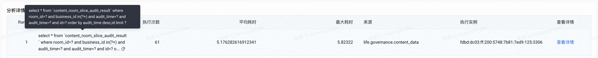
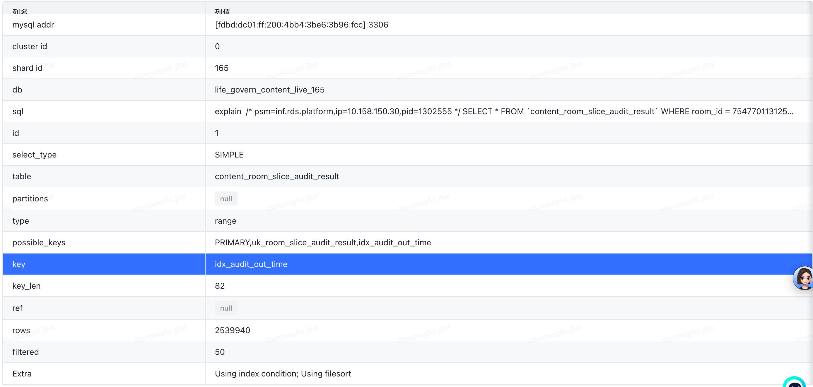
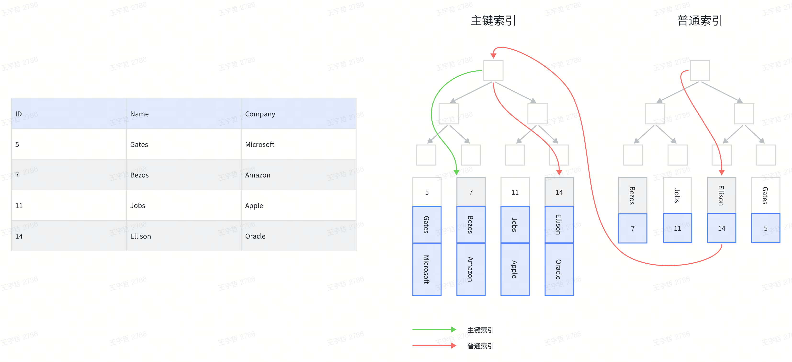
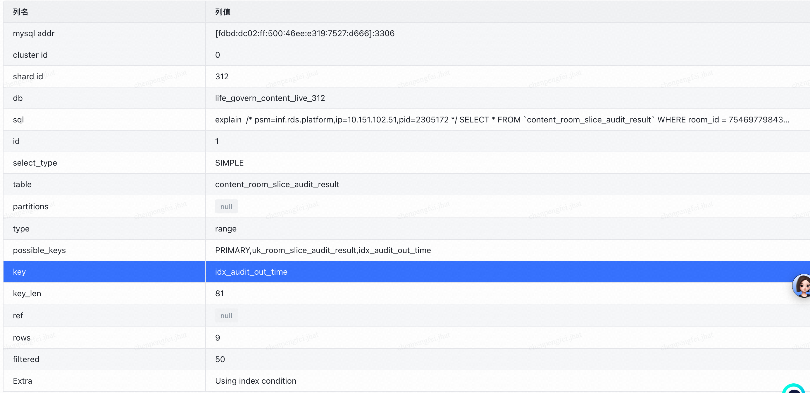

## 先看问题

下面的SQL是否会有慢查询风险？为什么？

```sql
CREATE TABLE `content_room_slice_audit_result` (
  `id` bigint unsigned NOT NULL AUTO_INCREMENT COMMENT '主键id',
  `live_id` bigint unsigned NOT NULL DEFAULT '0' COMMENT '直播业务线ID',
  `room_id` bigint unsigned NOT NULL DEFAULT '0' COMMENT '直播间ID',
  `user_id` bigint unsigned NOT NULL DEFAULT '0' COMMENT '主播ID',
  `start_time` bigint unsigned NOT NULL DEFAULT '0' COMMENT '切片开始时间',
  `end_time` bigint unsigned NOT NULL DEFAULT '0' COMMENT '切片结束时间',
  `object_id` varchar(64) COLLATE utf8mb4_general_ci NOT NULL DEFAULT '0' COMMENT '对象ID',
  `business_id` varchar(16) COLLATE utf8mb4_general_ci NOT NULL DEFAULT '' COMMENT '审核业务线ID',
  `audit_id` varchar(32) COLLATE utf8mb4_general_ci NOT NULL DEFAULT '' COMMENT '审核任务ID',
  `audit_result_stage` varchar(16) COLLATE utf8mb4_general_ci NOT NULL DEFAULT '' COMMENT '审出阶段',
  `status_code` varchar(16) COLLATE utf8mb4_general_ci NOT NULL DEFAULT '' COMMENT '审出状态码',
  `audit_time` datetime(3) NOT NULL COMMENT '审出时间',
  `risk_tags` text COLLATE utf8mb4_general_ci COMMENT '风险标签',
  `create_time` datetime NOT NULL DEFAULT CURRENT_TIMESTAMP COMMENT '创建时间',
  `update_time` datetime NOT NULL DEFAULT CURRENT_TIMESTAMP ON UPDATE CURRENT_TIMESTAMP COMMENT '更新时间',
  PRIMARY KEY (`id`),
  UNIQUE KEY `uk_room_slice_audit_result` (`room_id`,`business_id`,`start_time` DESC,`end_time`),
  UNIQUE KEY `uk_room_slice_object_result` (`object_id`,`business_id`),
  KEY `idx_create_time` (`create_time`),
```

```sql
SELECT * FROM `content_room_slice_audit_result`
WHERE room_id = 7546977984377260854 AND business_id in ('LA09')
AND audit_time < '2025-09-06 22:49:13.476'
AND audit_time > '2025-09-06 22:39:13.476'
AND id > 0
ORDER BY audit_time desc,id LIMIT 10;
```

## 线上情况

content_room_slice_audit_result 单表最多约 2.76 百万行，上述 SQL 能够命中 `idx_audit_out_time` 索引，符合 room_id 条件的数据平均约 240 条。

> 是不是和我有一样的想法：MySQL InnoDB 普通索引是包含主键值的，那么上述 SQL 中 where、order by 使用的字段都已经包含在索引里了，而且 room_id、business_id 都只有一个值，audit_time 排序和索引都是 desc，按理 where 能完全通过索引筛选出符合条件的所有数据，order by 能够直接用索引的排序，采用的还是游标分页，应该很快才对。

但是线上时不时就会出现慢 SQL 告警，从慢 SQL 分析看 Rows_examined 非常高，几乎是全表扫描，是不是很奇怪！






## 原因分析

> 先回答疑问：MySQL InnoDB 普通索引确实包含了主键值，但是用来回表查询的，**并不用于 where 条件过滤和 order by 排序**。



所以慢 SQL 原因如下：

> where id>0 导致回表全表筛选，order by id 导致文件排序，最终导致慢 SQL

```sql
SELECT * FROM `content_room_slice_audit_result`
WHERE room_id = 7546977984377260854 AND business_id in ('LA09')
AND audit_time < '2025-09-06 22:49:13.476'
AND audit_time > '2025-09-06 22:39:13.476'
```

- where 条件中的 `id>0` 无法使用索引 `idx_audit_out_time`，需要回表查询。虽然主键也有索引，但是 id>0 全表数据都满足条件，所以几乎是全表扫描（先筛选符合条件的数据，最后才执行 limit 逻辑，所以虽然最终符合条件的数据不多，但是需要扫描的数据行非常多）
- order by 用到了 `id` 排序也无法使用索引 `idx_audit_out_time`，所以需要筛选完数据之后还需要文件排序

## 优化方案

将 id 显式的加入索引，或者优化 SQL 不使用 id 做分页查询。

```sql
alter table content_room_slice_audit_result
drop index idx_audit_out_time,
add index idx_audit_out_time (room_id, business_id, audit_time DESC, id);
```



## 总结

- 普通索引如果没有显式的指定主键，虽然索引值中隐式的包含了主键值，但是并不会用于 where、order by 等，只是用于回表查询
- **减少回表次数**，注意回表次数等于符合 where 条件的总记录数，与 `limit` 无关
- **避免文件排序**，因为文件排序需要全量处理数据、可能产生磁盘 IO、依赖临时表，这些操作的开销远大于利用索引有序性的直接查询
