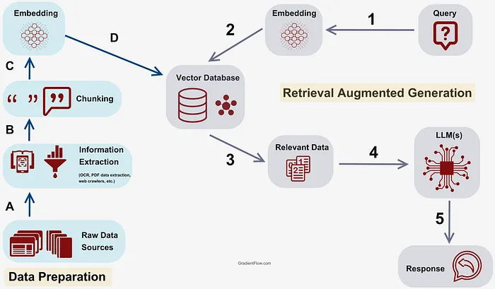
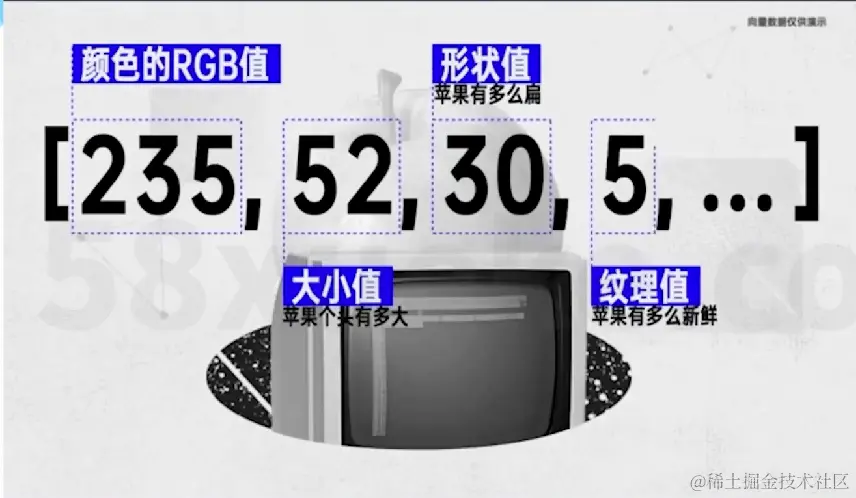
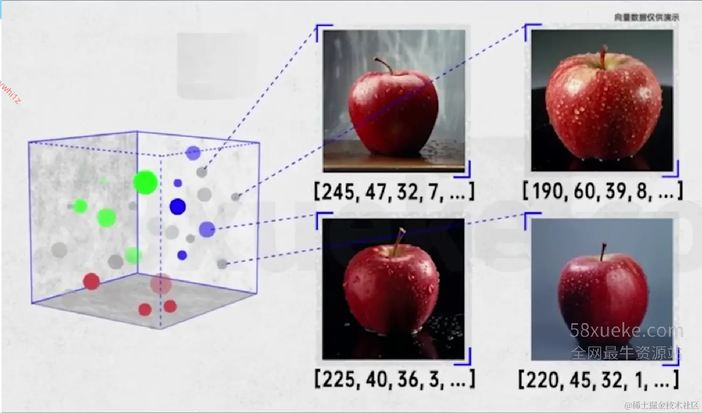
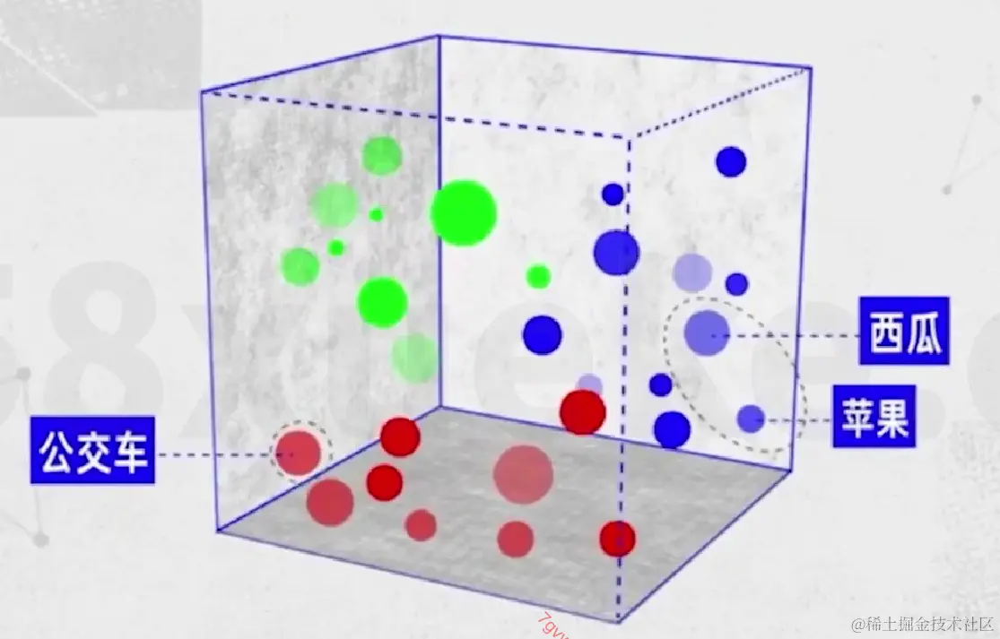

# 什么是RAG

## 常见RAG过程



1. `A->B->C` 是构建知识库（索引）的过程：
   1. 首先要将文本划分成片段，然后将片段转换成向量存储到向量数据库中备用，这个向量就是这段文本语义信息的数字表示
2. `1->2` 是检索的过程：
   1. 将用户查询转换成和知识库一样的向量表示
   2. 与所有文本片段向量进行相似度计算，取出 top k 个片段
3. `3->4->5` 是增强生成的过程：
   1. 将用户查询和 k 个文本片段组织成特定 prompt 格式输入到 LLM 中，生成回复

## 什么是向量（embedding）

在知识库的创建和检索过程中，我们反复提及了向量：向量就是文本语义、多模态信息的数字表示。

 

输入给大模型的词汇都会先转换成向量数据，当训练数据中出现多组类似的语言时在向量数据组成的高维空间相近的词汇就会离的更近，这样大语言模型就可以捕捉到**词汇间的语义和语法**。

比如大模型会很明白苹果、西瓜的语义上接近，但是和公交车相差甚远。



# 为什么需要RAG

## RAG vs 长上下文模型

### 模型上下文有限：为什么不能无限"喂"长文本？

### 长上下文模型的致命缺陷

想象你让一个人同时读完一本百科全书再回答问题，他要么崩溃，要么漏掉重点——**大模型处理超长文本时也是如此**。

| **问题** | **长上下文模型（如GPT-4 128k）** | **RAG（检索增强生成）** |
|---------|--------------------------------|----------------------|
| **输入长度极限** | 物理限制（如128k token≈10万字） | 无硬限制，知识库可无限扩展 |
| **信息处理效率** | 必须全量分析所有内容，算力消耗爆炸 | 只检索相关片段，算力消耗极低 |
| **关键信息丢失风险** | 模型可能"忘记"开头内容（注意力衰减） | 精准定位关键段落，避免信息遗漏 |
| **实际应用场景** | 适合单篇长文分析（如一篇论文） | 适合跨文档、跨数据库的复杂查询 |

### 案例对比

- **长上下文模型**：
  - 输入：一篇10万字的医疗研究报告
  - 问题："第三章节提到的药物副作用是什么？"
  - 结果：模型需从头到尾分析全文，耗时30秒，且可能遗漏细节。
- **RAG**：
  - 输入：同一篇报告存入知识库
  - 问题："第三章节提到的药物副作用是什么？"
  - 结果：检索系统直接定位"第三章节-副作用"段落，模型仅分析该片段，耗时3秒。

### 成本与速度：为什么大厂"卷不动"长上下文？

### 算力成本对比（以GPT-4 API为例）

| **指标** | **长上下文模型（128k）** | **RAG** |
|---------|------------------------|---------|
| **单次请求算力消耗** | 1000单位（全量计算） | 50单位（仅计算相关片段） |
| **响应时间** | 20-60秒（随文本长度非线性增长） | 2-5秒（与文本长度无关） |
| **API成本** | $0.03/千token（输入+输出） | $0.01/千token（输入极简） |
| **典型场景成本** | 分析10万字文档 ≈ $30 | 分析10万字文档 ≈ $1 |

### 为什么厂商放弃"内卷"？

1. **边际效益递减**：
   1. 当上下文超过10万字（≈100k token），模型理解力不再显著提升。
   2. 例如：Claude 3的200k上下文在实际测试中，对后50%内容的召回率下降40%。
2. **RAG的降维打击**：
   1. **成本优势**：如OpenAI仅对API用户开放128k版本，因为普通用户用RAG（+分块检索）就能解决99%需求。
   2. **技术突破**：BGE Landmark embedding等新技术已解决RAG的检索碎片化问题，精度接近长上下文模型。
3. **用户真实需求**：
   1. 99%的场景不需要同时分析整本《哈利波特》，而是快速找到"斯内普教授的结局"。
   2. 多模态时代（如视频处理）可能需要更长上下文，但当前算力成本下，RAG仍是性价比之王。

### 总结

| **维度** | **长上下文模型** | **RAG** |
|---------|----------------|---------|
| **核心优势** | 理论上的完整上下文理解 | 低成本、高效率、灵活扩展 |
| **可解释性** | 模型注意力机制，可解释性差 | 检索过程工程链路可控、可解释的 |
| **致命弱点** | 算力需求高、响应慢、成本高 | 检索精度依赖技术优化（已大幅提升） |
| **适用场景** | 单篇超长文本分析（如法律合同） | 跨文档搜索、实时数据、多领域适配 |

除非未来模型提供更长的上下文，并且降低生成成本和耗时，不然RAG技术还是最适合业务的技术。

## RAG vs SFT

| **维度** | **RAG** | **SFT** |
|---------|---------|---------|
| **知识来源** | 动态检索外部知识库 | 静态依赖预训练+微调数据 |
| **知识更新** | 实时（更换检索库即可） | 需重新收集数据并微调模型 |
| **领域适配成本** | 低（更换检索库） | 高（需领域标注数据+重新训练） |
| **幻觉控制** | 基于检索结果生成，仍有幻觉风险 | 依赖训练数据质量，仍有幻觉风险 |
| **生成速度** | 需要先检索再生成，较慢（取决于rag环节耗时） | 直接生成，速度快 |
| **时间成本** | 初期搭建耗时，长期维护灵活 | 数据标注周期长，更新需重新训练（天级别） |
| **资源成本** | 依赖检索系统和外部存储，计算需求低 | 依赖高性能GPU训练，存储和计算开销大 |
| **金钱成本** | 初期中等投入，长期按需扩展 | 初期高投入（数据+训练），长期更新昂贵 |
| **知识隔离** | 可以同一个模型应用不同知识库 | 需要精调不同模型 |
| **知识泄露风险** | 中（依赖权限管理可靠性） | 低（模型完全独立） |
| **典型应用** | 问答系统、事实核查、实时咨询 | 文本风格迁移、代码生成、创意写作 |

# Retrieval

> 核心目标：从海量知识中快速筛选与用户问题最相关的片段，为生成阶段提供高质量输入

## 【索引阶段】构建知识库

> 如何让知识更易被"精准召回"？

1. **上下文中的指代、时间、人物关系处理**

我们拿到的原始知识稿件可能无法直接被使用，比如：

- 直播录屏中的"`一号链接`"对应什么商品？
- 视频ASR中"`我`""`最近`"去了墨西哥，我是哪个主播？最近是什么时候？
- 视频ASR中"`我的助理`"最近会帮大家进行售后答疑，我的助理是谁？人物关系？

这些模糊的指代需要我们根据业务场景进行消解。

| **问题** | **技术手段** | **具体说明** |
|---------|-------------|-------------|
| **指代消解** | 实体链接（Entity Linking） | 可以结合稿件，获取主播信息，让大模型进行指代替换 |
| **时间明确** | 时间戳嵌入 + 时序检索 | 如果稿件中未提及时间，可以用视频发布时间或者直播时间，让大模型进行时间替换 |
| **人物关系** | 知识图谱（Knowledge Graph） | 可以引入百科、搜索信息，让大模型补充人物关系 |

### 长文档分块（Chunking）

- **为什么分块？**
  - **长文档场景**：
    - 直接处理整篇文档会导致信息过载，模型难以聚焦关键段落。
    - **案例**：一篇50页的直播运营手册中，用户问"如何提升直播间互动率"，只需召回"互动技巧"章节。
  - **抖音作者场景**：
    - 用户评论分散在视频描述、评论区、私信等位置，分块后可按主题（如"穿搭教程""产品售后"）快速定位。

- **分块策略**：

| **方法** | **优点** | **缺点** |
|---------|---------|---------|
| **固定长度** | **实现简单，成本低** | **可能切断语义连贯性** |
| **滑动窗口** | **保留部分重叠上下文** | **存储冗余，检索效率降低** |
| **语义分块** | **按主题/段落自然切分** | **依赖NLP模型，计算成本高** |

- **优化实践**：
  - **动态分块**：结合规则（如标题分割）与模型（如BERT段落分割）。
  - **元数据标记**：为分块添加标签（如"直播话术-开场白""产品参数-续航"），便于快速过滤。

### QA对整理（知识结构化）

- **适用场景**：
  - **直播知识库**：用户高频问题（如"如何开通小黄车？"）可直接匹配预设QA对。
  - **抖音创作者帮助中心**：将零散政策条款转化为"问题-答案"形式，提升召回准确率。
- **优势**：
  - **精准匹配**：直接命中用户意图，避免生成阶段二次推理。
  - **可控性高**：答案经过人工审核，减少模型幻觉风险。
- **案例**：

```plain text
[问题] 直播间被封禁如何申诉？
[答案] 步骤：1. 打开抖音APP→2. 进入「我」→3. 点击「设置」→4. 选择「反馈与帮助」→...
```

QA对提取也可以结合业务上高频Query分析进行，从而增加问题覆盖。

### 知识图谱


