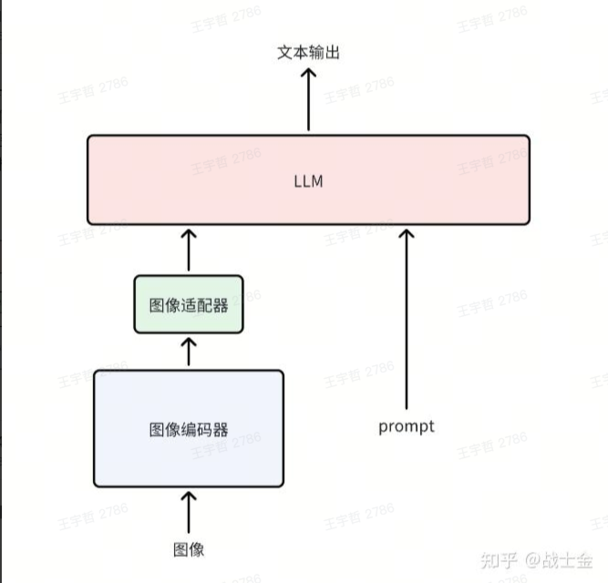
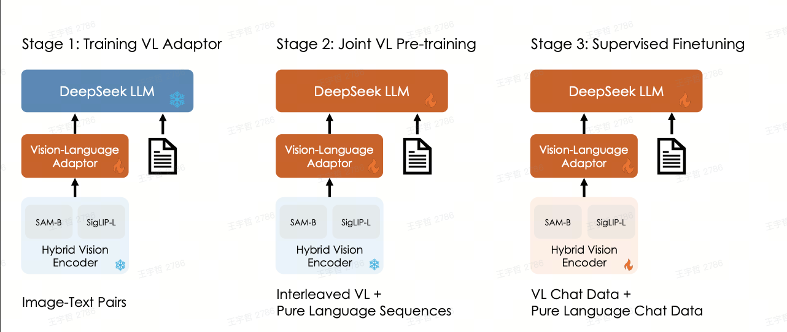

## VLM 是什么？

输入图片 + 文字，输出文字。

> Doubao-vision-pro 图文多模大模型介绍

| 场景 | 场景细分 | 描述 |
| --- | --- | --- |
| **图像内容抽取（OCR）** | 纯文本图像的文字抽取 | 模型能够实现各类包含文本图片的文字内容抽取，如：密集文本图片、文档截图等，并支持格式化输出文本内容 |
|  | 日常图像的文字抽取 | 对日常手机拍摄的图片中，包含的文本文字抽取，如：菜单、路标、证件等 |
|  | 表格图像的内容抽取 | 模型能够识别图表、表格类型图片的文字、数字等内容读取，并支持格式化输出文本内容 |
| **图像问答** | 图片描述 | 描述图片中的内容，包括详细描述、简短描述以及为图像分类 |
|  | 图像内容提问 | 对图片中包含的内容进行提问 |
| **图像创作** | 根据图像内容，创作文案、标题等，如：点评、小红书文案、朋友圈文案等 |  |
| **教育** | 数学题目解答 | 分析题目、考点说明、解题思路、解题结果 |
|  | 数学题目批改 | 对数学题目的回答批改 |
| **代码生成** | 前端页面 | 根据图片引导，绘制前端页面 |
|  | 图表绘制 | 根据图片引导，绘制图表 |

## VLM 怎么训练出来的

我们尝试简单理解，模型是一个有输入输出的函数，其独特之处在于，这个函数不是直接确定的，而是先给定一系列输入输出（训练数据集），以最小化"数据输出与模型输出之间的误差"为目标，设置损失函数，通过数值方法（梯度下降方法），计算出来的函数参数最优解（使损失函数最小的一组函数参数）。

上述这一系列方法叫做统计学习 or 机器学习。

深度学习、多模态、大模型等概念，是在统计学习领域下，对其中的模型结构进行扩展的子领域。

我们尝试解答，VLM 的输入输出是什么？其训练过程是怎么样的。

进一步地，通过解答以上问题，我们尝试回答，为什么 VLM 具有泛化的理解能力，而不仅限于指定的数据集、不仅限于指定的任务？

### 1. 先看看 LLM 是如何训练出来的

LLM 做的事情是预测文字序列的下一个 Token。其输入是文字，输出也是文字。



LLM 有两种训练方式。

- 自回归语言模型："The cat sat on the ___" → 预测 "mat"
- 自编码语言模型："The \[MASK\] sat on the mat" → 预测 "cat"

只需要搜集有质量的文案，不需要再人工打标签。可以喂给模型的数据量指数级增加。

那 VLM 该怎么训练呢？

简单地想，既然输入是图片，输出是文字，我们去搜集图片与其对应的描述，是否可以训练出来 VLM 呢？

事实是，真的有人搜集了足够多的图文对（通过互联网爬虫，抓取了 4 亿图文对），但是发现直接靠图文对来做图片->文字的生成式模型，难度过大。

> 图生文任务（如图像描述生成）需要模型逐字生成连贯文本，这对模型的语言理解能力和序列生成能力提出了极高要求。例如，生成任务需处理语法正确性、语义一致性、多模态对齐等复杂问题，而互联网图文对的文本描述往往存在噪声（如不完整、不准确或重复）。

所以，拿这些图文对做了难度更小的任务。

### 2. CLIP 做了什么？

> [CLIP 论文逐段精读【论文精读】_哔哩哔哩_bilibili](https://www.bilibili.com/video/BV1SL4y1s7LQ/?spm_id_from=333.337.search-card.all.click)



与其通过图片去预测文字，CLIP 做的是，给出图片、文字，预测他们的匹配程度。

CLIP 的训练集是如何构造的？

CLIP 的输入是图片 + 文字，输出是这两者的匹配程度。

CLIP 用于文搜图、图搜文。

### 3. 那 VLM 到底如何训练呢？

图像通过图像编码器（通常为 VIT 结构）生成若干个图像 token embedding，然后使用图像适配器（cross attention、MLP 等）将图像 embedding 对齐到文本 embedding 的空间，和文本 embedding 拼接起来后，输入模型，最后输出文本内容。多模态理解模型的核心仍然是 LLM 和文本，图像编码器更像是一种插件的形式。

### 4. VLM 的应用？

[参考图文字化](https://bytedance.larkoffice.com/docx/V6pcdQGcJoiw4qxCDgucMQxinPb)

### 5. 最后

多模态大模型，（输入是图片 + 文字，输出是图片+文字），是如何训练出来的？
