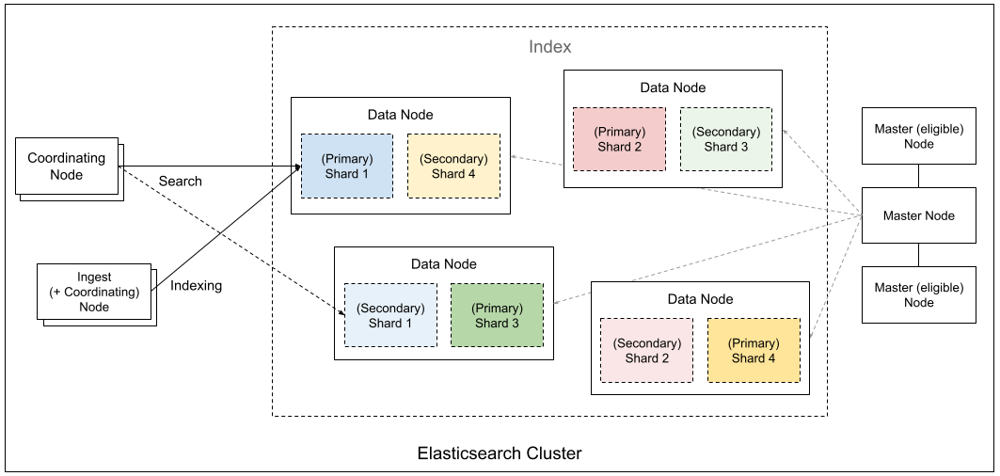
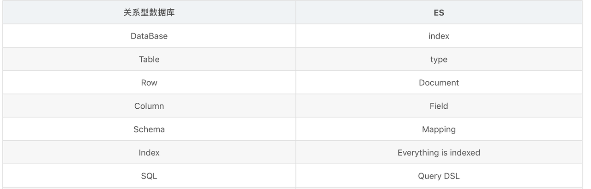

> ES 是一款分布式、RESTful 风格的开源搜索与分析引擎，可实时存储、搜索并分析海量结构化与非结构化数据。

# 一、认识ES

## 1. 问题的起点：当传统数据库面临搜索瓶颈

> 搜索的定义：搜索是通过一个关键词或一段描述,得到你想要的(相关度高)结果。

我们从一个熟悉的场景开始。假设我们有一个帖子表 `posts`，需要实现一个内容搜索功能。

```sql
-- posts table
CREATE TABLE posts (
    id BIGINT PRIMARY KEY,
    user_id BIGINT,
    content TEXT,
    created_at TIMESTAMP
);
```

最直接的方法是使用 SQL 的 `LIKE` 操作：

```sql
SELECT * FROM posts WHERE content LIKE '%elasticsearch%';
```

### 为什么 `LIKE '%...%'` 一般不用？

1. **无法有效利用索引**：`LIKE` 查询以通配符 `%` 开头时，数据库无法使用 B-Tree 索引，必须进行全表扫描（Full Table Scan）。在数据量达到千万甚至上亿级别时，查询延迟会变成一场灾难。
2. **功能局限性**：`LIKE` 只能做简单的字符串匹配。它无法理解词义、处理同义词、或者根据相关性对结果进行排序（比如，"Elasticsearch" 和 "elastic search" 应该被同等对待）。
3. **性能问题**：高并发下的全表扫描会消耗大量数据库 I/O 和 CPU 资源，严重影响核心业务的性能。

面对这些问题，我们需要一个专门为搜索设计的解决方案。这正是 Elasticsearch 的用武之地。而要理解 ES，我们必须先从它的心脏——**Apache Lucene** 开始。（发音['Lusen']）

---

## 2. 核心引擎：Apache Lucene 的数据结构解密

Lucene 是一个用 Java 编写的高性能、功能齐全的文本搜索引擎库。ES 本质上是基于 Lucene 构建的分布式系统。Lucene 的高效源于其独特的数据结构设计。

我们假设要索引的文档结构如下：

```go
// 一个简化的文档对象
type Document struct {
    ID        int64
    Title     string
    Content   string
    Tags      []string
    CreatedAt int64
}
```

### 2.1. 倒排索引 (Inverted Index) - 如何实现快速查找？

倒排索引是 Lucene 最核心的数据结构，也是它实现秒级搜索的关键。它的核心思想是 **"从词到文档"** 的映射。

**构建过程：**

1. **分词 (Tokenization)**：将文档的文本内容（如 `Content` 字段）切分成一个个独立的词（Term）。例如，"I like bytedance" 会被切分为 "i", "like", "bytedance"。
2. **建立映射**：创建一个从 Term 到包含该 Term 的文档 ID 列表的映射。

在代码层面，我们可以这样理解倒排索引：

```go
// PostingList 存储了包含某个 Term 的所有文档信息
type PostingList struct {
    // 文档 ID 列表，是有序的，便于快速求交集和并集
    DocIDs []int64

    // Term 在每个文档中出现的次数（词频），用于相关性评分
    Frequencies []int32

    // Term 在每个文档中出现的位置（偏移量），用于短语查询
    Positions [][]int32
}

// InvertedIndex 是从 Term 到 PostingList 的映射
// 这就是倒排索引的核心结构
type InvertedIndex map[string]PostingList
```

**示例：**

对于以下三个文档：
- `Doc 0`: "I like bytedance"
- `Doc 1`: "I follow bytedance"
- `Doc 2`: "I forward the video"

生成的倒排索引（简化版）如下：

```json
{
    "i":       { "DocIDs": [0, 1, 2] },
    "like":    { "DocIDs": [0] },
    "bytedance": { "DocIDs": [0, 1] },
    "follow":  { "DocIDs": [1] },
    "forward": { "DocIDs": [2] },
    "the":     { "DocIDs": [2] },
    "video":   { "DocIDs": [2] }
}
```

**为什么快？** 当搜索 "bytedance" 时，我们不再需要遍历所有文档。我们直接在 `InvertedIndex` 这个 `map` 中查找 "bytedance" 这个 key，时间复杂度是 O(1)，瞬间就能得到文档列表 `[0, 1]`。

**Term Dictionary 和 Term Index**

当 Term 数量巨大时（上亿级别），将整个 `InvertedIndex` 的 key（即 Term Dictionary）放入内存是不现实的。Lucene 采用了一种叫 **FST (Finite State Transducer)** 的数据结构来压缩 Term Dictionary，并为其创建一个 `Term Index`。这个 `Term Index` 像一本书的目录，体积很小，可以常驻内存，它能帮助我们快速定位到 Term 在磁盘上 Term Dictionary 中的位置。

### 2.2. Stored Fields - 如何取回原文？

倒排索引只解决了"找到哪些文档"的问题。但我们最终需要返回给用户的是完整的文档内容。`Stored Fields` 就是为此而生。它是一个简单的行式存储，通过文档 ID 直接获取原始文档。

可以将其理解为一个 `map`：

```go
// StoredFields 是从文档 ID 到原始文档数据的映射
// value 可以是原始的 JSON 字符串或者二进制数据
type StoredFields map[int64][]byte
```

当搜索完成，得到 `DocIDs` 后，Lucene 会用这些 ID 去 `Stored Fields` 中拉取原始数据。这是一个典型的 **"行式存储"**，按行读取效率高。

### 2.3. Doc Values - 如何实现高效排序和聚合？

搜索结果往往需要排序（如按时间 `CreatedAt` 排序）或聚合（如按 `Tags` 分组统计）。如果每次都从 `Stored Fields` 中解析整个文档再提取排序/聚合字段，会非常慢，因为这涉及大量的随机磁盘 I/O。

`Doc Values` 通过 **"列式存储"** 解决了这个问题。在索引时，它会把特定字段的所有值连续存放在一起。

```go
// DocValues 可以理解为按字段组织的列式存储
type DocValues map[string]Column

// Column 代表一个字段在所有文档中的值
// interface{} 可以是 []int64, []string 等具体类型
type Column interface{}

// 示例：
var docValues = map[string]Column{
    // 将所有文档的 CreatedAt 字段值连续存储
    "CreatedAt": []int64{1672502400, 1672502401, 1672502402, ...},
    // 将所有文档的 Tags 字段值也连续存储
    "Tags": [][]string{{"go", "es"}, {"java"}, {"go", "redis"}, ...},
}
```

**为什么快？** 当需要按 `CreatedAt` 排序时，Lucene 只需一次性顺序读取 `docValues["CreatedAt"]` 这个数组，这个操作对操作系统和磁盘都极其友好（利用了文件系统缓存和顺序读的高性能）。聚合操作同理。这是典型的用空间换时间，以列存换取分析性能。

### 2.4. Segment - 不可变的最小索引单元

Lucene 将上述数据结构（Inverted Index, Stored Fields, Doc Values 等）打包成一个独立的、自包含的索引单元，称为 **Segment**。

**关键特性：Segment 是不可变的（Immutable）。**

- **写入**：新的文档会被写入一个新的 Segment。
- **删除**：不会直接从旧 Segment 中删除数据，而是通过一个 `.del` 文件标记某个文档已删除。
- **更新**：本质是"删除 + 新增"，旧文档在旧 Segment 中被标记为删除，新文档写入新 Segment。

**为什么不可变？**

1. **并发性能**：无需处理复杂的并发写锁，读操作可以持续进行，不会被阻塞。
2. **缓存友好**：因为数据不会改变，可以被操作系统文件系统缓存（Filesystem Cache）积极缓存，极大地提升了访问速度。
3. **数据安全**：减少了数据损坏的风险。

**Segment Merging** 随着写入增多，Segment 数量会不断增加，这会消耗文件句柄并降低搜索速度（因为需要查询所有 Segment）。Lucene 会在后台自动执行 **段合并 (Segment Merging)**，将多个小的 Segment 合并成一个大的 Segment，从而控制 Segment 的总数。

至此，我们有了一个功能完备的单机搜索引擎库。但如何应对海量数据和高可用的挑战呢？这就是 Elasticsearch 发挥作用的地方。

---

## 3. 从 Lucene 到 Elasticsearch：构建分布式系统

Elasticsearch 将 Lucene 的单机能力扩展为一套完整的分布式解决方案。它实现了三个核心特性：**高性能、高可扩展性、高可用**。

### 3.1. 分片 (Sharding)

**痛点**：单个节点的磁盘容量、CPU 和内存始终是有限的。当索引数据量超过单机承载能力时，系统就会崩溃。

**解决方案**：水平分片。Elasticsearch 将一个大的索引（Index）分割成多个小的部分，每个部分称为一个 **分片 (Shard)**。

**关键点：一个 Shard 本质上就是一个功能完备、独立的 Lucene 实例。**

**路由机制**：当一个新文档需要被索引时，ES 如何决定它应该存到哪个 Shard？

ES 的路由机制将数据和负载分散到多个节点，所以具备水平扩展性。

### 3.2. 副本 (Replication)

**痛点**：如果某个节点宕机，那么该节点上的所有 Shard 都会丢失，服务将不可用。这是单点故障。

**解决方案**：为每个 Shard 创建一个或多个副本（Replica）。

- **主分片 (Primary Shard)**：每个索引的主分片数量在创建时固定。写请求必须先在主分片上成功。
- **副本分片 (Replica Shard)**：是主分片的完整拷贝。主分片完成写入后，会将数据同步到所有副本分片。

**带来的好处**：

1. **高可用 (High Availability)**：如果持有主分片的节点宕机，ES 会从其副本中选举出一个新的主分片，整个过程对用户透明，服务不中断。
2. **读性能扩展 (Read Scalability)**：搜索请求可以同时在主分片或任一副本分片上执行，从而将读请求的负载分摊到更多机器上。

### 3.3. 节点角色 (Node Roles)



**痛点**：在大型集群中，不同节点承担的职责差异巨大。如果所有节点都做同样的事情，会导致资源浪费和管理混乱。

**解决方案**：角色分离。ES 允许为节点分配特定角色。

- **Master-eligible Node**：负责集群管理，如创建/删除索引、维护节点状态、决定分片分配。一个集群只有一个 active Master。
- **Data Node**：负责存储数据和执行数据相关操作（CRUD、搜索、聚合）。这是 CPU、内存和 I/O 的消耗大户。
- **Ingest Node**：负责在文档索引前进行预处理（如添加字段、转换格式）。
- **Coordinating Node**：智能负载均衡器。接收客户端请求，转发到相应的数据节点，并聚合结果返回给客户端。不处理数据，不管理集群，是轻量级的"路由器"。

在小型集群中，一个节点可以身兼数职。但在大型集群中，角色分离可以让我们根据不同角色的负载情况，独立地扩展特定类型的节点，实现更精细化的资源管理。

---

## 4. 核心工作流：写入与搜索

### 4.1. 写入流程

1. 客户端发送写入请求到一个节点（该节点即为本次请求的协调节点）。
2. 协调节点根据 `hash(_id) % num_primary_shards` 计算出文档应属的主分片。
3. 协调节点将请求转发到持有该主分片的 **Data Node**。
4. 主分片执行写入操作（即在 Lucene 中创建一个新 Segment 或标记旧文档为删除）。
5. 成功后，主分片将数据变更并行转发给所有的副本分片。
6. 所有副本分片确认写入成功后，向主分片返回确认。
7. 主分片向协调节点返回成功。
8. 协调节点向客户端返回成功。

### 4.2. 搜索流程 (Query Then Fetch)

搜索分为两个阶段：

**Phase 1: Query (查询阶段)**

1. 客户端发送搜索请求到一个节点（协调节点）。
2. 协调节点将查询广播到该索引涉及的 **所有分片**（主分片或副本分片均可）。
3. 每个分片在其本地的 Lucene 实例上执行查询，并将结果（仅包含文档 ID 和相关性得分 `_score`）返回给协调节点。
4. 协调节点收集所有分片的结果，进行全局排序和排名，选出 Top N（例如，`from: 0, size: 10`）。

**Phase 2: Fetch (取回阶段)**

1. 协调节点根据 Top N 结果中的文档 ID，识别出这些文档实际存储在哪些分片上。
2. 协调节点向这些特定的分片发起 `GET` 请求，以取回文档的原始内容（从 `Stored Fields` 中获取）。
3. 各分片返回完整的文档。
4. 协调节点整合所有文档，最终返回给客户端。

这种两阶段设计避免了在分片节点之间传输大量原始文档数据，极大地节省了网络带宽和协调节点的内存。

---

## 5. 结论

| 特性 | RDBMS (MySQL with `LIKE`) | Elasticsearch |
|------|---------------------------|---------------|
| **核心数据结构** | B-Tree / B+Tree | **Inverted Index** |
| **查询语言** | SQL | JSON-based DSL (Query DSL) |
| **数据模型** | 严格的表结构 (Rigid Schema) | 灵活的 JSON 文档 (Schema-flexible) |
| **核心优势** | 事务 (ACID), 强一致性 | **全文检索**, **相关性排序**, **聚合分析** |
| **典型场景** | OLTP, 业务核心数据存储 | **站内搜索**, **日志分析 (ELK)**, **指标监控 (Metrics)** |

**总结：**

- **不要用 ES 当作主数据库**：它为搜索和分析而生，缺乏事务支持和 Join 能力。
- **ES 是数据库的完美补充**：当你的应用需要强大的全文搜索、复杂的聚合分析或处理海量日志/指标时，将数据从主数据库（如 MySQL, PostgreSQL）同步到 Elasticsearch 是一个非常成熟和高效的架构模式。

## ES与关系型数据库的概念对应关系



# 二、安装与设置

使用 Docker 是最简单、最快捷的安装和运行 Elasticsearch 的方式。

## 2.1 使用 Docker 安装

### 1. 拉取 Elasticsearch 镜像

```bash
docker pull elasticsearch:7.12.1
```

### 2. 运行 Elasticsearch 容器

执行以下命令来启动一个单节点的 Elasticsearch 实例：

```bash
docker run -d \
    --name es01 \
    -p 9200:9200 \
    -p 9300:9300 \
    -e "discovery.type=single-node" \
    elasticsearch:7.12.1
```

### 3. 验证安装

安装启动后，可以通过 `curl` 命令或直接在浏览器中访问 `http://localhost:9200` 来验证 ES 是否成功运行。

```bash
curl http://localhost:9200
```

如果一切正常，你将会看到类似下面的 JSON 响应啦，其中包含了集群名称、版本等信息：

```json
{
  "name" : "d63cb5745434",
  "cluster_name" : "docker-cluster",
  "cluster_uuid" : "PlCuuyNNRl2HGvWos__Qmg",
  "version" : {
    "number" : "7.12.1",
    "build_flavor" : "default",
    "build_type" : "docker",
    "build_hash" : "3186837139b9c6b6d23c3200870651f10d3343b7",
    "build_date" : "2021-04-20T20:56:39.040728659Z",
    "build_snapshot" : false,
    "lucene_version" : "8.8.0",
    "minimum_wire_compatibility_version" : "6.8.0",
    "minimum_index_compatibility_version" : "6.0.0-beta1"
  },
  "tagline" : "You Know, for Search"
}
```

## 2.2 (可选) 安装 Kibana

Kibana 是一个强大的 Elasticsearch 数据可视化和管理工具。同样，我们可以使用 Docker 来安装它。

### 1. 拉取 Kibana 镜像

```bash
docker pull kibana:7.12.1
```

### 2. 运行 Kibana 容器

```bash
docker run -d \
    --name kibana01 \
    --link es01:elasticsearch \
    -p 5601:5601 \
    kibana:7.12.1
```

### 3. 访问 Kibana

启动后，在浏览器中访问 `http://localhost:5601` 即可打开 Kibana 界面。
