## 前言

GC是面试里的老八股文了，提起GC，很多人心里会发怵，但好好准备一番后，弄清其中的来龙去脉，在面试的过程中，往往能够舌灿莲花。今天特地梳理了一下GC的相关知识点，相信在各位道友看完后，也可以对面试官提出的GC问题，灰常自信的娓娓道来...

## 背景知识

### 什么是GC？

**垃圾回收（Garbage Collection，缩写为GC）**，是一种自动内存管理机制。

即我们在程序中定义一个变量后，会在内存中开辟相应空间进行存储。当不需要此变量后，需要手动销毁此对象，并释放内存。而这种对不再使用的内存资源进行自动回收的功能即为垃圾回收。

### GC相关术语

在对GC开始讲解之前，有很多关于GC的行话，先普及一下，不然后文读起来会稍微有点懵。

- **赋值器（Mutator）**：说白了就是你写的程序代码，在程序的执行过程中，可能会改变对象的引用关系，或者创建新的引用。

- **回收器（Collector）**：垃圾回收器的责任就是去干掉那些程序中不再被引用的对象。

- **STW（Stop The World）**：GC期间某个阶段会停止所有的赋值器，中断你的程序逻辑，以确定引用关系。

  > **为什么需要STW？** 举个生动的例子：想象一个幼儿园老师要统计孩子们的手牵手情况。如果孩子们在统计过程中还在跑来跑去，改变牵手关系，那统计结果就不准确了。所以老师需要先让所有孩子"定格"（STW），然后进行统计。在GC中也是如此，如果程序在标记过程中还在改变对象引用关系，就可能导致应该存活的对象被误删除。

- **Root对象**：根对象是指赋值器不需要通过其他对象就可以直接访问到的对象，通过Root对象，可以追踪到其他存活的对象。常见的root对象有：
  - **全局变量**：程序在编译期就能确定的那些存在于程序整个生命周期的变量。
  - **执行栈**：每个goroutine（包括main函数）都拥有自己的执行栈，这些执行栈上包含栈上的变量及堆内存指针。

> **易混淆点解释**：很多人分不清栈内存和堆内存的对象。简单记住：
> - **栈内存**：函数内的局部变量，作用域有限，函数结束就释放
> - **堆内存**：通过new、make等分配的内存，需要GC来回收

## Go的GC发展演变史

### v1.3 - 标记清除法

标记清除法主要包含两个步骤：

1. **标记**
2. **清除**

#### 算法流程示例

**第一步：开启STW，停止程序的运行**

图中是本次GC涉及到的root节点和相关对象：

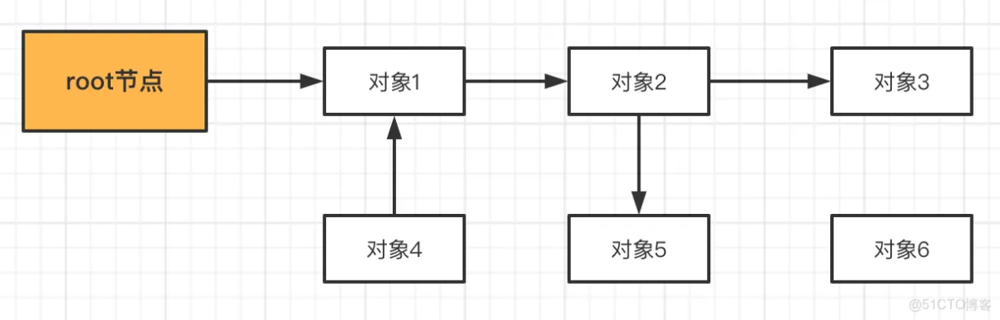

**第二步：从根节点出发，标记所有可达对象**

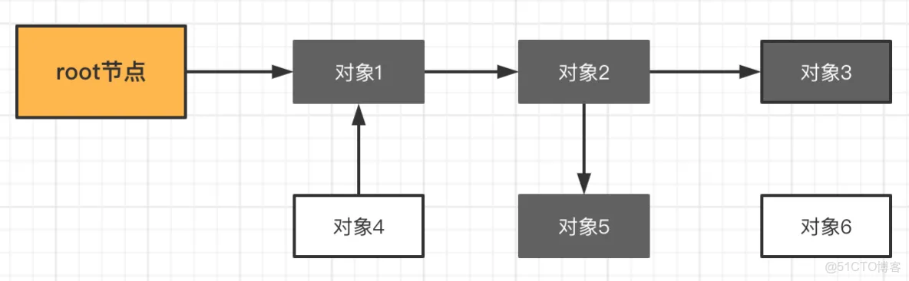

**第三步：停止STW，回收所有未被标记的对象**

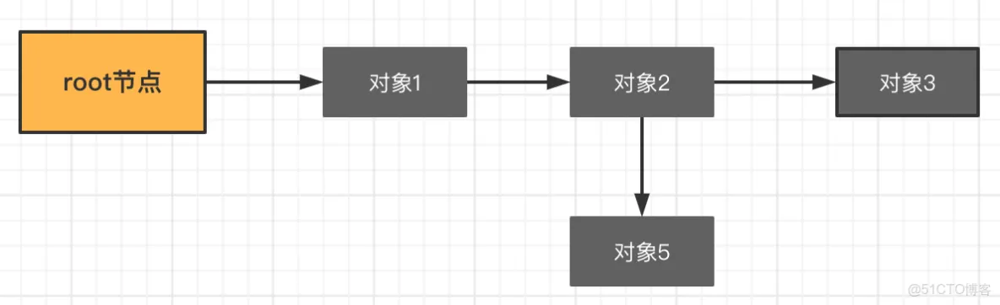

#### 标记清除法的弊端

标记清除法的最大弊端就是在整个GC期间需要STW，将整个程序暂停。因为如果不进行STW的话，会出现已经被标记的对象A，引用了新的未被标记的对象B，但由于对象A已经标记过了，不会再重新扫描A对B的可达性，从而将B对象当做垃圾回收掉。

说实话这种全程STW的GC算法真的是如过街老鼠，人见人打...好家伙，让我程序停下来，专门去做垃圾回收这件事，在追求高性能的今天，很难有人可以接受这种性能损耗。

所以Golang团队这个时期就开始专注于如何能提升GC的性能，这里希望各位道友能明白Golang团队对GC算法优化的方向是什么，或者目标是什么，那就是**让GC和用户程序可以互不干扰，并发进行**。所以才有了后面的三色标记法。

### v1.5 - 三色标记法

#### 算法流程

**第一步：初始时，所有对象被标记为白色**

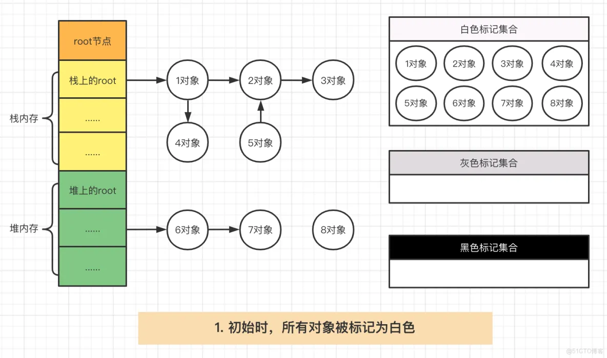

**第二步：GC开始，遍历rootset，将直接可达的对象标记为灰色**

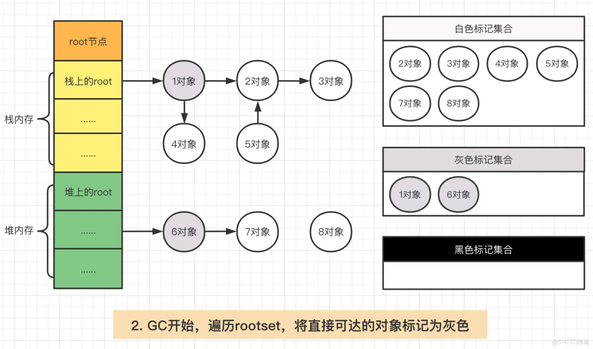

**第三步：遍历灰色对象，将直接可达的对象标记为灰色，并将自身标记为黑色**

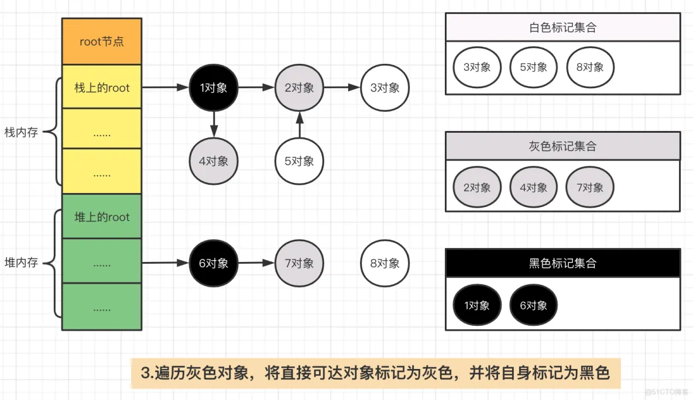

**第四步：重复第三步，直到灰色对象为空，也就是标记完所有对象**

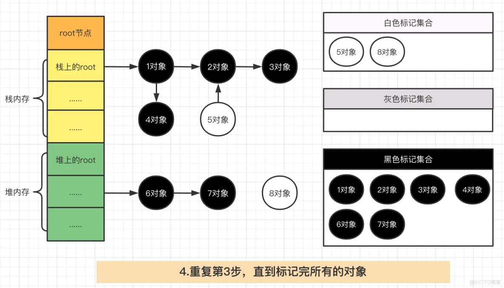

**第五步：停止STW，回收所有白色对象**

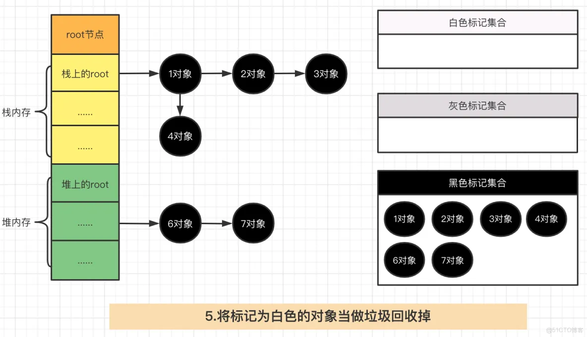

> **三色含义详解**：
> - **白色**：未被访问的对象，可能是垃圾，最终会被回收
> - **灰色**：已被访问但其引用的对象还没有全部访问完，相当于"待处理队列"
> - **黑色**：已访问且其引用的对象也全部访问完毕，确定存活的对象

#### 三色标记法的问题

对于上述的三色标记法来讲，仍然需要依赖STW的。因为如果不暂停程序，程序的逻辑改变对象引用关系，这种动作如果在标记阶段做了修改，会影响标记结果的正确性。我们举一个场景：

**问题场景演示：**

1. 对象2标记为灰色，对象2引用了对象3：

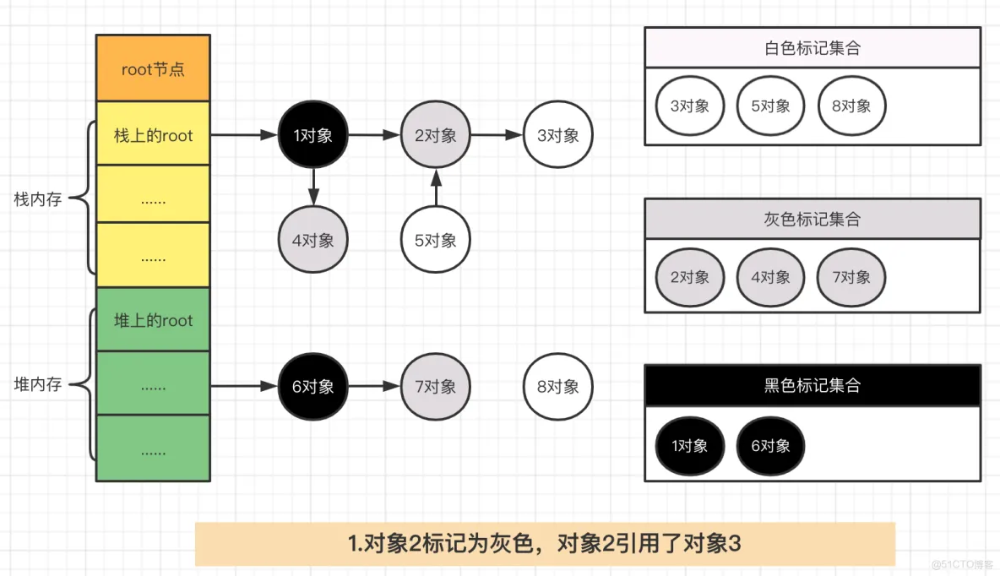

2. 黑色对象6创建了一个指针，指向了对象3：

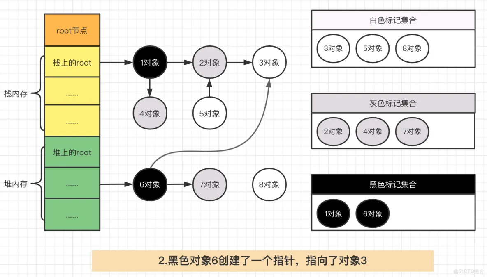

3. 对象2删除了对象3的引用：

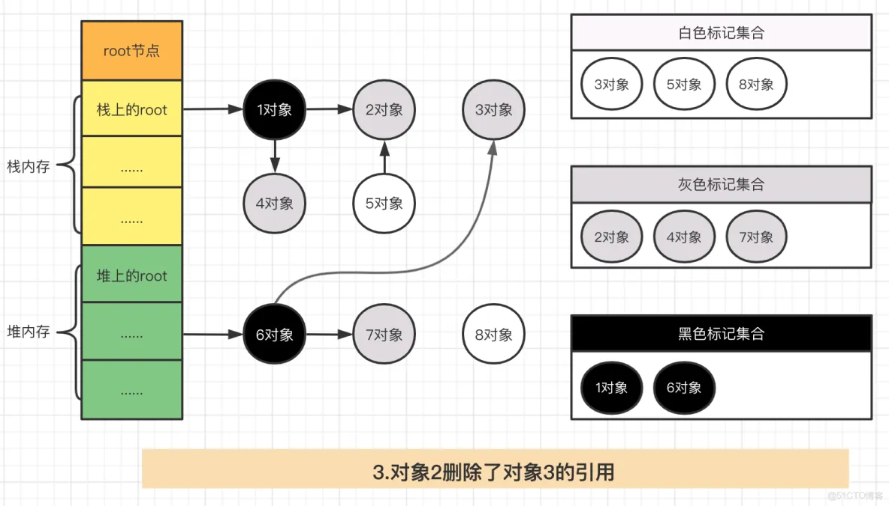

4. 由于对象6不会再进行扫描，3对象一直会是白色标记，最后会被当做垃圾回收掉：

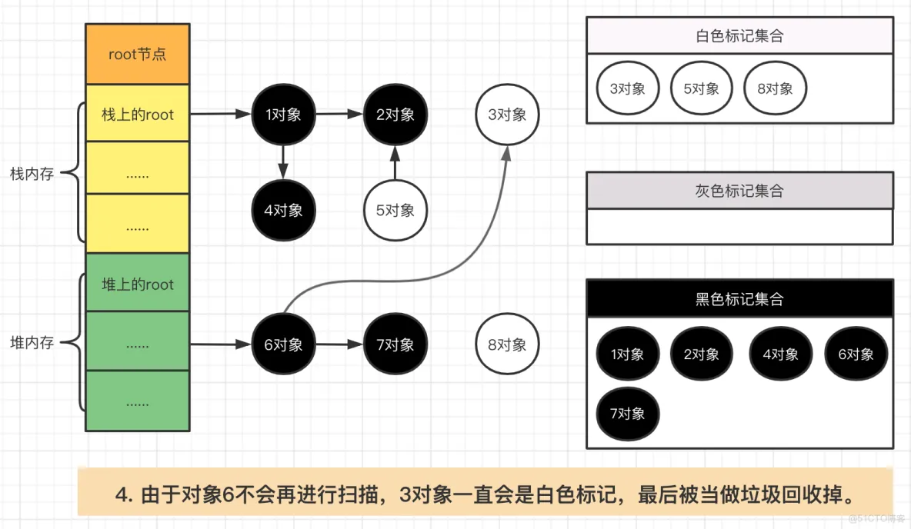

> **这个问题为什么会发生？**
> 因为对象6已经是黑色，按照算法规则，黑色对象不会再被扫描。当对象6新增对对象3的引用，而对象2又删除了对对象3的引用时，对象3就"失联"了——没有任何灰色对象能发现它，但它实际上还被黑色对象6引用着，应该存活。

好，那我们接着说，Golang是如何解决这个STW问题的呢？

#### 对象丢失的条件分析

其实总结来看，在三色标记法的过程中对象丢失，需要同时满足下面两个条件：

- **条件一**：白色对象被黑色对象引用
- **条件二**：灰色对象与白色对象之间的可达关系遭到破坏

看来只要把上面两个条件破坏掉一个，就可以保证对象不丢失，所以我们的golang团队就提出了两种破坏条件的方式：**强三色不变式**和**弱三色不变式**。

> **为什么需要同时满足两个条件？**
> - 如果只满足条件一，但灰色对象还能到达白色对象，那么在后续扫描中还能发现这个白色对象
> - 如果只满足条件二，但白色对象没有被黑色对象引用，那么这个白色对象本来就应该被回收
> - 只有两个条件同时满足，才会出现"应该存活但被误删"的情况

## 两种不变式

### 强三色不变式

**规则**：不允许黑色对象引用白色对象

**破坏条件**：破坏了条件一 - 白色对象被黑色对象引用

**解释**：如果一个黑色对象不直接引用白色对象，那么就不会出现白色对象扫描不到，从而被当做垃圾回收掉的尴尬：

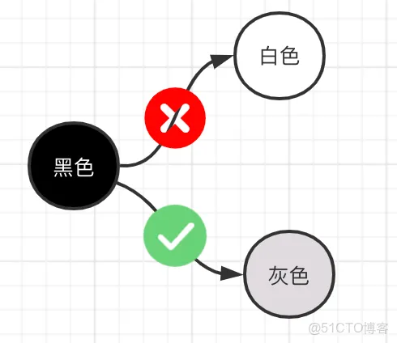

> **通俗理解**：就像班级里，"已完成作业的同学"（黑色）不能直接帮助"未开始作业的同学"（白色），必须通过"正在做作业的同学"（灰色）来传递帮助。

### 弱三色不变式

**规则**：黑色对象可以引用白色对象，但是白色对象的上游必须存在灰色对象

**破坏条件**：破坏了条件二 - 灰色对象与白色对象之间的可达关系遭到破坏

**解释**：如果一个白色对象的上游有灰色对象，则这个白色对象一定可以扫描到，从而不被回收：

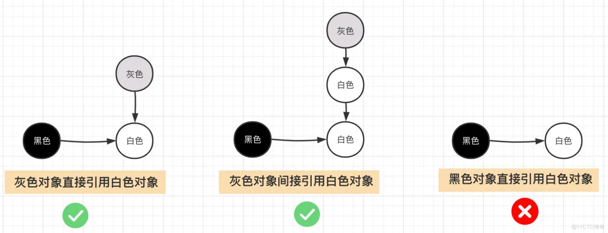

> **通俗理解**：允许"已完成作业的同学"（黑色）直接帮助"未开始作业的同学"（白色），但必须保证有"正在做作业的同学"（灰色）也能联系到这个"未开始作业的同学"，这样就有双重保障。

## 屏障机制

Golang团队遵循上述两种不变式提到的原则，分别提出了两种实现机制：**插入写屏障**和**删除写屏障**。

> **什么是写屏障？**
> 写屏障可以理解为在程序修改指针时自动执行的一小段代码，它会拦截这些修改操作，并执行一些额外的标记工作。就像门卫一样，监控所有的"引用关系变更"。

### 插入写屏障

**规则**：当一个对象引用另外一个对象时，将另外一个对象标记为灰色。

**满足**：强三色不变式。不会存在黑色对象引用白色对象

**重要提示**：插入屏障仅会在堆内存中生效，不对栈内存空间生效，这是因为go在并发运行时，大部分的操作都发生在栈上，函数调用会非常频繁。数十万goroutine的栈都进行屏障保护自然会有性能问题。

> **为什么栈不用屏障？**
> 1. **性能考虑**：栈操作极其频繁，每个函数调用都涉及栈操作
> 2. **并发数量**：Go程序可能有数十万个goroutine，每个都有自己的栈
> 3. **开销太大**：如果每个栈操作都要写屏障，性能损失巨大

#### 插入写屏障机制示例

下面我们看看插入写屏障机制，在插入写屏障机制下是如何保护对象不丢失的：

1. 对象2标记为灰色，对象2引用了对象3：

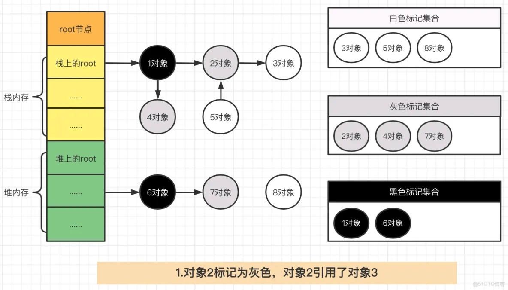

2. 黑色对象6创建了一个指针，指向了对象3，由于插入写屏障，对象3变成灰色：

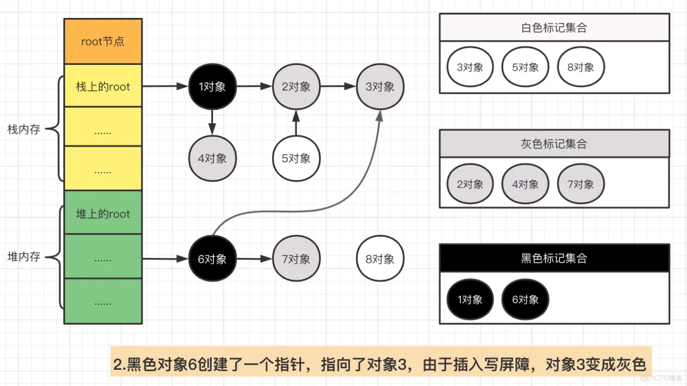

3. 对象2删除了对象3的引用：

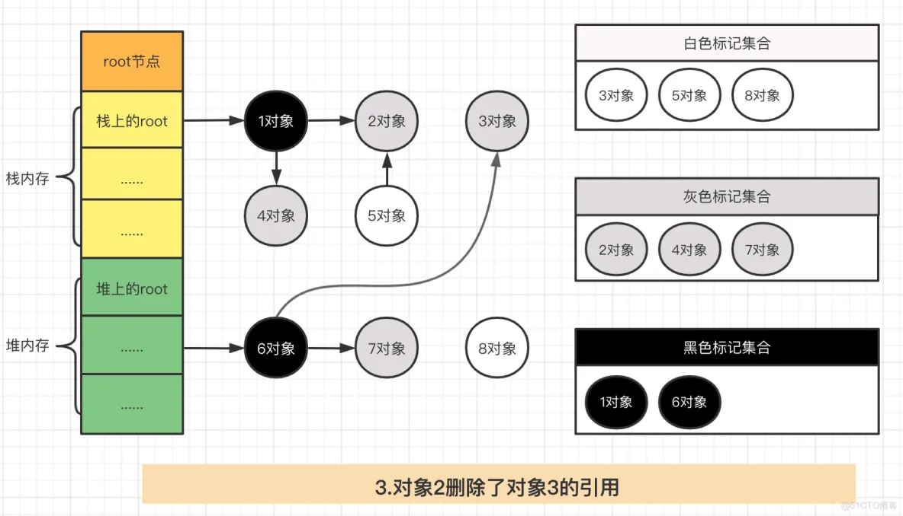

可以发现，对象3在插入写屏障机制下，得到了保护，但是由于栈上的对象没有插入写机制，在扫描完成后，仍然可能存在栈上的白色对象被黑色对象引用，所以在最后需要对栈上的空间进行STW，防止对象误删除。如下所示：

4. 为黑色对象1新引用对象9，由于对象1在栈区，不会触发插入写屏障机制：

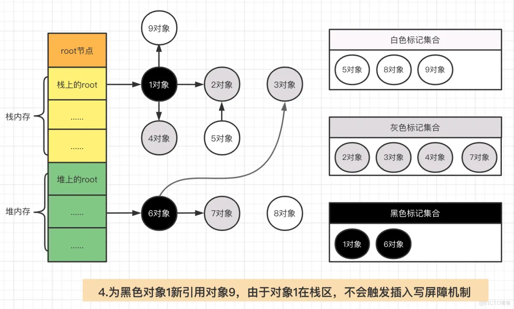

5. 对栈空间进行STW保护：

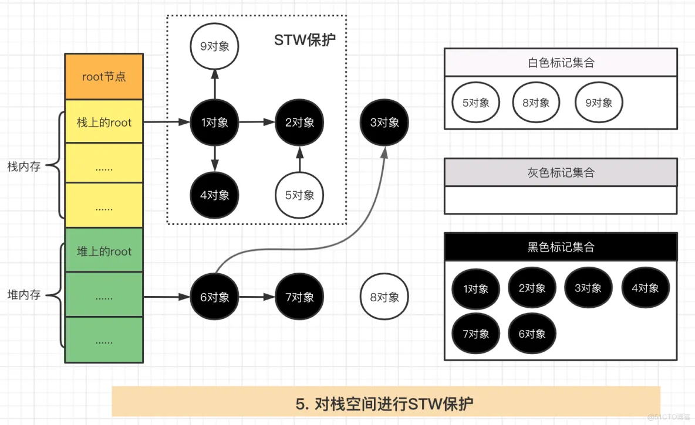

6. 对栈空间重新进行扫描，将对象9标记为了黑色，最后垃圾回收白色标记的对象5和8，符合预期：

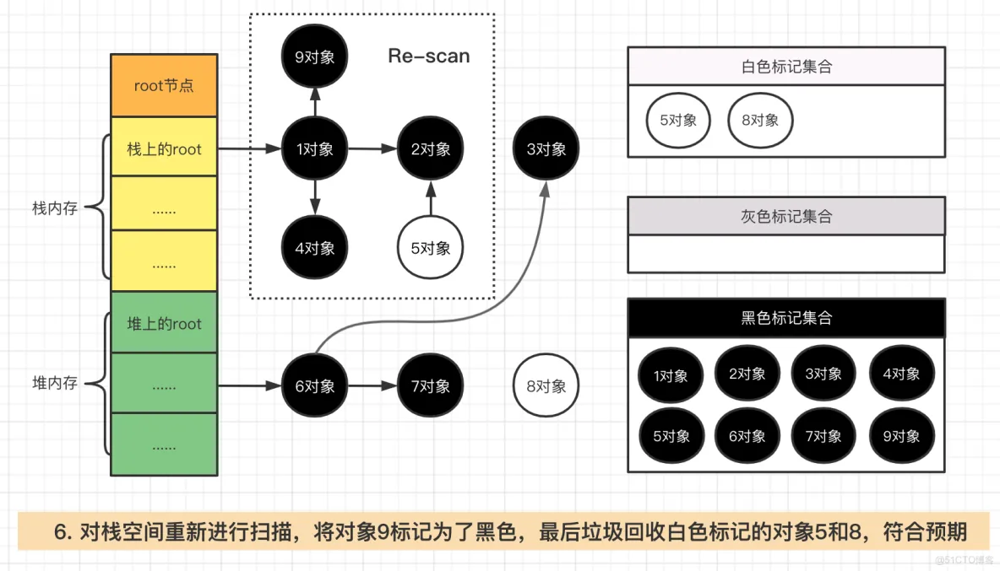

#### 插入写屏障的弊端

对于插入写屏障来讲，插入写屏障最大的弊端就是，在一次正常的三色标记流程结束后，需要对栈上重新进行一次STW，然后再rescan一次。

> **插入写屏障的问题**：虽然大部分时间可以并发标记，但最后还是需要STW来处理栈，这依然会造成程序暂停。

### 删除写屏障

**规则**：在删除引用时，如果被删除引用的对象自身为灰色或者白色，那么被标记为灰色。

**满足**：弱三色不变式。灰色对象到白色对象的路径不会断

**解释**：白色对象始终会被灰色对象保护

#### 删除写屏障机制示例

下面我们看看在删除写屏障机制下是如何保护对象不丢失的：

1. 对象2标记为灰色，对象2引用了对象3：

2. 黑色对象6引用了对象3：

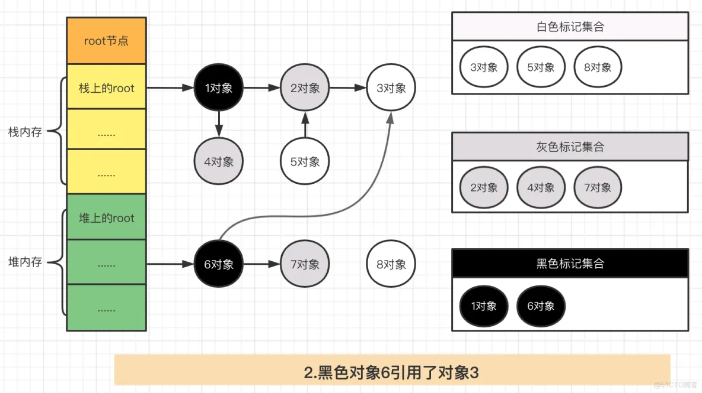

3. 灰色对象2去掉了对象3的引用，触发删除写屏障，将对象3标记为灰色：

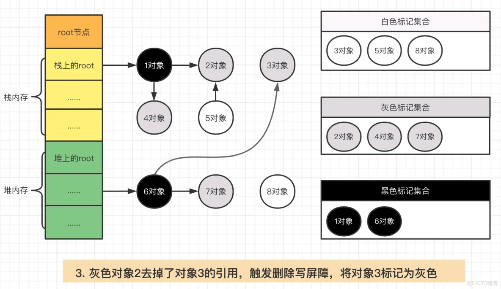

4. 遍历完所有可达对象后，回收了白色对象5和8，符合预期：

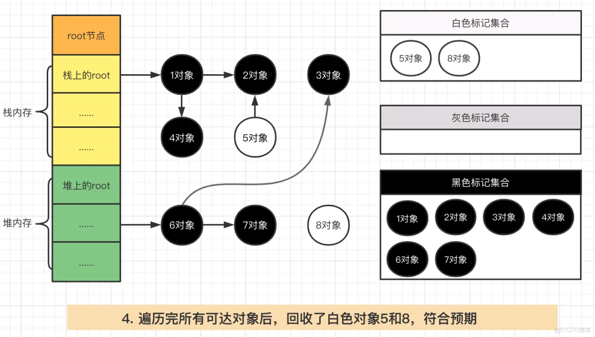

#### 删除写屏障的弊端

但是引入删除写屏障，有一个弊端，就是一个对象的引用被删除后，即使没有其他存活的对象引用它，它仍然会活到下一轮。如此一来，会产生很多的冗余扫描成本，且降低了回收精度。

**举例说明：**

如下图：
1. 对象1为黑色，对象2为灰色，对象3...n为白色，1引用2，2引用3，...，n-1引用n
2. 对象2删除了对象3的引用
3. 触发删除屏障机制，对象3标灰
4. 冗余扫描对象3到对象n，且GC完成后均被保留下来，降低了回收精度

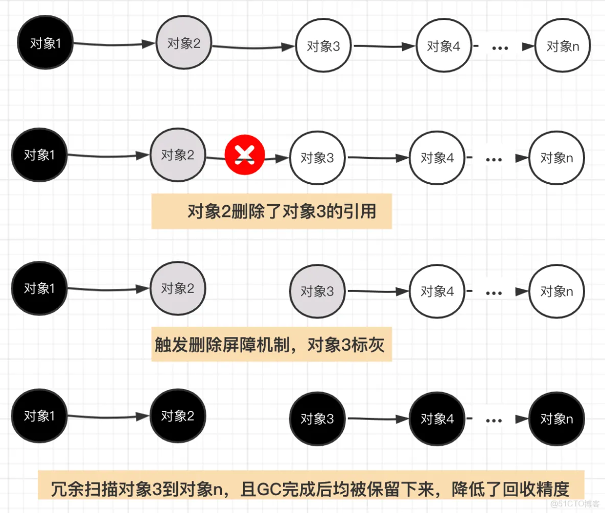

> **删除写屏障的问题**：它过于"保守"，宁愿多留一些垃圾到下次GC，也不愿意误删有用对象。这导致内存回收不够及时。

### 小结

从上面示例来看，插入写屏障机制和删除写屏障机制中任一机制均可保护对象不丢失。在V1.5的版本中采用的是插入写机制实现。

**对比插入写屏障和删除写屏障**：

| 屏障类型 | 优点 | 缺点 | 适用场景 |
|---------|------|------|----------|
| 插入写屏障 | 回收精度高，能及时回收垃圾 | 最后需要STW重扫栈 | 写入操作较多的场景 |
| 删除写屏障 | 不需要重扫栈，减少STW时间 | 回收精度低，产生浮动垃圾 | 删除操作较多的场景 |

## v1.8 - 混合写屏障机制

讲到这里，如果是你，你会怎么做呢？当然是取其精华，去其糟粕啦...没错，Golang团队，正是结合了这两点，在v1.8版本下引入了**混合写屏障机制**。

### 混合屏障机制的核心定义

1. **GC刚开始的时候，会将栈上的可达对象全部标记为黑色。**

2. **GC期间，任何在栈上新创建的对象，均为黑色。**

   > **为什么这样做？**
   > 因为栈操作太频繁，与其在每次栈操作时都用写屏障（性能损失大），不如在GC开始时一次性把栈上的对象都标记为黑色。这样既避免了频繁的写屏障，也确保栈上对象不会被误删。

3. **堆上被删除的对象标记为灰色**

4. **堆上新添加的对象标记为灰色**

### 混合写屏障机制的示例

下面我们看看混合写屏障机制的示例：

1. 初始时，所有对象被标记为白色：

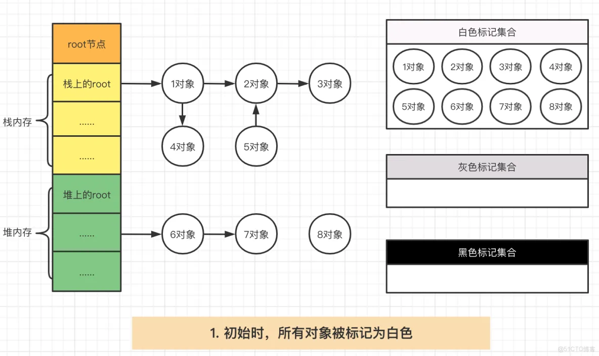

2. GC开始时，先将栈上所有可达对象标记为黑色：

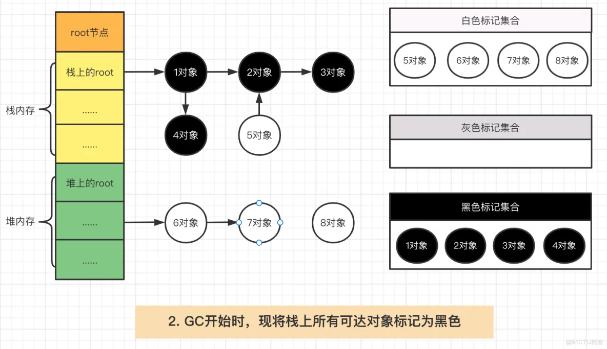

3. 开始三色标记，将6标记为灰色，同时栈上对象3引用对象9，触发混合写屏障机制，将对象9标记为黑色：

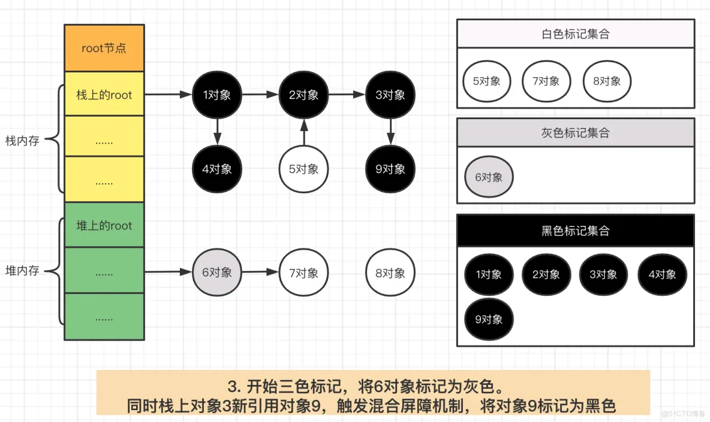

4. 对象6新引用对象10，对象6在堆上，触发混合屏障机制，将10对象标记为灰色：

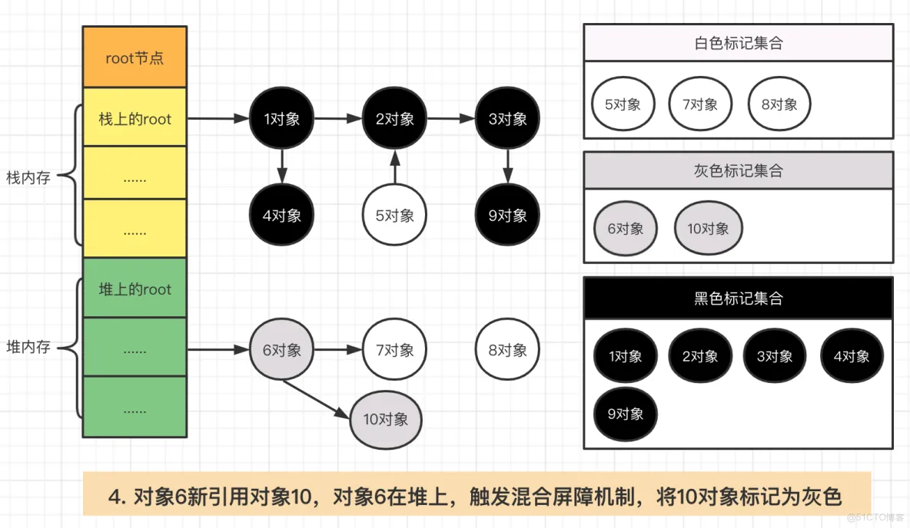

5. 对象1引用了对象7，由于对象1在栈上，不会触发混合屏障机制，仅仅是挂载：

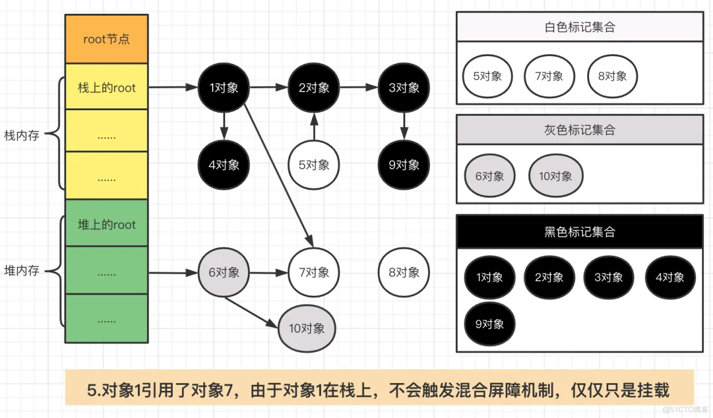

6. 对象6删除了对对象7的引用，对象6在堆上，触发混合写屏障机制，将对象7标记为灰色：

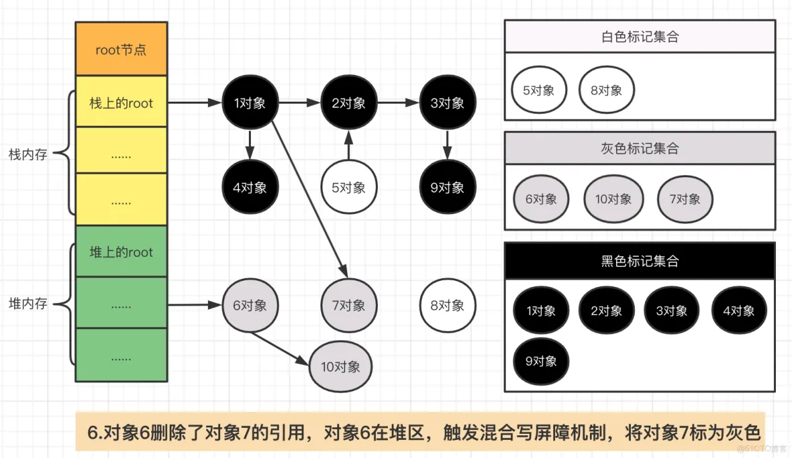

**重要说明**：有同学可能会问，万一栈上的对象1引用了堆上的一个新分配的白色对象8，由于不触发混合写屏障机制，那对象8一直是白色的，最后不就被垃圾回收走了么？

> **这个担心是多余的！**
> 
> 这个情况是不会发生的，原因如下：
> 1. **对象创建时机**：如果对象8是在GC开始后新分配的，它不会是白色，而是会被标记为黑色（这是混合写屏障的规则）
> 2. **引用可达性**：一个对象之所以能被引用，前提是它必须是可达的。在图中的8号对象显然是不可达的白色对象（GC开始前就存在且无引用）
> 3. **栈扫描时机**：栈上的可达对象在GC开始时就全部标记为黑色了，包括它们当时能到达的所有对象

那为什么1号对象可以引用7号对象呢？这是因为1号对象在引用7号对象的时候，对象7是在对象6的下游，本身是可达的，所以这种引用关系的改变是合理的。

7. 将所有可达对象标记完成后，GC结束，最后把对象5和对象8白色对象回收：

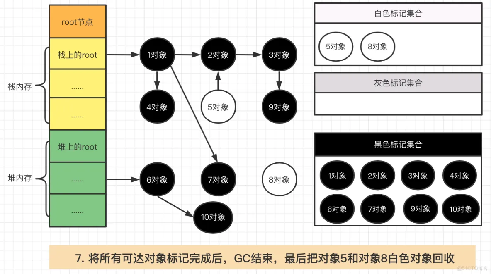

### 混合写屏障的优势

1. **消除了重扫栈的STW**：不需要在最后暂停程序重新扫描栈
2. **兼顾性能和精度**：既避免了频繁的栈写屏障，又保持了较高的回收精度
3. **实现简单**：逻辑清晰，易于理解和维护

> **混合写屏障的精妙之处**：
> - 用"一次性标黑栈对象"替代"频繁的栈写屏障"
> - 在堆上同时使用插入和删除写屏障的优点
> - 达到了性能和精度的完美平衡

## 总结

Go语言垃圾回收机制的演进历程：

1. **Golang v1.3之前**：采用传统的标记-清除法，需要STW，暂停整个程序的运行。
   - 优点：简单直接，逻辑清晰
   - 缺点：STW时间长，严重影响程序性能

2. **v1.5版本**：引入了三色标记法和插入写屏障机制，其中插入写屏障机制只在堆内存中生效。但在标记过程中，最后需要对栈进行STW。
   - 优点：大部分时间可以并发标记，性能有所提升
   - 缺点：最后仍需STW重扫栈，存在性能瓶颈

3. **v1.8版本**：结合删除写屏障机制，推出了混合屏障机制，屏障限制只在堆内存中生效。避免了最后节点对栈进行STW的问题，提升了GC效率。
   - 优点：几乎消除了STW，达到了并发标记的目标
   - 缺点：实现复杂度稍高，但这个代价是值得的

## 深度理解要点

### 易混淆概念澄清

1. **三色的本质**：三色不是对象的固有属性，而是GC过程中的临时标记状态
2. **写屏障的作用时机**：只有在修改指针引用关系时才会触发，普通的值修改不会触发
3. **栈与堆的处理差异**：栈处理简单粗暴（全标黑），堆处理精细复杂（写屏障）
4. **STW的必要性**：不是所有GC都能完全避免STW，关键是尽可能减少STW时间

### 性能优化思路

Go GC的优化思路体现了工程上的智慧：
1. **权衡取舍**：在吞吐量、延迟、内存使用之间寻找平衡
2. **分治策略**：栈和堆采用不同的处理策略
3. **渐进优化**：从v1.3到v1.8的逐步改进，每次解决一个主要问题
4. **实用主义**：不追求理论上的完美，而是追求工程上的可行

## 常见面试问题

### Q1：Go语言中三色标记法的基本原理是什么？

**答**：三色标记法将所有对象分为三种颜色：
- **白色**：未被访问的对象，最后会被回收
- **灰色**：已访问但其引用的对象还未全部访问，相当于待处理队列
- **黑色**：已访问且其引用的对象也全部访问完毕，确定存活的对象

标记过程从根对象开始，逐步将可达对象从白色标记为灰色，再从灰色标记为黑色，最终回收所有白色对象。这个过程可以与程序并发执行，提高了GC效率。

### Q2：为什么需要写屏障机制？

**答**：在并发标记过程中，程序可能会修改对象间的引用关系，这可能导致应该存活的对象被误回收。具体来说，当同时满足以下两个条件时，对象会丢失：
1. 白色对象被黑色对象引用
2. 灰色对象与白色对象之间的可达关系被破坏

写屏障机制可以拦截这些引用关系的改变，通过破坏上述条件之一来确保对象不会丢失。

### Q3：插入写屏障和删除写屏障的区别是什么？

**答**：
- **插入写屏障**：在创建新引用时触发，将被引用对象标记为灰色，满足强三色不变式（不允许黑色对象引用白色对象）
  - 优点：回收精度高
  - 缺点：最后需要STW重扫栈
  
- **删除写屏障**：在删除引用时触发，将被删除引用的对象标记为灰色，满足弱三色不变式（白色对象的上游必须存在灰色对象）
  - 优点：不需要重扫栈
  - 缺点：回收精度低，产生浮动垃圾

### Q4：Go 1.8的混合写屏障解决了什么问题？

**答**：混合写屏障结合了插入写屏障和删除写屏障的优点，主要解决了以下问题：

1. **消除STW**：通过在GC开始时将栈上对象全部标记为黑色，避免了最后重扫栈的STW
2. **性能优化**：避免了在高频的栈操作上使用写屏障，大大降低了性能开销
3. **提高精度**：在堆上同时使用插入和删除写屏障的机制，保持了较高的回收精度

其核心思想是：栈用简单粗暴的方式处理（全标黑），堆用精细的写屏障处理，达到性能和精度的平衡。

### Q5：为什么栈不使用写屏障？

**答**：栈不使用写屏障的原因：

1. **性能考虑**：栈操作极其频繁，每个函数调用、局部变量操作都涉及栈，如果都加写屏障，性能损失巨大
2. **数量问题**：Go程序可能有数十万个goroutine，每个都有自己的栈，写屏障的开销会被放大
3. **替代方案**：混合写屏障采用在GC开始时一次性标记栈上所有对象为黑色的方式，避免了频繁的写屏障

### Q6：什么情况下会触发GC？

**答**：Go语言中GC的触发条件主要有：

1. **自动触发**：
   - 内存分配达到一定阈值（由GOGC环境变量控制，默认100%）
   - 距离上次GC时间超过2分钟

2. **手动触发**：
   - 调用`runtime.GC()`函数
   - 调用`runtime.GCPercent()`设置触发阈值

3. **系统压力**：
   - 系统内存不足时可能会更频繁地触发GC

---

> **学习建议**：
> 1. **画图理解**：GC机制最好通过画图来理解对象引用关系的变化
> 2. **实验验证**：可以通过编写测试程序和使用`go tool trace`来观察GC行为
> 3. **关注演进**：理解每个版本的改进点，有助于深入理解设计思路
> 4. **结合实践**：在实际项目中注意GC的性能影响，学会调优