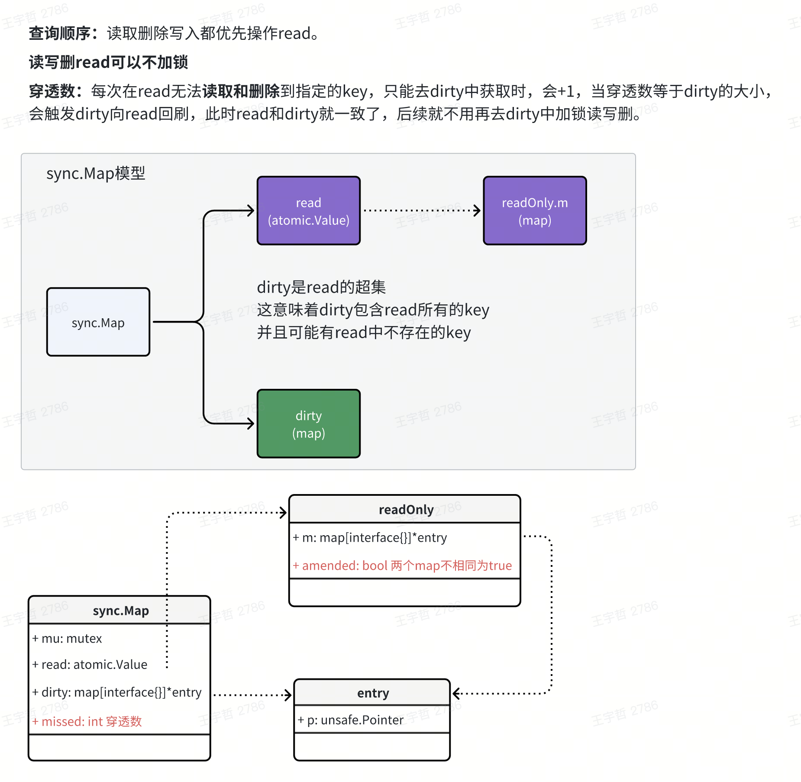
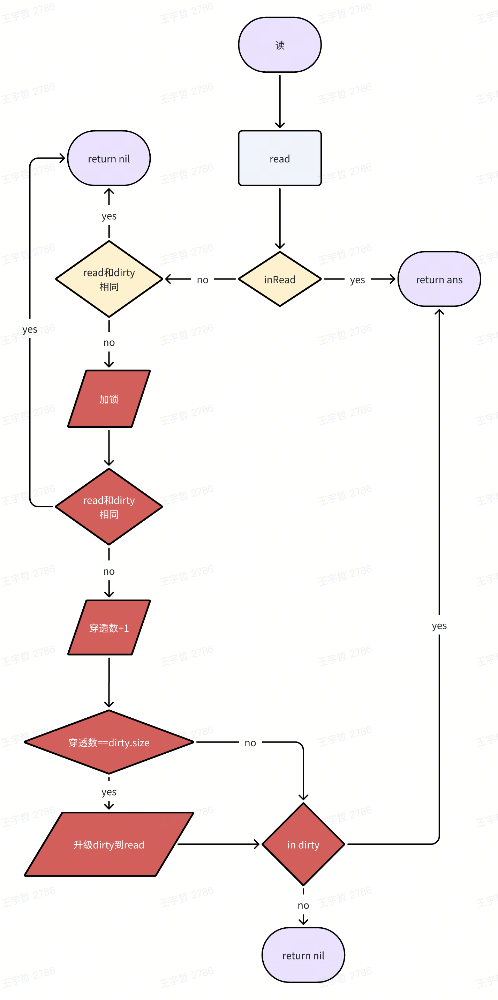
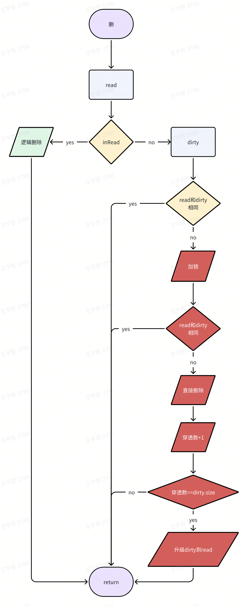
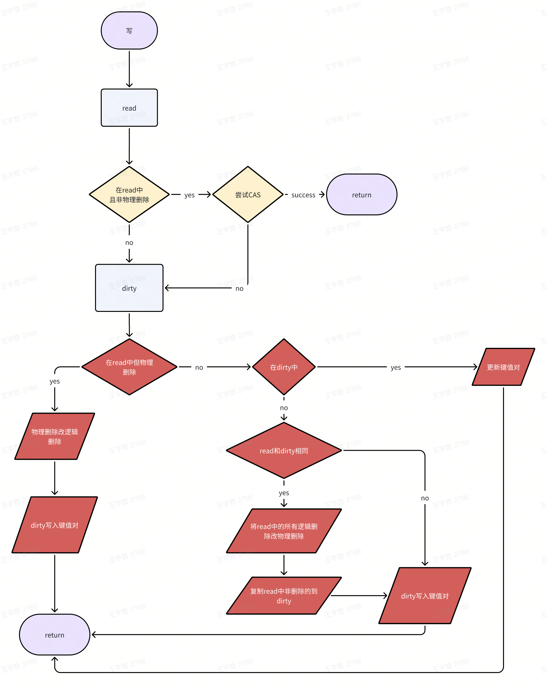

## 一、什么是 sync.Map?

**起因：** 在 Go 中，原生的 `map` 并不支持并发读写——直接在多 goroutine 中操作同一个 `map` 会导致 panic。

**简单处理：** 使用 `sync.Mutex` 或 `sync.RWMutex`，两种锁在写时都会阻塞其他读写请求，性能较差。

为了解决这个问题，标准库提供了 `sync.Map`，一个专为高并发场景设计的线程安全映射。Go 1.24 前，它通过双缓冲机制（`read` 和 `dirty`）实现无锁读取和低竞争写入，尤其适合读多写少的场景。然而，这种设计在写多读少的场景仍存在性能瓶颈，直到 Go 1.24 后 HashTrieMap 的引入，才彻底释放了它的潜力。

**并发下三种 Map 使用方案：** mutex+原生map、sync.Map（双缓冲，Go 1.24.0 以下）、sync.Map（哈希前缀树，Go 1.24.0 及以上版本）

**结论先看：**

- **对 map 操作次数 <= 1000 || key 数量 <= 1000：** 直接用 mutex + 原生 map 性能最高。
- **对 map 操作次数 > 1000 && key 数量 > 1000（读多写少的场景 sync.Map 双缓冲）：** sync.Map 比 mutex+原生 map 纯读取下最高达到 18 倍的性能优化，写入比例越高性能越差。
- **对 map 操作次数 > 1000 && key 数量 > 1000（写多读少或读写平均的场景 sync.Map 哈希前缀树）：** sync.Map 比 mutex+原生 map 纯写入下至少 3 倍的性能优化，纯读取下至少 8 倍的性能优化。

## 二、sync.Map 的实现及其性能瓶颈（Go 1.24 前）

**双缓冲实现的 sync.Map 源码地址：** [Go 1.23 sync/map.go](https://github.com/golang/go/blob/go1.23/src/sync/map.go)

### 2.1、基本思想

**双缓冲：** sync.Map 由 **read** 和 **dirty** 两个 map 组成，优先查找 read，若 read 存在 key 且非删除状态，则无锁读写删。

**原子操作：** read 为原子引用类型，借助 CAS 实现无锁写入，可指针替换整个 read map。



### 2.2、实现原理

#### 2.2.1、Map 的数据结构

```go
type Map struct {
    _ noCopy
    mu Mutex                       // 全局互斥锁
    read atomic.Pointer[readOnly]  // 原子读写map
    dirty map[any]*entry           // 加锁读写map
    misses int                     // 读取read时找不到key的次数，misses == len(dirty.size),触发dirty升级到read
}

type readOnly struct {
    m       map[any]*entry
    amended bool  // 为true代表dirty存在read中不存在的key，反之不然，用于快速判断
}

type entry struct {
    p atomic.Pointer[any]  // 原子类型
}
```

**注意：**

- readOnly 中有一个 **amended** 字段，帮助快速判断 dirty 和 read 包含的键值对是否完全一样
- Map 中有一个 **misses** 字段，每次 read 中读取不到键值对尝试从 dirty 中读取就会 +1，当 misses == dirty.size() 时，将通过原子替换，将 dirty 中新增的键值对回刷到 read 中，两个 map 再次达到一致
- read 中 key == nil 代表**逻辑删除**（即 dirty 中可能未删除），key == expunged 代表**物理删除**（dirty 也不存在该 key）

#### 2.2.2、读取

```go
func (m *Map) Load(key any) (value any, ok bool) {
    read := m.loadReadOnly()
    e, ok := read.m[key]
    if !ok && read.amended {
       m.mu.Lock()
       // Avoid reporting a spurious miss if m.dirty got promoted while we were
       // blocked on m.mu. (If further loads of the same key will not miss, it's
       // not worth copying the dirty map for this key.)
       read = m.loadReadOnly()
       e, ok = read.m[key]
       if !ok && read.amended {
          e, ok = m.dirty[key]
          // Regardless of whether the entry was present, record a miss: this key
          // will take the slow path until the dirty map is promoted to the read
          // map.
          m.missLocked()
       }
       m.mu.Unlock()
    }
    if !ok {
       return nil, false
    }
    return e.load()
}
```

**流程图**



**流程简述：**

1. **优先去 read 中尝试读取：** 如果 read 存在该 key，返回对应的值（可能为 nil）；
2. **判断 read 和 dirty 是否相同：** 相同代表 dirty 中**不存在新键值对**也就没必要去查，立刻返回 nil；不相同说明 dirty 中可能存在，下一步加锁去 dirty 读取；
3. **穿透数 + 1 与可能的 map 升级：** 双重判定锁逻辑快速返回，否则穿透数 +1，如果**穿透数 == dirty.size()**，触发 dirty 向 read 回刷，最后从 dirty 中返回 key（可能不存在）

**为什么要加锁：** 穿透数 +1 和后续判断并回刷 map 操作可能单个操作是原子的，但整体原子性无法保证，不加锁无法同时保证穿透数的准确性和避免重复回刷。

**相比原生 map + mutex 优化在哪里：** 大部分读操作可以无锁读，尽管少部分需加锁到 dirty 中读取，后续通过回刷也能继续无锁读，原生 map + mutex 每次读都会加锁。

#### 2.2.3、删除

```go
func (m *Map) LoadAndDelete(key any) (value any, loaded bool) {
    read := m.loadReadOnly()
    e, ok := read.m[key]
    if !ok && read.amended {
       m.mu.Lock()
       read = m.loadReadOnly()
       e, ok = read.m[key]
       if !ok && read.amended {
          e, ok = m.dirty[key]
          delete(m.dirty, key)
          m.missLocked()
       }
       m.mu.Unlock()
    }
    if ok {
       return e.delete()
    }
    return nil, false
}
```

**流程图**



**流程简述：**

1. **read 逻辑删除：** 如果 read 中存在该 key，直接删除并 return（key 为逻辑或物理删除则返回删除失败，否则将 value 设置为 nil 代表逻辑删除）；read 中不存在该 key 继续下面流程；
2. **判断 read 和 dirty 是否相同：** 相同快速 return，不相同加锁；
3. **删除与穿透数 +1：** 双重判定锁快速 return，否则删除（dirty 中不需要考虑逻辑或物理删除，只是设置为 nil），同时将穿透数 +1；

**为什么要加锁：** 删除和穿透数 +1 是两个操作，整体原子性无法保证。

**相比原生 map + mutex 优化在哪里：** 大部分删除操作都可以无锁删除，删除操作也可以累积穿透数，减少后续加锁删除次数。

#### 2.2.4、写入

```go
func (m *Map) Swap(key, value any) (previous any, loaded bool) {
    read := m.loadReadOnly()
    if e, ok := read.m[key]; ok {
       if v, ok := e.trySwap(&value); ok {
          if v == nil {
             return nil, false
          }
          return *v, true
       }
    } // read若存在key且非物理删除 才可以原子更新 因为dirty是read的超集
    m.mu.Lock() // 加锁
    read = m.loadReadOnly()
    if e, ok := read.m[key]; ok {
       if e.unexpungeLocked() { // 把物理删除改逻辑删除
          m.dirty[key] = e // 写入
       }
       if v := e.swapLocked(&value); v != nil {
          loaded = true
          previous = *v
       }
    } else if e, ok := m.dirty[key]; ok { // read不存在 看dirty有就更新
       if v := e.swapLocked(&value); v != nil {
          loaded = true
          previous = *v
       }
    } else { // read和dirty都不存在
       if !read.amended { // dirty中不存在read中没有的key
          m.dirtyLocked() // 将逻辑删除改物理删除 read升级dirty
          m.read.Store(&readOnly{m: read.m, amended: true}) // read原子替换
       }
       m.dirty[key] = newEntry(value)
    }
    m.mu.Unlock()
    return previous, loaded
}
```

**流程图**



**流程简述：**

1. **read 无锁 CAS 写入：** 如果 key 存在 read 中且非物理删除，借助 CAS 的原子性尝试无锁写入快速返回。否则后续需加锁处理。
2. **key 在 read 中但为物理删除：** dirty 中写入键值对，直接 return。
3. **key 不在 read 中但在 dirty 中：** dirty 中存在则更新返回。
4. **两个 map 都不存在该 key：** 如果两个 map 不一致（dirty 不是第一次新增键值对），dirty 增加新键值对，return；如果 read 和 dirty 一致（dirty 为第一次新增键值对，需初始化 dirty），将 read 中逻辑删除的键值对改物理删除（因为后续会复制 read 到 dirty，逻辑删除的 key 不会复制过去，dirty 不存在为物理删除），read 中非删除的键值对复制到 dirty，增加键值对，return。

**为什么要加锁：**

- read 存在 key 但是为物理删除（expunged）：原子更新 read 时，状态将不再为物理删除，此时意味着 dirty 中也必须写入该 key，这是两步操作，原子性无法保证。
- 剩下两种，发生在【read 存在 key 但是为物理删除（expunged）判断】之后，还包括可能的 read 向 dirty 复制，必须加锁。

**相比原生 map + mutex 优化在哪里：** 如果 read 中存在 key 可以实现无锁写，比较依赖 dirty 向 read 升级（Load，Delete，LoadOrStore 可以累积穿透数）。

### 2.3、优化点总结

基于以上的 map 工作流程，总结 sync.Map 在并发环境下相比 mutex + 原生 map 或读写锁 map 的优化点：

- **无锁读写删：** read 存在 key 或 read 与 dirty 无差异时，可以无锁读删，read key 非删除可 CAS 写，极大减少锁次数。
- **延迟同步：** 穿透次数等于 dirty.size 时同步 dirty 到 read，减少低收益同步次数。
- **双重判定锁：** 利用双重判定锁，尝试无锁读取和删除，减少锁次数。
- **原子替换：** 利用 atomic.Value 机制，原子条件下直接进行指针替换而非元素复制。
- **内存优化：** dirty map 延迟初始化，节省内存并防止数据不一致。

### 2.4、基准测试性能差异（Go 1.23.10）

测试脚本与结果：[Benchmark 测试代码](https://gist.github.com/example/sync-map-benchmark)

**测试环境 1**

- go version：**go 1.23.10**
- goos: darwin
- goarch: arm64
- cpu: Apple M1 Pro
- Key 为 int 类型，分布在 **[1, 1000000000]**
- 写入，读取，删除命令分别为 **Store，Load，Delete**

| 操作类型 | Mutex+原生Map | sync.Map | 优化率 |
|---------|--------------|----------|--------|
| **写入（100%）** | 383.2 ns/op | 597.2 ns/op | **-55.8%** |
| **读取（100%）** | 291.4 ns/op | 16.60 ns/op | **+94.3%** |
| **删除（100%）** | 299.4 ns/op | 16.28 ns/op | **+94.6%** |

纯写入（Store 命令）场景下，性能甚至不如 Mutex + 原生 map，读取和删除极大优化。

**测试环境 2**

- go version：**go 1.23.10**
- goos: darwin
- goarch: arm64
- cpu: Apple M1 Pro
- **Key 为 int 类型，分布在 [1, 100000]（10W）**
- 写入，读取，删除命令分别为 **LoadOrStore（如果存在则返回值，不存在则写入，没有更新操作），Load，Delete**

| 操作类型 | Mutex + 原生Map | sync.Map | 优化率 |
|---------|----------------|----------|--------|
| **写入（100%）** | 232.1 ns/op | 19.31 ns/op | **+91.7%** |
| **读取（100%）** | 144.1 ns/op | 9.582 ns/op | **+93.4%** |
| **删除（100%）** | 101.8 ns/op | 12.49 ns/op | **+87.7%** |

- 将写入命令转换成 **LoadOrStore** 后，可以在 key 不存在 read 时累积穿透数，后续依靠 dirty 回刷 read，可通过无锁读来提高效率，适用于**如果 key 已存在则不更新**的场景。
- 写入的性能优化主要还因为本次测试 key 只有**十万个**，而测试执行的写入次数普遍在**三百万**左右，这意味着，后续重复的随机 key 将**无锁读**，是重复 key 的 LoadOrStore 带来的优化。

**测试环境 3**

- go version：**go 1.23.10**
- goos: darwin
- goarch: arm64
- cpu: Apple M1 Pro
- **Key 为 int 类型，分布在 [1, 10000000]（1000W）**
- 写入，读取，删除命令分别为 **LoadOrStore（如果存在则返回值，不存在则写入，没有更新操作），Load，Delete**

| 操作类型 | Mutex + 原生Map | sync.Map | 优化率 |
|---------|----------------|----------|--------|
| **写入（100%）** | 待补充 | 待补充 | 待补充 |
| **读取（100%）** | 待补充 | 待补充 | 待补充 |
| **删除（100%）** | 待补充 | 待补充 | 待补充 |

## 三、Go 1.24 的 HashTrieMap 革命

Go 1.24 引入了基于哈希前缀树（Hash Trie）的全新 sync.Map 实现，彻底解决了双缓冲方案在写多场景下的性能瓶颈。

### 3.1、HashTrieMap 的核心思想

HashTrieMap 使用哈希前缀树结构，将 key 的哈希值按位分段，每段对应树的一层。这种设计带来了以下优势：

1. **细粒度锁：** 不同分支的操作可以并行执行，大幅减少锁竞争
2. **无需双缓冲：** 直接在树结构上进行原子操作，避免了 dirty 到 read 的同步开销
3. **写入性能提升：** 写操作不再需要全局锁，只需锁定相关的树节点

### 3.2、性能对比

在 Go 1.24 中，sync.Map 的性能表现：

- **纯写入场景：** 相比 mutex+原生 map 至少 3 倍性能提升
- **纯读取场景：** 相比 mutex+原生 map 至少 8 倍性能提升
- **混合读写场景：** 性能表现稳定，不再受写入比例影响

## 四、总结与建议

### 4.1、版本选择

- **Go 1.24 以下版本：** sync.Map 适合读多写少场景，写多场景建议使用分片锁方案
- **Go 1.24 及以上版本：** sync.Map 适合各种并发场景，是首选方案

### 4.2、使用场景建议

1. **小规模数据（操作次数 <= 1000 或 key 数量 <= 1000）：** 直接使用 mutex + 原生 map
2. **读多写少场景：** sync.Map 是最佳选择
3. **写多读少场景：** Go 1.24+ 使用 sync.Map，Go 1.24 以下考虑分片锁方案
4. **需要遍历操作：** 注意 sync.Map 的 Range 方法会获取快照，可能有性能开销

### 4.3、注意事项

- sync.Map 的零值可直接使用，无需初始化
- 避免在 Range 回调中修改 map，可能导致不可预期的行为
- 对于已知 key 类型的场景，可以考虑使用泛型封装提高类型安全性
