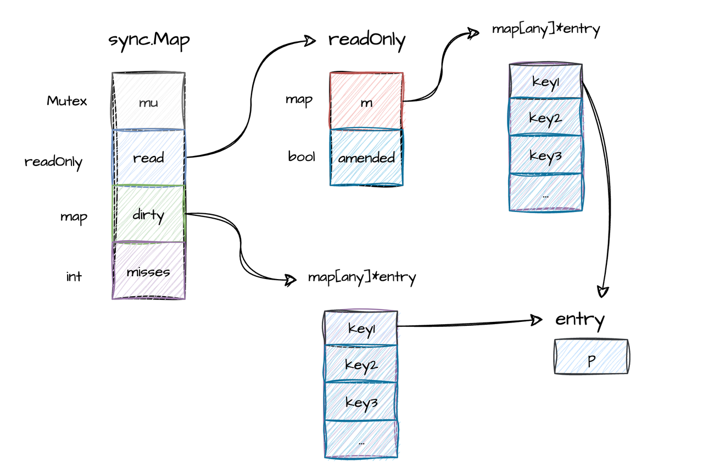
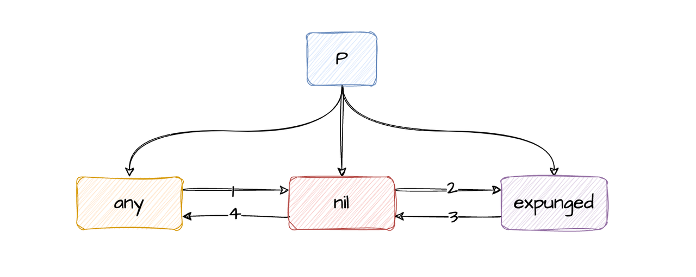

## 什么是 sync.Map

我们都知道在 Go 语言中，普通的 Map 是非并发安全的，并发读写时会 panic，`sync.Map` 则是官方库提供的一种特殊的并发安全的映射类型，能保证较高的性能的同时，还能保证并发安全。`sync.Map` 有以下几个特点：

### sync.Map 特点

**并发安全：** `sync.Map` 无需额外的锁机制即可在多个 goroutine 中安全地进行读写操作。这对于高并发的应用场景非常重要，可以避免数据竞争和不一致的问题。

```go
package main

import (
    "fmt"
    "sync"
)

func main() {
    // 创建一个 sync.Map
    var m sync.Map

    // 模拟多个 goroutine 同时读写
    var wg sync.WaitGroup
    for i := 0; i < 10; i++ {
        wg.Add(1)
        go func(id int) {
            defer wg.Done()
            if id % 2 == 0 {
                 // 写入,无需加锁
                m.Store(id, fmt.Sprintf("value for %d", id))
            } else {
                // 读取,无需加锁
                value, ok := m.Load(id)
                if ok {
                    fmt.Printf("Goroutine %d read: %v\n", id, value)
                }
            }
        }(i)
    }

    wg.Wait()
}
```

**读写分离：** 内部采用了读写分离的设计，将频繁访问的元素存储在一个只读的部分，而将较少访问的元素和新添加的元素存储在一个可写的部分。这种设计可以减少读取操作时的锁竞争，提高性能。

```go
type Map struct {
    // ...

    // 负责读，无需加锁
    read atomic.Pointer[readOnly]

    // 负责写，需要加锁
    dirty map[any]*entry

    // ...
}
```

**自动调整：** 随着时间的推移，`sync.Map` 会自动将可写部分中频繁访问的元素提升到只读部分，以进一步优化读取性能。同时，当可写部分的大小超过一定阈值时，会进行清理和合并操作。

```go
func (m *Map) missLocked() {
    m.misses++
    if m.misses < len(m.dirty) {
       return
    }
    m.read.Store(&readOnly{m: m.dirty})
    m.dirty = nil
    m.misses = 0
}
```

**功能丰富：** `sync.Map` 提供了丰富的接口，包括存储、读取、删除、遍历等操作，方便开发者在不同的场景下使用。

```go
type mapInterface interface {
    Load(any) (any, bool) // 读取
    Store(key, value any) // 存储
    LoadOrStore(key, value any) (actual any, loaded bool) // 读取并存储
    LoadAndDelete(key any) (value any, loaded bool) // 读取并删除
    Delete(any) // 删除
    Swap(key, value any) (previous any, loaded bool) // 交换
    CompareAndSwap(key, old, new any) (swapped bool) // 比较并交换
    CompareAndDelete(key, old any) (deleted bool) // 比较并删除
    Range(func(key, value any) (shouldContinue bool)) // 遍历
}
```

### 应用示例

对 Map 有并发读写的需求的都可以考虑使用 `sync.Map`，我们在实际开发中通常使用 `sync.Map` 作为缓存或者是动态配置，缓存和动态配置的特点都是读多写少，存在并发读写的场景，下面以缓存作为示例：

```go
package main

import (
    "fmt"
    "sync"
    "time"
)

func main() {
    cache := sync.Map{}

    // 模拟写入缓存
    cache.Store("data_key", "initial value")

    // 读取缓存
    value, ok := cache.Load("data_key")
    if ok {
        fmt.Println("Value from cache:", value)
    }

    // 模拟数据更新
    go func() {
        time.Sleep(2 * time.Second)
        cache.Store("data_key", "updated value")
    }()

    // 持续读取缓存
    for {
        value, ok = cache.Load("data_key")
        if ok {
            fmt.Println("Current value:", value)
        }
        time.Sleep(1 * time.Second)
    }
}
```

## sync.Map 的性能优势

> 测试的代码有点多，不关注测试代码逻辑的可以跳过代码直接阅读《性能小结》章节

原始的 Map 存在并发安全的问题，为了避免并发安全我们通常使用：Map+Mutex、Map+RWMutex、sync.Map 等方式去避免并发安全问题，其中 sync.Map 在大部分场景都具有性能优势：

### 测试代码封装

```go
const (
    baseKey = 128
)

type mapInterface interface {
    Load(any) (any, bool)
    Store(key, value any)
}

type MutexMap struct {
    mu    sync.Mutex
    dirty map[any]any
}

func (m *MutexMap) Load(key any) (value any, ok bool) {
    m.mu.Lock()
    value, ok = m.dirty[key]
    m.mu.Unlock()
    return
}

func (m *MutexMap) Store(key, value any) {
    m.mu.Lock()
    if m.dirty == nil {
       m.dirty = make(map[any]any)
    }
    m.dirty[key] = value
    m.mu.Unlock()
}

type RWMutexMap struct {
    mu    sync.RWMutex
    dirty map[any]any
}

func (m *RWMutexMap) Load(key any) (value any, ok bool) {
    m.mu.RLock()
    value, ok = m.dirty[key]
    m.mu.RUnlock()
    return
}

func (m *RWMutexMap) Store(key, value any) {
    m.mu.Lock()
    if m.dirty == nil {
       m.dirty = make(map[any]any)
    }
    m.dirty[key] = value
    m.mu.Unlock()
}

type SyncMap struct {
    dirty *sync.Map
}

func (m *SyncMap) Load(key any) (value any, ok bool) {
    value, ok = m.dirty.Load(key)
    return
}

func (m *SyncMap) Store(key, value any) {
    m.dirty.Store(key, value)
}

type bench struct {
    setup func(*testing.B, mapInterface)
    perG  func(b *testing.B, pb *testing.PB, i int, m mapInterface)
}

func benchMap(b *testing.B, bench bench) {
    for _, m := range [...]mapInterface{
       &MutexMap{dirty: make(map[any]any)},   // map+mutex
       &RWMutexMap{dirty: make(map[any]any)}, // map+rwmutex
       &SyncMap{dirty: &sync.Map{}},          // sync.Map
    } {
       b.Run(fmt.Sprintf("%T", m), func(b *testing.B) {
          if bench.setup != nil {
             bench.setup(b, m)
          }

          b.ResetTimer()

          var i int64
          b.RunParallel(func(pb *testing.PB) {
             id := int(atomic.AddInt64(&i, 1) - 1)
             bench.perG(b, pb, id*b.N, m)
          })
       })
    }
}

func benchRun(b *testing.B, reads, writes int) {
    benchMap(b, bench{
       setup: func(_ *testing.B, m mapInterface) {
          for i := 0; i < reads; i++ {
             m.Store(i, i)
          }
          // Prime the map to get it into a steady state.
          for i := 0; i < reads; i++ {
             m.Load(i)
          }
       },

       perG: func(b *testing.B, pb *testing.PB, i int, m mapInterface) {
          r := rand.New(rand.NewSource(time.Now().Unix()))
          for pb.Next() {
             j := r.Intn(reads + writes)

             if j < reads {
                m.Load(j)
             } else {
                m.Store(j, j)
             }
          }
       },
    })
}
```

### 读多写少

```go
func BenchmarkLoadMostlyRead(b *testing.B) {
    var reads, writes = baseKey << 3, baseKey
    benchRun(b, reads, writes)
}

>>> go test -bench=. -benchmem
goos: darwin
goarch: arm64
pkg: sync_map
cpu: Apple M3 Pro
BenchmarkLoadMostlyRead sync_map.MutexMap-12           11812083               102.1 ns/op             7 B/op          0 allocs/op
BenchmarkLoadMostlyRead sync_map.RWMutexMap-12         15006846                79.00 ns/op            7 B/op          0 allocs/op
BenchmarkLoadMostlyRead sync_map.SyncMap-12            50878357                22.54 ns/op            8 B/op          1 allocs/op
PASS
ok      sync_map        5.415s
```

### 读少写多

```go
func BenchmarkLoadMostlyWrite(b *testing.B) {
    var reads, writes = baseKey, baseKey << 3

    benchRun(b, reads, writes)
}

>>> go test -bench=. -benchmem
goos: darwin
goarch: arm64
pkg: sync_map
cpu: Apple M3 Pro
BenchmarkLoadMostlyWrite sync_map.MutexMap-12           8027871               141.2 ns/op            12 B/op          1 allocs/op
BenchmarkLoadMostlyWrite sync_map.RWMutexMap-12         7322696               163.1 ns/op            12 B/op          1 allocs/op
BenchmarkLoadMostlyWrite sync_map.SyncMap-12            7920776               151.8 ns/op            26 B/op          2 allocs/op
PASS
ok      sync_map        4.661s
```

### 读写均衡

```go
func BenchmarkReadWriteBalanced(b *testing.B) {
    var reads, writes = baseKey << 2, baseKey << 2
    benchRun(b, reads, writes)
}

>>> go test -bench=. -benchmem
goos: darwin
goarch: arm64
pkg: sync_map
cpu: Apple M3 Pro
BenchmarkReadWriteBalanced sync_map.MutexMap-12                 8909396               120.4 ns/op            10 B/op          1 allocs/op
BenchmarkReadWriteBalanced sync_map.RWMutexMap-12              12947712                94.64 ns/op           10 B/op          1 allocs/op
BenchmarkReadWriteBalanced sync_map.SyncMap-12                 12849976                86.18 ns/op           18 B/op          1 allocs/op
PASS
ok      sync_map        4.397s
```

### 性能小结

> 这里的写指的是写新的 key，并不是更新，如果是更新 sync.Map 的性能还能提升一倍以上，因为 sync.Map 对 value 的更新原理是 Load + 原子操作。

| 场景 | map+mutex | map+rwmutex | sync.Map |
|------|-----------|-------------|----------|
| 读多写少 | 102.1 ns/op | 79.00 ns/op | 22.54 ns/op |
| 读少写多 | 141.2 ns/op | 163.1 ns/op | 151.8 ns/op |
| 读写均衡 | 120.4 ns/op | 94.64 ns/op | 86.18 ns/op |

## 实现原理

> 基于 Go 1.23

### 数据结构

#### 整体结构

```go
type Map struct {
    // 互斥锁，当对 dirty 进行读写时需要加锁
    mu Mutex

    // 原子类型，底层指向 readOnly，是只读 map 的载体, 读取时先读只读 map
    // 实际上更新和删除也会在这个上操作，只有新增的 key 会在 dirty 里操作
    read atomic.Pointer[readOnly]

    // 新增的 key 会先写到这个里面，等到一定时机 read 和 dirty 会相互同步
    dirty map[any]*entry

    // 因为新增的 key 会先写入 dirty 中，导致某些 key 在 read 中找不到，misses 记录
    // 找不到的次数，达到一定数值后 dirty 就会向 read 中同步
    misses int
}

// read 字段真正指向的类型
type readOnly struct {
    // 底层的只读 map，只读不需要加锁
    m       map[any]*entry

    // 如果 dirty 中有 read 里没有 key 时 amended 为 true
    amended bool
}

// map 的 value, 里面的 p 是原子类型，对于 value 的读取、更新、删除 直接使用原子操作就可以不用加锁
// 如果一个 key 在 read 和 dirty 里面都存在，那么 read 和 dirty 底层复用同一个 entry
type entry struct {
    p atomic.Pointer[any]
}
```

sync.Map 的整体结构如下：



### 设计技巧

有一些设计技巧在这里简单介绍一下，下面进行源码解析时也会详细讲解：

1. `sync.Map` 采用了读写分离的设计，大多数 key 在 read 中不用加锁读取，只有少数的 key 需要加锁对 dirty 进行读写；

2. read 字段是原子类型而非直接声明成 readOnly，是因为 readOnly 里面有两个字段如果在不加锁的情况分别对 m 和 amended 进行赋值时不能保证原子性，m 和 amended 的状态可能是不一致的，把 m 和 amended 看成一个整体，然后使用原子操作对 read 赋值，这样可以保证原子性。

```go
m.read.Store(&readOnly{m: read.m, amended: true})
```

3. 相同的 key 在 read 和 dirty 中共用一个 entry，这样设计的目的是能保证 read 和 dirty 对应的 value 是相同的，避免数据不一致的问题，例如：更新了 read 中的 value 后就不需要再更新 dirty 中的 value。

4. entry 中的 p 也是原子类型，这样设计的好处是，read 中 value 可以在不加锁的情况进行读取、更新、删除，如果不是原子类型，那么 read 中 value 只能进行读取，更新和删除需要加锁。

```go
// 读取
p := e.p.Load()

// 更新
e.p.CompareAndSwap(p, i)

// 删除，在 sync.Map 中删除是特殊的更新，更新后的值为 nil
e.p.CompareAndSwap(p, nil)
```

5. P 有三种状态分别是：any、nil、expunged，它们之间可以进行转换，这样设计的目的是删除时可以不用加锁先在 read 中删除，如果 read 中没有再加锁在 dirty 中删除：



- 正常情况 p 会指向一个 any 类型的值，在删除时 p 会指向 nil，实际并没有删除；
- 当 read 向 dirty 转换时（dirty 为 nil 并且需要向 dirty 写入新值时），read 中被删除的 p 会从 nil 转换成 expunged，但是不会复制到 dirty 中；
- 被删除的 key 重新写入时，nil 和 expunged 有不同的逻辑：
  - nil 说明 key 在 read 和 dirty 中都有，写入新值时直接将 key 对应的值由 nil 转换成新写入的值；
  - expunged 说明 key 只在 read 中存在，写入新值前需要将 expunged 转换成 nil，再往 dirty 中插入相应的 key，最后将 p 更新成新的值；

### 读取操作

```go
func (m *Map) Load(key any) (value any, ok bool) {
    // 通过原子操作获取 read
    read := m.loadReadOnly()
    e, ok := read.m[key]
    if !ok && read.amended {
       // 加锁
       m.mu.Lock()

       // 再次检查 read 中是否存在
       read = m.loadReadOnly()
       e, ok = read.m[key]
       if !ok && read.amended {
          // 如果 read 中不存在，再检查 dirty 中是否存在
          e, ok = m.dirty[key]

          m.missLocked()
       }
       m.mu.Unlock()
    }
    if !ok {
       return nil, false
    }
    return e.load()
}
```

1. 通过原子操作获取 read，检查 key 在 read 中是否存在，如果不存在则需要加锁然后在 dirty 中检查；
2. 如果 read 中不存在，首先加锁，然后再次检查 key 在 read 中是否存在，如果不存在再检查 dirty 里面是否存在，同时还需要检查是否需要使用 dirty 覆盖 read；
3. 如果 read 和 dirty 中都不存在，返回 nil, false；
4. 如果存在则使用原子操作，返回 p 指向的值。

因为新增的 key 会先写入 dirty 中，导致某些 key 在 read 中找不到，sync.Map 的 misses 字段记录了在 read 中找不到的次数，达到一定数值后 dirty 就会向 read 中同步，missLocked() 就是对应的同步逻辑，missLocked 需要在加锁时使用：

```go
func (m *Map) missLocked() {
    m.misses++

    // 开始同步的阈值 len(m.dirty)
    if m.misses < len(m.dirty) {
       return
    }

    // 使用原子操作更新 read
    m.read.Store(&readOnly{m: m.dirty})
    m.dirty = nil
    m.misses = 0
}
```

### 写入操作

```go
func (m *Map) Store(key, value any) {
    _, _ = m.Swap(key, value)
}

func (m *Map) Swap(key, value any) (previous any, loaded bool) {
    // key 是否在 read 中存在
    read := m.loadReadOnly()
    if e, ok := read.m[key]; ok {
       // 如果存在则进行尝试交换
       if v, ok := e.trySwap(&value); ok {
          if v == nil {
             return nil, false
          }
          return *v, true
       }
    }

    // 加锁
    m.mu.Lock()
    read = m.loadReadOnly()
    if e, ok := read.m[key]; ok {
       // 如果 key 在 read 中存在
       if e.unexpungeLocked() {
          // 如果 entry 被标记为 expunged，需要先将其添加到 dirty 中
          m.dirty[key] = e
       }
       // 交换值
       if v := e.swapLocked(&value); v != nil {
          loaded = true
          previous = *v
       }
    } else if e, ok := m.dirty[key]; ok {
       // 如果 key 在 dirty 中存在，直接交换
       if v := e.swapLocked(&value); v != nil {
          loaded = true
          previous = *v
       }
    } else {
       // key 不存在，需要新增
       if !read.amended {
          // 如果 dirty 为空，需要先将 read 中的数据复制到 dirty
          m.dirtyLocked()
          m.read.Store(&readOnly{m: read.m, amended: true})
       }
       m.dirty[key] = newEntry(value)
    }
    m.mu.Unlock()
    return previous, loaded
}
```

写入操作的流程：

1. 首先尝试在 read 中查找 key，如果存在且未被删除，则直接通过原子操作更新值；
2. 如果 read 中不存在或已被删除，则加锁进行以下操作：
   - 再次检查 read 中是否存在该 key
   - 如果存在但被标记为 expunged，需要先将其添加到 dirty 中
   - 如果 key 在 dirty 中存在，直接更新
   - 如果 key 完全不存在，需要新增到 dirty 中

### 删除操作

```go
func (m *Map) Delete(key any) {
    m.LoadAndDelete(key)
}

func (m *Map) LoadAndDelete(key any) (value any, loaded bool) {
    read := m.loadReadOnly()
    e, ok := read.m[key]
    if !ok && read.amended {
       m.mu.Lock()
       read = m.loadReadOnly()
       e, ok = read.m[key]
       if !ok && read.amended {
          e, ok = m.dirty[key]
          delete(m.dirty, key)
          m.missLocked()
       }
       m.mu.Unlock()
    }
    if ok {
       return e.delete()
    }
    return nil, false
}
```

删除操作的流程：

1. 首先在 read 中查找 key；
2. 如果 read 中不存在且 dirty 中可能存在（amended 为 true），则加锁在 dirty 中查找并删除；
3. 如果找到了 entry，调用 entry.delete() 将 p 设置为 nil（软删除）。

## 总结

`sync.Map` 是 Go 语言标准库提供的并发安全的 Map 实现，它通过以下设计实现了高性能：

1. **读写分离**：使用 read 和 dirty 两个 map，read 用于无锁读取，dirty 用于写入新 key；
2. **原子操作**：entry 中的 p 使用原子指针，使得对已存在 key 的读取、更新、删除都可以无锁进行；
3. **延迟删除**：删除操作只是将 entry 的 p 设置为 nil，真正的清理在 dirty 提升为 read 时进行；
4. **自动提升**：当 read 中 miss 次数达到 dirty 长度时，dirty 会被提升为 read，减少后续的锁竞争。

`sync.Map` 特别适合以下场景：
- 读多写少的场景
- key 相对稳定，主要是更新操作
- 需要高并发访问的缓存或配置存储
