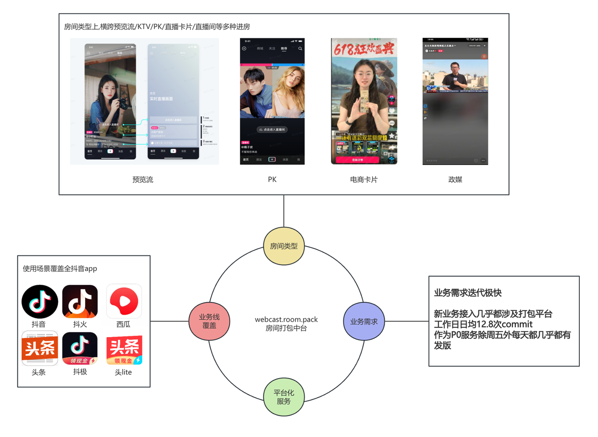
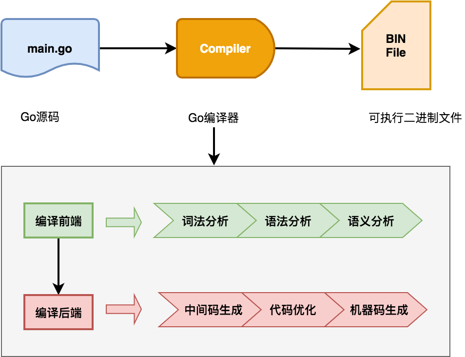
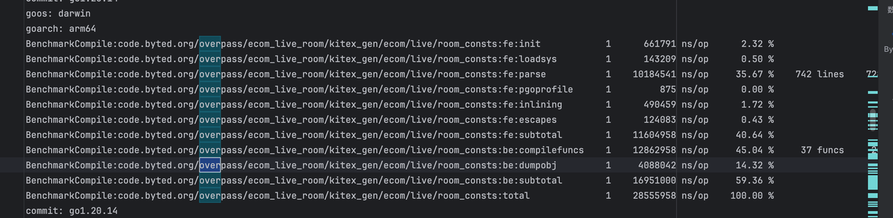
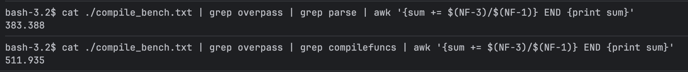
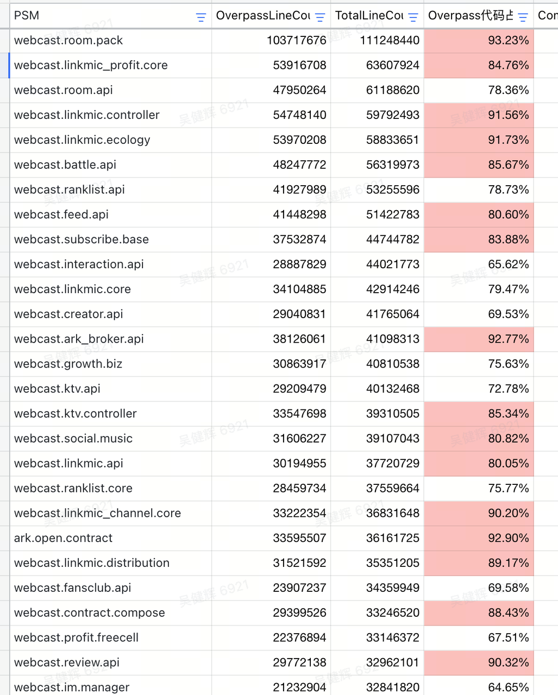

## Intro

大家好，这里是来自抖音直播团队的崔凯、吴健辉、史可鉴和来自 Dev Infra US 团队的 Qilong Hao、Zhanning Lu。

对于后端开发者来说，大型中台服务的开发过程常因编译时间较长感到卡顿难受，有些小改动需要测试验证时，编译的耗时其实远高于开发耗时。这一点在直播团队内的中台服务内部尤为明显。业务接入路径多、PSM 协作复杂、编译深度大导致编译耗时极长，拖累开发效率。

针对这一痛点，直播团队联合 Dev Infra 团队，集成多项优化策略对总编译代码量 1.5 亿的直播房间打包中台 webcast.room.pack 的编译时长进行优化，**将编译时间从 18m20.8s / 6m17.4s => 3m59s / 1m40s，优化幅度高达 78.3% / 73.5%（冷路径/热路径）**。

**若你也想让你们的服务编译速度变得如此丝滑，欢迎联系我们接入对应能力！相关文档见最后一章。**

> **Bazel 优化 X SCM 加速 X golang** 已经在 TT、电商、生活服务、抖音、头条、小说等多个业务线数十个仓落地，接入欢迎垂询 Qilong Hao、Zhanning Lu
> - 普遍取得 **50%～80%** 的编译时间收益
> - 接入成本低到只需一个 MR
> - 用户开发习惯完全不影响，完全兼容 atum
> - 适配 RGO、FTF、coverage 等 SCM 常用插件

> **Trimmer 优化** 目前已经在直播核心场景全量，并且已经接入电商、头条、广告核心业务，接入欢迎垂询薛国林、吴健辉、敖路、袁挺
> - 极大降低编译时间和编译产物大小，普遍收益在 50% 以上
> - 接入仅需配置，对开发完全无感知

## 平台化核心业务的痛点

webcast.room.pack 是直播内部的房间打包中台核心服务，其对全泛直播业务提供房间字段管理能力。业务整体复杂度高，业务迭代快、需求多。内部接入模块极其复杂，包括风控、频控、toolbar、商业化等组件。



作为 Go 服务，在启动优化之前整体的编译时间平均时间达到 22min。这漫长的编译时间成了业务开发效率的极大痛点。按日均 12.8 次 commit，每次编译 22min 计算，每日单在等待上开发每天就要花费 4.7 小时。

## 优化之旅的探索

### 探索黑盒之内：Go 编译过程分析

通常对于 Go 程序员来说，编译过程是一个脾气古怪的黑盒，`go mod tidy` & `go mod vendor` & `go build` 三板斧几乎是大家平常能够见到的涉及 Go 编译的指令。

现在面前如此复杂业务的编译时间优化问题，先让我们回顾一下 Go 的编译原理。宏观上看 Go 的编译主要分为这 6 个编译过程。这些过程是大多数语言共享的编译流程：



微观上，Go 的细化的编译过程主要由 8 个过程组成（这里引用 Go 程序语言指南的表格）：

| 阶段名称 | 主要功能 | 相关包 |
|---------|---------|-------|
| 解析 | 词法分析和语法分析，构建语法树，包含位置信息用于错误和调试。 | cmd/compile/internal/syntax |
| 类型检查 | 使用语法树的 AST 进行类型检查，基于 go/types 的端口。 | cmd/compile/internal/types2 |
| IR 构建（Noding） | 将语法和类型转换为 IR 和类型，使用统一 IR 支持导入/导出和内联。 | cmd/compile/internal/types, cmd/compile/internal/ir, cmd/compile/internal/noder |
| 中端优化 | 包括死代码消除、去虚拟化、内联和逃逸分析等优化。 | cmd/compile/internal/inline, cmd/compile/internal/devirtualize, cmd/compile/internal/escape |
| 遍历（Walk） | 分解复杂语句，引入临时变量，简化构造（如将 switch 转换为跳转表）。 | cmd/compile/internal/walk |
| 通用 SSA | 将 IR 转换为 SSA 形式，应用内建函数，执行机器无关的优化（如死代码消除）。 | cmd/compile/internal/ssa, cmd/compile/internal/ssagen |
| 生成机器码 | 将 SSA 降低为机器特定代码，优化（如寄存器分配），生成包含反射和调试数据的目标文件。 | cmd/compile/internal/ssa, cmd/internal/obj |
| 导出 | 写入导出数据文件，包括类型信息、IR 和逃逸分析摘要。 | |

使用 `go build -gcflags=all='-bench=./compile_bench.txt' ./...` 进行编译分析，显示各个包编译各阶段耗时如下图示意：





聚合所有 parse 和 compilefuncs 阶段的处理速度以及总行数，发现单是 overpass 的生成代码的解析就要 383s，函数处理要 511.935s，总和就要近 15min。再逆向分析直播内部 RPC 的实际代码编译占比，聚焦具体代码，发现 RPC client 并不是全量需要参与编译的，这部分冗余代码实实在在的成为了编译效率的无声杀手。那如何在业务低感知的情况，来移除生成 client 中我们不需要的代码呢？



### 编译时间的静默杀手：Overpass RPC client

对于整个 Go 编译过程来看，整体流程的 SSA 的执行和中端消除花费了很多时间，加上对整体包编译耗时分析，我们发现 overpass RPC client 在整体流程中占比非常大。并且具体看代码，每个 overpass 包中很多时候仅使用了其中的一两个方法，这些"死代码"在编译中直到完整构建完 AST 语法树，完成语义分析之后才会清理，"人畜无害"的引用包却成了编译时间的静默杀手。

#### "去肥增瘦"是优化永恒不变的主题：Trimmer 的引入

对于整体 overpass 包的问题，我们引入一个编译期工具 Trimmer，来提前裁剪 overpass 中的无用 client，减少语法解析器的输入。

**Trimmer 核心路径剖析**

1. **如何介入获取整体的编译依赖**

```shell
go build -debug-actiongraph=actiongraph.json 
```

trimmer 会利用指令获取整体 Go 编译的 DAG，从中分析代码树的依赖路径。

2. **获取的 DAG 文件如何解析？**

```go
func (l *filesLoader) handleAction(action *wenv.ActionJSON) error {
    if !strings.HasPrefix(action.Package, "code.byted.org/") {
       return nil // 非字节内部包不处理，因为不会产生对overpass的引用，也不会是overpass的生成包
    } else if strings.HasPrefix(action.Package, "vendor") {
       return nil // vendor模式下，go的一些命令无法得到预期结果，真出了这个问题应该在外部出警告
    } else if action.Mode != "build" {
       return nil // 非build的action，跳过，因为不涉及到代码使用信息
    }
    pkgItem := gclob.GetActionPkgItem(action)
    l.actionItems.Store(action.Package, pkgItem)
    if pkgItem == nil {
       return fmt.Errorf("failed resolve pkg item: %s", action.Package)
    } else if strings.HasPrefix(pkgItem.Module, "code.byted.org/webcast/trimmed_rpc_gen/") {
       // 如果前置进行了rpc_gen裁减，那么只读取trimmed_rpc_gen下的信息
       return l.loadTrimmedRPCGenUsage(pkgItem)
    } else if pkgItem.Module == l.main.Module || strings.HasPrefix(pkgItem.Module, l.main.Module+"/") {
       l.main.RootDir, l.main.Pkgs[pkgItem.PkgPath] = pkgItem.ModuleDir, pkgItem
    }
    switch pkgItem.GetKind() {
    case module.NonOverpassPkg:
       return l.handleNonOverpassPkg(pkgItem)
    case module.RPCGenPkg:
       // rpc_gen的先不做加载，因为后面的策略可能会不太一样，不一定需要加载
       l.overpassModules.AddWRPCGenPkg(pkgItem)
    case module.RPCClientPkg:
       l.overpassModules.AddWRPCClientPkg(pkgItem)
    case module.RPCV2CommonPkg:
       l.overpassModules.AddWRPCV2CommonPkg(pkgItem)
    case module.RPCV2ClientPkg:
       l.overpassModules.AddWRPCV2ClientPkg(pkgItem)
    case module.OverpassClientPkg:
       l.overpassModules.AddOverpassClientPkg(pkgItem)
    default:
       return fmt.Errorf("unknown pkg(%s) kind: %v", pkgItem.PkgPath, pkgItem.GetKind())
    }
    return nil
}
```

这里获取 action 文件之后根据 pack 的名称前缀进行存储在不同类型的变量之中。不同类型的 client 需要的处理方式各不相同。具体处理的逻辑见下面"如何裁剪冗余代码"章节。

3. **对于不在依赖 DAG 上面的无法触达的代码，如何判断+处理呢？**

这里通过读取文件内容，将这些无法触达的代码回写为只有 `package xxx` 的空 Go 文件，这样降低 AST 的分析成本的同时保持 Go 的编译指令不报错。

```go
removeFiles := map[string]string{}
for dir, files := range unreachable {
    cnt, err := os.ReadFile(filepath.Join(dir, files[0]))
    if os.IsNotExist(err) {
       continue
    } else if err != nil {
       return fmt.Errorf("[UNREACHABLE-REMOVE]failed: %v", err)
    }
    astFile, err := parser.ParseFile(token.NewFileSet(), files[0], string(cnt), parser.PackageClauseOnly)
    if err != nil {
       return fmt.Errorf("[UNREACHABLE-REMOVE]parse file failed: %v", err)
    }
    pkgName := astFile.Name.Name
    for _, f := range files {
       filePath := filepath.Join(dir, f)
       removeFiles[strings.TrimPrefix(filePath, wenv.Root())] = pkgName
       if err := util.WriteStringToFile(filePath, fmt.Sprintf("package %s\n", pkgName)); err != nil {
          return fmt.Errorf("[UNREACHABLE-REMOVE]failed: %v", err)
       }
    }
}
proj.SetRemoveFiles(removeFiles)
```

4. **如何裁剪冗余代码？**

这里我们先对裁剪做定义，按是否保留常量、函数、服务函数等配置细粒度拆解，将其抽象成为配置。

```go
type PkgTrimConfig struct {
    KeepTypes           map[string]bool
    KeepConsts          map[string]bool
    KeepVars            map[string]bool
    KeepDefaults        map[string]bool
    KeepFuncs           map[string]bool
    KeepServicesMethods map[string]*ServiceKeep // key是 service_name
    KeepClientMethods   map[string]bool

    // 为了UT保留的symbol，只为了让tidy不报错
    UTKeepSymbols map[string]bool
}
```

## 总结

通过 Bazel 优化、SCM 加速和 Trimmer 工具的综合应用，抖音直播团队成功将 1.5 亿行代码的编译时间从 18 分钟优化到 1 分 40 秒，优化幅度高达 78.3%。这一成果不仅大幅提升了开发效率，也为其他大型 Go 项目的编译优化提供了宝贵的实践经验。

核心优化策略包括：
- **Trimmer 工具**：通过分析编译依赖 DAG，裁剪无用的 RPC client 代码
- **Bazel 优化**：利用增量编译和缓存机制减少重复编译
- **SCM 加速**：优化代码管理流程，减少不必要的编译触发

如果你的项目也面临类似的编译时间问题，欢迎联系相关团队接入这些优化能力。
