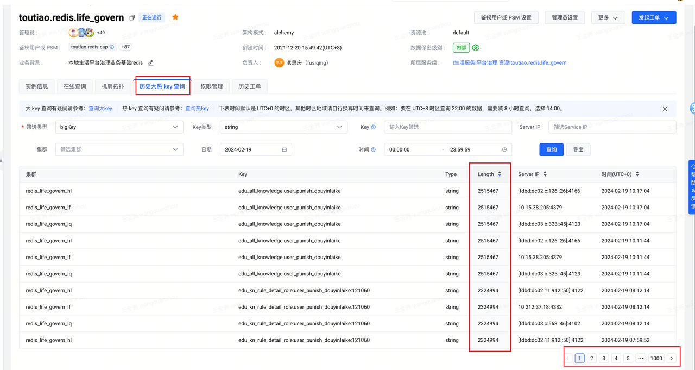
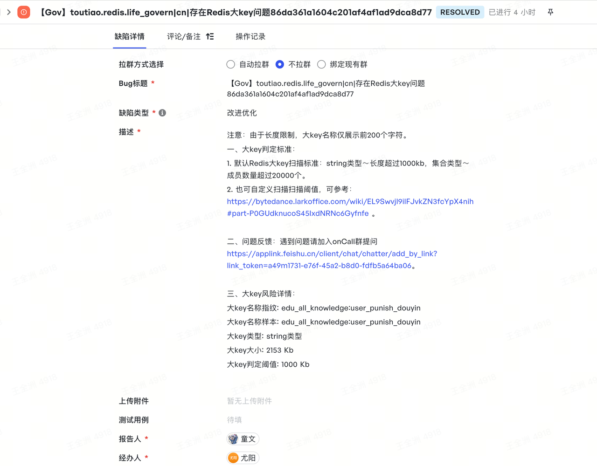
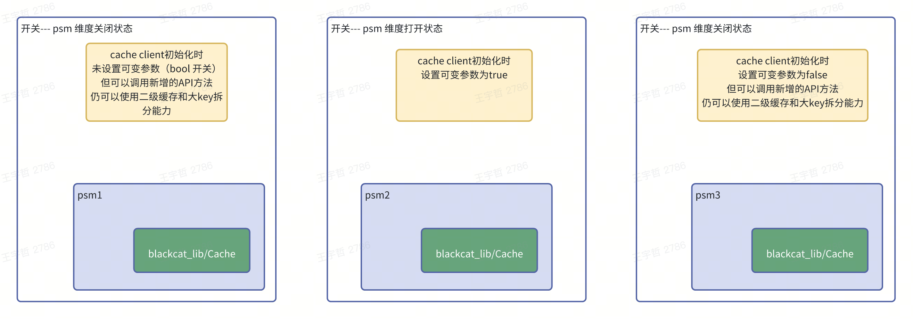
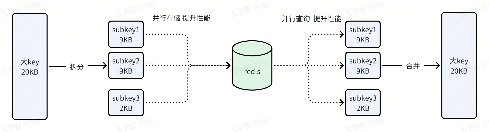
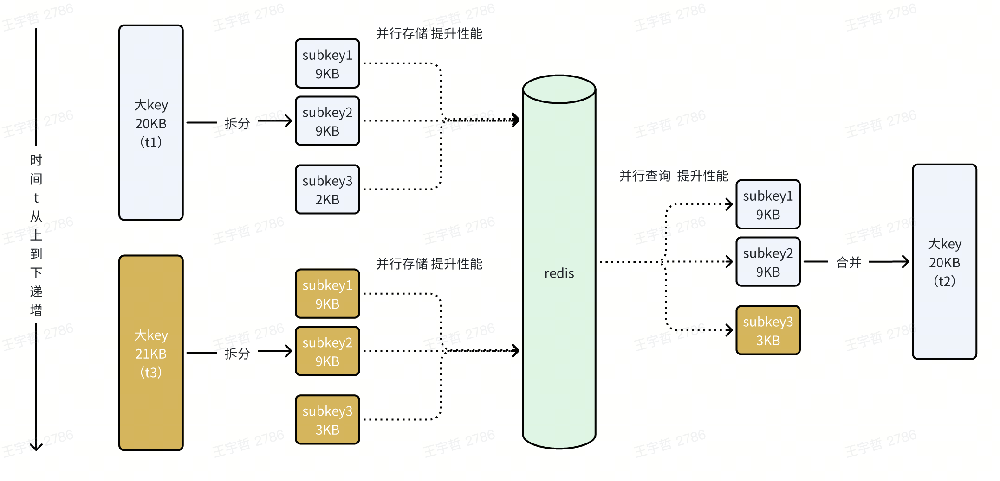
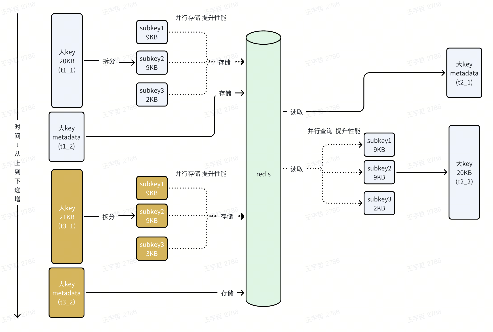
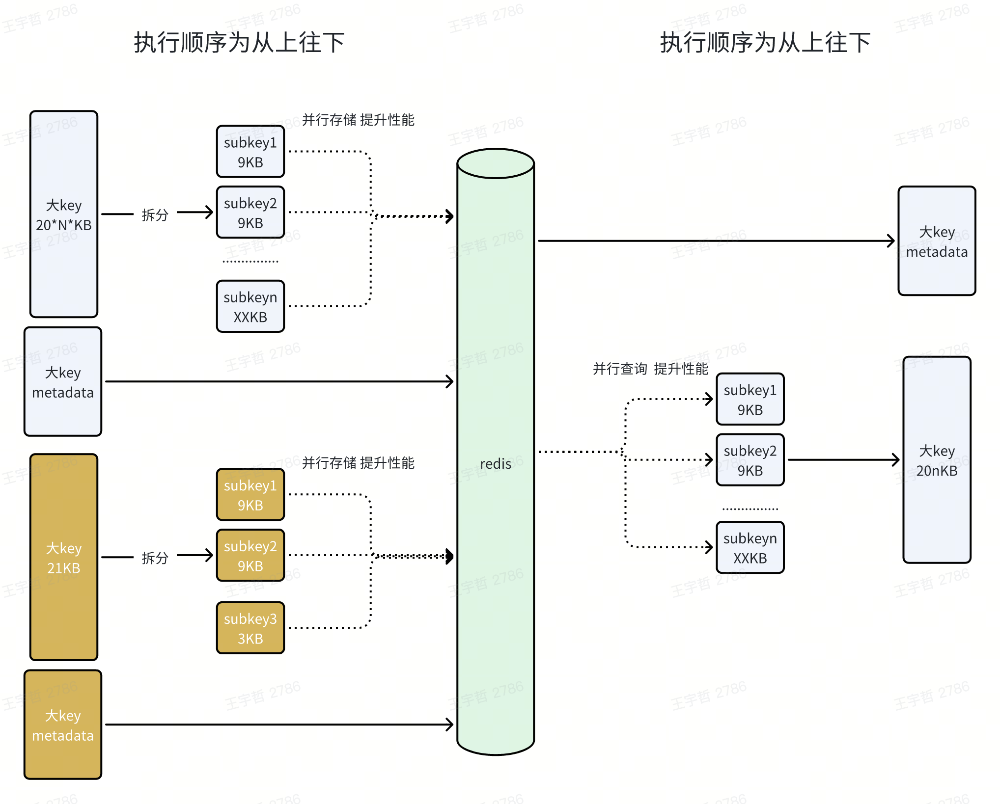

> 使用方法：
> 在业务服务引入依赖：`go get code.byted.org/life/blackcat_lib/client/cache` （要求go版本>=1.17）
> 然后初始化代码如下所示：

```go
// GetClient 获取客户端.
func GetClient() cache.CClient {
    once.Do(func() {
       if r == nil {
          r = cache.NewRedis(toutiao.redis.life_govern)
       }
    })
    return cache.New(r, true)
}
```

目前 `life.governance.blackcat_education` 服务已经在 psm 维度开启了该功能，相关代码可以参考下：
- git：git@code.byted.org:life/governance_blackcat_education.git
- branch：master

## 为什么做大Key的治理

当前治理侧在 Redis 存储的一些数据较大，可能会对 Redis 本身、网络 IO 负载造成较大的负担甚至引起事故，因此 QA 联合 RD 同学推进 Redis 大 Key 治理，治理的基本思路是将大 Key 进行拆分。





## 治理的整体思路

为了尽可能使得治理方案通用，并且降低业务应用接入改造成本，我们将全部治理大 Key 的逻辑封装在一个底层公共 SDK 包（**blackcat_lib**），对于业务方而言完全感知不到底层的处理过程，只需要添加相关底层依赖即可（`go get code.byted.org/life/blackcat_lib/client/cache`），对于其来说和使用原生 Redis 的 get/set 方法无差异。

同时，为了提高数据访问性能（因为存储时拆大 Key，查询时合大 Key 存在性能损耗），我们引入了 gocache 本地缓存以加快查询性能（gocache 中存储的数据是原始的数据，没有进行拆分）。



## 技术实现细节

### 如何让接入更友好

为了降低业务接入方的接入成本，我们设计了两种接入方式：

| 方案 | 适用的场景 | 不适用的场景 |
| --- | --- | --- |
| PSM 维度一键开启整个服务的缓存大 Key 治理 | 整个 PSM 对于 Redis 的存储以 String 类型为主，并且利用 Redis 的场景中是可以容忍二级缓存的短期（1~3s）数据不一致性 | 整个 PSM 对于 Redis 的存储以集合类型为主，或者利用 Redis 的场景中存在对于二级缓存的短期（1~3s）数据不一致性零容忍的场景（数据敏感场景，例如金钱交易等） |
| 接口维度通过指定 API 方法精确开启某个接口的缓存大 Key 治理 | 不适合在 PSM 维度开启缓存大 Key 治理，但某些接口场景仍需要缓存大 Key 治理，并且是以 String 类型存储 | 接口层面 Redis 是以集合类型方式进行的存储 |



### Go 并发提高性能

该能力会自动识别大 Key（底层以 **9KB** 为大 Key 标准，该阈值略微低于目前公司内对于大 Key--小于 1W byte 的阈值），并进行拆分存储，但如果不是大 Key 就不会进行拆分操作，只会进行 Redis set 存储。



某些热 Key 存在频繁的存取操作，在这种并发场景下，如何保证数据的原子性、一致性，需要设计一套完备的技术解决方案。

### 并发下的隐藏问题思考及解决方案

引入 Go 并发固然能提升 Redis 的性能，但其隐藏的问题就需要仔细思考并提出合理完善的处理方案。

#### 并发情况下的数据存储

##### 并发写并发读的问题



考虑如下场景：
- 在 t1 时刻将大 Key（20KB）的数据写入了 Redis
- t2 时刻开始读取数据
- 几乎同时，t3 时刻也开始更新数据，那么最终读取结果就有可能混淆着两次存储的 subkey 数据

为了避免这个问题在 subkey 的组成中引入一个唯一标识，第一时间想到的就是时间戳。在 get 时根据时间戳唯一标识获取指定一组的 subkey。

**Subkey 组成**：`原始key:时间戳标识:索引编号（分片编号）`

**解决方案**：

引入**业务数据+元数据**的存储模式，元数据存储原始 Key 的一些基本信息，比如存储业务数据的总分片数、subkey 的固定前缀、时间戳标识，原始数据 MD5 等。

因为元数据是校验用的，那么在 set 的过程中应该先拆 Key 存储，等拆 Key 存储成功了，再存储元数据信息，保证业务数据与元数据的原子一致性。

而在 get 过程中，就应该先 get 元数据，再 get subkey 数据，也是为了保证业务数据与元数据的原子一致性。

取得 metadata 的数据，就会获取指定一组的 subkey 数据，这就要求 metadata key 对于原始 key 是唯一的，支持并发写。

**Metadata Key 组成**：`原始key:metadata`

##### 并发写 Metadata 的数据覆盖问题

上面的解决方案仍然存在一个问题：



考虑如下场景：
- 假如 t1 时刻存储了一个较大的 Key（20*N*KB）
- 之后 t2 时刻更新 Key 为一个较小的值（21KB）

可能会发生这样的情况，因为 t1 时刻存储的数据较大，存储过程较长，t2 时刻的数据先更新完了，之后 t1 时刻的数据覆盖了 t2 时刻的 metadata 数据，导致 t3 时刻应该获取 t2 时刻的最新数据，却因为并发写覆盖导致获取到了之前 t1 时刻的数据。

**解决方案**：

在 metadata 引入版本，版本也利用时间戳，在覆写 metadata 数据时，先比较版本，只有版本时间戳大于当前版本时间戳才允许 metadata 的覆写操作。
