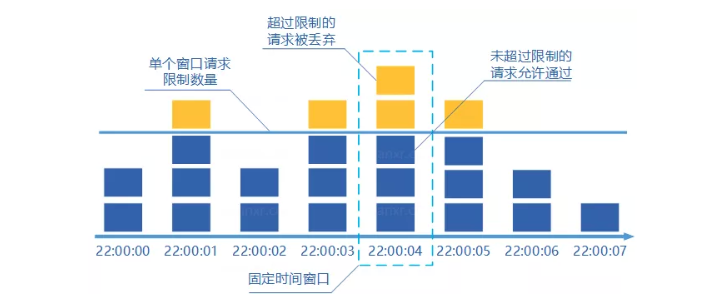
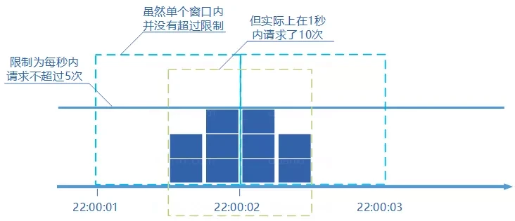
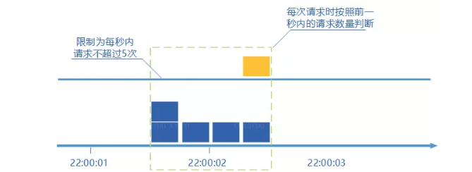
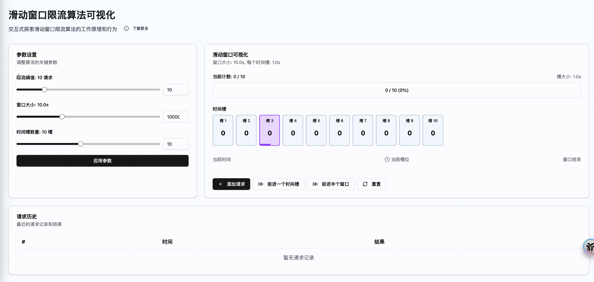
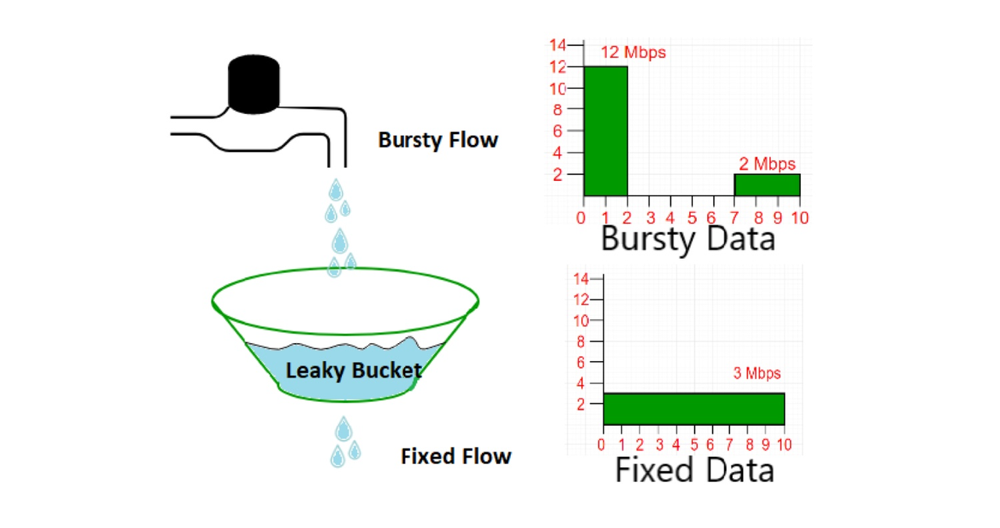

## 一、什么是限流

> 限流是一种用于系统中限制请求流量、次数、用量的技术方案，可用于保护服务的稳定性（当前服务或下游）、限制请求频率（如 OpenAPI 请求速率限制）等。

在高并发系统中，限流是保障系统稳定性的重要手段之一。保障好高并发系统稳定性的三把斧，分别是：**缓存、降级和限流**。**"熔断"** 是被动的限流。

| 缓存 | 降级 | 限流 |
| --- | --- | --- |
| 降低系统处理单请求资源占用，提高系统吞吐。 | 合理分配有限的系统资源，用户体验有损感知下降到最低。 | 保障系统不出现过载，保命。 |
| 主要作用：提升性能 | 主要作用：保障核心功能 | 主要作用：系统稳定性保障 |

## 二、常见限流算法

限流算法是限流组件的核心，不同的算法有不同的特点和适用场景。以下是几种常见的限流算法：

### 计数器算法（固定窗口）

> 原理：在一定的时间间隔 T 内，记录请求次数 N。当 N 大于最大请求限制 Max 时，拒绝请求，否则允许。当时间超过时间间隔 T 时，重新计数。



**本地代码实现**

内存计数器

```go
package limiter

import (
    "sync"
    "time"
)

// FixedWindowLimiter 固定窗口限流器结构体
type FixedWindowLimiter struct {
    rate       int           // 窗口时间内允许的最大请求数
    window     time.Duration // 窗口大小(时间范围)
    counter    int           // 当前窗口内的请求计数
    lastWindow time.Time     // 当前窗口的开始时间
    mu         sync.Mutex    // 互斥锁，保证并发安全
}

// NewFixedWindowLimiter 创建一个新的固定窗口限流器
func NewFixedWindowLimiter(rate int, window time.Duration) *FixedWindowLimiter {
    return &FixedWindowLimiter{
        rate:       rate,
        window:     window,
        lastWindow: time.Now(),
    }
}

// Allow 判断是否允许请求通过
func (l *FixedWindowLimiter) Allow() bool {
    l.mu.Lock()
    defer l.mu.Unlock()
    now := time.Now()
    // 检查是否进入了新的窗口
    if now.Sub(l.lastWindow) > l.window {
        // 重置计数器，开启新窗口
        l.counter = 1
        l.lastWindow = now
        return true
    }
    // 判断当前窗口内请求数是否超出限制
    if l.counter < l.rate {
        l.counter++
        return true
    }
    return false
}
```

**分布式代码实现**

`keyPrefix + 资源标识 + 时间戳` 作为 Redis 键，确保不同资源和时间窗口的隔离 + redis incr 原子计数

```go
// DistributedFixedWindowLimiter 分布式固定窗口限流器
type DistributedFixedWindowLimiter struct {
    client     *redis.Client
    keyPrefix  string  // Redis键前缀，用于区分不同的限流规则
    rate       int     // 限流速率（每秒请求数）
    windowSize int64   // 窗口大小（秒）
}

// NewDistributedFixedWindowLimiter 创建新的分布式固定窗口限流器
func NewDistributedFixedWindowLimiter(client *redis.Client, keyPrefix string, rate int, windowSize int64) *DistributedFixedWindowLimiter {
    return &DistributedFixedWindowLimiter{
        client:     client,
        keyPrefix:  keyPrefix,
        rate:       rate,
        windowSize: windowSize,
    }
}

// Allow 判断请求是否允许通过
func (l *DistributedFixedWindowLimiter) Allow(ctx context.Context, key string) (bool, error) {
    // 构建Redis键，格式为：prefix:key:timestamp
    now := time.Now().Unix()
    windowKey := fmt.Sprintf("%s:%s:%d", l.keyPrefix, key, now/l.windowSize)
    // 使用Redis的原子操作INCR和EXPIRE
    // 1. INCR命令将计数器加1并返回当前值
    // 2. 如果是第一次设置（返回值为1），则设置过期时间为窗口大小
    pipe := l.client.TxPipeline()
    incr := pipe.Incr(ctx, windowKey)
    pipe.Expire(ctx, windowKey, time.Duration(l.windowSize)*time.Second)
    _, err := pipe.Exec(ctx)
    if err != nil {
        return false, fmt.Errorf("failed to execute redis command: %w", err)
    }
    // 判断当前请求数是否超过阈值
    count := incr.Val()
    return count <= int64(l.rate), nil
}
```

**优点**：实现简单，易于理解。

**缺点**：存在 **临界问题**。突发流量会出现 **毛刺现象，限流不准确**。



### 滑动窗口算法

> 原理：将固定时间窗口分成多个小时间片，以时间片为步长 "滑动"，每次滑动时，移除最旧的时间片请求数，加入最新的时间片，并统计当前窗口内的总请求数。



**本地实现代码**

时间槽 + 独立计数器，时间复杂度 O(1), 空间复杂度 O(N)

```go
// SlidingWindowLimiter 滑动窗口限流器
type SlidingWindowLimiter struct {
    rate       int           // 窗口时间内允许的最大请求数
    window     time.Duration // 窗口大小
    slotSize   time.Duration // 时间槽大小
    slotCount  int           // 时间槽数量
    slots      []int         // 各个时间槽的请求计数
    currentPos int           // 当前时间槽位置
    count      int           // 当前窗口内的总请求数
    lastUpdate time.Time     // 最后更新时间
    mu         sync.Mutex    // 互斥锁，保证并发安全
}

// NewSlidingWindowLimiter 创建滑动窗口限流器
// rate: 窗口时间内允许的最大请求数
// window: 窗口大小
// slotCount: 时间槽数量，越多则统计越精确
func NewSlidingWindowLimiter(rate int, window time.Duration, slotCount int) *SlidingWindowLimiter {
    if slotCount <= 0 {
        slotCount = 10 // 默认10个时间槽
    }
    return &SlidingWindowLimiter{
        rate:       rate,
        window:     window,
        slotSize:   window / time.Duration(slotCount),
        slotCount:  slotCount,
        slots:      make([]int, slotCount),
        lastUpdate: time.Now(),
    }
}

// Allow 判断请求是否允许通过
func (l *SlidingWindowLimiter) Allow() bool {
    l.mu.Lock()
    defer l.mu.Unlock()
    now := time.Now()
    // 计算需要滑动的时间槽数量
    slotsToSlide := l.calculateSlotsToSlide(now)
    // 滑动窗口（更新时间槽和计数）
    if slotsToSlide > 0 {
        l.slideWindow(slotsToSlide, now)
    }
    // 判断是否超过限制
    if l.count >= l.rate {
        return false
    }
    // 未超过限制，增加计数
    l.slots[l.currentPos]++
    l.count++
    return true
}

// calculateSlotsToSlide 计算需要滑动的时间槽数量
func (l *SlidingWindowLimiter) calculateSlotsToSlide(now time.Time) int {
    elapsed := now.Sub(l.lastUpdate)
    if elapsed <= 0 {
        return 0
    }
    return int(elapsed / l.slotSize)
}

// slideWindow 滑动窗口，更新时间槽和计数
func (l *SlidingWindowLimiter) slideWindow(slotsToSlide int, now time.Time) {
    // 计算需要重置的时间槽范围
    if slotsToSlide > l.slotCount {
        slotsToSlide = l.slotCount  //（剪枝）
    }
    // 重置过期的时间槽，并更新总计数
    for i := 0; i < slotsToSlide; i++ {
        pos := (l.currentPos + i + 1) % l.slotCount
        l.count -= l.slots[pos]
        if l.count < 0 {
            l.count = 0
        }
        l.slots[pos] = 0
    }
    // 更新当前位置和最后更新时间
    l.currentPos = (l.currentPos + slotsToSlide) % l.slotCount
    l.lastUpdate = now
}

// GetCount 获取当前窗口内的请求数
func (l *SlidingWindowLimiter) GetCount() int {
    l.mu.Lock()
    defer l.mu.Unlock()
    now := time.Now()
    slotsToSlide := l.calculateSlotsToSlide(now)
    if slotsToSlide > 0 {
        l.slideWindow(slotsToSlide, now)
    }
    return l.count
}
```

算法可视化（AIME 实现）：https://838611ed155f.aime-app.bytedance.net/



**分布式实现代码**

Redis Lua + Sorted Set，member 为 timestamp + index，score 为 timestamp

> libs_limiter: https://code.byted.org/webcast/libs_limiter/blob/master/sliderwindow_remote.go

**优点**：通过 "更细的时间片" 降低突发流量概率

**缺点**：
- **没有真正解决** 固定窗口算法的临界突发流量问题。（时间片仍有长度：无论时间片多小（如 100ms、10ms），只要存在固定长度，就可能在 "相邻时间片的交界处" 出现短时间叠加）
- 时间区间的精度越高，算法所需的空间容量就越大

### 漏桶算法（Leaky Bucket）

> 原理：将进来的请求流量视为水滴先放入桶内。水从桶的底部以固定的速率匀速流出，相当于在匀速处理请求。当漏桶内的水满时（超过了限流阈值）则拒绝服务。



**算法实现：**

> Uber：GitHub - uber-go/ratelimit: A Go blocking leaky-bucket rate limit implementation

**优点**：能够严格控制请求的输出速率。

**缺点**：漏桶的容量（最大可存储请求数）决定了能暂存的突发请求量，**超过容量则直接丢弃**。

**适用场景**

适用于严格要求输出速率平稳的场景，例如：
- 网络设备限制上行 / 下行带宽（避免流量波动影响其他用户）。
- 对后端服务稳定性要求极高，不允许任何瞬时过载的场景。

### 令牌桶算法（Token Bucket）

> 原理：系统以固定速率（10/s）生产令牌并放入令牌桶中，桶内令牌数量有上限（即最大容量，如 100）。如果桶中令牌已满，则丢弃令牌。请求过来时先到桶中拿令牌，拿到令牌则放行通过，否则拒绝。

**优点**：
- 允许一定程度的突发流量（桶内有积累的令牌时）
- 平滑限流，长期来看请求速率不会超过令牌生成速率

**缺点**：
- 实现相对复杂
- 需要维护令牌桶状态

**适用场景**

适用于需要允许一定突发流量但又要控制整体速率的场景，例如：
- API 网关限流
- 微服务间调用限流

## 三、限流算法对比

| 算法 | 优点 | 缺点 | 适用场景 |
| --- | --- | --- | --- |
| 固定窗口 | 实现简单 | 临界问题，限流不准确 | 简单场景，对精度要求不高 |
| 滑动窗口 | 比固定窗口更平滑 | 仍有临界问题，空间开销大 | 需要一定精度的场景 |
| 漏桶 | 严格控制输出速率 | 无法应对突发流量 | 需要平稳输出的场景 |
| 令牌桶 | 允许突发流量，平滑限流 | 实现复杂 | 需要允许突发但控制整体速率的场景 |
