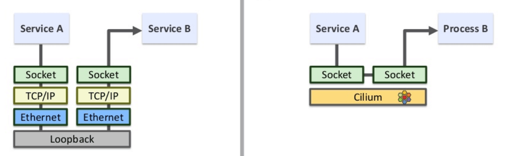
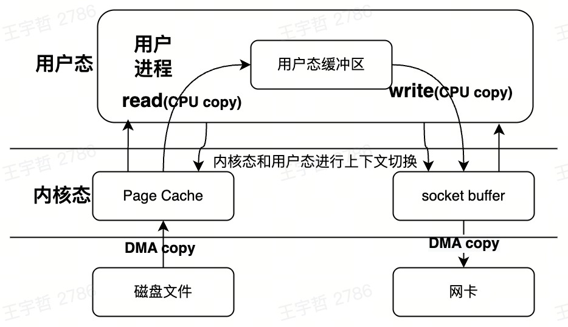
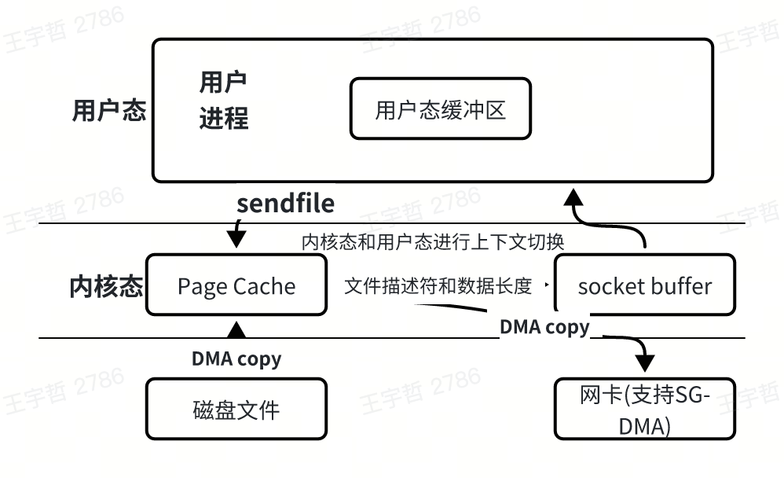

## 引言

互联网产业发展十分迅速，之前的单机环境已经无法支持目前的互联网应用，为了支撑起更加庞大的数据量，分布式、微服务、Service Mesh 等技术应运而生，这些技术将一个复杂的产品进行拆分，针对不同的场景，使用不同类型的处理方式。

简单来说，可以将这些服务分为**数据密集型（data-intensive）**和**计算密集型（compute-intensive）**。

数据密集型应用的特点就是会对大量数据进行 IO 处理，硬件设施和网络带宽无法支持如此庞大的消耗，导致 IO 处理拖慢了整个系统。

从单机时代到分布式时代，免不了会增加大量的网络 IO 传输，这也是目前性能优化的一项重要指标，本文将选取一些切入点，介绍一下如何优化网络数据传输。

## 前置知识

本篇文章将多次提及 eBPF 这项技术，故单独成节，先来简单介绍一下 eBPF。

### eBPF 程序

BPF（Berkeley Packet Filters）全称是伯克利包过滤器[1]，是一项革命性的技术，是 Linux 2.1.75 中新增的一个功能。BPF 技术在最开始是对 Unix 内核实现网络数据包过滤。

到了 2014 年初，Alexei Starovoitov 基于 BPF 技术实现了 eBPF（extended Berkeley Packet Filter），经过重新设计，eBPF 快速成为了一个通用执行引擎，提供了用于实现小程序的最小指令集，这些小程序可以安全地加载到内核中，从而在内核空间的微型虚拟机中执行。

eBPF 提供可基于系统或程序事件高效安全执行特定代码的通用能力，适用于**系统追踪、性能分析工具、操作系统安全、网络优化**等诸多场景。可以安全有效地扩展内核的功能，而无需更改内核源代码或加载 Kernel Module。

eBPF 有很多优点：

1. **灵活，侵入性非常小**：不需要修改内核代码，直接插入内核调用逻辑。
2. **安全，不会影响内核的基础功能**：利用 in-kernel verifier 进行代码安全检测，以保证这些 BPF 程序不会造成内核崩溃、不会大幅度损害内核性能、BPF 程序不会无限循环等。
3. **"易用"[2]，有良好的文档和使用手册**：内核还提供一部分帮助函数[3]，使得 BPF 程序可以通过函数调用来从内核中查询修改和观测数据。
4. **性能优异**：eBPF 的执行可以在解释器中或在设置时执行，它们被即时编译（JITed）以作为本机机器代码直接运行。
5. **方便使用**：创建 eBPF 函数的代码比构建和维护 Kernel Module 的工作要少很多。
6. ......

因为本文主要介绍的网络性能优化，所以这里我直接举几个样例来为大家展现一下 eBPF 在网络上面的强大之处：

1. 可以低成本检测内核中每个 TCP 连接级别的流量。
   - 用途：网络流量监控，tcptop[4]。
2. 在一定程度上，可以直接在内核中修改网络数据包，包括部分协议头字段。
   - 用途：无感知转换 ipv4 <-> ipv6 数据包协议[5]。
3. 可以在内核设置 sockopt。
   - 用途：无感知自动设置 RTT 时延[6]。
4. 设置并解析一些自定义的 tcp option，并有能力将这些数据传递到对端。
   - 用途：常与 sockopt 配合使用，使用 tcp 头进行一些自定义数据传输。
5. 可以在内核提前丢弃、重定向数据包。
   - 用途：治理泛洪攻击，进行流量过滤[7]。
6. ......

对于常用的网络相关的 eBPF 程序，之前我有写过一篇博客进行介绍，大家有兴趣的话可以看看[8]。

### eBPF map

eBPF map 是内核提供的一个通用的数据结构，用于存储不同类型的数据，它被设计成 key/value 的形式，能够在用户态程序与内核态 eBPF 程序之间进行双向通信。提供了用户态和内核态数据交互、数据存储、多程序共享数据等功能。这里截取了一段官方描述[46]：

> eBPF maps are a generic data structure for storage of different data types. Data types are generally treated as binary blobs, so a user just specifies the size of the key and the size of the value at map-creation time. In other words, a key/value for a given map can have an arbitrary structure.
> A user process can create multiple maps (with key/value-pairs being opaque bytes of data) and access them via file descriptors. Different eBPF programs can access the same maps in parallel. It's up to the user process and eBPF program to decide what they store inside maps.

eBPF map 有多种不同类型，支持不同的数据结构，最常见的例如 Array、Percpu Array、Hash、Percpu Hash、lru Hash、Percpu lru Hash、lpm 等等。用户需要根据自己的使用场景来选择特定的 eBPF Map。

## 优化方案

### 单机的网络传输

如果一个数据包，它的传输不需要跨机器，只是从本地的一个进程传输到另外一个进程，当然，直接使用 socket 网络传输肯定也可以兼容这样的情况，发送端和接收端使用不同的端口，地址都 bind localhost，而且在这种情况下，Linux 内核也已经进行了优化，数据包会直接走本地回环，传输性能也不差。

但是，我个人的一个理解，针对单机的网络数据传输，实际上不应该属于网络传输的讨论范畴，更准确的划分应该是将其划分为**进程间通信（IPC）**。

#### 进程间通信

那么这个问题就应该变成了如何选取合适的进程间通信方案，这里直接给出结论，在本地大量数据传输的场景下，只需要在**共享内存（shared memory）**和**本地套接字（UNIX Domain Socket）**这两种方案中进行选择：

1. **如果多进程间不需要有过多的数据相互传输，更多的是需要共享一份数据，而且还要保证一个进程对数据的修改可以被别的进程访问得到：** 那么使用**共享内存**即可，针对并发问题，可以使用文件锁的方式来控制，这里的缺点在于，如果要使用共享内存，则需要在代码中实现对共享内存区域数据的读取/删除/并发控制等处理，而不像直接的内存访问一样方便。

2. **如果多进程间更强调的是数据的传输，即就像普通网络传输的那种使用方式：** 那么使用**本地套接字**的方案，至于本地套接字是什么东西，怎么实现，由于篇幅原因这里就不进行过多的介绍了，简单说，就是一个使用方法完全和网络 socket 传输一致的一种专用于本地通信的传输方案，正好，前段时间分享过的字节微服务合并部署方案[9]中也提到过 uds，大家有兴趣也可以去了解一下。

#### 更复杂的场景

这两种方案可以解决所有的问题吗？很遗憾，答案是否定的，我举几个非常常见的例子：

Server Mesh 里面常常出现的 Sidecar，数据监控和运维里面常常出现的 agent，在这种场景下，一个用户进程既要处理本地的数据传输，又要和其他机器的进程进行网络通信，在这种场景下，该如何使用 uds？难道我需要去代码进行特判？但是我本身的代码框架已经十分稳定，是否有必要因为一点性能优势去大动干戈？对于这种场景有什么更简单的优化方案吗？

针对这种情况，业内现在非常火的 cilium[10] 实际上已经有了比较好的解决方案[11]，这里使用的就是 eBPF 技术。

这里不深入技术细节，简单讲一下 cilium 实现的思路，这里 cilium 主要使用两类 BPF 程序做了两件事情：

1. 在创建 TCP 网络连接时，会回调 `BPF_PROG_TYPE_SOCK_OPS` BPF 程序，在这个程序中，把数据的发送端/接受端的五元组都存在 eBPF map 结构中。
2. 在调用 `sendmsg()` 系统调用触发数据发送时，会回调 `BPF_PROG_TYPE_SK_MSG` BPF 程序，在这个程序里查询接收端的五元组，如果可以查到，则说明接收端在本机，则直接将数据发送到对端的 socket queue 中。

这样，一步即可完成网络数据传输，不需要经过 TCP 网络协议栈，用户态完全无感知的提升了性能。



### 多台机器之间的网络传输

上面介绍了单机的网络优化方式，实际上，本地的网络传输一般都不会成为性能瓶颈，真正的问题大多都聚焦在多台机器之间的网络传输。

#### 文件传输

对于文件传输的场景，传统 I/O 的工作方式是发送端 `read` 系统调用读文件，再将读到的数据使用 `write` 系统调用发送到对端，代码写起来很简单，但是实际上性能很差，内核在这个过程中进行了很多工作：

1. 调用系统调用 `read`，**进行一次用户态到内核态的上下文切换。**
2. **进行一次 DMA copy**，将文件读到内核的 Page Cache 中。
3. **进行一次 CPU copy**，将数据从 Page Cache 中读到用户态缓冲区。
4. 回到用户态，**进行一次内核态到用户态的上下文切换。**
5. 调用系统调用 `write`，**进行一次用户态到内核态的上下文切换。**
6. **进行一次 CPU copy**，将数据从用户态缓冲区中读到套接字缓冲区。
7. 进行一次 **DMA copy**，将文件读到网卡中，进行网络数据传输。
8. 回到用户态，**进行一次内核态到用户态的上下文切换。**



为了进行一次文件传输，这里一共进行 **4 次上下文切换，2 次 CPU copy，2 次 DMA copy**，性能损耗很大。

为了优化这种场景，从 Linux 2.1 开始，提供了一个专门优化发送文件的系统调用函数 `sendfile`。

`sendfile` 可以直接把内核缓冲区里的数据拷贝到 socket 缓冲区里，不再拷贝到用户态，节省了两次十分影响性能的 CPU 拷贝。这样就只有 **2 次上下文切换，和 2 次 DMA Copy**，以实现所谓的零拷贝（Zero Copy）技术。



因为 `sendfile` 的强大能力，很多开源软件都提供了 `sendfile` 优化，比如 NGINX[12]，但是如果细心一点，看一下 NGINX 的源码，就会发现 NGINX 不是在所有情况下都无脑使用 `sendfile` 的，这里贴一下 NGINX 源码的注释[13]：

```c
/*
 * With DIRECTIO, disable sendfile() unless sendfile(SF_NOCACHE)
 * is available.
 */
```

先看前半句，Direct I/O 是什么东西？为什么在打开 Direct I/O 的时候要关闭 `sendfile`？

在讲 Direct I/O 前，先回到上面的第一种使用 `read/write` 的发送数据方案，介绍一下 Linux 默认使用的 Buffer I/O，在 Linux 使用 Buffer I/O 时，它会利用程序局部性原理（Locality of reference），会在文件操作时使用页缓存（Page Cache）机制。

每次在调用 `read` 时，如果操作系统内核地址空间的页缓存中有数据，就直接读取出该数据并直接返回给应用程序，如果没有就从磁盘读取数据到页缓存。然后再从页缓存拷贝到应用程序的地址空间。

调用 `write` 时，数据会先从应用程序的地址空间拷贝到操作系统内核地址空间的页缓存，然后再写入磁盘。根据 Linux 的延迟写机制，当数据写到操作系统内核地址空间的页缓存就意味 `write` 完成了，操作系统会定期地将页缓存的数据刷到磁盘上。

这样的操作在很多场景中，可以大大减少读写磁盘的次数，保护了磁盘，同时也提升了数据读写的性能。

不过页缓存也是一把双刃剑，同样会引入很多缺点：

1. **因为页缓存处于内核空间，不能被用户进程直接寻址，所以每次使用页缓存时，还需要将页缓存数据拷贝到内存对应的用户空间中。** 这样，需要两次数据拷贝才能完成用户进程对数据的读取操作。写操作也是一样，将页缓存的数据写入磁盘的时候，必须先拷贝到内核空间对应的主存，然后再写入磁盘中。

2. **而且与磁盘空间相比，内存空间永远是不够用的，页缓存空间也是有限的，当缓存满了时也需要对缓存数据进行淘汰。** 这时如果进行非常大量的数据访问，每次访问都会打满页缓存，读到的数据立马就被淘汰，下次访问又需要读写磁盘，那么这里缓存就并不能实现局部性优化。

`sendfile` 从设计之初就定下来使用页缓存机制[14]，它虽然不会引入缺点 1，但是在发送大文件时还是会引入缺点 2，比如存储领域，往往需要发送很多非常巨大的文件，这时为了不去影响 Linux 内核的页缓存，就出现了 Direct I/O。

**如果使用 Direct I/O 进行数据传输，数据会直接在用户地址空间的缓冲区和磁盘之间直接进行传输，中间去掉页缓存。** 在使用 Direct I/O 的场景里，使用方往往更倾向于选择自己的缓存机制，会使用更加贴合自己使用场景的缓存机制来提高数据的存取性能，因此，这里 NGINX 在 Direct I/O 时关闭 `sendfile` 也是合理的。

再回到上面的那行注释，为什么这里又说，在 `sendfile(SF_NOCACHE)` 打开之后，又不需要关闭 `sendfile` 了呢？

```c
/*
 * With DIRECTIO, disable sendfile() unless sendfile(SF_NOCACHE)
 * is available.
 */
```

原来是在某一些系统中（比如 FreeBSD 11），为了兼容大量文件发送的场景，为 `sendfile` 添加了新的参数 SF_NOCACHE，使 `sendfile` 可以不使用页缓存，可以直接与 Direct I/O 一起使用，在这种系统中就不需要禁用 `sendfile` 了[15]。

#### 数据压缩传输

上面介绍了 `sendfile`，它可以使传输数据变得更快，但是如果传输数据量在上一个级别（如 hbase，hdfs 这类分布式存储组件），传输量高到可以直接打满带宽。在这种场景之下，单位时间传输的数据到达了瓶颈，这些优化也就很难发挥它们的作用了，所以这里在一些大数据场景下，会选择使用数据压缩的方式来减少网络传输的数据量。

## 总结

本文从单机网络传输和多机网络传输两个维度，介绍了网络数据传输的优化方案：

1. **单机网络传输优化**：
   - 进程间通信可选择共享内存或 UNIX Domain Socket
   - 使用 eBPF 技术（如 cilium）可以无感知地加速本地网络传输

2. **多机网络传输优化**：
   - 使用 `sendfile` 实现零拷贝，减少上下文切换和数据拷贝
   - 根据场景选择 Buffer I/O 或 Direct I/O
   - 大数据场景下考虑数据压缩传输

网络性能优化是一个系统工程，需要根据具体的业务场景选择合适的优化方案。

## 参考资料

- [1] Berkeley Packet Filters
- [2] eBPF 文档和使用手册
- [3] eBPF 帮助函数
- [4] tcptop - TCP 流量监控工具
- [5] ipv4/ipv6 数据包协议转换
- [6] RTT 时延设置
- [7] 流量过滤和泛洪攻击治理
- [8] 网络相关的 eBPF 程序介绍
- [9] 字节微服务合并部署方案
- [10] cilium 官网
- [11] cilium eBPF 加速方案
- [12] NGINX sendfile 优化
- [13] NGINX 源码注释
- [14] sendfile 页缓存机制
- [15] FreeBSD sendfile SF_NOCACHE 参数
- [46] eBPF maps 官方描述
