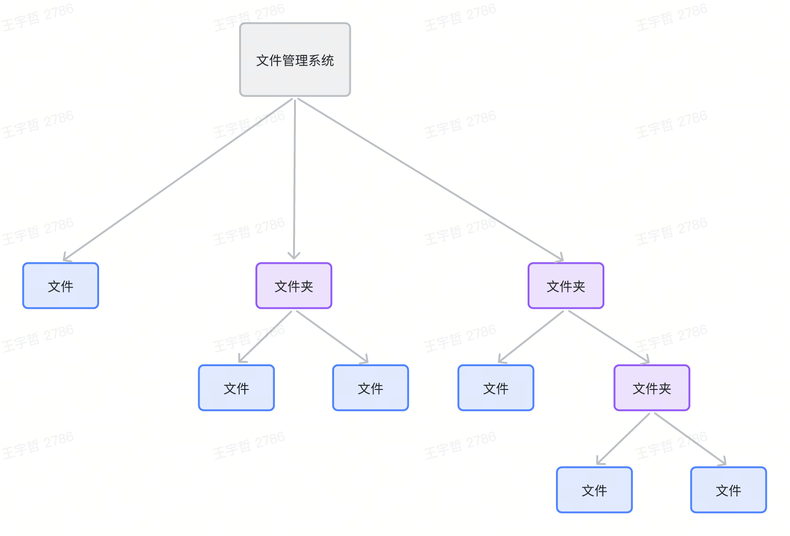
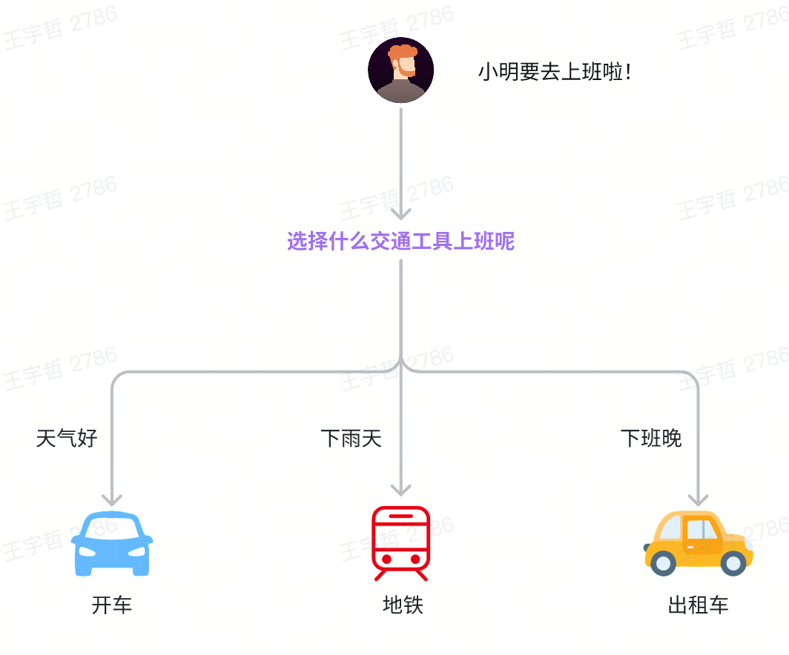

提及"设计模式"，你是否立刻想到厚重的《设计模式》经典书中那些基于类继承的复杂结构？

如果你曾感到这些模式在崇尚简单、组合、并发的 Go 语言中有些"水土不服"，那么，这篇文章正是为你而写。

本文聚焦于 Go 语言中**最实用、最高效**的几种设计模式，探索如何以 Go 的独有方式来优雅地解决那些经典的设计难题。

## Go 的设计哲学 & 对设计模式的影响

在 Go 的世界里，设计模式不应是生搬硬套的教条，而应是自然流露的编程范式和设计思想：

- **没有传统继承** -> 多用组合：组合模式、策略模式、装饰器模式更自然。
- **接口是隐式的** -> 依赖注入/策略模式更灵活：不需要显式声明实现。
- **一等公民函数** -> 函数式模式：闭包、高阶函数简化某些模式（如策略、装饰器）。
- **强大的并发原语** -> 独特的并发模式：Pipeline, Worker Pool 等。
- **简洁性优先** -> 避免过度设计：模式是工具，不是教条。Go 社区倾向于更简单直接的方案。

在崇尚简单、组合、并发的 Go 世界里，一些模式变得更加自然和实用。本系列将结合 Golang 的语言特色和流行开源库源码，介绍这些设计模式，包括：

- 组合模式
- 策略模式
- 装饰器模式
- 工厂模式（WIP）
- 单例模式（WIP）
- 观察者模式（WIP）
- 责任链模式（WIP）

## 组合模式


### 适用场景

1. **表示部分-整体层次结构**：当需要表示一个对象的部分-整体层次结构（如树形菜单、文件系统、组织架构等）时，组合模式非常有用。
2. **希望忽略组合对象与单个对象的差异**：可以一致地使用组合结构中的所有对象，而不必关心它是叶子节点还是组合节点。

### 实现方式

我们结合一个具体的问题来看如何实现组合模式——如何计算文件系统的文件大小总量

**1. 理清树结构**

> 文件夹是组合节点（复杂对象），文件是叶子节点（简单对象）



**2. 定义接口，声明公共行为**

> 以计算文件系统的文件大小总量为例。公共方法为 `GetSize()`

```go
// 声明组合中简单和复杂对象的通用操作
type FileSystemNode interface {
    GetSize() int64
}
```

**3. 实现接口，定义叶子节点和组合节点**

> 叶节点类：代表组合的终端对象。叶节点对象中不能包含任何子对象。叶节点对象通常会完成实际的工作，组合对象则仅会将工作委派给自己的子部件。
> 
> 组合类：表示可能包含子项目的复杂组件。组合对象通常会将实际工作委派给子项目，然后"汇总"结果。

```go
// File 叶子节点类
type File struct {
    Size int64
}

func (f *File) GetSize() int64 {
    return f.Size
}

// Folder 组合节点类
type Folder struct {
    fileNodes []FileSystemNode
}

func (f *Folder) GetSize() int64 {
    var size int64 = 0
    for _, fileNode := range f.fileNodes {
        size += fileNode.GetSize()
    }
    return size
}

func (f *Folder) Add(n FileSystemNode) {
    if f.fileNodes == nil {
        f.fileNodes = make([]FileSystemNode, 0)
    }
    f.fileNodes = append(f.fileNodes, n)
}
```

**4. 构建树，调用接口方法**

```go
// root/
// ├── folder2/
// │   ├── file2 (Size: 2)
// │   ├── file3 (Size: 3)
// │   └── folder1/
// │       └── file1 (Size: 1)
// └── file4 (Size: 4)

func main() {
    root := &Folder{}

    file1 := &File{Size: 1}
    file2 := &File{Size: 2}
    file3 := &File{Size: 3}
    file4 := &File{Size: 4}

    folder1 := &Folder{}
    folder1.Add(file1)

    folder2 := &Folder{}
    folder2.Add(file2)
    folder2.Add(file3)
    folder2.Add(folder1)

    root.Add(folder2)
    root.Add(file4)

    fmt.Println(root.GetSize())
}
```

### 开源社区的组合模式

#### net/http

net/http 通过组合模式来组装 API 路由树。

**1. 接口定义**

```go
// Handler 接口是所有 HTTP 处理器的统一契约
type Handler interface {
    ServeHTTP(ResponseWriter, *Request)
}
```

**2. 叶对象和组合对象定义**

**叶对象：HandlerFunc**

> 这里就能看出 Go 语言中"函数是一等公民"的魅力了

```go
// HandlerFunc 是一个函数类型，它实现了 Handler 接口
type HandlerFunc func(ResponseWriter, *Request)

// ServeHTTP 方法让 HandlerFunc 成为 Handler
func (f HandlerFunc) ServeHTTP(w ResponseWriter, r *Request) {
    f(w, r)  // 直接调用自身函数
}
```

```go
// 普通函数
func helloHandler(w http.ResponseWriter, r *http.Request) {
    fmt.Fprintf(w, "Hello, World!")
}

// 转换为 Handler
var handler http.Handler = http.HandlerFunc(helloHandler)

// 或者直接使用
http.Handle("/hello", http.HandlerFunc(helloHandler))
```

**组合对象：ServeMux**

> 核心 API：接口方法 & 添加子对象

```go
// ServeMux 是 HTTP 请求多路复用器
type ServeMux struct {
    mu    sync.RWMutex
    m     map[string]muxEntry  // 存储路由到处理器的映射
    es    []muxEntry           // 用于模式匹配的切片
    hosts bool                 // 模式是否包含主机名
}

type muxEntry struct {
    h       Handler
    pattern string
}

// ServeMux 自己也实现了 Handler 接口
func (mux *ServeMux) ServeHTTP(w ResponseWriter, r *Request) {
    // 根据请求路径查找对应的 Handler
    h, _ := mux.Handler(r)
    h.ServeHTTP(w, r)  // 委托给找到的 Handler
}

func (mux *ServeMux) Handler(r *Request) (h Handler, pattern string) {
    // 根据请求的路径 r.Host+r.URL.Path 找到响应的处理器
    // 上读锁，优先从 mux.m 中找处理器，没有则遍历 mux.es 做模式匹配
}

// 注册 Handler 到 ServeMux
func (mux *ServeMux) Handle(pattern string, handler Handler) {
    mux.mu.Lock()
    defer mux.mu.Unlock()

    // 将 pattern 和 handler 存储到 mux 的映射中
    mux.m[pattern] = muxEntry{h: handler, pattern: pattern}
}

// 便捷函数：注册函数类型的处理器
func (mux *ServeMux) HandleFunc(pattern string, handler func(ResponseWriter, *Request)) {
    mux.Handle(pattern, HandlerFunc(handler))  // 将函数转换为 HandlerFunc
}
```

**3. 构建 API 路由树**

```go
// mainMux (根组合对象)
// ├── /api/* → apiMux (子组合对象)
// │   ├── /users → usersHandler (叶对象)
// │   └── /products → productsHandler (叶对象)
// ├── /admin/* → adminMux (子组合对象)
// │   ├── /dashboard → adminDashboardHandler (叶对象)
// │   └── /settings → adminSettingsHandler (叶对象)
// └── /static/* → FileServer (叶对象)

func main() {
    // 创建主路由
    mainMux := http.NewServeMux()

    // 创建 API 子路由（组合对象）
    apiMux := http.NewServeMux()
    apiMux.HandleFunc("/users", usersHandler)
    apiMux.HandleFunc("/products", productsHandler)

    // 创建 Admin 子路由（组合对象）
    adminMux := http.NewServeMux()
    adminMux.HandleFunc("/dashboard", adminDashboardHandler)
    adminMux.HandleFunc("/settings", adminSettingsHandler)

    // 将子路由注册到主路由（组合对象的组合）
    mainMux.Handle("/api/", http.StripPrefix("/api", apiMux))
    mainMux.Handle("/admin/", http.StripPrefix("/admin", adminMux))

    // 静态文件处理器（叶对象）
    mainMux.Handle("/static/", http.FileServer(http.Dir("static")))

    http.ListenAndServe(":8080", mainMux)
}
```

**4. 请求处理的流程（递归流程）**

```go
// 当请求到达时：
// 1. 主 ServeMux 的 ServeHTTP 被调用
func (mux *ServeMux) ServeHTTP(w ResponseWriter, r *Request) {
    // 2. 根据 URL 路径查找对应的 Handler
    h, pattern := mux.Handler(r)

    // 3. 委托给找到的 Handler
    h.ServeHTTP(w, r)
}

// 如果找到的是子 ServeMux，流程重复：
// 子 ServeMux 的 ServeHTTP 被调用 → 查找 → 委托

// 如果找到的是 HandlerFunc，直接执行：
func (f HandlerFunc) ServeHTTP(w ResponseWriter, r *Request) {
    f(w, r)  // 执行实际的业务逻辑
}
```

### Go 语言特色下的最佳实践

1. **使用接口定义共同行为**：定义一个接口，该接口声明了组合对象和叶子对象共同的方法。
2. **利用结构体嵌入**：Go 语言没有继承，但可以通过结构体嵌入来复用代码。在组合模式中，可以将公共的字段和方法嵌入到结构体中。
3. **避免在接口中定义不属于所有对象的方法**：例如，管理子节点的方法（如 Add、Remove）应该只存在于组合节点中，叶子节点不应该有这些方法。在 Go 中，我们可以通过定义多个接口来分离这些行为。
4. **提供便捷的遍历和操作方法**：可以为组合对象提供遍历子节点的方法，以及添加、删除子节点的方法。
5. **注意并发安全**：如果组合结构会被多个 goroutine 同时访问，需要考虑使用互斥锁等机制来保证并发安全。

### 总结

遇到要**构建树，递归解决问题**的时候，那多半是组合模式来活了。

组合模式在 Go 中特别强大，因为 Go 的设计哲学天然支持组合而非继承。通过合理运用接口、结构体嵌入和函数，可以构建出既灵活又易于维护的系统。

## 策略模式



### 适用场景

定义一系列算法，将它们封装起来，并且使它们可以相互替换，**让算法代码独立于使用它的代码**。

> 同一问题 -> 多种解法 -> 运行时选择

### 实现方式

以上班通勤为例

**1. 定义策略接口，描述需要解决什么问题**

```go
// 定义通勤工具接口
type CommutingVehicle interface {
    // 上班通勤
    CommuteToWork()
}
```

**2. 实现相应算法，实现具体的解法**

```go
// 具体的解法
type Car struct{}

func (c *Car) CommuteToWork() {
    fmt.Println("Commute to work by car")
}

type Subway struct{}

func (s *Subway) CommuteToWork() {
    fmt.Println("Commute to work by subway")
}

type Taxi struct{}

func (t *Taxi) CommuteToWork() {
    fmt.Println("Commute to work by taxi")
}
```

**3. 实现上下文类**

> 维护指向具体策略的引用，且仅通过策略接口与该对象进行交流。
> 
> 核心 API：设置策略 + 执行策略

```go
// 通勤者 - 策略模式的上下文类
type Commuter struct {
    name    string
    from    string
    to      string
    vehicle CommutingVehicle // 当前选择的通勤工具
}

// 创建通勤者实例
func NewCommuter(name, from, to string) *Commuter {
    return &Commuter{
        name: name,
        from: from,
        to:   to,
    }
}

// 设置策略：手动设置通勤工具
func (c *Commuter) SetVehicle(vehicle CommutingVehicle) {
    c.vehicle = vehicle
}

// 执行策略：执行通勤
func (c *Commuter) GoToWork() error {
    if c.vehicle == nil {
        return errors.New("请先选择通勤工具")
    }

    c.vehicle.CommuteToWork()

    fmt.Printf("路线: %s → %s\n", c.from, c.to)
    fmt.Printf("%s 顺利到达公司\n", c.name)
    fmt.Println("---")

    return nil
}
```

**4. 运行时选择解法，使用解法**

```go
func main() {
    // 创建打工人
    worker := NewCommuter("张三", "闵行", "徐汇")

    // 模拟上班情况
    condition := "晴天"
    switch condition {
    case "下班晚":
        worker.SetVehicle(&Taxi{})
    case "晴天":
        worker.SetVehicle(&Car{})
    case "下雨":
        worker.SetVehicle(&Subway{})
    }

    worker.GoToWork()
}
```

### 开源社区的策略模式

#### sort

##### sort.Slice

Slice 为上下文，less 函数为策略

> 函数是一等公民！

```go
// package sort
// slice.go 24行
func Slice(x any, less func(i, j int) bool) {
    rv := reflectlite.ValueOf(x)
    swap := reflectlite.Swapper(x)
    length := rv.Len()
    limit := bits.Len(uint(length))
    pdqsort_func(lessSwap{less, swap}, 0, length, limit)
}
```

示例代码：

```go
func main() {
    arr := []int{1, 2}
    sort.Slice(arr, func(i, j int) bool {
        return arr[i] < arr[j]
    })
}
```

##### sort.Sort

对一个自定义类型进行排序时，常用 sort.Sort 方法。

**这里留个问题，下面代码中上下文和策略分别是什么？**

```go
// package sort
// sort.go 14行
type Interface interface {
    // Len is the number of elements in the collection.
    Len() int

    // Less reports whether the element with index i
    // must sort before the element with index j.
    //
    // If both Less(i, j) and Less(j, i) are false,
    // then the elements at index i and j are considered equal.
    // Sort may place equal elements in any order in the final result,
    // while Stable preserves the original input order of equal elements.
    //
    // Less must describe a transitive ordering:
    //  - if both Less(i, j) and Less(j, k) are true, then Less(i, k) must be true as well.
    //  - if both Less(i, j) and Less(j, k) are false, then Less(i, k) must be false as well.
    //
    // Note that floating-point comparison (the < operator on float32 or float64 values)
    // is not a transitive ordering when not-a-number (NaN) values are involved.
    // See Float64Slice.Less for a correct implementation for floating-point values.
    Less(i, j int) bool

    // Swap swaps the elements with indexes i and j.
    Swap(i, j int)
}
```
