# 从单兵作战到团队协作：Claude Code Agent Teams 实战教程

> 你有没有过这种经历？凌晨 2 点还在排查一个诡异的 bug，有 5 个猜想但只能一个一个试；或者要 review 一个 PR，既要检查安全、又要看性能、还要补测试，忙得三头六臂都不够用。
>
> 现在，你可以让多个 Claude 同时帮你干活了——一个查安全，一个看性能，一个写测试，它们还能互相讨论。
>
> 这就是 Agent Teams。

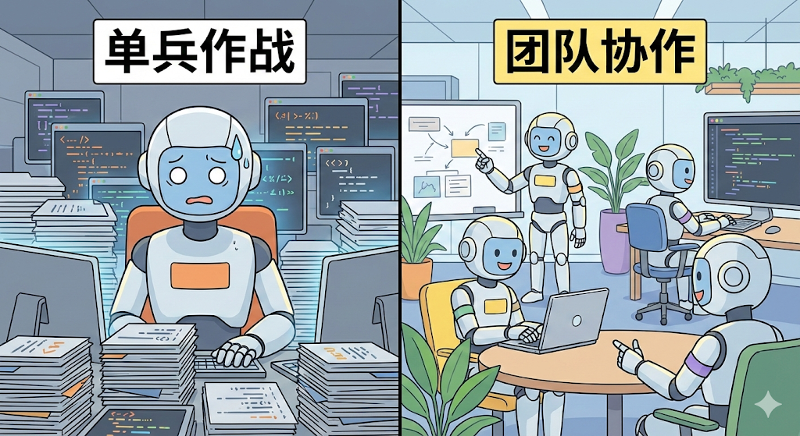
<!-- 漫画插图 Prompt:
{
  "name": "封面图",
  "description": "从单兵作战到团队协作的对比",
  "style": "现代极简漫画风格",
  "layout": {
    "type": "分屏对比",
    "sections": [
      {
        "position": "左侧",
        "name": "单兵作战",
        "elements": [
          {
            "name": "Claude 机器人",
            "state": "焦头烂额",
            "details": "额头冒汗"
          },
          {
            "name": "代码文件",
            "state": "堆积如山",
            "details": "围绕机器人四周"
          }
        ]
      },
      {
        "position": "右侧",
        "name": "团队协作",
        "elements": [
          {
            "name": "4个 Claude 机器人",
            "state": "分工合作，开心工作",
            "roles": [
              "一个指着白板讲解",
              "一个在笔记本上打字",
              "一个在审查代码",
              "一个在协调工作"
            ]
          }
        ]
      }
    ]
  },
  "visual": {
    "colors": "明亮欢快的配色",
    "lines": "简洁的线条画",
    "background": "科技办公室背景",
    "text": "无文字"
  }
}
-->

---

## 目录

1. [为什么需要 Agent Teams？](#为什么需要-agent-teams)
2. [什么是 Agent Teams？](#什么是-agent-teams)
3. [上手教程：6 步创建你的第一个团队](#上手教程6-步创建你的第一个团队)
4. [三个实战案例](#三个实战案例)
5. [最佳实践与避坑指南](#最佳实践与避坑指南)
6. [真实案例：16 个 Claude 写了一个 C 编译器](#真实案例16-个-claude-写了一个-c-编译器)
7. [总结：现在就开始试试吧！](#总结现在就开始试试吧)

---

## 为什么需要 Agent Teams？

### 痛点：一个 Claude 不够用

用过 Claude Code 的开发者应该都有体会：它虽然很强，但本质上还是**单兵作战**——一个 Agent 实例从头干到尾，遇到复杂任务就只能串行处理。

比如你遇到一个诡异的 bug，有 5 个不同的猜想：是网络问题？是数据库锁？是内存泄漏？还是竞态条件？单个 Claude 只能一个一个去试，试到第三个才发现第一个方向走偏了，时间都浪费了。

又比如你要重构一个认证模块：安全性要审、性能要测、测试用例要补，这些工作明明可以并行，但单个 Claude 只能排着队一个一个来。

### 解决方案：让多个 Claude 组成团队

Claude Code 的 Agent Teams 功能，就是让你像带团队一样指挥多个 Claude Code 实例并行干活：
- 一个当**领导**负责调度
- 其他的当**队员**各自领任务
- 队员之间还能**互相交流、互相质疑**

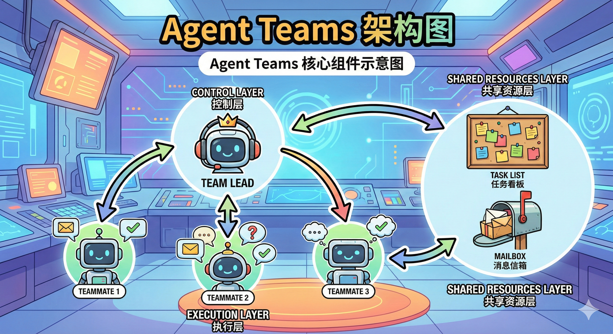
<!-- 漫画插图 Prompt:
{
  "name": "Agent Teams 架构图",
  "description": "Agent Teams 核心组件示意图",
  "style": "现代极简漫画风格",
  "layers": [
    {
      "name": "控制层",
      "type": "core",
      "components": [
        {
          "name": "Team Lead",
          "type": "主控机器人",
          "icon": "戴耳机的机器人",
          "position": "中央"
        }
      ]
    },
    {
      "name": "执行层",
      "type": "workers",
      "components": [
        {
          "name": "Teammate 1",
          "type": "队员机器人"
        },
        {
          "name": "Teammate 2",
          "type": "队员机器人"
        },
        {
          "name": "Teammate 3",
          "type": "队员机器人"
        }
      ],
      "connection": "通过消息气泡与 Team Lead 连接"
    },
    {
      "name": "共享资源层",
      "type": "shared",
      "components": [
        {
          "name": "Task List",
          "type": "任务看板",
          "icon": "贴满便利贴的看板"
        },
        {
          "name": "Mailbox",
          "type": "消息信箱",
          "icon": "装满信封的邮箱"
        }
      ]
    }
  ],
  "visual": {
    "arrows": "显示各组件之间的通信流向",
    "background": "科技实验室背景",
    "colors": "鲜艳活泼的配色",
    "style": "俏皮的卡通风格"
  }
}
-->

---

## 什么是 Agent Teams？

### 四个核心概念

| 组件 | 职责 | 通俗类比 |
|------|------|---------|
| **Team Lead** | 主 Claude Code session，创建团队、拆分任务、分配工作、汇总结果 | **项目经理** |
| **Teammates** | 独立的 Claude Code 实例，各自有自己的上下文窗口，独立执行任务 | **团队成员** |
| **Task List** | 共享的任务列表，所有队员都能看到，可以认领和完成任务 | **Trello 看板** |
| **Mailbox** | 消息系统，Agent 之间的通信通道 | **Slack** |

### 关键特点：队员之间可以直接通信

和 subagent 最本质的区别是：**teammate 之间可以直接对话**。


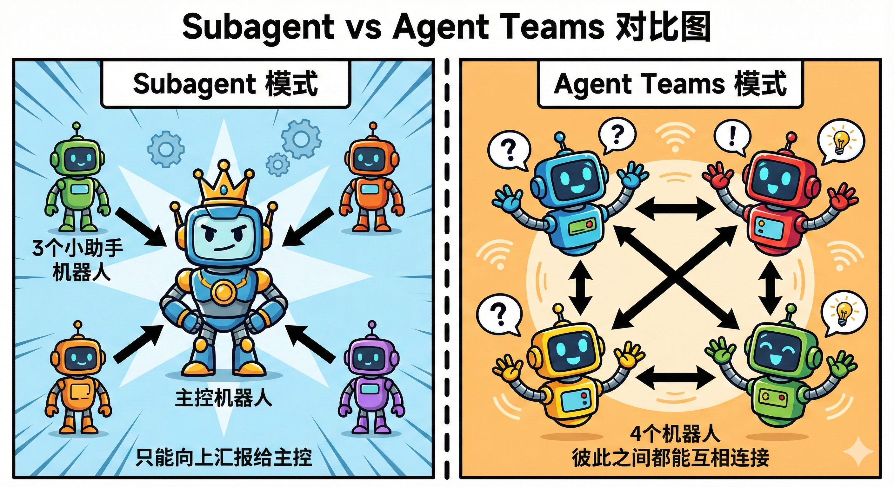
<!-- 漫画插图 Prompt:
{
  "name": "Subagent vs Agent Teams 对比图",
  "description": "两种协作模式的架构对比",
  "style": "现代极简漫画风格",
  "layout": {
    "type": "分屏对比",
    "sections": [
      {
        "position": "左侧",
        "name": "Subagent 模式",
        "elements": [
          {
            "name": "主控机器人",
            "shape": "星形布局的中心",
            "size": "大"
          },
          {
            "name": "3个小助手机器人",
            "size": "小",
            "position": "围绕主控"
          }
        ],
        "connection": {
          "type": "单向箭头",
          "direction": "只能向上汇报给主控"
        }
      },
      {
        "position": "右侧",
        "name": "Agent Teams 模式",
        "elements": [
          {
            "name": "4个机器人",
            "arrangement": "围成一圈",
            "state": "兴奋地交谈中"
          }
        ],
        "connection": {
          "type": "双向箭头",
          "direction": "彼此之间都能互相连接"
        }
      }
    ]
  },
  "visual": {
    "style": "卡通风格",
    "lines": "粗线条",
    "colors": "明亮的配色"
  }
}
-->

| | Subagent | Agent Teams |
|------|----------|-------------|
| **上下文** | 独立窗口，结果返回给调用者 | 独立窗口，完全自治 |
| **通信方式** | 只能向主 Agent 汇报 | 队员之间可以直接对话 |
| **协调方式** | 主 Agent 统一管理 | 共享任务列表，可自行协调 |
| **适合场景** | 聚焦型任务，只需要结果 | 需要讨论和协作的复杂任务 |
| **Token 成本** | 较低（结果摘要回传） | 较高（每个队员是独立实例） |

**一句话总结**：需要"跑腿"拿结果的用 subagent，需要"开会讨论"的用 Agent Teams。

### 什么时候该用（什么时候不该用）

✅ **适合的场景：**
- **研究和 Review**：多个队员同时调查问题的不同方面，然后互相交叉验证
- **新模块开发**：前端、后端、测试各自一个队员，互不踩脚
- **竞争假设调试**：让几个队员分别验证不同假说，互相尝试推翻对方
- **跨层级变更**：前端改组件、后端改接口、测试补用例

❌ **不适合的场景：**
- 串行依赖强的任务
- 需要反复修改同一个文件的工作
- 简单到一个 Agent 就能搞定的事情

---

## 上手教程：6 步创建你的第一个团队

### 前置条件

- 你已经安装了 Claude Code
- 你已经有 Claude 订阅【或者使用Claude Code Router接入了第三方API】

---

### 步骤 1：开启实验性功能

Agent Teams 目前还是实验性功能，默认关闭。需要手动开启：

**方式一：设置环境变量**

```bash
export CLAUDE_CODE_EXPERIMENTAL_AGENT_TEAMS=1
```

**方式二：在 settings.json 中配置**

```json
{
  "env": {
    "CLAUDE_CODE_EXPERIMENTAL_AGENT_TEAMS": "1"
  }
}
```
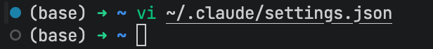
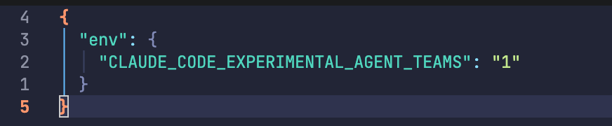
<!-- 截图描述：终端显示 `export CLAUDE_CODE_EXPERIMENTAL_AGENT_TEAMS=1`，然后运行 `claude` 命令 -->

---

### 步骤 2：创建你的第一个团队

开启后，用自然语言告诉 Claude 你想要什么样的团队就行了。

**示例 1：探索一个产品想法**

```
我在设计一个 CLI 工具来追踪代码库中的 TODO 注释。
创建一个 Agent Team 从不同角度来探索这个需求：
一个队员负责 UX 设计，一个负责技术架构，一个扮演 Devil's Advocate 提反对意见。
```

**示例 2：精确控制队员数量和模型**

```
创建一个 4 人团队来并行重构这些模块，每个队员使用 Sonnet。
```

Claude 收到指令后会：
1. 理解你的需求
2. 创建 Team Lead
3. Spawn 对应的 Teammates
4. 分配任务
5. 开始工作

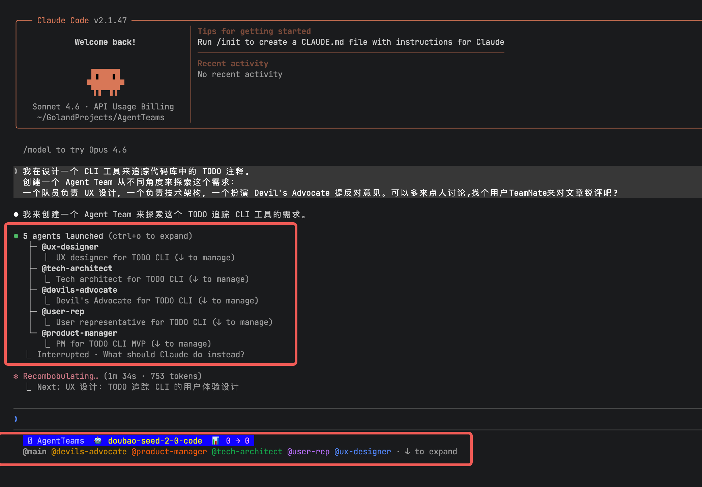
<!-- 截图描述：Claude 响应团队创建请求的界面，显示正在 spawn 多个队员 -->

---

### 步骤 3：选择显示模式

Agent Teams 支持两种显示模式：

#### In-process（进程内模式）

所有队员在你的主终端内运行：
- 用 `Shift+Up/Down` 切换选中不同的队员
- 选中后直接打字就能给它发消息
- 按 `Enter` 查看某个队员的完整 session
- 按 `Escape` 打断它当前的操作
- 按 `Ctrl+T` 切换任务列表的显示

**优点**：任何终端都支持，不需要额外安装东西

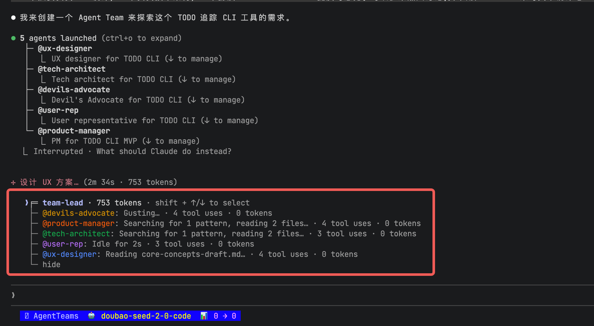
<!-- 截图描述：终端显示多个队员的输出，用 Shift+Up/Down 切换的提示 -->

#### Split panes（分屏模式）

每个队员占一个独立的终端面板：
- 你可以同时看到所有人的输出
- 点击某个面板就能直接和那个队员交互

**需要的工具**：
- **tmux**：用系统包管理器安装（macOS 上 `brew install tmux`）
- **iTerm2**：需要安装 [it2 CLI](https://github.com/mkusaka/it2)，然后在 iTerm2 的设置里启用 Python API

**默认行为**：`auto` 模式——如果你已经在 tmux session 里了，就自动用分屏；否则用进程内模式。

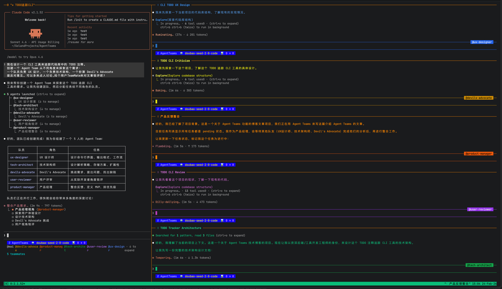
<!-- 截图描述：iTerm2 或 tmux 分屏，每个面板一个队员，同时显示输出 -->

---

### 步骤 4：与队员直接对话

你可以直接跟任何一个队员对话，不用通过 team lead 转达。每个 teammate 都是一个完整的、独立的 Claude Code session。

- **In-process 模式**：`Shift+Up/Down` 选队员，直接打字发消息
- **Split panes 模式**：点击对应的面板

这意味着你可以随时给某个队员补充指令、问后续问题、或者让它换个方向。

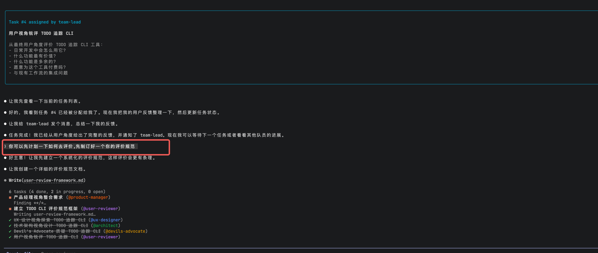
<!-- 截图描述：一个队员给另一个队员发消息的界面，显示 mailbox 通信 -->

---

### 步骤 5：任务分配和认领

共享任务列表是整个团队协作的核心。任务有三种状态：
- **pending（待处理）**
- **in progress（进行中）**
- **completed（已完成）**

任务之间还支持依赖关系——一个 pending 的任务如果有未完成的依赖项，就不能被认领，依赖项完成后会自动解锁。

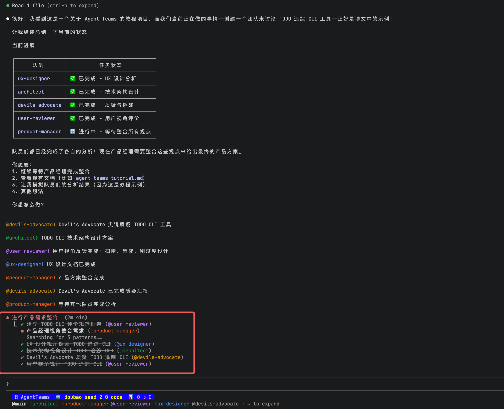
<!-- 截图描述：按 Ctrl+T 显示的任务列表，包含 pending/in progress/completed 三种状态 -->

**任务分配有两种方式：**
1. **Lead 指派**：你告诉 lead 把哪个任务分给哪个队员
2. **队员自行认领**：队员完成当前任务后，会自动去任务列表里找下一个未分配、未阻塞的任务来认领

---

### 步骤 6：清理团队

当工作完成后：

**1. 关闭队员**

```
让研究员队员关闭
```

Lead 会发一个 shutdown request，队员可以批准（优雅退出）或拒绝（继续工作并说明原因）。

**2. 清理团队资源**

```
清理团队
```

这会删除共享的团队和任务目录。

⚠️ **注意两个要点：**
- 必须通过 lead 来清理，队员不应该执行清理操作
- 清理前必须先关闭所有队员

---

## 三个实战案例

### 案例一：并行 Code Review

一个人 review 代码的时候，注意力往往集中在某一类问题上——你盯着安全漏洞看的时候，就容易忽略性能问题。

Agent Teams 可以把不同的关注维度分给不同的队员：

```
创建一个 Agent Team 来 review PR #142，生成三个 reviewer：
- 一个专注安全隐患
- 一个检查性能影响
- 一个验证测试覆盖率
让他们各自 review 后汇报发现。
```

每个 reviewer 从同一个 PR 出发，但戴着不同的"眼镜"看代码：

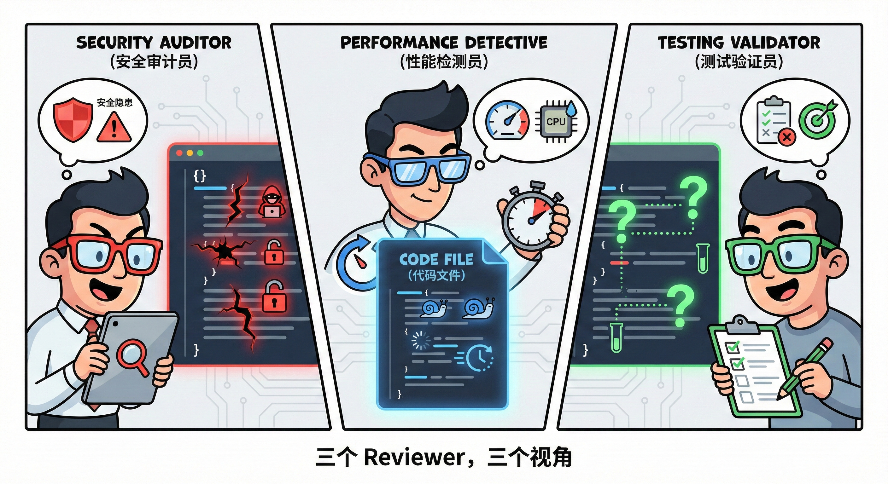
<!-- 漫画插图 Prompt:
{
  "name": "三个 Reviewer",
  "description": "三个视角审查同一份代码",
  "style": "现代极简漫画风格",
  "scene": {
    "center": {
      "name": "代码文件",
      "type": "共同审查对象"
    },
    "reviewers": [
      {
        "name": "安全审计员",
        "icon": "红色眼镜",
        "focus": "安全隐患",
        "visual_effect": "代码里的漏洞在发光"
      },
      {
        "name": "性能检测员",
        "icon": "蓝色眼镜",
        "focus": "性能问题",
        "visual_effect": "慢查询在闪烁"
      },
      {
        "name": "测试验证员",
        "icon": "绿色眼镜",
        "focus": "测试覆盖",
        "visual_effect": "缺少测试覆盖的地方显示问号"
      }
    ]
  },
  "visual": {
    "metaphor": "不同颜色的眼镜代表不同的审查维度",
    "style": "卡通风格，富有表现力"
  }
}
-->

Lead 最后把三份报告合并，安全、性能、测试三个维度都得到了充分关注。


---

### 案例二：竞争假设调试

这是我觉得最有意思的用法。当你遇到一个搞不清楚根因的 bug 时：

```
用户反馈 App 在发送一条消息后就断开连接了，没有保持长连接。
生成 5 个 Agent 队员调查不同的假说。
让他们互相对话，像科学辩论一样尝试推翻对方的理论。
把达成共识的结论写入分析文档。
```
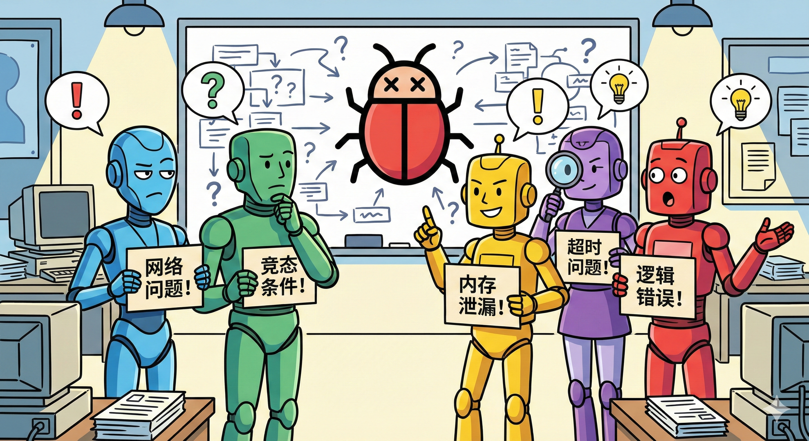
<!-- 漫画插图 Prompt:
{
  "name": "竞争假设调试",
  "description": "多个 Agent 对 Bug 进行科学辩论",
  "style": "现代极简漫画风格",
  "scene": {
    "type": "辩论场景",
    "atmosphere": "激烈但友好的讨论",
    "focus": {
      "name": "大 Bug",
      "position": "墙上",
      "role": "调查目标"
    },
    "participants": [
      {
        "name": "Agent 1",
        "hypothesis": "网络问题！",
        "expression": "质疑"
      },
      {
        "name": "Agent 2",
        "hypothesis": "竞态条件！",
        "expression": "沉思"
      },
      {
        "name": "Agent 3",
        "hypothesis": "内存泄漏！",
        "expression": "自信"
      },
      {
        "name": "Agent 4",
        "hypothesis": "超时问题！",
        "expression": "分析中"
      },
      {
        "name": "Agent 5",
        "hypothesis": "逻辑错误！",
        "expression": "争论中"
      }
    ],
    "props": [
      "每个机器人举着写有假设的牌子",
      "背景白板上画满了分析图"
    ]
  },
  "visual": {
    "vibe": "侦探/推理房间的氛围",
    "style": "卡通风格"
  }
}
-->

**为什么这个方法有效？**

单个 Agent 调查 bug 容易陷入**锚定效应**——找到一个说得通的解释就不再深入了。你有没有这种经历？看日志看到一个可疑的地方，就一头扎进去调了半天，最后发现根因完全在别处。

而多个 Agent 各自独立调查、互相质疑，辩论机制本身就在对抗锚定效应。最后存活下来的假说大概率更接近真相。

这其实和科学界的"强推理法"（strong inference）是一个道理——同时提出多个假说，设计实验来排除错误的那些，而不是只验证你最喜欢的那一个。

---

### 案例三：跨层级功能开发

如果你要开发一个涉及前端、后端和测试的完整功能：

```
创建一个团队来实现用户头像上传功能：
- 一个队员负责后端 API（文件上传、存储、压缩）
- 一个队员负责前端组件（上传界面、预览、裁剪）
- 一个队员负责写端到端测试
后端队员完成 API 后通知前端队员接口契约。
```

这三个队员可以同时开工：
- 后端和前端可以先约定好接口格式再各自实现
- 测试队员可以根据需求文档先搭好测试框架

当后端完成后，通过消息系统把实际的 API 契约发给前端，前端再对接。任务依赖系统会自动处理阻塞和解锁。

---

## 最佳实践与避坑指南

### ✅ 最佳实践

#### 1. 给队员足够的上下文

队员会自动加载项目的 `CLAUDE.md`、MCP servers 和 skills，但它们**不会继承 lead 的对话历史**。所以 spawn 的时候一定要在 prompt 里把任务相关的信息说清楚：

```
创建一个安全审计队员，prompt 是："审查 src/auth/ 目录下的认证模块，
重点关注 token 处理、session 管理和输入校验。
应用使用 JWT token 存储在 httpOnly cookie 中。
按严重程度对发现的问题分级。"
```

#### 2. 合理拆分任务粒度

- **太细**：协调开销超过收益
- **太粗**：队员长时间闷头干活没有 check-in，万一方向跑偏浪费大
- **刚好**：每个任务有明确的、自包含的交付物——一个函数、一个测试文件、一份 review 报告

💡 **建议**：每个队员分配 5-6 个任务比较合适。

#### 3. 新手建议先从研究类任务开始

如果你是第一次用 Agent Teams，建议从这些任务开始：
- Review 一个 PR
- 调研一个库
- 排查一个 bug

这些任务能让你感受到并行探索的价值，同时避开并行实现带来的协调难题。

#### 4. 盯着点，别放羊

虽然 Agent Teams 的目标是自主协作，但完全放手不管风险还是挺大的。定期检查队员的进展，发现方向不对的及时纠正，发现成果的及时汇总。

---

### ⚠️ 避坑指南

#### 坑 1：文件冲突

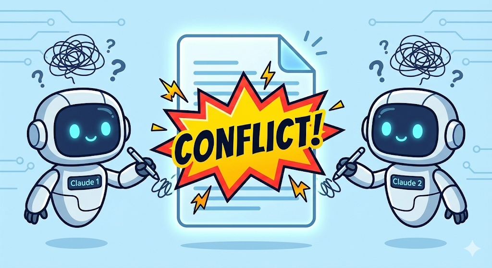
<!-- 漫画插图 Prompt:
{
  "name": "文件冲突警告",
  "description": "两个 Agent 同时编辑同一文件导致冲突",
  "style": "现代极简漫画风格",
  "scene": {
    "type": "警告场景",
    "atmosphere": "俏皮的警示氛围",
    "elements": [
      {
        "name": "Claude 机器人 1",
        "action": "正在编辑文件",
        "expression": "困惑"
      },
      {
        "name": "Claude 机器人 2",
        "action": "同时编辑同一个文件",
        "expression": "困惑"
      },
      {
        "name": "警告标志",
        "text": "冲突！",
        "position": "中央",
        "size": "大"
      }
    ]
  },
  "visual": {
    "mood": "警示但不沉重",
    "style": "卡通风格"
  }
}
-->

两个队员同时编辑同一个文件会导致互相覆盖。这可能是用 Agent Teams 最容易踩的坑。

**解决办法**：拆任务的时候一定要让每个队员负责不同的文件集合。

#### 坑 2：Lead 忍不住自己动手

有时候 lead 会等不及队员完成，自己开始干活。如果你发现了这个情况：

```
等你的队员完成任务后再继续
```

或者直接按 `Shift+Tab` 切换到 **Delegate 模式**——这个模式下 lead 的工具被限制为只有协调类的，它碰不到代码。

#### 坑 3：Token 消耗

必须坦诚说一下成本问题：Agent Teams 的 token 消耗是实打实地**线性增长**的。每个队员都是一个独立的 Claude 实例，都有自己的上下文窗口。3 个队员就是大约 3 倍的 token 用量。

对于研究、review、新功能开发这些场景，额外的 token 通常是值得的——并行探索带来的效率提升远超成本增加。但如果只是日常的小修小补，老老实实用单个 session 就好。

---

### 🔧 常见问题排查

#### 问题：队员创建了但看不到

- 在 in-process 模式下，按 `Shift+Down` 试试能不能切到它
- 检查一下你的任务描述是否够复杂——Claude 会根据任务复杂度判断要不要创建队员
- 如果用分屏模式，确认 tmux 已安装并且在 PATH 里：`which tmux`

#### 问题：权限确认弹窗太多

队员的权限请求会冒泡到 lead，频繁弹窗会很烦。在创建团队之前，先在权限设置里预批准一些常见操作。

#### 问题：队员遇到错误就停了

用 `Shift+Up/Down` 切到它，看看报了什么错，然后给它补充指令让它继续。或者直接 spawn 一个新队员接手它的工作。

#### 问题：Lead 提前收工了

直接告诉它继续。如果它总是这样，可以在一开始就说"等所有队员完成任务后再收尾"。

---

## 真实案例：16 个 Claude 写了一个 C 编译器

上面的案例都是设想的场景，那实际的大规模并行 Agent 协作效果怎么样？

2026 年 2 月 5 日，Anthropic 的安全研究员 Nicholas Carlini 发了一篇文章：[Building a C compiler with a team of parallel Claudes](https://www.anthropic.com/engineering/building-c-compiler)。他让 **16 个 Claude Opus 4.6 实例**同时工作在一个共享代码库上，从零开始写了一个 C 编译器。

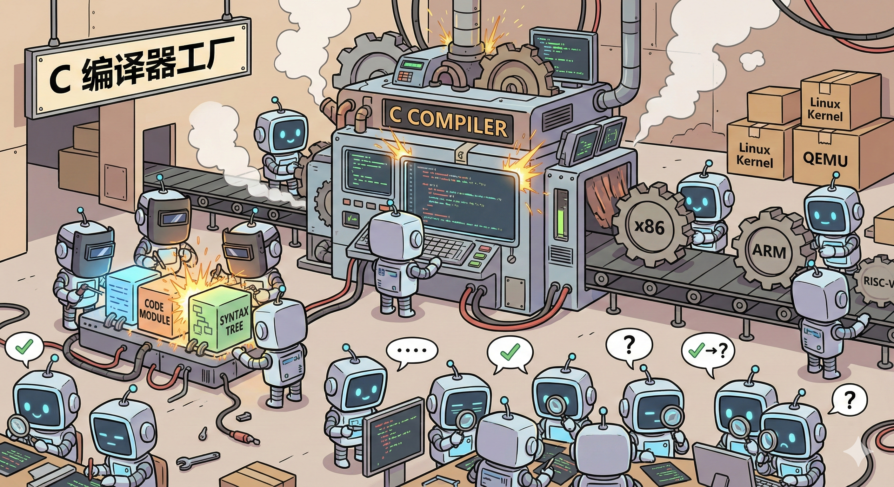
<!-- 漫画插图 Prompt:
{
  "name": "16个 Claude 写编译器",
  "description": "大规模并行 Agent 协作构建 C 编译器",
  "style": "现代极简漫画风格",
  "scene": {
    "type": "繁忙的工厂场景",
    "atmosphere": "忙碌但有序，充满活力",
    "main_structure": {
      "name": "巨型 C 编译器机器",
      "role": "核心构建目标"
    },
    "workers": {
      "count": 16,
      "type": "Claude 机器人",
      "activities": [
        {
          "group": "焊接组",
          "action": "焊接代码模块"
        },
        {
          "group": "搬运组",
          "action": "搬运标有架构名称的齿轮",
          "labels": ["x86", "ARM", "RISC-V"]
        },
        {
          "group": "质检组",
          "action": "用放大镜检查代码质量"
        }
      ]
    },
    "props": [
      {
        "name": "大标牌",
        "text": "C 编译器工厂"
      },
      {
        "name": "背景物件",
        "items": ["Linux 内核包装盒", "QEMU 包装盒"]
      }
    ]
  },
  "visual": {
    "mood": "混乱中带着秩序感",
    "style": "卡通风格"
  }
}
-->

### 结果

- 近 **2000 个 session**，花了大约 **$20,000**
- 产出 **10 万行 Rust 代码**
- 编译器能编译 **Linux 6.9 内核**，支持 x86、ARM、RISC-V 三种架构
- 能编译 QEMU、FFmpeg、SQLite、PostgreSQL、Redis
- 通过了 **99% 的 GCC torture tests**

### 几个关键教训

这个项目暴露出的问题对所有想用 Agent Teams 的人都有参考价值：

1. **测试质量决定一切**：如果测试用例本身不准确，Agent 就会"正确地"解决一个错误的问题
2. **要为 LLM 的局限性做设计**：Claude 没有时间概念，跑完整测试套件可能要几个小时，Agent 就傻等着
3. **单体任务是并行的天敌**：编译 Linux 内核是一个不可拆分的大任务，所有 Agent 遇到同样的编译错误都会卡住
4. **Agent 要有角色分工**：给不同的 Agent 分配不同的职责（优化、代码整洁、文档）比让所有人做一样的事情效率高得多

### 局限性也很明显

这个编译器还不是 GCC 的替代品：
- 不支持 16 位 x86 代码生成
- 没有集成的汇编器和链接器
- 生成代码的效率不如关闭优化的 GCC
- Rust 代码质量低于专家水平

Carlini 自己也说了一个很清醒的判断：没有人类验证的情况下，"测试通过"和"生产可用"之间的距离是危险的模糊。

---

## 总结：现在就开始试试吧！

### 我们讲了什么

1. **为什么需要 Agent Teams**：从单兵作战到团队协作的转变
2. **什么是 Agent Teams**：Team Lead、Teammates、Task List、Mailbox 四个核心概念
3. **6 步上手教程**：从开启功能到清理团队
4. **三个实战案例**：并行 Code Review、竞争假设调试、跨层级功能开发
5. **最佳实践与避坑指南**：怎么用好、怎么避坑
6. **真实案例**：16 个 Claude 写 C 编译器的经验教训

### 关键要点

- ✅ Agent Teams 的核心是**协作**，不只是并行
- ✅ 入门门槛很低——用自然语言描述你要什么团队就行
- ✅ 但要用好需要技巧——拆任务、给上下文、避免文件冲突
- ✅ Token 成本会线性增长，要权衡性价比

---

## 彩蛋：这篇文章就是用 Agent Teams 写的！

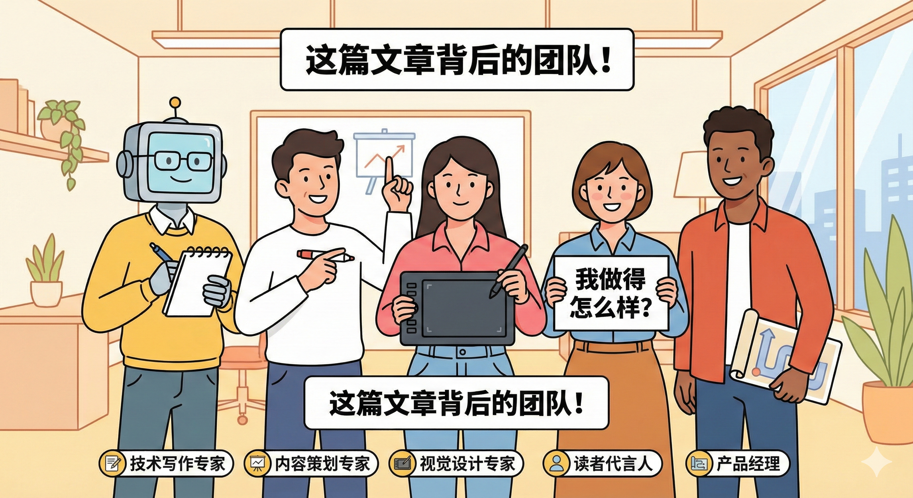
<!-- 漫画插图 Prompt:
{
  "name": "我们的团队",
  "description": "创作这篇文章的 Agent 团队合影",
  "style": "现代极简漫画风格",
  "scene": {
    "type": "团队合影",
    "atmosphere": "欢乐、专业",
    "members": [
      {
        "name": "技术写作专家",
        "icon": "钢笔和笔记本",
        "role": "负责技术准确性"
      },
      {
        "name": "内容策划专家",
        "icon": "白板马克笔",
        "role": "负责文章结构"
      },
      {
        "name": "视觉设计专家",
        "icon": "绘图板",
        "role": "负责插图设计"
      },
      {
        "name": "读者代言人",
        "icon": "写着「我做得怎么样？」的牌子",
        "role": "负责用户视角反馈"
      },
      {
        "name": "产品经理",
        "icon": "路线图",
        "role": "负责需求把控"
      }
    ],
    "props": [
      {
        "name": "团队标牌",
        "text": "这篇文章背后的团队！"
      }
    ],
    "pose": "站在一起，面带微笑"
  },
  "visual": {
    "style": "卡通风格",
    "mood": "温馨、专业"
  }
}
-->

没错！你刚才读的这篇教程，就是由 **5 个不同角色的 Agent** 协作完成的：

- **技术写作专家**：负责把技术概念讲清楚，确保准确性
- **内容策划专家**：负责故事线和文章结构
- **视觉设计专家**：负责截图规划和漫画插图的 Prompt
- **读者代言人**：从目标读者的角度提供反馈
- **产品经理**：确保符合用户需求

这既是最好的 demo，也是最有力的证明——Agent Teams 不是遥远的未来，而是你现在就可以用的工具。

---

## 参考资料

- [Claude Code Agent Teams 官方文档](https://code.claude.com/docs/en/agent-teams)
- [Building a C compiler with a team of parallel Claudes](https://www.anthropic.com/engineering/building-c-compiler)
- [Claude Code Sub-agents 文档](https://code.claude.com/docs/en/sub-agents)

---

**现在，去创建你的第一个 Agent Team 吧！** 🚀
