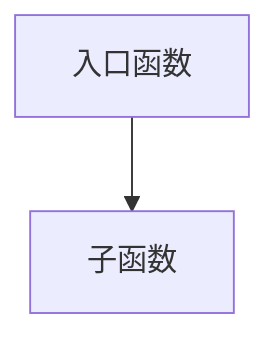

# 复杂链路下的后端场景AI Coding实践+思路

在日常后端开发中，我经常面对这样的场景：

- 要开发一个跨多个服务的新功能，需要了解上游的调用入口、下游的数据来源，以及中间各个环节的处理逻辑
- 线上出现问题需要排查，得从一个接口开始，逐级追踪到数据库操作，甚至第三方服务调用
- 接手一个陌生的模块，想快速理解其设计思路和实现细节

这些复杂链路的分析工作，传统方式下往往需要：
1. 手动搜索代码库，定位相关文件
2. 翻阅 PRD 和技术文档，理解业务逻辑
3. 梳理调用关系，画出链路图
4. 分析依赖关系，识别潜在风险

整个过程耗时耗力，而且很容易遗漏关键信息。当我尝试让 AI 帮忙时，又遇到了新问题：
- 读了 50 个文件后，上下文直接爆了，后面的对话全乱套
- 每次分析模块都要复制粘贴同一段 Prompt，改个模块名再发一遍，重复劳动让人崩溃
- 复杂链路涉及多个服务，AI 无法快速获取跨服务的接口信息

这些问题的本质是**没有选对工具**，也没有建立一套有效的工作流程。

> 本文会先介绍 Slash Command、SubAgent、Skill 三种工具的选择思路和实践方法，然后在最后给出针对复杂链路的具体实践经验和核心工具，帮助你更高效地应对后端开发中的复杂场景。

> 之前做过一期分享，介绍了 Skills 和 SubAgents 的概念、区别与应用场景。（参考：[Claude Code 插件实践：基于 Skills 与 SubAgents 的双层架构设计](https://bytetech.info/articles/7597275570697486374#Q33FdNfo2oc1TaxwAuxcPyZ1njg)）
>
> 但随着 AI 工具的快速迭代，很多概念的边界变得越来越模糊。比如 Skills 现在支持手动调用（和 Slash Command 很像），也支持 `context:fork`（几乎可以当 SubAgent 用了）。
>
> 在这种情况下，与其纠结定义，不如从**场景**出发——搞清楚"什么场景用什么工具"，比背概念有用得多。
>
> 这篇文章会通过三个真实场景，介绍 Slash Command、SubAgent、Skill 的选择思路和实践方法。文中以 Trae 为例进行演示（部分功能在灰度中），但思路适用于所有类似的 AI Coding 工具。

---

## 一、三种工具速览

在开始之前，先快速过一下这三个概念：

| 工具 | 一句话解释 | 核心价值 |
|------|-----------|---------|
| **Slash Command** | 把常用 Prompt 做成命令，用 `/命令名` 快速调用 | 省时间、保证一致性 |
| **SubAgent** | 独立上下文的"专家"，处理完任务只返回结果 | 上下文隔离、结果提炼 |
| **Skill** | 知识包 + 工作流定义，自动注入文档和流程 | 流程标准化、知识自动加载 |

接下来，我会通过三个场景来说明什么时候该用哪个。

---

## 二、场景 1：高频重复的 Prompt → 用 Slash Command

### 痛点

日常开发中，我经常需要让 AI 帮我分析某个模块的实现。每次都要发这样一段 Prompt：

```text
请帮我分析 定时器 模块的实现：

1. 先读取该模块的主要文件
2. 梳理出核心的函数和类
3. 画出调用链路图（用 mermaid 格式）
4. 列出该模块依赖的其他模块
5. 用表格总结关键函数的作用

注意：只使用读取文件的能力，不要修改任何代码。
```

下次想分析「任务」模块？再复制一遍，把「定时器」改成「任务」……

这种重复劳动太低效了。

### 解决方案：Slash Command

把这段 Prompt 做成一个模板，用 `$1` 作为占位符，然后通过 `/命令名 参数` 的方式快速调用。

在 `.trae/commands/explain.md` 中写入：

```markdown
---
description: 解释某个功能模块的调用链路
---

## 模块分析任务

请帮我分析 **$1** 模块的实现：

### 输出要求

1. 先读取该模块的主要文件
2. 梳理出核心的函数和类

### 调用链路图

用 mermaid 格式画出调用关系,存放到 **$1.md** 中：



### 依赖分析

列出该模块依赖的其他模块

### 函数总结

| 函数名 | 作用 | 参数 | 返回值 |
|--------|------|------|--------|
| ... | ... | ... | ... |

注意：只读取文件，不要修改任何代码。
```

### 使用效果

在 Trae 中输入 `/` 就能看到这个命令：


然后只需要输入 `/explain 模块名` 就能快速触发：


模板中的 `$1` 会被替换为你输入的模块名，AI 最终收到的 Prompt 就是完整的分析指令。

### 小结

**适用场景**：输入格式固定、输出格式固定、高频使用的 Prompt。

**核心价值**：省去复制粘贴的时间，保证每次输出的一致性。

---

## 三、场景 2：耦合度低的复杂任务 → 外包给 SubAgent

### 痛点

假设我要给项目添加一个「用户积分系统」的功能。在动手写代码之前，我需要先搞清楚现有的用户模块是怎么实现的——入口在哪、调用了哪些函数、依赖了哪些模块。

这个「调研」过程会产生大量中间信息：读了哪些文件、搜了哪些代码、分析了哪些函数……但最终我只需要一份总结报告。

如果让主 Agent 来做这件事，这些中间信息会把上下文搞得很乱，影响后续的开发任务。

### 核心概念：上下文隔离

SubAgent 可以理解为一个函数：
- **输入**：一段任务描述（比如「分析用户模块的调用链路」）
- **处理**：在独立的上下文里读文件、搜代码、分析逻辑
- **输出**：一份精炼的结果（比如调用链路图 + 关键函数说明）

为什么要这样设计？因为 AI 的上下文窗口是有限的（比如 200k tokens）。如果把调研过程中读取的所有文件内容都塞进主上下文，会挤掉真正重要的信息——比如用户的需求描述、已经确认的技术方案。结果就是 AI 越聊越"健忘"，甚至开始胡说八道。

SubAgent 的价值就在于：中间过程产生的大量信息都留在它内部，不会「污染」主 Agent 的上下文。主 Agent 只拿到最终的精炼结果，上下文保持干净。

### 如何创建 SubAgent（以 Trae 为例）

打开 Trae 的设置，找到「智能体」，点击「创建智能体」：


进入创建页面后，需要填写以下配置：


**1. 名称**

给 SubAgent 起个名字，比如「链路分析器」。

**2. 提示词**

告诉 SubAgent 它要做什么：

```text
你是一个代码链路分析专家。当用户给你一个模块名时，你需要：
1. 找到该模块的入口文件
2. 分析所有的函数调用关系
3. 输出一份结构化的链路报告，包含调用图和关键函数说明
```

**3. 可被其他智能体调用**

这个开关要打开，这样主 Agent 才能调用这个 SubAgent。

**4. 英文标识名**

填一个唯一的英文名，比如 `trace-analyzer`，主 Agent 会通过这个名字来调用它。

**5. 何时调用**

描述什么场景下应该调用这个 SubAgent：

```text
当用户需要分析某个模块的调用链路、依赖关系，或者需要在开发前先了解现有代码结构时，调用此智能体
```

**6. 工具**

勾选这个 SubAgent 可以使用的工具。链路分析只需要读代码，所以只勾选：
- ✅ Read
- ✅ Context4Code（如果需要跨仓库搜索）

不需要的工具就不要勾选，避免 SubAgent 做出超出预期的操作。

### 使用效果

配置完成后，当你在对话中说「帮我分析一下定时器的调用链路，然后基于这个链路实现延时功能」时：

1. 主 Agent 识别到需要先分析链路
2. 自动调用 `trace-analyzer` 这个 SubAgent
3. SubAgent 独立完成链路分析，返回结果
4. 主 Agent 拿到链路信息后，继续完成后续的开发任务

整个过程中，链路分析的细节都在 SubAgent 的独立上下文里完成，主 Agent 只拿到最终的分析结果。


### 小结

**适用场景**：任务独立、数据密集、结果可提炼的「前置工作」。

**核心价值**：保持主上下文干净，让 AI 专注于核心任务。

---

## 四、场景 3：需要遵循工作流 + 引入文档 → 用 Skill

### 痛点

团队往往有固定的开发流程。比如「新功能开发」要先做需求分析、再调研现有代码、再写技术方案、最后才写代码。

同时，开发过程中还需要参考各种规范文档：代码规范、API 设计规范、系统架构说明……

每次都靠口头描述给 AI，既麻烦又容易漏步骤、漏文档。

### 核心概念：渐进式披露 + 工作流编排

Skill 本质上是一个「知识包 + 工具包」的组合，它可以：
1. **定义工作流**：告诉 AI 应该按什么步骤做事
2. **自动引入文档**：触发技能时自动把相关文档带进上下文
3. **包含可执行脚本**：在 Skill 目录下放脚本文件，AI 可以按需执行（如初始化项目、生成模板）

Skill 采用「渐进式披露」的设计——只在需要时才加载相关知识和调用相关脚本，不会一开始就把所有内容都塞进上下文。

简单说，Skill 是**按需加载的 Prompt + 按需调用的工具**的集合。

### 实际例子：新功能开发工作流

假设我们团队的新功能开发流程是这样的：

1. **需求分析**：先理解需求，分析影响范围
2. **链路调研**：搜索现有代码，了解相关模块的实现
3. **方案设计**：输出技术方案文档
4. **代码实现**：按方案写代码

同时，开发过程中需要参考这些文档：
- `docs/code-style.md`：代码规范
- `docs/api-design.md`：API 设计规范
- `docs/architecture.md`：系统架构说明

### 第一步：创建链路调研的 SubAgent

先按场景 2 的方法创建一个 SubAgent，关键配置：

- **名称**：链路调研助手
- **英文标识名**：`trace-analyzer`
- **何时调用**：当需要分析某个功能模块的调用链路、依赖关系，或者需要在开发前先了解现有代码结构时
- **工具**：只勾选 Read、Context4Code

### 第二步：创建工作流 Skill（包含参考文档）

Skill 可以打包成一个目录，把相关的参考文档都放进去。目录结构如下：

```text
feature-dev/
├── SKILL.md           # 技能定义文件
├── code-style.md      # 代码规范文档
├── api-design.md      # API 设计规范
├── architecture.md    # 系统架构说明
└── scripts/
    └── init-project.sh  # 可执行脚本（可选）
```

`SKILL.md` 内容：

```markdown
---
name: feature-dev
description: 当用户需要开发新功能、实现新需求时触发
---

# 新功能开发工作流

## 参考文档
在开发过程中，请参考本目录下的文档：
- code-style.md - 代码规范
- api-design.md - API 设计规范  
- architecture.md - 系统架构说明

## 流程步骤

### 1. 需求分析
- 确认功能的输入输出
- 明确边界条件和异常情况
- 列出需要修改的模块

### 2. 链路调研
- 调用 trace-analyzer SubAgent 分析相关模块的现有实现
- 获取调用链路图和关键函数说明
- 注意：这一步交给 SubAgent 完成，不要自己去大量搜索代码

### 3. 方案设计
基于调研结果和架构文档，输出技术方案：
- 整体架构图
- 需要新增/修改的文件列表
- 关键实现思路

### 4. 代码实现
- 按方案逐步实现
- 遵循 code-style.md 中的代码规范
- 新增 API 需要符合 api-design.md 的设计规范
```

然后在 Trae 设置的「规则和技能」中，通过「上传进行智能解析」把这个目录打包上传：


（如果不涉及参考文档，也可以直接使用 Trae 中的图形化界面创建技能）

### 第三步：使用效果

当你说「帮我实现一个延时功能」时：


主 Agent 会：

1. 识别到这是新功能开发 → 自动触发 `feature-dev` 技能
2. 自动加载 Skill 目录下的参考文档 → `code-style.md`、`api-design.md`、`architecture.md` 被引入上下文
3. 按工作流执行需求分析 → 和你确认功能细节
4. 调用 `trace-analyzer` SubAgent → SubAgent 独立完成链路调研，返回分析报告
5. 基于报告和架构文档设计方案 → 输出技术方案让你确认
6. 实现代码 → 按规范逐步完成开发

### 小结

**适用场景**：需要遵循 SOP、需要引入领域知识/规范文档的复杂任务。

**核心价值**：流程标准化、知识自动注入、避免遗漏步骤。

---

## 五、补充：关于 Skills 的未来

目前 AI Coding 领域正在做 Skills 的大一统，SubAgent 和 Slash Command 的能力都在慢慢并入 Skills 体系。

也就是说，未来你可能只需要通过 Skills 这一个入口，就能同时实现：
- **Slash Command 的能力**：快速触发预设 Prompt
- **SubAgent 的能力**：独立上下文执行复杂任务
- **工作流编排的能力**：定义多步骤流程

所以现在学会用 Skills，以后这些能力都能无缝衔接。

具体可以参考：[Claude Code Skills 文档](https://code.claude.com/docs/zh-CN/skills)

---

## 六、复杂链路的实战解决方案

### 6.1 复杂链路的挑战

在后端开发中，复杂链路通常具有以下特点：

- **跨服务调用**：一个功能可能涉及多个微服务，需要了解各个服务之间的接口和数据传递
- **多层级依赖**：从API入口到数据持久化，可能经过多层处理逻辑
- **信息分散**：相关文档、代码、接口定义分布在不同平台
- **上下文复杂**：需要同时考虑业务逻辑、技术实现、性能优化等多个维度

这些特点使得传统的分析方法效率低下，而AI工具在处理这类问题时，又面临信息获取的瓶颈。

### 6.2 三大核心工具介绍

要解决复杂链路中的信息获取问题，我推荐使用以下三个核心工具：

#### 1. 飞书/Lark OpenAPI

**用途**：用来读PRD、技术方案等文档

**链接**：[飞书开放平台](https://cloud.bytedance.net/mcp/6800d5246ecc78283b3e98af?x-resource-account=public&x-bc-region-id=bytedance)

**使用方法**：通过API接口获取飞书中的文档内容，让AI能够直接读取PRD、技术方案等文档，了解业务背景和需求细节。

#### 2. Context4Code

**用途**：在提供仓库的链接后（不支持PSM）可以直接访问仓库内的代码

**链接**：[Context4Code](https://cloud.bytedance.net/mcp/68f07098153269f45e098f6f?x-resource-account=public&x-bc-region-id=bytedance)

**使用方法**：提供代码仓库链接后，AI可以直接查看仓库中的代码文件，了解具体实现逻辑，特别是上下游中一些函数的具体实现。

#### 3. BAM API DOC

**用途**：可以在提供PSM后快速了解某个服务对外提供的函数以及使用方法

**链接**：[BAM API DOC](https://cloud.bytedance.net/mcp/689051d6fd439beb70320d85?x-resource-account=public&x-bc-region-id=bytedance)

**使用方法**：提供服务的PSM后，AI可以快速获取该服务对外暴露的接口信息，了解数据如何从下游捞出，以及如何调用这些接口。

### 6.3 基于Skills的SOP文档设计

要充分发挥这些工具的作用，我们需要在Skills中提供一些SOP文档，来大致描述关键链路，提供关键链路上的PSM和仓库地址。

#### 目录结构示例

```text
complex-link-analysis/
├── SKILL.md           # 技能定义文件
├── sop/               # SOP文档目录
│   ├── user-flow.md   # 用户流程链路SOP
│   ├── order-flow.md  # 订单流程链路SOP
│   └── payment-flow.md # 支付流程链路SOP
├── docs/              # 参考文档目录
│   ├── code-style.md  # 代码规范
│   └── api-design.md  # API设计规范
└── scripts/           # 脚本目录
    └── fetch-docs.sh  # 自动获取文档的脚本
```

#### SOP文档模板

以`user-flow.md`为例：

```markdown
# 用户流程链路SOP

## 链路概述
- **功能说明**：用户注册、登录、信息更新的完整流程
- **涉及服务**：用户服务、认证服务、通知服务

## 关键节点

### 1. 用户注册
- **入口**：`/api/user/register`
- **处理服务**：用户服务 (PSM: user.service)
- **代码仓库**：https://code.byted.org/user/service
- **核心函数**：
  - `UserService.Register()`: 处理注册逻辑
  - `AuthService.GenerateToken()`: 生成认证令牌

### 2. 用户登录
- **入口**：`/api/user/login`
- **处理服务**：认证服务 (PSM: auth.service)
- **代码仓库**：https://code.byted.org/auth/service
- **核心函数**：
  - `AuthService.Login()`: 处理登录逻辑
  - `AuthService.ValidateCredentials()`: 验证凭证

### 3. 信息更新
- **入口**：`/api/user/profile/update`
- **处理服务**：用户服务 (PSM: user.service)
- **代码仓库**：https://code.byted.org/user/service
- **核心函数**：
  - `UserService.UpdateProfile()`: 更新用户信息
  - `NotificationService.SendUpdateNotification()`: 发送更新通知

## 数据流向
1. 客户端 → 用户服务 → 认证服务 → 数据库
2. 客户端 → 认证服务 → 用户服务 → 数据库
3. 客户端 → 用户服务 → 数据库 → 通知服务

## 依赖关系
- 用户服务依赖认证服务进行身份验证
- 认证服务依赖用户服务获取用户信息
- 用户服务依赖通知服务发送消息
```

### 6.4 实战效果

通过以上工具和方法，我们可以：

1. **快速获取信息**：AI可以通过飞书OpenAPI读取PRD和技术方案，通过Context4Code查看代码实现，通过BAM API DOC了解服务接口，无需手动搜索和整理

2. **全面理解链路**：基于Skills中的SOP文档，AI可以快速了解整个链路的结构和关键节点，包括涉及的服务、核心函数、数据流向等

3. **精准定位问题**：当线上出现问题时，AI可以根据链路信息快速定位问题所在的服务和函数，提高排查效率

4. **高效方案设计**：在开发新功能时，AI可以基于现有链路信息，设计出更合理的实现方案，避免重复造轮子

5. **保持上下文清晰**：通过SubAgent的独立上下文能力，AI可以在独立的环境中处理大量的代码和文档信息，只返回精炼的结果，保持主上下文的干净

---

## 七、总结

### 如何选择工具？

| 任务特征 | 推荐工具 |
|---------|--------|
| Prompt 固定、只换参数 | Slash Command |
| 会产生大量中间信息、只需要最终结果 | SubAgent |
| 需要按固定流程执行 | Skill |
| 需要自动引入参考文档 | Skill |
| 需要执行自动化脚本 | Skill |
| 以上特征组合出现 | Skill + SubAgent 组合 |

### 建议的学习路径

1. 先从 Slash Command 开始，把日常高频的 Prompt 都模板化
2. 等熟悉了再尝试 SubAgent，把"前置调研"类任务外包出去
3. 最后用 Skill 把团队的开发流程固化下来，配合脚本实现更多自动化
4. 对于复杂链路场景，结合飞书/Lark OpenAPI、Context4Code、BAM API DOC 三大工具，建立标准化的SOP文档

### 复杂链路解决方案总结

在处理后端复杂链路时，我们需要：

1. **工具组合使用**：利用飞书/Lark OpenAPI获取业务文档，Context4Code查看代码实现，BAM API DOC了解服务接口，形成完整的信息获取闭环

2. **流程标准化**：通过Skills创建SOP文档，描述关键链路的结构、涉及的服务、核心函数和数据流向，为AI提供清晰的分析框架

3. **上下文管理**：使用SubAgent的独立上下文能力，处理复杂链路分析中的大量中间信息，只向主Agent返回精炼的结果

4. **知识沉淀**：将链路分析的经验和结果沉淀到Skills中，形成团队共享的知识库，提高后续开发的效率

技术会变，概念会迭代，但「根据场景选工具」的思路不会变。

与其纠结定义，不如问自己：我现在要解决的是什么问题？然后选择最合适的工具。

对于复杂链路的开发和排查，通过本文介绍的工具和方法，你可以让AI成为你的得力助手，大幅提高工作效率，减少错误率。

---

> 文中 Trae 的版本为 Beta 版，部分功能正在逐步上线中。本文的目的是通过 Trae 来介绍清楚各种概念的关系以及设计思路，思路本身适用于所有类似的 AI Coding 工具。
