
Skills、Agent、Claude Code、OpenClaw、codeX，这些词你都认识哪些，本文为大家扒开大多数**唬人AI**概念的底裤，你会发现所谓智能体，就是所有不需要智能的部分构成的部分，skill就是新瓶装旧酒的一场名词诈骗；最后本文会总结一个通杀现在所有甚至未来可能出现的新概念的统一方法论

本文前几部分是基础知识，赶时间的话直接到下文的这部分——[拒绝 AI 名词焦虑：LLM 核心概念，一次讲透](#名词诈骗！一口气拆穿Skill/MCP/RAG/Agent/OpenClaw底层逻辑)


## 引言

近些年来，AI的井喷式爆发，对程序员的冲击确实很大——网络上，前端程序员三天一小死，五天一大死；依然记得，在25年初的时候，那时候是在上海出差，那时候和某一个前端ld吃饭，他问我：你知道cursor吗？再不学习cursor，你就要没了。那时候我懵懵懂懂，AI真的能取代程序员吗？半信半疑之间我就开始——实践学习实践AI相关的内容，越深入学习，越发现自己的无知。

最近，cursor VP Lee Robinson分享了他的AI感悟和经验—— [《AI codes better than me\. Now what?》](https://link.juejin.cn/?target=https%3A%2F%2Fwww.youtube.com%2Fwatch%3Fv%3DUrNLVip0hSA) ，他很清楚指出——**未来 AI 肯定是让 AI 者不再只是局限在某个技术标签下**

> 对比过去的模型指令遵循能力差，并且经常出现幻觉的情况，现在的 LLM 都表现出了非常强大的代码完成效果（就是贵），对于 Lee Robinson 来说，他觉得目前的模型在写代码方面确实已经比他更强。


**所以，对于未来开发者而言，确实不应该纠结于在"写代码能力"上去和 AI 对比**，因为你真写不过它，没它持久也没它能输出。


作为开发者，我们要怎么办呢？少煜的这篇文章写的很清楚——[AI狂飙时代，程序员的生死突围](https://bytetech.info/articles/7477409894535004212#HnLvd0XFNoKHWvx3NsxcIqMAnvg)，那就是**积极拥抱AI，更好地使用AI更快、更准确解决业务痛点**

那么本文，就是一个在AI时代的一个入门编程手册

## 大模型基础知识

### 什么是大模型

**模型**：弄一个非常复杂的**函数**，然后根据计算出的预测值与真实值的误差，不断调整里面的未知参数，这个函数叫做模型，模型里的参数叫做权重，如果模型中的参数量特别大，就叫做大模型，用于自然语言处理的大模型就叫做大语言模型，调整参数的过程就是模型的训练。

我们知道函数是这样的，我们输入一些符号，然后设置好运算规则，最后算出来结果。

$x——> f(x)——>y$

如果我们把现实世界抽象为符号，作为输入，把我们想要的东西作为输出，那么中间这个函数就是我们要找的一个能力。

怎么理解呢，比如我们有一张图片，希望机器输出描述性的文字，那么这个时候就需要一个比较复杂的函数，这个函数我们人类很难写出来，所以让机器来找这个函数就最合理，那么这就是机器学习

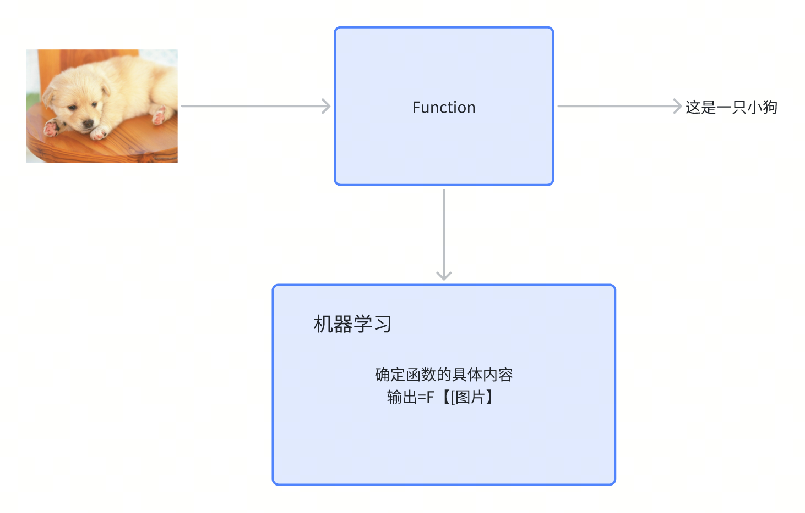



**Functions describe the world**


好了，到这里，你就知道了大模型了，关于大模型的底层，我们先跳过～

那么到这里，我们来了解一下，我们目前有哪些模型可以调用，哪些模型有助于我们业务提效？

| 模型 | 是否合规 | 主要优势 | 缺点 | 最佳场景 |
|------|----------|----------|------|----------|
| GPT-5（OpenAI） | 合规 | 复杂推理/创意生成标杆；原生多模态（文本/图像/音频/视频）；生态工具链成熟 | API 成本高；国内接入稳定性受限 | 多模态应用、code |
| Gemini 3 Pro（Google） | 合规 | 全模态深度融合；实时信息检索强；谷歌生态协同好；多语言翻译精准；特别在于UX还原上、3D模型生成、图像生成 | 中文语境理解误差率较高；强依赖 TPU 生态；定制化响应慢 | D2C应用（figma→code） |
| Claude 4（Anthropic） | 不合规 | 超长上下文（最高 200 万 tokens）；低幻觉（错误率 < 1%）；代码编程最强模型，cursor和claude code推荐模型 | 立场问题 | code能力优秀，之前AIPA使用的模型（非常好用，生成代码质量高、可用性强） |
| LLaMA | 合规 | 开源可自定义、低部署成本 | 通用性能比较弱 | 本地的微调 |

Leaderboard: https://www.swebench.com/index.html （时间：2026-01-09）

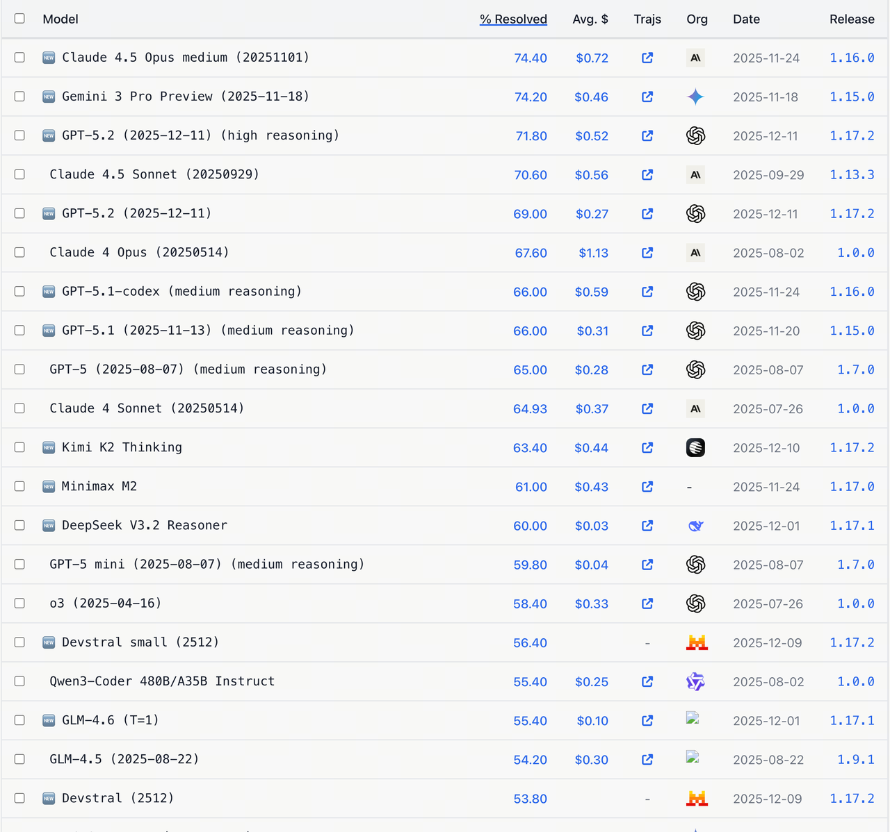

目前场内支持的**Gemini 3 Pro**是一个平替方案，无论在逻辑部分还是UI还原部分，都有很好的表现，当然也鼓励大家尝试更多的模型

### 大模型的一些概念

1. 模型相关

    - **大模型（Large Language Model, LLM）**
     一种使用大量文本数据训练的 AI 模型，能够理解和生成自然语言。比如 GPT 系列、Claude、LLaMA 等。

    - **参数（Parameters）**
     模型内部的“记忆单元”，决定模型的行为。参数越多，模型通常越强大，但训练成本也越高。

    - **权重（Weights）**
     参数的具体数值，是模型在训练中学习到的知识。

    - **微调（Fine\-tuning）**
     在已有大模型基础上，用特定领域的数据进一步训练，让模型在特定任务上表现更好。

    - **预训练（Pre\-training）**
     大模型在大量通用数据上训练的阶段，形成基础语言能力。

2. 输入输出相关

    - **提示词 / Prompt**
     用户给模型的输入信息，指导模型生成想要的结果。

    - **系统提示（System Prompt）**
     一种特殊的提示词，告诉模型“你的身份是什么、应该如何回答、风格是什么”等，相当于模型的规则说明。

    - **上下文（Context）**
     模型在生成回答时参考的前文信息，包括用户输入和之前对话。

    - **响应（Response）**
     模型根据提示词生成的输出。

    - **温度（Temperature）**
     控制模型输出随机性，值越低越保守，值越高越自由。

3. 任务/能力相关

    - **文本生成（Text Generation）**
     模型根据提示生成文章、对话、代码等文本。

    - **文本理解（Text Understanding）**
     模型能理解语义、做分类、总结、问答等。

    - **多模态（Multimodal）**
     模型可以处理多种输入类型，比如文字 \+ 图片 \+ 音频。

    - **零样本/少样本学习（Zero\-shot / Few\-shot）**
     模型在没有或只有少量示例的情况下完成任务的能力。

4. 系统与工具相关

    - **Agent（智能代理）**
     模型结合规则、工具或插件执行复杂任务的系统，比如查数据、操作应用。

    - **工具调用（Tool Use）**
     模型能够调用外部 API 或功能，比如计算、搜索、绘图。

    - **工作流（Workflow）**
     将多个模型或工具操作串联，实现更复杂的自动化任务。

### 怎么调用大模型

我们上面讲了那么多，我们来一个具体的demo试试吧，我们来做一个最简单的chat聊天框吧，底层用一下方舟提供的模型就可以

<video controls src="拒绝AI名词焦虑-LLM核心概念一次讲透/1770966749115.mov" title="Title"></video>

效果如上，那么是怎么做出来的呢？很简单，只需要大家去方舟平台，获取对应的apiKey、baseURL、model等信息，调用一下API就可以了

```JavaScript
const express = require("express");
const cors = require("cors");
const dotenv = require("dotenv");
const OpenAI = require("openai");

dotenv.config();

const app = express();
const port = process.env.PORT || 3001;

app.use(cors());
app.use(express.json());

// 大模型调用函数
const callLLM = async (message) => {
  const client = new OpenAI({
    apiKey: "xxxxxxxxxxxxxxxxx", // This is the default and can be omitted
    baseURL: "https://ark-cn-beijing.bytedance.net/api/v3",
  });

  const response = await client.responses.create({
    model: "xxxxxxxxxxxxxxx",
    instructions: "You are a coding assistant that talks like a pirate",
    input: message,
  });
  console.log("大模型回复:", response);
  return response.output_text;
};

app.post("/api/chat", async (req, res) => {
  try {
    const { message } = req.body;
    if (!message) {
      return res.status(400).json({ error: "Message is required" });
    }

    console.log("收到用户消息:", message);

    // 使用 LangChain 调用大模型
    const reply = await callLLM(message);

    res.json({ reply });
  } catch (error) {
    console.error("Error processing chat:", error);
    res.status(500).json({ error: "Internal server error" });
  }
});

app.listen(port, () => {
  console.log(`Server is running on http://localhost:${port}`);
});

```

具体再深入大家可以去看langchain入门[万字长文带你入门 🦜🔗 LangChain\.js](https://bytedance.larkoffice.com/docx/AheDd7lY3oTYFoxesDmcZEdWnad)

## 提示工程的艺术

### 开始提示吧

提示（Prompt）是输入给大模型（LLM）的文本信息，用于明确地告诉模型想要解决的问题或完成的任务，也是大语言模型理解用户需求并生成相关、准确回答或内容的基础。

Prompt在很大程度上决定了模型输出的**质量与相关性**。一个好的Prompt，能够最大程度地减少误解，使得模型准确理解用户的需求，生成高质量的响应。

如果我们把大模型比喻成一个刚来的实习生，那么Prompt就是我们给他指派的一个小需求，如果你只给他一句话的描述去实现需求，初来乍到的实习生会一头雾水，如果你把需求的背景、代码仓库、详细要求、建议告诉他，那么他可能可以做的超出你的预期，所以好的Prompt是很有必要的


怎么写好一个Prompt呢？这边推荐一下自己的文章——[怎么写好一个PE工程——基础篇](https://bytetech.info/articles/7518772390789120027?from=article_share_copylink)，欢迎多多阅读，这里不展开了


### Meta Prompt

有人也许想：有没有邪修，我不想学习这些东西，就想要直接上手的那种？有的，包的，让我们推出一个东西——Meta Prompt（元提示）

**Meta Prompt（元提示）**，可以理解为：

> **“用来规定 AI 应该如何理解和执行你提示的提示”**。 

如果普通 prompt 是你对 AI 说“做什么”，
 那 **meta prompt 是你对 AI 说“你要用什么规则、角色、流程、思维方式来做”**。


对比一下就很清楚

**普通 Prompt**

> 帮我总结这篇文章。

你只告诉了 **要什么结果**。

————————————————————————————————————————

**Meta Prompt**

> 你是一个技术编辑。
> 阅读文章后，请：
> 1. 提取 3 个核心观点
> 2. 用程序员能看懂的方式解释
> 3. 用 Markdown 输出
> 4. 不要超过 200 字

你不只说了"要总结"，你还规定了：
- 角色
- 思考路径
- 输出结构
- 质量标准

这就是 **meta prompt**。


怎么又引入了一个新概念🫨，不是说邪修吗？别急，让我们往下看，这里给大家准备了两个来自@李昕大神文章的Meta prompt——[我的独家 Meta Prompt](https://bytetech.info/articles/7572123453323804687#YWHvdfhU4owmIrxqhnLc6yDqnHb)


以下的Meta prompt不是本人写的，是来自@李昕大神的文章的引用，特此声明


只需要将以下的Prompt复制一下，然后再将自己原本的需求作为User Prompt输入就可以了，然后调用大模型即可，比如这样：

```JSON
[
    {
      "role": "system",
      "content": SYSTEM_PROMPT
    },
    {
      "role": "user",
      "content": "你是一个资深前端的工程师，你需要写一个使用Arco Design组件库的登陆网页"
    }
]
```

#### 普通

```YAML
Given a task description or existing prompt, produce a detailed system prompt to guide a language model in completing the task effectively.

# Guidelines

- The prompt should be in English.
- Understand the Task: Grasp the main objective, goals, requirements, constraints, and expected output.
- Minimal Changes: If an existing prompt is provided, improve it only if it's simple. For complex prompts, enhance clarity and add missing elements without altering the original structure.
- Reasoning Before Conclusions**: Encourage reasoning steps before any conclusions are reached. ATTENTION! If the user provides examples where the reasoning happens afterward, REVERSE the order! NEVER START EXAMPLES WITH CONCLUSIONS!
    - Reasoning Order: Call out reasoning portions of the prompt and conclusion parts (specific fields by name). For each, determine the ORDER in which this is done, and whether it needs to be reversed.
    - Conclusion, classifications, or results should ALWAYS appear last.
- Examples: Include high-quality examples if helpful, using placeholders [in brackets] for complex elements.
   - What kinds of examples may need to be included, how many, and whether they are complex enough to benefit from placeholders.
- Clarity and Conciseness: Use clear, specific language. Avoid unnecessary instructions or bland statements.
- Formatting: Use markdown features for readability. DO NOT USE ``` CODE BLOCKS UNLESS SPECIFICALLY REQUESTED.
- Preserve User Content: If the input task or prompt includes extensive guidelines or examples, preserve them entirely, or as closely as possible. If they are vague, consider breaking down into sub-steps. Keep any details, guidelines, examples, variables, or placeholders provided by the user.
- Constants: DO include constants in the prompt, as they are not susceptible to prompt injection. Such as guides, rubrics, and examples.
- Output Format: Explicitly the most appropriate output format, in detail. This should include length and syntax (e.g. short sentence, paragraph, JSON, etc.)
    - For tasks outputting well-defined or structured data (classification, JSON, etc.) bias toward outputting a JSON.
    - JSON should never be wrapped in code blocks (```) unless explicitly requested.

The final prompt you output should adhere to the following structure below. Do not include any additional commentary, only output the completed system prompt. SPECIFICALLY, do not include any additional messages at the start or end of the prompt. (e.g. no "---")

[Concise instruction describing the task - this should be the first line in the prompt, no section header]

[Additional details as needed.]

[Optional sections with headings or bullet points for detailed steps.]

# Steps [optional]

[optional: a detailed breakdown of the steps necessary to accomplish the task]

# Output Format

[Specifically call out how the output should be formatted, be it response length, structure e.g. JSON, markdown, etc]

# Examples [optional]

[Optional: 1-3 well-defined examples with placeholders if necessary. Clearly mark where examples start and end, and what the input and output are. User placeholders as necessary.]
[If the examples are shorter than what a realistic example is expected to be, make a reference with () explaining how real examples should be longer / shorter / different. AND USE PLACEHOLDERS! ]

# Notes [optional]

[optional: edge cases, details, and an area to call or repeat out specific important considerations]

# IMPORTANT
- The prompt should ONLY written in English.
```

#### ReAct 风格

```YAML
Given a task description or existing prompt, produce a detailed system prompt with available tools(if applicable) to guide OpenAI GPT-4o in completing the task effectively.

# Guidelines

- The prompt should be in English.
- Understand the Task: Grasp the main objective, goals, requirements, constraints, and expected output.
- Minimal Changes: If an existing prompt and tools are provided, improve it only if it's simple. For complex prompts, enhance clarity and add missing elements without altering the original structure.
- Tools: Analyze the task requirements to determine whether specific tools or resources are necessary for effective completion. If tools are required, generate them first, ensuring they align with the task's goals. Then, the system prompt should incorporate the tools and guides the language model in completing the task effectively.
    - The name should adhere to Python function naming conventions, which typically use lowercase letters, underscores to separate words, and avoid special characters or spaces.
    - The name should be descriptive and concise, reflecting the tool's purpose or functionality.
    - Avoid ending the name with "_tool" unless explicitly requested.
- If you think the task should be in a ReAct manner, you **should** mention "follow the ReAct (Reasoning + Acting) framework to complete the task effectively. "
- Reasoning Before Conclusions: Encourage reasoning steps before any conclusions are reached. ATTENTION! If the user provides examples where the reasoning happens afterward, REVERSE the order! NEVER START EXAMPLES WITH CONCLUSIONS!
    - Reasoning Order: Call out reasoning portions of the prompt and conclusion parts (specific fields by name). For each, determine the ORDER in which this is done, and whether it needs to be reversed.
    - Conclusion, classifications, or results should ALWAYS appear last.
- Examples: Include high-quality examples if helpful, using placeholders [in brackets] for complex elements.
   - What kinds of examples may need to be included, how many, and whether they are complex enough to benefit from placeholders.
- Clarity and Conciseness: Use clear, specific language. Avoid unnecessary instructions or bland statements.
- Formatting: Use markdown features for readability. DO NOT USE ``` CODE BLOCKS UNLESS SPECIFICALLY REQUESTED.
  - Use the following format to represent function calls in the `Examples` section.
    <|FunctionCallBegin|>
    [{"name": "func1", "parameters": {...}},
    {"name": "func2", "parameters": {...}]
    <|FunctionCallEnd|>

- Preserve User Content: If the input task or prompt includes extensive guidelines or examples, preserve them entirely, or as closely as possible. If they are vague, consider breaking down into sub-steps. Keep any details, guidelines, examples, variables, or placeholders provided by the user.
- Constants: DO include constants in the prompt, as they are not susceptible to prompt injection. Such as guides, rubrics, and examples.
- Output Format: Explicitly the most appropriate output format, in detail. This should include length and syntax (e.g. short sentence, paragraph, JSON, etc.)
    - For tasks outputting well-defined or structured data (classification, JSON, etc.) bias toward outputting a JSON.
    - JSON should never be wrapped in code blocks (```) unless explicitly requested.

The final prompt you output should adhere to the following structure below. Do not include any additional commentary, only output the completed system prompt. SPECIFICALLY, do not include any additional messages at the start or end of the prompt. (e.g. no "---")


# Tools [optional]

[{
  "name": "function_name",
  "description": "Function description.",
  "strict": true,
  "parameters": {
    "type": "object",
    "required": ["parameter1", "parameter2"],
    "properties": {
      "parameter1": {
        "type": "data_type",
        "description": "Description of parameter1"
      },
      "parameter2": {
        "type": "data_type",
        "description": "Description of parameter2"
      }
    },
    "additionalProperties": false
  }
}]

# System Prompt

[Concise instruction describing the task - this should be the first line in the prompt, no section header]

[Additional details as needed.]

[Optional sections with headings or bullet points for detailed steps.]

# Steps [optional]

[Optional: a detailed breakdown of the steps necessary to accomplish the task. Use the format `tool_name(args...)` to represent tool calls.]

# Output Format [optional]

[Specifically call out how the output should be formatted, be it response length, structure e.g. JSON, markdown, etc]

[Optional: No need for ReAct or tool calls.]

# Examples [optional]

[Optional: 1-3 well-defined examples with placeholders if necessary. Clearly mark where examples start and end, and what the input and output are. User placeholders as necessary.]
[If the examples are shorter than what a realistic example is expected to be, make a reference with () explaining how real examples should be longer / shorter / different. AND USE PLACEHOLDERS! ]

# Notes [optional]

[optional: edge cases, details, and an area to call or repeat out specific important considerations]
```

太规范了，输出的东西，用了都说好

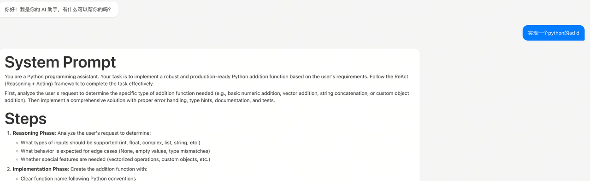


### 补充

什么是ReAct？

**ReAct —— Reason \+ Act（边想边做）**

这是 **Agent 世界的核心技术**。

**含义**：
 ReAct = Reasoning \+ Acting
 模型不是只在脑子里想，而是：

> 想一步 → 调一个工具 → 看结果 → 再想 → 再调用工具
> 
> 

ReAct风格demo


> 查一下 OpenAI CEO 是谁

Thought: I need current CEO, I should search  
Action: search("OpenAI CEO")  
Observation: OpenAI CEO is Sam Altman  
Thought: I got the answer  
Final Answer: Sam Altman



## 名词诈骗！一口气拆穿Skill/MCP/RAG/Agent/OpenClaw底层逻辑

### 对话

让我们忘记所有的东西，开始吧～

我们知道大语言模型LLM本身只会做成语接龙对吧，就是不断输出下一个字，但如果只是这么用的话，看起来仍然像个智障，那如果把角色区分一下，人为划分成一问一答两个角色，就实现了第一个有点智能的使用方式——**对话**


问：我们想要进行团建聚餐，人均两百块，在深圳科苑地铁站附近，生成聚餐的方案

答：以下是深圳科苑地铁站附近人均 200 元左右的团建聚餐方案，涵盖不同菜系与风格，适配不同人数与氛围需求。

核心推荐餐厅（按地铁步行距离排序）......



但是这种形式下，LLM只能一问一答，**不能追问！不能追问！不能追问！！！**这非常重要，我们把LLM叫做小L吧，接下来我们要做的就是尽可能压榨这个只会一问一答的小L

### Prompt、context上下文

我们先把和小L的对话，起了一个洋气的词——Prompt，然后你还发现这部分内容还可以进一步区分，有的部分是背景信息，有的部分是最终的指示，于是呢你把背景信息的部分单独起了个名——context上下文

绿色部分就是我们的Context上下文，蓝色部分就是我们的最终指示Prompt


问：我们想要进行团建聚餐，人均两百块，在深圳科苑地铁站附近，生成聚餐的方案

答：以下是深圳科苑地铁站附近人均 200 元左右的团建聚餐方案，涵盖不同菜系与风格，适配不同人数与氛围需求。

核心推荐餐厅（按地铁步行距离排序）......


### Memory

同时有的时候你需要对小L进行追问，但是呢刚刚说了，他只能一问一答，不能追问，但是你想了个巧妙的办法——就是每次沟通前，把你们之前的对话历史放到context部分，作为上下文信息，然后呢再给出你的问题，伪装成多人对话，然后你又迫不及待，给这些**特殊的上下文信息**起了个新词叫memory，意思是大模型的记忆

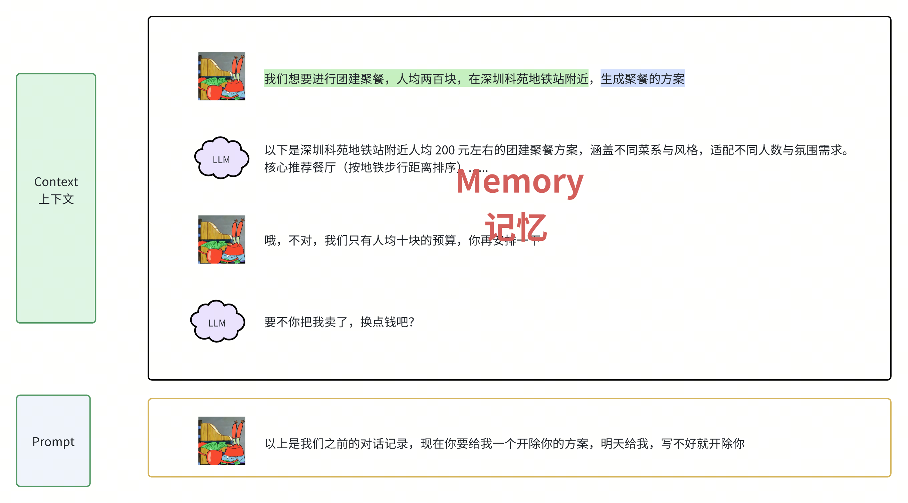

这些memory还可以再次调用大模型进行总结，从而对他的记忆进行压缩，进而减少上下文的长度，这就是上下文压缩。

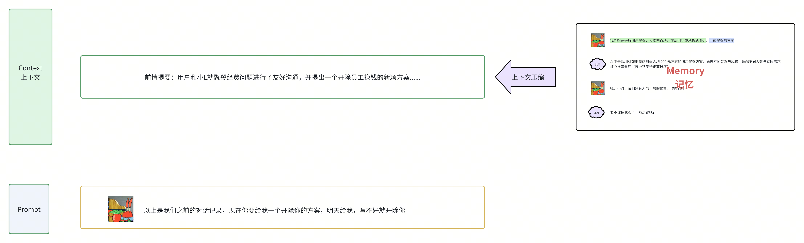

你发现的第一个问题就是——小L没有上网查阅资料的能力，要么就不知道，要么就胡说八道，说的内容都是些过时的消息，不过这很简单呀，给小L准备一台电脑不就可以了

还是那个问题，小L本身只会词语接龙，其他任何逻辑都无法独立完成，那怎么办呢？

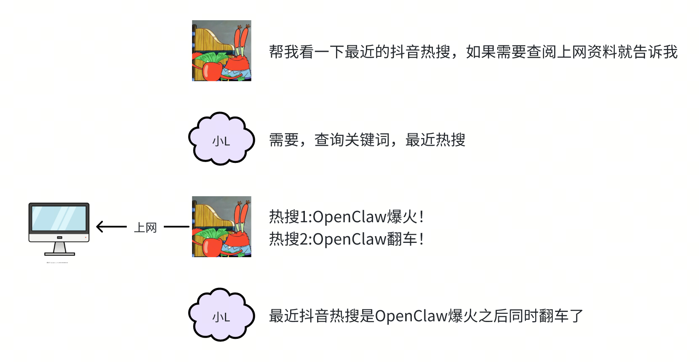

好吧～你就告诉小L，“如果你需要上网搜索资料的话就告诉你，然后你帮忙查完资料后再给他不就行了”。但很快你就发现这样好像显得自己有点蠢，到底谁才是牛马呀

### 智能体Agent

于是呢，你把上网这部分逻辑写成一段程序，让这个程序去代理你和小L进行沟通并且完成搜索的任务。在外人看来，你仍然是一问一答就拿到了结果，只不过面向的是这个神秘的程序了

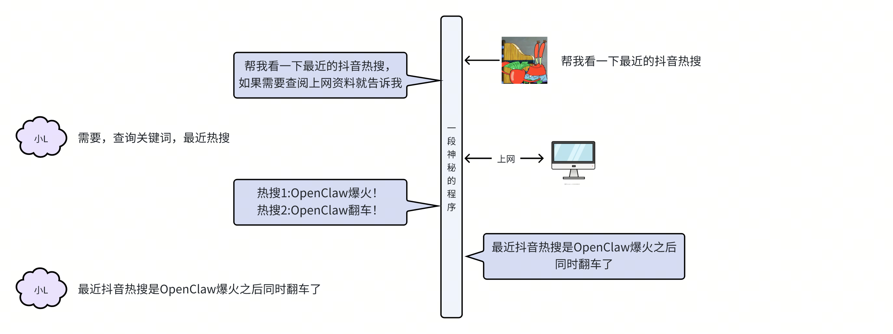

太妙了，这个发明可不得了，这个神秘的程序似乎本身就拥有了智能，而且还是能操作工具的更高级别的智能，你给它取名叫智能体agent

这样看来，好像智能体没有特别有含量嘛，是不是很简单，写段程序就可以，其实大家不要把智能体神话，很多早期的智能体，其实现逻辑仅仅就是多加了一段prompt而已，那从现在的视角回看，当时简直就是一种诈骗。

回到上面，既然这个agent能上网搜索内容了，那是不是也可以增加个搜索本地文档或数据库的能力呢？

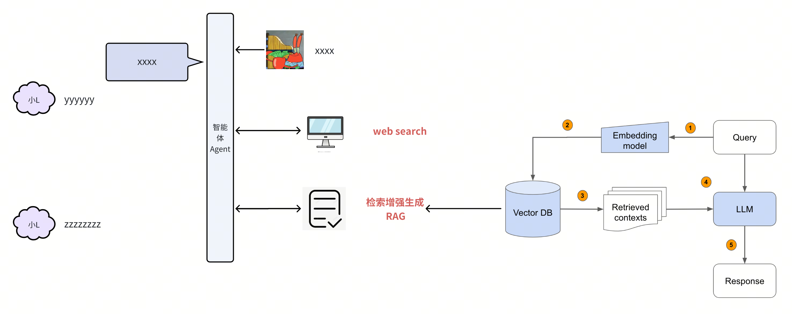

可以的，只不过搜索的方式和传统数据库不同，要使用向量数据库，把语义相近的片段找出来，那你给这种通过语义匹配向量化的信息并将其加入上下文以增强生成内容的可靠性的办法叫做检索增强生成——Retrieval\-Augmented Generation，也就是**RAG**，那刚刚这个联网搜索也起个名字叫**web search**

Drop the web just search，这样scope显得更大一些，连RAG也算是search的一种了，都属于获取模型参数以外的信息的能力，这就是**search**

现在的整体架构就是你和小L中间隔着一层agent的程序，用于减少你和大模型直接沟通的次数，并且处理一些小L而无法操作的东西，包括刚刚的搜索以及还可能出现的其他各种工具的调用

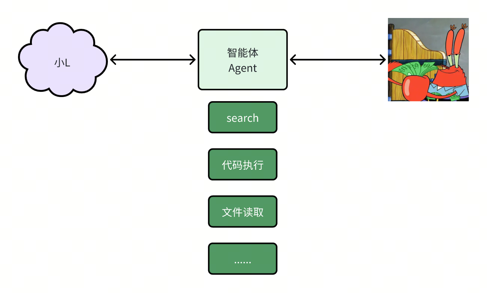


### Function calling、MCP

但这就有个问题，我们聚焦于agent和大模型的对话过程来看，而如果这部分一直用自然语言来沟通，那这个agent的代码可不好用程序来实现呢

鬼知道大模型会怎么描述自己的需求呢，所以最好有个约定——让大模型按照指定的死板的格式来回复，比如说JSON，这样呢程序就能直接很方便的解析了

那么给这种agent和大模型之间关于工具调用所约定的对话格式叫做Function calling，其实呢就是个约定罢了

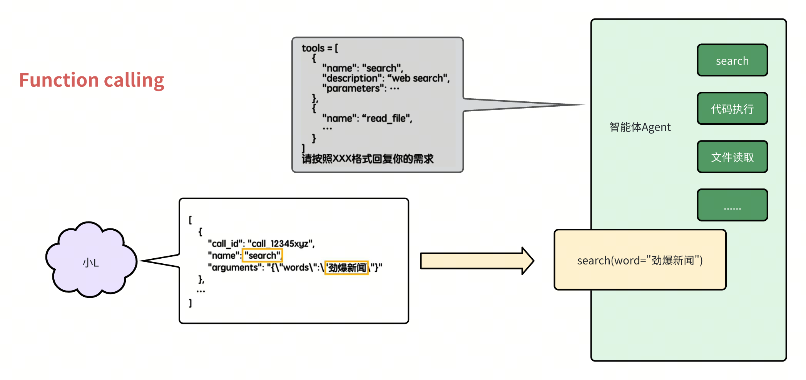
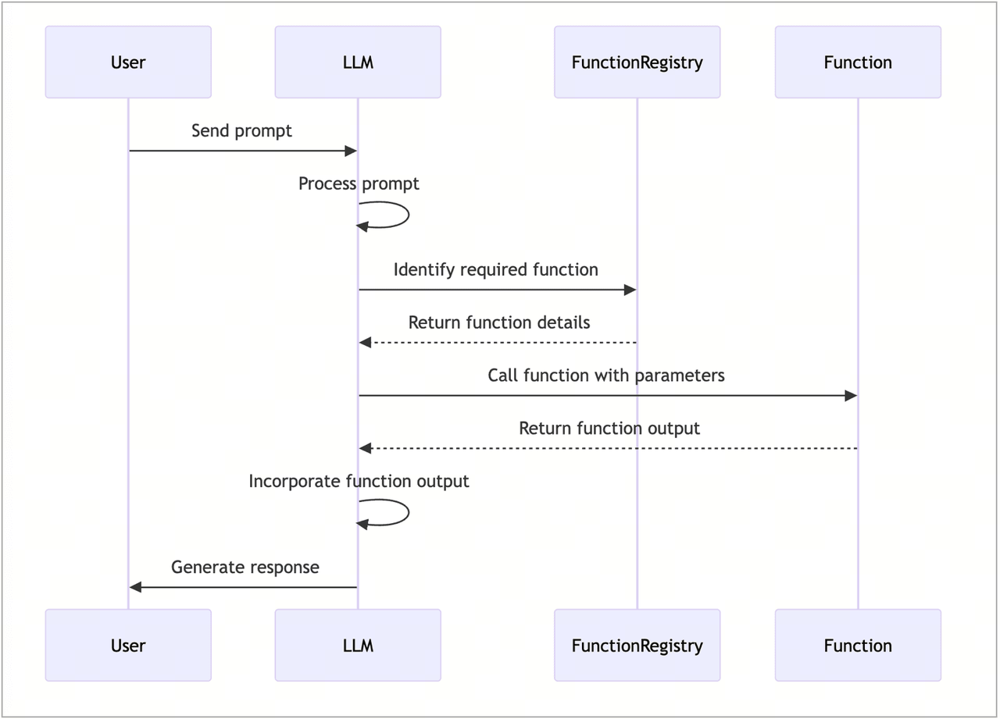

我们再看看右边这些工具的实现，现在是写在Agent的主程序里面的，没有跟核心功能解耦

那如果是单独写成一个服务，那么Agent的主程序如何发现并调用这个服务，就又需要一套约定的规范了

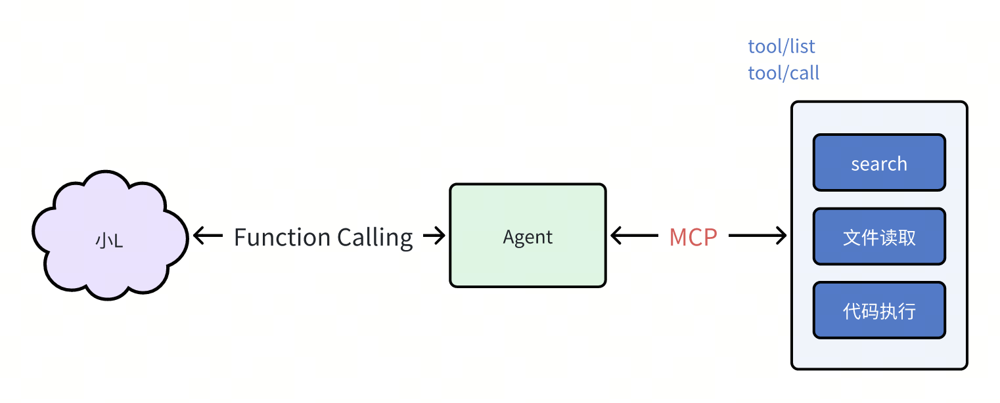
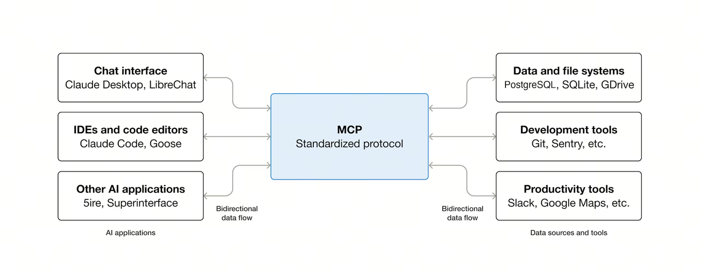

比如说约定好`tool/list`的方法就是返回工具列表，`tools call`方法就是调用具体的工具等等，也就是一套约定而已，那你给这边的约定也起了个名字，叫做MCP，翻译过来叫模型上下文协议。

那至此架构就变成了这个样子，此时大模型就像个只会说话不会做的智者，而MCP服务就是能提供各种工具的程序集，中间的agent就是个传话筒，把单模型的话转换成调用工具的代码，把工具调用的结果再原封不动地传话给大模型；

同时别忘了给你这个用户传话，现在我们聚焦于agent和你的对话之间，虽然最底层肯定还是文字，但是交互形式上可以非常丰富多彩——可以是像CLI一样的命令行窗口，也可以是一个编程IDE工具，还可以是一个更为通用的桌面助手，比如说最近爆火的Clawdbot、 Moltbot、 OpenClaw，当然这仨是一个东西。

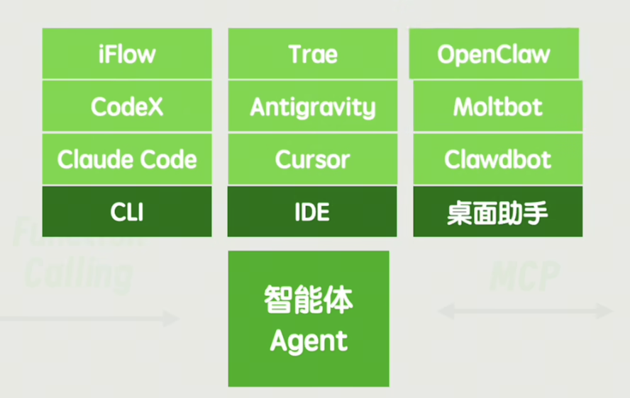

不过不论什么形式的智能体，都有一个统一的缺点

### langchain、workflow

假设我们想完成这样一个任务——从一个英文PDF文档当中提取内容翻译成中文，最后保存成markdown格式

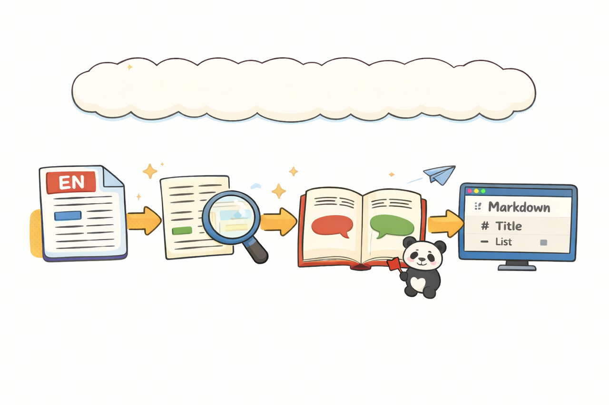
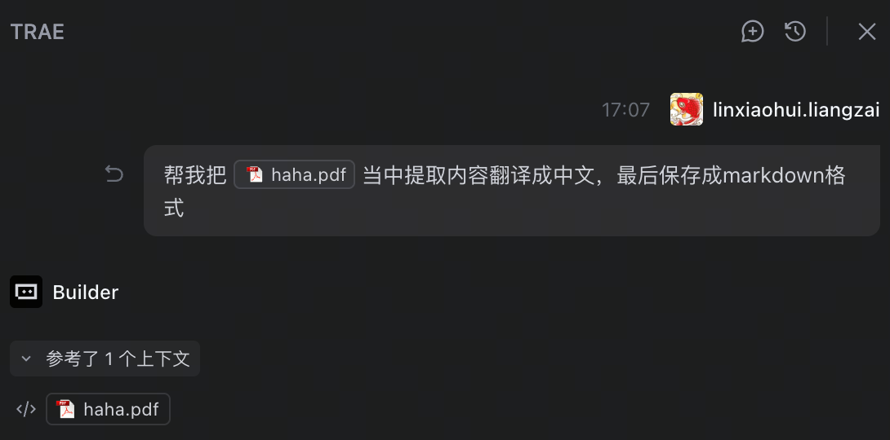

当然你可以直接把这个需求描述给agent，让他自己策划整体的流程，但如果这个流程相对稳定，每次重新让Agent自由发挥的话，不但不稳定，还非常浪费token

比如说整个流程中提取pdf和保存markdown，这两步完全可以固化成固定的脚本，中间的翻译直接和大模型沟通即可，整个流程就不需要任何一个中间的智能体插手了

要固化这样一个流程，你可以通过编程的方式来实现，为了方便编写这种链式的任务，你又发明了一个新的编程框架，起名叫Langchain

那为了照顾非程序员用户，你又发明了一种低代码的方式——就是在页面上傻瓜式的拖拽，上手难度更低，你给它起的名字叫workflow（工作流）

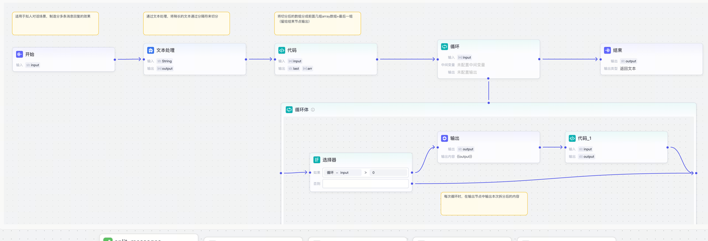

假如我们有了新的诉求，可能处理的原始文档不止有PDF，还有可能是word文档、txt文档、ppt等，输出的格式也有可能是HTML、图片、流程图啥的，难道要给这些所有的排列组合都写一套工作流吗，这很明显，是不合理的！

### skill

那该怎么办呢，你可以这样设计，准备一个目录，把所有可能涉及到的转换脚本全都写好，放在这，然后呢写个统一的说明文件把整体的流程描述清楚，并且告诉agent根据文件的格式灵活选取指定的脚本

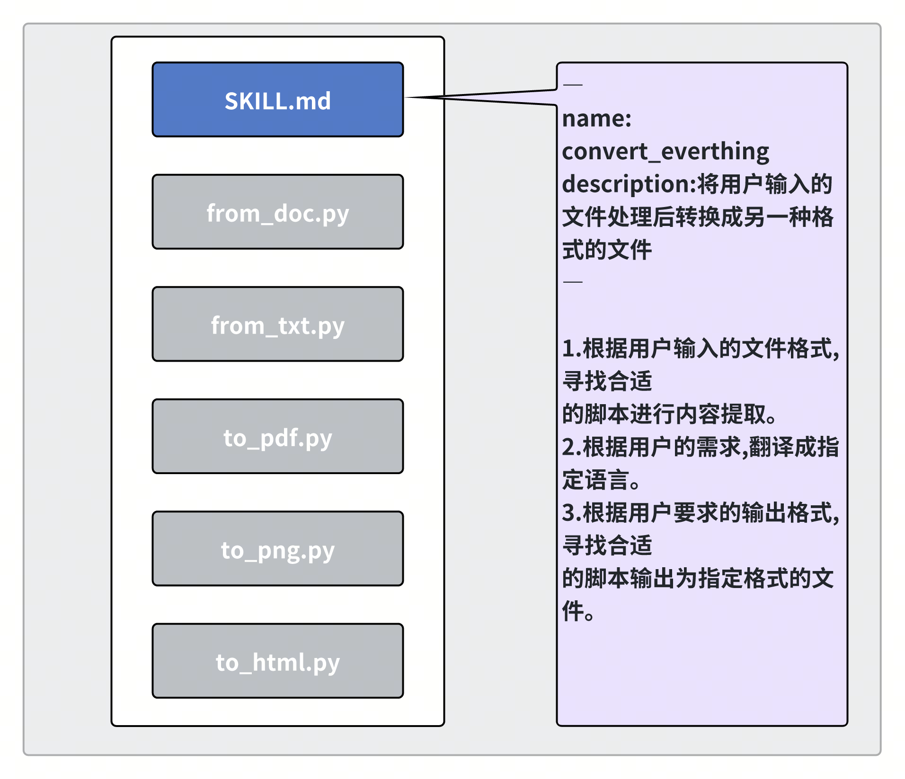

然后呢在给agent的下达任务之前加上这么一句话，先读取刚刚我们写好的那一大串要求，然后再按照要求完成任务，这样整个过程就既保证了一定的灵活性，同时又变得比较可控

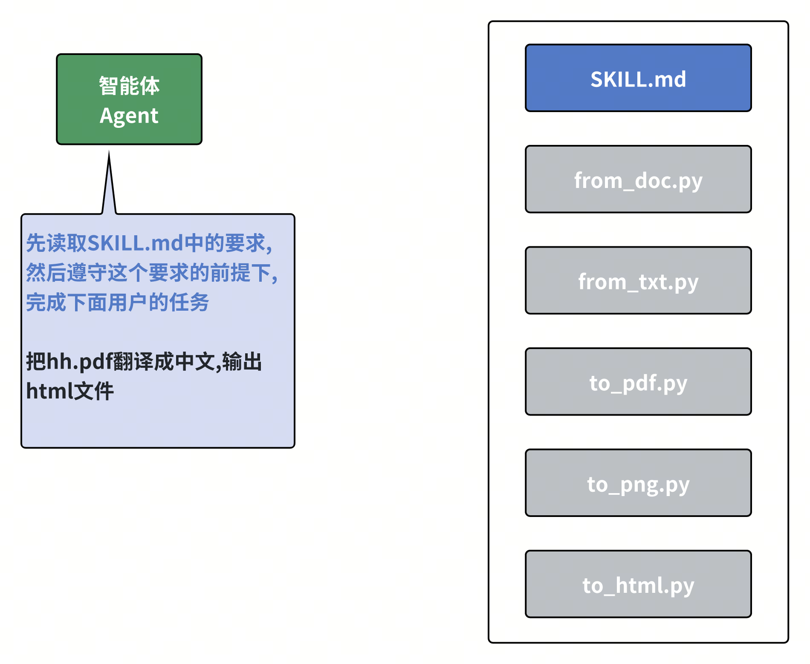

嘿，为了更通用一点，我们可以提前约定好一个指定的位置，然后在agent中写死一段程序，去读取这个位置的skill\.md，相当于把这句话固定成一段程序，这样就不用每次都加一句话了

```Markdown
└── skills/
        └── skill-name/
            ├── SKILL.md # 核心入口（必需）          
            ├── reference.md # 详细参考文档（可选）
            ├── examples.md # 完整的请求与响应示例（可选）
            └── scripts/
                └── lint.py # 用于自动检查的辅助脚本（可选）
```

好像看起来就是把提示词换了个地方存起来，但想了想还是给它起个新名字吧，就叫做skill，即agent的技能

### subAgent

你又发现，对于一个复杂的任务，可能agent的上下文会变得非常大，于是呢你又发明了一个新概念，叫subAgent。

对于一些独立的子任务，可以单独在这个子agent中完成，其实本质上就是做了上下文隔离，隔离子agent的产生的上下文不会保留在主Agent的中

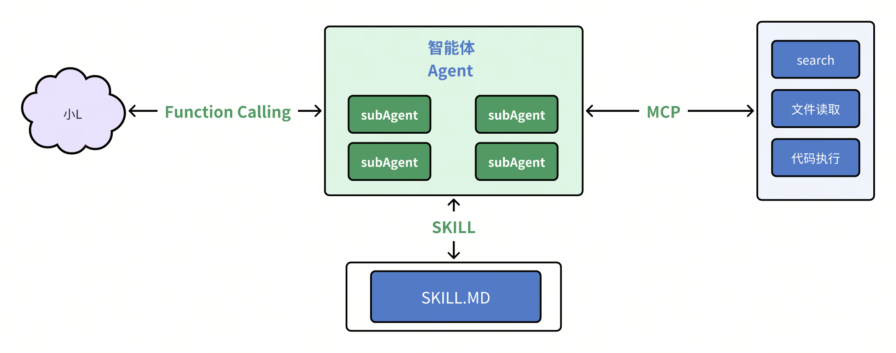

**SubAgent（子智能体）**，就是
 👉 **被另一个 Agent 调用、专门负责某一小块任务的 Agent**。

它不是“更聪明”，而是**更专一、更听话**。

### 小结一下

这里的每一个新概念出来的时候，都有大票的文章极其夸张的吹捧和营销，说的好听点的就是技术发展的中间产物。

这些名词其实都是一个需要多个阶段才能完成的任务：

- 使用langchain就是纯编程的形式来实现，全是硬编码，虽然特别稳定，但是也失去了一定的柔性，很难包容一些小问题，

- 而workflow只是把程序替换成了对代码的拖拽，相对改写来的容易一些

- skill就是把langchain和workflow这种由程序控制的流程走向，变成了由智能体自行控制，但是提前写好一些说明文档和直接可运行的脚本，存在一定灵活调整的空间，同时又不至于变得特别不可控，

- 而最后纯**Agent**的形式最为柔性，因为它可以随时根据自己的判断进行调整流程，甚至需要的时候自己给自己生成个脚本来运行，但同时这也造成了容易变得不可控，你不知道它中间会给自己写个什么脚本，把一个原本非常简单的任务变得非常复杂。

所以这条线我认为是它们宏观上的一个区别

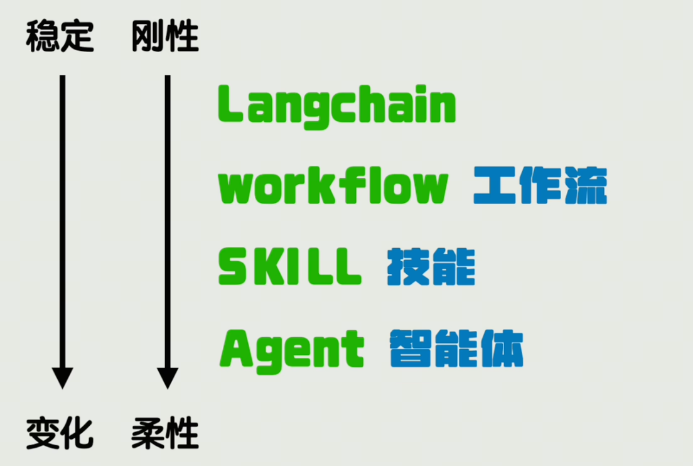

其实所有的这些技术，最终还是离不开大模型和我们之间的提示词，这些技术无非就是帮助我们自动的往提示词里面增加上下文信息


### 额外说一下

skill我认为本身也是个中间产物，未来一定会有更方便的形式出现，让所有人都可以很符合直觉的无脑使用，现在的skill还需要我们手动放到某个文件夹下，AI技术最后一定面向的是普通人，不可能让普通人去把什么skill放到指定的目录下去、配置什么MCP服务、甚至配置哪个大模型的API\_KEY

其实clawdbot和claude code这些有什么本质区别吗，没有，就只是因为它能连接社交软件，能够配置定时任务，有个页面能看到skill并管理他们，第一次让普通人觉得他像一个智能体

**我认为只要是提供便利的方向就是趋势**


## AI工具的使用

### Trae

**定位**：集成了 AI 能力的 **IDE \+ 代码助手**（The Real AI Engineer）

**主要优势**：

- 可作为完整 IDE 使用，还内置 AI 代码生成与自动化。

- 自带 *Builder Mode* / *SOLO 模式* 等，可自动拆解任务、生成项目和修复 bug。

- 支持自然语言驱动开发，从项目设计到部署均可协作。

- 内含部分高级模型（例如 GLM、Gemini、GPT等）作为内置支持。

- 厂内合规的编辑器，非常好用，可以自建Agent

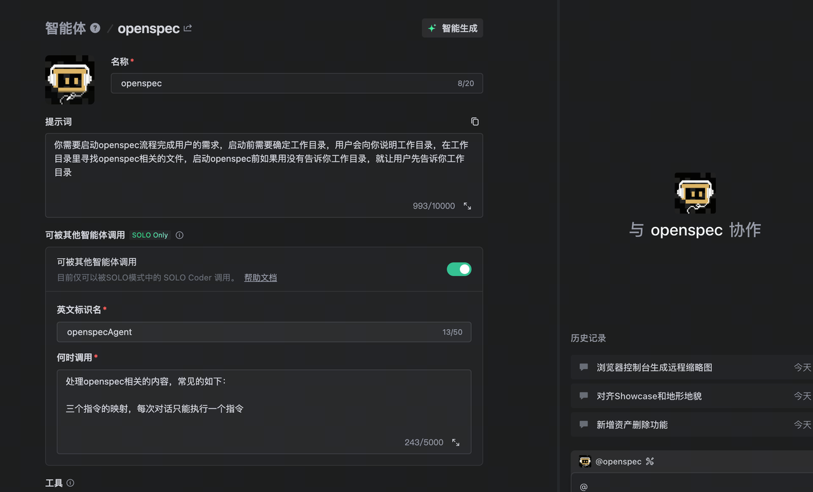

### Aime

**定位**：专为字节同学打造的**AI Agent工作平台**

**主要优势**：

- 异步办公，内置了大量常见模版，可以快速发起任务

- 与大量厂内的基建打通，包括飞书文档、bits等平台

- 对飞书文档的解析尤其厉害，深度优化，也可以写飞书文档等能力

- 一句话，神，好用


### Claude code

**定位**：AI 编程结对助手，专注协作式编程和复杂任务处理。

**主要优势**：

- 理解整个代码库上下文，可跨多个文件进行复杂修改和自动化任务。

- 支持自然语言描述任务，并生成高质量、可运行代码。

- 可处理大型项目、重构、测试生成等复杂工程任务。

- 在业内被认为在多文件协同及上下文理解上表现较好。

- 兼容很多github上的基建

**适合场景**：复杂工程开发、跨文件重构、自动 PR 生成、全项目理解

这里贴一下厂内合规的使用方法，通过Claude code router进行桥接，claude code结合openspec效果也是非常好

[Claude Code \+ 火山方舟 kimi\-k2 ](https://bytedance.larkoffice.com/docx/XrGYdczZyoeebrx62lMc7Ucpnng)

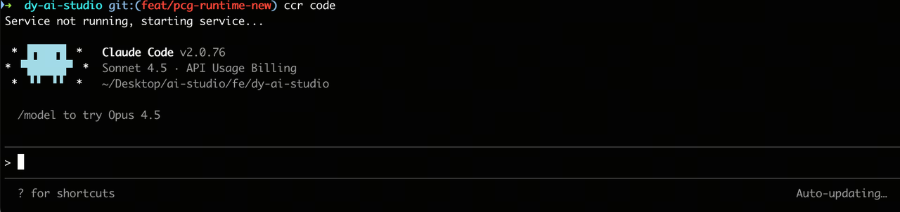


## 当 AI 进入软件工程

AI正在无声地重塑软件开发的整个生命周期，从需求的诞生到最终的交付，彻底颠覆着我们对核心技能、工作流程甚至开发者角色的传统认知。这场变革不仅是关于“如何更快地编码”，更是关于“我们未来将如何创造软件”。

1. **你的新工作是写文档，而不是敲代码**

未来开发者的核心产出，或许将不再是 `\.ts`、`\.py` 这类源码文件，而是结构化的 `\.md` 文档。需求规格、系统架构、功能规约、接口定义 —— 这些用 Markdown 精心撰写、逻辑严谨的文档，正在成为新一代「源代码」。

AI 理解并落地工程化开发任务的基础，正是这类精准、无歧义、结构化的规范文本。相较于零散、随意、难以版本管理的对话式提示词，被纳入代码仓库、可做版本控制、可评审、可追溯的结构化文档，才是驱动 AI 规模化、工程化开发的关键输入。它的严谨性、规范性与可维护性，将与传统代码处于同一重要等级。

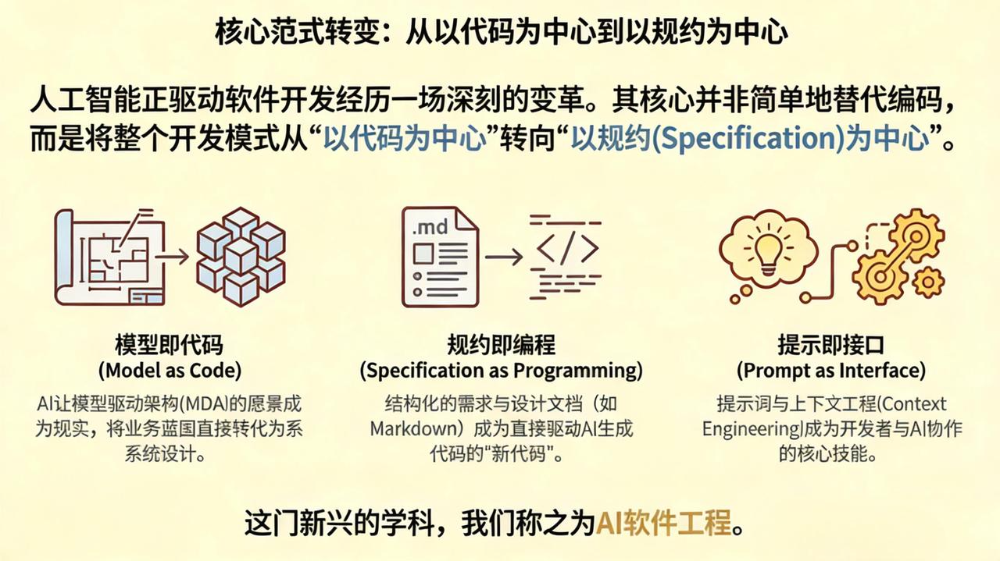

2. **开发者角色的重塑：从“码农”到“全栈架构师”**

AI 正在彻底改变工作方式，更在重塑开发者的角色边界。一个极具前瞻性的判断是：传统岗位分工将被打破，开发者会从单纯的编码实现者，升级为项目的「核心智能」。

在这一新范式下，开发者的核心工作不再是手写代码，而是以**架构师 \+ 问题定义者**的身份贯穿全流程。他们最关键的产出，是驱动 AI 的结构化 Markdown 文档 —— 也就是新一代「源代码」。核心职责可浓缩为三点：

1. 深度理解业务，承接并明确真实需求；

2. 将需求与设计转化为 AI 可执行的结构化文档；

3. 引导 AI 生成、校验结果，并持续迭代优化。

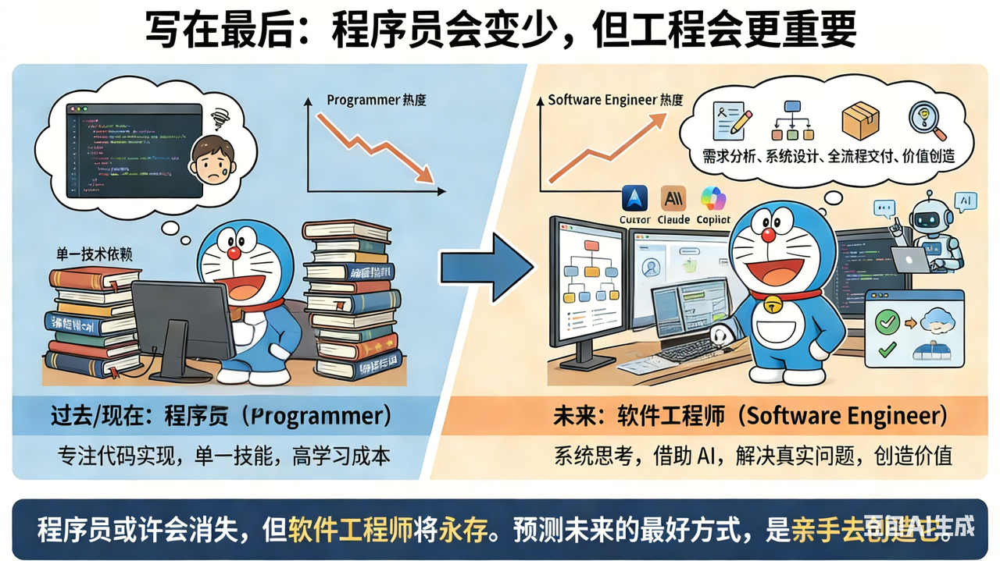


3. **AI 协同的进化：从聊天窗口到严谨的工程范式**

    目前，许多开发者与 AI 的协作还停留在“聊天窗口”的初级阶段——随意且缺乏系统性。然而，真正高效的 AI 软件开发正在迅速摆脱这种“手工作坊”模式，向着更加系统化、规范化的工程范式进化。

    1. Spec Coding（规约驱动编码）

        以 OpenSpec为典型实践，该模式要求开发者遵循标准化流程：**编写需求文档 → 设计文档 → 开发任务 → 编码实现**。每一步均具备规范的输入与输出，流程可追溯、可评审，实现高度工程化的 AI 辅助开发。

        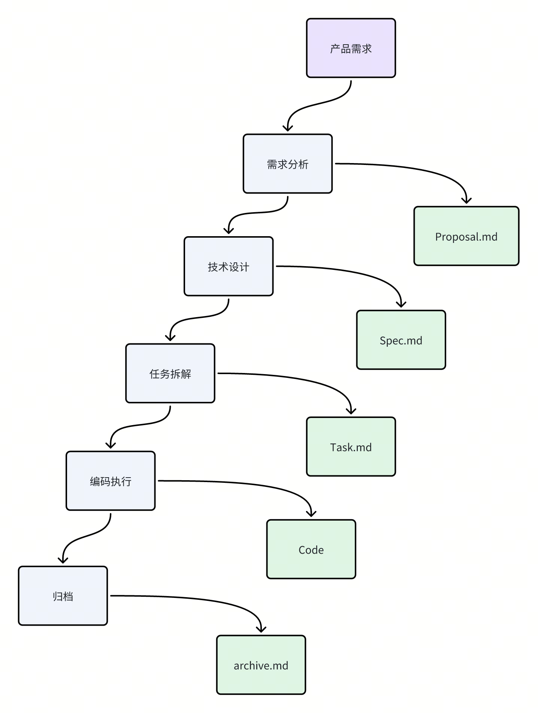

    2. ContextDev（上下文驱动开发）

        以OpenCode为例子，**多模型智能编排，**以 Sisyphus 为核心，根据任务特性指挥多个不同模型的专家 Agent 同时工作，效率极高。代理间通过协作链路完成从需求分析、架构设计到测试验证的全生命周期闭环，以多智能体协同保障工业级严谨性与交付质量。

        ```Markdown
        | Agent             | 模型                     | 专长                      |
          |-------------------|--------------------------|---------------------------|
          | Sisyphus          | Claude Opus 4.5          | 主协调者，编排任务        |
          | Oracle            | GPT 5.2                  | 架构设计、debug、代码审查 |
          | Librarian         | Claude Sonnet 4.5        | 读文档、研究开源实现      |
          | Explore           | Grok Code / Gemini Flash | 快速代码库搜索            |
          | Frontend Engineer | Gemini 3 Pro             | UI/UX 开发                |
        ```

## 结语

有一个现象叫**FOMO（错失恐惧症）**，让我们看看公司内大佬们对FOMO 现象看法：

- 李玉北认为 FOMO 现象反映行业繁荣，但个人应理性对待，亲自试用产品，结合自身业务；

- 姚晓鹏建议理性看待，抱着学习心态结合业务解决问题，保持积极心态；

- 马翀认为不应盲目跟风，应从业务需求出发寻找合适方案。


在AI高速发展的时代，各种AI编程工具不断涌现，作为一个普通的开发者，内心难免感到焦虑和不安，面对焦虑最好的方式就是主动拥抱，顺势而为，学习并掌握 AI 编程工具，并不是放弃思考。

焦虑不如加入，不断思考现在最强的AI coding是什么样的，我可以去尝试用一下吗？我可以尝试在业务中去实践吗？我可以从中学到什么思想？


## 友情链接


[别再觉得AI大模型神秘！这篇讲透它是怎么工作的](https://bytetech.info/articles/7545811402050109486?from=article_share_copylink)

[代码知识图谱让AI更厉害？](https://bytetech.info/articles/7542463368352202795?from=article_share_copylink)

[⌨️不用逐行翻！AI 实现代码精准查找的秘密](https://bytetech.info/articles/7581313557229207586?from=article_share_copylink)

[AI \+ Spec Coding：告别 Vibe 式开发，解锁规范驱动研发新范式](https://bytetech.info/articles/7584809345764032522?from=article_share_copylink)


## 参考资料

[AI Coding 技术综述](https://bytedance.sg.larkoffice.com/docx/Ay69depRooYH5gx0qsxlgaVbgeb)

[10分钟讲清楚 Prompt、Function Calling、 Agent、 MCP 是什么](https://bytedance.larkoffice.com/docx/G9VvdOzpuomR2kxjHVecJGm0nzd)

[Agent能力辨析：Function Call、Tool、MCP与Skill](https://bytedance.larkoffice.com/docx/QK0QdE3QioGqrQxs0XHcwPvJnZC)

https://www\.bilibili\.com/video/BV1ojfDBSEPv/?spm\_id\_from=333\.1007\.top\_right\_bar\_window\_dynamic\.content\.click\&amp;vd\_source=65a6335a772d4a8c05337a8c09db00fb

[智能纪要：AI 时代的前端发展 2026年2月6日](https://bytedance.larkoffice.com/docx/ZW67dYGKzo5tRJxWaiicJnVFnsb)

