# 深入理解Go语言并发调度器GMP模型

## 📖 概述

Go语言的并发能力是其最大的特色之一，而这一切都归功于其强大的调度器系统。本文将深入剖析Go语言的GMP调度器模型，从历史演进到核心原理，再到实际调度场景，帮助你全面理解Go语言并发编程的底层机制。

## 🎯 学习目标

阅读本文后，你将能够：
- 理解Go调度器的发展历程和设计思想
- 掌握GMP模型的核心概念和工作原理
- 了解Goroutine的调度场景和生命周期
- 具备回答相关面试问题的能力

## 🏗️ 第一章：Go调度器的历史演进

### 1.1 单进程时代的困境

在计算机发展早期，操作系统只能运行一个程序，直到程序运行完毕才能执行下一个程序。这种**串行执行**的方式带来了两个主要问题：

1. **执行效率低**：只能一个任务一个任务地处理
2. **CPU资源浪费**：当进程因IO等操作阻塞时，CPU处于空闲状态

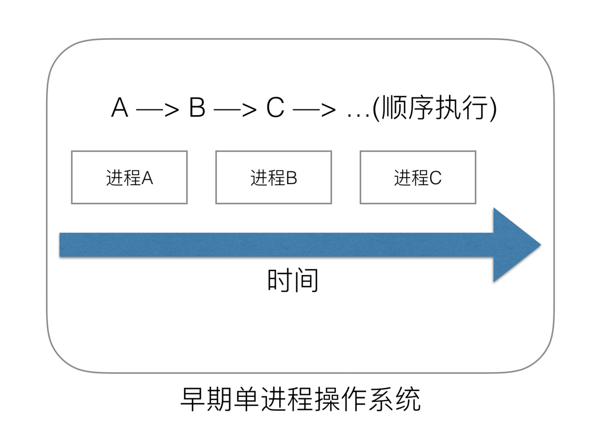

### 1.2 多进程/多线程的改进与新问题

为了解决单进程的问题，操作系统引入了**多进程**和**多线程**机制：

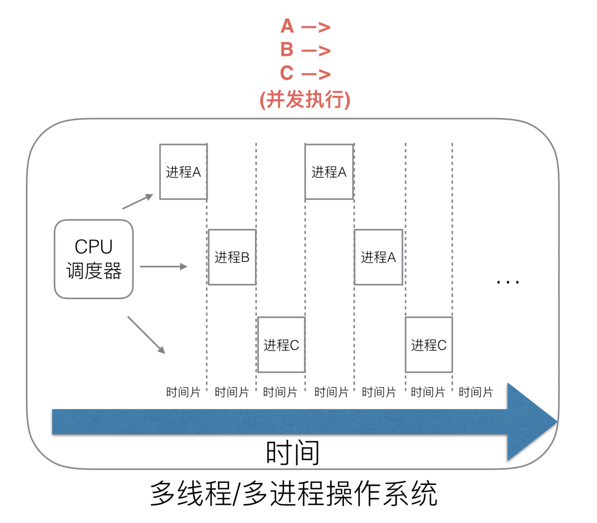

**优势**：
- 当一个进程阻塞时，CPU可以切换到其他进程继续执行
- 宏观上实现了并发执行

**新的问题**：
- **资源消耗大**：每个进程占用4GB虚拟内存，线程也需要约4MB内存
- **切换成本高**：进程/线程的创建、切换、销毁都需要大量时间
- **调度开销大**：CPU很大一部分时间用于进程调度

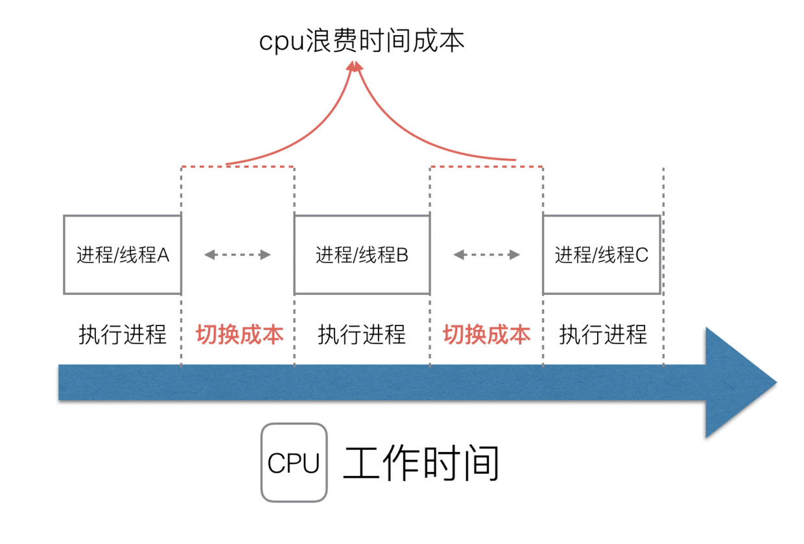

### 1.3 协程：轻量级的解决方案

#### 用户态线程 vs 内核态线程

工程师们发现可以将线程分为两类：
- **内核态线程**：由操作系统内核管理，CPU直接调度
- **用户态线程（协程）**：由用户程序管理，必须绑定到内核态线程上运行

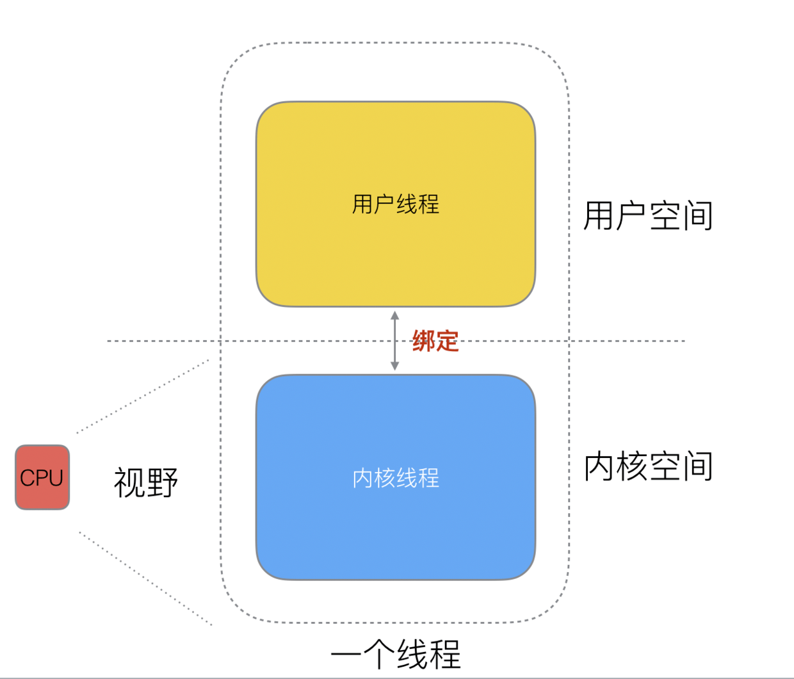

#### 三种协程-线程映射模型

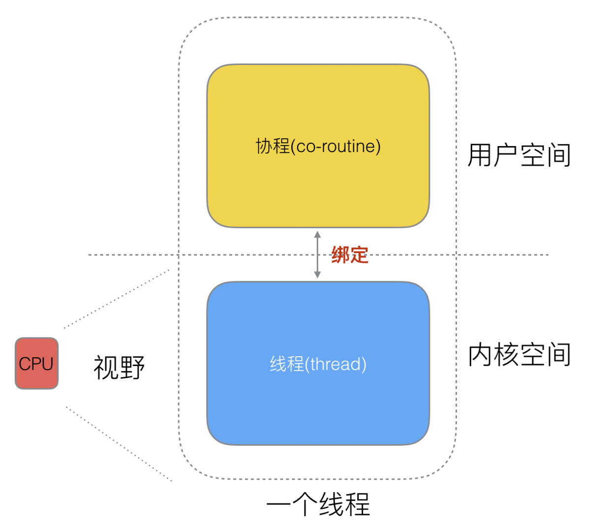

##### N:1 模型
- **特点**：N个协程绑定1个线程
- **优点**：协程切换在用户态完成，切换成本极低
- **缺点**：
  - 无法利用多核优势
  - 一个协程阻塞会导致所有协程阻塞

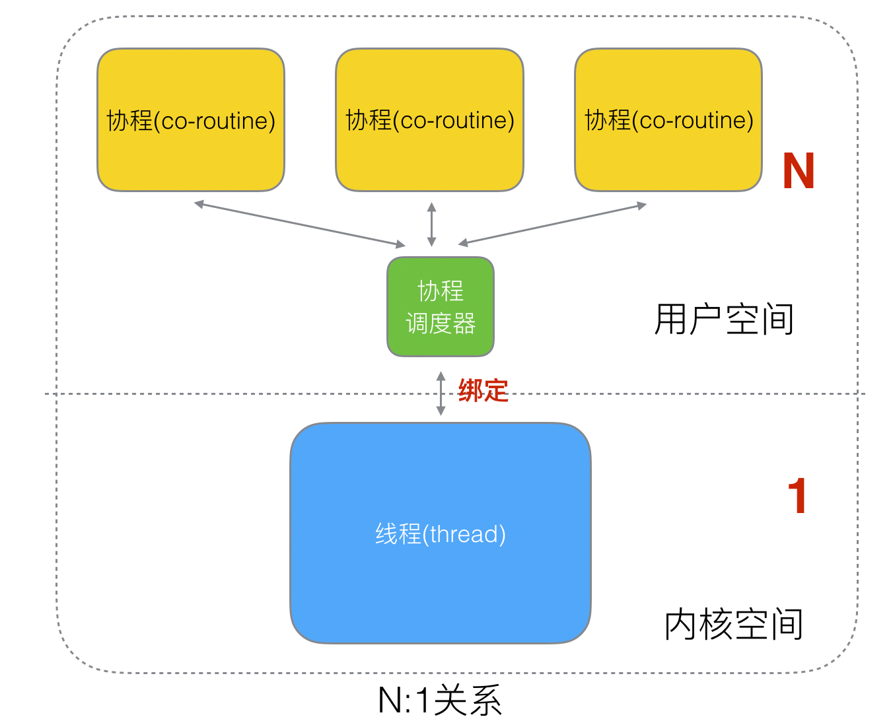

##### 1:1 模型
- **特点**：1个协程绑定1个线程
- **优点**：实现简单，不存在N:1模型的缺点
- **缺点**：协程创建、删除、切换的代价与线程相同，成本较高

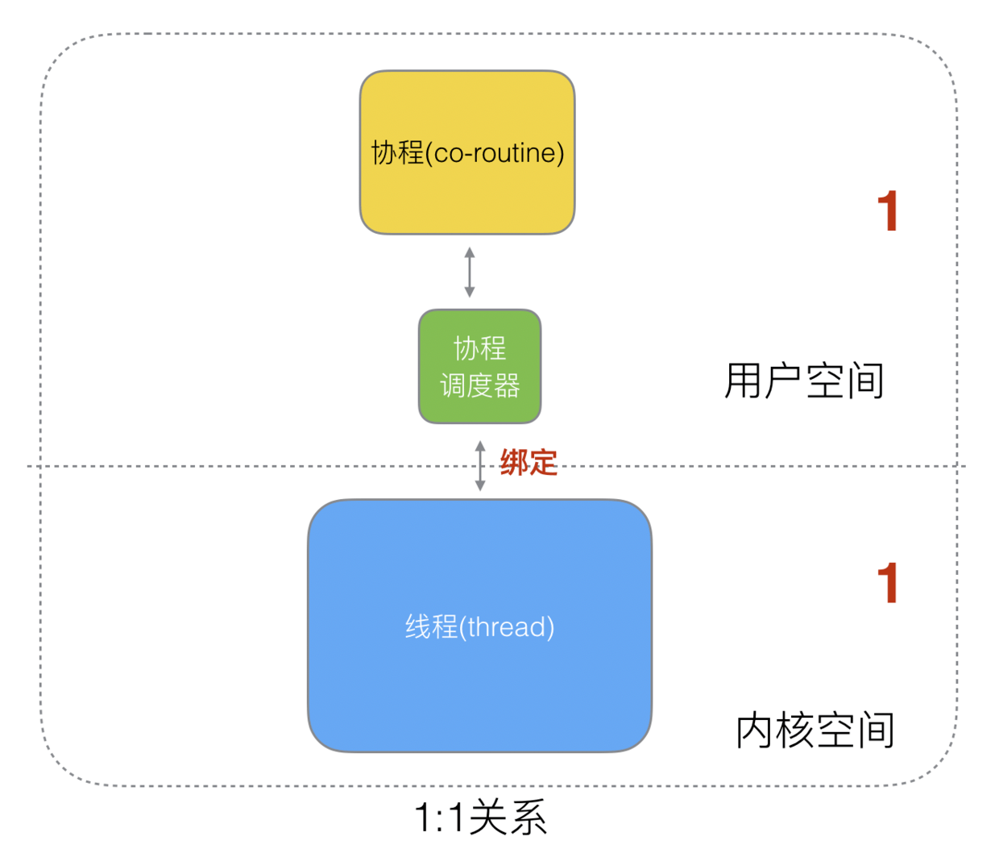

##### M:N 模型
- **特点**：M个协程绑定N个线程
- **优点**：结合了N:1和1:1模型的优势
- **缺点**：实现复杂度最高

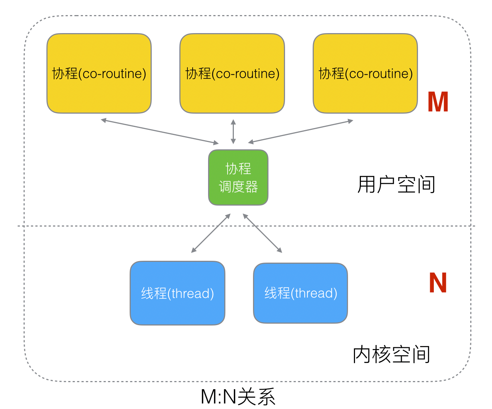

> 💡 **关键区别**：协程是**协作式调度**（需要主动让出CPU），线程是**抢占式调度**（由CPU强制切换）

### 1.4 Go语言的Goroutine

Go语言采用了M:N模型，并称其轻量级线程为**Goroutine**：

**Goroutine特点**：
- **内存占用小**：初始栈只有几KB
- **动态扩展**：runtime会根据需要自动扩展栈空间
- **调度灵活**：由Go runtime而非OS调度
- **并发能力强**：支持数万甚至数十万个Goroutine

### 1.5 旧调度器的问题

Go最初的调度器存在严重的性能问题：

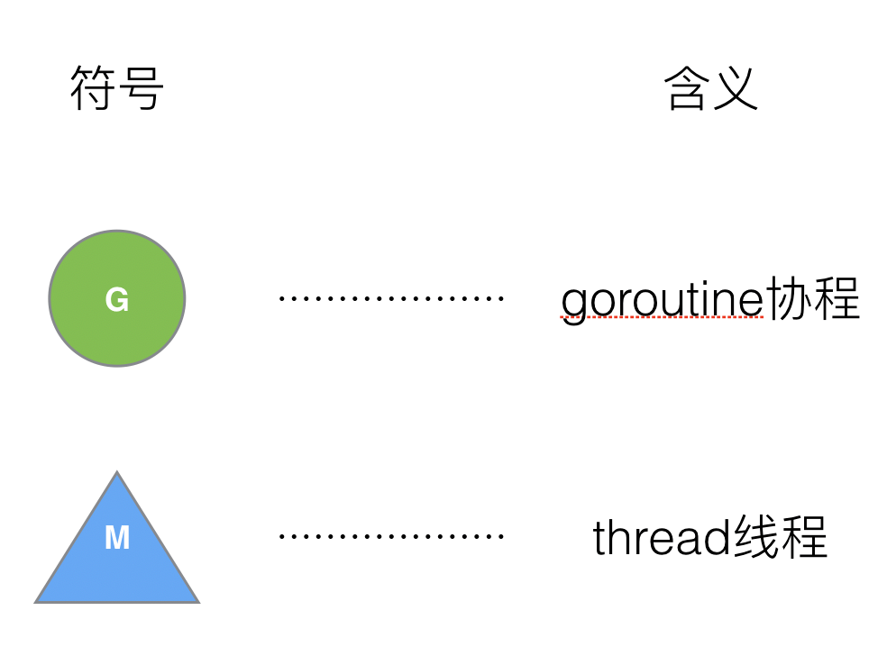

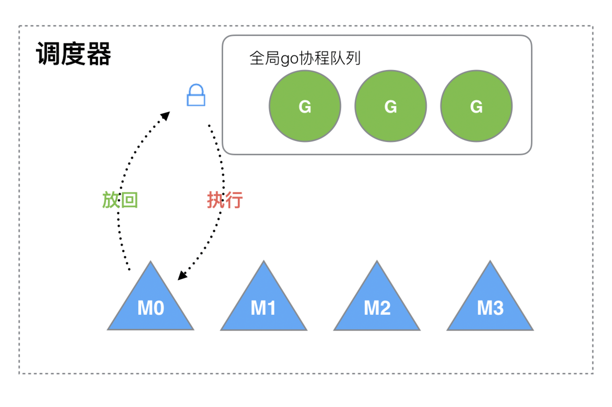

**主要问题**：
1. **锁竞争激烈**：所有M都需要访问全局G队列，需要加锁保护
2. **局部性差**：新创建的G被分配给其他M执行，缺乏局部性
3. **系统调用开销大**：频繁的线程阻塞和唤醒增加系统开销

## 🔧 第二章：GMP模型的设计与实现

### 2.1 GMP模型核心概念

为了解决旧调度器的问题，Go在2012年重新设计了调度器，引入了**P**（**Processor**）的概念：

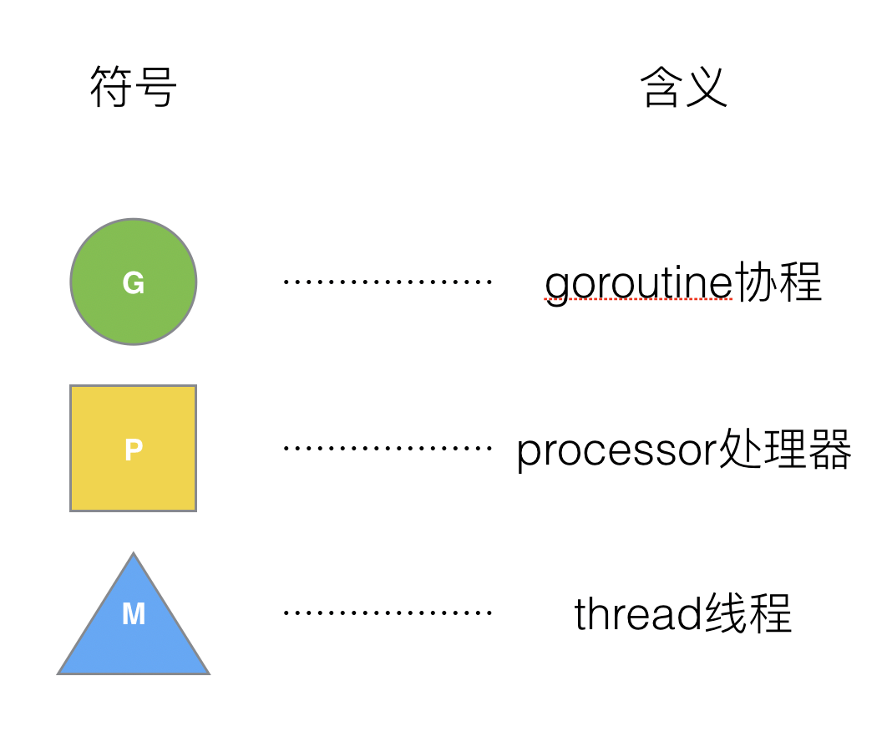

#### 核心组件定义

**G (Goroutine)**：
- 代表一个Goroutine
- 包含函数指针、栈信息、状态等
- 是调度的基本单位

**M (Machine)**：
- 代表一个操作系统线程
- 负责执行Goroutine
- 必须绑定P才能运行G

**P (Processor)**：
- 逻辑处理器，包含运行Goroutine所需的资源
- 维护本地Goroutine队列
- 数量由GOMAXPROCS决定

#### GMP模型架构

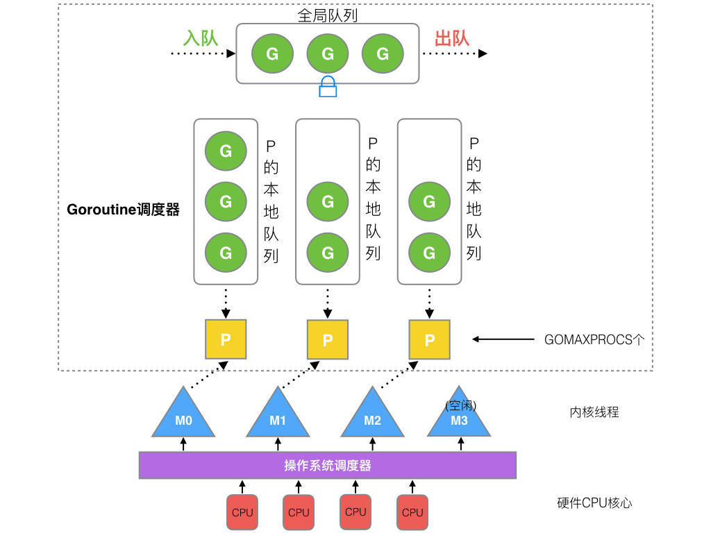

**主要组件**：
1. **全局队列**：存放等待运行的G
2. **P的本地队列**：存放等待运行的G，容量限制为256个
3. **P列表**：所有P在程序启动时创建，数量为GOMAXPROCS
4. **M**：工作线程，需要获取P才能运行G

### 2.2 P和M的数量关系

#### P的数量
- 由环境变量`GOMAXPROCS`或`runtime.GOMAXPROCS()`决定
- 通常设置为CPU核心数
- 在程序执行过程中保持不变

#### M的数量
- **默认上限**：10000个（通常达不到）
- **动态创建**：当现有M都阻塞时，会创建新的M
- **可配置**：通过`runtime/debug.SetMaxThreads()`设置

> 📌 **重要提示**：M的数量不固定，会根据运行时需要动态调整

#### P和M的创建时机

**P的创建**：在确定最大数量后，运行时系统创建对应数量的P

**M的创建**：当没有足够的M来关联P并运行G时，会创建新的M

### 2.3 调度器的设计策略

#### 复用线程
1. **Work Stealing（工作窃取）**：
   - 当本线程的P队列为空时，从其他P偷取G
   - 避免了线程的创建和销毁开销

2. **Hand Off（移交）**：
   - 当线程因系统调用阻塞时，将P移交给其他空闲线程
   - 保证P中的其他G能继续执行

#### 利用并行
- 通过`GOMAXPROCS`控制并行度
- 最多有`GOMAXPROCS`个线程同时在不同CPU核心上运行

#### 抢占式调度
- Goroutine最多连续运行10ms
- 防止某个Goroutine长时间占用CPU，导致其他Goroutine饿死
- 这是Goroutine与传统协程的重要区别

#### 调度器查找G的优先级顺序

当M需要执行新的Goroutine时，按以下顺序查找：

1. **P的本地队列**：最高优先级，无锁访问，性能最佳
2. **全局队列**：中等优先级，每61次调度检查一次，需要加锁
3. **网络轮询器(netpoll)**：检查是否有网络I/O就绪的G
4. **Work Stealing**：最后手段，从其他P的本地队列偷取G

这个设计保证了：
- 🚀 **性能优先**：本地队列无锁访问
- ⚖️ **公平调度**：定期检查全局队列防止饥饿
- 💪 **负载均衡**：work stealing机制分散负载
- 🔄 **资源利用**：netpoll提高I/O密集型程序效率

## 🔄 第三章：Goroutine调度流程详解

### 3.1 创建Goroutine的流程

当我们使用`go func()`创建Goroutine时，发生了什么？

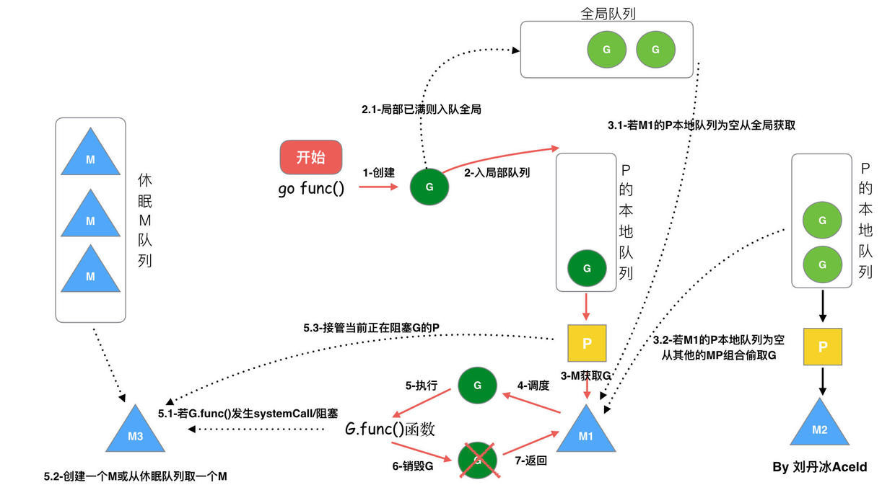

**详细步骤**：
1. 通过`go func()`创建新的Goroutine（G2）
2. 新G优先加入当前P的本地队列
3. 如果本地队列已满，执行负载均衡，将部分G移至全局队列
4. M从P的本地队列获取G执行
5. 如果本地队列为空，先从全局队列获取G
6. 如果全局队列也为空，再尝试从其他P窃取G

**关键特性**：
- **循环调度**：M调度G执行是一个循环过程
- **系统调用处理**：当G进行系统调用时，M会被摘除，创建新M服务P
- **P的复用**：系统调用结束后，G尝试获取空闲P继续执行

### 3.2 调度器的生命周期

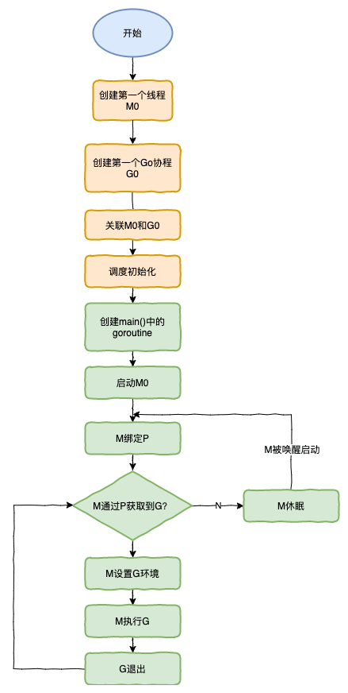

#### 特殊的M0和G0

**M0**：
- 程序启动后的主线程
- 负责执行初始化操作
- 启动第一个Goroutine后与普通M无异

**G0**：
- 每个M都有一个G0
- 专门负责调度工作
- 不执行用户代码，只处理调度逻辑

#### 调度器启动流程

```go
package main

import "fmt"

func main() {
    fmt.Println("Hello world")
}
```

以上代码的执行流程：
1. 创建M0和G0，建立关联
2. 初始化调度器：创建P列表、设置GOMAXPROCS等
3. 为`runtime.main`创建main goroutine
4. 启动M0，开始调度循环
5. 执行用户的`main.main`函数
6. 程序结束，清理资源

## 📊 第四章：可视化GMP调度

### 4.1 使用go tool trace

创建trace示例：

```go
package main

import (
    "os"
    "fmt"
    "runtime/trace"
)

func main() {
    // 创建trace文件
    f, err := os.Create("trace.out")
    if err != nil {
        panic(err)
    }
    defer f.Close()

    // 启动trace
    err = trace.Start(f)
    if err != nil {
        panic(err)
    }
    defer trace.Stop()

    // 主要逻辑
    fmt.Println("Hello World")
}
```

**使用方法**：
```bash
# 运行程序生成trace文件
go run trace.go

# 分析trace文件
go tool trace trace.out
```

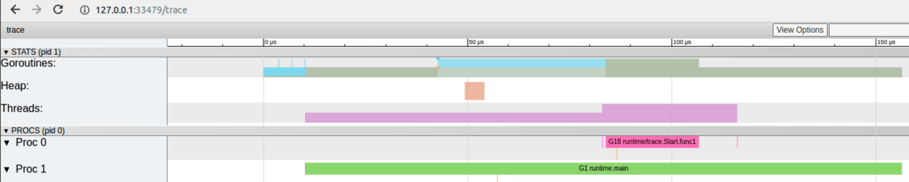

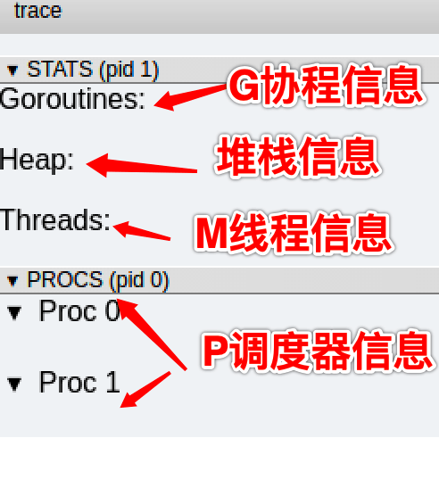

**信息解读**：
- **G信息**：可以看到Goroutine的运行状态和切换过程
- **M信息**：显示线程的创建和使用情况
- **P信息**：展示处理器的工作负载分布

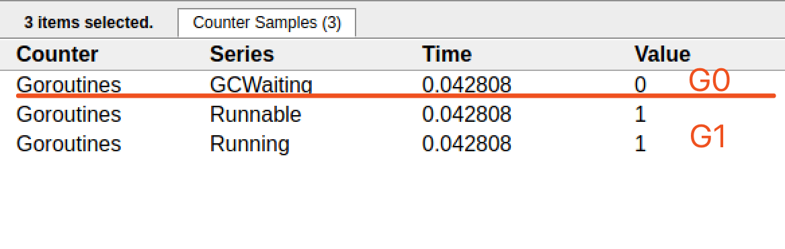
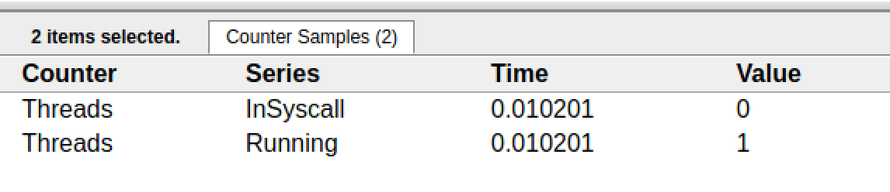
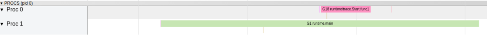
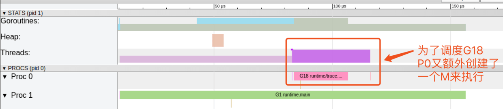
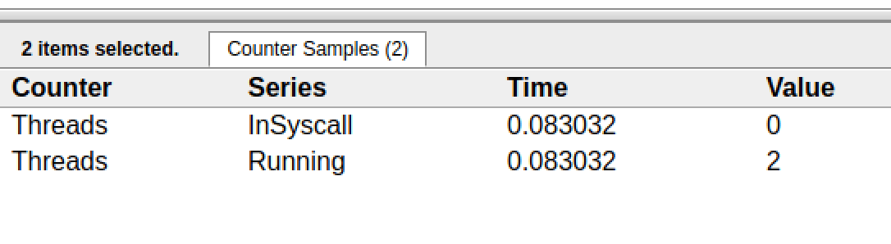

### 4.2 使用GODEBUG调试

```go
package main

import (
    "fmt"
    "time"
)

func main() {
    for i := 0; i < 5; i++ {
        time.Sleep(time.Second)
        fmt.Println("Hello World")
    }
}
```

**运行命令**：
```bash
GODEBUG=schedtrace=1000 ./program
```

**输出解释**：
```
SCHED 0ms: gomaxprocs=2 idleprocs=0 threads=4 spinningthreads=1 idlethreads=1 runqueue=0 [0 0]
```

- `gomaxprocs=2`：P的数量
- `idleprocs=0`：空闲P的数量
- `threads=4`：M的总数量
- `spinningthreads=1`：自旋M的数量
- `runqueue=0`：全局队列中G的数量
- `[0 0]`：各个P本地队列中G的数量

## 🎬 第五章：典型调度场景分析

### 场景1：创建新Goroutine

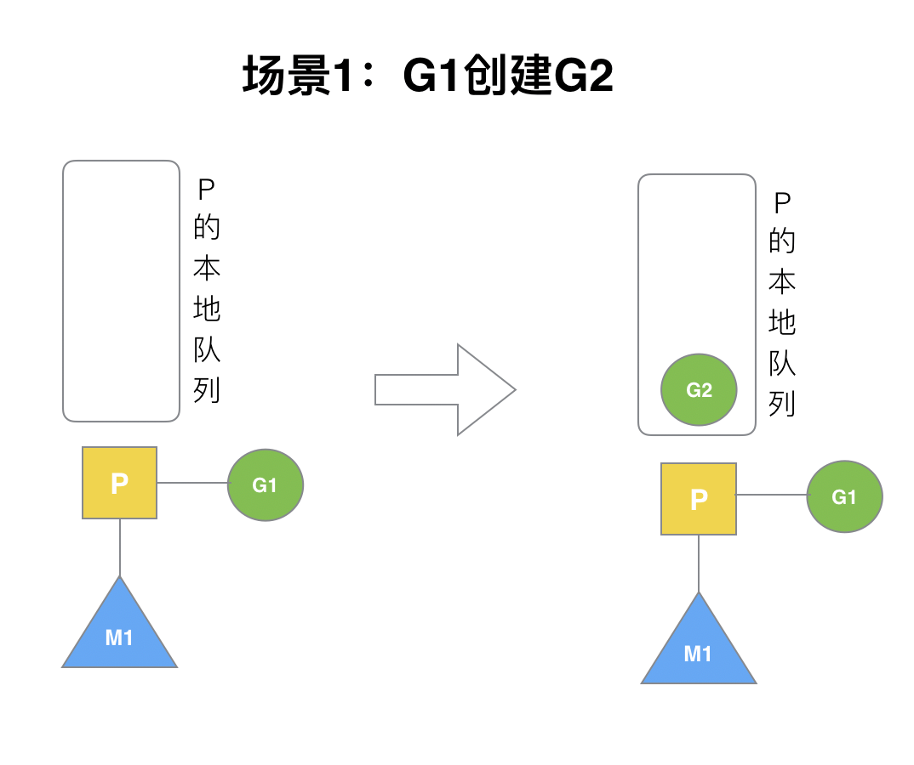

**描述**：P拥有G1，M1获取P后运行G1，G1创建G2
**结果**：G2优先加入P1的本地队列（局部性原理）

### 场景2：Goroutine执行完毕

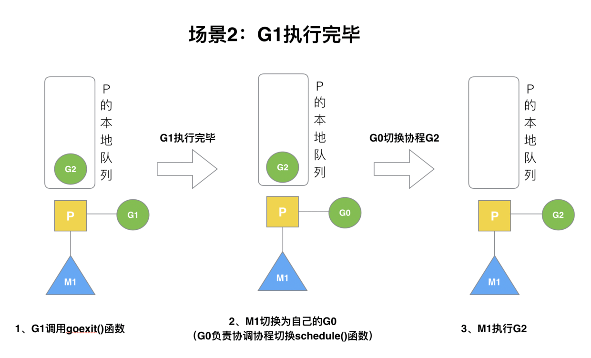

**描述**：G1执行完毕，M1复用执行G2
**关键函数**：
- `goexit`：Goroutine退出
- `schedule`：调度新的Goroutine
- `execute`：执行Goroutine

### 场景3：本地队列未满

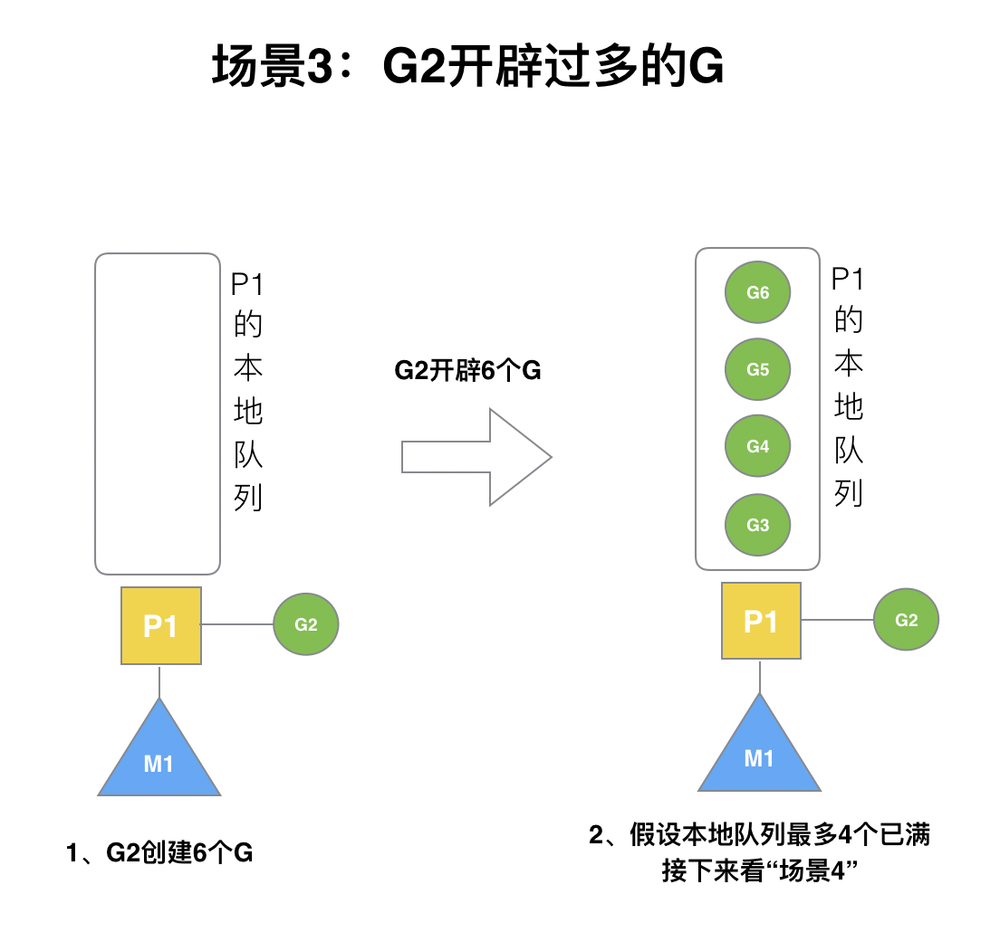

**描述**：假设P的本地队列容量为3，G2创建G3、G4、G5
**结果**：新创建的G都加入P1的本地队列

### 场景4：本地队列已满，执行负载均衡

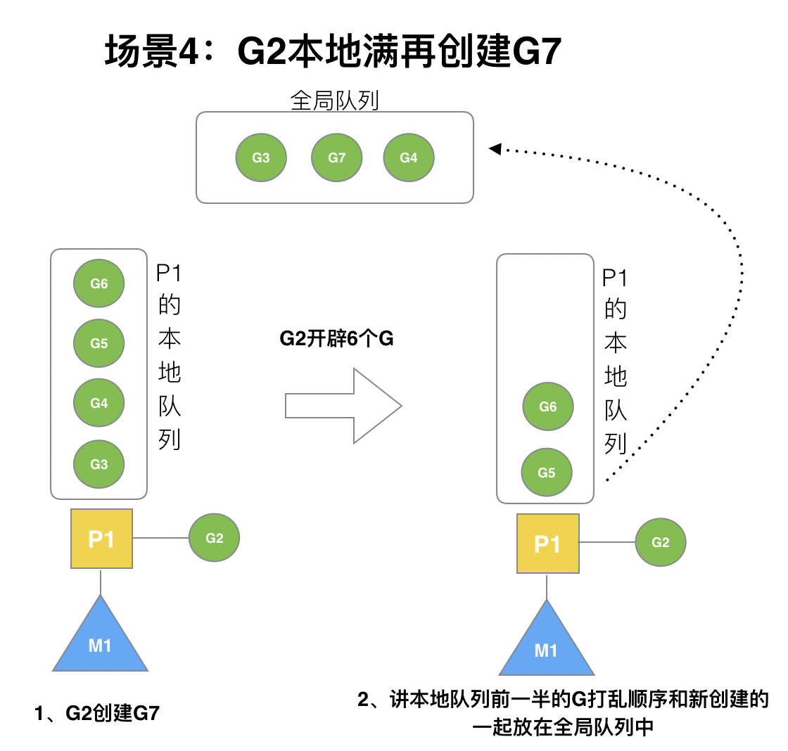

**描述**：G2创建G7时，P1本地队列已满
**负载均衡策略**：
- 将本地队列前一半的G移至全局队列
- 新创建的G也移至全局队列
- 维护队列的动态平衡

### 场景5：继续创建Goroutine

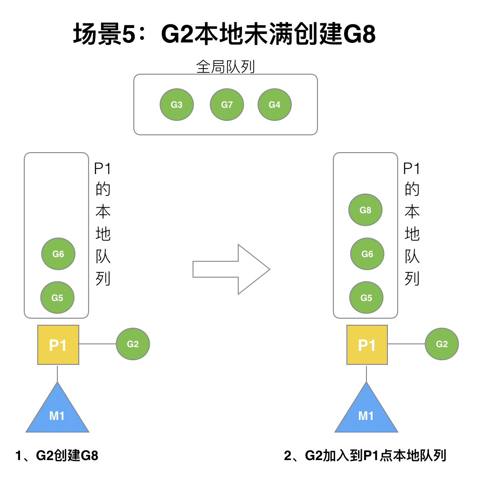

**描述**：G2创建G8，此时P1本地队列未满
**结果**：G8直接加入P1本地队列

### 场景6：唤醒空闲的M-P组合

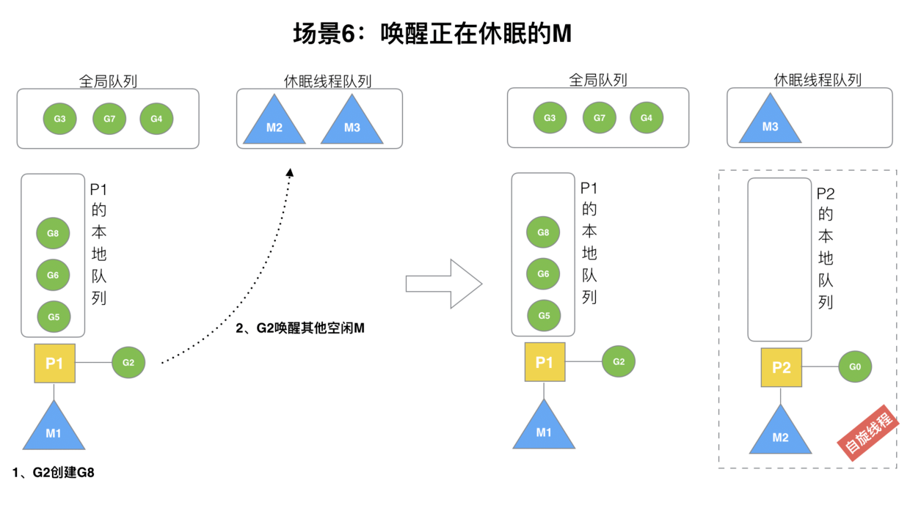

**关键机制**：创建G时会尝试唤醒空闲的M-P组合
**自旋线程**：没有G执行但保持运行状态，持续寻找可执行的G

### 场景7：从全局队列获取G

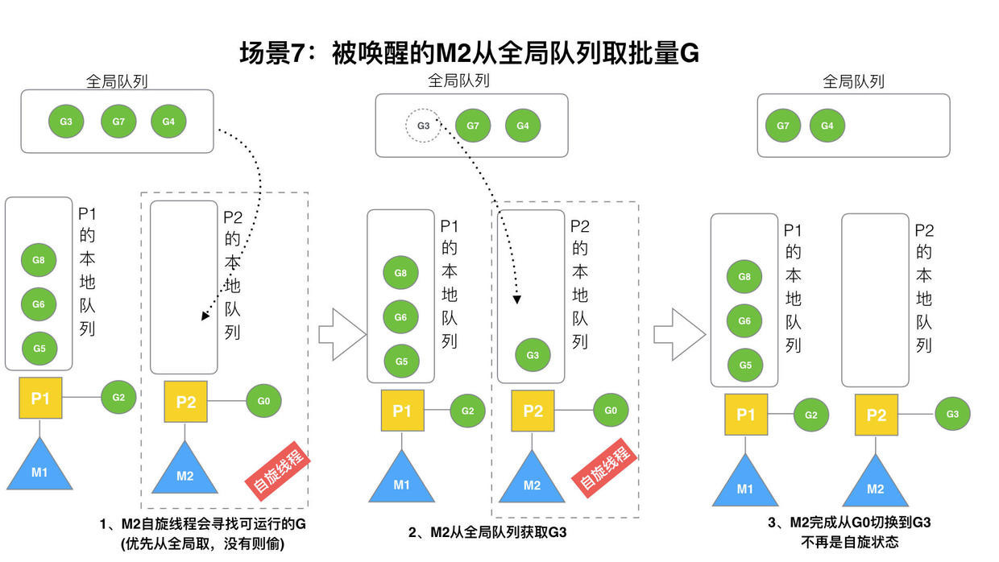

**负载均衡公式**：
```
n = min(len(GQ)/GOMAXPROCS + 1, len(GQ)/2)
```

**设计原则**：
- 至少获取1个G
- 不要一次性获取太多G，给其他P留机会
- 实现全局队列到本地队列的负载均衡

### 场景8：Work Stealing（工作窃取）

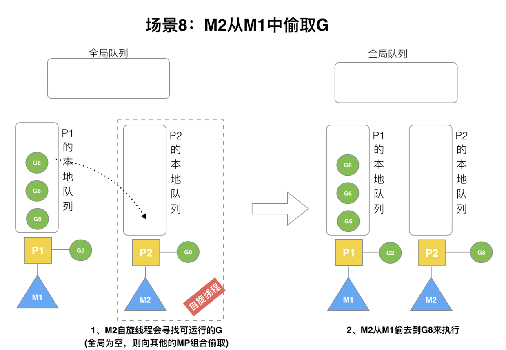

**触发条件**：本地队列为空且从全局队列也无法获取G时
**窃取策略**：从其他P的本地队列尾部窃取一半的G
**优势**：避免线程空闲，提高CPU利用率

### 场景9：多个M处于自旋状态

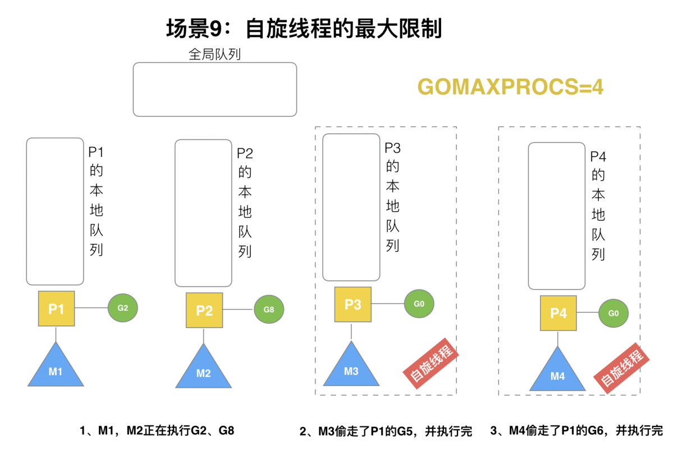

**自旋线程的意义**：
- **优点**：有新G时能立即执行，降低延迟
- **缺点**：消耗CPU资源
- **限制**：最多允许GOMAXPROCS个自旋线程

### 场景10：系统调用阻塞

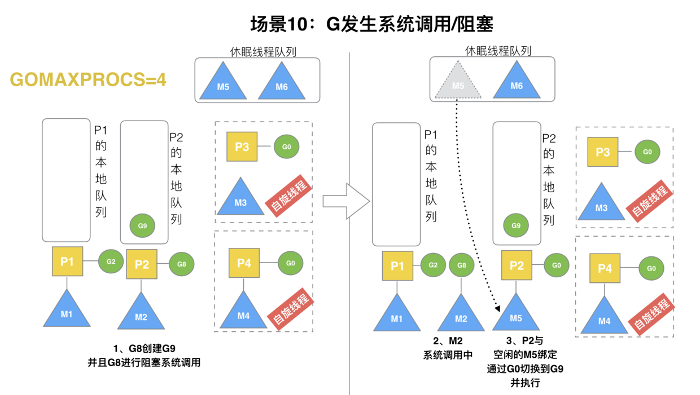

**阻塞系统调用处理**：
1. M2与P2立即解绑
2. P2寻找空闲的M（如M5）重新绑定
3. 保证P2中的其他G能继续执行
4. 实现了Hand Off机制

### 场景11：非阻塞系统调用

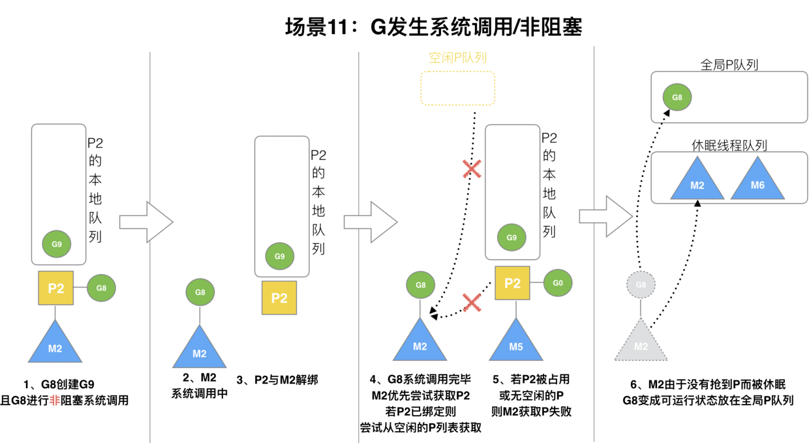

**非阻塞系统调用处理**：
1. M2记住P2，然后与P2解绑
2. 系统调用结束后，M2尝试重新获取P2
3. 如果P2被占用，尝试获取其他空闲P
4. 如果没有空闲P，G进入全局队列，M进入休眠

## 📝 面试重点总结

### 核心概念
- **G**：Goroutine，轻量级线程
- **M**：Machine，操作系统线程
- **P**：Processor，逻辑处理器，包含运行G所需的资源

### 关键机制
1. **Work Stealing**：从其他P窃取G
2. **Hand Off**：系统调用时P的移交
3. **负载均衡**：本地队列与全局队列间的G分配
4. **抢占式调度**：防止Goroutine长时间占用CPU

### 性能优化
- **局部性**：新G优先放入当前P的本地队列
- **批量操作**：从全局队列批量获取G
- **动态扩容**：根据需要动态创建M

### 面试高频问题

**Q1：解释GMP模型的核心组件**
**A1**：
- G代表Goroutine，是Go语言的轻量级线程
- M代表Machine，是操作系统线程  
- P代表Processor，是逻辑处理器，包含运行Goroutine所需的资源

**Q2：为什么需要P这个组件？**
**A2**：
- 解决旧调度器的全局锁竞争问题
- 提供本地队列，减少锁竞争
- 实现Work Stealing机制
- 支持更好的局部性

**Q3：什么是Work Stealing？**
**A3**：
当一个P的本地队列为空，且从全局队列也无法获取G时，对应的M会从其他P的本地队列尾部窃取一半的G来执行，这样避免了M的空闲，提高了CPU利用率。

**Q4：Go调度器查找可运行Goroutine的顺序是什么？**
**A4**：
1. 首先检查P的本地队列（无锁，最快）
2. 每61次调度检查一次全局队列（避免全局队列饥饿）
3. 检查网络轮询器(netpoll)是否有I/O就绪的G
4. 最后进行work stealing，从其他P偷取G

这个顺序既保证了性能（优先本地队列），又确保了公平性（定期检查全局队列）。

**Q5：Goroutine如何实现抢占？**
**A5**：
Go调度器通过在函数调用时检查抢占标志来实现协作式抢占，同时设置最大连续运行时间为10ms，防止某个Goroutine长时间占用CPU。

## 🎯 总结

Go语言的GMP调度器是一个精心设计的并发系统：

1. **历史演进**：从单进程到多线程，再到协程，最终发展为GMP模型
2. **核心思想**：通过M:N映射实现轻量级并发，用P作为资源容器减少锁竞争
3. **关键机制**：Work Stealing、Hand Off、负载均衡等保证高效调度
4. **性能优化**：局部性、批量操作、动态扩容等提升整体性能

**Go调度器的本质是把大量的Goroutine高效地分配到少量的线程上执行，充分利用多核并行能力，实现强大的并发性能。**

理解GMP模型不仅有助于写出高性能的Go代码，更能帮助我们深入理解并发编程的本质。

---

*参考资料：*
- [Go语言官方文档](https://golang.org/doc/)
- [Go调度器设计文档](https://docs.google.com/document/d/1TTj4T2JO42uD5ID9e89oa0sLKhJYD0Y_kqxDv3I3XMw)
- [Effective Go](https://golang.org/doc/effective_go.html)

> 💡 **学习建议**：建议结合实际代码和trace工具来加深理解，多写多练才能真正掌握Go并发编程的精髓。