# Golang map 实现原理


**提示**：本文已拆分为系列文章，建议阅读更新后的版本：
- [Go Map 基础概念与用法](/2025/06/16/八股文/Go语言/Map/Go-Map-基础概念与用法/)
- [Go Map 核心原理与数据结构](/2025/06/16/八股文/Go语言/Map/Go-Map-核心原理与数据结构/)
- [Go Map 构造与初始化流程](/2025/06/16/八股文/Go语言/Map/Go-Map-构造与初始化流程/)
- [Go Map 读写删除流程详解](/2025/06/16/八股文/Go语言/Map/Go-Map-读写删除流程详解/)
- [Go Map 扩容机制深度解析](/2025/06/16/八股文/Go语言/Map/Go-Map-扩容机制深度解析/)
- [Go Map 遍历机制解析](/2025/06/16/八股文/Go语言/Map/Go-Map-遍历机制解析/)
- [Go Map 面试题解析](/2025/06/16/八股文/Go语言/Map/Go-Map-面试题解析/)


# 0 前言

map 是一种如此经典的数据结构，各种语言中都对 map 着一套宏观流程相似、但技术细节百花齐放的实现方式.

古语有云，大道至简，但这更多体现在原理和使用层面，从另一个角度而言，在认知上越基础的东西反而往往有着越复杂的实现细节.

那么，诸位英雄好汉中又有哪几位有勇气随我一同深入 golang 的 map 源码，抱着【不通透不罢休】的态度，对其底层原理进行一探究竟呢？

# 1 基本用法

## 1.1 概述

map 又称字典，是一种常用的数据结构，核心特征包含下述三点：

（1）存储基于 key-value 对映射的模式；

（2）基于 key 维度实现存储数据的去重；

（3）读、写、删操作控制，时间复杂度 O(1).

## 1.2 初始化

### 1.2.1 几种初始化方法

golang 中，对 map 的初始化分为以下几种方式：

```go
myMap1 := make(map[int]int, 2)
```

通过 make 关键字进行初始化，同时指定 map 预分配的容量.

```go
myMap2 := make(map[int]int)
```

通过 make 关键字进行初始化，不显式声明容量，因此默认容量 为 0.

```go
myMap3 := map[int]int{
	1: 2,
	3: 4,
}
```

初始化操作连带赋值，一气呵成.

### 1.2.2 key 的类型要求

map 中，key 的数据类型必须为可比较的类型，chan、map、func 不可比较

## 1.3 读

读 map 分为下面两种方式：

```go
v1 := myMap[10]
```

第一种方式是直接读，倘若 key 存在，则获取到对应的 val，倘若 key 不存在或者 map 未初始化，会返回 val 类型的零值作为兜底.

```go
v2, ok := myMap[10]
```

第二种方式是读的同时添加一个 bool 类型的 flag 标识是否读取成功. 倘若 ok == false，说明读取失败， key 不存在，或者 map 未初始化.

此处同一种语法能够实现不同返回值类型的适配，是由于代码在汇编时，会根据返回参数类型的区别，映射到不同的实现方法.

## 1.4 写

```go
myMap[5] = 6
```

写操作的语法如上. 须注意的一点是，倘若 map 未初始化，直接执行写操作会导致 panic：

```go
const plainError string
panic(plainError("assignment to entry in nil map"))
```

## 1.5 删

```go
delete(myMap, 5)
```

执行 delete 方法时，倘若 key 存在，则会从 map 中将对应的 key-value 对删除；倘若 key 不存在或 map 未初始化，则方法直接结束，不会产生显式提示.

## 1.6 遍历

遍历分为下面两种方式：

```go
for k, v := range myMap {
	// ...
}
```

基于 k,v 依次承接 map 中的 key-value 对；

```go
for k := range myMap {
	// ...
}
```

基于 k 依次承接 map 中的 key，不关注 val 的取值.

需要注意的是，在执行 map 遍历操作时，获取的 key-value 对并没有一个固定的顺序，因此前后两次遍历顺序可能存在差异.

## 1.7 并发冲突

map 不是并发安全的数据结构，倘若存在并发读写行为，会抛出 fatal error.

具体规则是：

（1）并发读没有问题；

（2）并发读写中的“写”是广义上的，包含写入、更新、删除等操作；

（3）读的时候发现其他 goroutine 在并发写，抛出 fatal error；

（4）写的时候发现其他 goroutine 在并发写，抛出 fatal error.

```go
fatal("concurrent map read and map write")
fatal("concurrent map writes")
```

需要关注，此处并发读写会引发 fatal error，是一种比 panic 更严重的错误，无法使用 recover 操作捕获.

# 2 核心原理

map 又称为 hash map，在算法上基于 hash 实现 key 的映射和寻址；在数据结构上基于桶数组实现 key-value 对的存储.

以一组 key-value 对写入 map 的流程为例进行简述：

（1）通过哈希方法取得 key 的 hash 值；

（2）hash 值对桶数组长度取模，确定其所属的桶；

（3）在桶中插入 key-value 对.

hash 的性质，保证了相同的 key 必然产生相同的 hash 值，因此能映射到相同的桶中，通过桶内遍历的方式锁定对应的 key-value 对.

因此，只要在宏观流程上，控制每个桶中 key-value 对的数量，就能保证 map 的几项操作都限制为常数级别的时间复杂度.

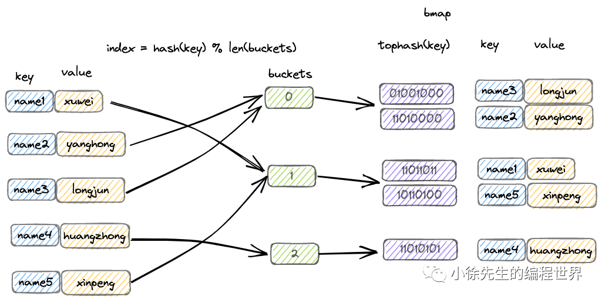

## 2.1 hash

hash 译作散列，是一种将任意长度的输入压缩到某一固定长度的输出摘要的过程，由于这种转换属于压缩映射，输入空间远大于输出空间，因此不同输入可能会映射成相同的输出结果. 此外，hash 在压缩过程中会存在部分信息的遗失，因此这种映射关系具有不可逆的特质.

（1）hash 的可重入性：相同的 key，必然产生相同的 hash 值；

（2）hash 的离散性：只要两个 key 不相同，不论其相似度的高低，产生的 hash 值会在整个输出域内均匀地离散化；

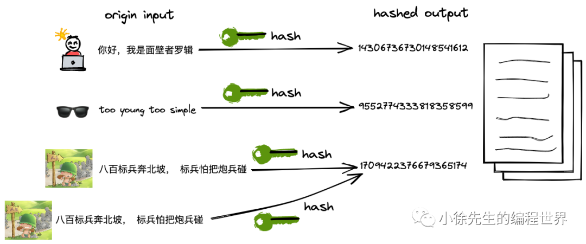

（3）hash 的单向性：企图通过 hash 值反向映射回 key 是无迹可寻的.


（4）hash 冲突：由于输入域（key）无穷大，输出域（hash 值）有限，因此必然存在不同 key 映射到相同 hash 值的情况，称之为 hash 冲突.

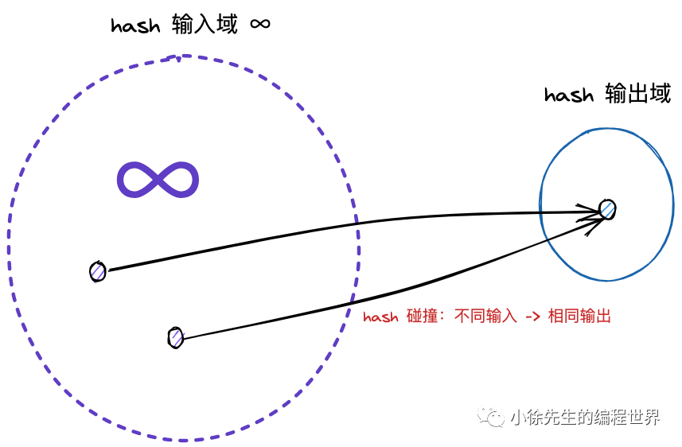

## 2.2 桶数组

map 中，会通过长度为 2 的整数次幂的桶数组进行 key-value 对的存储：

（1）每个桶固定可以存放 8 个 key-value 对；

（2）倘若超过 8 个 key-value 对打到桶数组的同一个索引当中，此时会通过创建桶链表的方式来化解这一问题.

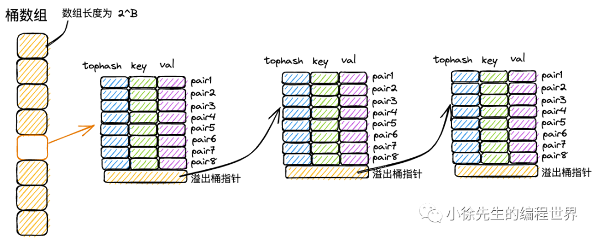

## 2.3 拉链法解决 hash 冲突

首先，由于 hash 冲突的存在，不同 key 可能存在相同的 hash 值；

再者，hash 值会对桶数组长度取模，因此不同 hash 值可能被打到同一个桶中.

综上，不同的 key-value 可能被映射到 map 的同一个桶当中.

此时最经典的解决手段分为两种：拉链法和开放寻址法.

（1）拉链法

拉链法中，将命中同一个桶的元素通过链表的形式进行链接，因此很便于动态扩展.

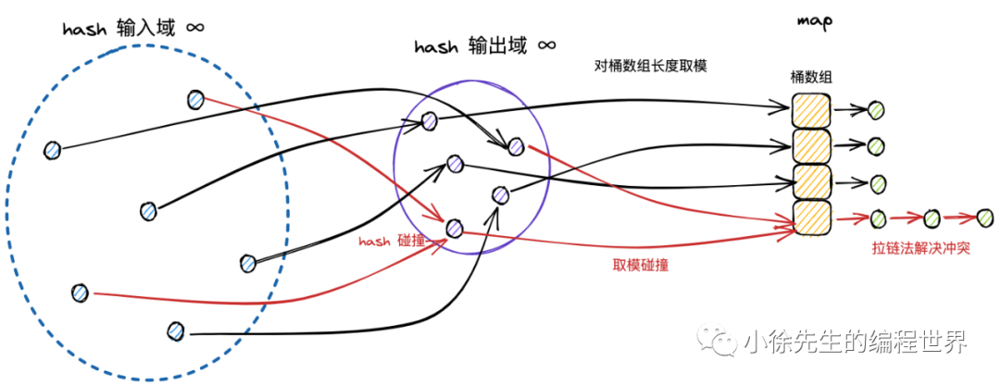

（2）开放寻址法

开放寻址法中，在插入新条目时，会基于一定的探测策略持续寻找，直到找到一个可用于存放数据的空位为止.

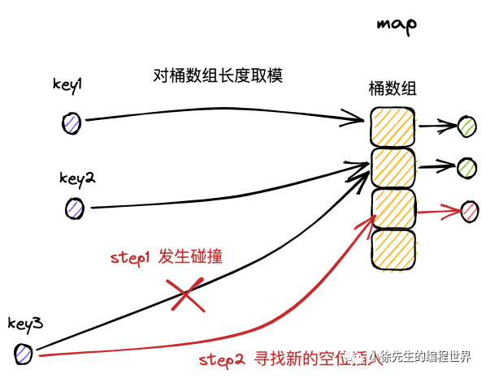

对标拉链还有开放寻址法，两者的优劣对比：

**方法\*\***优点\*\*拉链法简单常用；无需预先为元素分配内存.开放寻址法无需额外的指针用于链接元素；内存地址完全连续，可以基于局部性原理，充分利用 CPU 高速缓存.

在 map 解决 hash /分桶 冲突问题时，实际上结合了拉链法和开放寻址法两种思路. 以 map 的插入写流程为例，进行思路阐述：

（1）桶数组中的每个桶，严格意义上是一个单向桶链表，以桶为节点进行串联；

（2）每个桶固定可以存放 8 个 key-value 对；

（3）当 key 命中一个桶时，首先根据开放寻址法，在桶的 8 个位置中寻找空位进行插入；

（4）倘若桶的 8 个位置都已被占满，则基于桶的溢出桶指针，找到下一个桶，重复第（3）步；

（5）倘若遍历到链表尾部，仍未找到空位，则基于拉链法，在桶链表尾部续接新桶，并插入 key-value 对.

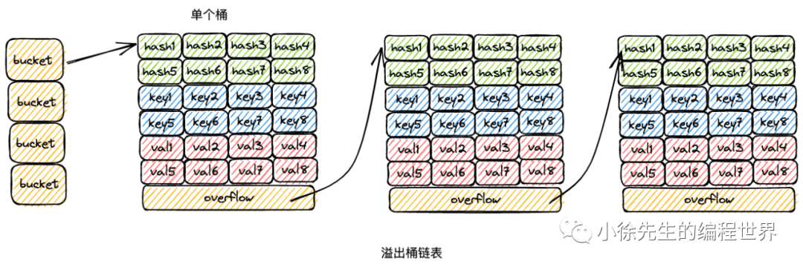

## 2.4 扩容优化性能

倘若 map 的桶数组长度固定不变，那么随着 key-value 对数量的增长，当一个桶下挂载的 key-value 达到一定的量级，此时操作的时间复杂度会趋于线性，无法满足诉求.

因此在实现上，map 桶数组的长度会随着 key-value 对数量的变化而实时调整，以保证每个桶内的 key-value 对数量始终控制在常量级别，满足各项操作为 O(1) 时间复杂度的要求.

map 扩容机制的核心点包括：

（1）扩容分为增量扩容和等量扩容；

（2）当桶内 key-value 总数/桶数组长度 > 6.5 时发生增量扩容，桶数组长度增长为原值的两倍；

（3）当桶内溢出桶数量大于等于 2^B 时( B 为桶数组长度的指数，B 最大取 15)，发生等量扩容，桶的长度保持为原值；

（4）采用渐进扩容的方式，当桶被实际操作到时，由使用者负责完成数据迁移，避免因为一次性的全量数据迁移引发性能抖动.

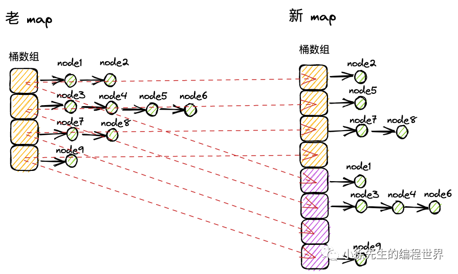

# 3 数据结构

## 3.1 hmap

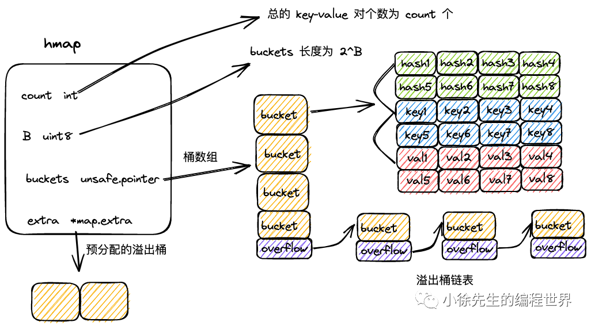

```go
type hmap struct {
	count      int
	flags      uint8
	B          uint8
	noverflow  uint16
	hash0      uint32
	buckets    unsafe.Pointer
	oldbuckets unsafe.Pointer
	nevacuate  uintptr
	extra      *mapextra
}
```

（1）count：map 中的 key-value 总数；

（2）flags：map 状态标识，可以标识出 map 是否被 goroutine 并发读写；

（3）B：桶数组长度的指数，桶数组长度为 2^B；

（4）noverflow：map 中溢出桶的数量；

（5）hash0：hash 随机因子，生成 key 的 hash 值时会使用到；

（6）buckets：桶数组；

（7）oldbuckets：扩容过程中老的桶数组；

（8）nevacuate：扩容时的进度标识，index 小于 nevacuate 的桶都已经由老桶转移到新桶中；

（9）extra：预申请的溢出桶.

## 3.2 mapextra

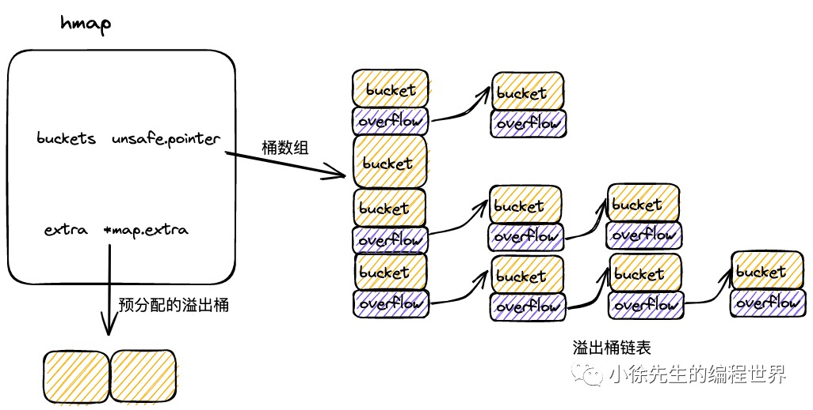

```go
type mapextra struct {
	overflow     *[]*bmap
	oldoverflow  *[]*bmap
	nextOverflow *bmap
}
```

在 map 初始化时，倘若容量过大，会提前申请好一批溢出桶，以供后续使用，这部分溢出桶存放在 hmap.mapextra 当中：

（1）mapextra.overflow：供桶数组 buckets 使用的溢出桶；

（2）mapextra.oldoverFlow: 扩容流程中，供老桶数组 oldBuckets 使用的溢出桶；

（3）mapextra.nextOverflow：下一个可用的溢出桶.

## 3.3 bmap

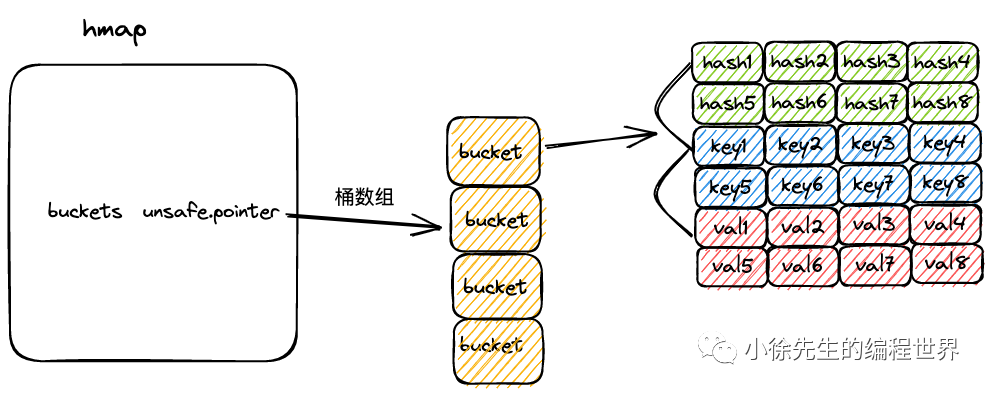

```go
const bucketCnt = 8

type bmap struct {
	tophash [bucketCnt]uint8
	// keys and values are not explicitly defined here but are part of the memory layout
	// overflow is also part of the memory layout, typically after keys and values
}
```

（1）bmap 就是 map 中的桶，可以存储 8 组 key-value 对的数据，以及一个指向下一个溢出桶的指针；

（2）每组 key-value 对数据包含 key 高 8 位 hash 值 tophash，key 和 val 三部分；

（3）在代码层面只展示了 tophash 部分，但由于 tophash、key 和 val 的数据长度固定，因此可以通过内存地址偏移的方式寻找到后续的 key 数组、val 数组以及溢出桶指针；

（4）为方便理解，把完整的 bmap 类声明代码补充如下：

```go
// Conceptual representation of a bmap with explicit fields
type bmap_conceptual struct {
	tophash  [bucketCnt]uint8
	keys     [bucketCnt]interface{} // Replace interface{} with actual key type
	values   [bucketCnt]interface{} // Replace interface{} with actual value type
	overflow uintptr                // Pointer to the next overflow bucket
}
```

#

# 4 构造方法

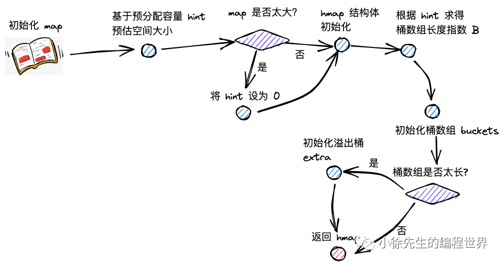

创建 map 时，实际上会调用 runtime/map.go 文件中的 makemap 方法，下面对源码展开分析：

## 4.1 makemap

方法主干源码一览：

```go
func makemap(t *maptype, hint int, h *hmap) *hmap {
	mem, overflow := math.MulUintptr(uintptr(hint), t.bucket.size)
	if overflow || mem > maxAlloc {
		hint = 0
	}

	if h == nil {
		h = new(hmap)
	}
	h.hash0 = fastrand()

	B := uint8(0)
	for overLoadFactor(hint, B) {
		B++
	}
	h.B = B

	if h.B != 0 {
		var nextOverflow *bmap
		h.buckets, nextOverflow = makeBucketArray(t, h.B, nil)
		if nextOverflow != nil {
			h.extra = new(mapextra)
			h.extra.nextOverflow = nextOverflow
		}
	}
	return h
}
```

（1）hint 为 map 拟分配的容量；在分配前，会提前对拟分配的内存大小进行判断，倘若超限，会将 hint 置为零；

```go
mem, overflow := math.MulUintptr(uintptr(hint), t.bucket.size)
if overflow || mem > maxAlloc {
	hint = 0
}
```

（2）通过 new 方法初始化 hmap；

```go
if h == nil {
	h = new(hmap)
}
```

（3）调用 fastrand，构造 hash 因子：hmap.hash0；

```go
h.hash0 = fastrand()
```

（4）大致上基于 log2(B) >= hint 的思路（具体见 4.2 小节 overLoadFactor 方法的介绍），计算桶数组的容量 B；

```go
B := uint8(0)
for overLoadFactor(hint, B) {
	B++
}
h.B = B
```

（5）调用 makeBucketArray 方法，初始化桶数组 hmap.buckets；

```go
var nextOverflow *bmap
h.buckets, nextOverflow = makeBucketArray(t, h.B, nil)
```

（6）倘若 map 容量较大，会提前申请一批溢出桶 hmap.extra.

```go
if nextOverflow != nil {
	h.extra = new(mapextra)
	h.extra.nextOverflow = nextOverflow
}
```

## 4.2 overLoadFactor

通过 overLoadFactor 方法，对 map 预分配容量和桶数组长度指数进行判断，决定是否仍需要增长 B 的数值：

```go
const loadFactorNum = 13
const loadFactorDen = 2
const goarch_PtrSize_example = 8 // Assuming this is a local constant for example purposes
// const bucketCnt = 8 // Already defined

func overLoadFactor(count int, B uint8) bool {
	return count > bucketCnt && uintptr(count) > loadFactorNum*(bucketShift(B)/loadFactorDen)
}

func bucketShift(b uint8) uintptr {
	// In a real scenario, goarch.PtrSize would be something like unsafe.Sizeof(uintptr(0)) or a runtime const
	return uintptr(1) << (b & (goarch_PtrSize_example*8 - 1))
}
```

（1）倘若 map 预分配容量小于等于 8，B 取 0，桶的个数为 1；

（2）保证 map 预分配容量小于等于桶数组长度 \* 6.5.

map 预分配容量、桶数组长度指数、桶数组长度之间的关系如下表：

**kv 对数量\*\***桶数组长度指数 B\***\*桶数组长度 2^B**0 ~ 8019 ~ 131214 ~ 262427 ~ 52382^(B-1) * 6.5+1 ~ 2^B*6.5B2^B

## 4.3 makeBucketArray

makeBucketArray 方法会进行桶数组的初始化，并根据桶的数量决定是否需要提前作溢出桶的初始化. 方法主干代码如下：

```go
func makeBucketArray(t *maptype, b uint8, dirtyalloc unsafe.Pointer) (buckets unsafe.Pointer, nextOverflow *bmap) {
	base := bucketShift(b)
	nbuckets := base

	if b >= 4 {
		nbuckets += bucketShift(b - 4)
	}

	buckets = newarray(t.bucket, int(nbuckets))
	if base != nbuckets {
		nextOverflow = (*bmap)(add(buckets, base*uintptr(t.bucketsize)))
		last := (*bmap)(add(buckets, (nbuckets-1)*uintptr(t.bucketsize)))
		last.setoverflow(t, (*bmap)(buckets))
	}
	return buckets, nextOverflow
}
```

makeBucketArray 会为 map 的桶数组申请内存，在桶数组的指数 b >= 4 时（桶数组的容量 >= 52 ），会需要提前创建溢出桶.

通过 base 记录桶数组的长度，不包含溢出桶；通过 nbuckets 记录累加上溢出桶后，桶数组的总长度.

```go
base := bucketShift(b)
nbuckets := base
if b >= 4 {
	nbuckets += bucketShift(b - 4)
}
```

调用 newarray 方法为桶数组申请内存空间，连带着需要初始化的溢出桶：

```go
buckets = newarray(t.bucket, int(nbuckets))
```

倘若 base != nbuckets，说明需要创建溢出桶，会基于地址偏移的方式，通过 nextOverflow 指向首个溢出桶的地址.

```go
if base != nbuckets {
	nextOverflow = (*bmap)(add(buckets, base*uintptr(t.bucketsize)))
	last := (*bmap)(add(buckets, (nbuckets-1)*uintptr(t.bucketsize)))
	last.setoverflow(t, (*bmap)(buckets))
}
return buckets, nextOverflow
```

倘若需要创建溢出桶，会在将最后一个溢出桶的 overflow 指针指向 buckets 数组，以此来标识申请的溢出桶已经用完.

```go
func (b *bmap) setoverflow(t *maptype, ovf *bmap) {
	*(**bmap)(add(unsafe.Pointer(b), uintptr(t.bucketsize)-goarch_PtrSize_example)) = ovf // Used example const
}
```

# 5 读流程

## 5.1 读流程梳理

map 读流程主要分为以下几步：

（1）根据 key 取 hash 值；

（2）根据 hash 值对桶数组取模，确定所在的桶；

（3）沿着桶链表依次遍历各个桶内的 key-value 对；

（4）命中相同的 key，则返回 value；倘若 key 不存在，则返回零值.

map 读操作最终会走进 runtime/map.go 的 mapaccess 方法中，下面开始阅读源码：

## 5.2 mapaccess 方法源码走读

```go
func mapaccess1(t *maptype, h *hmap, key unsafe.Pointer) unsafe.Pointer {
	if h == nil || h.count == 0 {
		return unsafe.Pointer(&zeroVal[0])
	}
	if h.flags&hashWriting != 0 {
		fatal("concurrent map read and map write")
	}

	hash := t.hasher(key, uintptr(h.hash0))
	m := bucketMask(h.B)
	b := (*bmap)(add(h.buckets, (hash&m)*uintptr(t.bucketsize)))
	if c := h.oldbuckets; c != nil {
		if !h.sameSizeGrow() {
			m >>= 1
		}
		oldb := (*bmap)(add(c, (hash&m)*uintptr(t.bucketsize)))
		if !evacuated(oldb) {
			b = oldb
		}
	}

	top := tophash(hash)
bucketloop:
	for ; b != nil; b = b.overflow(t) {
		for i := uintptr(0); i < bucketCnt; i++ {
			if b.tophash[i] != top {
				if b.tophash[i] == emptyRest {
					break bucketloop
				}
				continue
			}
			k := add(unsafe.Pointer(b), dataOffset+i*uintptr(t.keysize))
			if t.indirectkey() {
				k = *((*unsafe.Pointer)(k))
			}
			if t.key.equal(key, k) {
				e := add(unsafe.Pointer(b), dataOffset+bucketCnt*uintptr(t.keysize)+i*uintptr(t.elemsize))
				if t.indirectelem() {
					e = *((*unsafe.Pointer)(e))
				}
				return e
			}
		}
	}
	return unsafe.Pointer(&zeroVal[0])
}

// Helper function, assuming it's part of the hmap methods or a related package
func (h *hmap) sameSizeGrow() bool {
	return h.flags&sameSizeGrow != 0
}

// Helper function, assuming it's defined elsewhere
func evacuated(b *bmap) bool {
	h := b.tophash[0]
	return h > emptyOne && h < minTopHash
}
```

（1）倘若 map 未初始化，或此时存在 key-value 对数量为 0，直接返回零值；

```go
if h == nil || h.count == 0 {
	return unsafe.Pointer(&zeroVal[0])
}
```

（2）倘若发现存在其他 goroutine 在写 map，直接抛出并发读写的 fatal error；其中，并发写标记，位于 hmap.flags 的第 3 个 bit 位；

```go
const hashWriting = 4 // Example value, actual value might be different

if h.flags&hashWriting != 0 {
	fatal("concurrent map read and map write")
}
```

（3）通过 maptype.hasher() 方法计算得到 key 的 hash 值，并对桶数组长度取模，取得对应的桶. 关于 hash 方法的内部实现，golang 并未暴露.

```go
hash := t.hasher(key, uintptr(h.hash0))
m := bucketMask(h.B)
b := (*bmap)(add(h.buckets, (hash&m)*uintptr(t.bucketsize)))
```

其中，bucketMast 方法会根据 B 求得桶数组长度 - 1 的值，用于后续的 & 运算，实现取模的效果：

```go
func bucketMask(b uint8) uintptr {
	return bucketShift(b) - 1
}
```

（4）在取桶时，会关注当前 map 是否处于扩容的流程，倘若是的话，需要在老的桶数组 oldBuckets 中取桶，通过 evacuated 方法判断桶数据是已迁到新桶还是仍存留在老桶，倘若仍在老桶，需要取老桶进行遍历.

```go
if c := h.oldbuckets; c != nil {
	if !h.sameSizeGrow() { // Assuming sameSizeGrow is a method of hmap
		m >>= 1
	}
	oldb := (*bmap)(add(c, (hash&m)*uintptr(t.bucketsize)))
	if !evacuated(oldb) { // Assuming evacuated is a helper function
		b = oldb
	}
}
```

在取老桶前，会先判断 map 的扩容流程是否是增量扩容，倘若是的话，说明老桶数组的长度是新桶数组的一半，需要将桶长度值 m 除以 2.

```go
const (
	sameSizeGrow_flag = 8 // Example flag value
)

func (h *hmap) sameSizeGrow() bool { // This is a method of hmap
	return h.flags&sameSizeGrow_flag != 0
}
```

取老桶时，会调用 evacuated 方法判断数据是否已经迁移到新桶. 判断的方式是，取桶中首个 tophash 值，倘若该值为 2,3,4 中的一个，都代表数据已经完成迁移.

```go
const emptyOne = 1
const evacuatedX_example = 2     // Renamed to avoid conflict
const evacuatedY_example = 3     // Renamed to avoid conflict
const evacuatedEmpty_example = 4 // Renamed to avoid conflict
const minTopHash_example = 5     // Renamed to avoid conflict

func evacuated(b *bmap) bool { // This is a helper function
	h := b.tophash[0]
	return h > emptyOne && h < minTopHash_example
}
```

（5）取 key hash 值的高 8 位值 top. 倘若该值 < 5，会累加 5，以避开 0 ~ 4 的取值. 因为这几个值会用于枚举，具有一些特殊的含义.

```go
const minTopHash = 5 // Already defined or use minTopHash_example

top := tophash(hash) // This line is part of the mapaccess1 logic, not a global

func tophash(hash uintptr) uint8 {
	// Assuming goarch_PtrSize_example is defined for example purposes
	top := uint8(hash >> (goarch_PtrSize_example*8 - 8))
	if top < minTopHash_example { // Use the renamed constant
		top += minTopHash_example
	}
	return top
}
```

（6）开启两层 for 循环进行遍历流程，外层基于桶链表，依次遍历首个桶和后续的每个溢出桶，内层依次遍历一个桶内的 key-value 对：

```go
// bucketloop is a label within mapaccess1
for ; b != nil; b = b.overflow(t) { // This is part of mapaccess1
	for i := uintptr(0); i < bucketCnt; i++ {
		if b.tophash[i] != top {
			if b.tophash[i] == emptyRest {
				break bucketloop
			}
			continue
		}
		k := add(unsafe.Pointer(b), dataOffset+i*uintptr(t.keysize))
		if t.indirectkey() {
			k = *((*unsafe.Pointer)(k))
		}
		if t.key.equal(key, k) {
			e := add(unsafe.Pointer(b), dataOffset+bucketCnt*uintptr(t.keysize)+i*uintptr(t.elemsize))
			if t.indirectelem() {
				e = *((*unsafe.Pointer)(e))
			}
			return e
		}
	}
}
return unsafe.Pointer(&zeroVal[0])
```

内存遍历时，首先查询高 8 位的 tophash 值，看是否和 key 的 top 值匹配.

倘若不匹配且当前位置 tophash 值为 0，说明桶的后续位置都未放入过元素，当前 key 在 map 中不存在，可以直接打破循环，返回零值.

```go
const emptyRest = 0

if b.tophash[i] != top { // This is part of mapaccess1 logic
	if b.tophash[i] == emptyRest {
		break bucketloop
	}
	continue
}
```

倘若找到了相等的 key，则通过地址偏移的方式取到 value 并返回.

其中 dataOffset 为一个桶中 tophash 数组所占用的空间大小.

```go
if t.key.equal(key, k) { // This is part of mapaccess1 logic
	e := add(unsafe.Pointer(b), dataOffset+bucketCnt*uintptr(t.keysize)+i*uintptr(t.elemsize))
	return e
}
```

倘若遍历完成，仍未找到匹配的目标，返回零值兜底.

# 6 写流程

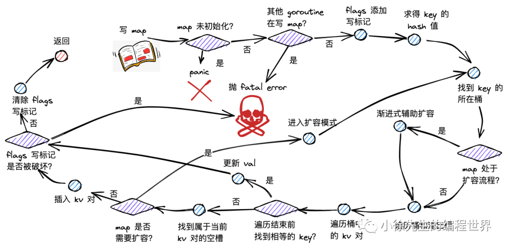

## 6.1 写流程梳理

map 写流程主要分为以下几步：

（1）根据 key 取 hash 值；

（2）根据 hash 值对桶数组取模，确定所在的桶；

（3）倘若 map 处于扩容，则迁移命中的桶，帮助推进渐进式扩容；

（4）沿着桶链表依次遍历各个桶内的 key-value 对；

（5）倘若命中相同的 key，则对 value 中进行更新；

（6）倘若 key 不存在，则插入 key-value 对；

（7）倘若发现 map 达成扩容条件，则会开启扩容模式，并重新返回第（2）步.

map 写操作最终会走进 runtime/map.go 的 mapassign 方法中，下面开始阅读源码：

## 6.2 mapassign

```go
func mapassign(t *maptype, h *hmap, key unsafe.Pointer) unsafe.Pointer {
	if h == nil {
		panic("assignment to entry in nil map") // Corrected panic call
	}
	if h.flags&hashWriting != 0 {
		fatal("concurrent map writes")
	}

	hash := t.hasher(key, uintptr(h.hash0))
	h.flags ^= hashWriting

	if h.buckets == nil {
		h.buckets = newobject(t.bucket)
	}

agoin: // Corrected label name
	bucket := hash & bucketMask(h.B)
	if h.growing() {
		growWork(t, h, bucket)
	}
	b := (*bmap)(add(h.buckets, bucket*uintptr(t.bucketsize)))
	top := tophash(hash)

	var inserti *uint8
	var insertk unsafe.Pointer
	var elem unsafe.Pointer

bucketloop:
	for {
		for i := uintptr(0); i < bucketCnt; i++ {
			if b.tophash[i] != top {
				if isEmpty(b.tophash[i]) && inserti == nil {
					inserti = &b.tophash[i]
					insertk = add(unsafe.Pointer(b), dataOffset+i*uintptr(t.keysize))
					elem = add(unsafe.Pointer(b), dataOffset+bucketCnt*uintptr(t.keysize)+i*uintptr(t.elemsize))
				}
				if b.tophash[i] == emptyRest {
					break bucketloop
				}
				continue
			}
			k := add(unsafe.Pointer(b), dataOffset+i*uintptr(t.keysize))
			if t.indirectkey() {
				k = *((*unsafe.Pointer)(k))
			}
			if !t.key.equal(key, k) {
				continue
			}
			if t.needkeyupdate() {
				typedmemmove(t.key, k, key)
			}
			elem = add(unsafe.Pointer(b), dataOffset+bucketCnt*uintptr(t.keysize)+i*uintptr(t.elemsize))
			goto done
		}
		ovf := b.overflow(t)
		if ovf == nil {
			break
		}
		b = ovf
	}
	if !h.growing() && (overLoadFactor(h.count+1, h.B) || tooManyOverflowBuckets(h.noverflow, h.B)) {
		hashGrow(t, h)
		goto agoin // Corrected label name
	}

	if inserti == nil {
		newb := h.newoverflow(t, b)
		inserti = &newb.tophash[0]
		insertk = add(unsafe.Pointer(newb), dataOffset)
		elem = add(insertk, bucketCnt*uintptr(t.keysize))
	}

	if t.indirectkey() {
		kmem := newobject(t.key)
		*(*unsafe.Pointer)(insertk) = kmem
		insertk = kmem
	}
	if t.indirectelem() {
		vmem := newobject(t.elem)
		*(*unsafe.Pointer)(elem) = vmem
		// If elem was indirect, it should now point to vmem for assignment
		// elem = vmem // This line might be needed depending on how elem is used later for assignment
	}
	typedmemmove(t.key, insertk, key)
	*inserti = top
	h.count++

done:
	if h.flags&hashWriting == 0 {
		fatal("concurrent map writes")
	}
	h.flags &^= hashWriting
	if t.indirectelem() {
		elem = *((*unsafe.Pointer)(elem))
	}
	return elem
}
```

（1）写操作时，倘若 map 未初始化，直接 panic；

```go
if h == nil {
	panic("assignment to entry in nil map") // Corrected panic call
}
```

（2）倘若其他 goroutine 在进行写或删操作，抛出并发写 fatal error；

```go
if h.flags&hashWriting != 0 {
	fatal("concurrent map writes")
}
```

（3）通过 maptype.hasher() 方法求得 key 对应的 hash 值；

```go
hash := t.hasher(key, uintptr(h.hash0))
```

（4）通过异或位运算，将 map.flags 的第 3 个 bit 位置为 1，添加写标记；

```go
h.flags ^= hashWriting
```

（5）倘若 map 的桶数组 buckets 未空，则对其进行初始化；

```go
if h.buckets == nil {
	h.buckets = newobject(t.bucket)
}
```

（6）找到当前 key 对应的桶索引 bucket；

```go
bucket := hash & bucketMask(h.B)
```

（7）倘若发现当前 map 正处于扩容过程，则帮助其渐进扩容，具体内容在第 9 节中再作展开；

```go
if h.growing() {
	growWork(t, h, bucket)
}
```

（8）从 map 的桶数组 buckets 出发，结合桶索引和桶容量大小，进行地址偏移，获得对应桶 b；

```go
b := (*bmap)(add(h.buckets, bucket*uintptr(t.bucketsize)))
```

（9）取得 key 对应的桶的高 8 位 tophash：

```go
top := tophash(hash)
```

（10）提前声明好的三个指针，用于指向存放 key-value 的空槽:

inserti：tophash 拟插入位置；

insertk：key 拟插入位置 ；

elem：val 拟插入位置；

```go
var inserti *uint8
var insertk unsafe.Pointer
var elem unsafe.Pointer
```

（11）开启两层 for 循环，外层沿着桶链表依次遍历，内层依次遍历桶内的 key-value 对：

```go
// bucketloop is a label within mapassign
for {
	for i := uintptr(0); i < bucketCnt; i++ {
		if b.tophash[i] != top {
			if isEmpty(b.tophash[i]) && inserti == nil {
				inserti = &b.tophash[i]
				insertk = add(unsafe.Pointer(b), dataOffset+i*uintptr(t.keysize))
				elem = add(unsafe.Pointer(b), dataOffset+bucketCnt*uintptr(t.keysize)+i*uintptr(t.elemsize))
			}
			if b.tophash[i] == emptyRest {
				break bucketloop
			}
			continue
		}
		k := add(unsafe.Pointer(b), dataOffset+i*uintptr(t.keysize))
		if t.indirectkey() {
			k = *((*unsafe.Pointer)(k))
		}
		if !t.key.equal(key, k) {
			continue
		}
		if t.needkeyupdate() {
			typedmemmove(t.key, k, key)
		}
		elem = add(unsafe.Pointer(b), dataOffset+bucketCnt*uintptr(t.keysize)+i*uintptr(t.elemsize))
		goto done
	}
	ovf := b.overflow(t)
	if ovf == nil {
		break
	}
	b = ovf
}
if !h.growing() && (overLoadFactor(h.count+1, h.B) || tooManyOverflowBuckets(h.noverflow, h.B)) {
	hashGrow(t, h)
	goto agoin
}

if inserti == nil {
	newb := h.newoverflow(t, b)
	inserti = &newb.tophash[0]
	insertk = add(unsafe.Pointer(newb), dataOffset)
	elem = add(insertk, bucketCnt*uintptr(t.keysize))
}

if t.indirectkey() {
	kmem := newobject(t.key)
	*(*unsafe.Pointer)(insertk) = kmem
	insertk = kmem
}
if t.indirectelem() {
	vmem := newobject(t.elem)
	*(*unsafe.Pointer)(elem) = vmem
	// If elem was indirect, it should now point to vmem for assignment
	// elem = vmem // This line might be needed depending on how elem is used later for assignment
}
typedmemmove(t.key, insertk, key)
*inserti = top
h.count++

done:
if h.flags&hashWriting == 0 {
	fatal("concurrent map writes")
}
h.flags &^= hashWriting
if t.indirectelem() {
	elem = *((*unsafe.Pointer)(elem))
}
return elem
```

# 7 删流程

## 7.1 删除 kv 对流程梳理

map 删楚 kv 对流程主要分为以下几步：

（1）根据 key 取 hash 值；

（2）根据 hash 值对桶数组取模，确定所在的桶；

（3）倘若 map 处于扩容，则迁移命中的桶，帮助推进渐进式扩容；

（4）沿着桶链表依次遍历各个桶内的 key-value 对；

（5）倘若命中相同的 key，删除对应的 key-value 对；并将当前位置的 tophash 置为 emptyOne，表示为空；

（6）倘若当前位置为末位，或者下一个位置的 tophash 为 emptyRest，则沿当前位置向前遍历，将毗邻的 emptyOne 统一更新为 emptyRest.

map 删操作最终会走进 runtime/map.go 的 mapdelete 方法中，下面开始阅读源码：

## 7.2 mapdelete

```go
func mapdelete(t *maptype, h *hmap, key unsafe.Pointer) {
	if h == nil || h.count == 0 {
		return
	}
	if h.flags&hashWriting != 0 {
		fatal("concurrent map writes")
	}

	hash := t.hasher(key, uintptr(h.hash0))
	h.flags ^= hashWriting

	bucket := hash & bucketMask(h.B)
	if h.growing() {
		growWork(t, h, bucket)
	}
	b := (*bmap)(add(h.buckets, bucket*uintptr(t.bucketsize)))
	bOrig := b
	top := tophash(hash)

search:
	for ; b != nil; b = b.overflow(t) {
		for i := uintptr(0); i < bucketCnt; i++ {
			if b.tophash[i] != top {
				if b.tophash[i] == emptyRest {
					break search
				}
				continue
			}
			k := add(unsafe.Pointer(b), dataOffset+i*uintptr(t.keysize))
			k2 := k
			if t.indirectkey() {
				k2 = *((*unsafe.Pointer)(k2))
			}
			if !t.key.equal(key, k2) {
				continue
			}
			// Only clear key if there are pointers in it.
			if t.indirectkey() {
				*(*unsafe.Pointer)(k) = nil
			} else if t.key.ptrdata != 0 {
				memclrHasPointers(k, t.key.size)
			}
			e := add(unsafe.Pointer(b), dataOffset+bucketCnt*uintptr(t.keysize)+i*uintptr(t.elemsize))
			if t.indirectelem() {
				*(*unsafe.Pointer)(e) = nil
			} else if t.elem.ptrdata != 0 {
				memclrHasPointers(e, t.elem.size)
			} else {
				memclrNoHeapPointers(e, t.elem.size)
			}
			b.tophash[i] = emptyOne
			if i == bucketCnt-1 {
				if b.overflow(t) != nil && b.overflow(t).tophash[0] != emptyRest {
					goto notLast
				}
			} else {
				if b.tophash[i+1] != emptyRest {
					goto notLast
				}
			}
			for {
				b.tophash[i] = emptyRest
				if i == 0 {
					if b == bOrig {
						break
					}
					c := b
					for b = bOrig; b.overflow(t) != c; b = b.overflow(t) {
					}
					i = bucketCnt - 1
				} else {
					i--
				}
				if b.tophash[i] != emptyOne {
					break
				}
			}
		notLast:
			h.count--
			if h.count == 0 {
				h.hash0 = fastrand()
			}
			break search
		}
	}
	if h.flags&hashWriting == 0 {
		fatal("concurrent map writes")
	}
	h.flags &^= hashWriting
}
```

# 8 遍历流程

## 8.1 迭代器数据结构

```go
type hiter struct {
	key         unsafe.Pointer
	elem        unsafe.Pointer
	t           *maptype
	h           *hmap
	buckets     unsafe.Pointer
	bptr        *bmap
	overflow    *[]*bmap // Slice of pointers to bmap
	oldoverflow *[]*bmap // Slice of pointers to bmap
	startBucket uintptr
	offset      uint8
	wrapped     bool
	B           uint8
	i           uint8
	bucket      uintptr
	checkBucket uintptr
}
```

hiter 是遍历 map 时用于存放临时数据的迭代器：

（1）key：指向遍历得到 key 的指针；

（2）value：指向遍历得到 value 的指针；

（3）t：map 类型，包含了 key、value 类型大小等信息；

（4）h：map 的指针；

（5）buckets：map 的桶数组；

（6）bptr：当前遍历到的桶；

（7）overflow：新老桶数组对应的溢出桶；

（8）startBucket：遍历起始位置的桶索引；

（9）offset：遍历起始位置的 key-value 对索引号；

（10）wrapped：遍历是否穿越桶数组尾端回到头部了；

（11）B：桶数组的长度指数；

（12）i：当前遍历到的 key-value 对在桶中的索引；

（13）bucket：当前遍历到的桶；

（14）checkBucket：因为扩容流程的存在，需要额外检查的桶.

## 8.2 mapiterinit

map 遍历流程开始时，首先会走进 runtime/map.go 的 mapiterinit() 方法当中，此时会对创建 map 迭代器 hiter，并且通过取随机数的方式，决定遍历的起始桶号，以及起始 key-value 对索引号.

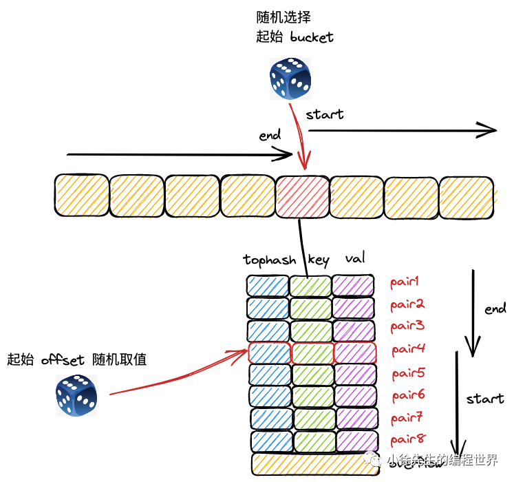

```go
func mapiterinit(t *maptype, h *hmap, it *hiter) {
	it.t = t
	if h == nil || h.count == 0 {
		return
	}

	it.h = h
	it.B = h.B
	it.buckets = h.buckets
	if t.bucket.ptrdata == 0 { // Check if bucket contains pointers
		h.createOverflow()       // Ensure overflow structures are created if needed
		it.overflow = h.extra.overflow
		it.oldoverflow = h.extra.oldoverflow
	}
	// decide where to start
	var r uintptr
	r = uintptr(fastrand()) // Get a random number

	it.startBucket = r & bucketMask(h.B)          // Determine start bucket
	it.offset = uint8(r >> h.B & (bucketCnt - 1)) // Determine start offset within bucket

	// iterator state
	it.bucket = it.startBucket

	// Remember we have an iterator.
	// Can run concurrently with another mapiterinit().
	if old := h.flags; old&(iterator|oldIterator) != iterator|oldIterator {
		atomic.Or8(&h.flags, iterator|oldIterator)
	}

	mapiternext(it) // Pass the iterator to mapiternext
}
```

（1）通过取随机数的方式，决定遍历时的起始桶，以及桶中起始 key-value 对的位置：

```go
var r uintptr
r = uintptr(fastrand())
it.startBucket = r & bucketMask(h.B)
it.offset = uint8(r >> h.B & (bucketCnt - 1))
```

（2）完成迭代器 hiter 中各项参数的初始化后，不如 mapiternext 方法开启遍历.

## 8.3 mapiternext

```go
func mapiternext(it *hiter) {
	h := it.h
	if h.flags&hashWriting != 0 {
		fatal("concurrent map iteration and map write")
	}
	t := it.t
	bucket := it.bucket
	b := it.bptr
	i := it.i
	checkBucket := it.checkBucket

next:
	if b == nil {
		if bucket == it.startBucket && it.wrapped {
			// Iteration is complete
			it.key = nil
			it.elem = nil
			return
		}
		if h.growing() && it.B == h.B {
			// Iterator was started in the middle of a grow, and the grow isn't done yet.
			// If the bucket we're looking at hasn't been filled in yet (i.e. the old
			// bucket hasn't been evacuated) then we need to iterate through the old
			// bucket and only return the ones that will end up in this new bucket.
			oldbucket := bucket & it.h.oldbucketmask()
			b = (*bmap)(add(h.oldbuckets, oldbucket*uintptr(t.bucketsize)))
			if !evacuated(b) {
				// Use a special checkBucket value to indicate that we're
				// iterating an old bucket that has not yet been evacuated.
				checkBucket = bucket
			} else {
				b = (*bmap)(add(it.buckets, bucket*uintptr(t.bucketsize)))
				checkBucket = noCheck // noCheck is a constant indicating no special check needed
			}
		} else {
			// Either not growing or grow is done.
			b = (*bmap)(add(it.buckets, bucket*uintptr(t.bucketsize)))
			checkBucket = noCheck
		}
		bucket++
		if bucket == bucketShift(it.B) {
			bucket = 0
			it.wrapped = true
		}
		i = 0
	}
	for ; i < bucketCnt; i++ {
		offi := (i + it.offset) & (bucketCnt - 1) // Apply random offset
		if isEmpty(b.tophash[offi]) || b.tophash[offi] == evacuatedEmpty_example { // Use renamed const
			// TODO: Before this continue, make sure there are no overflow buckets.
			continue
		}
		k := add(unsafe.Pointer(b), dataOffset+uintptr(offi)*uintptr(t.keysize))
		if t.indirectkey() {
			k = *((*unsafe.Pointer)(k))
		}
		e := add(unsafe.Pointer(b), dataOffset+bucketCnt*uintptr(t.keysize)+uintptr(offi)*uintptr(t.elemsize))

		if checkBucket != noCheck && !h.sameSizeGrow() {
			// Special case: iterating an old bucket during a grow.
			// Perform the check to see if the key will end up in this bucket.
			// This requires re-hashing the key and checking the high bit.
			// For simplicity, this detail is often abstracted in explanations.
			// Actual check:
			// if checkBucket>>(it.B-1) != uintptr(b.tophash[offi]&1) { // Simplified check
			//    continue
			// }
			// A more accurate check would involve re-hashing the key:
			hash := t.hasher(k, uintptr(h.hash0))
			if (hash>>it.h.B)&1 != (checkBucket>>it.h.B)&1 { // Check if it moves to the other half
				continue
			}
		}

		if (b.tophash[offi] != evacuatedX_example && b.tophash[offi] != evacuatedY_example) || // Use renamed const
			!(t.reflexivekey() || t.key.equal(k, k)) { // Check for NaN keys if reflexive
			// This is a valid key/elem
			it.key = k
			if t.indirectelem() {
				e = *((*unsafe.Pointer)(e))
			}
			it.elem = e
		} else {
			// The cell is an evacuated X or Y value.
			// Look up the current value of the key in the new table.
			// This ensures that if a key was deleted and re-inserted,
			// we get the most recent value.
			rk, re := mapaccessK(t, h, k) // mapaccessK is a variant of mapaccess1 that returns key pointer
			if rk == nil {
				continue // Key has been deleted.
			}
			it.key = rk
			it.elem = re
		}
		it.bucket = bucket
		if it.bptr != b { // Avoid unnecessary write barrier; see issue 14921
			it.bptr = b
		}
		it.i = i + 1
		it.checkBucket = checkBucket
		return
	}
	b = b.overflow(t)
	i = 0
	goto next
}
```

（1）遍历时发现其他 goroutine 在并发写，直接抛出 fatal error：

```go
if h.flags&hashWriting != 0 {
	fatal("concurrent map iteration and map write")
}
```

（2）开启最外圈的循环，依次遍历桶数组中的每个桶链表，通过 next 和 goto next 关键字实现循环代码块；

```go
next:
	if b == nil {
		if bucket == it.startBucket && it.wrapped {
			// Iteration is complete
			it.key = nil
			it.elem = nil
			return
		}
		if h.growing() && it.B == h.B {
			// Iterator was started in the middle of a grow, and the grow isn't done yet.
			// If the bucket we're looking at hasn't been filled in yet (i.e. the old
			// bucket hasn't been evacuated) then we need to iterate through the old
			// bucket and only return the ones that will end up in this new bucket.
			oldbucket := bucket & it.h.oldbucketmask()
			b = (*bmap)(add(h.oldbuckets, oldbucket*uintptr(t.bucketsize)))
			if !evacuated(b) {
				// Use a special checkBucket value to indicate that we're
				// iterating an old bucket that has not yet been evacuated.
				checkBucket = bucket
			} else {
				b = (*bmap)(add(it.buckets, bucket*uintptr(t.bucketsize)))
				checkBucket = noCheck // noCheck is a constant indicating no special check needed
			}
		} else {
			// Either not growing or grow is done.
			b = (*bmap)(add(it.buckets, bucket*uintptr(t.bucketsize)))
			checkBucket = noCheck
		}
		bucket++
		if bucket == bucketShift(it.B) {
			bucket = 0
			it.wrapped = true
		}
		i = 0
	}
	for ; i < bucketCnt; i++ {
		offi := (i + it.offset) & (bucketCnt - 1) // Apply random offset
		if isEmpty(b.tophash[offi]) || b.tophash[offi] == evacuatedEmpty_example { // Use renamed const
			// TODO: Before this continue, make sure there are no overflow buckets.
			continue
		}
		k := add(unsafe.Pointer(b), dataOffset+uintptr(offi)*uintptr(t.keysize))
		if t.indirectkey() {
			k = *((*unsafe.Pointer)(k))
		}
		e := add(unsafe.Pointer(b), dataOffset+bucketCnt*uintptr(t.keysize)+uintptr(offi)*uintptr(t.elemsize))

		if checkBucket != noCheck && !h.sameSizeGrow() {
			// Special case: iterating an old bucket during a grow.
			// Perform the check to see if the key will end up in this bucket.
			// This requires re-hashing the key and checking the high bit.
			// For simplicity, this detail is often abstracted in explanations.
			// Actual check:
			// if checkBucket>>(it.B-1) != uintptr(b.tophash[offi]&1) { // Simplified check
			//    continue
			// }
			// A more accurate check would involve re-hashing the key:
			hash := t.hasher(k, uintptr(h.hash0))
			if (hash>>it.h.B)&1 != (checkBucket>>it.h.B)&1 { // Check if it moves to the other half
				continue
			}
		}

		if (b.tophash[offi] != evacuatedX_example && b.tophash[offi] != evacuatedY_example) || // Use renamed const
			!(t.reflexivekey() || t.key.equal(k, k)) { // Check for NaN keys if reflexive
			// This is a valid key/elem
			it.key = k
			if t.indirectelem() {
				e = *((*unsafe.Pointer)(e))
			}
			it.elem = e
		} else {
			// The cell is an evacuated X or Y value.
			// Look up the current value of the key in the new table.
			// This ensures that if a key was deleted and re-inserted,
			// we get the most recent value.
			rk, re := mapaccessK(t, h, k) // mapaccessK is a variant of mapaccess1 that returns key pointer
			if rk == nil {
				continue // Key has been deleted.
			}
			it.key = rk
			it.elem = re
		}
		it.bucket = bucket
		if it.bptr != b { // Avoid unnecessary write barrier; see issue 14921
			it.bptr = b
		}
		it.i = i + 1
		it.checkBucket = checkBucket
		return
	}
	b = b.overflow(t)
	i = 0
	goto next
}
```

# 9 扩容流程

## 9.1 扩容类型

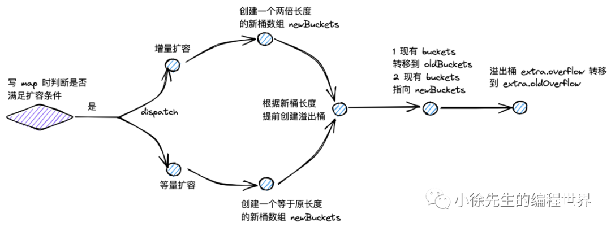

map 的扩容类型分为两类，一类叫做增量扩容，一类叫做等量扩容.

（1）增量扩容

表现：扩容后，桶数组的长度增长为原长度的 2 倍；

目的：降低每个桶中 key-value 对的数量，优化 map 操作的时间复杂度.

（2）等量扩容

表现：扩容后，桶数组的长度和之前保持一致；但是溢出桶的数量会下降.

目的：提高桶主体结构的数据填充率，减少溢出桶数量，避免发生内存泄漏.

## 9.2 何时扩容

（1）只有 map 的写流程可能开启扩容模式；

（2）写 map 新插入 key-value 对之前，会发起是否需要扩容的逻辑判断：

```go
func mapassign_example(t *maptype, h *hmap, key unsafe.Pointer) unsafe.Pointer { // Renamed for example
	// ...
	if !h.growing() && (overLoadFactor_example(h.count+1, h.B) || tooManyOverflowBuckets(h.noverflow, h.B)) {
		hashGrow(t, h)
		goto agoin // Corrected label
	}
	// ...
	return nil // Added to make it a valid Go function snippet for formatting
}
```

（3）根据 hmap 的 oldbuckets 是否空，可以判断 map 此前是否已开启扩容模式：

```go
func (h *hmap) growing() bool { // This is a method of hmap
	return h.oldbuckets != nil
}
```

（4）倘若此前未进入扩容模式，且 map 中 key-value 对的数量超过 8 个，且大于桶数组长度的 6.5 倍，则进入增量扩容：

```go
const (
	loadFactorNum_example2 = 13 // Renamed to avoid conflict
	loadFactorDen_example2 = 2
	bucketCnt_example2     = 8
)

func overLoadFactor_example2(count int, B uint8) bool { // Renamed for example
	return count > bucketCnt_example2 && uintptr(count) > loadFactorNum_example2*(bucketShift_example2(B)/loadFactorDen_example2)
}

// Placeholder for bucketShift if not defined elsewhere in this snippet context
func bucketShift_example2(b uint8) uintptr {
	return uintptr(1) << b
}
```

（5）倘若溢出桶的数量大于 2^B 个（即桶数组的长度；B 大于 15 时取 15），则进入等量扩容：

```go
func tooManyOverflowBuckets(noverflow uint16, B uint8) bool {
	if B > 15 {
		B = 15
	}
	return noverflow >= uint16(1)<<(B&15)
}
```

## 9.3 如何开启扩容模式

开启扩容模式的方法位于 runtime/map.go 的 hashGrow 方法中：

```go
func hashGrow(t *maptype, h *hmap) {
	bigger := uint8(1)
	if !overLoadFactor_example(h.count+1, h.B) { // Use the example version
		bigger = 0
		h.flags |= sameSizeGrow_flag // Use the example flag
	}
	oldbuckets := h.buckets
	newbuckets, nextOverflow := makeBucketArray(t, h.B+bigger, nil)

	flags := h.flags &^ (iterator | oldIterator) // Assuming iterator and oldIterator are defined constants
	if h.flags&iterator != 0 {
		flags |= oldIterator
	}
	// commit the grow (atomic wrt gc)
	h.B += bigger
	h.flags = flags
	h.oldbuckets = oldbuckets
	h.buckets = newbuckets
	h.nevacuate = 0
	h.noverflow = 0

	if h.extra != nil && h.extra.overflow != nil {
		// Promote current overflow buckets to the old generation.
		if h.extra.oldoverflow != nil {
			throw("oldoverflow is not nil") // Assuming throw is a helper for panic
		}
		h.extra.oldoverflow = h.extra.overflow
		h.extra.overflow = nil
	}
	if nextOverflow != nil {
		if h.extra == nil {
			h.extra = new(mapextra)
		}
		h.extra.nextOverflow = nextOverflow
	}
}
```

（1）倘若是增量扩容，bigger 值取 1；倘若是等量扩容，bigger 值取 0，并将 hmap.flags 的第 4 个 bit 位置为 1，标识当前处于等量扩容流程.

```go
// const sameSizeGrow_example = 8 // Renamed to avoid conflict, use sameSizeGrow_flag

bigger := uint8(1) // This is part of hashGrow logic
if !overLoadFactor_example(h.count+1, h.B) { // Ensure overLoadFactor_example is correctly referenced
    bigger = 0
    h.flags |= sameSizeGrow_flag
}
```

（2）将原桶数组赋值给 oldBuckets，并创建新的桶数组和一批新的溢出桶.

此处会通过变量 bigger，实现不同扩容模式下，新桶数组长度的区别处理.

```go
oldbuckets := h.buckets // This is part of hashGrow logic
newbuckets, nextOverflow := makeBucketArray(t, h.B+bigger, nil)
```

（3）更新 hmap 的桶数组长度指数 B，flag 标识，并将新、老桶数组赋值给 hmap.oldBuckets 和 hmap.buckets；扩容迁移进度 hmap.nevacuate 标记为 0；新桶数组的溢出桶数量 hmap.noverflow 置为 0.

```go
flags := h.flags &^ (iterator | oldIterator) // Assuming iterator and oldIterator are defined constants
if h.flags&iterator != 0 {
    flags |= oldIterator
}
// commit the grow (atomic wrt gc)
h.B += bigger
h.flags = flags
h.oldbuckets = oldbuckets
h.buckets = newbuckets
h.nevacuate = 0
h.noverflow = 0
```

（4）将原本存量可用的溢出桶赋给 hmap.extra.oldoverflow；倘若存在下一个可用的溢出桶，赋给 hmap.extra.nextOverflow.

```go
if h.extra != nil && h.extra.overflow != nil { // This is part of hashGrow logic
    h.extra.oldoverflow = h.extra.overflow
    h.extra.overflow = nil
}
if nextOverflow != nil {
    if h.extra == nil {
        h.extra = new(mapextra)
    }
    h.extra.nextOverflow = nextOverflow
}
```

## 9.4 扩容迁移规则

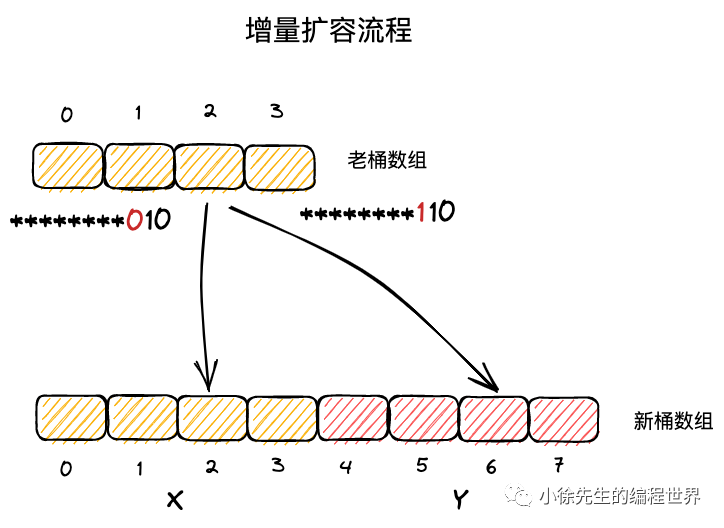

（1）在等量扩容中，新桶数组长度与原桶数组相同；

（2）key-value 对在新桶数组和老桶数组的中的索引号保持一致；

（3）在增量扩容中，新桶数组长度为原桶数组的两倍；

（4）把新桶数组中桶号对应于老桶数组的区域称为 x 区域，新扩展的区域称为 y 区域.

（5）实际上，一个 key 属于哪个桶，取决于其 hash 值对桶数组长度取模得到的结果，因此依赖于其低位的 hash 值结果.；

（6）在增量扩容流程中，新桶数组的长度会扩展一位，假定 key 原本从属的桶号为 i，则在新桶数组中从属的桶号只可能是 i （x 区域）或者 i + 老桶数组长度（y 区域）；

（7）当 key 低位 hash 值向左扩展一位的 bit 位为 0，则应该迁往 x 区域的 i 位置；倘若该 bit 位为 1，应该迁往 y 区域对应的 i + 老桶数组长度的位置.

## 9.5 渐进式扩容

map 采用的是渐进扩容的方式，避免因为一次性的全量数据迁移引发性能抖动.

当每次触发写、删操作时，会为处于扩容流程中的 map 完成两组桶的数据迁移：

（1）一组桶是当前写、删操作所命中的桶；

（2）另一组桶是，当前未迁移的桶中，索引最小的那个桶.

```go
func growWork(t *maptype, h *hmap, bucket uintptr) {
	// make sure we evacuate the oldbucket corresponding
	// to the bucket we're about to use
	evacuate(t, h, bucket&h.oldbucketmask()) // Assuming oldbucketmask is a method of hmap

	// evacuate one more oldbucket to make progress on growing
	if h.growing() {
		evacuate(t, h, h.nevacuate)
	}
}
```

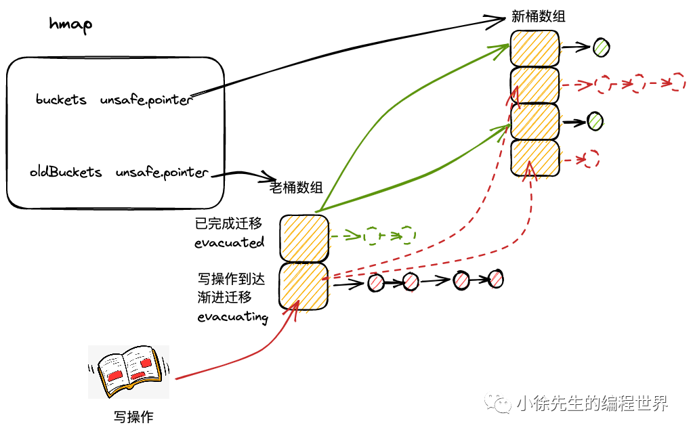

数据迁移的逻辑位于 runtime/map.go 的 evacuate 方法当中：

```go
// Assume evacDst struct is defined elsewhere, e.g.:
type evacDst struct {
   b *bmap
   i int
   k unsafe.Pointer
   e unsafe.Pointer
}

func evacuate(t *maptype, h *hmap, oldbucket uintptr) {
	// 入参中，oldbucket 为当前要迁移的桶在旧桶数组中的索引
	// 获取到待迁移桶的内存地址 b
	b := (*bmap)(add(h.oldbuckets, oldbucket*uintptr(t.bucketsize)))
	// 获取到旧桶数组的容量 newbit
	newbit := h.noldbuckets()

	// evacuated 方法判断出桶 b 是否已经迁移过了，未迁移过，才进入此 if 分支进行迁移处理
	if !evacuated(b) { // Assuming evacuated is a helper function
		// 通过一个二元数组 xy 指向当前桶可能迁移到的目的桶
		// x = xy[0]，代表新桶数组中索引和旧桶数组一致的桶
		// y = xy[1]，代表新桶数组中，索引为原索引加上旧桶容量的桶，只在增量扩容中会使用到
		var xy [2]evacDst // evacDst needs to be defined for this to be valid Go
		x := &xy[0]
		x.b = (*bmap)(add(h.buckets, oldbucket*uintptr(t.bucketsize)))
		x.k = add(unsafe.Pointer(x.b), dataOffset) // Assuming dataOffset is a defined constant
		x.e = add(x.k, bucketCnt*uintptr(t.keysize))

		// 只有进入增量扩容的分支，才需要对 y 进行初始化
		if !h.sameSizeGrow() { // Assuming sameSizeGrow is a method of hmap
			// Only calculate y pointers if we're growing bigger.
			// Otherwise GC can see bad pointers.
			y := &xy[1]
			y.b = (*bmap)(add(h.buckets, (oldbucket+newbit)*uintptr(t.bucketsize)))
			y.k = add(unsafe.Pointer(y.b), dataOffset)
			y.e = add(y.k, bucketCnt*uintptr(t.keysize))
		}

		// 外层 for 循环，遍历桶 b 和对应的溢出桶
		for ; b != nil; b = b.overflow(t) { // Assuming overflow is a method of bmap
			// k,e 分别记录遍历桶时，当前的 key 和 value 的指针
			k := add(unsafe.Pointer(b), dataOffset)
			e := add(k, bucketCnt*uintptr(t.keysize))

			// 遍历桶内的 key-value 对
			for i := 0; i < bucketCnt; i, k, e = i+1, add(k, uintptr(t.keysize)), add(e, uintptr(t.elemsize)) {
				top := b.tophash[i]
				if isEmpty(top) { // Assuming isEmpty is a helper function
					b.tophash[i] = evacuatedEmpty_example // Use renamed const
					continue
				}
				if top < minTopHash_example { // Use renamed const
					throw("bad map state") // Assuming throw is a helper for panic
				}
				k2 := k
				if t.indirectkey() { // Assuming indirectkey is a method of maptype
					k2 = *((*unsafe.Pointer)(k2))
				}
				var useY uint8
				if !h.sameSizeGrow() {
					// Compute hash to make our evacuation decision (whether we need
					// to send this key/elem to bucket x or bucket y).
					hash := t.hasher(k2, uintptr(h.hash0)) // Assuming hasher is a method of maptype
					if hash&newbit != 0 {
						useY = 1
					}
				}
				b.tophash[i] = evacuatedX_example + useY // evacuatedX_example + 1 == evacuatedY_example
				dst := &xy[useY]                         // evacuation destination
				if dst.i == bucketCnt {
					dst.b = h.newoverflow(t, dst.b) // Assuming newoverflow is a method of hmap
					dst.i = 0
					dst.k = add(unsafe.Pointer(dst.b), dataOffset)
					dst.e = add(dst.k, bucketCnt*uintptr(t.keysize))
				}
				dst.b.tophash[dst.i&(bucketCnt-1)] = top // mask dst.i as an optimization, to avoid a bounds check
				if t.indirectkey() {
					*(*unsafe.Pointer)(dst.k) = k2 // copy pointer
				} else {
					typedmemmove(t.key, dst.k, k) // copy elem, assuming typedmemmove is defined
				}
				if t.indirectelem() { // Assuming indirectelem is a method of maptype
					*(*unsafe.Pointer)(dst.e) = *(*unsafe.Pointer)(e)
				} else {
					typedmemmove(t.elem, dst.e, e)
				}
				dst.i++
				dst.k = add(dst.k, uintptr(t.keysize))
				dst.e = add(dst.e, uintptr(t.elemsize))
			}
		}
		// Unlink the overflow buckets & clear key/elem to help GC.
		if h.flags&oldIterator == 0 && t.bucket.ptrdata != 0 { // Assuming oldIterator is a defined constant
			bMem := add(h.oldbuckets, oldbucket*uintptr(t.bucketsize)) // Renamed b to bMem to avoid conflict
			// Preserve b.tophash because the evacuation
			// state is maintained there.
			ptr := add(bMem, dataOffset)
			n := uintptr(t.bucketsize) - dataOffset
			memclrHasPointers(ptr, n) // Assuming memclrHasPointers is defined
		}
	}
	if oldbucket == h.nevacuate {
		advanceEvacuationMark(h, t, newbit) // Assuming advanceEvacuationMark is defined
	}
}

func (h *hmap) noldbuckets() uintptr { // This is a method of hmap
	oldB := h.B
	if !h.sameSizeGrow() {
		oldB--
	}
	return bucketShift(oldB) // Assuming bucketShift is defined
}
```

（9）倘若当前迁移的桶是旧桶数组未迁移的桶中索引最小的一个，则 hmap.nevacuate 累加 1.

倘若已经迁移完所有的旧桶，则会确保 hmap.flags 中，等量扩容的标识位被置为 0.

```go
if oldbucket == h.nevacuate {
	advanceEvacuationMark(h, t, newbit)
}
```

```go
func advanceEvacuationMark(h *hmap, t *maptype, newbit uintptr) {
	h.nevacuate++
	// ...
	if h.nevacuate == newbit { // newbit == # of oldbuckets
		h.oldbuckets = nil
		if h.extra != nil {
			h.extra.oldoverflow = nil
		}
		h.flags &^= sameSizeGrow_flag // Assuming sameSizeGrow_flag is defined
	}
}
```

## 常见面试问题与答案

### Q1: Go 语言中 map 的底层数据结构是什么？

**A:** Go 语言中 map 的底层数据结构是**哈希表（hash table）**，具体实现包括：

1.  **hmap 结构体**：存储 map 的元数据，包括桶数组指针、元素数量、哈希种子等
2.  **桶数组（buckets）**：长度为 2 的整数次幂的数组，每个桶可存储 8 个 key-value 对
3.  **溢出桶链表**：当桶满时，通过链表连接溢出桶解决哈希冲突
4.  **渐进式扩容机制**：支持增量扩容和等量扩容

### Q2: Go map 如何解决哈希冲突？

**A:** Go map 采用**拉链法 + 开放寻址法**的混合方式解决哈希冲突：

1.  **桶内开放寻址**：每个桶固定存储 8 个 key-value 对，发生冲突时在桶内寻找空位
2.  **桶间拉链法**：当桶满时，通过溢出桶指针形成链表结构
3.  **渐进式扩容**：当负载因子超过 6.5 时触发扩容，重新分布数据

### Q3: Go map 什么时候会扩容？扩容规则是什么？

**A:** Go map 有两种扩容触发条件：

**增量扩容（容量翻倍）：**

- 触发条件：负载因子 > 6.5（即 count/2^B > 6.5）
- 扩容后：桶数组长度变为原来的 2 倍

**等量扩容（容量不变）：**

- 触发条件：溢出桶数量 >= 2^B（B 最大为 15）
- 目的：提高桶主体结构的数据填充率，减少溢出桶数量，避免发生内存泄漏

**扩容特点：**

- 采用渐进式扩容，避免性能抖动
- 每次写操作时迁移 2 个桶的数据
- 通过 oldbuckets 和 buckets 双数组实现

### Q4: Go map 为什么不是并发安全的？

**A:** Go map 不是并发安全的原因：

1.  **设计理念**：为了性能考虑，Go map 没有内置锁机制
2.  **并发检测**：运行时会检测并发读写，发现时抛出 fatal error
3.  **检测规则**：
    - 并发读是安全的
    - 读写并发会 panic：`concurrent map read and map write`
    - 写写并发会 panic：`concurrent map writes`

**解决方案：**

- 使用`sync.RWMutex`手动加锁
- 使用`sync.Map`（适合读多写少场景）
- 使用 channel 进行串行化访问

### Q5: Go map 的 key 有什么限制？

**A:** Go map 的 key 必须是**可比较类型**：

**可作为 key 的类型：**

- 基本类型：bool, 数值类型, string
- 指针类型
- 数组类型（元素可比较）
- 结构体类型（所有字段可比较）

**不可作为 key 的类型：**

- slice（切片）
- map（映射）
- function（函数）

**原因：** 这些类型无法用`==`操作符进行比较，无法计算稳定的哈希值。

### Q6: Go map 遍历为什么是无序的？

**A:** Go map 遍历无序的原因：

1.  **哈希表特性**：数据存储位置由哈希值决定，不保证顺序
2.  **故意随机化**：Go 1.0 后故意引入随机化，防止程序依赖遍历顺序
3.  **扩容影响**：扩容过程中数据重新分布，进一步打乱顺序

**如需有序遍历：**

```go
// 先收集key并排序
keys := make([]string, 0, len(m))
for k := range m {
	keys = append(keys, k)
}
sort.Strings(keys)

// 按排序后的key遍历
for _, k := range keys {
	fmt.Println(k, m[k])
}
```

### Q7: Go map 的零值是什么？可以直接使用吗？

**A:**

- **零值**：Go map 的零值是`nil`
- **读操作**：可以从 nil map 读取，返回零值和 false
- **写操作**：不能向 nil map 写入，会 panic：`assignment to entry in nil map`

**正确初始化方式：**

```go
// 方式1：使用make
m1 := make(map[string]int)

// 方式2：字面量初始化
m2 := map[string]int{"key": 1}

// 方式3：指定容量
m3 := make(map[string]int, 10)
```

### Q8: 如何判断 map 中某个 key 是否存在？

**A:** 使用双返回值语法：

```go
value, ok := m[key]
if ok {
	// key存在，value是对应的值
	fmt.Println("key存在，值为:", value)
} else {
	// key不存在，value是零值
	fmt.Println("key不存在")
}

// 简化写法
if value, ok := m[key]; ok {
	// key存在的处理逻辑
}
```

**注意：** 不能仅通过值判断 key 是否存在，因为值可能就是零值。
