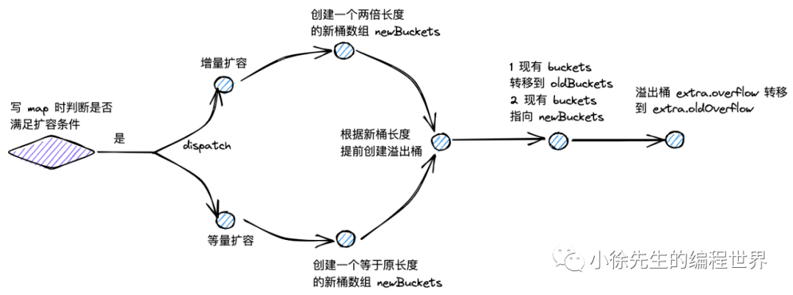
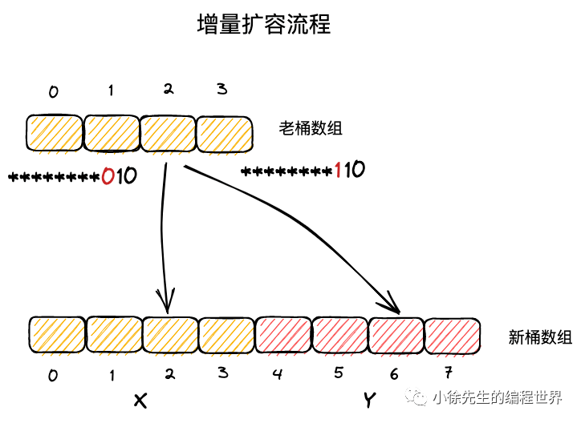
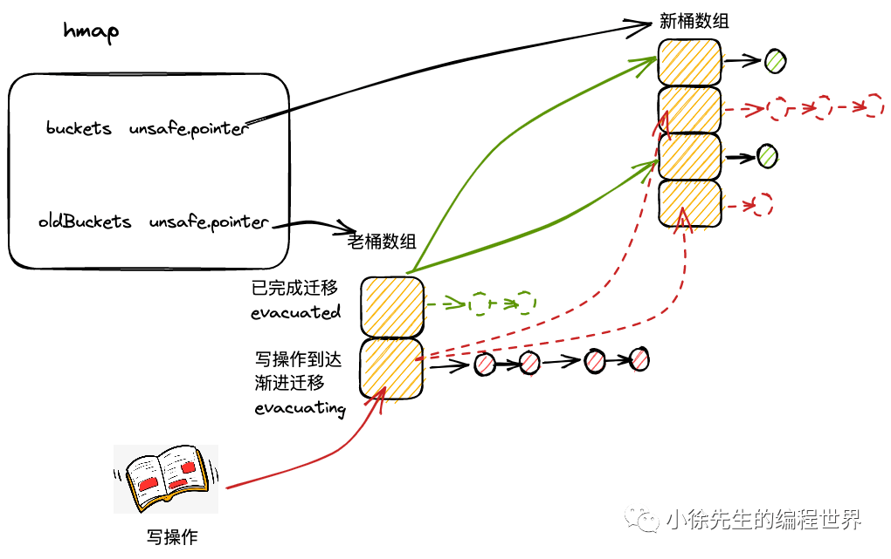

# Go Map 扩容机制深度解析

## 扩容机制概述



Go map 的扩容机制是其高性能的关键保障。通过动态调整桶数组大小，map 能够在元素数量增长时始终保持 O(1) 的平均访问时间复杂度。

## 扩容类型详解

map 的扩容类型分为两类：增量扩容和等量扩容。

### 增量扩容（翻倍扩容）

**表现**：扩容后，桶数组的长度增长为原长度的 2 倍

**目的**：降低每个桶中 key-value 对的数量，优化 map 操作的时间复杂度

**触发条件**：当负载因子超过 6.5 时

```
负载因子 = 元素总数 / 桶数组长度 > 6.5
```

### 等量扩容（整理扩容）

**表现**：扩容后，桶数组的长度和之前保持一致；但是溢出桶的数量会下降

**目的**：提高桶主体结构的数据填充率，减少溢出桶数量，避免发生内存泄漏

**触发条件**：当溢出桶数量过多时

```
溢出桶数量 >= 2^B （B 最大取 15）
```

## 扩容触发条件

### 触发时机

只有 map 的写流程可能开启扩容模式。写 map 新插入 key-value 对之前，会发起扩容条件判断：

```go
func mapassign(t *maptype, h *hmap, key unsafe.Pointer) unsafe.Pointer {
	// ...
	if !h.growing() && (overLoadFactor(h.count+1, h.B) || tooManyOverflowBuckets(h.noverflow, h.B)) {
		hashGrow(t, h)
		goto again
	}
	// ...
}
```

### 扩容状态判断

根据 hmap 的 oldbuckets 是否为空，可以判断 map 此前是否已开启扩容模式：

```go
func (h *hmap) growing() bool {
	return h.oldbuckets != nil
}
```

### 增量扩容条件

```go
const (
	loadFactorNum = 13
	loadFactorDen = 2
	bucketCnt     = 8
)

func overLoadFactor(count int, B uint8) bool {
	return count > bucketCnt && uintptr(count) > loadFactorNum*(bucketShift(B)/loadFactorDen)
}
```

条件：

- map 中 key-value 对的数量超过 8 个
- 负载因子大于 6.5（13/2 = 6.5）

### 等量扩容条件

```go
func tooManyOverflowBuckets(noverflow uint16, B uint8) bool {
	if B > 15 {
		B = 15
	}
	return noverflow >= uint16(1)<<(B&15)
}
```

条件：溢出桶的数量大于等于 2^B 个（B 大于 15 时取 15）

## 扩容开启流程 - hashGrow

### hashGrow 核心实现

```go
func hashGrow(t *maptype, h *hmap) {
	bigger := uint8(1)
	if !overLoadFactor(h.count+1, h.B) {
		bigger = 0
		h.flags |= sameSizeGrow
	}
	oldbuckets := h.buckets
	newbuckets, nextOverflow := makeBucketArray(t, h.B+bigger, nil)

	flags := h.flags &^ (iterator | oldIterator)
	if h.flags&iterator != 0 {
		flags |= oldIterator
	}
	// commit the grow (atomic wrt gc)
	h.B += bigger
	h.flags = flags
	h.oldbuckets = oldbuckets
	h.buckets = newbuckets
	h.nevacuate = 0
	h.noverflow = 0

	if h.extra != nil && h.extra.overflow != nil {
		if h.extra.oldoverflow != nil {
			throw("oldoverflow is not nil")
		}
		h.extra.oldoverflow = h.extra.overflow
		h.extra.overflow = nil
	}
	if nextOverflow != nil {
		if h.extra == nil {
			h.extra = new(mapextra)
		}
		h.extra.nextOverflow = nextOverflow
	}
}
```

### 开启流程详解

#### 1. 扩容类型判断

```go
bigger := uint8(1)
if !overLoadFactor(h.count+1, h.B) {
	bigger = 0
	h.flags |= sameSizeGrow
}
```

- 增量扩容：`bigger = 1`，新桶数组长度翻倍
- 等量扩容：`bigger = 0`，并设置等量扩容标志位

#### 2. 新桶数组创建

```go
oldbuckets := h.buckets
newbuckets, nextOverflow := makeBucketArray(t, h.B+bigger, nil)
```

- 保存老桶数组引用
- 创建新桶数组，长度为 2^(B+bigger)
- 同时创建新的溢出桶

#### 3. 状态更新

```go
h.B += bigger
h.flags = flags
h.oldbuckets = oldbuckets
h.buckets = newbuckets
h.nevacuate = 0
h.noverflow = 0
```

- 更新桶数组长度指数
- 设置新老桶数组指针
- 重置迁移进度和溢出桶计数

#### 4. 溢出桶处理

```go
if h.extra != nil && h.extra.overflow != nil {
	h.extra.oldoverflow = h.extra.overflow
	h.extra.overflow = nil
}
```

将原本的溢出桶赋给 oldoverflow，为新桶数组分配新的溢出桶。

## 数据迁移规则



### 等量扩容迁移

在等量扩容中：

- 新桶数组长度与原桶数组相同
- key-value 对在新桶数组和老桶数组中的索引号保持一致
- 主要目的是重新整理数据，减少溢出桶

### 增量扩容迁移

在增量扩容中：

- 新桶数组长度为原桶数组的 2 倍
- 把新桶数组分为两个区域：
  - **X 区域**：对应老桶数组的区域（索引 0 到 2^(B-1)-1）
  - **Y 区域**：新扩展的区域（索引 2^(B-1) 到 2^B-1）

### 迁移位置计算

一个 key 属于哪个桶，取决于其 hash 值对桶数组长度取模的结果：

```go
bucket = hash & (2^B - 1)
```

在增量扩容中，key 的新位置只有两种可能：

- 原位置 i（X 区域）
- 原位置 + 老桶数组长度（Y 区域）

判断依据是 hash 值的第 B 位：

- 第 B 位为 0：迁移到 X 区域
- 第 B 位为 1：迁移到 Y 区域

```go
if hash&(1<<(B-1)) == 0 {
	// 迁移到 X 区域，位置不变
	newBucket = oldBucket
} else {
	// 迁移到 Y 区域
	newBucket = oldBucket + oldBucketCount
}
```

## 渐进式扩容机制

### 渐进式扩容策略

map 采用渐进式扩容方式，避免一次性全量迁移导致的性能抖动：



当每次触发写、删操作时，会为处于扩容流程中的 map 完成两组桶的数据迁移：

1. 当前写、删操作所命中的桶
2. 当前未迁移的桶中，索引最小的那个桶

```go
func growWork(t *maptype, h *hmap, bucket uintptr) {
	// 迁移当前操作命中的桶
	evacuate(t, h, bucket&h.oldbucketmask())

	// 迁移一个额外的桶推进扩容进度
	if h.growing() {
		evacuate(t, h, h.nevacuate)
	}
}
```

### 渐进式扩容优势

1. **分摊开销**：将扩容开销分摊到多次操作中
2. **避免阻塞**：单次操作不会因扩容而长时间阻塞
3. **内存友好**：新老数组并存时间较短，减少内存压力
4. **用户无感知**：对用户来说扩容过程透明

## 数据迁移实现 - evacuate

### evacuate 核心逻辑

```go
func evacuate(t *maptype, h *hmap, oldbucket uintptr) {
	b := (*bmap)(add(h.oldbuckets, oldbucket*uintptr(t.bucketsize)))
	newbit := h.noldbuckets()

	if !evacuated(b) {
		var xy [2]evacDst
		x := &xy[0]
		x.b = (*bmap)(add(h.buckets, oldbucket*uintptr(t.bucketsize)))
		x.k = add(unsafe.Pointer(x.b), dataOffset)
		x.e = add(x.k, bucketCnt*uintptr(t.keysize))

		if !h.sameSizeGrow() {
			y := &xy[1]
			y.b = (*bmap)(add(h.buckets, (oldbucket+newbit)*uintptr(t.bucketsize)))
			y.k = add(unsafe.Pointer(y.b), dataOffset)
			y.e = add(y.k, bucketCnt*uintptr(t.keysize))
		}

		for ; b != nil; b = b.overflow(t) {
			k := add(unsafe.Pointer(b), dataOffset)
			e := add(k, bucketCnt*uintptr(t.keysize))

			for i := 0; i < bucketCnt; i, k, e = i+1, add(k, uintptr(t.keysize)), add(e, uintptr(t.elemsize)) {
				top := b.tophash[i]
				if isEmpty(top) {
					b.tophash[i] = evacuatedEmpty
					continue
				}
				if top < minTopHash {
					throw("bad map state")
				}
				k2 := k
				if t.indirectkey() {
					k2 = *((*unsafe.Pointer)(k2))
				}
				var useY uint8
				if !h.sameSizeGrow() {
					hash := t.hasher(k2, uintptr(h.hash0))
					if hash&newbit != 0 {
						useY = 1
					}
				}

				b.tophash[i] = evacuatedX + useY
				dst := &xy[useY]

				if dst.i == bucketCnt {
					dst.b = h.newoverflow(t, dst.b)
					dst.i = 0
					dst.k = add(unsafe.Pointer(dst.b), dataOffset)
					dst.e = add(dst.k, bucketCnt*uintptr(t.keysize))
				}
				dst.b.tophash[dst.i&(bucketCnt-1)] = top

				// 复制 key
				if t.indirectkey() {
					*(*unsafe.Pointer)(dst.k) = k2
				} else {
					typedmemmove(t.key, dst.k, k)
				}

				// 复制 value
				if t.indirectelem() {
					*(*unsafe.Pointer)(dst.e) = *(*unsafe.Pointer)(e)
				} else {
					typedmemmove(t.elem, dst.e, e)
				}

				dst.i++
				dst.k = add(dst.k, uintptr(t.keysize))
				dst.e = add(dst.e, uintptr(t.elemsize))
			}
		}

		// 清理老桶内存
		if h.flags&oldIterator == 0 && t.bucket.ptrdata != 0 {
			bMem := add(h.oldbuckets, oldbucket*uintptr(t.bucketsize))
			ptr := add(bMem, dataOffset)
			n := uintptr(t.bucketsize) - dataOffset
			memclrHasPointers(ptr, n)
		}
	}

	if oldbucket == h.nevacuate {
		advanceEvacuationMark(h, t, newbit)
	}
}
```

### 迁移过程详解

#### 1. 目标桶准备

```go
var xy [2]evacDst
x := &xy[0]  // X 区域目标桶
y := &xy[1]  // Y 区域目标桶（仅增量扩容使用）
```

#### 2. 迁移位置计算

```go
var useY uint8
if !h.sameSizeGrow() {
	hash := t.hasher(k2, uintptr(h.hash0))
	if hash&newbit != 0 {
		useY = 1  // 迁移到 Y 区域
	}
}
```

#### 3. 数据复制

根据 key 和 value 是否为指针类型，选择合适的复制方式：

- 指针类型：直接复制指针
- 值类型：使用 `typedmemmove` 复制数据

#### 4. 状态标记

```go
b.tophash[i] = evacuatedX + useY
```

迁移完成后，在老桶中标记该位置已迁移：

- `evacuatedX`：已迁移到 X 区域
- `evacuatedY`：已迁移到 Y 区域

### 迁移进度管理

```go
func advanceEvacuationMark(h *hmap, t *maptype, newbit uintptr) {
	h.nevacuate++
	stop := h.nevacuate + 1024
	if stop > newbit {
		stop = newbit
	}
	for h.nevacuate != stop && bucketEvacuated(t, h, h.nevacuate) {
		h.nevacuate++
	}
	if h.nevacuate == newbit {
		// 所有桶都已迁移完成
		h.oldbuckets = nil
		if h.extra != nil {
			h.extra.oldoverflow = nil
		}
		h.flags &^= sameSizeGrow
	}
}
```

## 扩容期间的操作处理

### 读操作处理

读操作需要同时检查新老桶数组：

```go
if c := h.oldbuckets; c != nil {
	if !h.sameSizeGrow() {
		m >>= 1
	}
	oldb := (*bmap)(add(c, (hash&m)*uintptr(t.bucketsize)))
	if !evacuated(oldb) {
		b = oldb  // 从老桶读取
	}
}
```

### 写操作处理

写操作会协助扩容进程：

```go
if h.growing() {
	growWork(t, h, bucket)
}
```

每次写操作都会迁移两个桶，推进扩容进度。

### 删除操作处理

删除操作同样会协助扩容：

```go
if h.growing() {
	growWork(t, h, bucket)
}
```

## 性能分析与优化

### 扩容开销分析

1. **内存开销**：扩容期间需要同时维护新老两个桶数组
2. **时间开销**：每次写操作额外迁移两个桶
3. **GC 压力**：迁移过程中可能产生额外的垃圾回收压力

### 负载因子选择

Go 选择 6.5 作为负载因子的原因：

- **查找效率**：保证大部分查找在常数时间内完成
- **内存利用率**：避免内存浪费
- **扩容频率**：平衡扩容开销和性能

### 渐进式扩容优化

1. **批量迁移**：一次迁移整个桶链表
2. **内存清理**：及时清理老桶内存
3. **状态跟踪**：精确跟踪迁移进度

## 面试重点问题

### Q1: Go map 什么时候会扩容？

**A:** Go map 有两种扩容触发条件：

**增量扩容（容量翻倍）：**

- 触发条件：负载因子 > 6.5（count/2^B > 6.5）
- 扩容后：桶数组长度变为原来的 2 倍

**等量扩容（容量不变）：**

- 触发条件：溢出桶数量 >= 2^B
- 目的：整理数据，减少溢出桶数量

### Q2: Go map 扩容为什么是渐进式的？

**A:** 渐进式扩容的优势：

1. **避免阻塞**：一次性迁移所有数据会导致长时间阻塞
2. **分摊开销**：将迁移开销分摊到多次操作中
3. **用户无感知**：用户操作不会感受到扩容的影响
4. **内存友好**：减少内存峰值使用

### Q3: 扩容期间如何保证数据一致性？

**A:** 数据一致性保证机制：

1. **双数组查找**：读操作同时检查新老桶数组
2. **协助迁移**：写操作协助推进迁移进度
3. **状态标记**：通过 tophash 标记记录迁移状态
4. **原子操作**：关键状态更新使用原子操作

### Q4: 为什么负载因子选择 6.5？

**A:** 6.5 负载因子的选择平衡了多个因素：

1. **性能考虑**：保证大部分查找在 O(1) 时间内完成
2. **内存效率**：避免过多的内存浪费
3. **扩容频率**：控制扩容操作的频率
4. **实验结果**：经过大量实验验证的最优值

理解 Go map 的扩容机制对于优化程序性能和避免性能陷阱非常重要。
