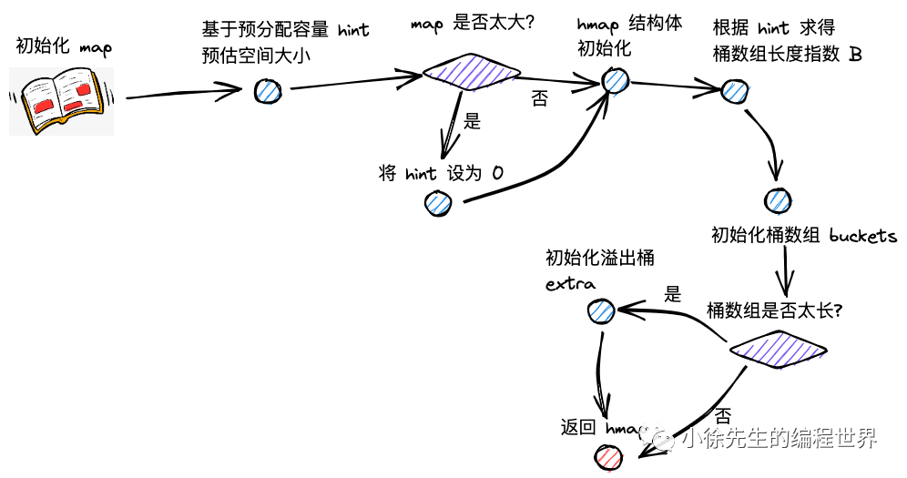

# Go Map 构造与初始化流程

## 构造流程概述



创建 map 时，实际上会调用 runtime/map.go 文件中的 makemap 方法。本文将深入分析 map 的构造和初始化过程。

## makemap 核心实现

### 主干源码分析

```go
func makemap(t *maptype, hint int, h *hmap) *hmap {
	mem, overflow := math.MulUintptr(uintptr(hint), t.bucket.size)
	if overflow || mem > maxAlloc {
		hint = 0
	}

	if h == nil {
		h = new(hmap)
	}
	h.hash0 = fastrand()

	B := uint8(0)
	for overLoadFactor(hint, B) {
		B++
	}
	h.B = B

	if h.B != 0 {
		var nextOverflow *bmap
		h.buckets, nextOverflow = makeBucketArray(t, h.B, nil)
		if nextOverflow != nil {
			h.extra = new(mapextra)
			h.extra.nextOverflow = nextOverflow
		}
	}
	return h
}
```

### 详细步骤解析

#### 1. 内存溢出检查

```go
mem, overflow := math.MulUintptr(uintptr(hint), t.bucket.size)
if overflow || mem > maxAlloc {
	hint = 0
}
```

（1）hint 为 map 拟分配的容量；在分配前，会提前对拟分配的内存大小进行判断，倘若超限，会将 hint 置为零；

这一步骤防止因为过大的 hint 值导致内存溢出或超出系统限制。

#### 2. hmap 结构体初始化

```go
if h == nil {
	h = new(hmap)
}
```

通过 new 方法初始化 hmap 结构体，这是 map 的核心数据结构。

#### 3. 哈希种子生成

```go
h.hash0 = fastrand()
```

调用 fastrand，构造 hash 因子：hmap.hash0。这个随机种子用于哈希计算，增强安全性和散列效果。

#### 4. 桶数组容量计算

```go
B := uint8(0)
for overLoadFactor(hint, B) {
	B++
}
h.B = B
```

大致上基于 log2(B) >= hint 的思路（具体见 overLoadFactor 方法的介绍），计算桶数组的容量指数 B。

#### 5. 桶数组和溢出桶初始化

```go
if h.B != 0 {
	var nextOverflow *bmap
	h.buckets, nextOverflow = makeBucketArray(t, h.B, nil)
	if nextOverflow != nil {
		h.extra = new(mapextra)
		h.extra.nextOverflow = nextOverflow
	}
}
```

（5）调用 makeBucketArray 方法，初始化桶数组 hmap.buckets；

（6）倘若 map 容量较大，会提前申请一批溢出桶 hmap.extra。

## overLoadFactor 负载因子判断

通过 overLoadFactor 方法，对 map 预分配容量和桶数组长度指数进行判断，决定是否仍需要增长 B 的数值：

```go
const loadFactorNum = 13
const loadFactorDen = 2
const bucketCnt = 8

func overLoadFactor(count int, B uint8) bool {
	return count > bucketCnt && uintptr(count) > loadFactorNum*(bucketShift(B)/loadFactorDen)
}

func bucketShift(b uint8) uintptr {
	return uintptr(1) << (b & (goarch.PtrSize*8 - 1))
}
```

### 负载因子规则

（1）倘若 map 预分配容量小于等于 8，B 取 0，桶的个数为 1；

（2）保证 map 预分配容量小于等于桶数组长度 \* 6.5。

### 容量与桶数组关系表

| kv 对数量                 | 桶数组长度指数 B | 桶数组长度 2^B |
| ------------------------- | ---------------- | -------------- |
| 0 ~ 8                     | 0                | 1              |
| 9 ~ 13                    | 1                | 2              |
| 14 ~ 26                   | 2                | 4              |
| 27 ~ 52                   | 3                | 8              |
| 2^(B-1) * 6.5+1 ~ 2^B*6.5 | B                | 2^B            |

## makeBucketArray 桶数组分配

makeBucketArray 方法会进行桶数组的初始化，并根据桶的数量决定是否需要提前作溢出桶的初始化。

### 核心实现

```go
func makeBucketArray(t *maptype, b uint8, dirtyalloc unsafe.Pointer) (buckets unsafe.Pointer, nextOverflow *bmap) {
	base := bucketShift(b)
	nbuckets := base

	if b >= 4 {
		nbuckets += bucketShift(b - 4)
	}

	buckets = newarray(t.bucket, int(nbuckets))
	if base != nbuckets {
		nextOverflow = (*bmap)(add(buckets, base*uintptr(t.bucketsize)))
		last := (*bmap)(add(buckets, (nbuckets-1)*uintptr(t.bucketsize)))
		last.setoverflow(t, (*bmap)(buckets))
	}
	return buckets, nextOverflow
}
```

### 详细步骤

#### 1. 计算桶数量

```go
base := bucketShift(b)
nbuckets := base
if b >= 4 {
	nbuckets += bucketShift(b - 4)
}
```

makeBucketArray 会为 map 的桶数组申请内存，在桶数组的指数 b >= 4 时（桶数组的容量 >= 16），会需要提前创建溢出桶。

- `base`：记录桶数组的长度，不包含溢出桶
- `nbuckets`：记录累加上溢出桶后，桶数组的总长度

#### 2. 内存分配

```go
buckets = newarray(t.bucket, int(nbuckets))
```

调用 newarray 方法为桶数组申请内存空间，连带着需要初始化的溢出桶。

#### 3. 溢出桶链接

```go
if base != nbuckets {
	nextOverflow = (*bmap)(add(buckets, base*uintptr(t.bucketsize)))
	last := (*bmap)(add(buckets, (nbuckets-1)*uintptr(t.bucketsize)))
	last.setoverflow(t, (*bmap)(buckets))
}
```

倘若 base != nbuckets，说明需要创建溢出桶，会基于地址偏移的方式，通过 nextOverflow 指向首个溢出桶的地址。

倘若需要创建溢出桶，会将最后一个溢出桶的 overflow 指针指向 buckets 数组，以此来标识申请的溢出桶已经用完。

### setoverflow 方法

```go
func (b *bmap) setoverflow(t *maptype, ovf *bmap) {
	*(**bmap)(add(unsafe.Pointer(b), uintptr(t.bucketsize)-goarch.PtrSize)) = ovf
}
```

这个方法通过内存地址偏移，将溢出桶指针设置到桶结构的末尾位置。

## 溢出桶预分配策略

### 预分配条件

当桶数组长度指数 B >= 4 时（即桶数组长度 >= 16），系统会预分配溢出桶：

- **预分配数量**：2^(B-4) 个溢出桶
- **存储位置**：连续分配在正常桶数组之后
- **管理方式**：通过 mapextra 结构管理

### 预分配优势

1. **减少内存分配**：避免运行时频繁分配溢出桶
2. **提高性能**：预分配减少了内存分配的开销
3. **内存连续性**：预分配的溢出桶内存地址连续，提高缓存友好性

## 初始化流程总结

1. **参数验证**：检查 hint 值是否会导致内存溢出
2. **结构体创建**：初始化 hmap 核心结构
3. **随机种子**：生成哈希计算用的随机因子
4. **容量计算**：根据负载因子确定桶数组大小
5. **内存分配**：分配桶数组和预分配溢出桶
6. **指针设置**：建立各种指针关系，完成初始化

## 性能优化考虑

### 内存分配优化

1. **批量分配**：桶数组和溢出桶一次性分配，减少内存碎片
2. **内存对齐**：确保数据结构按照 CPU 字长对齐
3. **预分配策略**：根据容量大小决定是否预分配溢出桶

### 负载因子优化

1. **6.5 负载因子**：平衡内存使用和查找性能
2. **动态调整**：根据实际使用情况动态扩容
3. **避免退化**：防止哈希表退化为链表

## 面试要点

### 常见问题

**Q1: make(map[int]int, 100) 和 make(map[int]int) 有什么区别？**

A: 主要区别在于：

- `make(map[int]int, 100)`：会根据容量 hint 预分配合适大小的桶数组
- `make(map[int]int)`：初始桶数组大小为 0，随着元素增加动态扩容
- 预分配可以减少后续的扩容操作，提高性能

**Q2: Go map 初始化时为什么使用随机哈希种子？**

A: 使用随机哈希种子的目的：

- **安全性**：防止哈希碰撞攻击
- **散列性**：提高哈希值的随机分布
- **避免退化**：防止特定数据导致性能退化

**Q3: 溢出桶什么时候会被预分配？**

A: 预分配条件：

- 桶数组长度指数 B >= 4（即至少 16 个桶）
- 预分配数量为 2^(B-4) 个溢出桶
- 目的是减少运行时的内存分配开销

理解这些初始化细节有助于更好地使用和优化 Go 语言中的 map 数据结构。
