# Go Map 核心原理与数据结构

## 核心原理概述

map 又称为 hash map，在算法上基于 hash 实现 key 的映射和寻址；在数据结构上基于桶数组实现 key-value 对的存储。

以一组 key-value 对写入 map 的流程为例进行简述：

（1）通过哈希方法取得 key 的 hash 值；

（2）hash 值对桶数组长度取模，确定其所属的桶；

（3）在桶中插入 key-value 对。

hash 的性质，保证了相同的 key 必然产生相同的 hash 值，因此能映射到相同的桶中，通过桶内遍历的方式锁定对应的 key-value 对。

因此，只要在宏观流程上，控制每个桶中 key-value 对的数量，就能保证 map 的几项操作都限制为常数级别的时间复杂度。

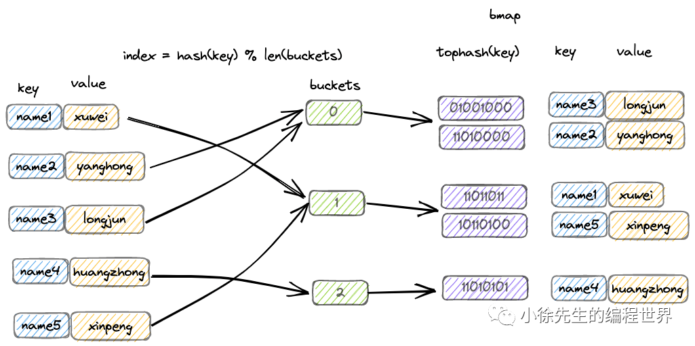

## Hash 原理

hash 译作散列，是一种将任意长度的输入压缩到某一固定长度的输出摘要的过程，由于这种转换属于压缩映射，输入空间远大于输出空间，因此不同输入可能会映射成相同的输出结果。此外，hash 在压缩过程中会存在部分信息的遗失，因此这种映射关系具有不可逆的特质。

### Hash 的核心特性

（1）**hash 的可重入性**：相同的 key，必然产生相同的 hash 值；

（2）**hash 的离散性**：只要两个 key 不相同，不论其相似度的高低，产生的 hash 值会在整个输出域内均匀地离散化；

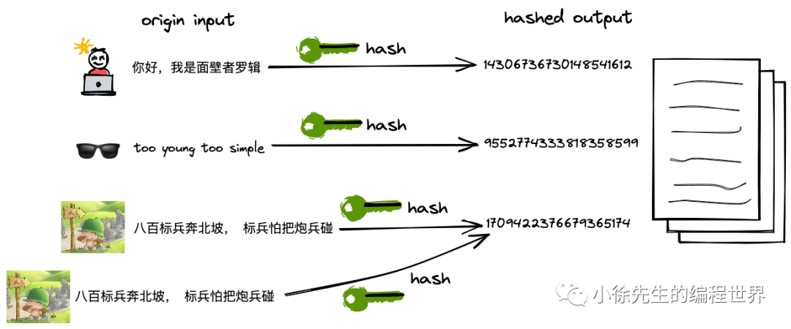

（3）**hash 的单向性**：企图通过 hash 值反向映射回 key 是无迹可寻的。


（4）**hash 冲突**：由于输入域（key）无穷大，输出域（hash 值）有限，因此必然存在不同 key 映射到相同 hash 值的情况，称之为 hash 冲突。

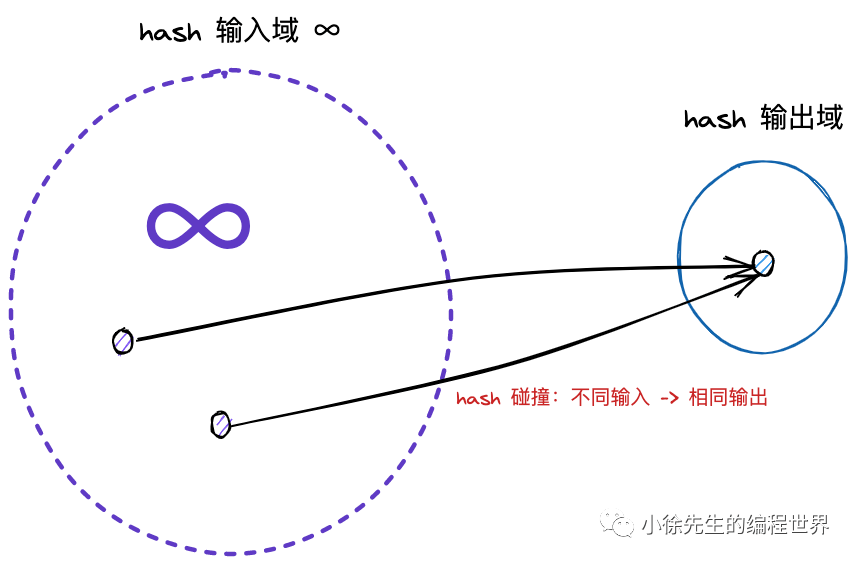

## 桶数组结构

map 中，会通过长度为 2 的整数次幂的桶数组进行 key-value 对的存储：

（1）每个桶固定可以存放 8 个 key-value 对；

（2）倘若超过 8 个 key-value 对打到桶数组的同一个索引当中，此时会通过创建桶链表的方式来化解这一问题。

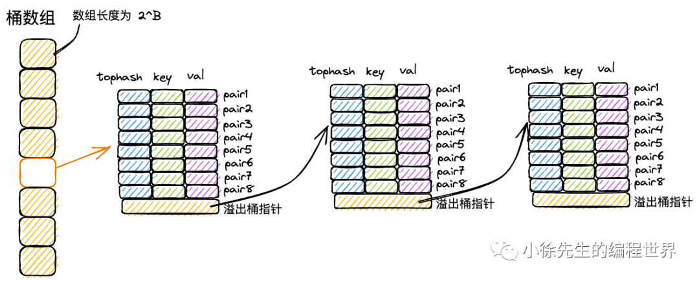

### 桶数组的设计优势

1. **2 的幂次长度**：便于使用位运算进行取模操作，提高性能
2. **固定桶容量**：每个桶存储 8 个元素，在内存局部性和查找效率间取得平衡
3. **溢出桶机制**：通过链表解决哈希冲突，保证数据完整性

## 拉链法解决 Hash 冲突

首先，由于 hash 冲突的存在，不同 key 可能存在相同的 hash 值；

再者，hash 值会对桶数组长度取模，因此不同 hash 值可能被打到同一个桶中。

综上，不同的 key-value 可能被映射到 map 的同一个桶当中。

此时最经典的解决手段分为两种：拉链法和开放寻址法。

### 拉链法

拉链法中，将命中同一个桶的元素通过链表的形式进行链接，因此很便于动态扩展。

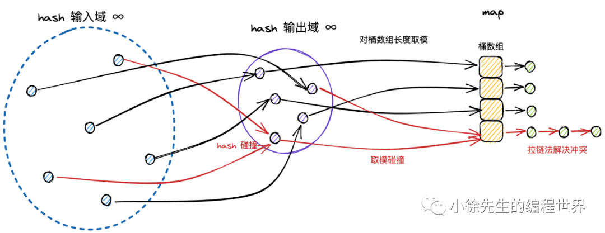

### 开放寻址法

开放寻址法中，在插入新条目时，会基于一定的探测策略持续寻找，直到找到一个可用于存放数据的空位为止。

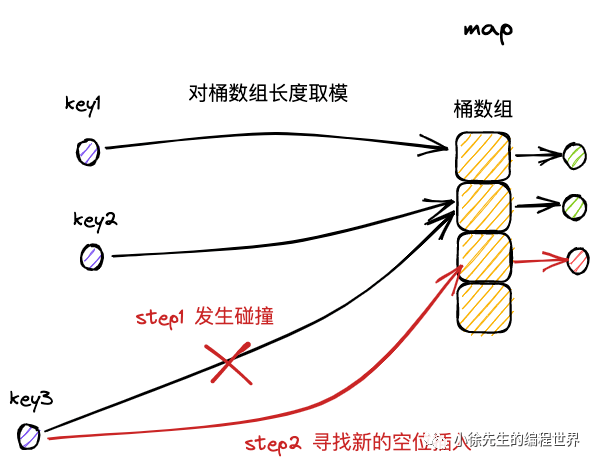

### 两种方法的优劣对比

| 方法       | 优点                                                                                    | 缺点                         |
| ---------- | --------------------------------------------------------------------------------------- | ---------------------------- |
| 拉链法     | 简单常用；无需预先为元素分配内存                                                        | 需要额外指针空间；内存不连续 |
| 开放寻址法 | 无需额外的指针用于链接元素；内存地址完全连续，可以基于局部性原理，充分利用 CPU 高速缓存 | 需要预分配内存；删除操作复杂 |

### Go Map 的混合策略

在 map 解决 hash/分桶冲突问题时，实际上结合了拉链法和开放寻址法两种思路。以 map 的插入写流程为例，进行思路阐述：

（1）桶数组中的每个桶，严格意义上是一个单向桶链表，以桶为节点进行串联；

（2）每个桶固定可以存放 8 个 key-value 对；

（3）当 key 命中一个桶时，首先根据开放寻址法，在桶的 8 个位置中寻找空位进行插入；

（4）倘若桶的 8 个位置都已被占满，则基于桶的溢出桶指针，找到下一个桶，重复第（3）步；

（5）倘若遍历到链表尾部，仍未找到空位，则基于拉链法，在桶链表尾部续接新桶，并插入 key-value 对。

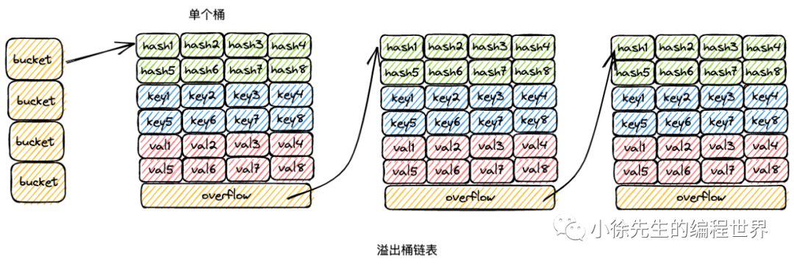

## 扩容优化性能

倘若 map 的桶数组长度固定不变，那么随着 key-value 对数量的增长，当一个桶下挂载的 key-value 达到一定的量级，此时操作的时间复杂度会趋于线性，无法满足诉求。

因此在实现上，map 桶数组的长度会随着 key-value 对数量的变化而实时调整，以保证每个桶内的 key-value 对数量始终控制在常量级别，满足各项操作为 O(1) 时间复杂度的要求。

### 扩容机制核心点

（1）扩容分为增量扩容和等量扩容；

（2）当桶内 key-value 总数/桶数组长度 > 6.5 时发生增量扩容，桶数组长度增长为原值的两倍；

（3）当桶内溢出桶数量大于等于 2^B 时（B 为桶数组长度的指数，B 最大取 15），发生等量扩容，桶的长度保持为原值；

（4）采用渐进扩容的方式，当桶被实际操作到时，由使用者负责完成数据迁移，避免因为一次性的全量数据迁移引发性能抖动。

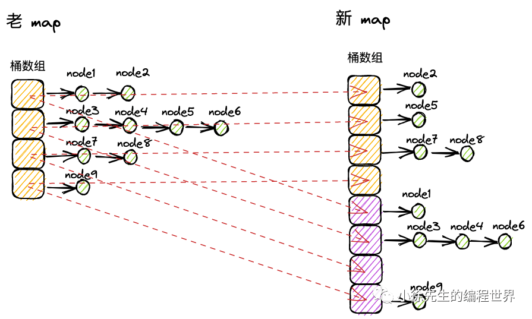

## 核心数据结构

### hmap 结构

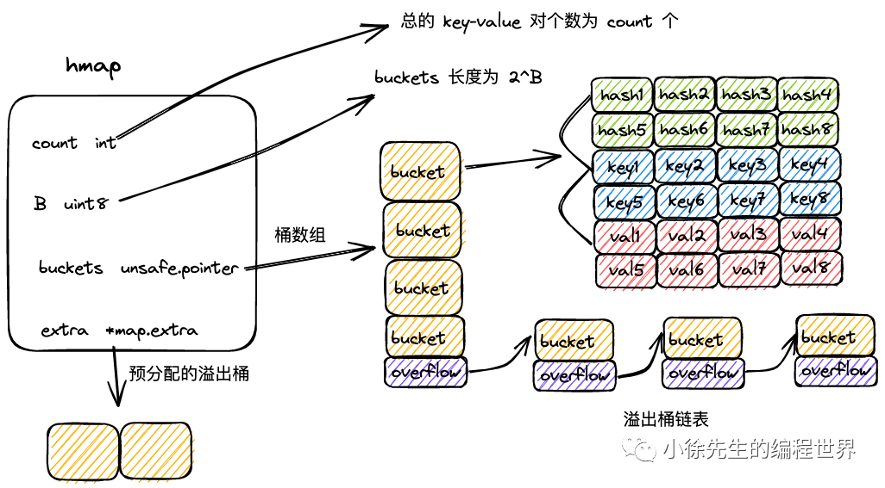

```go
type hmap struct {
	count      int             // map 中的 key-value 总数
	flags      uint8           // map 状态标识，可以标识出 map 是否被 goroutine 并发读写
	B          uint8           // 桶数组长度的指数，桶数组长度为 2^B
	noverflow  uint16          // map 中溢出桶的数量
	hash0      uint32          // hash 随机因子，生成 key 的 hash 值时会使用到
	buckets    unsafe.Pointer  // 桶数组
	oldbuckets unsafe.Pointer  // 扩容过程中老的桶数组
	nevacuate  uintptr         // 扩容时的进度标识，index 小于 nevacuate 的桶都已经由老桶转移到新桶中
	extra      *mapextra       // 预申请的溢出桶
}
```

### mapextra 结构

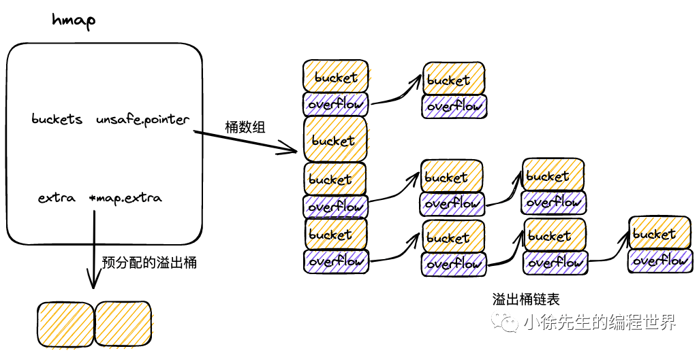

```go
type mapextra struct {
	overflow     *[]*bmap  // 供桶数组 buckets 使用的溢出桶
	oldoverflow  *[]*bmap  // 扩容流程中，供老桶数组 oldBuckets 使用的溢出桶
	nextOverflow *bmap     // 下一个可用的溢出桶
}
```

在 map 初始化时，倘若容量过大，会提前申请好一批溢出桶，以供后续使用，这部分溢出桶存放在 hmap.mapextra 当中。

### bmap 结构

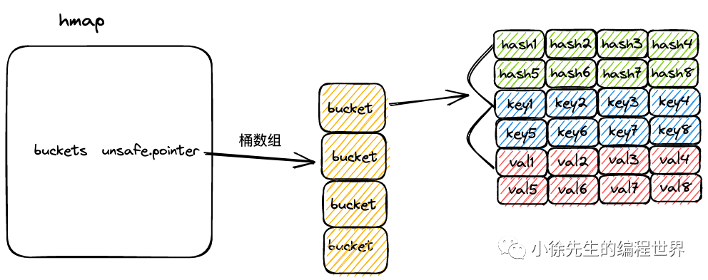

```go
const bucketCnt = 8

type bmap struct {
	tophash [bucketCnt]uint8  // 每个key的高8位hash值
	// keys and values are not explicitly defined here but are part of the memory layout
	// overflow is also part of the memory layout, typically after keys and values
}
```

**bmap 特点：**

（1）bmap 就是 map 中的桶，可以存储 8 组 key-value 对的数据，以及一个指向下一个溢出桶的指针；

（2）每组 key-value 对数据包含 key 高 8 位 hash 值 tophash，key 和 val 三部分；

（3）在代码层面只展示了 tophash 部分，但由于 tophash、key 和 val 的数据长度固定，因此可以通过内存地址偏移的方式寻找到后续的 key 数组、val 数组以及溢出桶指针；

**完整的 bmap 概念结构：**

```go
// Conceptual representation of a bmap with explicit fields
type bmap_conceptual struct {
	tophash  [bucketCnt]uint8    // 高8位hash值数组
	keys     [bucketCnt]KeyType  // key数组
	values   [bucketCnt]ValType  // value数组
	overflow uintptr             // 指向下一个溢出桶的指针
}
```

## 内存布局优化

Go Map 的内存布局经过精心设计：

1. **tophash 数组在前**：便于快速比较，避免访问完整的 key
2. **key 和 value 分离存储**：提高内存访问效率
3. **溢出桶指针在末尾**：只有在需要时才访问

这种设计充分考虑了 CPU 缓存友好性和内存访问模式，是 Go Map 高性能的重要保障。

## 小结

Go Map 的核心原理体现了现代哈希表设计的精髓：

1. **高效的哈希算法**：保证良好的散列性和低冲突率
2. **优化的数据结构**：hmap、bmap、mapextra 三级结构协同工作
3. **混合冲突解决策略**：结合开放寻址法和拉链法的优势
4. **动态扩容机制**：保持负载因子在合理范围内
5. **内存布局优化**：充分利用 CPU 缓存提高性能

理解这些核心原理对于深入掌握 Go Map 的实现细节和性能特征至关重要。
