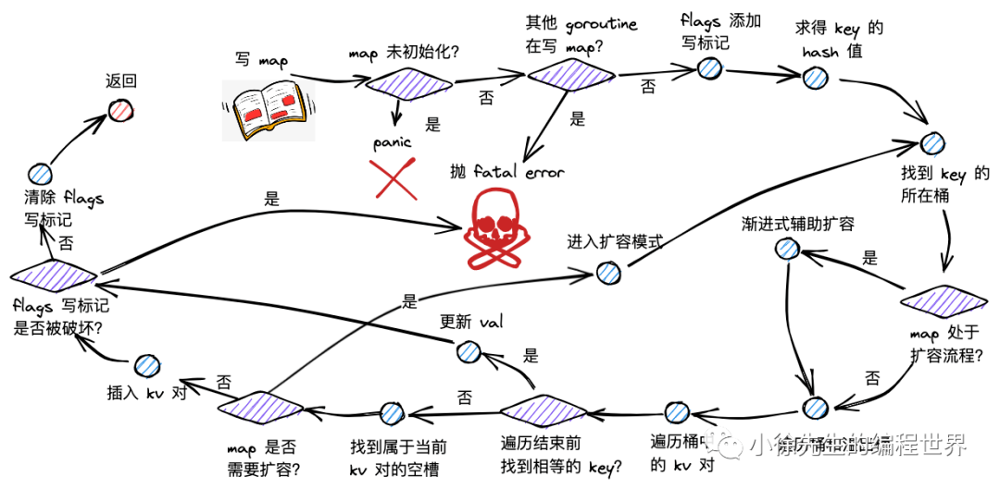

# Go Map 读写删除流程详解

## 读流程详解

### 读流程概述

map 读流程主要分为以下几步：

（1）根据 key 取 hash 值；

（2）根据 hash 值对桶数组取模，确定所在的桶；

（3）沿着桶链表依次遍历各个桶内的 key-value 对；

（4）命中相同的 key，则返回 value；倘若 key 不存在，则返回零值。

map 读操作最终会走进 runtime/map.go 的 mapaccess 方法中。

### mapaccess 方法源码详解

```go
func mapaccess1(t *maptype, h *hmap, key unsafe.Pointer) unsafe.Pointer {
	if h == nil || h.count == 0 {
		return unsafe.Pointer(&zeroVal[0])
	}
	if h.flags&hashWriting != 0 {
		fatal("concurrent map read and map write")
	}

	hash := t.hasher(key, uintptr(h.hash0))
	m := bucketMask(h.B)
	b := (*bmap)(add(h.buckets, (hash&m)*uintptr(t.bucketsize)))

	if c := h.oldbuckets; c != nil {
		if !h.sameSizeGrow() {
			m >>= 1
		}
		oldb := (*bmap)(add(c, (hash&m)*uintptr(t.bucketsize)))
		if !evacuated(oldb) {
			b = oldb
		}
	}

	top := tophash(hash)
bucketloop:
	for ; b != nil; b = b.overflow(t) {
		for i := uintptr(0); i < bucketCnt; i++ {
			if b.tophash[i] != top {
				if b.tophash[i] == emptyRest {
					break bucketloop
				}
				continue
			}
			k := add(unsafe.Pointer(b), dataOffset+i*uintptr(t.keysize))
			if t.indirectkey() {
				k = *((*unsafe.Pointer)(k))
			}
			if t.key.equal(key, k) {
				e := add(unsafe.Pointer(b), dataOffset+bucketCnt*uintptr(t.keysize)+i*uintptr(t.elemsize))
				if t.indirectelem() {
					e = *((*unsafe.Pointer)(e))
				}
				return e
			}
		}
	}
	return unsafe.Pointer(&zeroVal[0])
}
```

### 读流程详细步骤

#### 1. 边界条件检查

```go
if h == nil || h.count == 0 {
	return unsafe.Pointer(&zeroVal[0])
}
```

倘若 map 未初始化，或此时存在 key-value 对数量为 0，直接返回零值。

#### 2. 并发安全检查

```go
if h.flags&hashWriting != 0 {
	fatal("concurrent map read and map write")
}
```

倘若发现存在其他 goroutine 在写 map，直接抛出并发读写的 fatal error。其中，并发写标记，位于 hmap.flags 的第 3 个 bit 位。

#### 3. 哈希计算与桶定位

```go
hash := t.hasher(key, uintptr(h.hash0))
m := bucketMask(h.B)
b := (*bmap)(add(h.buckets, (hash&m)*uintptr(t.bucketsize)))
```

通过 maptype.hasher() 方法计算得到 key 的 hash 值，并对桶数组长度取模，取得对应的桶。

`bucketMask` 方法会根据 B 求得桶数组长度 - 1 的值，用于后续的 & 运算，实现取模的效果：

```go
func bucketMask(b uint8) uintptr {
	return bucketShift(b) - 1
}
```

#### 4. 扩容期间的特殊处理

```go
if c := h.oldbuckets; c != nil {
	if !h.sameSizeGrow() {
		m >>= 1
	}
	oldb := (*bmap)(add(c, (hash&m)*uintptr(t.bucketsize)))
	if !evacuated(oldb) {
		b = oldb
	}
}
```

在取桶时，会关注当前 map 是否处于扩容的流程，倘若是的话，需要在老的桶数组 oldBuckets 中取桶，通过 evacuated 方法判断桶数据是已迁到新桶还是仍存留在老桶。

#### 5. tophash 优化

```go
top := tophash(hash)
```

取 key hash 值的高 8 位值 top。倘若该值 < 5，会累加 5，以避开 0 ~ 4 的取值，因为这几个值会用于枚举，具有特殊的含义。

#### 6. 桶链表遍历

```go
bucketloop:
for ; b != nil; b = b.overflow(t) {
	for i := uintptr(0); i < bucketCnt; i++ {
		if b.tophash[i] != top {
			if b.tophash[i] == emptyRest {
				break bucketloop
			}
			continue
		}
		// 找到匹配的tophash，进一步比较完整key
		k := add(unsafe.Pointer(b), dataOffset+i*uintptr(t.keysize))
		if t.indirectkey() {
			k = *((*unsafe.Pointer)(k))
		}
		if t.key.equal(key, k) {
			e := add(unsafe.Pointer(b), dataOffset+bucketCnt*uintptr(t.keysize)+i*uintptr(t.elemsize))
			if t.indirectelem() {
				e = *((*unsafe.Pointer)(e))
			}
			return e
		}
	}
}
```

开启两层 for 循环进行遍历流程：

- 外层：基于桶链表，依次遍历首个桶和后续的每个溢出桶
- 内层：依次遍历一个桶内的 key-value 对

## 写流程详解



### 写流程概述

map 写流程主要分为以下几步：

（1）根据 key 取 hash 值；

（2）根据 hash 值对桶数组取模，确定所在的桶；

（3）倘若 map 处于扩容，则迁移命中的桶，帮助推进渐进式扩容；

（4）沿着桶链表依次遍历各个桶内的 key-value 对；

（5）倘若命中相同的 key，则对 value 进行更新；

（6）倘若 key 不存在，则插入 key-value 对；

（7）倘若发现 map 达成扩容条件，则会开启扩容模式，并重新返回第（2）步。

### mapassign 方法核心实现

```go
func mapassign(t *maptype, h *hmap, key unsafe.Pointer) unsafe.Pointer {
	if h == nil {
		panic("assignment to entry in nil map")
	}
	if h.flags&hashWriting != 0 {
		fatal("concurrent map writes")
	}

	hash := t.hasher(key, uintptr(h.hash0))
	h.flags ^= hashWriting

	if h.buckets == nil {
		h.buckets = newobject(t.bucket)
	}

again:
	bucket := hash & bucketMask(h.B)
	if h.growing() {
		growWork(t, h, bucket)
	}
	b := (*bmap)(add(h.buckets, bucket*uintptr(t.bucketsize)))
	top := tophash(hash)

	var inserti *uint8
	var insertk unsafe.Pointer
	var elem unsafe.Pointer

bucketloop:
	for {
		for i := uintptr(0); i < bucketCnt; i++ {
			if b.tophash[i] != top {
				if isEmpty(b.tophash[i]) && inserti == nil {
					inserti = &b.tophash[i]
					insertk = add(unsafe.Pointer(b), dataOffset+i*uintptr(t.keysize))
					elem = add(unsafe.Pointer(b), dataOffset+bucketCnt*uintptr(t.keysize)+i*uintptr(t.elemsize))
				}
				if b.tophash[i] == emptyRest {
					break bucketloop
				}
				continue
			}
			k := add(unsafe.Pointer(b), dataOffset+i*uintptr(t.keysize))
			if t.indirectkey() {
				k = *((*unsafe.Pointer)(k))
			}
			if !t.key.equal(key, k) {
				continue
			}
			// key已存在，更新操作
			if t.needkeyupdate() {
				typedmemmove(t.key, k, key)
			}
			elem = add(unsafe.Pointer(b), dataOffset+bucketCnt*uintptr(t.keysize)+i*uintptr(t.elemsize))
			goto done
		}
		ovf := b.overflow(t)
		if ovf == nil {
			break
		}
		b = ovf
	}

	// 检查是否需要扩容
	if !h.growing() && (overLoadFactor(h.count+1, h.B) || tooManyOverflowBuckets(h.noverflow, h.B)) {
		hashGrow(t, h)
		goto again
	}

	// 分配新的插入位置
	if inserti == nil {
		newb := h.newoverflow(t, b)
		inserti = &newb.tophash[0]
		insertk = add(unsafe.Pointer(newb), dataOffset)
		elem = add(insertk, bucketCnt*uintptr(t.keysize))
	}

	// 插入新的key-value对
	if t.indirectkey() {
		kmem := newobject(t.key)
		*(*unsafe.Pointer)(insertk) = kmem
		insertk = kmem
	}
	if t.indirectelem() {
		vmem := newobject(t.elem)
		*(*unsafe.Pointer)(elem) = vmem
	}
	typedmemmove(t.key, insertk, key)
	*inserti = top
	h.count++

done:
	if h.flags&hashWriting == 0 {
		fatal("concurrent map writes")
	}
	h.flags &^= hashWriting
	if t.indirectelem() {
		elem = *((*unsafe.Pointer)(elem))
	}
	return elem
}
```

### 写流程关键步骤

#### 1. 写标记设置

```go
h.flags ^= hashWriting
```

通过异或位运算，将 map.flags 的第 3 个 bit 位置为 1，添加写标记。

#### 2. 扩容协助

```go
if h.growing() {
	growWork(t, h, bucket)
}
```

倘若发现当前 map 正处于扩容过程，则帮助其渐进扩容。

#### 3. 空位记录

在遍历桶的过程中，会记录第一个可用的空位：

```go
if isEmpty(b.tophash[i]) && inserti == nil {
	inserti = &b.tophash[i]
	insertk = add(unsafe.Pointer(b), dataOffset+i*uintptr(t.keysize))
	elem = add(unsafe.Pointer(b), dataOffset+bucketCnt*uintptr(t.keysize)+i*uintptr(t.elemsize))
}
```

#### 4. 扩容条件检查

```go
if !h.growing() && (overLoadFactor(h.count+1, h.B) || tooManyOverflowBuckets(h.noverflow, h.B)) {
	hashGrow(t, h)
	goto again
}
```

如果没有找到已存在的 key 且需要插入新元素时，检查是否需要扩容。

## 删除流程详解

### 删除流程概述

map 删除 kv 对流程主要分为以下几步：

（1）根据 key 取 hash 值；

（2）根据 hash 值对桶数组取模，确定所在的桶；

（3）倘若 map 处于扩容，则迁移命中的桶，帮助推进渐进式扩容；

（4）沿着桶链表依次遍历各个桶内的 key-value 对；

（5）倘若命中相同的 key，删除对应的 key-value 对；并将当前位置的 tophash 置为 emptyOne，表示为空；

（6）倘若当前位置为末位，或者下一个位置的 tophash 为 emptyRest，则沿当前位置向前遍历，将毗邻的 emptyOne 统一更新为 emptyRest。

### mapdelete 方法实现

```go
func mapdelete(t *maptype, h *hmap, key unsafe.Pointer) {
	if h == nil || h.count == 0 {
		return
	}
	if h.flags&hashWriting != 0 {
		fatal("concurrent map writes")
	}

	hash := t.hasher(key, uintptr(h.hash0))
	h.flags ^= hashWriting

	bucket := hash & bucketMask(h.B)
	if h.growing() {
		growWork(t, h, bucket)
	}
	b := (*bmap)(add(h.buckets, bucket*uintptr(t.bucketsize)))
	bOrig := b
	top := tophash(hash)

search:
	for ; b != nil; b = b.overflow(t) {
		for i := uintptr(0); i < bucketCnt; i++ {
			if b.tophash[i] != top {
				if b.tophash[i] == emptyRest {
					break search
				}
				continue
			}
			k := add(unsafe.Pointer(b), dataOffset+i*uintptr(t.keysize))
			k2 := k
			if t.indirectkey() {
				k2 = *((*unsafe.Pointer)(k2))
			}
			if !t.key.equal(key, k2) {
				continue
			}

			// 清理key
			if t.indirectkey() {
				*(*unsafe.Pointer)(k) = nil
			} else if t.key.ptrdata != 0 {
				memclrHasPointers(k, t.key.size)
			}

			// 清理value
			e := add(unsafe.Pointer(b), dataOffset+bucketCnt*uintptr(t.keysize)+i*uintptr(t.elemsize))
			if t.indirectelem() {
				*(*unsafe.Pointer)(e) = nil
			} else if t.elem.ptrdata != 0 {
				memclrHasPointers(e, t.elem.size)
			} else {
				memclrNoHeapPointers(e, t.elem.size)
			}

			b.tophash[i] = emptyOne

			// 优化空槽标记
			if i == bucketCnt-1 {
				if b.overflow(t) != nil && b.overflow(t).tophash[0] != emptyRest {
					goto notLast
				}
			} else {
				if b.tophash[i+1] != emptyRest {
					goto notLast
				}
			}

			// 向前合并空槽
			for {
				b.tophash[i] = emptyRest
				if i == 0 {
					if b == bOrig {
						break
					}
					// 找到前一个桶
					c := b
					for b = bOrig; b.overflow(t) != c; b = b.overflow(t) {
					}
					i = bucketCnt - 1
				} else {
					i--
				}
				if b.tophash[i] != emptyOne {
					break
				}
			}
		notLast:
			h.count--
			if h.count == 0 {
				h.hash0 = fastrand()
			}
			break search
		}
	}
	if h.flags&hashWriting == 0 {
		fatal("concurrent map writes")
	}
	h.flags &^= hashWriting
}
```

### 删除流程关键特性

#### 1. 空槽标记优化

删除操作使用两种空槽标记：

- `emptyOne`：单个空槽
- `emptyRest`：连续空槽的结束标记

#### 2. 向前合并机制

删除元素后，会向前遍历，将连续的 `emptyOne` 标记合并为 `emptyRest`，这样可以在查找时提前终止，提高性能。

#### 3. 内存清理

根据 key 和 value 的类型特性，选择合适的内存清理方式：

- 指针类型：设置为 nil
- 包含指针的类型：调用`memclrHasPointers`
- 不包含指针的类型：调用`memclrNoHeapPointers`

## 性能优化技巧

### tophash 快速比较

使用 hash 值的高 8 位作为快速比较，避免完整 key 比较：

1. 首先比较 tophash，不匹配直接跳过
2. tophash 匹配后才进行完整 key 比较
3. 减少了大部分不必要的 key 比较操作

### 内存布局优化

1. **数据局部性**：key 和 value 分别连续存储，提高缓存命中率
2. **对齐优化**：数据结构按照字长对齐，提高访问效率
3. **预取优化**：连续的内存布局有利于 CPU 预取

### 渐进式扩容

1. **分摊开销**：将扩容开销分摊到多次操作中
2. **避免阻塞**：避免单次操作耗时过长
3. **双数组设计**：新老数组并存，支持渐进迁移

## 面试重点

### 常见面试题

**Q1: Go map 的读写删除操作时间复杂度是多少？**

A:

- **平均情况**：O(1)
- **最坏情况**：O(n)，当所有 key 都哈希到同一个桶时
- **实际表现**：由于负载因子控制和扩容机制，实际性能接近 O(1)

**Q2: Go map 在扩容过程中如何处理读写操作？**

A:

- **渐进式扩容**：不会一次性迁移所有数据
- **双数组查找**：读操作会同时检查新老数组
- **协助迁移**：写操作会协助迁移对应的桶
- **无阻塞**：操作不会被扩容阻塞

**Q3: tophash 的作用是什么？**

A:

- **快速过滤**：避免不必要的完整 key 比较
- **状态标记**：标记空槽、迁移状态等信息
- **性能优化**：减少内存访问和比较操作

理解这些读写删除流程的细节，有助于更好地使用和优化 Go 语言中的 map 操作。
