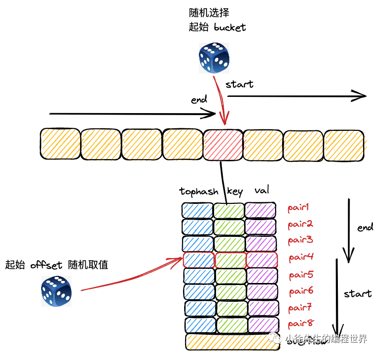

# Go Map 遍历机制解析

## 遍历机制概述

Go 语言中 map 的遍历是通过 range 关键字实现的，其底层实现涉及复杂的迭代器机制。与其他语言不同，Go map 的遍历顺序是**随机的**，这是有意设计的特性。

## 迭代器数据结构

### hiter 结构体

```go
type hiter struct {
	key         unsafe.Pointer  // 指向遍历得到 key 的指针
	elem        unsafe.Pointer  // 指向遍历得到 value 的指针
	t           *maptype        // map 类型，包含了 key、value 类型大小等信息
	h           *hmap           // map 的指针
	buckets     unsafe.Pointer  // map 的桶数组
	bptr        *bmap           // 当前遍历到的桶
	overflow    *[]*bmap        // 新老桶数组对应的溢出桶
	oldoverflow *[]*bmap        // 老桶数组的溢出桶
	startBucket uintptr         // 遍历起始位置的桶索引
	offset      uint8           // 遍历起始位置的 key-value 对索引号
	wrapped     bool            // 遍历是否穿越桶数组尾端回到头部了
	B           uint8           // 桶数组的长度指数
	i           uint8           // 当前遍历到的 key-value 对在桶中的索引
	bucket      uintptr         // 当前遍历到的桶
	checkBucket uintptr         // 因为扩容流程的存在，需要额外检查的桶
}
```

hiter 是遍历 map 时用于存放临时数据的迭代器，它记录了遍历过程中的所有状态信息。

### 字段详解

- **key/elem**：指向当前遍历到的 key-value 对
- **t/h**：map 的类型信息和实例指针
- **buckets**：当前使用的桶数组
- **bptr**：当前正在遍历的桶
- **startBucket/offset**：随机化的起始位置
- **wrapped**：是否已经绕了一圈
- **bucket/i**：当前遍历位置
- **checkBucket**：扩容时需要检查的桶

## 初始化流程 - mapiterinit



map 遍历流程开始时，首先会走进 runtime/map.go 的 mapiterinit() 方法，此时会创建 map 迭代器 hiter，并且通过取随机数的方式，决定遍历的起始桶号以及起始 key-value 对索引号。

### mapiterinit 源码实现

```go
func mapiterinit(t *maptype, h *hmap, it *hiter) {
	it.t = t
	if h == nil || h.count == 0 {
		return
	}

	it.h = h
	it.B = h.B
	it.buckets = h.buckets
	if t.bucket.ptrdata == 0 {
		h.createOverflow()
		it.overflow = h.extra.overflow
		it.oldoverflow = h.extra.oldoverflow
	}

	// 决定起始位置 - 关键的随机化逻辑
	var r uintptr
	r = uintptr(fastrand())  // 获取随机数

	it.startBucket = r & bucketMask(h.B)           // 确定起始桶
	it.offset = uint8(r >> h.B & (bucketCnt - 1))  // 确定桶内起始偏移

	// 初始化迭代器状态
	it.bucket = it.startBucket

	// 标记存在迭代器
	if old := h.flags; old&(iterator|oldIterator) != iterator|oldIterator {
		atomic.Or8(&h.flags, iterator|oldIterator)
	}

	mapiternext(it)  // 开始遍历
}
```

### 随机化起始位置

Go map 遍历的随机性主要体现在起始位置的随机化：

```go
var r uintptr
r = uintptr(fastrand())
it.startBucket = r & bucketMask(h.B)           // 随机起始桶
it.offset = uint8(r >> h.B & (bucketCnt - 1))  // 桶内随机起始位置
```

这种设计确保了：

1. **起始桶随机**：从随机的桶开始遍历
2. **桶内起始位置随机**：即使在同一个桶内，起始位置也是随机的
3. **不可预测性**：两次遍历的顺序几乎不可能相同

## 遍历执行流程 - mapiternext

### mapiternext 核心实现

```go
func mapiternext(it *hiter) {
	h := it.h
	if h.flags&hashWriting != 0 {
		fatal("concurrent map iteration and map write")
	}
	t := it.t
	bucket := it.bucket
	b := it.bptr
	i := it.i
	checkBucket := it.checkBucket

next:
	if b == nil {
		// 检查是否完成一轮遍历
		if bucket == it.startBucket && it.wrapped {
			it.key = nil
			it.elem = nil
			return
		}

		// 处理扩容期间的遍历
		if h.growing() && it.B == h.B {
			oldbucket := bucket & it.h.oldbucketmask()
			b = (*bmap)(add(h.oldbuckets, oldbucket*uintptr(t.bucketsize)))
			if !evacuated(b) {
				checkBucket = bucket
			} else {
				b = (*bmap)(add(it.buckets, bucket*uintptr(t.bucketsize)))
				checkBucket = noCheck
			}
		} else {
			b = (*bmap)(add(it.buckets, bucket*uintptr(t.bucketsize)))
			checkBucket = noCheck
		}

		bucket++
		if bucket == bucketShift(it.B) {
			bucket = 0
			it.wrapped = true
		}
		i = 0
	}

	// 遍历桶内的 key-value 对
	for ; i < bucketCnt; i++ {
		offi := (i + it.offset) & (bucketCnt - 1)  // 应用随机偏移
		if isEmpty(b.tophash[offi]) || b.tophash[offi] == evacuatedEmpty {
			continue
		}

		k := add(unsafe.Pointer(b), dataOffset+uintptr(offi)*uintptr(t.keysize))
		if t.indirectkey() {
			k = *((*unsafe.Pointer)(k))
		}
		e := add(unsafe.Pointer(b), dataOffset+bucketCnt*uintptr(t.keysize)+uintptr(offi)*uintptr(t.elemsize))

		// 扩容期间的特殊检查
		if checkBucket != noCheck && !h.sameSizeGrow() {
			hash := t.hasher(k, uintptr(h.hash0))
			if (hash>>it.h.B)&1 != (checkBucket>>it.h.B)&1 {
				continue
			}
		}

		// 处理已迁移的数据
		if (b.tophash[offi] != evacuatedX && b.tophash[offi] != evacuatedY) ||
			!(t.reflexivekey() || t.key.equal(k, k)) {
			it.key = k
			if t.indirectelem() {
				e = *((*unsafe.Pointer)(e))
			}
			it.elem = e
		} else {
			// 查找新表中的当前值
			rk, re := mapaccessK(t, h, k)
			if rk == nil {
				continue  // key 已被删除
			}
			it.key = rk
			it.elem = re
		}

		// 更新迭代器状态
		it.bucket = bucket
		if it.bptr != b {
			it.bptr = b
		}
		it.i = i + 1
		it.checkBucket = checkBucket
		return
	}

	// 移动到下一个溢出桶
	b = b.overflow(t)
	i = 0
	goto next
}
```

### 遍历流程关键点

#### 1. 并发安全检查

```go
if h.flags&hashWriting != 0 {
	fatal("concurrent map iteration and map write")
}
```

遍历时发现其他 goroutine 在并发写，直接抛出 fatal error。

#### 2. 桶内随机偏移

```go
offi := (i + it.offset) & (bucketCnt - 1)
```

即使在同一个桶内，也会应用随机偏移，进一步增强随机性。

#### 3. 扩容期间的处理

在扩容期间遍历需要特别处理：

- 检查数据是在老桶还是新桶
- 对于未迁移的数据，从老桶读取
- 对于已迁移的数据，从新桶读取

#### 4. 数据一致性保证

对于正在迁移的数据，通过以下机制保证一致性：

- 检查 tophash 状态标记
- 对于已迁移的数据，重新从新表查找
- 确保返回最新的数据

## 随机化的实现机制

### 为什么要随机化

Go 有意设计了随机化的遍历顺序，原因包括：

1. **避免依赖**：防止程序依赖特定的遍历顺序
2. **性能考虑**：哈希表本身就不保证顺序
3. **安全性**：防止某些攻击手段利用固定的遍历顺序
4. **向前兼容**：保证未来优化不会破坏现有程序

### 随机化的多个层次

1. **起始桶随机**：`startBucket = r & bucketMask(h.B)`
2. **桶内偏移随机**：`offset = uint8(r >> h.B & (bucketCnt - 1))`
3. **每次偏移应用**：`offi = (i + it.offset) & (bucketCnt - 1)`

### 随机性分析

```go
// 示例：遍历顺序的随机性
func demonstrateRandomness() {
	m := map[int]int{1: 1, 2: 2, 3: 3, 4: 4, 5: 5}

	fmt.Println("第一次遍历:")
	for k, v := range m {
		fmt.Printf("%d:%d ", k, v)
	}

	fmt.Println("\n第二次遍历:")
	for k, v := range m {
		fmt.Printf("%d:%d ", k, v)
	}
	// 输出顺序很可能不同
}
```

## 扩容期间的遍历处理

### 双数组遍历策略

在扩容期间，map 同时维护新老两个桶数组，遍历需要特殊处理：

```go
if h.growing() && it.B == h.B {
	// 在老桶中查找
	oldbucket := bucket & it.h.oldbucketmask()
	b = (*bmap)(add(h.oldbuckets, oldbucket*uintptr(t.bucketsize)))
	if !evacuated(b) {
		// 数据还在老桶中
		checkBucket = bucket
	} else {
		// 数据已迁移到新桶
		b = (*bmap)(add(it.buckets, bucket*uintptr(t.bucketsize)))
		checkBucket = noCheck
	}
}
```

### 数据一致性保证

1. **状态检查**：通过 evacuated 函数检查桶是否已迁移
2. **双重查找**：对于已迁移的数据，重新查找确保一致性
3. **版本控制**：通过 checkBucket 机制处理版本差异

## 性能优化考虑

### 迭代器状态管理

1. **最小状态**：迭代器只保存必要的状态信息
2. **懒加载**：只在需要时才计算下一个位置
3. **内存友好**：避免大量的临时对象分配

### 缓存友好的遍历

1. **连续访问**：尽可能连续访问内存
2. **预取优化**：利用 CPU 缓存预取机制
3. **局部性原理**：先遍历完一个桶再移动到下一个桶

## 面试重点问题

### Q1: Go map 遍历为什么是无序的？

**A:** Go map 遍历无序的原因：

1. **设计初衷**：故意设计为无序，防止程序依赖遍历顺序
2. **哈希特性**：哈希表本身不保证数据顺序
3. **随机化实现**：
   - 随机起始桶：`startBucket = r & bucketMask(h.B)`
   - 随机桶内偏移：`offset = uint8(r >> h.B & (bucketCnt - 1))`
4. **扩容影响**：扩容过程中数据重新分布

### Q2: 如何实现 map 的有序遍历？

**A:** 实现有序遍历的方法：

```go
// 方法1：收集key后排序
keys := make([]string, 0, len(m))
for k := range m {
	keys = append(keys, k)
}
sort.Strings(keys)

for _, k := range keys {
	fmt.Println(k, m[k])
}

// 方法2：使用有序容器
// 可以考虑使用 sync.Map 或第三方有序map库
```

### Q3: 遍历过程中修改 map 会发生什么？

**A:** 遍历过程中修改 map 的影响：

1. **写操作冲突**：会触发 `fatal("concurrent map iteration and map write")`
2. **读操作安全**：同时多个遍历是安全的
3. **避免方法**：
   - 先收集要修改的 key，遍历结束后再修改
   - 使用 channel 或其他同步机制
   - 创建新的 map 来保存修改结果

### Q4: 扩容期间遍历如何保证数据一致性？

**A:** 扩容期间的一致性保证机制：

1. **双数组查找**：同时检查新老桶数组
2. **迁移状态检查**：通过 tophash 标记判断数据位置
3. **重新查找机制**：对已迁移数据重新查找确保最新值
4. **渐进式迁移**：不会阻塞遍历操作

## 最佳实践建议

### 1. 不要依赖遍历顺序

```go
// ❌ 错误：依赖遍历顺序
func processMapInOrder(m map[string]int) {
	for k, v := range m {
		// 假设某种特定顺序进行处理
		if isFirstKey(k) { // 这种假设是错误的
			// ...
		}
	}
}

// ✅ 正确：显式排序
func processMapInOrder(m map[string]int) {
	keys := make([]string, 0, len(m))
	for k := range m {
		keys = append(keys, k)
	}
	sort.Strings(keys)

	for _, k := range keys {
		// 处理 m[k]
	}
}
```

### 2. 避免遍历时修改

```go
// ❌ 错误：遍历时修改
for k, v := range m {
	if shouldDelete(v) {
		delete(m, k)  // 会panic
	}
}

// ✅ 正确：先收集后处理
toDelete := make([]string, 0)
for k, v := range m {
	if shouldDelete(v) {
		toDelete = append(toDelete, k)
	}
}
for _, k := range toDelete {
	delete(m, k)
}
```

## 小结

Go map 的遍历机制体现了精心的设计：

1. **随机化策略**：多层次的随机化保证遍历顺序不可预测
2. **扩容兼容**：在扩容期间仍能正确遍历所有数据
3. **性能优化**：充分考虑缓存友好性和内存访问模式
4. **并发安全**：通过检测机制避免并发读写问题

理解这些遍历机制有助于更好地使用 Go map，避免常见的陷阱和错误。
