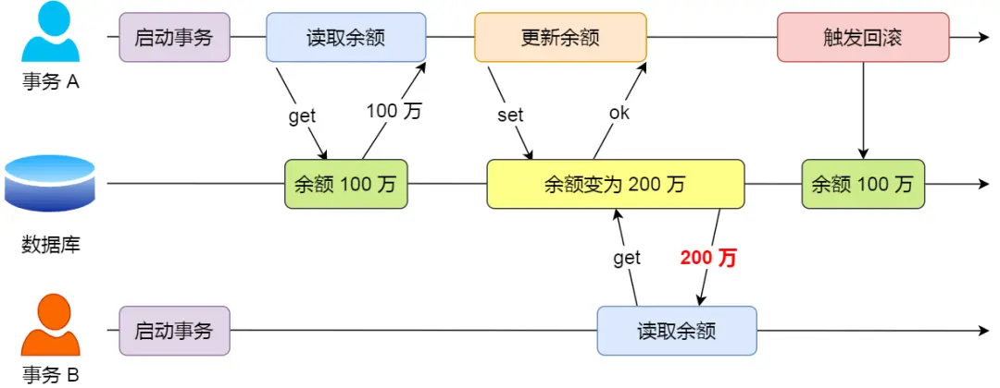
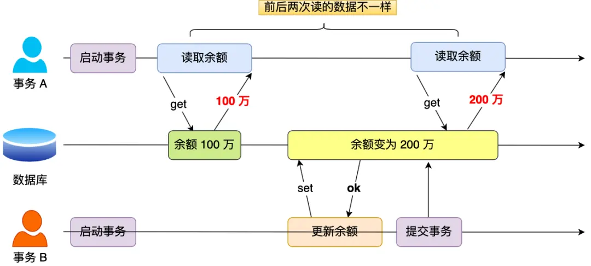
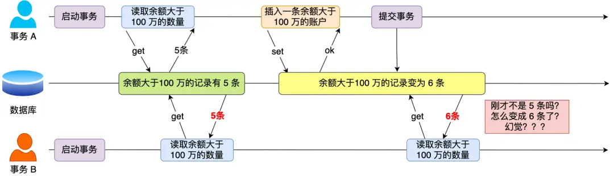
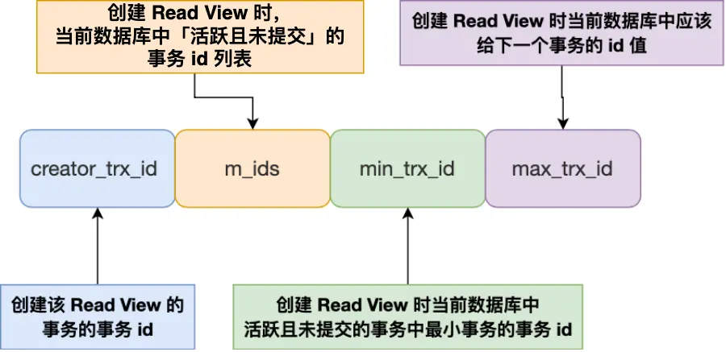
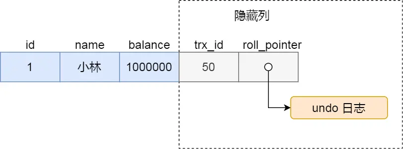
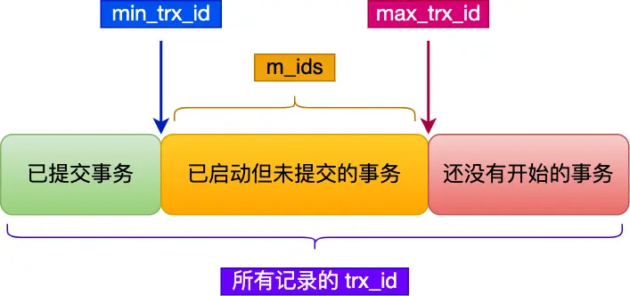
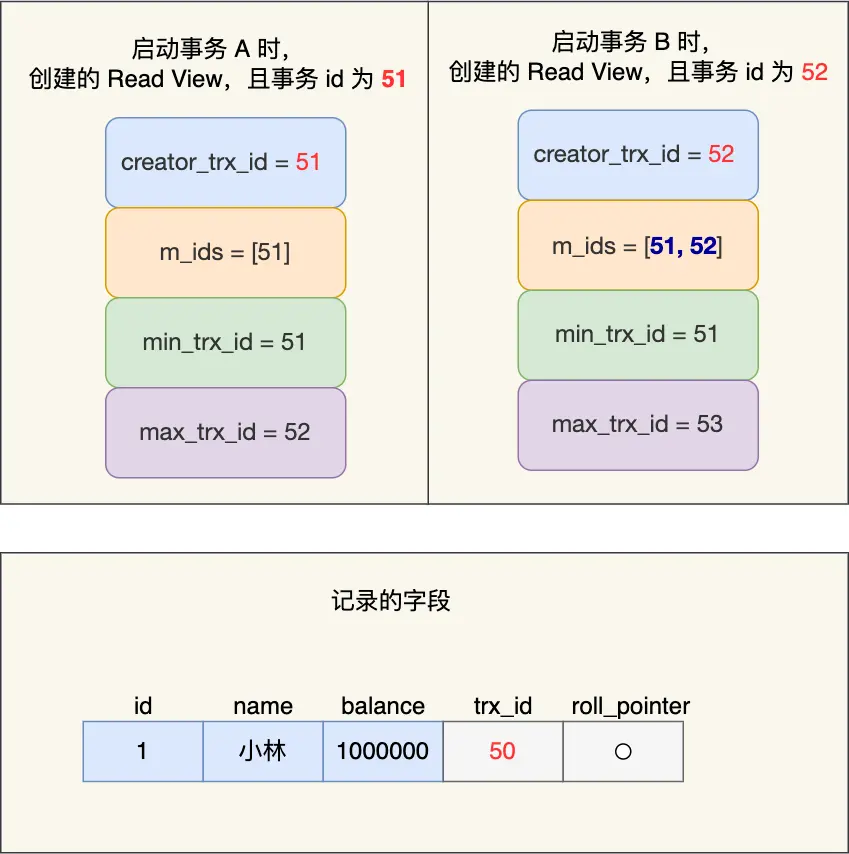
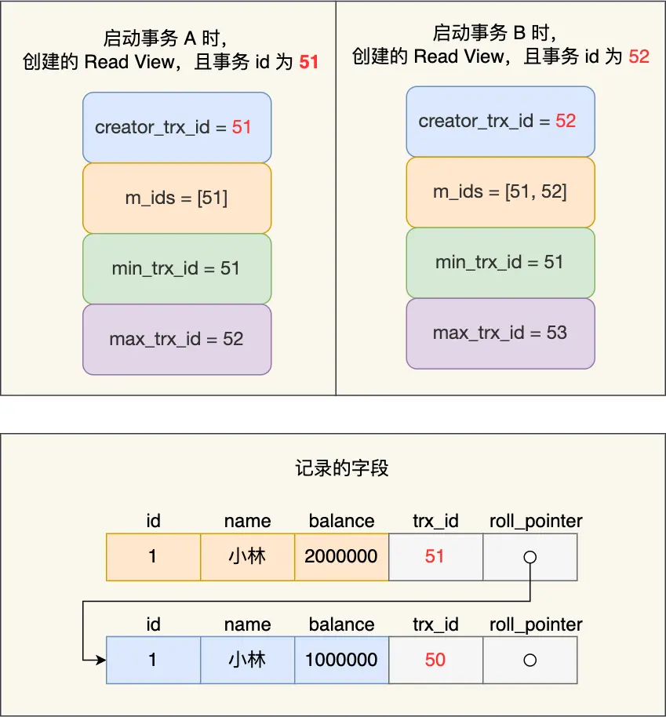
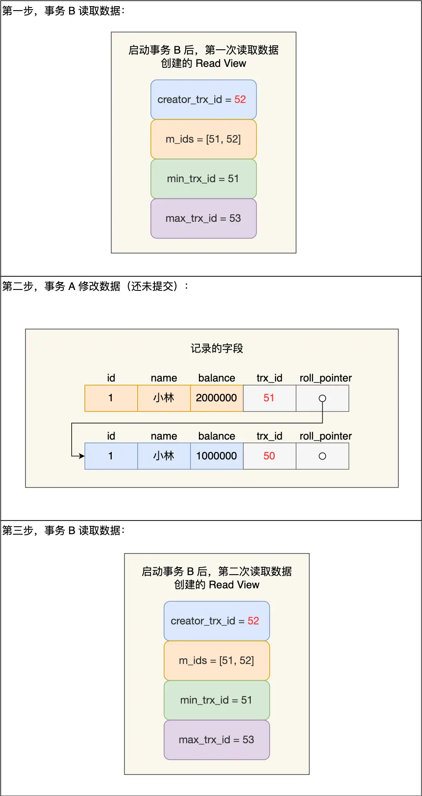
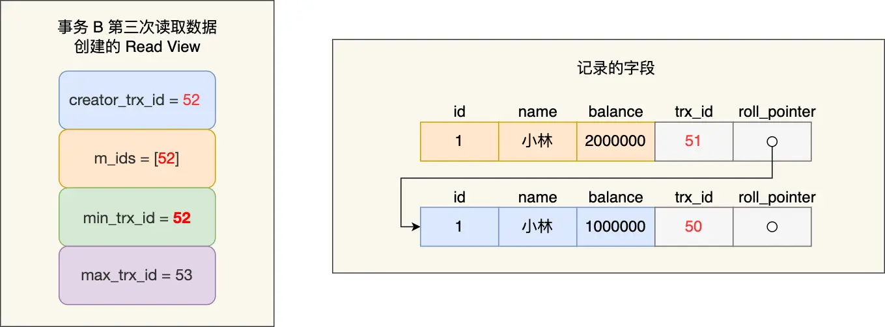

4. 读取B的账户余额
5. 给B的余额增加转账金额
6. 更新B的余额到数据库
```

如果在执行第3步之后系统突然崩溃，就会出现A账户已减去100元，但B账户没有增加相应金额的情况 —— **钱凭空消失了！**

为了解决这个问题，数据库提供了「**事务（Transaction）**」机制，保证一系列操作要么全部成功执行，要么全部回滚到初始状态，不会出现中间状态。

## 事务有哪些特性？

事务由数据库引擎实现，MySQL的InnoDB引擎支持事务，而MyISAM引擎不支持。事务必须遵守四个基本特性（ACID）：

| 特性 | 专业术语 | 通俗解释 | 生活例子 |
|------|---------|---------|---------|
| **原子性** | Atomicity | 事务中的所有操作要么全部完成，要么全部不完成 | 购物时，要么成功付款并获得商品，要么交易取消，不会出现付了钱没收到商品的情况 |
| **一致性** | Consistency | 事务前后，数据库从一个一致状态转换到另一个一致状态 | 转账后，无论成功或失败，A和B的总金额应保持不变，不会凭空增加或减少 |
| **隔离性** | Isolation | 多个事务并发执行时，彼此之间不会互相干扰 | 多人同时在网上商城购物，每个人的购物过程不会互相影响 |
| **持久性** | Durability | 事务一旦提交，对数据的修改就是永久的 | 银行转账成功后，即使系统崩溃，重启后你的转账记录依然存在 |

InnoDB引擎通过不同的技术保证这四个特性：

- **持久性**：通过 redo log（重做日志）实现
- **原子性**：通过 undo log（回滚日志）实现
- **隔离性**：通过 MVCC（多版本并发控制）或锁机制实现
- **一致性**：通过持久性 + 原子性 + 隔离性共同保证

本文将**重点介绍事务的隔离性**，这也是面试中最常被问到的知识点。

## 并行事务会引发什么问题？

MySQL服务器允许多个客户端同时连接，因此会同时处理多个事务。在没有适当隔离机制的情况下，会出现三种主要并发问题：

### 三种并发问题对比

| 问题类型 | 定义 | 发生条件 | 严重程度 |
|---------|------|---------|---------|
| **脏读** | 读到其他事务未提交的数据 | 事务A读取了事务B修改但未提交的数据，之后事务B回滚 | 最严重 |
| **不可重复读** | 同一事务内，前后读取同一数据得到不同结果 | 事务A先读取数据，事务B修改并提交该数据，事务A再次读取得到不同结果 | 中等 |
| **幻读** | 同一事务内，用相同条件查询得到不同数量的记录 | 事务A查询符合条件的记录，事务B插入/删除符合该条件的记录并提交，事务A再次查询得到不同数量的记录 | 较轻 |

下面通过图示来理解这些问题：

#### 脏读示例



如图所示，事务B读取到事务A修改但未提交的数据。如果事务A之后回滚，则事务B读取到的数据就是"脏"的。

#### 不可重复读示例



事务A两次读取同一数据，但因为中间事务B对数据进行了修改并提交，导致前后读取结果不一致。

#### 幻读示例



事务A两次查询同一条件的记录数量，但因为中间事务B插入了新记录并提交，导致第二次查询结果集变多，就像出现了"幻觉"一样。

## 事务的隔离级别有哪些？

SQL标准定义了四种隔离级别，隔离级别越高，能解决的并发问题越多，但性能开销也越大：

### 四种隔离级别对比

| 隔离级别 | 脏读 | 不可重复读 | 幻读 | 性能影响 | 
|---------|------|-----------|------|---------|
| **读未提交**<br>(Read Uncommitted) | 可能发生 | 可能发生 | 可能发生 | 影响最小 |
| **读提交**<br>(Read Committed) | 不会发生 | 可能发生 | 可能发生 | 影响较小 |
| **可重复读**<br>(Repeatable Read) | 不会发生 | 不会发生 | 可能发生<br>*(MySQL InnoDB基本避免)* | 影响中等 |
| **串行化**<br>(Serializable) | 不会发生 | 不会发生 | 不会发生 | 影响最大 |

> **注意**：MySQL InnoDB的默认隔离级别是「可重复读」，并且它对幻读问题有特殊处理。

为了便于理解，我们通过一个具体例子来看不同隔离级别下的行为差异：

假设有一张账户表，里面有一条记录显示小林的余额为100万。现在有两个并发事务：
- 事务A负责查询小林的余额
- 事务B将小林的余额从100万修改为200万


在不同隔离级别下，事务A在三个时间点查询到的结果会有所不同：

| 隔离级别 | 查询1结果<br>(事务B修改前) | 查询2结果<br>(事务B修改后但未提交) | 查询3结果<br>(事务B提交后) |
|---------|------------------------|----------------------------|----------------------|
| **读未提交** | 100万 | 200万 | 200万 |
| **读提交** | 100万 | 100万 | 200万 |
| **可重复读** | 100万 | 100万 | 100万<br>*(事务A提交后再查询才能看到200万)* |
| **串行化** | 100万 | 100万<br>*(事务B的修改会被阻塞直到事务A提交)* | 200万<br>*(事务A提交后事务B才能执行)* |

### 隔离级别的实现原理

不同隔离级别的实现机制：

- **读未提交**：直接读取最新数据，不做任何检查
- **读提交**：使用Read View机制，**每次SELECT都创建新的Read View**
- **可重复读**：使用Read View机制，**事务开始时创建Read View并在整个事务期间使用**
- **串行化**：使用锁机制，读写操作都会加锁

MySQL InnoDB针对幻读问题的特殊处理：

- 对于**快照读**（普通SELECT语句）：通过MVCC机制解决幻读
- 对于**当前读**（SELECT FOR UPDATE等语句）：通过next-key lock（记录锁+间隙锁）解决幻读

> **名词解释**：
> - **快照读**：读取数据的历史版本（快照），不会加锁，例如普通的SELECT语句
> - **当前读**：读取数据的最新版本，会加锁，例如SELECT FOR UPDATE、UPDATE、DELETE等语句

## Read View 在 MVCC 里如何工作的？

MVCC（Multi-Version Concurrency Control，多版本并发控制）是MySQL实现事务隔离的关键技术，Read View是MVCC的核心概念。

### Read View的结构

Read View是事务在访问数据时创建的一个"快照"，包含四个关键字段：



| 字段名 | 含义 | 作用 |
|-------|------|------|
| **m_ids** | 创建Read View时，活跃事务的ID列表 | 判断记录版本对当前事务是否可见 |
| **min_trx_id** | m_ids中最小的事务ID | 快速判断记录是否对当前事务可见 |
| **max_trx_id** | 下一个将被分配的事务ID | 判断记录是否由未来事务创建 |
| **creator_trx_id** | 创建Read View的事务ID | 确保事务能看到自己的修改 |

> **活跃事务**指的是已经开始但还未提交的事务

### 记录的隐藏列

InnoDB存储引擎的表记录中，除了我们定义的列外，还包含两个隐藏列：



| 隐藏列 | 含义 | 作用 |
|-------|------|------|
| **trx_id** | 最后修改该记录的事务ID | 用于判断记录版本对事务是否可见 |
| **roll_pointer** | 指向记录上一个版本的指针 | 用于构建版本链，实现回滚 |

### 版本可见性判断流程

当事务通过Read View访问记录时，会按以下流程判断记录版本的可见性：



判断流程可简化为：

1. 如果记录的trx_id等于creator_trx_id，说明是当前事务自己修改的记录，**可见**
2. 如果记录的trx_id < min_trx_id，说明修改该记录的事务在创建Read View前已提交，**可见**
3. 如果记录的trx_id >= max_trx_id，说明修改该记录的事务在创建Read View后才开始，**不可见**
4. 如果min_trx_id <= 记录的trx_id < max_trx_id，需进一步判断：
   - 如果trx_id在m_ids列表中，说明修改该记录的事务还未提交，**不可见**
   - 如果trx_id不在m_ids列表中，说明修改该记录的事务已提交，**可见**
5. 如果当前版本不可见，会沿着版本链找更早的版本，重复以上判断

这种通过**版本链**控制并发访问的机制就是MVCC的核心。

## 可重复读是如何工作的？

**可重复读隔离级别的特点**：事务在启动时创建一个Read View，整个事务期间都使用这个Read View，确保事务看到的数据是事务启动时的快照。

### 实际案例分析

假设有两个事务A和B，事务A的ID为51，事务B的ID为52：



事务执行顺序：
1. 事务B读取小林余额，得到100万
2. 事务A修改小林余额为200万（未提交）
3. 事务B再次读取小林余额，依然是100万
4. 事务A提交事务
5. 事务B第三次读取小林余额，依然是100万

#### 为什么事务B一直读到的都是100万？

事务B在启动时创建了Read View：
- m_ids = [51, 52] （活跃事务列表）
- min_trx_id = 51
- max_trx_id = 53
- creator_trx_id = 52

当事务A修改记录后，版本链变为：



当事务B读取记录时：
1. 发现最新版本trx_id=51，在m_ids列表中
2. 判断此版本**不可见**
3. 沿着版本链找到旧版本，trx_id=50
4. 50 < min_trx_id(51)，判断此版本**可见**
5. 返回余额100万

即使事务A提交后，因为事务B仍然使用启动时的Read View，所以继续读到的还是旧版本的数据。

这就是**可重复读**的核心机制：**同一事务内，多次读取同一数据会得到相同结果**。

## 读提交是如何工作的？

**读提交隔离级别的特点**：每次SELECT都会创建新的Read View，因此能够读到其他已提交事务的最新修改。

### 与可重复读的对比

我们还是用前面的例子来对比：



事务执行顺序：
1. 事务B第一次读取（创建Read View 1），读到余额100万
2. 事务A修改余额为200万（未提交）
3. 事务B第二次读取（创建Read View 2），读到余额100万
4. 事务A提交事务
5. 事务B第三次读取（创建Read View 3），读到余额200万

#### 核心区别

事务B每次读取都创建新的Read View：
- Read View 1和2：因为事务A未提交，活跃事务列表包含事务A，所以读不到事务A的修改
- Read View 3：事务A已提交，活跃事务列表中不包含事务A，所以能读到事务A的修改



这就是**读提交**的核心机制：**总是能读到其他已提交事务的最新修改**。

## 总结

### 隔离级别与实现机制

| 隔离级别 | Read View创建时机 | 能解决的问题 | 实现机制 |
|---------|----------------|------------|---------|
| **读未提交** | 不使用Read View | 无 | 直接读取最新数据 |
| **读提交** | 每次SELECT时创建 | 脏读 | MVCC（Read View） |
| **可重复读** | 事务启动时创建 | 脏读、不可重复读 | MVCC（Read View） |
| **串行化** | 不使用Read View | 脏读、不可重复读、幻读 | 加锁（读写锁） |

### MySQL InnoDB对幻读的处理

MySQL InnoDB在可重复读隔离级别下通过两种方式处理幻读问题：

1. **快照读**（普通SELECT）：使用MVCC机制，事务只能看到事务开始前的数据状态
2. **当前读**（SELECT FOR UPDATE等）：使用next-key lock锁机制（记录锁+间隙锁）阻止其他事务在查询范围内插入数据

### 核心技术总结

1. **MVCC**：通过记录的版本链和Read View实现事务隔离
2. **Read View**：决定事务可以看到哪个版本的数据
3. **隐藏列**：trx_id和roll_pointer构建了版本链的基础
4. **隔离级别差异**：主要体现在创建Read View的时机不同

理解事务隔离级别的实现原理，有助于我们在开发中选择合适的隔离级别，平衡数据一致性和系统性能。