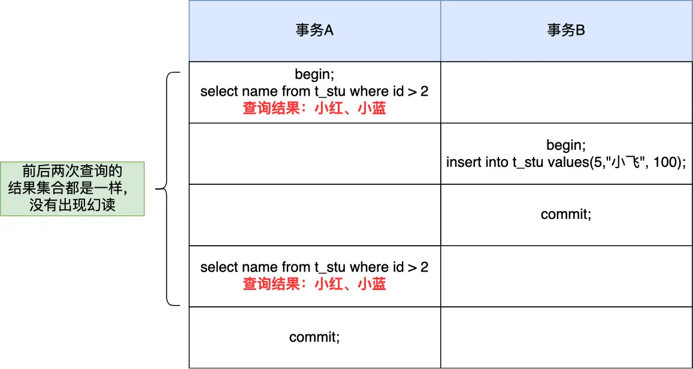
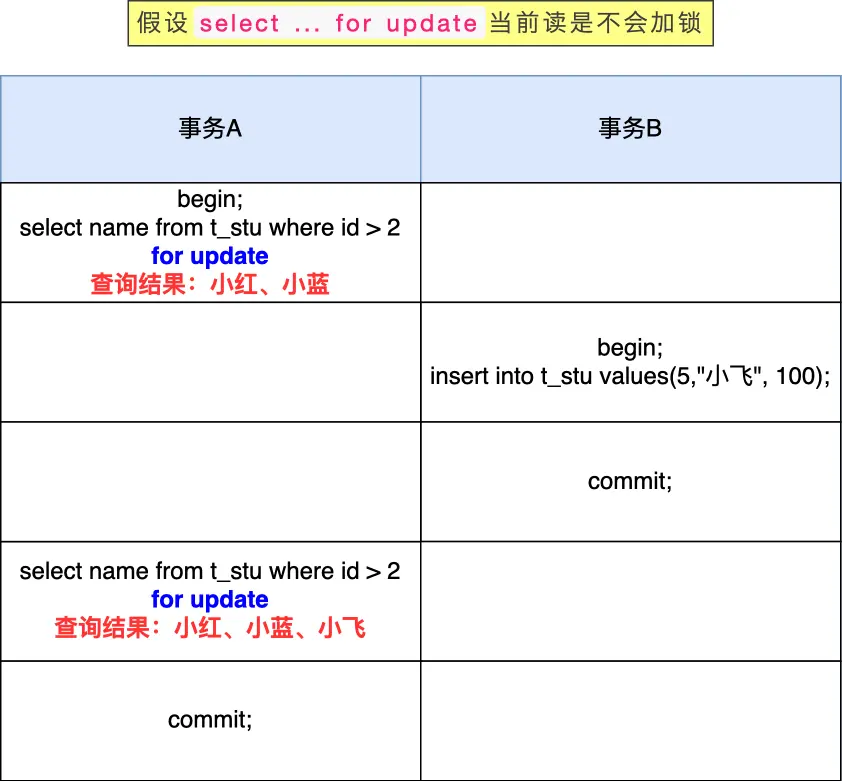
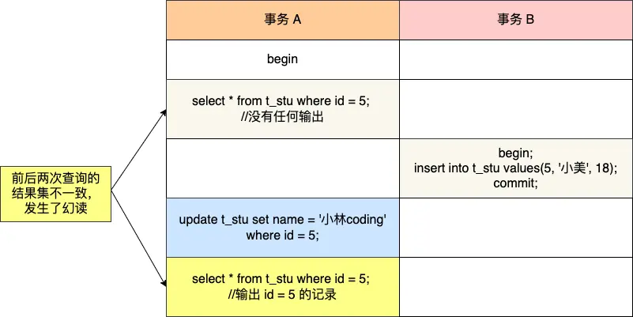

# MySQL 可重复读隔离级别，完全解决幻读了吗？

> **核心结论：** MySQL 的可重复读隔离级别很大程度上避免了幻读，但并没有完全解决。

## 目录

- [1. 什么是幻读？](#什么是幻读)
- [2. MySQL 如何避免幻读](#mysql-如何避免幻读)
  - [2.1 快照读的解决方案](#快照读是如何避免幻读的)
  - [2.2 当前读的解决方案](#当前读是如何避免幻读的)
- [3. 幻读是否被完全解决](#幻读被完全解决了吗)
  - [3.1 幻读场景一：更新后可见](#第一个发生幻读现象的场景)
  - [3.2 幻读场景二：混用读取方式](#第二个发生幻读现象的场景)
- [4. 避免幻读的最佳实践](#避免幻读的最佳实践)
- [5. 总结与关键点](#总结)

我在[上一篇文章](/2025/05/06/八股文/MYSQL/事务/2025-05-06-MySQL事务隔离级别的实现原理/)提到，MySQL InnoDB 引擎的默认隔离级别虽然是「可重复读」，但它只是很大程度上避免了幻读现象（并不是完全解决）。InnoDB 提供了两种不同的机制来解决幻读：

> **防止幻读的两种机制：**
>
> - 针对**快照读**（普通 select 语句）：使用 **MVCC** 机制，事务执行过程中看到的数据始终与事务启动时一致
> - 针对**当前读**（select ... for update 等语句）：使用 **next-key lock**（记录锁+间隙锁），阻塞其他事务在锁范围内的插入操作

这两个解决方案虽然能处理大多数场景，但仍有特殊情况会出现幻读。本文将深入分析这个问题。

## 什么是幻读？

**幻读定义**：当同一事务内，相同的查询在不同时间点返回不同的结果集时产生的现象。

> **MySQL 官方文档解释：**
> "_The so-called phantom problem occurs within a transaction when the same query produces different sets of rows at different times. For example, if a SELECT is executed twice, but returns a row the second time that was not returned the first time, the row is a "phantom" row._"
>
> 翻译：当同一个查询在不同的时间产生不同的结果集时，事务中就会出现所谓的幻象问题。例如，如果 SELECT 执行了两次，但第二次返回了第一次没有返回的行，则该行是"幻像"行。

### 幻读的简单判断标准

如果一个事务在 T1 和 T2 两个时刻执行完全相同的查询，结果不同就是幻读：

```sql
-- 假设在T1和T2时刻分别执行相同查询
SELECT * FROM t_test WHERE id > 100;
```

幻读的表现形式：

- T1 时刻查询有 5 条记录，T2 时刻变成了 6 条记录 ⟹ 幻读（多了"幻影行"）
- T1 时刻查询有 5 条记录，T2 时刻变成了 4 条记录 ⟹ 也是幻读（少了记录）

### 幻读与不可重复读的区别

| 问题类型   | 关注点           | 典型场景                         |
| ---------- | ---------------- | -------------------------------- |
| 不可重复读 | 同一行数据被修改 | 两次读取同一行，数据内容不同     |
| 幻读       | 结果集行数变化   | 两次相同范围查询，返回的行数不同 |

## MySQL 如何避免幻读

### 快照读是如何避免幻读的？

**快照读原理：** InnoDB 通过 MVCC（多版本并发控制）实现可重复读隔离级别。

🔍 **MVCC 工作流程图：**

```
事务开始(begin) ➡️ 第一次查询时创建 Read View ➡️ 后续查询复用同一 Read View ➡️ 数据一致性
```

关键机制：

1. 事务**启动后执行第一个查询语句**时创建一个 Read View
2. 后续所有查询**复用这个 Read View**
3. 通过 Read View 在 undo log 版本链中找到**事务开始时的数据版本**
4. 即使其他事务插入新数据并提交，当前事务也**看不到这些新数据**

#### 实验演示

表 t_stu 数据：

| id  | name | score |
| --- | ---- | ----- |
| 1   | 小林 | 50    |
| 2   | 小明 | 60    |
| 3   | 小红 | 70    |
| 4   | 小蓝 | 80    |

事务执行顺序：



> **快照读结论：** 即使事务 B 中途插入了新记录并提交，事务 A 的两次查询结果仍然一致（都是 3 条），成功避免了幻读。这是因为事务 A 在 T2 时刻创建的 Read View 会一直沿用，看不到 T2 之后其他事务的修改。

### 当前读是如何避免幻读的？

**当前读的特点**：总是读取数据的最新版本，不走 MVCC。

属于当前读的操作：

- `SELECT ... FOR UPDATE`（加排他锁）
- `SELECT ... LOCK IN SHARE MODE`（加共享锁）
- `UPDATE`（先读后写，读的是当前值）
- `INSERT`
- `DELETE`

**为什么当前读必须读取最新数据？**

举个例子：假设你要 `UPDATE` 一条记录，但另一个事务已经 `DELETE` 了这条记录并提交，如果你读的是旧版本数据，就会产生数据冲突。所以当前读必须读取最新版本的数据。

#### 当前读为什么需要额外机制来避免幻读

当前读每次都读最新数据，不像快照读那样有 Read View 保护。如果没有额外的锁机制，就会出现下图的问题：



事务 A 两次执行相同的 `SELECT ... FOR UPDATE`，第一次返回 3 条，第二次返回 4 条（因为事务 B 中途插入了新记录），这就是幻读。

所以 InnoDB 需要用锁来阻止其他事务插入数据。

#### InnoDB 的解决方案：间隙锁

为解决当前读的幻读问题，InnoDB 引入了**间隙锁（Gap Lock）**和 **next-key lock**：

- **记录锁（Record Lock）**：锁住单条记录
- **间隙锁（Gap Lock）**：锁住记录之间的"间隙"，防止其他事务在间隙中插入数据
- **next-key lock**：记录锁 + 间隙锁的组合，锁住记录本身及其前面的间隙


**next-key lock 工作原理：**


以 `SELECT * FROM t_stu WHERE id > 2 FOR UPDATE` 为例：

1. 事务 A 执行该语句时，会加上 next-key lock，锁定范围为 `(2, +∞]`
2. 事务 B 尝试插入 id=5 的记录时，发现该区间被锁定
3. 事务 B 生成一个**插入意向锁**，进入等待状态
4. 直到事务 A 提交释放锁，事务 B 才能成功插入

```sql
-- 事务 A 执行当前读，锁定 id > 2 的范围
SELECT * FROM t_stu WHERE id > 2 FOR UPDATE;

-- 此时事务 B 尝试插入会被阻塞
INSERT INTO t_stu VALUES(5, '小美', 90);  -- 阻塞等待
```

> **间隙锁总结:** 通过锁定可能插入记录的间隙，阻止其他事务在锁范围内插入数据，从而避免当前读的幻读问题。

## 幻读被完全解决了吗？

<div style="background-color: #f8f9fa; padding: 10px; border-left: 4px solid #e7505a; margin: 15px 0;">
<strong>结论：</strong> 可重复读隔离级别很大程度上避免了幻读，但仍有特殊场景会发生幻读。
</div>

下面介绍两个在可重复读隔离级别下仍然会发生幻读的场景。

### 第一个发生幻读现象的场景

**场景描述：** 事务 A 先用快照读查询不到某条记录，然后对该记录执行更新操作，更新后再查询就能看到这条记录了。

实验表数据：

| id  | name | score |
| --- | ---- | ----- |
| 1   | 小林 | 50    |
| 2   | 小明 | 60    |
| 3   | 小红 | 70    |
| 4   | 小蓝 | 80    |

**步骤 1：** 事务 A 查询不存在的记录（快照读）

```sql
# 事务 A
mysql> begin;
Query OK, 0 rows affected (0.00 sec)

mysql> select * from t_stu where id = 5;
Empty set (0.01 sec)
```

此时事务 A 创建了 Read View，id=5 的记录不存在。

**步骤 2：** 事务 B 插入该记录并提交

```sql
# 事务 B
mysql> begin;
Query OK, 0 rows affected (0.00 sec)

mysql> insert into t_stu values(5, '小美', 18);
Query OK, 1 row affected (0.00 sec)

mysql> commit;
Query OK, 0 rows affected (0.00 sec)
```

事务 B 插入了 id=5 的记录并提交，此时数据库中已经有这条记录了。

**步骤 3：** 事务 A 更新并查询该记录

```sql
# 事务 A
mysql> update t_stu set name = '小林coding' where id = 5;
Query OK, 1 row affected (0.01 sec)
Rows matched: 1  Changed: 1  Warnings: 0

mysql> select * from t_stu where id = 5;
+----+--------------+------+
| id | name         | age  |
+----+--------------+------+
|  5 | 小林coding   |   18 |
+----+--------------+------+
1 row in set (0.00 sec)
```

**神奇的事情发生了！** 事务 A 明明之前查询 id=5 是空的，但更新操作却成功了，而且更新后再查询就能看到这条记录了。

**时序图：**



> **幻读原因分析：**
>
> 1. 事务 A 在 T2 时刻执行快照读，创建 Read View，此时 id=5 不存在
> 2. 事务 B 在 T4 插入 id=5 的记录并提交
> 3. 事务 A 在 T6 执行 `UPDATE`，这是**当前读**，会读取最新数据，所以能更新成功
> 4. **关键点**：UPDATE 操作会将该记录的 `trx_id`（事务ID）改成事务 A 的 ID
> 5. 事务 A 在 T7 再次查询时，发现该记录的 `trx_id` 就是自己，所以能看到这条记录
>
> 这就导致了事务 A 前后两次查询 id=5 的结果不一致，发生了幻读。

### 第二个发生幻读现象的场景

**场景描述：** 在同一个事务中，先执行快照读，再执行当前读，由于两种读取方式的机制不同，会导致幻读。

**详细步骤：**

| 时刻 | 事务 A                                                   | 事务 B                                     |
| ---- | -------------------------------------------------------- | ------------------------------------------ |
| T1   | `BEGIN;`                                                 |                                            |
| T2   | `SELECT * FROM t_stu WHERE id > 2;` (3条，快照读)        |                                            |
| T3   |                                                          | `BEGIN;`                                   |
| T4   |                                                          | `INSERT INTO t_stu VALUES(5, '小美', 90);` |
| T5   |                                                          | `COMMIT;`                                  |
| T6   | `SELECT * FROM t_stu WHERE id > 2 FOR UPDATE;` (4条，当前读!) |                                            |

```sql
# 事务 A
mysql> begin;
Query OK, 0 rows affected (0.00 sec)

# T2: 快照读，返回 3 条记录
mysql> select * from t_stu where id > 2;
+----+------+-------+
| id | name | score |
+----+------+-------+
|  3 | 小红 |    70 |
|  4 | 小蓝 |    80 |
+----+------+-------+
3 rows in set (0.00 sec)

# 此时事务 B 插入 id=5 的记录并提交...

# T6: 当前读，返回 4 条记录！
mysql> select * from t_stu where id > 2 for update;
+----+------+-------+
| id | name | score |
+----+------+-------+
|  3 | 小红 |    70 |
|  4 | 小蓝 |    80 |
|  5 | 小美 |    90 |
+----+------+-------+
4 rows in set (0.00 sec)
```

> **幻读原因分析：**
>
> - **快照读**（普通 SELECT）：使用 MVCC 机制，读取的是 Read View 创建时的数据版本
> - **当前读**（SELECT ... FOR UPDATE）：直接读取最新的数据版本
>
> 由于两种读取方式的数据来源不同，在同一事务中混用就会出现结果不一致的情况，即幻读。

**如何避免这种情况？**

如果需要在事务中保证数据一致性，应该在事务开始后**立即使用当前读**来锁定数据范围：

```sql
# 事务 A - 正确做法
mysql> begin;
# 一开始就用当前读锁定范围
mysql> select * from t_stu where id > 2 for update;
# 此时事务 B 的插入会被阻塞，直到事务 A 提交
```

## 避免幻读的最佳实践

<div style="background-color: #f0f8ff; padding: 10px; border-left: 4px solid #4285f4; margin: 15px 0;">
<strong>核心原则：</strong> 在事务开始后，立即执行当前读操作，锁定相关记录范围。
</div>

### 具体建议

**1. 尽早使用 `SELECT ... FOR UPDATE` 锁定数据范围**

```sql
BEGIN;
-- 事务开始后立即用当前读锁定范围
SELECT * FROM t_stu WHERE id > 2 FOR UPDATE;
-- 后续操作...
COMMIT;
```

这样其他事务在该范围内的插入操作会被阻塞，从根本上避免幻读。

**2. 避免在同一事务中混用快照读和当前读**

如果业务逻辑需要多次查询，要么全部使用快照读，要么全部使用当前读，不要混用。

**3. 保持事务简短**

长事务会长时间持有锁，影响并发性能。尽量缩短事务执行时间。

**4. 根据业务需求选择合适的隔离级别**

| 场景                         | 推荐隔离级别 | 原因                             |
| ---------------------------- | ------------ | -------------------------------- |
| 需要严格避免幻读             | 可重复读 + 当前读 | 利用 next-key lock 锁定范围      |
| 对幻读不敏感，追求高并发     | 读已提交     | 减少锁冲突，提高并发性           |
| 金融等对一致性要求极高的场景 | 串行化       | 最高隔离级别，完全避免并发问题   |

## 总结

### 幻读问题的解决方案对比

| 查询类型 | 解决机制    | 是否完全解决 | 限制条件                                   |
| -------- | ----------- | ------------ | ------------------------------------------ |
| 快照读   | MVCC 机制   | 否           | 更新操作会使新记录在事务内可见             |
| 当前读   | next-key 锁 | 否           | 需要在事务开始时就执行当前读，才能锁定范围 |

### 关键要点

**1. MySQL InnoDB 的可重复读隔离级别采用两种机制避免幻读：**

| 读取方式 | 机制                          | 原理                                     |
| -------- | ----------------------------- | ---------------------------------------- |
| 快照读   | MVCC（多版本并发控制）        | 复用 Read View，始终读取事务开始时的数据 |
| 当前读   | next-key lock（记录锁+间隙锁）| 锁定记录和间隙，阻止其他事务插入         |

**2. 幻读仍可能在以下场景出现：**

- **场景一**：事务 A 先快照读查不到记录，然后对该记录执行 UPDATE/DELETE，再查询就能看到了
- **场景二**：同一事务内先用快照读，再用当前读，两次结果不一致

**3. 避免幻读的最佳实践：**

- 尽量在事务开始后**立即使用 `SELECT ... FOR UPDATE`** 锁定相关记录范围
- **不要混用**快照读和当前读
- 保持事务简短，减少锁冲突
- 根据业务需求选择合适的隔离级别

<div style="background-color: #fef9e6; padding: 10px; border-left: 4px solid #f1c40f; margin: 15px 0;">
<strong>记住：</strong> MySQL 的可重复读隔离级别并非完全解决了幻读，而是在大多数常见场景下避免了幻读。了解其工作原理和边界情况，才能设计出更可靠的数据库应用。
</div>

### 面试回答要点

如果面试官问"MySQL 可重复读隔离级别完全解决幻读了吗？"，可以这样回答：

> 没有完全解决。MySQL 的可重复读隔离级别通过两种机制来避免幻读：
>
> 1. **快照读**使用 MVCC 机制，事务启动后创建 Read View，后续查询复用这个 Read View，所以看不到其他事务新插入的数据。
>
> 2. **当前读**使用 next-key lock（记录锁+间隙锁），锁定查询范围，阻止其他事务在该范围内插入数据。
>
> 但是有两种特殊情况仍会发生幻读：
>
> 1. 事务 A 先用快照读查不到某条记录，然后对该记录执行 UPDATE，由于 UPDATE 是当前读会读到最新数据，更新成功后该记录的事务 ID 变成事务 A 的 ID，再次查询就能看到这条记录了。
>
> 2. 同一事务中混用快照读和当前读，由于两种读取方式的数据来源不同，会导致结果不一致。
>
> 要完全避免幻读，应该在事务开始后立即使用 `SELECT ... FOR UPDATE` 锁定数据范围。
