# MySQL Buffer Pool 详解：数据库性能优化的核心

## 为什么要有 Buffer Pool？

想象一下，如果每次查询数据都要从硬盘读取，就像每次想看书都要去图书馆借一样，效率会非常低。MySQL 的数据虽然存储在磁盘里，但如果每次都从磁盘读取，性能会非常差。

怎么解决呢？很简单——**加个缓存**！

就像我们会把常用的书放在家里书架上一样，MySQL 会把经常使用的数据放在内存中。当数据从磁盘取出后，先缓存在内存中，下次查询相同数据时，直接从内存读取，速度飞快！

为此，InnoDB 存储引擎设计了一个专门的**缓冲池（Buffer Pool）**，这就是数据库性能优化的核心组件。

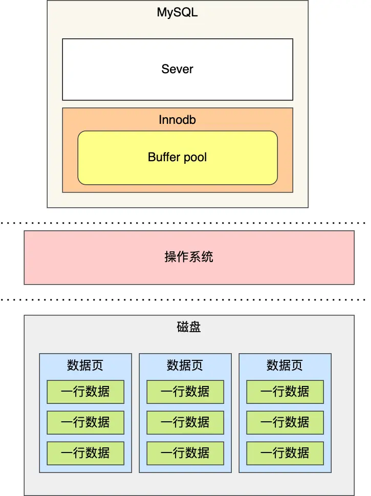

有了缓冲池后，数据库的工作方式就像这样：

- **读取数据时**：先看看 Buffer Pool 里有没有，有的话直接拿来用；没有的话再去磁盘读取，然后放到 Buffer Pool 里备用
- **修改数据时**：不急着写磁盘，先在 Buffer Pool 里改，把这个页标记为"脏页"（表示已修改），然后让后台线程慢慢写到磁盘

这样既提高了读取速度，又避免了频繁的磁盘写入操作。

### Buffer Pool 有多大？

Buffer Pool 就像是 MySQL 的"内存仓库"，在 MySQL 启动时向操作系统申请一块连续的内存空间。

**默认大小**：只有 128MB（太小了，生产环境肯定不够用）

**如何调整**：通过 `innodb_buffer_pool_size` 参数设置
- **推荐大小**：物理内存的 60%~80%
- **举例**：如果服务器有 8GB 内存，可以设置为 5-6GB

```sql
-- 查看当前 Buffer Pool 大小
SHOW VARIABLES LIKE 'innodb_buffer_pool_size';

-- 设置 Buffer Pool 大小为 4GB
SET GLOBAL innodb_buffer_pool_size = 4294967296;
```

### Buffer Pool 缓存什么？

你可能会问：Buffer Pool 到底缓存什么数据呢？

首先要了解一个概念：**数据页**。InnoDB 把数据分成一个个"页"，就像把书分成一页页纸一样。每页的大小是 16KB，这是磁盘和内存交换数据的基本单位。

**Buffer Pool 的工作原理**：
1. MySQL 启动时，申请一大块内存空间
2. 把这块内存按 16KB 切分成很多"缓存页"
3. 刚开始这些缓存页都是空的
4. 随着查询的进行，磁盘上的数据页会被载入这些缓存页

**有趣的现象**：MySQL 刚启动时，你会发现虚拟内存很大，但实际物理内存使用很小。这是因为操作系统采用了"懒加载"机制——只有真正访问内存时，才会分配物理内存。

**Buffer Pool 缓存的内容**：
- **数据页**：表中的实际数据
- **索引页**：B+树索引结构
- **undo 页**：用于事务回滚的数据
- **插入缓存**：优化插入操作的缓存
- **自适应哈希索引**：InnoDB 自动创建的哈希索引
- **锁信息**：并发控制相关信息

简单来说，就是把经常用到的各种数据都放在内存里，提高访问速度。

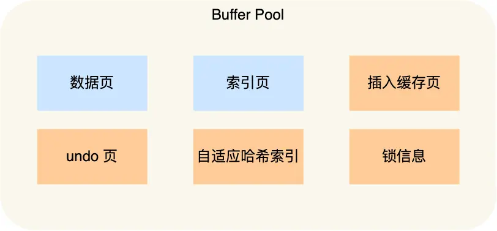

### 控制块：缓存页的"身份证"

光有缓存页还不够，还需要管理这些页面。想象一下，如果你有很多书，但没有目录和标签，怎么快速找到想要的那本书呢？

InnoDB 为每个缓存页都创建了一个**控制块**，就像给每个缓存页发了一张"身份证"，记录着：
- **表空间 ID**：这个页属于哪个数据库表
- **页号**：在表中的第几页
- **缓存页地址**：在内存中的具体位置
- **链表节点信息**：用于各种链表管理

**内存布局**：控制块放在 Buffer Pool 的最前面，后面才是缓存页：

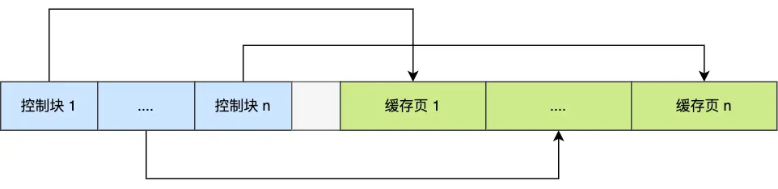

你可能注意到了图中的灰色部分——这是**碎片空间**。

**为什么会有碎片空间？**

这很好理解：每个控制块都要对应一个缓存页，当分配完所有的控制块和缓存页后，可能剩余的内存空间不够再分配一对控制块和缓存页，这部分"剩余"的内存就是碎片空间。

> **小贴士**：如果你精确计算 Buffer Pool 的大小，也可以避免产生碎片空间。

### 常见疑问：查询一条记录，只缓存这条记录吗？

**答案是：不是的！**

这是一个很有意思的问题。当你查询一条记录时，MySQL 实际上会把**整个页**（16KB）都加载到 Buffer Pool 中。

**为什么要这样做？**

想象一下在图书馆找书的场景：
1. 你想看某本书的第 100 页第 5 行
2. 但图书管理员只能告诉你这本书在哪个书架上
3. 你拿到整本书后，再翻到第 100 页第 5 行

MySQL 的工作原理类似：
1. **索引定位**：通过索引只能定位到数据在哪个"页"上
2. **加载整页**：把整个 16KB 的页加载到 Buffer Pool
3. **页内查找**：通过页目录定位到具体的记录

**这样做的好处**：
- **空间局部性**：同一页的其他数据很可能也会被访问
- **减少 I/O**：一次性读取 16KB 比多次读取小块数据更高效
- **页是原子单位**：数据库以页为单位管理数据更加高效

> **延伸阅读**：想了解页结构和索引查询的详细原理，可以参考：[换一个角度看 B+ 树](/2025/04/28/八股文/MYSQL/索引/InnoDB的数据页/)

## 如何管理 Buffer Pool？

Buffer Pool 有很多缓存页，就像一个大仓库有很多货架。要高效管理这些页面，MySQL 设计了几种不同的"链表"来分类管理。

### 空闲页管理：Free 链表

**问题**：MySQL 需要加载新数据时，怎么快速找到空闲的缓存页？

如果每次都遍历整个 Buffer Pool 来找空闲页，效率太低了。就像在一个大仓库里挨个检查每个货架是否空着一样。

**解决方案**：使用 **Free 链表**（空闲链表）

把所有空闲缓存页的控制块串成一个链表，需要空闲页时，直接从链表头取一个就行了。


**Free 链表的组成**：
- **链表头节点**：记录链表的基本信息
  - 头节点地址和尾节点地址
  - 当前空闲页的数量
- **控制块节点**：每个节点对应一个空闲的缓存页

**工作流程**：
1. **需要加载新数据时**：从 Free 链表头部取一个空闲缓存页
2. **填充控制块信息**：记录表空间、页号等信息
3. **从链表中移除**：该控制块不再是"空闲"状态

这样的设计让查找空闲页的时间复杂度从 O(n) 降到了 O(1)，大大提高了效率。

### 脏页管理：Flush 链表

Buffer Pool 不仅能提高读性能，还能提高写性能。当你修改数据时，MySQL 并不急着写磁盘，而是先在内存中修改，然后把这个页标记为**脏页**。

**什么是脏页？**
- **脏页**：内存中的数据已经被修改，但还没同步到磁盘
- **干净页**：内存和磁盘的数据是一致的

**问题**：后台线程怎么知道哪些页是脏页，需要写入磁盘呢？

**解决方案**：使用 **Flush 链表**

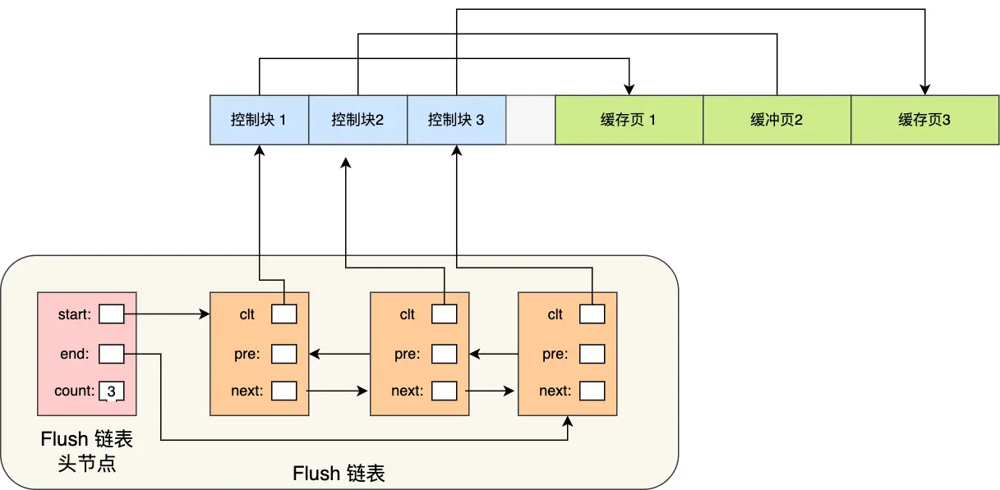

**Flush 链表的特点**：
- 链表结构和 Free 链表类似
- 区别是：Flush 链表中的都是脏页的控制块
- 后台线程定期遍历 Flush 链表，将脏页写入磁盘

**工作流程**：
1. **数据修改时**：页面标记为脏页，控制块加入 Flush 链表
2. **后台刷盘**：后台线程遍历 Flush 链表，写入磁盘
3. **写入完成**：从 Flush 链表中移除，页面变为干净页

这种设计实现了**延迟写入**，大大提高了写操作的性能。

### 缓存淘汰策略：改进版 LRU 算法

Buffer Pool 的空间是有限的，就像你的书桌空间有限一样。我们希望：
- **常用数据**：一直留在 Buffer Pool 中
- **不常用数据**：及时淘汰掉，腾出空间

这是典型的缓存淘汰问题。最直观的解决方案是使用 **LRU（Least Recently Used）算法**。

**经典 LRU 算法原理**：
- **链表头部**：最近使用的数据（热数据）
- **链表尾部**：最久未使用的数据（冷数据）
- **淘汰策略**：空间不足时，淘汰链表尾部的数据

**经典 LRU 算法的操作**：

1. **页面命中**（在 Buffer Pool 中）：将该页移动到链表头部
2. **页面未命中**（不在 Buffer Pool 中）：淘汰尾部页面，新页面加入头部

让我们通过例子来理解：

假设 LRU 链表长度为 5，当前有页面 1、2、3、4、5：

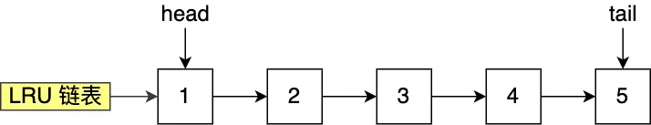

**场景一：访问已存在的页面**
访问 3 号页时，由于它已经在 Buffer Pool 中，直接移动到头部：

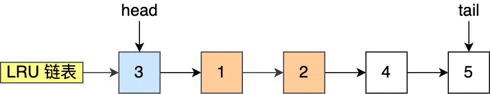

**场景二：访问不存在的页面**
访问 8 号页时，由于它不在 Buffer Pool 中：
1. 淘汰尾部的 5 号页
2. 将 8 号页加入到头部

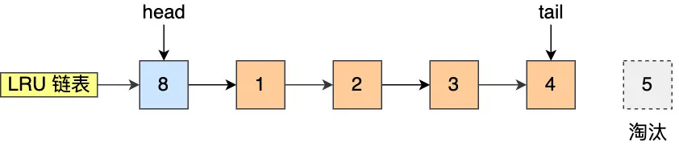

### Buffer Pool 中的三种页面状态

通过前面的学习，我们知道 Buffer Pool 使用三种链表来管理不同状态的页面：

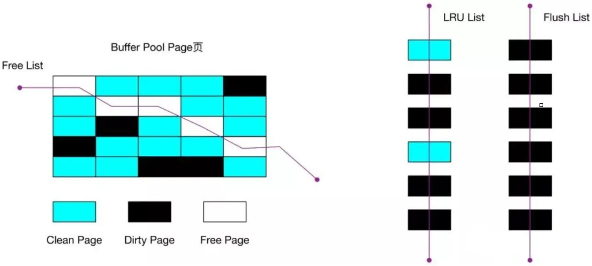

**三种页面状态**：

| 页面类型 | 状态描述 | 所在链表 |
|---------|---------|---------|
| **Free Page（空闲页）** | 未被使用的页面 | Free 链表 |
| **Clean Page（干净页）** | 已使用但未修改的页面<br/>内存和磁盘数据一致 | LRU 链表 |
| **Dirty Page（脏页）** | 已使用且已修改的页面<br/>内存和磁盘数据不一致 | LRU 链表 + Flush 链表 |

**页面状态转换**：
- **空闲页 → 干净页**：加载磁盘数据后
- **干净页 → 脏页**：修改数据后
- **脏页 → 干净页**：写入磁盘后
- **任何页 → 空闲页**：从 Buffer Pool 中淘汰后

### 经典 LRU 算法的两大问题

虽然 LRU 算法思路很好，但 MySQL 并没有直接使用经典的 LRU 算法，因为它无法解决两个关键问题：

#### 问题一：预读失效

**什么是预读机制？**

MySQL 有一个很聪明的设计叫"预读"。基于程序的**空间局部性原理**，当你访问某个数据页时，MySQL 会猜测你接下来可能访问相邻的数据页，于是提前加载它们。

就像你在看连续剧，看完第 5 集，很可能接下来会看第 6、7 集，所以视频网站会提前缓存这些集数。

**预读失效的问题**：

但是，如果这些预读的页面实际上没有被访问，就会出现问题：

1. **预读页占据热点位置**：这些无用的预读页被放在 LRU 链表头部
2. **真正的热数据被淘汰**：Buffer Pool 空间不足时，链表尾部的热数据反而被淘汰
3. **缓存命中率下降**：导致更多的磁盘 I/O

**具体例子**：
- 你查询用户表的第 100 页数据
- MySQL 预读了第 101、102、103 页
- 但你实际只需要第 100 页的数据
- 结果：无用的 101、102、103 页占据了宝贵的缓存空间

#### 解决方案：LRU 链表分区

我们不能因为害怕预读失效就取消预读机制，因为大部分情况下空间局部性原理是成立的。

**核心思想**：让预读的页停留时间尽可能短，真正被访问的页才能进入热点区域。

**MySQL 的解决方案**：将 LRU 链表分为两个区域

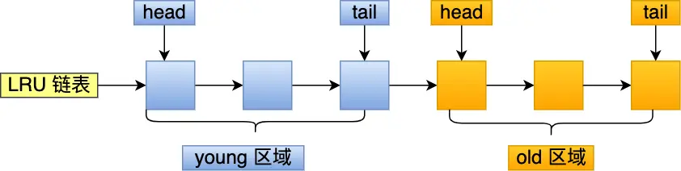

**两个区域的设计**：

| 区域 | 位置 | 作用 | 默认比例 |
|-----|------|------|---------|
| **Young 区域** | 链表前半部分 | 存放热点数据 | 63% |
| **Old 区域** | 链表后半部分 | 存放新加载/预读数据 | 37% |

**配置参数**：`innodb_old_blocks_pct = 37`（表示 old 区域占 37%）

**新的工作流程**：

1. **预读页面**：直接放入 old 区域头部（不是整个 LRU 的头部）
2. **页面被访问**：从 old 区域移动到 young 区域头部
3. **预读页面未被访问**：在 old 区域自然老化，最终被淘汰

**好处**：
- ✅ 预读页面不会立即占据热点位置
- ✅ 真正使用的数据才能进入 young 区域
- ✅ 未使用的预读页面会较快被淘汰
- ✅ 热点数据得到更好的保护

接下来，给大家举个例子。

假设有一个长度为 10 的 LRU 链表，其中 young 区域占比 70 %，old 区域占比 30 %。

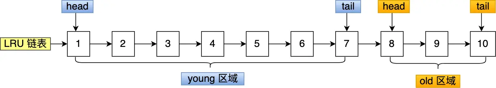

现在有个编号为 20 的页被预读了，这个页只会被插入到  old 区域头部，而 old 区域末尾的页（10 号）会被淘汰掉。

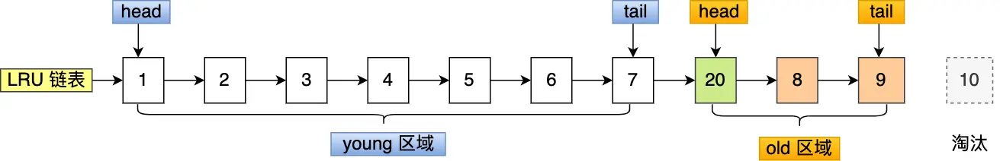

如果 20 号页一直不会被访问，它也没有占用到 young 区域的位置，而且还会比 young 区域的数据更早被淘汰出去。

如果 20 号页被预读后，立刻被访问了，那么就会将它插入到 young 区域的头部，young 区域末尾的页（7 号），会被挤到 old 区域，作为 old 区域的头部，这个过程并不会有页被淘汰。

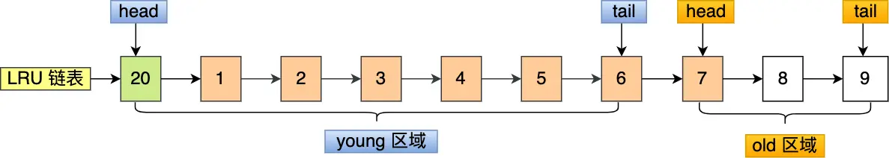

虽然通过划分 old 区域 和 young 区域避免了预读失效带来的影响，但是还有个问题无法解决，那就是  Buffer Pool  污染的问题。

> 什么是  Buffer Pool  污染？

当某一个 SQL 语句**扫描了大量的数据**时，在  Buffer Pool 空间比较有限的情况下，可能会将 **Buffer Pool 里的所有页都替换出去，导致大量热数据被淘汰了**，等这些热数据又被再次访问的时候，由于缓存未命中，就会产生大量的磁盘 IO，MySQL 性能就会急剧下降，这个过程被称为 **Buffer Pool  污染**。

注意，Buffer Pool  污染并不只是查询语句查询出了大量的数据才出现的问题，即使查询出来的结果集很小，也会造成 Buffer Pool  污染。

比如，在一个数据量非常大的表，执行了这条语句：

```sql
select * from t_user where name like "%xiaolin%";
```

可能这个查询出来的结果就几条记录，但是由于这条语句会发生索引失效，所以这个查询过程是全表扫描的，接着会发生如下的过程：

- 从磁盘读到的页加入到 LRU 链表的 old 区域头部；
- 当从页里读取行记录时，也就是页被访问的时候，就要将该页放到 young 区域头部；
- 接下来拿行记录的 name 字段和字符串 xiaolin 进行模糊匹配，如果符合条件，就加入到结果集里；
- 如此往复，直到扫描完表中的所有记录。

经过这一番折腾，原本 young 区域的热点数据都会被替换掉。

举个例子，假设需要批量扫描：21，22，23，24，25 这五个页，这些页都会被逐一访问（读取页里的记录）。

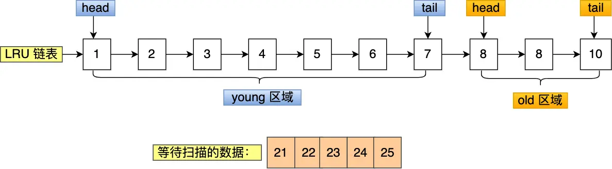

在批量访问这些数据的时候，会被逐一插入到 young 区域头部。

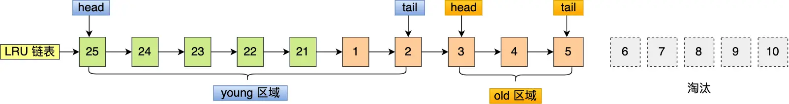

可以看到，原本在 young 区域的热点数据 6 和 7 号页都被淘汰了，这就是  Buffer Pool  污染的问题。

> 怎么解决出现   Buffer Pool  污染而导致缓存命中率下降的问题？

像前面这种全表扫描的查询，很多缓冲页其实只会被访问一次，但是它却只因为被访问了一次而进入到 young 区域，从而导致热点数据被替换了。

LRU 链表中 young 区域就是热点数据，只要我们提高进入到 young 区域的门槛，就能有效地保证 young 区域里的热点数据不会被替换掉。

MySQL 是这样做的，进入到 young 区域条件增加了一个**停留在 old 区域的时间判断**。

具体是这样做的，在对某个处在 old 区域的缓存页进行第一次访问时，就在它对应的控制块中记录下来这个访问时间：

- 如果后续的访问时间与第一次访问的时间**在某个时间间隔内**，那么**该缓存页就不会被从 old 区域移动到 young 区域的头部**；
- 如果后续的访问时间与第一次访问的时间**不在某个时间间隔内**，那么**该缓存页移动到 young 区域的头部**；

这个间隔时间是由 `innodb_old_blocks_time` 控制的，默认是 1000 ms。

也就说，**只有同时满足「被访问」与「在 old 区域停留时间超过 1 秒」两个条件，才会被插入到 young 区域头部**，这样就解决了 Buffer Pool  污染的问题。

另外，MySQL 针对 young 区域其实做了一个优化，为了防止 young 区域节点频繁移动到头部。young 区域前面 1/4 被访问不会移动到链表头部，只有后面的 3/4 被访问了才会。

### 脏页什么时候会被刷入磁盘？

引入了 Buffer Pool  后，当修改数据时，首先是修改  Buffer Pool  中数据所在的页，然后将其页设置为脏页，但是磁盘中还是原数据。

因此，脏页需要被刷入磁盘，保证缓存和磁盘数据一致，但是若每次修改数据都刷入磁盘，则性能会很差，因此一般都会在一定时机进行批量刷盘。

可能大家担心，如果在脏页还没有来得及刷入到磁盘时，MySQL 宕机了，不就丢失数据了吗？

这个不用担心，InnoDB 的更新操作采用的是 Write Ahead Log 策略，即先写日志，再写入磁盘，通过 redo log 日志让 MySQL 拥有了崩溃恢复能力。

下面几种情况会触发脏页的刷新：

- 当 redo log 日志满了的情况下，会主动触发脏页刷新到磁盘；
- Buffer Pool 空间不足时，需要将一部分数据页淘汰掉，如果淘汰的是脏页，需要先将脏页同步到磁盘；
- MySQL 认为空闲时，后台线程回定期将适量的脏页刷入到磁盘；
- MySQL 正常关闭之前，会把所有的脏页刷入到磁盘；

在我们开启了慢 SQL 监控后，如果你发现**「偶尔」会出现一些用时稍长的 SQL**，这可能是因为脏页在刷新到磁盘时可能会给数据库带来性能开销，导致数据库操作抖动。

如果间断出现这种现象，就需要调大 Buffer Pool 空间或 redo log 日志的大小。

## 总结

Buffer Pool 是 MySQL InnoDB 存储引擎的核心组件，通过内存缓存大大提升了数据库的读写性能。

### 核心概念回顾

**基本概念**：
- **作用**：缓存热点数据，减少磁盘 I/O
- **单位**：以 16KB 的页为基本单位
- **大小**：默认 128MB，建议设置为物理内存的 60%~80%

**三种链表管理**：

| 链表类型 | 管理对象 | 作用 |
|---------|---------|------|
| **Free 链表** | 空闲页 | 快速分配空闲缓存页 |
| **Flush 链表** | 脏页 | 管理需要写入磁盘的页面 |
| **LRU 链表** | 所有使用中的页 | 缓存淘汰策略 |

### MySQL 的 LRU 优化

为了解决经典 LRU 算法的问题，MySQL 做了两个关键优化：

**1. 链表分区**：
- **Young 区域**（63%）：存放热点数据
- **Old 区域**（37%）：存放新加载的数据
- **解决问题**：预读失效

**2. 时间门槛**：
- **条件**：页面在 old 区域停留时间 > 1 秒才能进入 young 区域
- **解决问题**：Buffer Pool 污染（全表扫描等）

### 重要参数

```sql
-- Buffer Pool 大小
innodb_buffer_pool_size = 4G

-- Old 区域比例
innodb_old_blocks_pct = 37

-- 进入 Young 区域的时间门槛
innodb_old_blocks_time = 1000
```

### 性能监控要点

如果发现偶尔出现的慢 SQL，可能是脏页刷盘导致的性能抖动，可以考虑：
- 调大 Buffer Pool 大小
- 调大 redo log 大小
- 监控脏页比例和刷盘频率

Buffer Pool 的设计体现了 MySQL 在性能优化方面的精妙之处，理解其原理对于数据库调优和故障排查都非常重要。
