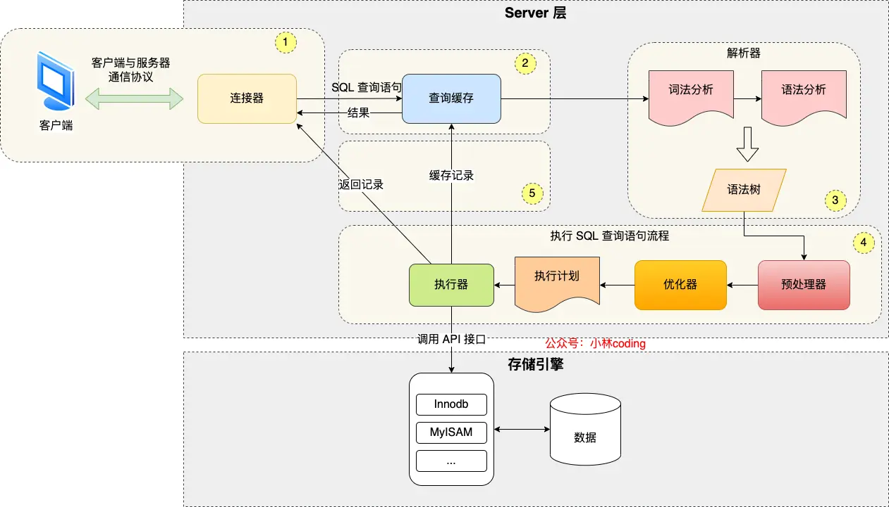

# MySQL 执行一条 SELECT 语句的完整过程详解

## 引言

当我们在 MySQL 中执行一条简单的查询语句时：

```sql
SELECT * FROM product WHERE id = 1;
```

看起来只是一行代码，但在 MySQL 内部却经历了一个复杂而精密的执行过程。今天我们就来揭开这个"黑盒子"，看看 MySQL 是如何一步步处理我们的查询请求的。

## MySQL 架构概览

在深入了解执行流程之前，我们先来看看 MySQL 的整体架构：



MySQL 的架构主要分为两层：

### Server 层（服务层）
**主要职责**：接收请求、解析 SQL、制定执行计划
- **连接器**：负责建立连接，验证用户身份
- **查询缓存**：缓存查询结果（MySQL 8.0 已移除）
- **解析器**：解析 SQL 语句，检查语法
- **优化器**：选择最优的执行方案
- **执行器**：真正执行 SQL 语句

### 存储引擎层
**主要职责**：负责数据的实际存储和读取
- 支持多种存储引擎：InnoDB、MyISAM、Memory 等
- InnoDB 是当前默认的存储引擎

> **面试重点**：这种分层架构的好处是什么？
> 
> 分层架构使得 MySQL 可以支持多种存储引擎，不同的应用场景可以选择最适合的存储引擎，而上层的 SQL 处理逻辑保持不变。

## 详细执行流程

### 第一步：连接器 - 建立"桥梁"

**作用**：建立客户端与 MySQL 服务器之间的连接

#### 连接过程
1. **TCP 三次握手**：建立网络连接
2. **身份验证**：验证用户名和密码
3. **权限获取**：读取用户权限并缓存

```bash
# 连接 MySQL 的常用命令
mysql -h 127.0.0.1 -u root -p
```

#### 连接管理

**查看当前连接数**：
```sql
SHOW PROCESSLIST;
```

**重要参数**：
- `max_connections`：最大连接数（默认 151）
- `wait_timeout`：空闲连接超时时间（默认 8 小时）

#### 长连接 vs 短连接

```
短连接：连接 → 执行SQL → 断开连接
长连接：连接 → 执行SQL → 执行SQL → ... → 断开连接
```

> **面试重点**：为什么推荐使用长连接？
> 
> 长连接可以避免频繁建立和断开连接的开销，提高性能。但需要注意内存占用问题，可以通过定期断开长连接或使用 `mysql_reset_connection()` 来释放内存。

### 第二步：查询缓存 - 快速通道

**作用**：如果之前执行过完全相同的查询，直接返回缓存结果

#### 工作原理
- 以 `key-value` 形式存储在内存中
- `key`：SQL 语句的完整文本
- `value`：查询结果

#### 为什么被废弃？
```
问题：只要表有任何更新，所有相关的查询缓存都会被清空
结果：命中率极低，性能提升微乎其微
决定：MySQL 8.0 直接移除了查询缓存功能
```

> **面试重点**：查询缓存为什么效果不好？
> 
> 因为查询缓存要求 SQL 语句完全一致才能命中，而且任何表更新都会清空相关缓存，在高并发的写多读少场景下，缓存失效频繁，反而影响性能。

### 第三步：解析器 - 理解 SQL

**作用**：解析 SQL 语句，构建语法树

#### 两个主要步骤

**1. 词法分析**
- 识别 SQL 中的关键字：`SELECT`、`FROM`、`WHERE` 等
- 提取表名、字段名、条件等信息

**2. 语法分析**
- 检查 SQL 语法是否正确
- 构建语法树，便于后续处理


```sql
-- 语法错误示例
SELECT * FORM product WHERE id = 1;
-- 错误：FORM 应该是 FROM
```

> **注意**：解析器只检查语法，不检查表或字段是否存在

### 第四步：预处理器 - 验证有效性

**作用**：检查 SQL 语句中引用的表和字段是否存在

#### 主要工作
1. **检查表是否存在**
2. **检查字段是否存在**  
3. **展开 `SELECT *`**：将 `*` 替换为具体的字段列表

```sql
-- 如果 test 表不存在，会在这个阶段报错
SELECT * FROM test;
-- ERROR 1146 (42S02): Table 'database.test' doesn't exist
```

### 第五步：优化器 - 制定最佳方案

**作用**：为 SQL 查询选择最优的执行计划

#### 优化器的工作

**选择索引**：
```sql
-- 如果 product 表有多个索引，优化器会选择成本最低的
SELECT * FROM product WHERE id > 100 AND name LIKE 'iPhone%';
```

**查看执行计划**：
```sql
EXPLAIN SELECT * FROM product WHERE id = 1;
```

#### 执行计划示例

| id | select_type | table | type | key | rows | Extra |
|----|-------------|-------|------|-----|------|-------|
| 1 | SIMPLE | product | const | PRIMARY | 1 | |

- **type**：访问类型（const > eq_ref > ref > range > ALL）
- **key**：使用的索引
- **rows**：预计扫描的行数

> **面试重点**：优化器如何选择索引？
> 
> 优化器基于成本模型（Cost-Based Optimizer），会计算不同执行计划的成本，包括 I/O 成本、CPU 成本等，选择总成本最低的执行计划。

### 第六步：执行器 - 真正干活

**作用**：根据执行计划，调用存储引擎接口获取数据

#### 三种典型的执行场景

#### 1. 主键索引查询

```sql
SELECT * FROM product WHERE id = 1;
```

**执行流程**：
1. 调用存储引擎的索引查询接口
2. 存储引擎通过 B+ 树快速定位记录
3. 返回完整记录给执行器
4. 执行器验证条件并返回结果

#### 2. 全表扫描

```sql
SELECT * FROM product WHERE name = 'iPhone';
```

**执行流程**：
1. 从表的第一条记录开始读取
2. 逐条检查 `name` 字段是否等于 'iPhone'
3. 符合条件的记录返回给客户端
4. 继续读取下一条记录，直到表结束

#### 3. 索引下推优化

**什么是索引下推？**
将原本在 Server 层进行的条件判断，"下推"到存储引擎层执行。

**举例说明**：
```sql
-- 假设在 (age, reward) 字段上有联合索引
SELECT * FROM user WHERE age > 20 AND reward = 100000;
```

**传统方式**：
1. 存储引擎返回所有 `age > 20` 的记录
2. Server 层再过滤 `reward = 100000`

**索引下推方式**：
1. 存储引擎直接过滤 `age > 20 AND reward = 100000`
2. 只返回完全符合条件的记录

**优势**：减少回表次数，提高查询效率

```sql
-- 查看是否使用了索引下推
EXPLAIN SELECT * FROM user WHERE age > 20 AND reward = 100000;
-- Extra 列显示 "Using index condition" 表示使用了索引下推
```

## 完整流程总结

让我们用一个简单的图表来总结整个执行流程：

```
客户端请求
    ↓
连接器（建立连接，验证身份）
    ↓
查询缓存（MySQL 8.0 已移除）
    ↓
解析器（词法分析，语法分析）
    ↓
预处理器（检查表和字段）
    ↓
优化器（选择执行计划）
    ↓
执行器（调用存储引擎）
    ↓
存储引擎（返回数据）
    ↓
返回结果给客户端
```

## 常见面试题

### Q1：MySQL 的两层架构有什么好处？

**答案**：
- **解耦**：SQL 处理逻辑与数据存储分离
- **灵活性**：可以根据需求选择不同的存储引擎
- **可扩展性**：易于添加新的存储引擎或优化现有功能

### Q2：为什么 MySQL 8.0 移除了查询缓存？

**答案**：
- **命中率低**：需要 SQL 完全一致才能命中
- **维护成本高**：任何写操作都会导致相关缓存失效
- **性能问题**：在高并发场景下，缓存的维护反而成为瓶颈

### Q3：解析器和预处理器的区别是什么？

**答案**：
- **解析器**：只负责语法检查和构建语法树
- **预处理器**：检查表和字段的存在性，进行语义验证

### Q4：索引下推的原理和作用是什么？

**答案**：
- **原理**：将部分条件判断从 Server 层下推到存储引擎层
- **作用**：减少回表次数，提高查询效率
- **适用场景**：联合索引中部分字段无法使用索引但包含在索引中的情况

## 性能优化建议

### 1. 连接优化
- 使用连接池管理数据库连接
- 合理设置 `max_connections` 和 `wait_timeout`
- 避免创建过多的无用连接

### 2. SQL 优化
- 避免使用 `SELECT *`，明确指定需要的字段
- 合理使用索引，避免全表扫描
- 利用 `EXPLAIN` 分析执行计划

### 3. 索引优化
- 为经常查询的字段创建索引
- 避免在小表上创建过多索引
- 利用覆盖索引减少回表操作

## 总结

通过这篇文章，我们深入了解了 MySQL 执行一条 SELECT 语句的完整过程：

1. **连接器**：建立连接，验证身份
2. **查询缓存**：快速返回缓存结果（已废弃）
3. **解析器**：解析 SQL，构建语法树
4. **预处理器**：验证表和字段的有效性
5. **优化器**：制定最优执行计划
6. **执行器**：调用存储引擎获取数据

理解这个过程不仅有助于我们写出更高效的 SQL，也能帮助我们在遇到性能问题时快速定位问题所在。在面试中，这也是一个经常被问到的核心问题。

> **记住**：每一个看似简单的查询背后，都有一套精密的机制在保证其正确和高效的执行。

---

**参考资料**：
- 《MySQL 45 讲》
- 《MySQL 是怎样运行的：从根儿上理解 MySQL》
- MySQL 官方文档
