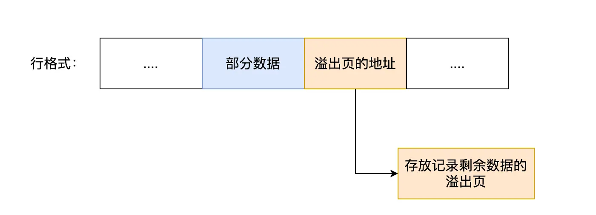
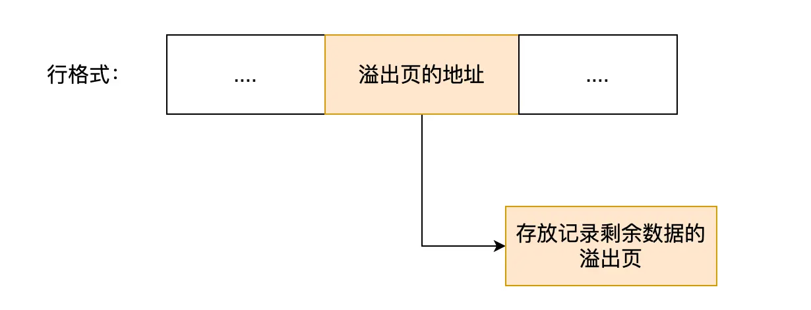

## 行溢出

MYSQL 中磁盘和内存交互的基本单位是页，一页的大小为 16KB。

如果一个字段存储的内容超过了 16KB，那么这个字段就会发生行溢出。

> 比如之前说过VARCHAR 类型的最大长度是 65532（允许为NULL），那么Varchar的长度明显是会超过一页的大小的，那么就会发生行溢出。
>
>[VARCHAR 类型最大取值](/2025/04/24/八股文/MYSQL/基础知识/Varchar最大取值/)

## 行溢出的处理

### Compact 行格式

当在使用Compact行格式时，如果发生行溢出，MYSQL 会使用溢出页来存储溢出的数据。它会在真实数据处只会存储一部分数据，剩余的数据会存储在溢出页中。然后在真实数据处的最后20个字节存储溢出页的地址，从而方便快速定位到溢出页。

### Compressed 和 Dynamic 行格式

Compressed 和 Dynamic 行格式与 Compact 行格式类似，但是在溢出的处理上有所不同。它不会在真实数据处存储部分数据，而是完全只存储溢出页的地址。真实数据完全存储在溢出页中。

