# MySQL 日志系统：三种日志的作用和原理

## 引言：从一个更新语句说起

当我们执行一条更新语句时，比如：

```sql
UPDATE t_user SET name = 'xiaolin' WHERE id = 1;
```

这条语句看起来很简单，但在 MySQL 内部却涉及到三种重要的日志系统：

- **undo log（撤销日志）**：就像是数据的"后悔药"，记录修改前的数据，用于事务回滚
- **redo log（重做日志）**：就像是数据的"备份保险"，记录修改后的数据，用于故障恢复
- **binlog（二进制日志）**：就像是数据的"操作记录本"，记录所有变更操作，用于数据备份和主从同步

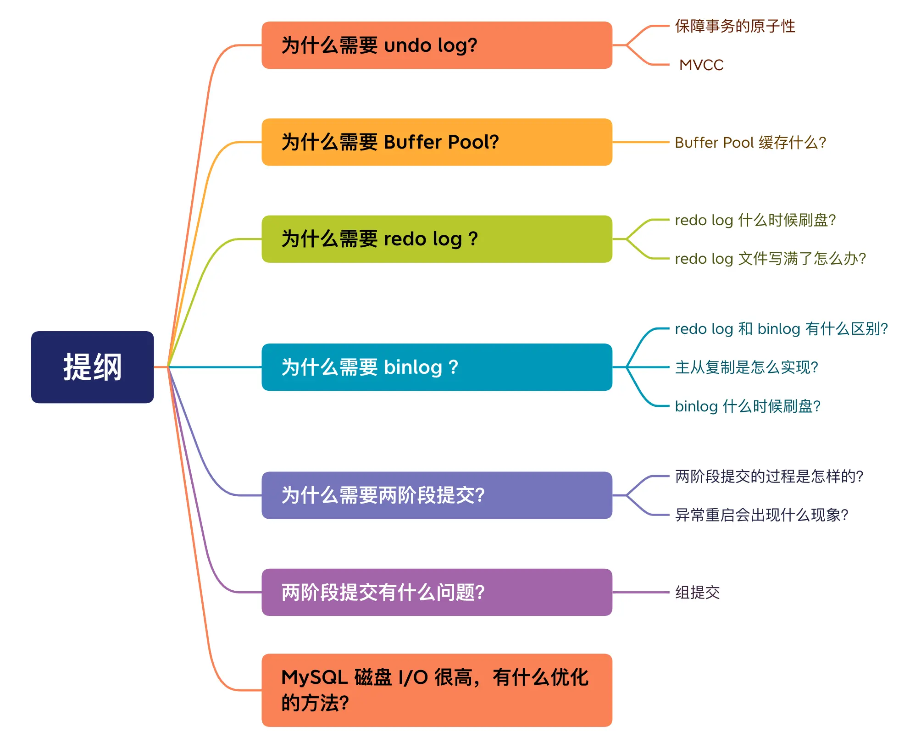

这三种日志各有各的用途，它们共同保证了 MySQL 数据的安全性和一致性。接下来我们就详细了解一下这三种日志的作用原理。

## 为什么需要 undo log？

我们在执行执行一条“增删改”语句的时候，虽然没有输入 begin 开启事务和 commit 提交事务，但是 MySQL 会**隐式开启事务**来执行“增删改”语句的，执行完就自动提交事务的，这样就保证了执行完“增删改”语句后，我们可以及时在数据库表看到“增删改”的结果了。

执行一条语句是否自动提交事务，是由 `autocommit` 参数决定的，默认是开启。所以，执行一条 update 语句也是会使用事务的。

那么，考虑一个问题。一个事务在执行过程中，在还没有提交事务之前，如果 MySQL 发生了崩溃，要怎么回滚到事务之前的数据呢？

如果我们每次在事务执行过程中，都记录下回滚时需要的信息到一个日志里，那么在事务执行中途发生了 MySQL 崩溃后，就不用担心无法回滚到事务之前的数据，我们可以通过这个日志回滚到事务之前的数据。

实现这一机制就是 **undo log（回滚日志），它保证了事务的 [ACID 特性](/2025/05/06/八股文/MYSQL/事务/2025-05-06-MySQL事务隔离级别的实现原理/)中的原子性（Atomicity）**。

### undo log 的工作原理

undo log 就像是一个"反向操作手册"，记录着如何撤销每一个操作。工作流程如下图：

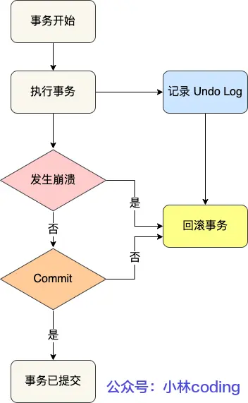

每当 InnoDB 引擎要修改一条记录时，都会先把"反向操作"记录到 undo log 中：

- **插入记录**时：记录这条记录的主键，回滚时只需要**删除**这个主键对应的记录
- **删除记录**时：记录整条记录的内容，回滚时**重新插入**这条记录
- **更新记录**时：记录被修改字段的**旧值**，回滚时**恢复为旧值**

举个具体例子：

```sql
-- 原始记录：id=1, name='张三', balance=1000
UPDATE users SET balance = 900 WHERE id = 1;
```

undo log 会记录：

```
操作类型：UPDATE
表：users
主键：id=1
旧值：balance=1000
```

如果需要回滚，MySQL 就读取这条 undo log，执行相反操作：

```sql
UPDATE users SET balance = 1000 WHERE id = 1;  -- 恢复旧值
```

### 版本链：记录修改历史

不同类型的操作会产生不同格式的 undo log，但每条 undo log 都包含两个重要信息：

- **trx_id（事务 ID）**：记录是哪个事务修改了这条数据
- **roll_pointer（回滚指针）**：指向上一个版本的 undo log

通过这些指针，MySQL 可以把同一条记录的所有历史版本串成一条链，这就是**版本链**：

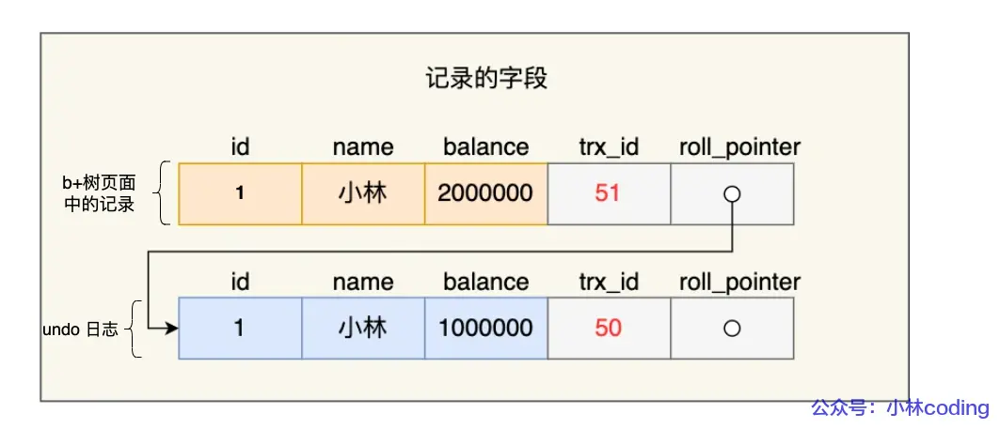

想象一条用户记录被多次修改：

1. 事务 100：name='张三' → name='李四'
2. 事务 200：name='李四' → name='王五'
3. 事务 300：name='王五' → name='赵六'

版本链就像这样：

```
当前记录(name='赵六') → undo log(name='王五') → undo log(name='李四') → undo log(name='张三')
```

这样，任何时候都能通过版本链找到记录的任何历史版本。

### undo log 的第二个作用：实现 MVCC

除了事务回滚，**undo log 还有一个重要作用：配合 ReadView 实现 MVCC（多版本并发控制）**。

简单来说，MVCC 让不同的事务能够"看到"数据的不同版本，从而实现读写不阻塞：

**读提交隔离级别**：

- 每次执行 SELECT 都会生成新的 ReadView
- 可能前后两次读取同一条数据，结果不一样（因为其他事务可能已经修改并提交了）

**可重复读隔离级别**：

- 事务开始时生成一个 ReadView，整个事务期间都使用这个 ReadView
- 保证事务期间多次读取同一条数据，结果都是一样的

MVCC 的核心机制是：

1. 根据事务的 ReadView 和记录的 trx_id、roll_pointer 进行比较
2. 如果当前版本不符合可见性要求，就沿着版本链往前找
3. 直到找到符合条件的历史版本

这样就实现了"一个事务在读取数据时，其他事务可以正常修改数据，互不干扰"。

具体的实现细节可以参考：[事务隔离级别是怎么实现的？](/2025/05/06/八股文/MYSQL/事务/2025-05-06-MySQL事务隔离级别的实现原理/)

### undo log 的两大作用总结

- **实现事务回滚**：保障事务的原子性，确保出错时能恢复到事务开始前的状态
- **实现 MVCC**：通过版本链为不同事务提供数据的不同版本视图，实现读写并发

## 为什么需要 Buffer Pool？

想象一下，如果每次查询或修改数据都要直接访问磁盘，那就像每次想看书都要跑图书馆一样，效率会非常低。更聪明的做法是把常用的书借回家放在书桌上，需要时随手就能翻阅。

MySQL 也是同样的思路。由于磁盘读写速度远远慢于内存，MySQL 设计了一个**缓冲池**（**Buffer Pool**）来提高性能：

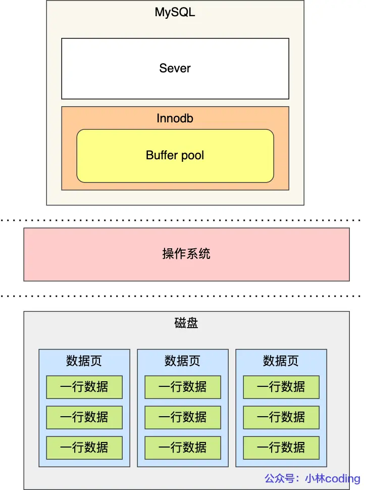

有了 Buffer Pool 之后，数据的读写流程变成：

**读取数据时**：

- 先检查 Buffer Pool 中是否已经有这个数据页
- 如果有，直接从内存读取（速度快）
- 如果没有，从磁盘加载到 Buffer Pool，再返回数据

**修改数据时**：

- 直接修改 Buffer Pool 中的数据页
- 将这个页标记为"脏页"（表示内存和磁盘的数据不一致了）
- 不立即写入磁盘，而是由后台线程在合适的时机统一刷盘

这种"先改内存，后写磁盘"的策略大大提高了数据库的读写性能。

### Buffer Pool 缓存什么？

InnoDB 将数据按**页**来管理，每页默认大小是 16KB。就像图书馆按册整理书籍一样，MySQL 也是按页整理数据的。

**Buffer Pool 的初始化过程**：

1. MySQL 启动时，申请一大块连续内存空间
2. 按 16KB 大小划分成若干个缓存页
3. 这些缓存页初始都是空的，等待数据加载

这就解释了为什么 MySQL 刚启动时虚拟内存很大，但物理内存使用很少——只有当缓存页被实际使用时，操作系统才会分配物理内存。

**Buffer Pool 主要缓存这些内容**：


- **数据页**：存储表中的实际数据
- **索引页**：存储索引结构，用于快速查找数据
- **Undo 页**：存储 undo log，用于事务回滚和 MVCC
- **插入缓存**：优化非主键索引的插入性能
- **自适应哈希索引**：MySQL 自动创建的哈希索引，加速查询
- **锁信息**：事务锁的相关信息

### 常见疑问解答

**Q：Undo 页记录什么？**

当事务开始后，InnoDB 在修改记录前会先生成 undo log。这些 undo log 就存储在 Buffer Pool 的 Undo 页中。

**Q：查询一条记录时，只加载这一条记录到 Buffer Pool 吗？**

不是的！InnoDB 会把**整个页**（16KB）加载到 Buffer Pool 中，然后通过页内的"页目录"定位到具体的记录。这是因为：

- 磁盘 I/O 的最小单位就是页
- 同一页内的其他记录很可能也会被访问到（空间局部性原理）

想了解更多关于页结构和索引查询的知识，可以参考：[换一个角度看 B+ 树](/2025/04/28/八股文/MYSQL/索引/InnoDB的数据页/)



**undo log 是如何持久化的？**

很多人会疑问：undo log 存在内存的 Buffer Pool 中，如何保证持久化呢？

答案是：undo log 和数据页使用相同的持久化策略，都依靠 redo log 来保证。

具体来说：

- Buffer Pool 中的 undo 页被修改时，也会生成相应的 redo log
- redo log 每秒刷盘一次，事务提交时也会刷盘
- 通过这种机制，数据页和 undo 页都能保证持久化



## 为什么需要 redo log？

Buffer Pool 确实提高了读写效率，但也带来了一个严重的问题：**内存中的数据在断电后会丢失！**

想象这样的场景：你在电脑上写了一篇重要文档，还没来得及保存，突然停电了。如果没有自动保存功能，你的心血就白费了。

MySQL 面临同样的风险：Buffer Pool 中修改后的数据（脏页）如果还没写入磁盘，一旦断电重启，这些修改就会消失。

为了解决这个问题，MySQL 采用了 **WAL（Write-Ahead Logging）技术**：

1. **先写日志，再写数据**：当有数据需要修改时，InnoDB 先更新内存，然后把这次修改以日志形式记录下来
2. **此时更新就算完成了**：不需要立即把脏页写入磁盘
3. **后台异步刷盘**：由后台线程在合适的时机将脏页写入磁盘

这个日志就是 **redo log（重做日志）**，整个过程如下图：

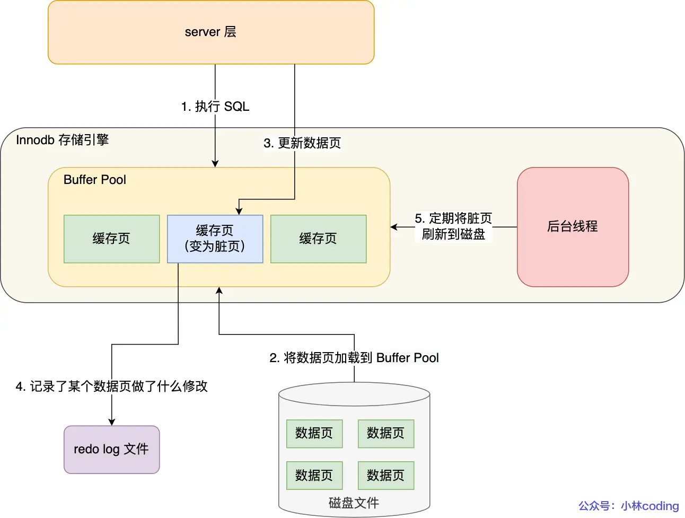

### 什么是 redo log？

**redo log 是物理日志**，它记录的是"在某个数据页的某个位置做了什么修改"。

比如：

```
对表空间 XXX 中的数据页 YYY 在偏移量 ZZZ 的位置，将值从 'A' 修改为 'B'
```

这种记录方式的好处是：

- **记录精确**：准确记录了数据的物理变化
- **恢复快速**：系统崩溃后，直接按照 redo log 重新执行修改即可
- **占用空间小**：只记录变化的部分，不记录完整数据

**redo log 的工作流程**：

1. 事务执行过程中，每个修改操作都会生成 redo log
2. 事务提交时，确保 redo log 已经写入磁盘
3. 如果系统崩溃，MySQL 重启后会扫描 redo log
4. 根据 redo log 中的记录，重新执行所有已提交事务的修改

这样就实现了 **crash-safe**(**崩溃恢复**)能力：即使数据库异常重启，已提交的数据也不会丢失。**redo log 保证了事务的持久性**。

### redo log vs undo log

这两种日志经常被混淆，让我们对比一下：

| 对比项       | redo log                 | undo log                          |
| ------------ | ------------------------ | --------------------------------- |
| **作用**     | 保证持久性（崩溃恢复）   | 保证原子性（事务回滚）和实现 MVCC |
| **记录内容** | 修改**之后**的数据状态   | 修改**之前**的数据状态            |
| **日志类型** | 物理日志（记录页面变化） | 逻辑日志（记录操作过程）          |
| **使用时机** | 系统崩溃后恢复已提交事务 | 事务回滚时撤销未提交修改          |

简单记忆：

- **redo = 重做**：系统崩溃后"重新做一遍"已提交的修改
- **undo = 撤销**：事务失败时"撤销"未提交的修改

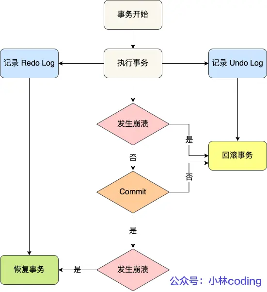

### 为什么要多此一举？既然都要写磁盘，为什么不直接写数据页？

这是一个很好的问题！答案在于**磁盘写入方式的差异**：

**redo log 的写入**：

- **顺序写**：redo log 文件是顺序追加写入的
- 就像在笔记本上从第一页开始，一页页往后写

**数据页的写入**：

- **随机写**：需要先定位到数据页在磁盘上的具体位置，然后写入
- 就像在一本很厚的字典里，需要先翻到特定页码，再修改内容

**磁盘的"顺序写"比"随机写"快得多！**

形象比喻：

- 顺序写 = 按顺序看小说，从第 1 页看到第 100 页
- 随机写 = 在字典里查单词，不断翻来翻去找特定页面

因此，WAL 技术带来了两个重要优势：

1. **保证持久性**：让 MySQL 具备 crash-safe 能力，任何时候崩溃都不会丢失已提交的数据
2. **提升性能**：将磁盘操作从"随机写"变成"顺序写"，大幅提升写入性能

### redo log 的缓存机制

实际上，redo log 也不是直接写入磁盘的。为了避免频繁的磁盘 I/O，MySQL 设计了 **redo log buffer**：

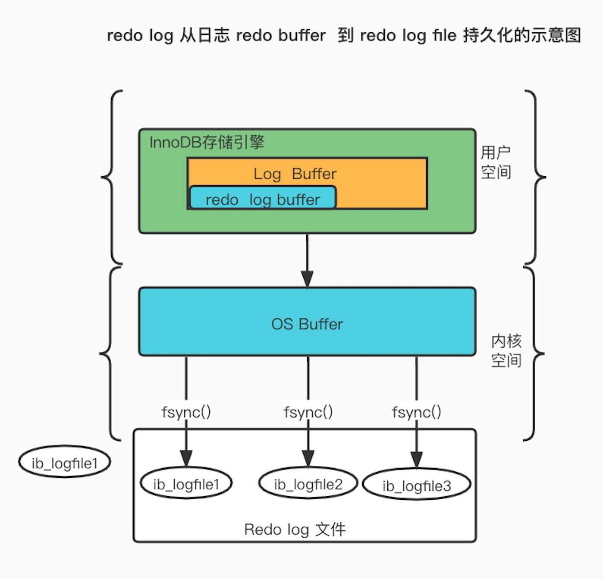

**工作流程**：

1. 事务执行时，redo log 先写入 redo log buffer（内存中）
2. 在特定时机，再将 redo log buffer 中的内容刷新到磁盘

**redo log buffer 的配置**：

- 默认大小：16 MB
- 配置参数：`innodb_log_buffer_size`
- 增大缓冲区可以让 MySQL 处理大事务时减少磁盘写入，提升性能

### redo log 什么时候刷盘？

redo log 虽然缓存在内存中，但总需要写入磁盘才能真正保证数据安全。主要有以下几个刷盘时机：

**自动刷盘时机**：

- **MySQL 正常关闭时**：确保所有日志都持久化
- **缓冲区写满一半时**：当 redo log buffer 使用量超过 50% 时触发
- **后台线程定时刷盘**：每隔 1 秒自动将 redo log buffer 持久化到磁盘

**事务提交时刷盘**：

- 每次事务提交时，会根据 `innodb_flush_log_at_trx_commit` 参数决定刷盘策略

### innodb_flush_log_at_trx_commit 参数详解

这个参数控制事务提交时 redo log 的刷盘行为，有 3 个可选值：

**参数值 = 0（性能最好，安全性最差）**：

- 事务提交时，redo log 停留在 redo log buffer 中，不写入磁盘
- 依赖后台线程每秒刷盘
- **风险**：MySQL 进程崩溃会丢失最近 1 秒的所有事务数据

**参数值 = 1（性能一般，安全性最好）- 默认值**：

- 事务提交时，立即将 redo log buffer 中的内容持久化到磁盘
- **最安全**：MySQL 异常重启也不会丢失已提交的数据

**参数值 = 2（性能和安全性的折中）**：

- 事务提交时，将 redo log 写入操作系统的文件缓存（Page Cache）
- 不立即 fsync 到磁盘，交给操作系统控制
- **风险**：只有在操作系统崩溃或断电时才会丢失数据

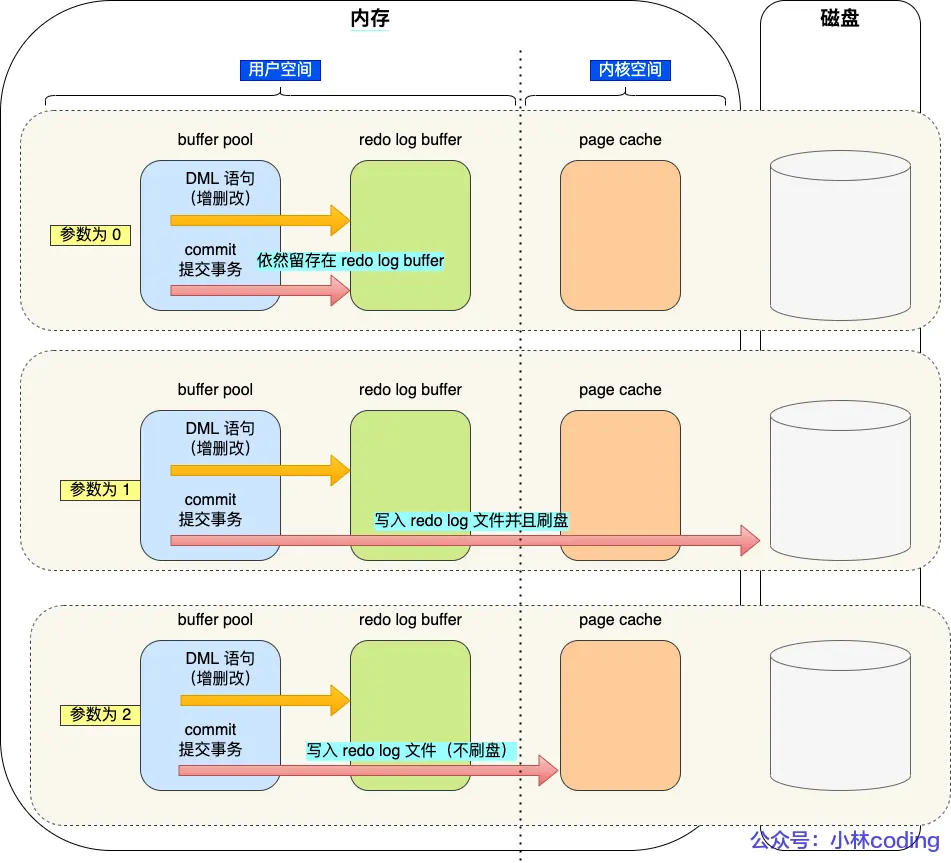

### 参数选择建议

**安全性对比**：参数 1 > 参数 2 > 参数 0  
**性能对比**：参数 0 > 参数 2 > 参数 1

**应用场景**：

- **金融、支付系统**：选择参数 1，数据安全最重要

### 后台线程的刷盘策略

无论 `innodb_flush_log_at_trx_commit` 设置为什么值，InnoDB 的后台线程每隔 1 秒都会执行刷盘操作：

**对于参数 0**：

- 将 redo log buffer → 操作系统 Page Cache → 磁盘
- 完整的刷盘流程：`write()` + `fsync()`

**对于参数 2**：

- 只执行 `fsync()`，将 Page Cache 中的数据写入磁盘
- 因为事务提交时已经执行了 `write()` 操作

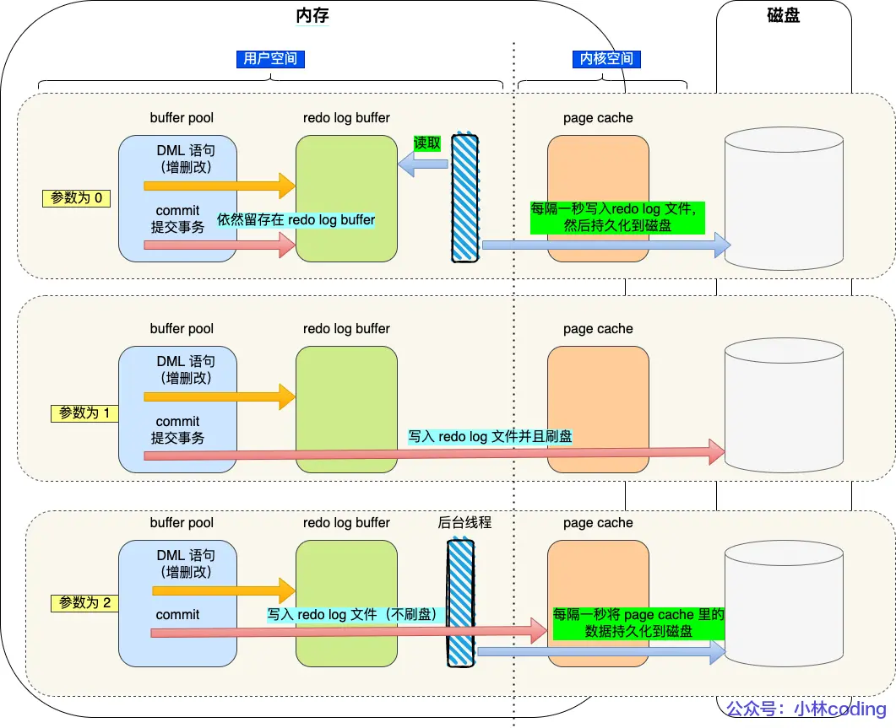

这解释了为什么：

- **参数 0**：MySQL 进程崩溃可能丢失 1 秒数据
- **参数 2**：只有操作系统崩溃才可能丢失 1 秒数据

### redo log 文件写满了怎么办？

redo log 不是无限增长的，而是使用**固定大小的循环文件**来存储。

**默认配置**：

- 1 个重做日志文件组（redo log Group）
- 包含 2 个 redo log 文件：`ib_logfile0` 和 `ib_logfile1`
- 每个文件大小固定（比如 1GB），总共可记录 2GB 的操作


**循环写入机制**：

1. 先写 `ib_logfile0`，写满后切换到 `ib_logfile1`
2. `ib_logfile1` 写满后，回到 `ib_logfile0` 开头继续写
3. 就像一个环形跑道，不断循环

### 循环写入的关键指针

MySQL 使用两个指针来管理 redo log 的循环写入：

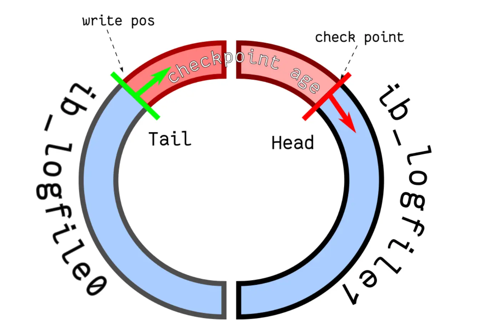

**write pos（写入位置）**：

- 当前 redo log 记录写到的位置
- 顺时针方向移动

**check point（检查点）**：

- 当前可以擦除的位置
- 也是顺时针方向移动

**区域划分**：

- **红色区域（write pos ~ check point）**：可以用来记录新的更新操作
- **蓝色区域（check point ~ write pos）**：已写入但还未刷盘的脏页记录

### 文件写满的处理机制

**当 write pos 追上 check point 时**：

- 表示 redo log 文件空间用完了
- **MySQL 被迫停止处理新的更新操作**（系统阻塞！）
- 必须先清理空间才能继续

**清理过程**：

1. **强制刷盘**：将 Buffer Pool 中的脏页刷新到磁盘
2. **标记可擦除**：标记哪些 redo log 记录可以被覆盖
3. **移动 check point**：check point 向前移动，释放空间
4. **恢复运行**：MySQL 重新开始处理更新操作

**性能优化建议**：

- 对于高并发系统，适当增大 redo log 文件大小非常重要
- 避免频繁触发"文件写满"导致的系统阻塞

## binlog：数据库的"全程录像"

前面我们学习了 undo log（后悔药）和 redo log（备份保险），现在让我们认识第三个重要角色：binlog，可以把它理解为数据库的"全程录像"或"操作记录本"。

### binlog 的作用：为什么需要"全程录像"？

想象一下，你的朋友向你借了一本珍贵的书，为了防止意外，你可能会：

1. 📝 记录下谁借了什么书（操作记录）
2. 🕐 记录借书的时间
3. 📄 记录书的具体信息

**binlog 就像这个借书记录本**，它详细记录了数据库中发生的每一个数据变更操作：

- 什么时候执行了什么 SQL 语句
- 哪些数据被修改了
- 修改前后的具体内容

### binlog 与 redo log 的区别：为什么需要两套日志？

你可能会疑惑：既然有了 redo log，为什么还需要 binlog？这其实是 MySQL 历史发展的结果。

**历史背景**：

- 最初的 MySQL 使用 MyISAM 存储引擎，只有 binlog
- 后来引入 InnoDB 引擎，带来了 redo log
- 两个日志系统各有特色，互相补充

**四大关键区别**：

| 对比维度     | redo log                 | binlog                        |
| ------------ | ------------------------ | ----------------------------- |
| **归属**     | InnoDB 存储引擎专用      | MySQL Server 层，所有引擎共用 |
| **用途**     | 崩溃恢复（防止数据丢失） | 数据备份、主从复制            |
| **写入方式** | 循环写（覆盖旧数据）     | 追加写（保留全部历史）        |
| **日志类型** | 物理日志（页面级修改）   | 逻辑日志（SQL 语句级）        |

### binlog 的三种记录格式

binlog 提供了三种记录格式，就像不同的摄像方式：

#### 1. STATEMENT 格式（语句记录）

**记录内容**：完整的 SQL 语句

```sql
-- binlog 中记录的内容
UPDATE users SET balance = balance - 100 WHERE id = 1;
```

**优点**：日志文件小，记录简洁
**缺点**：遇到 `NOW()`、`UUID()` 等函数时，主从库执行结果可能不一致

#### 2. ROW 格式（行记录）⭐

**记录内容**：每一行数据的具体变化

```sql
-- 记录的是具体数据变化
-- 用户ID=1的余额从1000变成900
```

**优点**：数据一致性最好，不会有函数导致的问题
**缺点**：批量操作时日志文件会很大

#### 3. MIXED 格式（混合模式）

**智能选择**：根据 SQL 语句的类型自动选择 STATEMENT 或 ROW 格式

> 💡 **版本提示**：MySQL 5.7.7 之前默认是 STATEMENT，之后默认是 ROW

### 数据恢复：binlog vs redo log

**场景：数据库被误删了，能用 redo log 恢复吗？**

❌ **不能用 redo log 恢复**

- redo log 是循环写，旧数据会被覆盖
- 只保存未刷盘的最新数据

✅ **只能用 binlog 恢复**

- binlog 保存了所有历史操作
- 可以重新"播放"所有数据变更

这就像：

- redo log 是"最近通话记录"（只保存最新的几条）
- binlog 是"完整通话录音"（保存所有内容）

### 主从复制：binlog 的重要应用

MySQL 的主从复制依赖于 binlog，也就是记录 MySQL 上的所有变化并以二进制形式保存在磁盘上。复制的过程就是将 binlog 中的数据从主库传输到从库上。

这个过程一般是**异步**的，也就是主库上执行事务操作的线程不会等待复制 binlog 的线程同步完成。

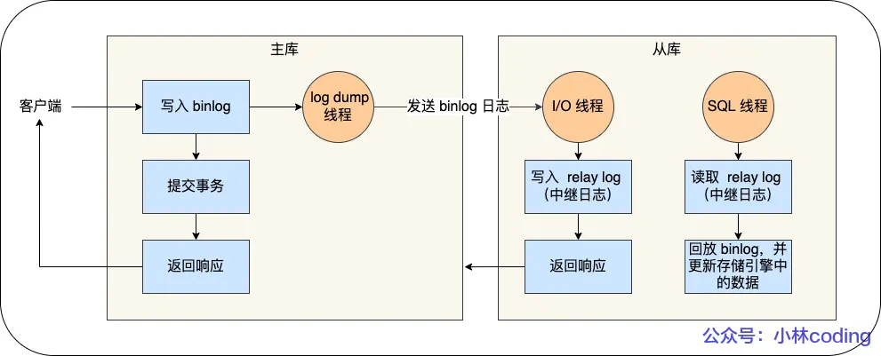

MySQL 集群的主从复制过程梳理成 3 个阶段：

- **写入 Binlog**：主库写 binlog 日志，提交事务，并更新本地存储数据。
- **同步 Binlog**：把 binlog 复制到所有从库上，每个从库把 binlog 写到暂存日志中。
- **回放 Binlog**：回放 binlog，并更新存储引擎中的数据。

具体详细过程如下：

- MySQL 主库在收到客户端提交事务的请求之后，会先写入 binlog，再提交事务，更新存储引擎中的数据，事务提交完成后，返回给客户端“操作成功”的响应。
- 从库会创建一个专门的 I/O 线程，连接主库的 log dump 线程，来接收主库的 binlog 日志，再把 binlog 信息写入 relay log 的中继日志里，再返回给主库“复制成功”的响应。
- 从库会创建一个用于回放 binlog 的线程，去读 relay log 中继日志，然后回放 binlog 更新存储引擎中的数据，最终实现主从的数据一致性。

在完成主从复制之后，你就可以在写数据时只写主库，在读数据时只读从库，这样即使写请求会锁表或者锁记录，也不会影响读请求的执行。

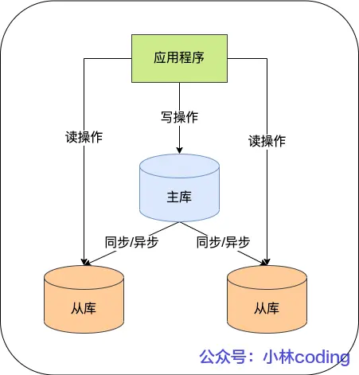

> 从库是不是越多越好？

不是的。

因为从库数量增加，从库连接上来的 I/O 线程也比较多，**主库也要创建同样多的 log dump 线程来处理复制的请求，对主库资源消耗比较高，同时还受限于主库的网络带宽**。

所以在实际使用中，一个主库一般跟 2 ～ 3 个从库（1 套数据库，1 主 2 从 1 备主），这就是一主多从的 MySQL 集群结构。

> MySQL 主从复制还有哪些模型？

主要有三种：

- **同步复制**：MySQL 主库提交事务的线程要等待所有从库的复制成功响应，才返回客户端结果。这种方式在实际项目中，基本上没法用，原因有两个：一是性能很差，因为要复制到所有节点才返回响应；二是可用性也很差，主库和所有从库任何一个数据库出问题，都会影响业务。
- **异步复制**（默认模型）：MySQL 主库提交事务的线程并不会等待 binlog 同步到各从库，就返回客户端结果。这种模式一旦主库宕机，数据就会发生丢失。
- **半同步复制**：MySQL 5.7 版本之后增加的一种复制方式，介于两者之间，事务线程不用等待所有的从库复制成功响应，只要一部分复制成功响应回来就行，比如一主二从的集群，只要数据成功复制到任意一个从库上，主库的事务线程就可以返回给客户端。这种**半同步复制的方式，兼顾了异步复制和同步复制的优点，即使出现主库宕机，至少还有一个从库有最新的数据，不存在数据丢失的风险**。

### binlog 什么时候刷盘？

事务执行过程中，先把日志写到 binlog cache（Server 层的 cache），事务提交的时候，再把 binlog cache 写到 binlog 文件中。

MySQL 给 binlog cache 分配了一片内存，每个线程一个，参数 binlog_cache_size 用于控制单个线程内 binlog cache 所占内存的大小。如果超过了这个参数规定的大小，就要暂存到磁盘。

> 什么时候 binlog cache 会写到 binlog 文件？

在事务提交的时候，执行器把 binlog cache 里的完整事务写入到 binlog 文件中，并清空 binlog cache。如下图：

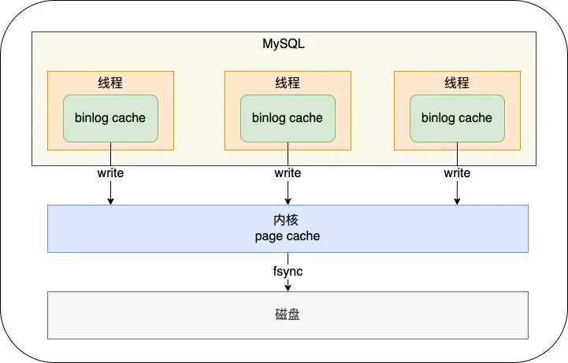

虽然每个线程有自己 binlog cache，但是最终都写到同一个 binlog 文件：

- 图中的 write，指的就是指把日志写入到 binlog 文件，但是并没有把数据持久化到磁盘，因为数据还缓存在文件系统的 page cache 里，write 的写入速度还是比较快的，因为不涉及磁盘 I/O。
- 图中的 fsync，才是将数据持久化到磁盘的操作，这里就会涉及磁盘 I/O，所以频繁的 fsync 会导致磁盘的 I/O 升高。

MySQL 提供一个 sync_binlog 参数来控制数据库的 binlog 刷到磁盘上的频率：

- sync_binlog = 0 的时候，表示每次提交事务都只 write，不 fsync，后续交由操作系统决定何时将数据持久化到磁盘；
- sync_binlog = 1 的时候，表示每次提交事务都会 write，然后马上执行 fsync；
- sync_binlog = N(N>1) 的时候，表示每次提交事务都 write，但累积 N 个事务后才 fsync。

在 MySQL 中系统默认的设置是 sync_binlog = 1，是最安全但是性能损耗最大的设置。因为当设置为 1 的时候，即使主机发生异常重启，最多丢失一个事务的 binlog，而已经持久化到磁盘的数据就不会有影响，不过就是对写入性能影响太大。

而当 sync_binlog 设置为 0 的时候，也就是不做任何强制性的磁盘刷新指令，这时候的性能是最好的，但是风险也是最大的。因为一旦主机发生异常重启，还没持久化到磁盘的数据就会丢失。

如果能容忍少量事务的 binlog 日志存在丢失风险的情况下，同时为了提高写入的性能，一般可以将 sync_binlog 设置为 100~1000 中的某个数值。

> 三个日志讲完了，至此我们可以先小结下，update 语句的执行过程。

当优化器分析出成本最小的执行计划后，执行器就按照执行计划开始进行更新操作。

具体更新一条记录 `UPDATE t_user SET name = 'xiaolin' WHERE id = 1;` 的流程如下：

1. 执行器负责具体执行，会调用存储引擎的接口，通过主键索引树搜索获取 id = 1 这一行记录：
   - 如果 id=1 这一行所在的数据页本来就在 buffer pool 中，就直接返回给执行器更新；
   - 如果记录不在 buffer pool，将数据页从磁盘读入到 buffer pool，返回记录给执行器。
2. 执行器得到聚簇索引记录后，会看一下更新前的记录和更新后的记录是否一样：
   - 如果一样的话就不进行后续更新流程；
   - 如果不一样的话就把更新前的记录和更新后的记录都当作参数传给 InnoDB 层，让 InnoDB 真正的执行更新记录的操作；
3. 开启事务，InnoDB 层更新记录前，首先要记录相应的 undo log，因为这是更新操作，需要把被更新的列的旧值记下来，也就是要生成一条 undo log，undo log 会写入 Buffer Pool 中的 Undo 页面，不过在内存修改该 Undo 页面后，需要记录对应的 redo log。
4. InnoDB 层开始更新记录，会先更新内存（同时标记为脏页），然后将记录写到 redo log 里面，这个时候更新就算完成了。为了减少磁盘 I/O，不会立即将脏页写入磁盘，后续由后台线程选择一个合适的时机将脏页写入到磁盘。这就是 **WAL 技术**，MySQL 的写操作并不是立刻写到磁盘上，而是先写 redo 日志，然后在合适的时间再将修改的行数据写到磁盘上。
5. 至此，一条记录更新完了。
6. 在一条更新语句执行完成后，然后开始记录该语句对应的 binlog，此时记录的 binlog 会被保存到 binlog cache，并没有刷新到硬盘上的 binlog 文件，在事务提交时才会统一将该事务运行过程中的所有 binlog 刷新到硬盘。
7. 事务提交，剩下的就是「两阶段提交」的事情了，接下来就讲这个。

## 为什么需要两阶段提交？

想象这样一个场景：你在银行转账，需要同时做两件事：

1. 在你的账户记录中减少 100 元
2. 在朋友的账户记录中增加 100 元

**如果银行系统在完成第一步后突然宕机，而第二步还没来得及执行，会发生什么？**

- 你的钱没了（你的账户减少了 100 元）
- 朋友没收到钱（朋友的账户没有增加）
- 这 100 元就"蒸发"了！

**MySQL 面临的也是类似问题**。当事务提交时，需要同时写入两个日志：

- **redo log**：保证主库数据的持久性
- **binlog**：用于主从复制，保证从库数据一致

如果这两个操作出现"半成功"状态，就会导致主从数据不一致。

### 问题实例：主从数据不一致

假设执行这条更新语句：

```sql
UPDATE t_user SET name = 'xiaolin' WHERE id = 1;
-- 原值：name = 'jay'
-- 新值：name = 'xiaolin'
```

**情况一：redo log 写入成功，binlog 写入失败**

- 主库：通过 redo log 恢复，name = 'xiaolin' ✅
- 从库：没有收到 binlog，name = 'jay' ❌
- **结果**：主从数据不一致

**情况二：binlog 写入成功，redo log 写入失败**

- 主库：redo log 丢失，事务回滚，name = 'jay' ❌
- 从库：收到 binlog 并执行，name = 'xiaolin' ✅
- **结果**：主从数据不一致

### 解决方案：两阶段提交

**两阶段提交就像一个"双重确认"机制**，确保 redo log 和 binlog 要么都成功，要么都失败。

**核心思想**：把事务提交拆分成两个阶段

- **准备阶段（Prepare）**：所有参与者准备就绪
- **提交阶段（Commit）**：协调者宣布正式提交

### 生活化比喻：结婚仪式

想象一场婚礼，需要新郎和新娘都同意才能完成：

**准备阶段**：

- 牧师问新郎："你愿意吗？"
- 牧师问新娘："你愿意吗？"
- 只有两人都说"我愿意"，才能进入下一阶段

**提交阶段**：

- 如果两人都同意：牧师宣布"你们现在是夫妻了"
- 如果任何一人拒绝：仪式取消

在 MySQL 中：

- **新郎** = redo log
- **新娘** = binlog
- **牧师** = 事务协调者
- **结婚证书** = 事务提交成功

### 两阶段提交的详细过程

在 MySQL 中，两阶段提交使用**内部 XA 事务**来实现：

- **协调者**：binlog
- **参与者**：InnoDB 存储引擎（redo log）

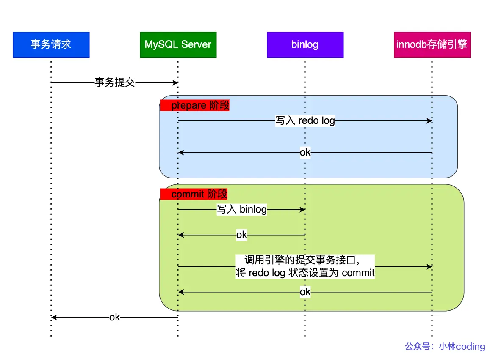

**具体执行流程**：

#### 准备阶段（Prepare Phase）

1. **生成事务 ID**：为事务分配一个唯一的 XID（事务标识符）
2. **记录 redo log**：将 XID 写入 redo log，并标记状态为 `prepare`
3. **刷盘保存**：将 prepare 状态的 redo log 持久化到磁盘

> 💡 **此时事务还没有正式提交**，只是表示 redo log 准备就绪

#### 提交阶段（Commit Phase）

1. **记录 binlog**：将事务的 XID 和具体操作写入 binlog
2. **binlog 刷盘**：将 binlog 持久化到磁盘
3. **最终提交**：调用存储引擎接口，将 redo log 状态改为 `commit`
4. **redo log 刷盘**：将 commit 状态持久化到磁盘

> ✅ **事务正式提交成功**

### 崩溃恢复：如何保证一致性？

**关键时刻的崩溃场景**：

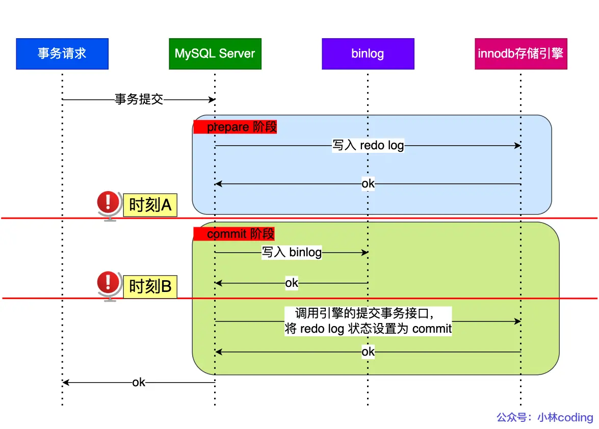

**时刻 A 崩溃**（redo log 已写，binlog 未写）：

- redo log 状态：`prepare`
- binlog 状态：无记录
- **恢复策略**：回滚事务（因为 binlog 中找不到对应的 XID）

**时刻 B 崩溃**（redo log 和 binlog 都已写，但还未标记 commit）：

- redo log 状态：`prepare`
- binlog 状态：有对应的 XID 记录
- **恢复策略**：提交事务（因为 binlog 中能找到对应的 XID）

### 恢复判断逻辑

MySQL 重启后的自动恢复过程：

```
1. 扫描 redo log 文件
2. 发现状态为 prepare 的事务
3. 提取该事务的 XID
4. 在 binlog 中查找是否存在相同的 XID
   ├── 找到了 → 提交事务 ✅
   └── 没找到 → 回滚事务 ❌
```

**核心原则**：**以 binlog 写入成功为准**

- binlog 写成功 = 事务应该提交（因为从库会收到这个操作）
- binlog 写失败 = 事务应该回滚（保持主从一致）

### 为什么以 binlog 为准？

**原因很简单**：

- binlog 一旦写入，就会被复制到从库
- 从库会根据 binlog 执行相同的操作
- 如果主库不提交这个事务，就会造成主从数据不一致

**所以必须保证**：主库和从库的处理策略完全一致

### 特殊情况：未提交事务的 redo log 刷盘

**疑问**：事务还没提交，redo log 会被持久化吗？

**答案**：会的！

**原因**：

- redo log buffer 中的内容会被后台线程每秒刷盘一次
- 这意味着未提交事务的 redo log 也可能在磁盘上

**安全保障**：

- 未提交事务的 binlog 绝对不会被持久化
- MySQL 重启时发现"有 redo log 但无 binlog"的事务，会自动回滚
- 数据一致性得到保证

**记忆要点**：

- ✅ redo log 可以在事务提交前持久化
- ❌ binlog 只能在事务提交后持久化

## 两阶段提交有什么问题？

两阶段提交虽然保证了两个日志文件的数据一致性，但是性能很差，主要有两个方面的影响：

- **磁盘 I/O 次数高**：对于“双 1”配置，每个事务提交都会进行两次 fsync（刷盘），一次是 redo log 刷盘，另一次是 binlog 刷盘。
- **锁竞争激烈**：两阶段提交虽然能够保证「单事务」两个日志的内容一致，但在「多事务」的情况下，却不能保证两者的提交顺序一致，因此，在两阶段提交的流程基础上，还需要加一个锁来保证提交的原子性，从而保证多事务的情况下，两个日志的提交顺序一致。

> 为什么两阶段提交的磁盘 I/O 次数会很高？

binlog 和 redo log 在内存中都对应的缓存空间，binlog 会缓存在 binlog cache，redo log 会缓存在 redo log buffer，它们持久化到磁盘的时机分别由下面这两个参数控制。一般我们为了避免日志丢失的风险，会将这两个参数设置为 1：

- 当 sync_binlog = 1 的时候，表示每次提交事务都会将 binlog cache 里的 binlog 直接持久到磁盘；
- 当 innodb_flush_log_at_trx_commit = 1 时，表示每次事务提交时，都将缓存在 redo log buffer 里的 redo log 直接持久化到磁盘；

可以看到，如果 sync_binlog 和 当 innodb_flush_log_at_trx_commit 都设置为 1，那么在每个事务提交过程中，都会至少调用 2 次刷盘操作，一次是 redo log 刷盘，一次是 binlog 落盘，所以这会成为性能瓶颈。

> 为什么锁竞争激烈？

在早期的 MySQL 版本中，通过使用 prepare_commit_mutex 锁来保证事务提交的顺序，在一个事务获取到锁时才能进入 prepare 阶段，一直到 commit 阶段结束才能释放锁，下个事务才可以继续进行 prepare 操作。

通过加锁虽然完美地解决了顺序一致性的问题，但在并发量较大的时候，就会导致对锁的争用，性能不佳。

### 组提交：集体坐公交，一次搞定！

**想象你每天上班都要坐公交车**：

**以前的做法**：每个人都打私家车

- 每个事务单独提交，单独刷盘
- 10 个事务 = 10 次磁盘操作
- 就像 10 个人开 10 辆车上班，效率低，还堵车

**组提交的做法**：大家一起坐公交

- **多个事务一起提交，一次刷盘**
- 10 个事务 = 1 次磁盘操作
- 就像 10 个人坐 1 辆公交车，效率高多了！

**MySQL 组提交的核心思想**：

- 不让事务"单打独斗"，而是"抱团取暖"
- 多个事务一起刷盘，大大减少磁盘 I/O 次数
- **如果 10 个事务单独刷盘成本是 10，那么一起刷盘的成本接近 1**

### 组提交的三个阶段

为了实现组提交，MySQL 把原来的 commit 阶段拆分成三个更精细的步骤：

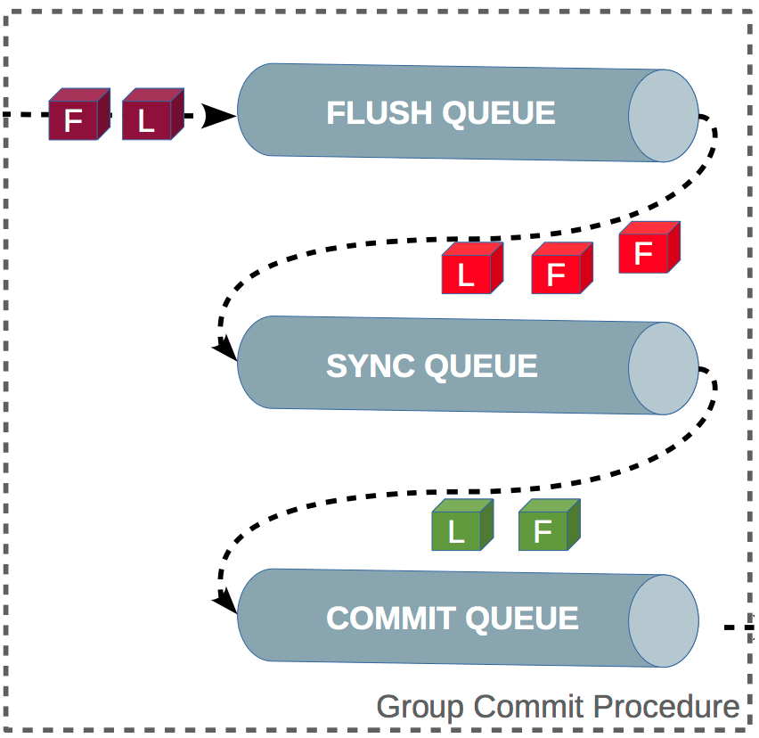

**三个阶段的作用**：

- **Flush 阶段**：把 binlog 从内存写到文件（但不刷盘）
- **Sync 阶段**：多个事务的 binlog 一起刷盘（关键步骤！）
- **Commit 阶段**：告诉存储引擎正式提交

**队列机制**：

- 每个阶段都有自己的队列
- 第一个到达的事务成为"队长"（Leader）
- 队长负责带领整个队伍完成操作
- 完成后通知队员们"任务完成"

### 锁粒度优化：从"独占整个银行"到"独占单个窗口"

**以前的锁机制**：

- 就像整个银行只有一个 VIP 通道
- 一个客户进去后，把整个银行都锁住
- 其他所有客户都要等着

**组提交的锁机制**：

- 就像银行有三个专门窗口：取号窗口、办理窗口、确认窗口
- 每个窗口可以同时服务，只是窗口内部需要排队
- **锁粒度变小，并发度提高**

### redo log 也有组提交吗？

**这要看 MySQL 版本**：

**MySQL 5.6**：❌ 没有 redo log 组提交

- 每个事务在 prepare 阶段各自刷盘
- 就像每个人都要单独过安检

**MySQL 5.7+**：✅ 有 redo log 组提交

- 把 redo log 刷盘推迟到 flush 阶段
- 多个事务的 redo log 一起刷盘
- **binlog 和 redo log 都能享受组提交的好处**

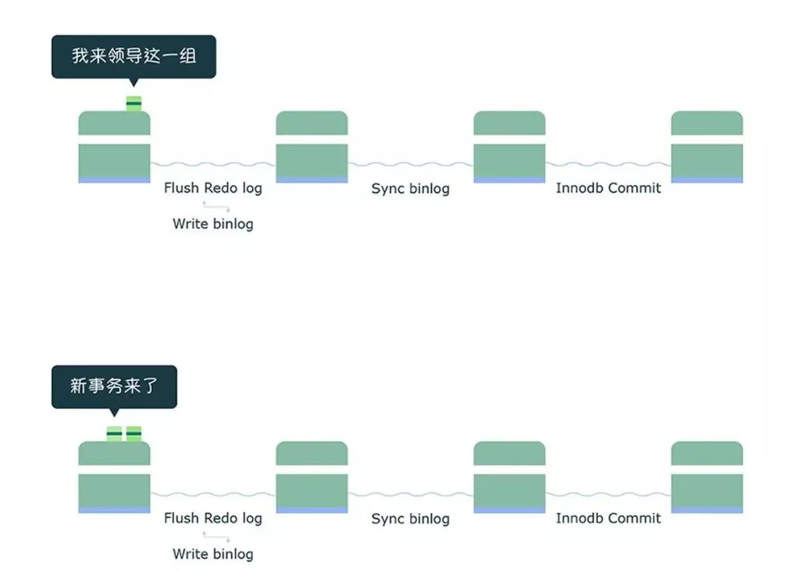

这个要看 MySQL 版本，MySQL 5.6 没有 redo log 组提交，MySQL 5.7 有 redo log 组提交。

在 MySQL 5.6 的组提交逻辑中，每个事务各自执行 prepare 阶段，也就是各自将 redo log 刷盘，这样就没办法对 redo log 进行组提交。

所以在 MySQL 5.7 版本中，做了个改进，在 prepare 阶段不再让事务各自执行 redo log 刷盘操作，而是推迟到组提交的 flush 阶段，也就是说 prepare 阶段融合在了 flush 阶段。

这个优化是将 redo log 的刷盘延迟到了 flush 阶段之中，sync 阶段之前。通过延迟写 redo log 的方式，为 redolog 做了一次组写入，这样 binlog 和 redo log 都进行了优化。

接下来介绍每个阶段的过程，注意下面的过程针对的是“双 1”配置（sync_binlog 和 innodb_flush_log_at_trx_commit 都配置为 1）。

> flush 阶段

第一个事务会成为 flush 阶段的 Leader，此时后面到来的事务都是 Follower：


接着，获取队列中的事务组，由绿色事务组的 Leader 对 rodo log 做一次 write + fsync，即一次将同组事务的 redolog 刷盘：

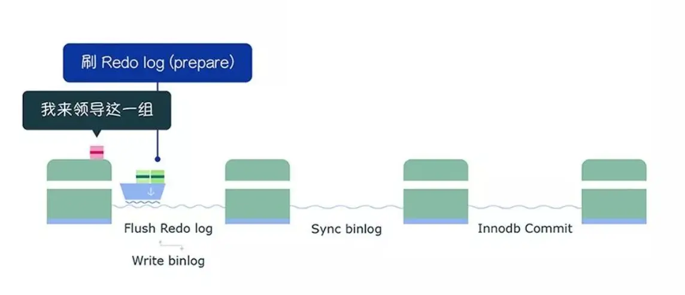

完成了 prepare 阶段后，将绿色这一组事务执行过程中产生的 binlog 写入 binlog 文件（调用 write，不会调用 fsync，所以不会刷盘，binlog 缓存在操作系统的文件系统中）。

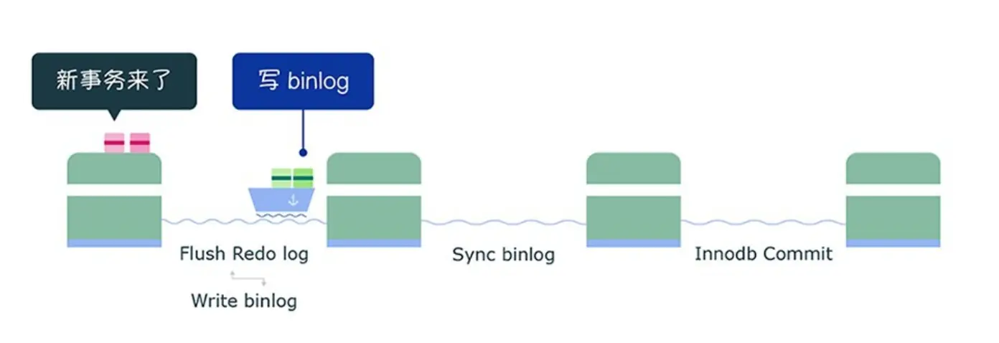

从上面这个过程，可以知道 flush 阶段队列的作用是**用于支撑 redo log 的组提交**。

如果在这一步完成后数据库崩溃，由于 binlog 中没有该组事务的记录，所以 MySQL 会在重启后回滚该组事务。

> sync 阶段

绿色这一组事务的 binlog 写入到 binlog 文件后，并不会马上执行刷盘的操作，而是**会等待一段时间**，这个等待的时长由 `Binlog_group_commit_sync_delay` 参数控制，**目的是为了组合更多事务的 binlog，然后再一起刷盘**，如下过程：

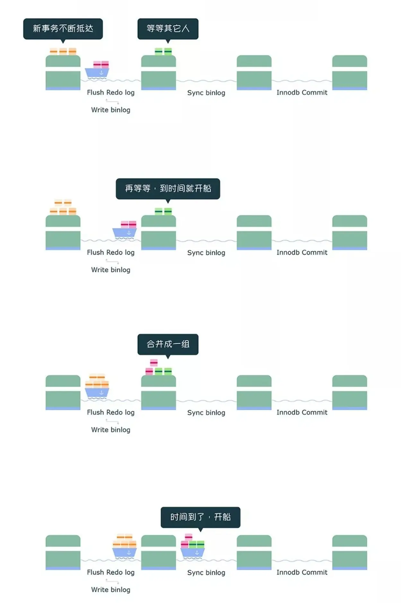

不过，在等待的过程中，如果事务的数量提前达到了 `Binlog_group_commit_sync_no_delay_count` 参数设置的值，就不用继续等待了，就马上将 binlog 刷盘，如下图：


从上面的过程，可以知道 sync 阶段队列的作用是**用于支持 binlog 的组提交**。

如果想提升 binlog 组提交的效果，可以通过设置下面这两个参数来实现：

- `binlog_group_commit_sync_delay= N`，表示在等待 N 微妙后，直接调用 fsync，将处于文件系统中 page cache 中的 binlog 刷盘，也就是将「binlog 文件」持久化到磁盘。
- `binlog_group_commit_sync_no_delay_count = N`，表示如果队列中的事务数达到 N 个，就忽视 binlog_group_commit_sync_delay 的设置，直接调用 fsync，将处于文件系统中 page cache 中的 binlog 刷盘。

如果在这一步完成后数据库崩溃，由于 binlog 中已经有了事务记录，MySQL 会在重启后通过 redo log 刷盘的数据继续进行事务的提交。

> commit 阶段

最后进入 commit 阶段，调用引擎的提交事务接口，将 redo log 状态设置为 commit。

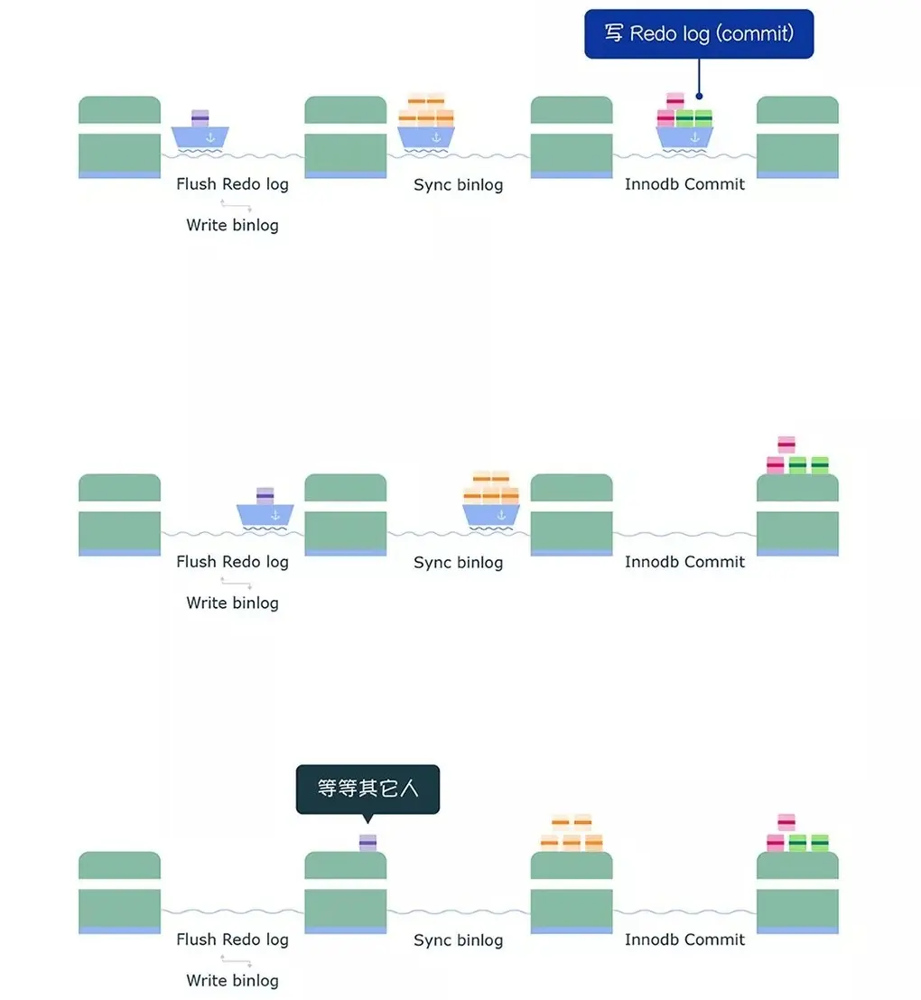

commit 阶段队列的作用是承接 sync 阶段的事务，完成最后的引擎提交，使得 sync 可以尽早的处理下一组事务，最大化组提交的效率。

## MySQL 磁盘 I/O 很高，有什么优化的方法？

现在我们知道事务在提交的时候，需要将 binlog 和 redo log 持久化到磁盘，那么如果出现 MySQL 磁盘 I/O 很高的现象，我们可以通过控制以下参数，来“延迟”binlog 和 redo log 刷盘的时机，从而降低磁盘 I/O 的频率：

- 设置组提交的两个参数：binlog_group_commit_sync_delay 和 binlog_group_commit_sync_no_delay_count 参数，延迟 binlog 刷盘的时机，从而减少 binlog 的刷盘次数。这个方法是基于“额外的故意等待”来实现的，因此可能会增加语句的响应时间，但即使 MySQL 进程中途挂了，也没有丢失数据的风险，因为 binlog 早被写入到 page cache 了，只要系统没有宕机，缓存在 page cache 里的 binlog 就会被持久化到磁盘。
- 将 sync_binlog 设置为大于 1 的值（比较常见是 100~1000），表示每次提交事务都 write，但累积 N 个事务后才 fsync，相当于延迟了 binlog 刷盘的时机。但是这样做的风险是，主机掉电时会丢 N 个事务的 binlog 日志。
- 将 innodb_flush_log_at_trx_commit 设置为 2。表示每次事务提交时，都只是缓存在 redo log buffer 里的 redo log 写到 redo log 文件，注意写入到「redo log 文件」并不意味着写入到了磁盘，因为操作系统的文件系统中有个 Page Cache，专门用来缓存文件数据的，所以写入「redo log 文件」意味着写入到了操作系统的文件缓存，然后交由操作系统控制持久化到磁盘的时机。但是这样做的风险是，主机掉电的时候会丢数据。

## 总结

具体更新一条记录 `UPDATE t_user SET name = 'xiaolin' WHERE id = 1;` 的流程如下：

1. 执行器负责具体执行，会调用存储引擎的接口，通过主键索引树搜索获取 id = 1 这一行记录：
   - 如果 id=1 这一行所在的数据页本来就在 buffer pool 中，就直接返回给执行器更新；
   - 如果记录不在 buffer pool，将数据页从磁盘读入到 buffer pool，返回记录给执行器。
2. 执行器得到聚簇索引记录后，会看一下更新前的记录和更新后的记录是否一样：
   - 如果一样的话就不进行后续更新流程；
   - 如果不一样的话就把更新前的记录和更新后的记录都当作参数传给 InnoDB 层，让 InnoDB 真正的执行更新记录的操作；
3. 开启事务，InnoDB 层更新记录前，首先要记录相应的 undo log，因为这是更新操作，需要把被更新的列的旧值记下来，也就是要生成一条 undo log，undo log 会写入 Buffer Pool 中的 Undo 页面，不过在内存修改该 Undo 页面后，需要记录对应的 redo log。
4. InnoDB 层开始更新记录，先生成对应 redo log，并存入 redo log buffer 里面，当事务提交时，将 redo log 写入 redo log file，并更新 buffer pool 中的数据页，将其放入 flush 链表并标记脏页和记录 redo log 对应的 lsn 到该页的 oldest_modification，这个时候更新就算完成了。为了减少磁盘 I/O，不会立即将脏页写入磁盘，后续由后台线程选择一个合适的时机将脏页写入到磁盘。这就是 **WAL 技术**，MySQL 的写操作并不是立刻写到磁盘上，而是先写 redo 日志，然后在合适的时间再将修改的行数据写到磁盘上。
5. 至此，一条记录更新完了。
6. 在一条更新语句执行完成后，然后开始记录该语句对应的 binlog，此时记录的 binlog 会被保存到 binlog cache，并没有刷新到硬盘上的 binlog 文件，在事务提交时才会统一将该事务运行过程中的所有 binlog 刷新到硬盘。
7. 事务提交（为了方便说明，这里不说组提交的过程，只说两阶段提交）：
   - **prepare 阶段**：将 redo log 对应的事务状态设置为 prepare，然后将 redo log 刷新到硬盘；
   - **commit 阶段**：将 binlog 刷新到磁盘，接着调用引擎的提交事务接口，将 redo log 状态设置为 commit（将事务设置为 commit 状态后，刷入到磁盘 redo log 文件）；
8. 至此，一条更新语句执行完成。

---

参考资料：

- 《MySQL 45 讲》
- 《MySQL 是怎样运行的？》
- https://developer.aliyun.com/article/617776
- http://mysql.taobao.org/monthly/2021/10/01/
- https://www.cnblogs.com/Neeo/articles/13883976.html
- https://www.cnblogs.com/mengxinJ/p/14211427.html
