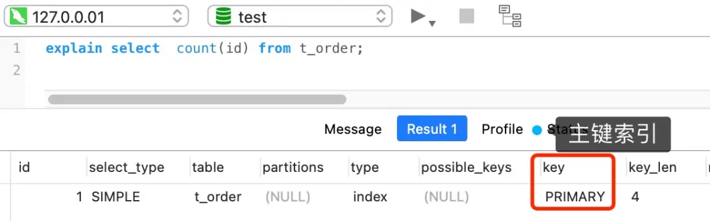
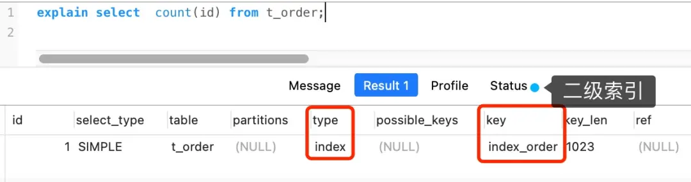
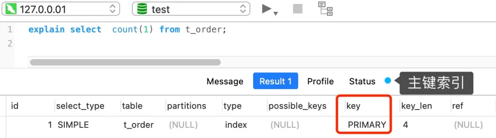
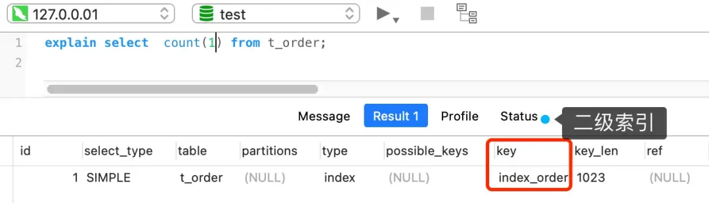
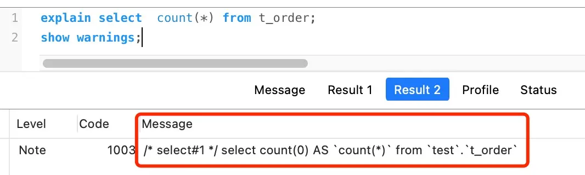
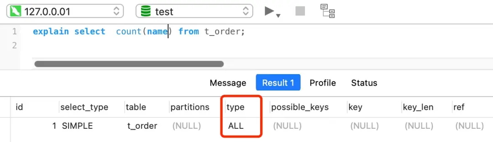
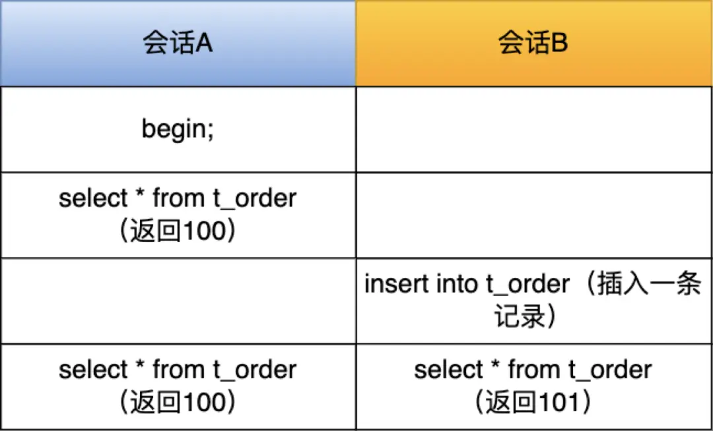
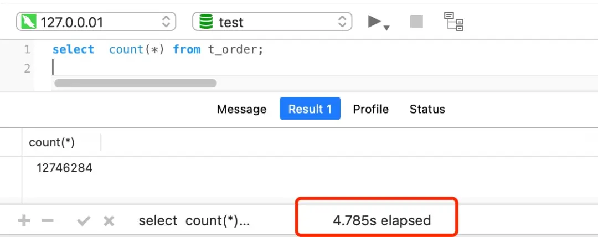
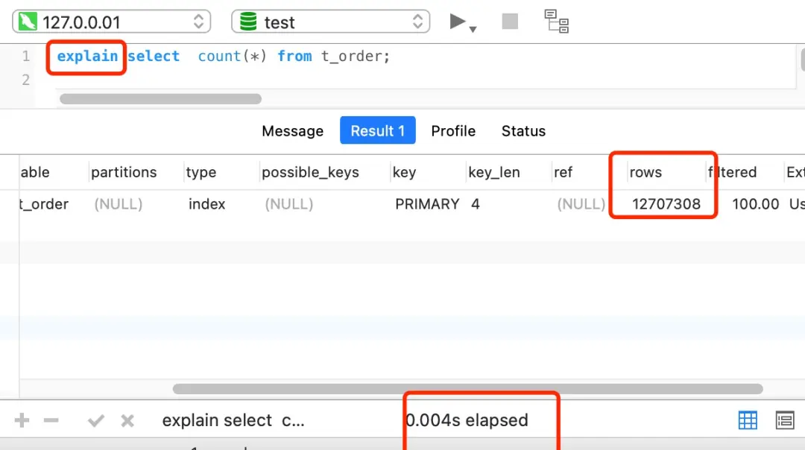

---
title: "MySQL八股: COUNT(*)与COUNT(1)的区别与性能对比"
date: 2025-05-05 21:46:13
categories:
  - 八股文
  - MySQL
  - 索引
tags:
  - MySQL
  - 数据库
  - 索引
  - 性能优化
  - 面试题
  - 八股文
description: "深入解析MySQL中COUNT(*)与COUNT(1)的区别，从执行原理到性能对比，分析各种场景下的最佳选择及优化建议，帮助你回答这道经典面试题。"
--- 

# COUNT(*) 和 COUNT(1) 有什么区别？哪个性能最好？

## 引言

在MySQL性能优化面试中，经常会被问到："`COUNT(*)`和`COUNT(1)`有什么区别？哪个性能更好？"

这个问题看似简单，实则暗藏玄机。很多人（包括我曾经）都认为`COUNT(*)`效率较差，因为它会读取所有字段，就像`SELECT * FROM table`一样。网上也有许多文章持这种观点。

但当我深入研究后，发现事实并非如此！本文将揭开这个常见MySQL八股文的真相。

## 结论先行

先给出明确结论，方便大家理解：

> **性能排序**: COUNT(*) = COUNT(1) > COUNT(主键字段) > COUNT(普通字段)

接下来，让我们一步步分析原理，看看为什么会有这样的结论。

## COUNT函数基础知识

### COUNT() 是什么？

COUNT()是一个聚合函数，其作用是：**统计符合查询条件的记录中，函数参数不为NULL的记录数量**。

这个函数的参数可以是：
- 字段名
- 常量表达式（如数字1）
- 特殊符号（如*）

### 不同COUNT用法的含义

| 用法 | 含义 | 
|------|------|
| COUNT(字段名) | 统计该字段不为NULL的记录数 |
| COUNT(1) | 统计表中的记录数（1永远不为NULL） |
| COUNT(*) | 统计表中的记录数（MySQL特殊优化） |

举个例子：

```sql
-- 统计t_order表中name字段不为NULL的记录数
SELECT COUNT(name) FROM t_order;

-- 统计t_order表中的总记录数
SELECT COUNT(1) FROM t_order;
SELECT COUNT(*) FROM t_order;
```

## COUNT不同用法的执行原理

为了理解性能差异，我们需要了解不同COUNT用法的执行过程。以下分析基于InnoDB存储引擎。

### 执行过程概述

当执行COUNT函数时，MySQL服务器层会：
1. 维护一个计数变量count
2. 从存储引擎读取记录
3. 判断COUNT函数参数是否为NULL
4. 如果不为NULL，count变量+1
5. 读完所有记录后，返回count值

关键差异在于：**MySQL从哪里读取记录**以及**是否需要读取字段值**。

### COUNT(主键字段)的执行过程



执行`SELECT COUNT(id) FROM t_order`（id为主键）时：

1. **如果只有主键索引**：
   - InnoDB遍历聚簇索引
   - 读取每条记录的id值
   - 判断id是否为NULL（通常主键不允许NULL）
   - 如果不为NULL，计数+1

2. **如果有二级索引**：
   - InnoDB会选择最小的二级索引进行遍历
   - 因为二级索引通常比聚簇索引小，I/O成本更低



### COUNT(1)的执行过程



执行`SELECT COUNT(1) FROM t_order`时：

1. **选择索引**：
   - 同样会优先选择最小的索引进行遍历
   
2. **关键差异**：
   - **不需要读取记录中的任何字段值**
   - 常量1永远不为NULL，直接计数+1
   
这就是为什么`COUNT(1)`比`COUNT(主键字段)`快一点 - 少了读取和判断字段值的步骤。



### COUNT(*)的执行过程



许多人误解的地方来了：`COUNT(*)`并不会读取所有字段！

**事实**：MySQL对`COUNT(*)`做了特殊优化，将其视为`COUNT(0)`处理。

从MySQL 5.7官方手册：
> *InnoDB handles SELECT COUNT(\*) and SELECT COUNT(1) operations in the same way. There is no performance difference.*
> 
> *翻译：InnoDB以相同的方式处理SELECT COUNT(\*)和SELECT COUNT(1)操作，没有性能差异。*

所以，`COUNT(*)`和`COUNT(1)`的执行过程基本相同，性能也几乎一样。

### COUNT(普通字段)的执行过程



执行`SELECT COUNT(name) FROM t_order`（name是普通非索引字段）时：

1. 需要遍历表记录
2. **必须读取name字段的值**
3. 判断name是否为NULL
4. 如果不为NULL，计数+1

这通常需要全表扫描，效率最低。

## 为什么InnoDB必须遍历表来计数？

你可能会问：为什么不直接维护一个计数器？

这是因为存储引擎的设计差异：

### MyISAM vs InnoDB

1. **MyISAM引擎**：
   - 维护表的元数据，包括row_count值
   - 执行`COUNT(*)`只需O(1)复杂度
   - 直接返回row_count值

2. **InnoDB引擎**：
   - 支持事务和MVCC(多版本并发控制)
   - 同一时刻的多个事务可能看到不同的行数
   - 无法维护单一的row_count变量

### MVCC导致的计数差异



如上图所示，在事务环境下：
- 会话A开启事务，两次查询都是100条记录
- 会话B插入一条记录后进行查询，得到的是101条记录

这就是为什么InnoDB必须遍历表来计数 - 每个事务可能看到不同的结果。

## 如何优化大表的COUNT操作？

对大表执行COUNT操作会很慢。例如：



上面的例子中，一张有1200万记录的表，即使有二级索引，`COUNT(*)`仍需近5秒！

### 优化方案一：使用近似值


如果业务允许近似值，可以使用：
- `SHOW TABLE STATUS` 命令
- `EXPLAIN` 命令

```sql
-- 查看表状态，获取行数估计值
SHOW TABLE STATUS LIKE 't_order';

-- 使用EXPLAIN获取行数估计值
EXPLAIN SELECT * FROM t_order;
```



这些命令非常快，因为它们不会真正扫描表，而是基于统计信息估算。

### 优化方案二：单独的计数表

如果需要精确计数，可以：
1. 创建专门的计数表
2. 在数据表的增删操作中同步更新计数表
3. 查询时直接从计数表获取数值

```sql
-- 创建计数表
CREATE TABLE t_counts (
    table_name VARCHAR(64) PRIMARY KEY,
    row_count BIGINT UNSIGNED
);

-- 初始化计数
INSERT INTO t_counts VALUES ('t_order', 0);

-- 在插入t_order时更新计数
BEGIN;
INSERT INTO t_order VALUES (...);
UPDATE t_counts SET row_count = row_count + 1 WHERE table_name = 't_order';
COMMIT;

-- 在删除t_order时更新计数
BEGIN;
DELETE FROM t_order WHERE ...;
UPDATE t_counts SET row_count = row_count - 1 WHERE table_name = 't_order';
COMMIT;
```

这种方式需要在应用层确保数据一致性，但查询效率极高。

## 最佳实践总结

| 场景 | 推荐做法 |
|------|----------|
| 需要统计表总行数 | 优先使用`COUNT(*)`或`COUNT(1)`，二者性能相当 |
| 需要统计某字段非NULL值 | 对该字段建立索引，然后使用`COUNT(字段名)` |
| 大表统计且允许近似值 | 使用`SHOW TABLE STATUS`或`EXPLAIN` |
| 大表需要精确统计且频繁查询 | 使用单独的计数表维护行数 |
| 有二级索引的表 | MySQL优化器会自动选择最小的索引 |

## 结论

1. **`COUNT(*)`和`COUNT(1)`性能基本相同**，都经过了MySQL的优化
2. 都优于`COUNT(主键字段)`，因为不需要取值比较
3. `COUNT(普通字段)`效率最低，除非你只想统计该字段非NULL的记录
4. 大表统计时，考虑使用近似值或专门的计数表
5. 针对特定业务场景，选择合适的计数方式才是王道

希望本文能帮助你彻底理解这个常见的MySQL面试题，在实际工作中做出正确的选择！

