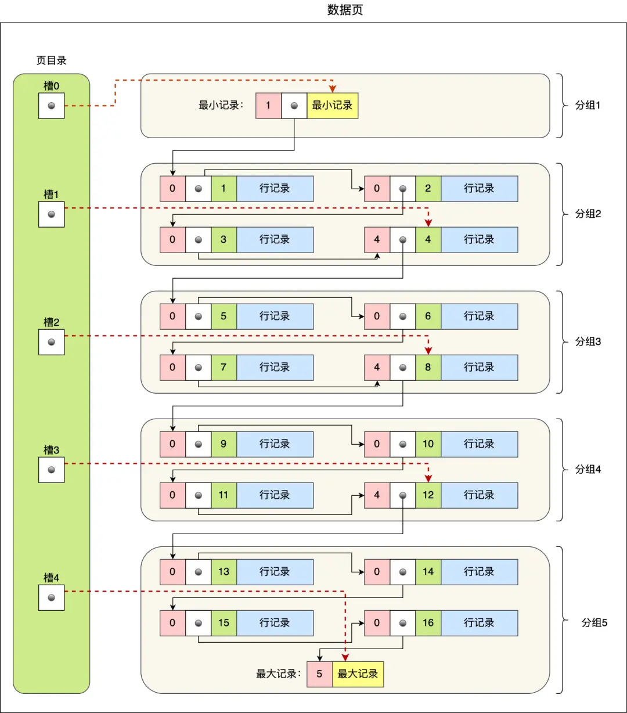
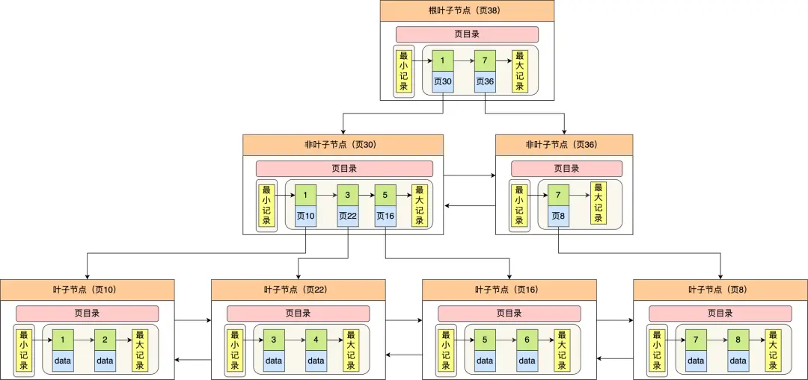
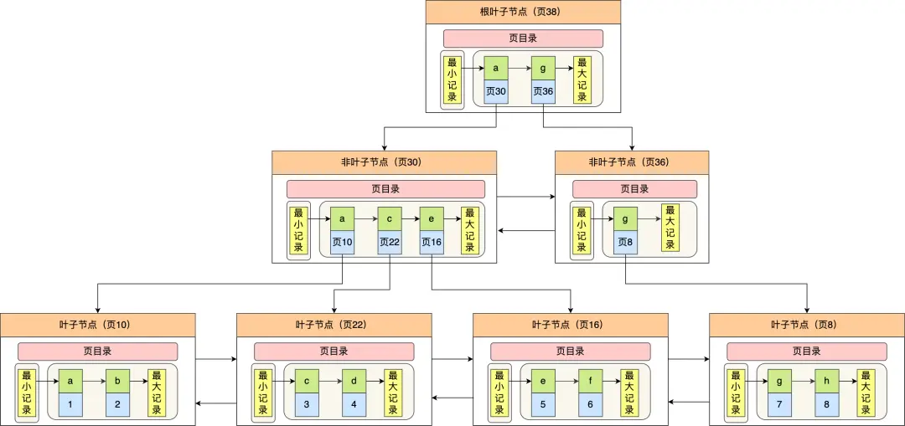

## InnoDB 是如何存储数据？

InnoDB 的记录是按照行来存储的，但是数据库的读取并不以「行」为单位，否则一次读取（也就是一次 I/O 操作）只能处理一行数据，效率会非常低。

因此，**InnoDB 的数据是按「数据页」为单位来读写的**，也就是说，当需要读一条记录的时候，并不是将这个记录本身从磁盘读出来，而是以页为单位，将其整体读入内存。

数据库的 I/O 操作的最小单位是页，**InnoDB 数据页的默认大小是 16KB**，意味着数据库每次读写都是以 16KB 为单位的，一次最少从磁盘中读取 16K 的内容到内存中，一次最少把内存中的 16K 内容刷新到磁盘中。

数据页包括七个部分，结构如下图：

这七个部分的作用如下表:

| 名称                                | 大小 | 描述                                     |
| ----------------------------------- | ---- | ---------------------------------------- |
| File Header（文件头）               | 38 B | 存储页的元数据信息，如页号、校验和等     |
| Page Header（页头）                 | 56 B | 存储页的状态信息，如记录数、空闲空间等   |
| Infimum & Supremum（最小/最大记录） | 26 B | 两条虚拟记录，分别代表页内最小和最大记录 |
| User Records（用户记录）            | 不定 | 实际存储的行记录内容                     |
| Free Space（空闲空间）              | 不定 | 尚未被使用的空间，用于插入新记录         |
| Page Directory（页目录）            | 不定 | 存储用户记录的相对位置，便于快速定位记录 |
| File Trailer（文件尾）              | 8 B  | 用于校验页的完整性                       |

在 File Header 中有两个指针，分别指向上一个数据页和下一个数据页，链接起来的页相当于一个双向的链表，如下图：

采用链表的结构是让数据页之间不需要是物理上的连续的，而是逻辑上的连续。

---

数据页的主要作用是存储记录，也就是数据库的数据，所以重点说一下数据页中的 User Records 是怎么组织数据的。

**数据页中的记录按照「主键」顺序组成单向链表**，单向链表的特点就是插入、删除非常方便，但是检索效率不高，最差的情况下需要遍历链表上的所有节点才能完成检索。

因此，数据页中有一个**页目录**，起到记录的索引作用，就像我们书那样，针对书中内容的每个章节设立了一个目录，想看某个章节的时候，可以查看目录，快速找到对应的章节的页数，而数据页中的页目录就是为了能快速找到记录。

页目录与记录的关系如下图：

页目录的创建过程如下:

1. 将所有的纪录划分为几组，这些记录包括**最小记录**和**最大记录**，但是不包括标记为**已删除**的记录
2. 每个记录组的最后一条记录就是组内最大的那条记录，并且最后一条记录的头信息中会存储该组一共有多少条记录，作为 `n_owned`字段（也就是上图中的粉红色字段）
3. 页目录的作用是加快在数据页中查找记录的速度。它的实现方式是：将每一组的最后一条记录的地址（准确来说是该记录在数据页中的偏移量）保存下来，这些地址偏移量会按照记录在数据页中的顺序依次排列。每一个偏移量被称为一个“槽”（slot），可以理解为一个指针，指向对应组的最后一条记录。这样，当我们需要查找某条记录时，可以先通过页目录快速定位到可能所在的记录组，然后在该组内进行遍历查找，大大减少了需要遍历的记录数量，提高了查找效率。页目录本身通常存储在数据页的尾部，随着用户记录的插入和删除，页目录中的槽数量和内容也会动态变化。

从图中可以看到，页目录就是由多个槽组成的，槽相当于分组记录的索引。然后，因为记录是按照「主键值」从小到大排序的，所以我们通过槽查找记录时，可以使用二分法快速定位要查询的记录在哪个槽(哪个记录分组),定位到槽后，再遍历槽内的所有记录，找到对应的记录，无需从最小纪录开始遍历整个页中的记录链表。

以上面那张图举个例子，5 个槽的编号分别为 0，1，2，3，4，我想查找主键为 11 的用户记录：

- 先二分得出槽中间位是 (0+4)/2=2，2 号槽里最大的记录为 8。因为 11 > 8，所以需要从 2 号槽后继续搜索记录；
- 再使用二分搜索出 2 号和 4 号槽的中间位是 (2+4)/2= 3，3 号槽里最大的记录为 12。因为 11 < 12，所以主键为 11 的记录在 3 号槽里；
- 这里有个问题，**「槽对应的值都是这个组的主键最大的记录，如何找到组里最小的记录」**？比如槽 3 对应最大主键是 12 的记录，那如何找到最小记录 9。解决办法是：通过槽 3 找到 槽 2 对应的记录，也就是主键为 8 的记录。主键为 8 的记录的下一条记录就是槽 3 当中主键最小的 9 记录，然后开始向下搜索 2 次，定位到主键为 11 的记录，取出该条记录的信息即为我们想要查找的内容。

看到第三步的时候，可能有的同学会疑问，如果某个槽内的记录很多，然后因为记录都是单向链表串起来的，那这样在槽内查找某个记录的时间复杂度不就是 O(n) 了吗？

这点不用担心，InnoDB 对每个分组中的记录条数都是有规定的，槽内的记录就只有几条：

- 第一个分组中的记录只能有 1 条记录；
- 最后一个分组中的记录条数范围只能在 1-8 条之间；
- 剩下的分组中记录条数范围只能在 4-8 条之间。

## B+树的查询方式

上面我们说的都是在一个数据页内查找记录，因为一个数据页中的记录是有限的，且主键值是有序的，所以通过对所有记录进行分组，然后将组号(槽号)存储到页目录，使其起到索引作用，通过二分查找到方法快速检索到记录在哪个分组，来降低检索的时间复杂度。

但是，当我们需要存储大量的记录时，就需要多个数据页，这时候我们就需要考虑如何建立合适的索引，才能方便定位记录所在的页。

为了解决这个问题，InnoDB 采用了 B+ 树的结构来存储记录。磁盘的 I/O 操作次数对索引的使用效率至关重要，因此在构造索引的时候，我们更加倾向于采用矮胖的"B+树"结构，这样就可以大大减少磁盘的 I/O 操作次数，而且 B+树更加适合进行关键字的范围查询

InnoDB 中的 B+树中的每一个节点都是一个数据页，结构示意如下:

通过上图，我们看出 B+ 树的特点：

- 只有叶子节点（最底层的节点）才存放了数据，非叶子节点（其他上层节）仅用来存放目录项作为索引。
- 非叶子节点分为不同层次，通过分层来降低每一层的搜索量；
- 所有节点按照索引键大小排序，构成一个双向链表，便于范围查询；

我们再看看 B+ 树如何实现快速查找主键为 6 的记录，以上图为例子：

- 从根节点开始，通过二分法快速定位到符合页内范围包含查询值的页，因为查询的主键值为 6，在[1, 7) 范围之间，所以到页 30 中查找更详细的目录项；
- 在非叶子节点（页 30）中，继续通过二分法快速定位到符合页内范围包含查询值的页，主键值大于 5，所以就到叶子节点（页 16）查找记录；
- 接着，在叶子节点（页 16）中，通过槽查找记录时，使用二分法快速定位要查询的记录在哪个槽（哪个记录分组），定位到槽后，再遍历槽内的所有记录，找到主键为 6 的记录。

可以看到，在定位记录所在哪一个页时，也是通过二分法快速定位到包含该记录的页。定位到该页后，又会在该页内进行二分法快速定位记录所在的分组（槽号），最后在分组内进行遍历查找。

## 聚簇索引和二级索引

另外，索引又可以分成聚簇索引和非聚簇索引（二级索引），它们区别就在于叶子节点存放的是什么数据：

- 聚簇索引的叶子节点存放的是实际数据，所有完整的用户记录都存放在聚簇索引的叶子节点；
- 二级索引的叶子节点存放的是主键值，而不是实际数据。

因为表的数据都是存放在聚簇索引的叶子节点里，所以 InnoDB 存储引擎一定会为表创建一个聚簇索引，且由于数据在物理上只会保存一份，所以聚簇索引只能有一个。

InnoDB 在创建聚簇索引时，会根据不同的场景选择不同的列作为索引：

- 如果有主键，默认会使用主键作为聚簇索引的索引键；
- 如果没有主键，就选择第一个不包含 NULL 值的唯一列作为聚簇索引的索引键；
- 在上面两个都没有的情况下，InnoDB 将自动生成一个隐式自增 id 列作为聚簇索引的索引键；

一张表只能有一个聚簇索引，那为了实现非主键字段的快速搜索，就引出了二级索引（非聚簇索引/辅助索引），它也是利用了 B+ 树的数据结构，但是二级索引的叶子节点存放的是主键值，不是实际数据。

二级索引的 B+ 树如下图，数据部分为主键值：

因此，**如果某个查询语句使用了二级索引，但是查询的数据不是主键值，这时在二级索引找到主键值后，需要去聚簇索引中获得数据行，这个过程就叫作「回表」，也就是说要查两个 B+ 树才能查到数据。不过，当查询的数据是主键值时，因为只在二级索引就能查询到，不用再去聚簇索引查，这个过程就叫作「索引覆盖」，也就是只需要查一个 B+ 树就能找到数据。**

## 总结

InnoDB 的数据是按「数据页」为单位来读写的，默认数据页大小为 16 KB。每个数据页之间通过双向链表的形式组织起来，物理上不连续，但是逻辑上连续。

数据页内包含用户记录，每个记录之间用单向链表的方式组织起来，为了加快在数据页内高效查询记录，设计了一个页目录，页目录存储各个槽（分组），且主键值是有序的，于是可以通过二分查找法的方式进行检索从而提高效率。

为了高效查询记录所在的数据页，InnoDB 采用 b+ 树作为索引，每个节点都是一个数据页。

如果叶子节点存储的是实际数据的就是聚簇索引，一个表只能有一个聚簇索引；如果叶子节点存储的不是实际数据，而是主键值则就是二级索引，一个表中可以有多个二级索引。

在使用二级索引进行查找数据时，如果查询的数据能在二级索引找到，那么就是「索引覆盖」操作，如果查询的数据不在二级索引里，就需要先在二级索引找到主键值，需要去聚簇索引中获得数据行，这个过程就叫作「回表」。
