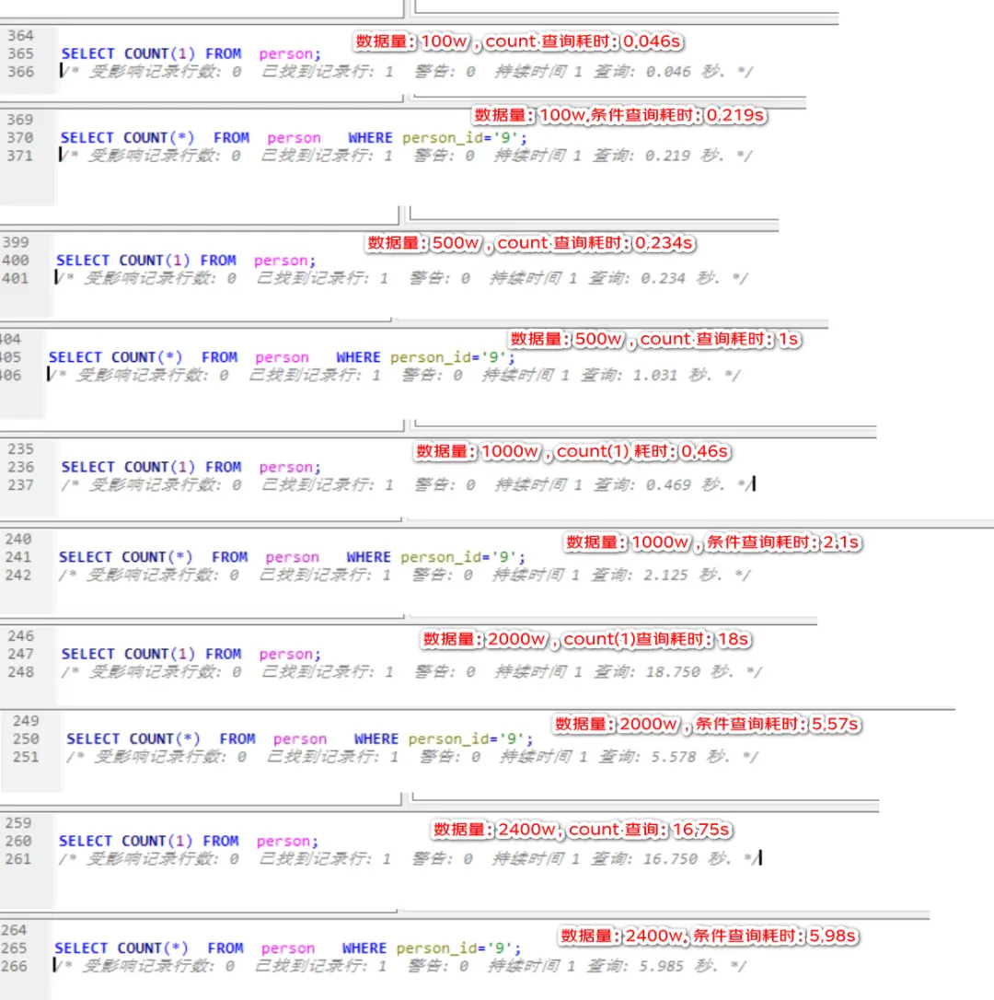
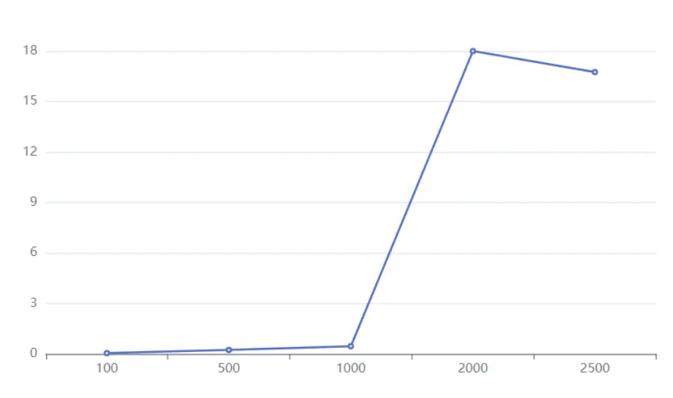
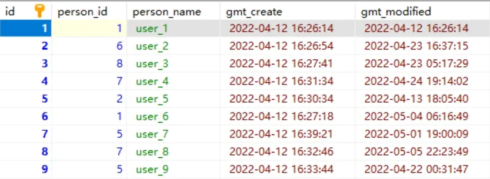
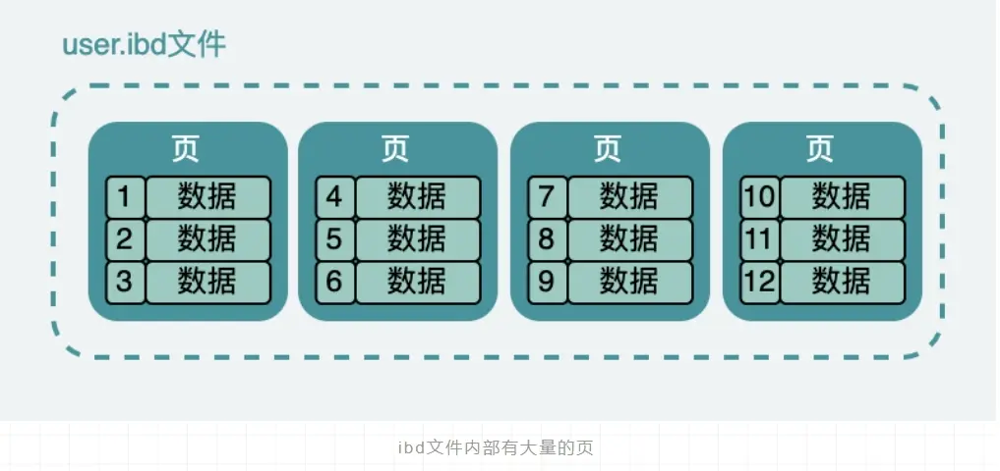
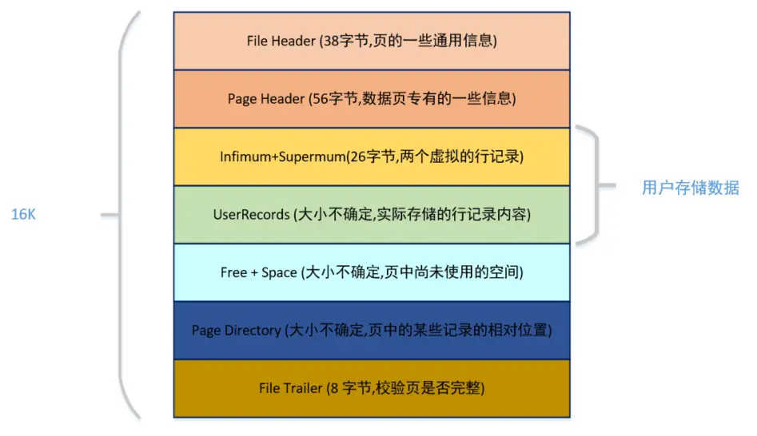
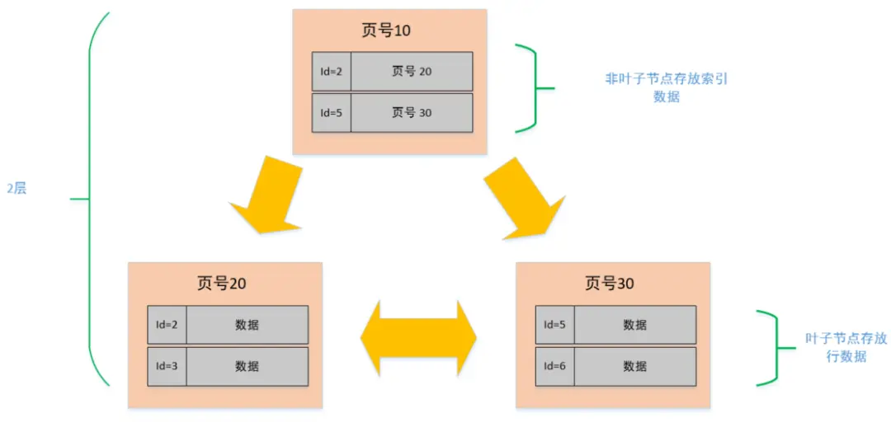
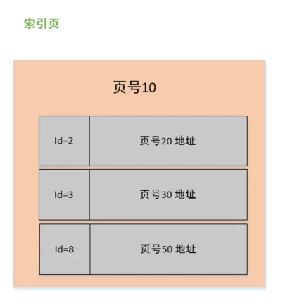
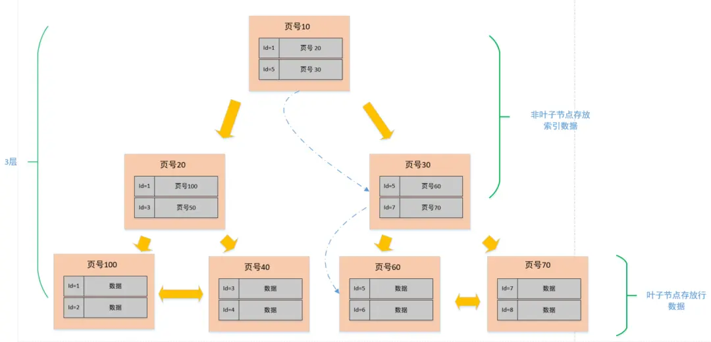
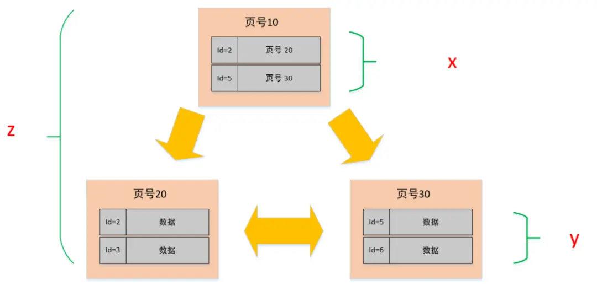

我们经常听说，单表数据量不要超过 2000W，否则性能会下降。这个"2000W"的建议值是否真的可靠？它的依据是什么？本文将通过分析 MySQL 的存储结构、B+树索引特性，以及实际测试来探讨这个问题。

> 本文参考自小林 coding 的文章：[MySQL 单表不要超过 2000W 行，靠谱吗？](https://raw.githubusercontent.com/xiaolincoder/CS-Base/refs/heads/main/mysql/index/2000w.md)

## **实验**

先建立一个实验表:

```sql
CREATE TABLE person(
    id int NOT NULL AUTO_INCREMENT PRIMARY KEY comment '主键',
    person_id tinyint not null comment '用户 id',
    person_name VARCHAR(200) comment '用户名称',
    gmt_create datetime comment '创建时间',
    gmt_modified datetime comment '修改时间'
) comment '人员信息表';
```

插入一条数据

```sql
insert into person values(1, 1,'user_1', NOW(), now());
```

### 大数据量测试数据生成方法

为了测试单表在不同数据量下的性能，我们需要生成大量测试数据。下面介绍一种高效的数据生成方法：

#### 步骤 1：初始化计数器变量

首先，设置一个 MySQL 用户变量 `@i`作为数据生成的计数器：

```sql
-- 这条语句创建一个名为rownum的列，其值为@i+1，同时设置@i的初始值为100
select (@i:=@i+1) as rownum, person_name from person, (select @i:=100) as init;
-- 重置@i的值为1，准备开始生成数据
set @i=1;
```

> **MySQL 用户变量**：以 `@`开头的变量是 MySQL 的用户定义变量，可以在会话中保存值并在多个 SQL 语句之间传递。

#### 步骤 2：使用递归插入法生成大量数据

下面这条 SQL 语句是关键，它利用表中现有的数据来生成更多数据：

```sql
insert into person(id, person_id, person_name, gmt_create, gmt_modified)
select @i:=@i+1,                  -- 为每行生成唯一ID，同时@i的值增加1
       left(rand()*10,10) as person_id,        -- 生成随机的person_id
       concat('user_',@i%2048),               -- 生成用户名，循环使用2048个不同名称
       date_add(gmt_create,interval + @i*cast(rand()*100 as signed) SECOND),  -- 生成递增的创建时间
       date_add(date_add(gmt_modified,interval +@i*cast(rand()*100 as signed) SECOND), interval + cast(rand()*1000000 as signed) SECOND)  -- 生成修改时间
from person;  -- 从person表中选择数据，每次执行会使表中数据量翻倍
```

**数据量增长说明**：

- 每执行一次上述 SQL，表中的数据量就会翻倍
- 执行 20 次后，数据量约为 2^20≈1,048,576（约 100 万）条
- 执行 23 次后，数据量约为 2^23≈8,388,608（约 800 万）条
- 依此类推，可以生成任意数量的测试数据

**小技巧**：如果不想每次都翻倍增加数据，可以在 SQL 语句末尾添加 WHERE 条件，例如 `WHERE id > 某个值`来控制新增的数据量。

#### 步骤 3：处理可能出现的内存问题

当数据量达到较大规模（约 800 万或 1000 万）时，可能会遇到以下错误：

```
The total number of locks exceeds the lock table size
```

**错误原因**：这是因为 MySQL 的临时表空间和缓冲池空间不足导致的。

**解决方法**：增加相关内存参数的设置：

```sql
-- 增加临时表大小到512MB
SET GLOBAL tmp_table_size = 512*1024*1024;
-- 增加InnoDB缓冲池大小到1GB
SET GLOBAL innodb_buffer_pool_size = 1*1024*1024*1024;
```

> **提示**：这些参数需要根据您的服务器内存情况进行适当调整，不要设置得过大以免影响系统稳定性。

接下来看看测试结果：

下图展示了在 MySQL 8.0 版本上进行的性能测试结果。测试环境为个人电脑，同时运行有 IDE、浏览器等应用程序，因此这些数据仅供参考，不代表生产环境的实际性能。





从测试数据可以看出，当表中数据量达到 2000 万行后，查询响应时间出现明显上升。这与行业中流传的"单表不超过 2000 万行"的建议相符。但这是否是一条普适的规则？

## **探究 2000 万行建议值的来源**

首先，让我们分析数据库单表行数的理论上限。

```sql
CREATE TABLE person(
    id int(10) NOT NULL AUTO_INCREMENT PRIMARY KEY comment '主键',
    person_id tinyint not null comment '用户 id',
    person_name VARCHAR(200) comment '用户名称',
    gmt_create datetime comment '创建时间',
    gmt_modified datetime comment '修改时间'
) comment '人员信息表';
```

从建表语句可以看出，id 作为主键具有唯一性约束，主键类型决定了表的理论容量上限：

- 若主键为 `int`类型（32 位），则最大支持 2^32-1（约 21.4 亿）行数据
- 若主键为 `bigint`类型（64 位），则最大支持 2^63-1（约 9.22×10^18）行数据，这个数值极其庞大，在实际应用中很难达到这一限制

有研究表明，如果使用无符号 bigint 作为自增主键，其最大值为 18,446,744,073,709,551,615。按照每秒写入一条记录的速度，理论上需要约 5800 亿年才能用尽这个限制，远超宇宙的预计寿命。

| 一秒增加的记录数 | 大约多少年用完  |
| ---------------- | --------------- |
| 1/1 秒           | 584942417355 年 |
| 1w/秒            | 58494241 年     |
| 100w/秒          | 584942 年       |
| 1 亿/秒          | 5849 年         |

## **表空间**

下面我们再来看看索引的结构，我们下面讲内容都是基于 Innodb 引擎的，大家都知道 Innodb 的索引内部用的是 B+ 树。



这张表数据，在硬盘上存储也是类似如此的，它实际是放在一个叫 person.ibd（innodb data）的文件中，也叫做表空间；虽然数据表中，他们看起来是一条连着一条，但是实际上在文件中它被分成很多小份的数据页，而且每一份都是 16K。

大概就像下面这样，当然这只是我们抽象出来的，在表空间中还有段、区、组等很多概念，但是我们需要跳出来看。



## **页的数据结构**

实际页的内部结构像是下面这样的：



从图中可以看出，一个 InnoDB 数据页的存储空间大致被划分成了 7 个部分，有的部分占用的字节数是确定的，有的部分占用的字节数是不确定的。

在页的 7 个组成部分中，我们自己存储的记录会按照我们指定的行格式存储到 `User Records` 部分。

但是在一开始生成页的时候，其实并没有 User Records 这个部分，每当我们插入一条记录，都会从 Free Space 部分，也就是尚未使用的存储空间中申请一个记录大小的空间划分到 User Records 部分。

当 Free Space 部分的空间全部被 User Records 部分替代掉之后，也就意味着这个页使用完了，如果还有新的记录插入的话，就需要去申请新的页了。

这个过程的图示如下：


刚刚上面说到了数据的新增的过程。

那下面就来说说，数据的查找过程，假如我们需要查找一条记录，我们可以把表空间中的每一页都加载到内存中，然后对记录挨个判断是不是我们想要的。

在数据量小的时候，没啥问题，内存也可以撑。但是现实就是这么残酷，不会给你这个局面。

为了解决这问题，MySQL 中就有了索引的概念，大家都知道索引能够加快数据的查询，那到底是怎么个回事呢？下面我就来看看。

## **索引的数据结构**

在 MySQL 中索引的数据结构和刚刚描述的页几乎是一模一样的，而且大小也是 16K,。

但是在索引页中记录的是页 (数据页，索引页) 的最小主键 id 和页号，以及在索引页中增加了层级的信息，从 0 开始往上算，所以页与页之间就形成了层级结构关系。



这种结构实际上呈现了树状结构的特征，类似于层次化的索引组织。在这里我们简单展示了三个节点，2 层结构，但随着数据增加，结构可能扩展至 3 层。这就是我们常说的 B+ 树，最下面那一层的 page level =0, 也就是叶子节点，其余都是非叶子节点。



从上图中，我们分析一个非叶子节点（索引页），在非叶子节点的内容区中包含主键 ID 值和对应的页号指针两部分信息：

- id：对应页中记录的最小记录 id 值；
- 页号：指向对应页的指针；

而数据页与此几乎大同小异，区别在于数据页记录的是真实的行数据而不是页地址，而且 id 的也是顺序的。

## **单表建议值**

下面我们就以 3 层，2 分叉（实际中是 M 分叉）的图例来说明一下查找一个行数据的过程。



比如说我们需要查找一个 id=6 的行数据：

- 因为在非叶子节点中存放的是页号和该页最小的 id，所以我们从顶层开始对比，首先看页号 10 中的目录，有 [id=1, 页号 = 20],[id=5, 页号 = 30], 说明左侧节点最小 id 为 1，右侧节点最小 id 是 5。6>5, 那按照二分法查找的规则，肯定就往右侧节点继续查找；
- 找到页号 30 的节点后，发现这个节点还有子节点（非叶子节点），那就继续比对，同理，6>5 && 6<7, 所以找到了页号 60；
- 找到页号 60 之后，发现此节点为叶子节点（数据节点），于是将此页数据加载至内存进行一一对比，结果找到了 id=6 的数据行。

从上述的过程中发现，我们为了查找 id=6 的数据，总共查询了三个页，如果三个页都在磁盘中（未提前加载至内存），那么最多需要经历三次的磁盘 IO。

需要注意的是，图中的页号只是个示例，实际情况下并不是连续的，在磁盘中存储也不一定是顺序的。

至此，我们大概已经了解了表的数据是怎么个结构了，也大概知道查询数据是个怎么的过程了，这样我们也就能大概估算这样的结构能存放多少数据了。

从上面的图解我们知道 B+ 数的叶子节点才是存在数据的，而非叶子节点是用来存放索引数据的。

所以，同样一个 16K 的页，非叶子节点里的每条数据都指向新的页，而新的页有两种可能

- 如果是叶子节点，那么里面就是一行行的数据
- 如果是非叶子节点的话，那么就会继续指向新的页

假设

- 非叶子节点内指向其他页的数量为 x
- 叶子节点内能容纳的数据行数为 y
- B+ 数的层数为 z

如下图中所示，**总记录数 = $x^{z-1} \times y$，即总数等于 $x$ 的 $z-1$ 次方与 $y$ 的乘积**。



> X =？

在文章的开头已经介绍了页的结构，索引也也不例外，都会有 File Header (38 byte)、Page Header (56 Byte)、Infimum + Supermum（26 byte）、File Trailer（8byte）, 再加上页目录，大概 1k 左右。

我们就当做它就是 1K, 那整个页的大小是 16K, 剩下 15k 用于存数据，在索引页中主要记录的是主键与页号，主键我们假设是 Bigint (8 byte), 而页号也是固定的（4Byte）, 那么索引页中的一条数据也就是 12byte。

所以 x=15\*1024/12≈1280 行。

> Y=？

叶子节点和非叶子节点的结构是一样的，同理，能放数据的空间也是 15k。

但是叶子节点中存放的是真正的行数据，这个影响的因素就会多很多，比如，字段的类型，字段的数量。每行数据占用空间越大，页中所放的行数量就会越少。

这边我们暂时按一条行数据 1k 来算，那一页就能存下 15 条，Y = 15\*1024/1000 ≈15。

到这一步，我们已经可以开始推算总容量了。

根据上述的公式，总记录数 = $x^{z-1} \times y$，已知 $x=1280，y=15$：

- 假设 B+ 树是两层，那就是 z = 2，Total = （1280 ^1）\*15 = 19200
- 假设 B+ 树是三层，那就是 z = 3，Total = （1280 ^2） \*15 = 24576000（约 2.45kw）

这与文章开头提到的 2000W 行数建议值高度吻合。实际上，一般 B+ 树的层级最多也就是 3 层。

如果增加到 4 层，不仅查询时可能增加磁盘 IO 次数，而且总记录数将达到约 3 百多亿，这在大多数应用场景中并不实用。因此，3 层结构是较为合理的选择。

然而，我们的分析还需要继续深入。

我们刚刚在计算 Y 值时假设每行数据占用空间为 1K。但如果实际每行数据占用 5K，那每个数据页最多只能容纳 3 条记录。

同样按照 $z = 3$ 计算，总记录数 $= （1280 ^2） \times 3 = 4915200（约 500w）$

由此可见，在保持相同层级结构（即相似查询性能）的情况下，行数据大小的不同会显著影响最大建议记录数。此外，影响查询性能的还有诸多因素，如数据库版本、服务器配置、SQL 编写质量等。

MySQL 为了提高性能，会将表的索引装载到内存中。当 InnoDB buffer size 充足时，可以实现索引的全内存加载，查询性能不会受到明显影响。

然而，当单表数据量达到特定上限后，内存可能无法完全容纳索引，导致后续 SQL 查询产生额外的磁盘 IO，从而降低性能。因此，提升硬件配置（如增加内存）可能会显著提高查询性能。

## **总结**

- MySQL 的表数据是以页的形式存放的，页在磁盘中不一定是连续的。
- 页的空间是 16K, 并不是所有的空间都是用来存放数据的，会有一些固定的信息，如，页头，页尾，页码，校验码等等。
- 在 B+ 树中，叶子节点和非叶子节点的数据结构是一样的，区别在于，叶子节点存放的是实际的行数据，而非叶子节点存放的是主键和页号。
- 索引结构不会影响单表最大行数，2000W 也只是推荐值，超过了这个值可能会导致 B + 树层级更高，影响查询性能。
