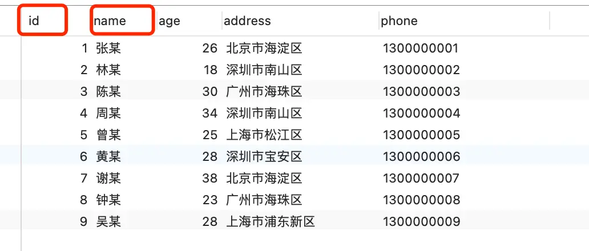
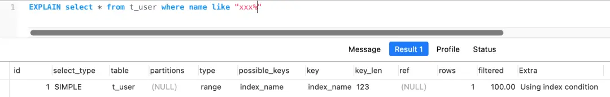
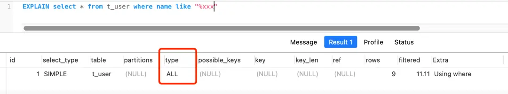
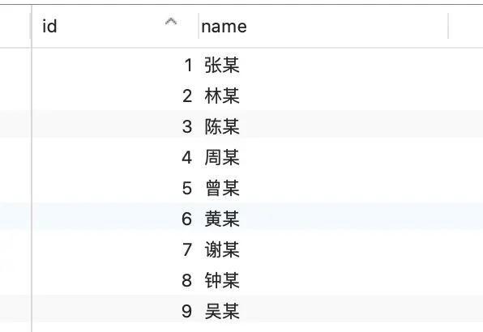
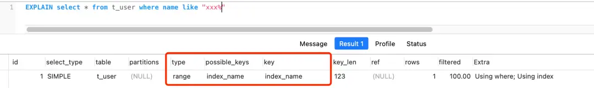
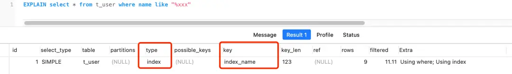
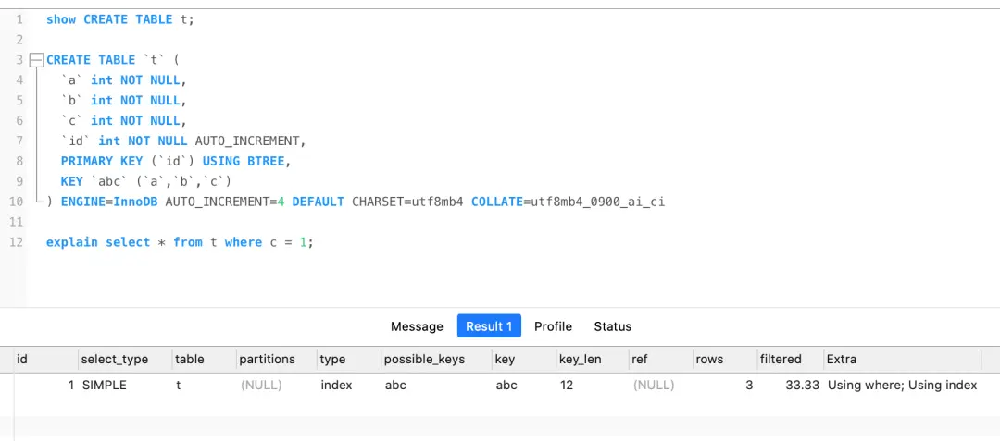

# MySQL中使用Like一定会导致索引失效吗？

在MySQL性能优化的讨论中，常有一种说法认为"使用Like会导致索引失效"。本文将通过实际案例分析，探究这一说法是否永远成立，以及影响索引使用的真正因素。

## 问题引入

我们通过两个不同结构的数据表来探究Like查询与索引的关系：

* **表结构一**：包含多个字段，其中`id`是自增主键索引，`name`是二级索引，其他为非索引字段。
* **表结构二**：仅包含两个字段，`id`是自增主键索引，`name`是二级索引。

对于这两张表，我们将分别测试以下四种模糊查询语句：

1. `select * from s where name like "xxx"`（精确匹配，等同于等值查询）
2. `select * from s where name like "xxx%"`（右模糊匹配）
3. `select * from s where name like "%xxx"`（左模糊匹配）
4. `select * from s where name like "%xxx%"`（全模糊匹配）

通过分析执行计划，我们可以清晰地看出哪些情况会利用索引，哪些情况会导致索引失效。

## 表结构一的执行分析

表结构一包含多个字段，其中只有`id`和`name`是索引字段：

执行四条模糊查询后，结果显示：

1. `name like "xxx"`：**走索引**（实际是等值查询）
2. `name like "xxx%"`：**走索引**（范围查询，type=range）

下图是第二条查询的执行计划，可以看到使用了`index_name`索引：

3. `name like "%xxx"`：**索引失效**（全表扫描，type=ALL）
4. `name like "%xxx%"`：**索引失效**（全表扫描，type=ALL）

下图是第三条查询的执行计划，可以看到进行了全表扫描：

**结论**：在包含非索引字段的表中，左模糊和全模糊查询确实会导致索引失效，进而触发全表扫描。

## 表结构二的执行分析

表结构二只有两个字段，都是索引字段：

执行相同的四条查询，结果却有所不同：

1. `name like "xxx"`：**走索引**（等值查询）
2. `name like "xxx%"`：**走索引**（范围查询，type=range）

下图是第二条查询的执行计划，不仅使用了索引，还利用了覆盖索引优化（Using index）：

3. `name like "%xxx"`：**走索引**（索引全扫描，type=index）
4. `name like "%xxx%"`：**走索引**（索引全扫描，type=index）

这是最出人意料的结果！左模糊和全模糊查询竟然也走了索引：

## 深入分析表结构二的特殊情况

为什么表结构二中的左模糊查询没有导致索引失效？这涉及到几个关键概念：

### 1. 覆盖索引的作用

在表结构二中，由于表只有`id`和`name`两个字段，而这两个字段都包含在二级索引中（二级索引的叶子节点包含"索引值+主键值"），所以`select *`等同于`select id,name`，可以直接从二级索引获取所有数据，无需回表操作。这就是**覆盖索引**的应用。

### 2. 索引全扫描 vs 全表扫描

虽然执行计划显示使用了索引（key=index_name），但type=index表示这是一个**索引全扫描**操作，而非利用索引进行快速定位的范围查询（type=range）。

索引全扫描是指遍历整个索引树，而全表扫描是遍历整个数据表。由于索引树通常比数据表小得多（特别是在字段较多的表中），所以MySQL优化器判断索引全扫描的成本低于全表扫描，因此选择了前者。

### 3. 为什么不使用聚簇索引？

MySQL选择扫描二级索引树而非聚簇索引树，是因为：

- 二级索引只存储"索引列+主键值"，数据量小
- 聚簇索引包含所有列数据、事务ID、回滚指针等，数据量大
- 本查询可以使用覆盖索引，不需要回表操作

因此，尽管无法利用索引的有序性（因为是左模糊匹配），但全扫描二级索引树仍然比全表扫描高效。

### 4. 为什么表结构一中会导致索引失效？

当表中存在非索引字段且查询需要这些字段时，即使使用二级索引定位数据，也必须回表到聚簇索引获取完整记录。对于左模糊匹配，无法利用索引的有序性快速定位，必须遍历整个索引树并频繁回表，这比直接全表扫描的成本还高，因此优化器选择了全表扫描。

## 结论与实用建议

通过以上分析，我们可以得出以下结论：

1. **Like查询并非一定导致索引失效**，关键在于模糊匹配的位置和表的结构：
   - 精确匹配和右模糊匹配（`like 'xxx%'`）通常能高效利用索引
   - 左模糊和全模糊匹配在特定条件下也可能使用索引（索引全扫描）

2. **决定是否使用索引的关键因素**：
   - 查询是否能利用索引的有序性（前缀匹配可以，后缀匹配不行）
   - 是否符合覆盖索引的条件（查询字段是否都在索引中）
   - 优化器对成本的评估（索引扫描vs全表扫描）

3. **实用优化建议**：
   - 尽可能使用右模糊而非左模糊查询
   - 对于必须使用左模糊的场景，考虑建立合适的覆盖索引
   - 在特定场景下，可以考虑使用全文索引或其他专门的搜索技术

补充一点：这个规律同样适用于联合索引。即使没有遵循最左匹配原则，在所有查询字段都是索引字段的情况下，MySQL也可能选择索引全扫描而非全表扫描：

理解这些细节，有助于我们在实际工作中更准确地预估查询性能，并做出更合理的索引设计决策。