在日常工作中，我们常常通过建立索引来提高 SQL 查询速度。但索引并不是万能的，有些情况下即使建立了索引，查询还是会变成全表扫描，导致性能大幅下降。

本文将用简单易懂的方式介绍索引失效的常见场景，并给出相应的解决方案。

## 索引是怎么存储的？

先来简单了解一下 MySQL 的索引存储结构，这有助于我们理解为什么某些操作会导致索引失效。

MySQL 默认使用 InnoDB 存储引擎，它采用 B+树作为索引的数据结构。关于为什么选择 B+树作为索引结构，可以查看这篇文章：[为什么 MySQL 喜欢 B+树？](/2025/04/29/八股文/MYSQL/索引/为什么选择B+树/)

InnoDB 和 MyISAM 引擎在索引实现上有个关键区别：

- InnoDB：B+树索引的叶子节点直接存放数据本身
- MyISAM：B+树索引的叶子节点只存放数据的物理地址

下面通过一个简单的用户表来说明：

| id  | name | age | address        |
| --- | ---- | --- | -------------- |
| 1   | 张某 | 26  | 北京市海淀区   |
| 2   | 林某 | 18  | 深圳市南山区   |
| 3   | 陈某 | 30  | 广州市海珠区   |
| 4   | 周某 | 34  | 深圳市南山区   |
| 5   | 曾某 | 25  | 上海市松江区   |
| 6   | 黄某 | 28  | 深圳市宝安区   |
| 7   | 谢某 | 38  | 北京市海淀区   |
| 8   | 钟某 | 23  | 广州市海珠区   |
| 9   | 吴某 | 28  | 上海市浦东新区 |

MyISAM 引擎的索引结构（叶子节点存放数据地址）：

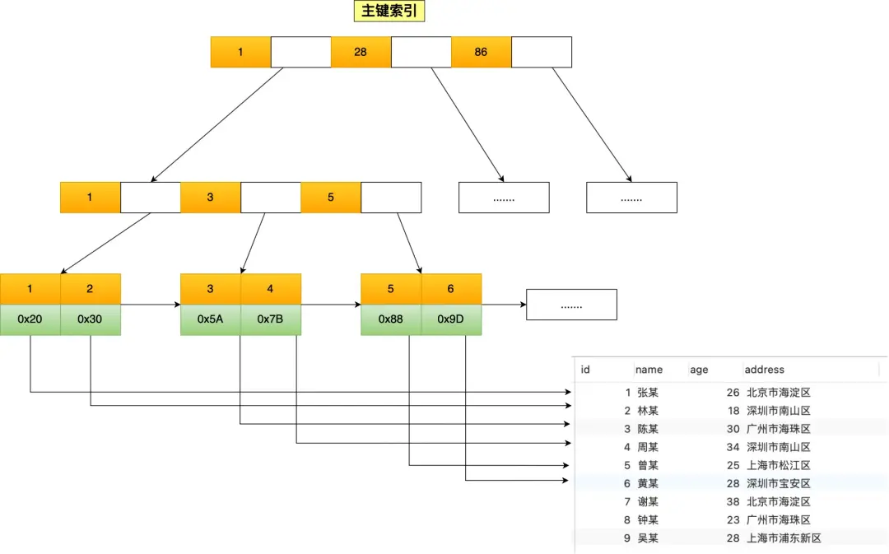

InnoDB 引擎的主键索引结构（叶子节点直接存放数据）：

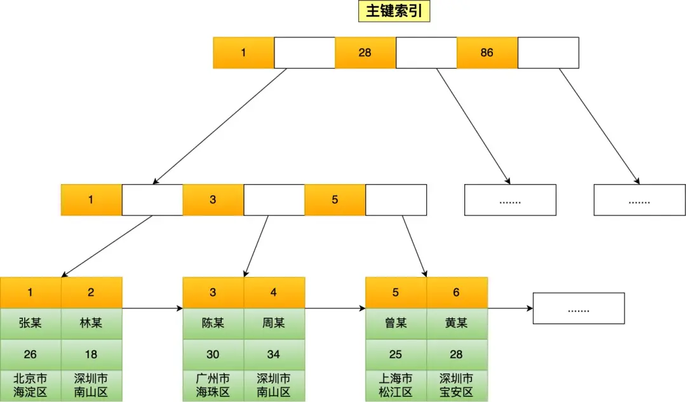

InnoDB 有两种索引类型：

1. **聚簇索引**：上图所示的主键索引，叶子节点存放完整数据
2. **二级索引**：普通字段创建的索引，叶子节点只存放主键值

如果在 name 字段上创建索引，二级索引的结构如下：

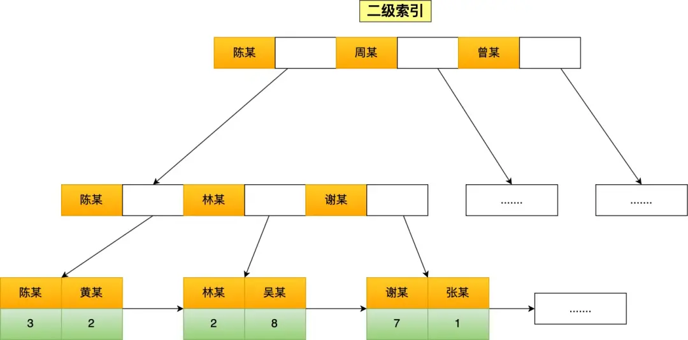

了解这些结构后，我们来看看查询时是如何使用索引的：

### 主键查询

当使用主键查询时，直接通过聚簇索引找到数据：

```sql
-- id是主键
SELECT * FROM t_user WHERE id = 1;
```

### 普通索引查询（需要回表）

当使用普通索引查询完整数据时，需要两步：

1. 先在二级索引中找到主键值
2. 再通过主键值到聚簇索引中查找完整数据

这个过程叫做**回表**：

```sql
-- name是普通索引
SELECT * FROM t_user WHERE name = "林某";
```

### 覆盖索引查询（不需要回表）

如果只查询索引中已有的数据，就不需要回表：

```sql
-- 只查询id，而id已在name索引的叶子节点中
SELECT id FROM t_user WHERE name = "林某";
```

这种情况下，所有数据都能在索引中找到，称为**覆盖索引**。

接下来，我们重点看看哪些情况会导致索引失效。以下示例基于 MySQL 8.0.26 测试。

## 一、模糊查询的左右匹配导致索引失效

使用 `LIKE`进行左模糊（`%xx`）或者左右模糊（`%xx%`）查询时，索引会失效。

例如，查询 name 以"林"结尾的用户：

```sql
-- name是索引
SELECT * FROM t_user WHERE name LIKE '%林';
```

执行计划显示 `type=ALL`，表示进行了全表扫描：

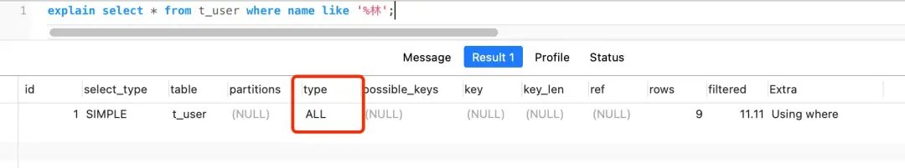

但如果是查询 name 以"林"开头的用户，索引依然有效：

```sql
SELECT * FROM t_user WHERE name LIKE '林%';
```

执行计划显示 `type=range`，使用了索引：

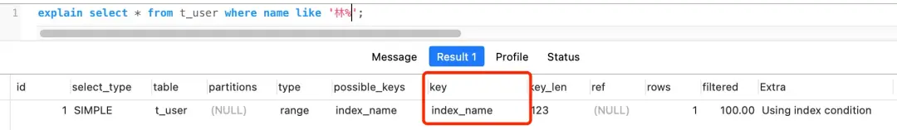

**为什么会这样？**

因为 B+树索引是按照值的顺序排列的，只能高效地进行前缀匹配。当使用 `%林`这样的后缀匹配时，系统无法确定从哪个索引值开始查找，只能遍历整个表。

以下图中的二级索引为例：

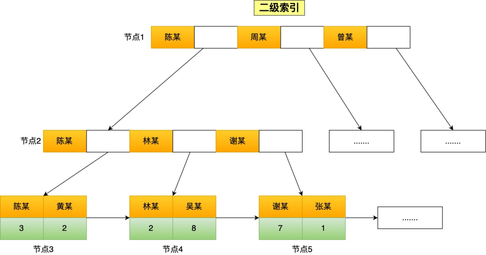

查询 `name LIKE '林%'`时，系统可以直接定位到林开头的记录并向后遍历；而查询 `name LIKE '%林'`时，系统不知道从哪开始找，只能全表扫描。

## 二、在索引列上使用函数导致索引失效

当在索引列上使用函数时，索引会失效。

例如，查询 name 长度为 6 的用户：

```sql
-- name是索引
SELECT * FROM t_user WHERE LENGTH(name) = 6;
```

执行计划显示进行了全表扫描：

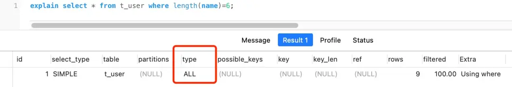

**为什么会这样？**

因为索引中存储的是原始值，而不是函数计算后的值。系统需要先取出每条记录，计算函数结果，再进行比较。

**解决方法**：
从 MySQL 8.0 开始，可以创建函数索引：

```sql
ALTER TABLE t_user ADD KEY idx_name_length ((LENGTH(name)));
```

这样就能在查询时使用索引：

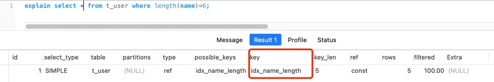

## 三、在索引列上进行表达式计算导致索引失效

和使用函数类似，在索引列上进行表达式计算也会导致索引失效。

例如：

```sql
SELECT * FROM t_user WHERE id + 1 = 10;
```

这会导致全表扫描：

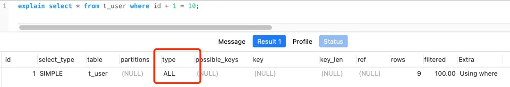

但如果改成下面这样，就可以使用索引：

```sql
SELECT * FROM t_user WHERE id = 10 - 1;
```

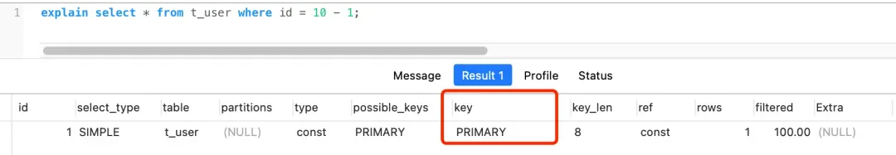

**核心原则**：将运算尽量放在等号右边（常量侧），不要对索引列做运算。

## 四、索引列发生隐式类型转换导致索引失效

当索引列是字符串类型，而查询条件使用数字时，会发生隐式类型转换，导致索引失效。

例如，phone 是 varchar 类型的索引列：

```sql
SELECT * FROM t_user WHERE phone = 1300000001;
```

执行计划显示全表扫描：

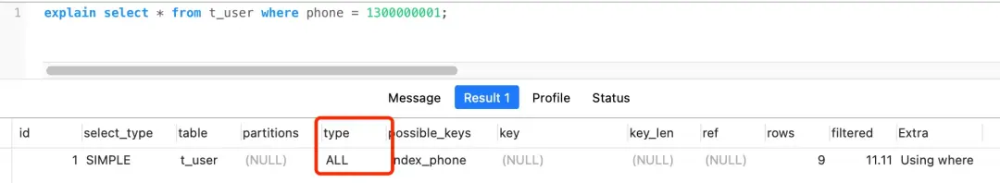

但有趣的是，当索引列是数字类型，而查询条件使用字符串时，索引依然有效：

```sql
-- id是整型
SELECT * FROM t_user WHERE id = '1';
```

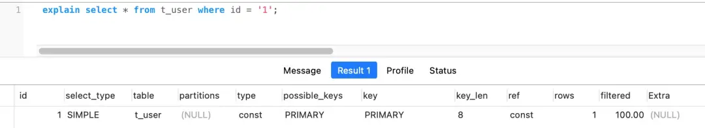

**为什么会这样？**

这与 MySQL 的类型转换规则有关。可以通过一个简单测试了解：

```sql
SELECT "10" > 9;
```

结果是 1，说明 MySQL 将字符串转成了数字再比较。

所以在第一个例子中：

```sql
SELECT * FROM t_user WHERE phone = 1300000001;
```

等价于：

```sql
SELECT * FROM t_user WHERE CAST(phone AS signed int) = 1300000001;
```

这实际上对索引列使用了函数，导致索引失效。

而第二个例子：

```sql
SELECT * FROM t_user WHERE id = "1";
```

等价于：

```sql
SELECT * FROM t_user WHERE id = CAST("1" AS signed int);
```

这里是对常量进行转换，不影响索引使用。

**解决方法**：确保查询条件的数据类型与索引列一致。

## 五、联合索引未遵循最左匹配原则导致索引失效

联合索引必须遵循"最左匹配原则"才能有效使用。

假设有一个联合索引(a, b, c)，以下查询可以使用该索引：

- WHERE a = 1
- WHERE a = 1 AND b = 2
- WHERE a = 1 AND b = 2 AND c = 3

但以下查询无法利用索引：

- WHERE b = 2
- WHERE c = 3
- WHERE b = 2 AND c = 3

有个特殊情况：`WHERE a = 1 AND c = 3`（跳过 b）。这种情况下：

- MySQL 5.5 版本：只有 a 能走索引，找到记录后回表比对 c
- MySQL 5.6 及更高版本：引入了"索引下推"功能，可以在索引中直接过滤 c 条件，减少回表次数

例如：

```sql
SELECT * FROM t_user WHERE a = 1 AND c = 3;
```

执行计划中显示 `Using index condition`表示使用了索引下推：

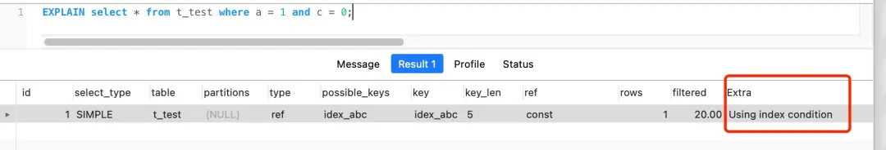

**为什么需要最左匹配？**

因为联合索引的排序方式是先按第一列排序，第一列相同时再按第二列排序，依此类推。如果没有第一列的条件，系统就无法利用索引的有序性。

## 六、OR 条件导致索引失效

当 WHERE 子句中使用 OR 连接的条件列中，有一个不是索引列时，整个查询会变成全表扫描。

例如：

```sql
-- id是索引，age不是索引
SELECT * FROM t_user WHERE id = 1 OR age = 18;
```

执行计划显示全表扫描：

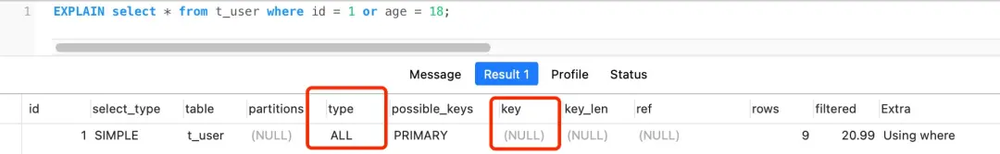

**为什么会这样？**

因为 OR 表示满足任一条件即可，如果有条件不能走索引，为确保结果完整，系统会选择全表扫描。

**解决方法**：为所有 OR 条件列创建索引。例如给 age 也创建索引：

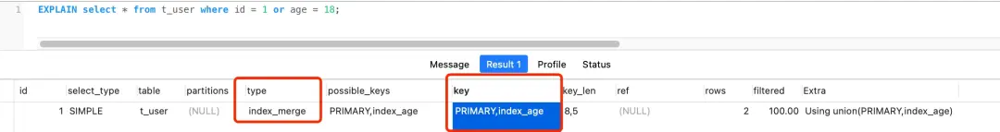

执行计划中显示 `type=index_merge`，表示系统分别扫描了 id 和 age 的索引，然后合并结果，避免了全表扫描。

## 总结

我们介绍了 6 种会导致 MySQL 索引失效的情况：

1. **模糊查询的左右匹配**：`LIKE '%xx'`或 `LIKE '%xx%'`会导致索引失效，而 `LIKE 'xx%'`可以使用索引。
2. **在索引列上使用函数**：如 `LENGTH(name)`会导致索引失效，可以考虑使用 MySQL 8.0 的函数索引。
3. **在索引列上进行表达式计算**：如 `id + 1 = 10`会导致索引失效，应改为 `id = 10 - 1`。
4. **隐式类型转换**：当字符串索引列与数字比较时，会导致索引失效；但数字索引列与字符串比较不会有问题。
5. **联合索引未遵循最左匹配原则**：如(a,b,c)索引，查询必须包含 a 列才能使用索引。
6. **OR 条件中有非索引列**：需要确保 OR 两侧的条件都有索引，否则会走全表扫描。

理解这些情况有助于我们优化 SQL 查询，避免索引失效导致的性能问题。
