## 什么是索引？

索引是数据库中用于提高查询效率的数据结构，类似于书籍的目录，帮助数据库系统快速定位和访问数据。合理的索引设计可以显著提升查询性能，减少资源消耗。

## 索引的分类

### 按数据结构分类

- **B+tree索引**：MySQL默认索引类型，适用于范围查询和排序
- **Hash索引**：适合等值查询，不支持范围查询和排序
- **Full-text索引**：用于全文搜索，支持复杂文本查询

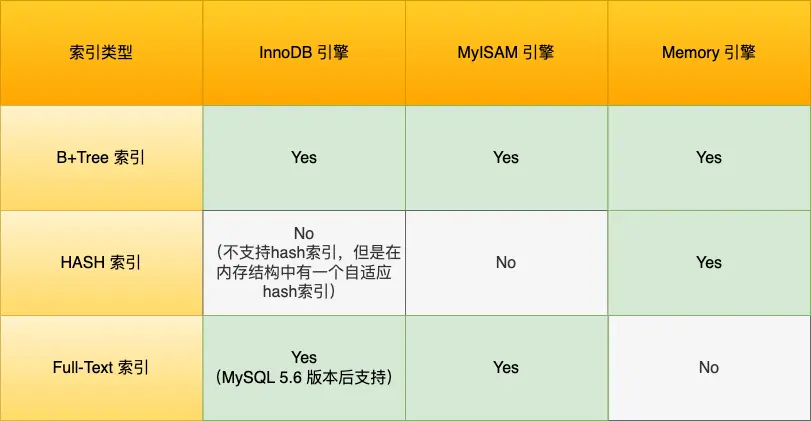


#### B+tree 索引(InnoDB 默认索引类型)

InnoDB 是在 MySQL 5.5 之后成为默认的 MySQL 存储引擎，B+Tree 索引类型也是 MySQL 存储引擎采用最多的索引类型。

在创建表时，InnoDB 存储引擎会根据不同的场景选择不同的列作为索引：

- 如果有主键，默认会使用主键作为聚簇索引的索引键（key）；
- 如果没有主键，就选择第一个不包含 NULL 值的唯一列作为聚簇索引的索引键（key）；
- 在上面两个都没有的情况下，InnoDB 将自动生成一个隐式自增 id 列作为聚簇索引的索引键（key）；

其它索引都属于辅助索引（Secondary Index），也被称为二级索引或非聚簇索引。**创建的主键索引和二级索引默认使用的是 B+Tree 索引**。

B+Tree 是一种多叉树，叶子节点才存放数据，非叶子节点只存放索引，而且每个节点里的数据是**按主键顺序存放**的。每一层父节点的索引值都会出现在下层子节点的索引值中，因此在叶子节点中，包括了所有的索引值信息，并且每一个叶子节点都指向下一个叶子节点，形成一个链表。


举个例子，先创建一张商品表，id 为主键，如下：

```sql
CREATE TABLE `product`  (
  `id` int(11) NOT NULL,
  `product_no` varchar(20)  DEFAULT NULL,
  `name` varchar(255) DEFAULT NULL,
  `price` decimal(10, 2) DEFAULT NULL,
  PRIMARY KEY (`id`) USING BTREE
) CHARACTER SET = utf8 COLLATE = utf8_general_ci ROW_FORMAT = Dynamic;
```

商品表里，有这些行数据：

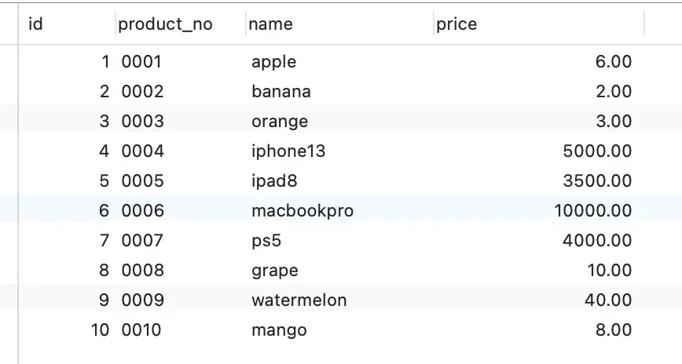

主键索引的 B+Tree 如图所示(图中画的叶子节点用单向链表连接，但是有问题，实际上其实是一个<font color="red">双向链表</font>)：

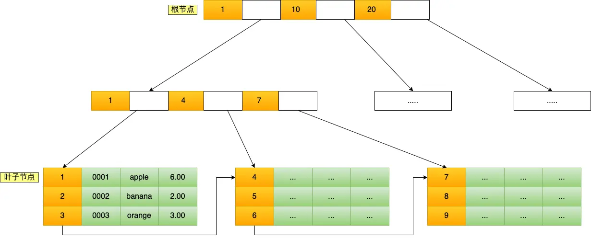


##### 通过主键查询数据的过程

比如我们执行了下面这条 SQL 语句：

```sql
SELECT * FROM product WHERE id = 5;
```

这条语句使用了主键索引查询 id 号为 5 的商品。查询过程是这样的，B+Tree 会自顶向下逐层进行查找：

- 将 5 与根节点的索引数据 (1，10，20) 比较，5 在 1 和 10 之间，所以根据 B+Tree 的搜索逻辑，找到第二层的索引数据 (1，4，7)；
- 在第二层的索引数据  (1，4，7) 中进行查找，因为 5 在 4 和 7 之间，所以找到第三层的索引数据（4，5，6）；
- 在叶子节点的索引数据（4，5，6）中进行查找，然后我们找到了索引值为 5 的行数据。

数据库的索引和数据都是存储在硬盘的，我们可以把读取一个节点当作一次磁盘 I/O 操作。那么上面的整个查询过程一共经历了 3 个节点，也就是进行了 3 次 I/O 操作。

B+Tree 存储千万级的数据只需要 3-4 层高度就可以满足，这意味着从千万级的表查询目标数据最多需要 3-4 次磁盘 I/O，所以**B+Tree 相比于 B 树和二叉树来说，最大的优势在于查询效率很高，因为即使在数据量很大的情况，查询一个数据的磁盘 I/O 依然维持在 3-4 次。**

##### 通过二级索引查询数据的过程

> 主键索引的 B+Tree和二级索引的 B+Tree 的主要区别在于：
>
> - 主键索引的 B+Tree 的叶子节点存放的是实际数据
> - 二级索引的 B+Tree 的叶子节点存放的是主键值

假设我们将先前的商品表的 `product_no` 字段创建一个二级索引，如下：

```sql
CREATE INDEX idx_product_no ON product(product_no);
```

那么，二级索引的 B+Tree 如图所示(图中画的叶子节点用单向链表连接，但是有问题，实际上其实是一个<font color="red">双向链表</font>)：

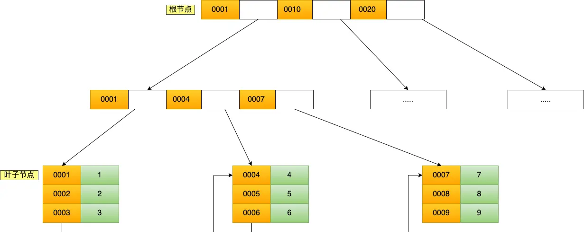

其中非叶子节点的`key`值是`product_no`(图中橙色部分),叶子节点存储的数据是`主键值`(图中绿色部分)

如果我用`product_no`二级索引查询，如下查询语句:

```sql
select * from product where product_no = '0002';
```

上面的语句可以先检查二级索引中的B+Tree的索引值`product_no`，找到对应的叶子节点，获取到主键值，然后拿着主键值去主键索引的B+Tree中查找，获取到完整的数据行。这个过程就叫做**回表**，也就是说要查两个 B+Tree 才能查到数据，如图所示(图中画的叶子节点用单向链表连接，但是有问题，实际上其实是一个<font color="red">双向链表</font>)。

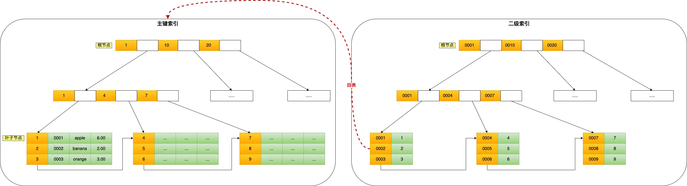

---

不过，如果我执行的查询语句是：

```sql
select id from product where product_no = '0002';
```

那么，因为二级索引的叶子节点存储的是主键值，所以其实只需要查一个 B+Tree 就可以获取到数据，那就可以避免回表，这个过程就叫做**覆盖索引**，也就是只需要查一个 B+Tree 就可以获取到数据。

> 因此，有时候我们可以利用覆盖索引，来避免回表，从而提高查询效率，比如对经常需要查询的列和查询条件建立联合索引，就可以利用覆盖索引，从而提高查询效率。

##### 为什么 InnoDB 存储引擎选择使用 B+Tree 作为索引的数据结构？


前面已经讲了 B+Tree 的索引原理，现在就来回答一下 B+Tree 相比于 B 树、二叉树或 Hash 索引结构的优势在哪儿？


***1、B+Tree vs B Tree***

B+Tree 只在叶子节点存储数据，而 B 树 的非叶子节点也要存储数据，所以 B+Tree 的单个节点的数据量更小，在相同的磁盘 I/O 次数下，就能查询更多的节点。

另外，B+Tree 叶子节点采用的是双链表连接，适合 MySQL 中常见的基于范围的顺序查找，而 B 树无法做到这一点。

***2、B+Tree vs 二叉树***

对于存储了 M 条数据记录的 B+Tree（其叶子节点数量 N 与 M 相关），其搜索复杂度约为 `O(logdN)`，其中 d 是节点允许的最大子节点个数（阶数）。

在实际应用中，d 值通常远大于 2（例如大于 100）。这保证了即使数据量 M 达到千万级别，B+Tree 的高度依然能维持在 3~4 层左右。这意味着一次数据查询操作通常只需要 3~4 次磁盘 I/O 即可完成。

相比之下，一个存储相同 M 条数据的平衡二叉搜索树，其节点总数也约为 M，搜索复杂度为 `O(logM)`（以 2 为底）。由于其分支因子固定为 2，树的高度会显著高于 B+Tree，导致检索目标数据需要经历更多的磁盘 I/O 次数。

***3, B+Tree vs Hash***

Hash 在做等值查询的时候效率贼快，搜索复杂度为 O(1)。但也有其局限性：

- **数据顺序性**：哈希表无法提供数据的顺序访问，更适合做等值的查询。很多查询不仅需要找到特定的键值，还需要根据键值排序来返回结果，或者执行范围查询。B+Tree 可以很好地支持，Hash 表则无法做到。

- **空间效率**：可能导致空间利用效率不高，特别是在处理大量数据时。数据量变大时冲突也会增加。

- **需要重新构建**：哈希索引通常只存储在内存中，当数据库重启或发生崩溃时，需要重新构建。

因此，B+Tree 索引要比 Hash 表索引有着更广泛的适用场景。


#### Full-text 索引

Full Text索引（全文索引）是MySQL中专门用于高效处理大文本字段（如文章、描述等）内容检索的一种索引类型。它主要用于在大量文本数据中进行复杂的关键词搜索，支持模糊匹配、相关性排序等功能，远比传统的LIKE语句效率高，尤其适合需要全文检索的场景（如搜索引擎、商品描述搜索等）。

##### 工作原理
Full Text索引通常基于倒排索引（inverted index）实现。倒排索引会将文本内容分词后，建立"单词→文档ID"的映射关系，从而能快速定位包含某个关键词的所有记录。这种结构极大提升了模糊查询和多关键词检索的效率。

##### 主要特性
- 适用于`CHAR`、`VARCHAR`、`TEXT`等文本类型字段
- 仅支持InnoDB和MyISAM存储引擎（MySQL 5.6及以上InnoDB支持）
- 支持三种检索模式：自然语言模式、布尔模式、查询扩展模式
- 典型用法：`MATCH(column) AGAINST('keyword' IN NATURAL LANGUAGE MODE)`

##### 示例
创建全文索引：
```sql
CREATE FULLTEXT INDEX idx_content ON articles(content);
```
使用全文检索：
```sql
SELECT * FROM articles WHERE MATCH(content) AGAINST('数据库 索引');
```

##### 参考
- [MySQL官方文档：全文索引](https://dev.mysql.com/doc/refman/8.0/en/fulltext-search.html)
- [CSDN: MySQL 全文索引用途及基本使用方法介绍](https://blog.csdn.net/yangbindxj/article/details/122868100)

简而言之，Full Text索引让MySQL能够像搜索引擎一样高效地在大段文本中查找关键词，是处理复杂文本检索的利器。


### 按物理存储分类

- **聚集索引**：数据和主键索引存储在一起，一个表只能有一个，通常是主键。聚集索引的叶子节点存储的是数据行。
- **二级索引**：又称非聚集索引，存储索引键和主键值，通过主键再查找数据，可以有多个。非聚集索引的叶子节点存储的是主键值，而不是数据行。

### 按字段特性分类

- **主键索引**：主键索引是聚集索引（Clustered Index），一个表只能有一个，通常对应主键。其叶子节点直接存储完整的数据行（即数据和索引在一起）。
  
  创建主键索引：
  ```sql
  CREATE TABLE `table_name` (
    ...
    PRIMARY KEY (`id`) USING BTREE
  );
  ```
- **唯一索引**：唯一索引也是二级索引，要求索引列的值唯一。叶子节点同样存储索引键和主键值，通过主键回表查找数据。

  创建唯一索引：
  ```sql
  CREATE TABLE `table_name` (
    ...
    UNIQUE KEY `idx_name` (`column1`, `column2`)
  );
  ```
  或者如果表已经存在，可以通过以下方式创建：
  ```sql
  ALTER TABLE `table_name` ADD UNIQUE KEY `idx_name` (`column1`, `column2`);
  ```
- **普通索引**：普通索引属于二级索引（Secondary/Non-Clustered Index），可以有多个。叶子节点存储的是索引键和主键值（InnoDB），通过主键回表查找完整数据。

  创建普通索引：
  ```sql
  CREATE TABLE `table_name` (
    ...
    INDEX `idx_name` (`column1`, `column2`)
  );
  ```
  或者如果表已经存在，可以通过以下方式创建：
  ```sql
  ALTER TABLE `table_name` ADD INDEX `idx_name` (`column1`, `column2`);
  ```
- **前缀索引**：前缀索引是一种特殊的二级索引，针对字符串类型字段，只索引字段的前N个字符。叶子节点存储前缀、主键值，通过主键回表查找数据。

  创建前缀索引：
  ```sql
  CREATE TABLE `table_name` (
    ...
    INDEX `idx_name` (`column_name`(N))
  );
  ```
  或者如果表已经存在，可以通过以下方式创建：
  ```sql
  ALTER TABLE `table_name` ADD INDEX `idx_name` (`column_name`(N));
  ```

> **补充说明**：  
> - InnoDB 存储引擎下，只有主键索引是聚集索引，其他索引（普通、唯一、前缀）都是二级索引，叶子节点都不直接存储完整数据行，而是存储主键值。  
> - 二级索引查找数据时需要"回表"，即先通过索引定位主键，再通过主键定位数据行。

### 按字段个数分类

- **单列索引**：一个索引只包含一个列。
- **联合索引**：一个索引包含多个列。

#### 联合索引

通过将多个字段组合成一个索引，该索引就被称为联合索引。

比如，将商品表中的 product_no 和 name 字段组合成联合索引`(product_no, name)`，创建联合索引的方式如下：

```sql
CREATE INDEX index_product_no_name ON product(product_no, name);
```

联合索引`(product_no, name)` 的 B+Tree 示意图如下：

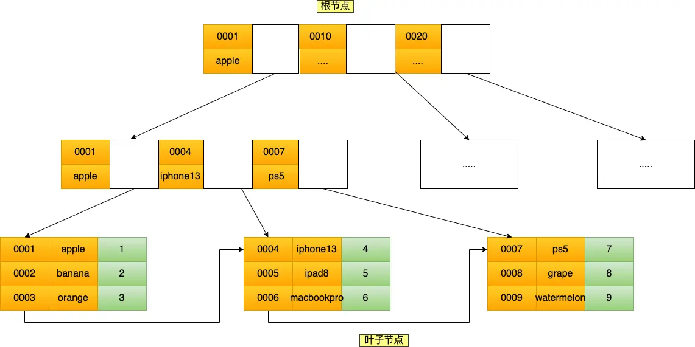

可以看到，联合索引的非叶子节点用两个字段的值作为  B+Tree 的 key 值。当在联合索引查询数据时，先按 product_no 字段比较，在 product_no 相同的情况下再按 name 字段比较。

也就是说，联合索引查询的 B+Tree 是先按 product_no 进行排序，然后再 product_no 相同的情况再按 name 字段排序。

因此，使用联合索引时，存在**最左匹配原则**，也就是按照最左优先的方式进行索引的匹配。在使用联合索引进行查询的时候，如果不遵循「最左匹配原则」，联合索引会失效，这样就无法利用到索引快速查询的特性了。


比如，如果创建了一个 `(a, b, c)` 联合索引，如果查询条件是以下这几种，就可以匹配上联合索引：

- where a=1.
- where a=1 and b=2 and c=3.
- where a=1 and b=2.
- where a=1 and c=3.

需要注意的是，因为有查询优化器，所以 a 字段在 where 子句的顺序并不重要。

但是，如果查询条件是以下这几种，因为不符合最左匹配原则，所以就无法匹配上联合索引，联合索引就会失效：

- where b=2.
- where c=3.
- where b=2 and c=3.

上面这些查询条件之所以会失效，是因为`(a, b, c)` 联合索引，是先按 a 排序，在 a 相同的情况再按 b 排序，在 b 相同的情况再按 c 排序。所以，**b 和 c 是全局无序，局部相对有序的**，这样在没有遵循最左匹配原则的情况下，是无法利用到索引的。

我这里举联合索引（a，b）的例子，该联合索引的 B+ Tree 如下：

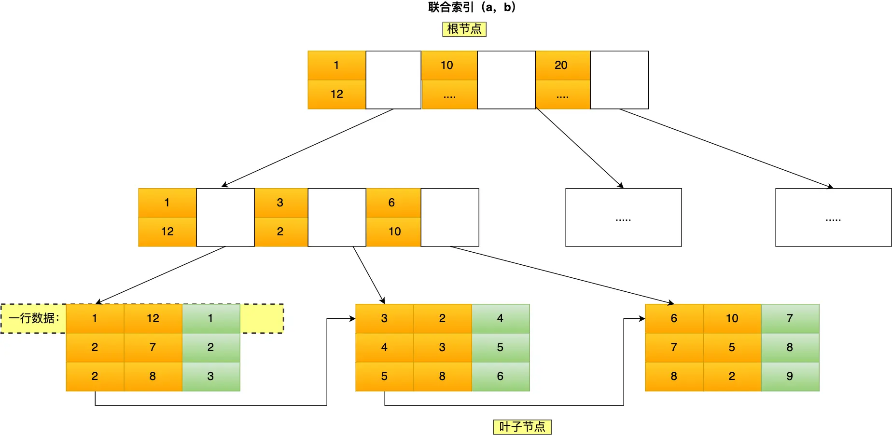

可以看到，a 是全局有序的（1, 2, 2, 3, 4, 5, 6, 7 ,8），而 b 是全局是无序的（12，7，8，2，3，8，10，5，2）。因此，直接执行`where b = 2`这种查询条件没有办法利用联合索引的，**利用索引的前提是索引里的 key 是有序的**。

只有在 a 相同的情况才，b 才是有序的，比如 a 等于 2 的时候，b 的值为（7，8），这时就是有序的，这个有序状态是局部的，因此，执行`where a = 2 and b = 7`是 a 和 b 字段能用到联合索引的，也就是联合索引生效了。

联合索引有一些特殊情况，**并不是查询过程使用了联合索引查询，就代表联合索引中的所有字段都用到了联合索引进行索引查询**，也就是可能存在部分字段用到联合索引的 B+Tree，部分字段没有用到联合索引的 B+Tree 的情况。

这种特殊情况就发生在范围查询。联合索引的最左匹配原则会一直向右匹配直到遇到「范围查询」就会停止匹配。**也就是范围查询的字段可以用到联合索引，但是在范围查询字段的后面的字段无法用到联合索引**。

范围查询有很多种，那到底是哪些范围查询会导致联合索引的最左匹配原则会停止匹配呢？

接下来，举例几个范围查例子。

- Q1: `select * from t_table where a > 1 and b = 2`

  由于联合索引（二级索引）是先按照 a 字段的值排序的，所以符合 a > 1 条件的二级索引记录肯定是相邻，于是在进行索引扫描的时候，可以定位到符合 a > 1 条件的第一条记录，然后沿着记录所在的链表向后扫描，直到某条记录不符合 a > 1 条件位置。所以 a 字段可以在联合索引的 B+Tree 中进行索引查询。

  **但是在符合 a > 1  条件的二级索引记录的范围里，b 字段的值是无序的**。比如前面图的联合索引的 B+ Tree 里，下面这三条记录的 a 字段的值都符合 a > 1  查询条件，而 b 字段的值是无序的：

  - a 字段值为 5 的记录，该记录的 b 字段值为 8；
  - a 字段值为 6 的记录，该记录的 b 字段值为 10；
  - a 字段值为 7 的记录，该记录的 b 字段值为 5；

  因此，我们不能根据查询条件 b = 2 来进一步减少需要扫描的记录数量（b 字段无法利用联合索引进行索引查询的意思）。

  所以在执行 Q1 这条查询语句的时候，对应的扫描区间是 (2, + ∞)，形成该扫描区间的边界条件是 a > 1，与 b = 2 无关。

  因此，**这条查询语句只有 a 字段用到了联合索引进行索引查询，而 b 字段并没有使用到联合索引**。

  我们也可以在执行计划中的 key_len 知道这一点，在使用联合索引进行查询的时候，通过 key_len 我们可以知道优化器具体使用了多少个字段的搜索条件来形成扫描区间的边界条件。

  举例个例子，a 和 b 都是 int 类型且不为 NULL 的字段，那么这条查询语句执行计划如下，可以看到 key_len 为 4 字节（如果字段允许为 NULL，就在字段类型占用的字节数上加 1，也就是 5 字节），说明只有 a 字段用到了联合索引进行索引查询，而且可以看到，即使 b 字段没用到联合索引，key 为 idx_a_b，说明这条查询语句使用了 idx_a_b 联合索引。

  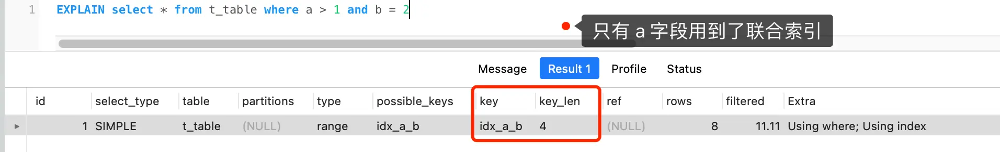

  通过这条查询语句我们可以知道，a 字段使用了 > 进行范围查询，联合索引的最左匹配原则在遇到 a 字段的范围查询（ >）后就停止匹配了，因此 b 字段并没有使用到联合索引。


- Q2: `select * from t_table where a >= 1 and b = 2`

  Q2 和 Q1 的查询语句很像，唯一的区别就是 a 字段的查询条件「大于等于」。

  由于联合索引（二级索引）是先按照 a 字段的值排序的，所以符合 >= 1 条件的二级索引记录肯定是相邻，于是在进行索引扫描的时候，可以定位到符合 >= 1 条件的第一条记录，然后沿着记录所在的链表向后扫描，直到某条记录不符合 a>= 1 条件位置。所以 a 字段可以在联合索引的 B+Tree 中进行索引查询。

  虽然在符合 a>= 1  条件的二级索引记录的范围里，b 字段的值是「无序」的，**但是对于符合 a = 1 的二级索引记录的范围里，b 字段的值是「有序」的**（因为对于联合索引，是先按照 a 字段的值排序，然后在 a 字段的值相同的情况下，再按照 b 字段的值进行排序）。

  于是，在确定需要扫描的二级索引的范围时，当二级索引记录的 a 字段值为 1 时，可以通过 b = 2 条件减少需要扫描的二级索引记录范围（b 字段可以利用联合索引进行索引查询的意思）。也就是说，从符合 a = 1 and b = 2 条件的第一条记录开始扫描，而不需要从第一个 a 字段值为 1 的记录开始扫描。

  所以，**Q2 这条查询语句 a 和 b 字段都用到了联合索引进行索引查询**。

  我们也可以在执行计划中的 key_len 知道这一点。执行计划如下，可以看到 key_len 为 8 字节，说明优化器使用了 2 个字段的查询条件来形成扫描区间的边界条件，也就是  a 和 b 字段都用到了联合索引进行索引查询。

  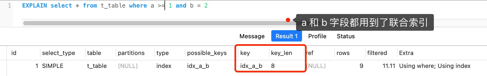

  通过 Q2 查询语句我们可以知道，虽然 a 字段使用了 >= 进行范围查询，但是联合索引的最左匹配原则并没有在遇到 a 字段的范围查询（ >=）后就停止匹配了，b 字段还是可以用到了联合索引的。

- Q3: `SELECT * FROM t_table WHERE a BETWEEN 2 AND 8 AND b = 2`

  Q3 查询条件中 `a BETWEEN 2 AND 8` 的意思是查询 a 字段的值在 2 和 8 之间的记录。不同的数据库对 BETWEEN ... AND 处理方式是有差异的。在 MySQL 中，BETWEEN 包含了 value1 和 value2 边界值，类似于 \>= and =<。而有的数据库则不包含 value1 和 value2 边界值（类似于 > and <）。

  这里我们只讨论 MySQL。由于 MySQL 的 BETWEEN 包含 value1 和 value2 边界值，所以类似于 Q2 查询语句，因此 **Q3 这条查询语句 a 和 b 字段都用到了联合索引进行索引查询**。

  我们也可以在执行计划中的 key_len 知道这一点。执行计划如下，可以看到 key_len 为 8 字节，说明优化器使用了 2 个字段的查询条件来形成扫描区间的边界条件，也就是  a 和 b 字段都用到了联合索引进行索引查询。

  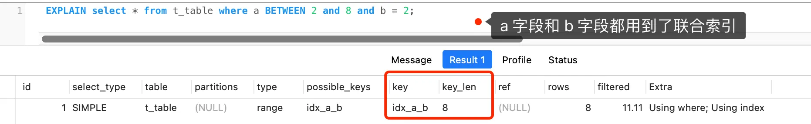

  通过 Q3 查询语句我们可以知道，虽然 a 字段使用了 BETWEEN 进行范围查询，但是联合索引的最左匹配原则并没有在遇到 a 字段的范围查询（BETWEEN）后就停止匹配了，b 字段还是可以用到了联合索引的。

- Q4: `SELECT * FROM t_user WHERE name like 'j%' and age = 22`


  由于联合索引（二级索引）是先按照 name 字段的值排序的，所以前缀为'j'的 name 字段的二级索引记录都是相邻的，于是在进行索引扫描的时候，可以定位到符合前缀为'j'的 name 字段的第一条记录，然后沿着记录所在的链表向后扫描，直到某条记录的 name 前缀不为'j'为止。

  所以 a 字段可以在联合索引的 B+Tree 中进行索引查询，形成的扫描区间是['j','k')。注意，j 是闭区间。如下图：

  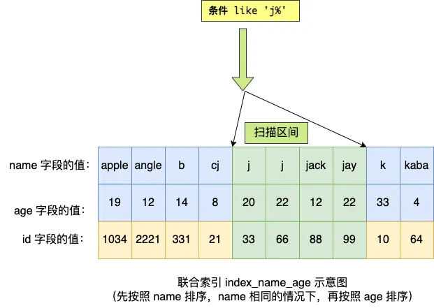

  虽然在符合前缀为'j'的 name 字段的二级索引记录的范围里，age 字段的值是「无序」的，**但是对于符合 name = j 的二级索引记录的范围里，age 字段的值是「有序」的**（因为对于联合索引，是先按照 name 字段的值排序，然后在 name 字段的值相同的情况下，再按照 age 字段的值进行排序）。

  于是，在确定需要扫描的二级索引的范围时，当二级索引记录的 name 字段值为'j'时，可以通过 age = 22 条件减少需要扫描的二级索引记录范围（age 字段可以利用联合索引进行索引查询的意思）。也就是说，从符合 `name = 'j' and age = 22` 条件的第一条记录时开始扫描，而不需要从第一个 name 为 j 的记录开始扫描。如下图的右边：

  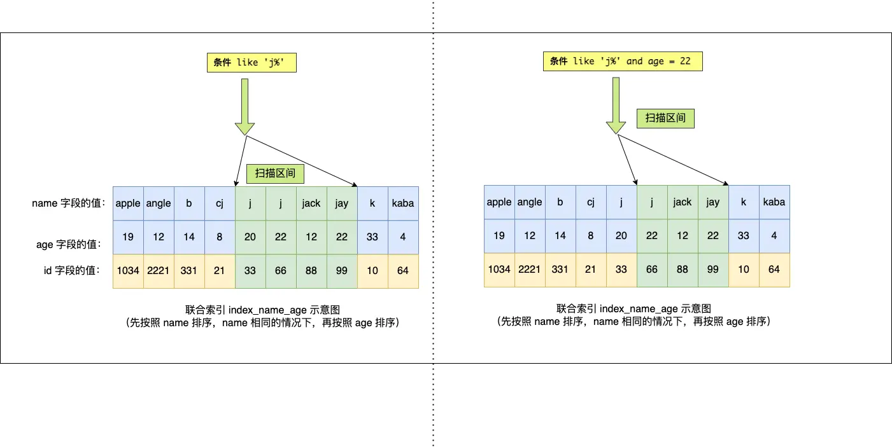

  所以，**Q4 这条查询语句 a 和 b 字段都用到了联合索引进行索引查询**。

  我们也可以在执行计划中的 key_len 知道这一点。本次例子中：

  - name 字段的类型是 varchar(30) 且不为 NULL，数据库表使用了 utf8mb4 字符集，一个字符集为 utf8mb4 的字符是 4 个字节，因此 name 字段的实际数据最多占用的存储空间长度是 120 字节（30 x 4），然后因为 name 是变长类型的字段，需要再加 2，也就是 name 的 key_len 为 122。

  - age 字段的类型是 int 且不为 NULL，key_len 为 4。

  Q4 查询语句的执行计划如下，可以看到 key_len 为 126 字节，name 的 key_len 为 122，age 的 key_len 为 4，说明优化器使用了 2 个字段的查询条件来形成扫描区间的边界条件，也就是  name 和 age 字段都用到了联合索引进行索引查询。

  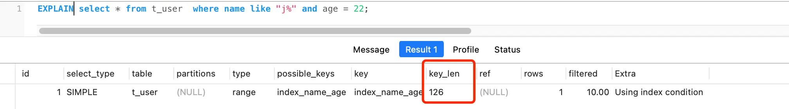

  通过 Q4 查询语句我们可以知道，虽然 name 字段使用了 like 前缀匹配进行范围查询，但是联合索引的最左匹配原则并没有在遇到 name 字段的范围查询（like 'j%'）后就停止匹配了，age 字段还是可以用到了联合索引的。

  综上所示，**联合索引的最左匹配原则，在遇到范围查询（如 \>、<）的时候，就会停止匹配，也就是范围查询的字段可以用到联合索引，但是在范围查询字段的后面的字段无法用到联合索引。注意，对于 >=、<=、BETWEEN、like 前缀匹配的范围查询，并不会停止匹配，前面我也用了四个例子说明了**。


#### 索引下推

我们来举个例子，假设有一个联合索引 (a, b)，现在执行这样一条 SQL：`select * from table where a > 1 and b = 2`。这时候，MySQL 会先用 a > 1 这个条件在联合索引的 B+Tree 上定位到第一个符合条件的主键（比如 ID=2）。但是，b = 2 这个条件要怎么判断呢？是在索引里判断，还是要回表（到主键索引）去判断？

- 在 MySQL 5.6 之前，MySQL 只能先通过索引找到所有 a > 1 的主键值，然后每找到一条记录都要回表（到主键索引）去把整行数据取出来，再判断 b 是否等于 2。这样如果 a > 1 的数据很多，回表次数就会很多，效率比较低。

- 从 MySQL 5.6 开始，引入了**索引下推优化**（Index Condition Pushdown，简称 ICP）。有了这个优化后，MySQL 在遍历联合索引的时候，就可以直接在索引里判断 b = 2 这个条件。只有当 a > 1 并且 b = 2 都满足时，才会回表取出整行数据。这样可以大大减少回表的次数，提高查询效率。

你可以在执行计划（explain）里看到 Extra 字段显示 `Using index condition`，这就说明 MySQL 用上了索引下推优化。

#### 索引区分度

建立联合索引时的字段顺序对索引的效率也有很大影响。越靠前的字段被用于索引过滤的概率越高，实际开发工作中建立索引的时候，要把区分度搞的字段排在前面，这样区分度大的字段越有可能被更多的SQL使用到

> 区分度：某个字段`column`不同值的个数除以表的总行数，计算公式如下:
> 
> $$
> 区分度=\frac{distinct(column)}{count(*)}
> $$
>
> 比如性别的区分度就很小，不适合建立索引或不适合排在联合索引列的靠前的位置，而`UUID`这类字段就比较适合做索引或排在联合索引的靠前的位置
>
> 因为如果索引的区分度很小，假设字段的值分布均匀，那么无论搜索哪个值都可能得到一半的数据。在这些情况下，还不如不要索引，因为 MySQL 还有一个查询优化器，查询优化器发现某个值出现在表的数据行中的百分比（惯用的百分比界线是"30%"）很高的时候，它一般会忽略索引，进行全表扫描。

#### 联合索引进行排序

比如针对下面这个SQL语句:

```sql
select * from order where status = 1 order by create_time asc
```

在实际开发中，如果我们的查询语句既有筛选条件（如 where status = 1），又有排序需求（如 order by create_time asc），那么在为表设计索引时，应该优先考虑建立联合索引。例如，可以为 status 和 create_time 两个字段一起建立联合索引 (status, create_time)。

> 这里能不能建立为 (create_time, status) 联合索引？
> 
> 答: 不推荐这样做，原因如下：
> 1.  **无法有效利用索引进行过滤**：联合索引 `(create_time, status)` 是先按 `create_time` 排序，再按 `status` 排序。对于查询 `where status = 1`，由于 `status` 是索引的第二个字段，不符合最左前缀原则，MySQL 无法直接利用该索引快速定位 `status=1` 的记录，可能导致需要扫描大量索引数据甚至全表扫描。
> 2.  **排序优化受限**：虽然索引的第一列是 `create_time`，看似能满足 `order by create_time`，但前提是 `where` 条件能有效利用索引。如果 `where status = 1` 无法有效过滤，那么即使索引本身按 `create_time` 有序，优化器也可能无法避免额外的排序操作（filesort），因为需要先筛选出 `status=1` 的数据。
> 
> 而 `(status, create_time)` 索引则能完美匹配该查询：
> -   `where status = 1` 可以利用索引的第一列快速定位数据。
> -   在 `status=1` 的记录内部，数据已按 `create_time` 有序，`order by create_time` 可以直接利用索引顺序，避免 filesort。

这样做的原因是：MySQL 的联合索引本身是有序的，先按照 status 排序，再按照 create_time 排序。当我们执行上述 SQL 时，MySQL 可以直接利用联合索引，先根据 status 过滤数据，再按照 create_time 顺序返回结果，无需额外的排序操作。

如果只为 status 单独建索引，虽然可以加速 status 的过滤，但由于 create_time 没有参与索引，MySQL 还需要对筛选后的结果进行额外的排序（即 filesort），这会影响查询效率。

因此，合理设计联合索引，既能满足筛选条件，又能覆盖排序字段，可以充分发挥索引的有序性，避免不必要的文件排序操作，从而提升查询性能。
