# MySQL 死锁了，怎么办？

在数据库的世界里，"死锁"是个时不时会出来捣乱的家伙。简单来说，就是两个或多个操作互相等着对方手里的"东西"（比如数据），结果谁也动不了，像交通堵塞一样卡住了。这篇文章，我们就通过一个订单系统的实际例子，聊聊死锁是怎么发生的，以及怎么尽量避免它。

想象一下，我们的系统里有新增、修改、查询订单这些功能。为了保证每个订单都是独一无二的（比如防止用户手快，重复提交了同一个订单），我们通常会在创建新订单前做个"幂等性校验"。常规操作是：先用 `select ... for update` 语句查一下这个订单号是不是已经存在了。这个 `for update` 很关键，它会尝试暂时"锁定"我们要检查的订单号（或者它可能存在的位置），目的是防止在我们检查和插入的短暂间隙，有其他操作也来插同一个订单号。如果查下来发现订单不存在，我们才真正动手插入这条新订单记录。

听起来挺稳妥，对吧？但在业务量一大，并发操作（很多用户同时操作）一多的时候，这种做法有时就会不小心触发死锁。

别担心，下面我们就一步步拆解**死锁是怎么来的，以及有哪些招数可以对付它**。

## 死锁的发生

本次案例我们用的是 MySQL 数据库，存储引擎是 InnoDB（一种常用的数据"仓库管理员"），事务的隔离级别设定为可重复读（Repeatable Read, RR，一种事务处理规则，保证在同一个事务里多次读取同样的数据，结果是一致的）。

接下来，我用实际操作带大家看看死锁是怎么发生的。

我建了一张订单表 `t_order`，结构如下，其中 `id` 字段是主键（唯一标识一条记录），`order_no` 字段建了个普通索引（非唯一索引，可以加快按订单号查询的速度）：

```sql
CREATE TABLE `t_order` (
  `id` int NOT NULL AUTO_INCREMENT,
  `order_no` int DEFAULT NULL,
  `create_date` datetime DEFAULT NULL,
  PRIMARY KEY (`id`),
  KEY `index_order` (`order_no`) USING BTREE
) ENGINE=InnoDB ;
```

然后，`t_order` 表里现在已经有了 6 条记录：

| id | order_no | create_date         |
|----|----------|---------------------|
| 1  | 1001     | 2021-12-28 13:59:07 |
| 2  | 1002     | 2021-12-28 13:59:14 |
| 3  | 1003     | 2021-12-28 13:59:21 |
| 4  | 1004     | 2021-12-28 13:59:30 |
| 5  | 1005     | 2021-12-28 13:59:36 |
| 6  | 1006     | 2021-12-28 14:24:33 | 

假设这时有两个事务（可以理解为两个独立的业务操作流程），一个事务（我们叫它事务A）要插入订单号为 1007 的订单，另一个事务（事务B）要插入订单号为 1008 的订单。因为需要对订单做幂等性校验，所以两个事务都会先查询对应的订单是否存在，如果不存在才插入记录。过程如下：


上图的操作中，如果数据库没有开启死锁检测机制（或者检测需要时间），你就会看到，两个事务都卡住了，陷入了相互等待对方释放锁的状态，这就是死锁。

这里在查询订单是否存在时，我们特意用了 `select ... for update` 语句。它的主要目的是"占位"，即在当前事务检查和插入订单的这个过程中，防止其他事务也来插入相同的订单号，或者影响到我们正在判断的这个"空位"。如果不用它，就可能出现"幻读"（Phantom Read）的问题——比如我们刚查完发现订单1007不存在，正准备插入，结果另一个事务抢先一步插了1007，导致我们后续操作出错，或者最终系统里有了两条订单1007。如下图所示：

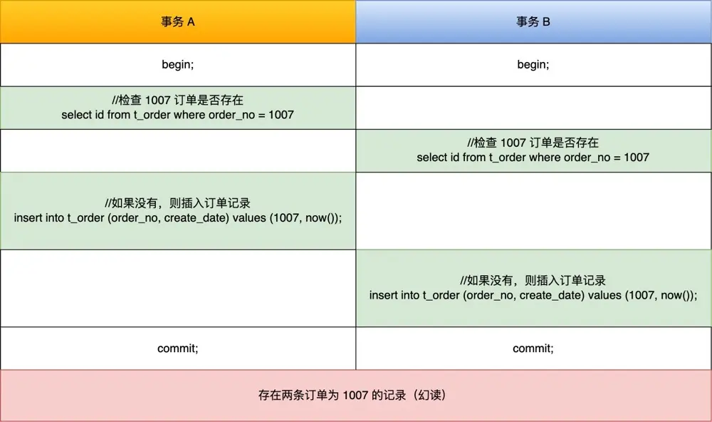

## 为什么会产生死锁？

前面提到，`select ... for update` 是为了防止幻读。在MySQL的InnoDB存储引擎和"可重复读"（RR）这个事务隔离级别下，为了从根本上解决幻读问题（即在一个事务中，前后两次执行同样的查询，结果集却不一致，像出现了"幽灵"数据一样），引入了一种特殊的锁机制，叫做 **next-key 锁**。你可以把它理解成一种组合锁，它包含了两种锁的功能：

- Record Lock（记录锁）：顾名思义，就是直接锁住某条具体的记录本身。
- Gap Lock（间隙锁）：它锁的不是某条具体的记录，而是记录与记录之间的"空档"或"缝隙"。比如，如果你的表里有订单号1005和1009，间隙锁就能锁住1005和1009之间的这个范围，防止其他事务在这中间插入新的订单号（比如1007）。这样就避免了你在这个事务里前后两次查询，发现中间突然多出来一条记录的幻读情况。

通常，我们执行普通的 `select` 语句是不会加锁的（它通过一种叫做MVCC的机制来实现"快照读"，保证可重复读）。如果想在查询时就给记录加上行锁（一种针对数据行的锁），可以用下面这两种方式：

```sql
begin; -- 开始事务
// 对读取的记录加共享锁 (S锁)
select ... lock in share mode;
commit; -- 提交事务，锁被释放

begin; -- 开始事务
// 对读取的记录加排他锁 (X锁)
select ... for update;
commit; -- 提交事务，锁被释放
```

要注意，行锁通常是在整个事务提交（commit）或回滚（rollback）后才会被释放，并不是某一条SQL语句执行完就立刻放锁。

举个例子，下面事务A的查询语句会锁住订单号大于2的范围，即 `(2, +∞]` 这个区间。在事务A提交前，如果有其他事务想在这个锁住的范围里插入数据，就会被阻塞。

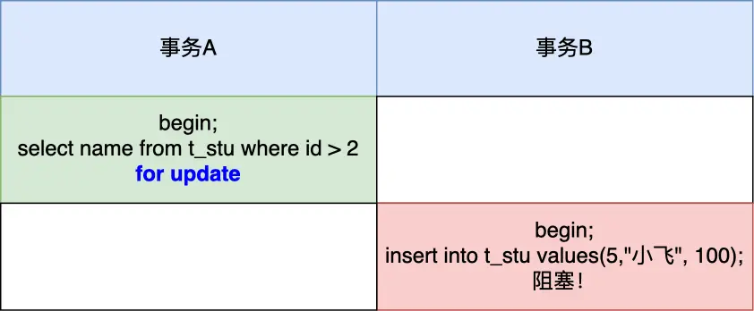

next-key 锁的加锁规则其实挺复杂的，在某些特定场景下它可能会"退化"成单纯的记录锁或间隙锁。我之前也写过一篇专门讲加锁规则的文章，想深入了解的同学可以看看：[MySQL 是怎么加锁的？](/2025/05/11/八股文/MYSQL/锁/MySQL是怎么加锁的/)

这里有个非常重要提醒：如果你的 `update` 语句的 `where` 条件没有用到索引列，MySQL就不得不做全表扫描。在扫描过程中，它不仅会给每一行记录都加上行锁，还会给记录两边的空隙都加上间隙锁。这相当于把整张表都锁了！直到事务结束这些锁才会被释放。所以，**在线上系统千万别执行没有带索引条件的 `update` 语句**，否则可能导致业务大面积停顿。我有个读者就因为这么干了，结果被老板狠狠地"教育"了一番，详情可以看这篇：[update 没加索引会锁全表？](/2025/05/16/八股文/MYSQL/锁/update没加索引会锁全表/)

好了，让我们回到前面那个死锁的例子。

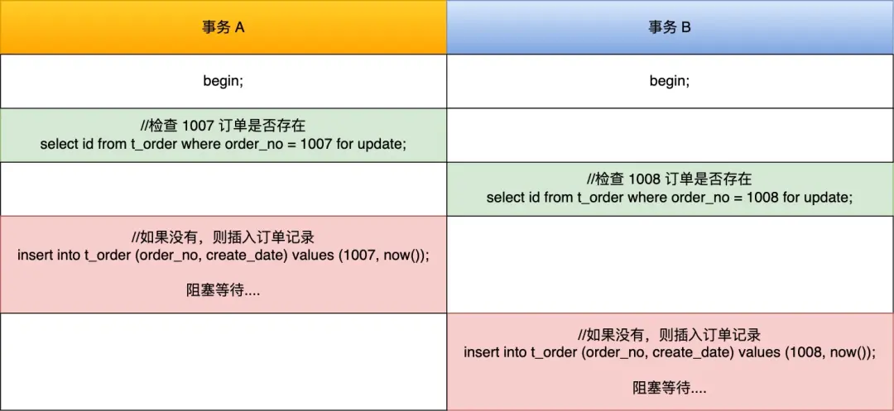

当事务A执行这条语句时：

```sql
select id from t_order where order_no = 1007 for update;
```

我们可以通过 `select * from performance_schema.data_locks\G;` 这条语句，查看事务执行SQL过程中具体加了哪些锁。

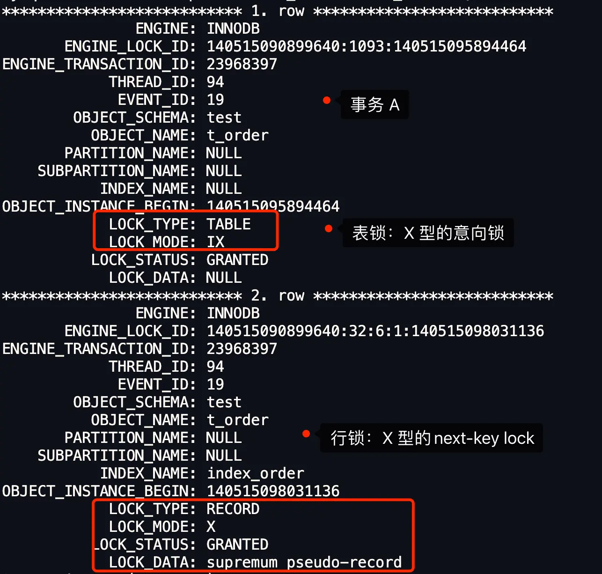

从上图可以看到，事务A主要加了两种锁：

- 表锁：一个X类型的意向锁（IX锁，表示事务准备在表里的某些行上加X锁）。
- 行锁：一个X类型的next-key锁。

我们重点关注行锁。图中 `LOCK_TYPE` 的 `RECORD` 表示这是一个行级锁（不是特指记录锁）。具体是next-key锁、间隙锁还是记录锁，需要看 `LOCK_MODE`：

- `X`：表示X型的next-key锁。
- `X, REC_NOT_GAP`：表示X型的记录锁。
- `X, GAP`：表示X型的间隙锁。

**因此，此时事务A在 `order_no` 这个二级索引（`INDEX_NAME : index_order`）上加的是X型的next-key锁，锁定的范围是 `(1006, +∞]`**。这里的1006是执行这条查询时，`t_order` 表中 `order_no` 列上小于1007且最接近1007的值（如果表里有小于1007的，就是那个最大的；如果没有，可能会是更小的一个范围起点）。由于1006是当时表里最大的订单号，所以 `(1006, +∞]` 锁住了从1006订单号之后的所有可能间隙，一直到表尾。

> next-key 锁的范围 (1006, +∞]，是怎么确定的？
>
> 根据我的经验，如果 `LOCK_MODE` 显示是next-key锁或者间隙锁，那么 `LOCK_DATA` 通常表示这个锁范围的最右边的那个值。在事务A的例子里，`LOCK_DATA` 是 `supremum pseudo-record`，这代表的是正无穷大（`+∞`）。而锁范围的最左边的值，则是 `t_order` 表中，在 `order_no` 索引上，小于我们查询值（1007）的那个最大值，也就是1006。因此，事务A的next-key锁锁定的就是 `(1006, +∞]` 这个开区间。



有的读者可能会问，我在[MySQL 是怎么加锁的？](/2025/05/11/八股文/MYSQL/锁/MySQL是怎么加锁的/)这篇文章里讲到，当在非唯一索引上进行等值查询，并且查询的记录不存在时，next-key lock会退化成间隙锁。那为什么上面事务A的next-key lock没有退化呢？

这里的关键在于查询的值（1007）与索引中已存在的值的相对位置。
- 如果表中 `order_no` 索引的最大值是1006（如此案例），然后我们查询 `order_no = 1007`（一个不存在且大于所有现有值的记录），此时加的是next-key lock，范围是 `(1006, +∞]`，它不会退化。
- 但如果表中 `order_no` 索引的最大值是1010，我们查询 `order_no = 1007`（一个不存在但在现有值之间的记录），此时next-key lock会锁定 `(1006, 1010]` 这个区间（假设1006是小于1007的最大值），然后它会退化成一个间隙锁，锁住 `(1006, 1010)` 这个间隙。如下图所示：

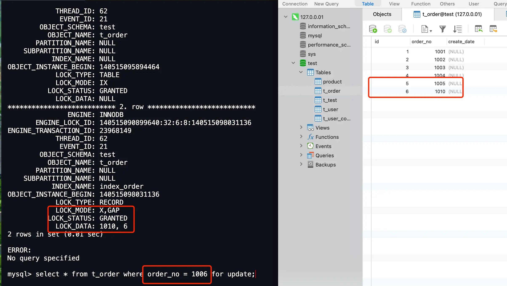



当事务B想要在事务A的next-key锁范围 `(1006, +∞]` 里插入订单号为1008的记录时，它就会被卡住：

```sql
Insert into t_order (order_no, create_date) values (1008, now()); -- 事务B的操作
```

这是因为，当一个事务（比如事务B）尝试向一个间隙中插入数据时，它需要先获得一种叫做**插入意向锁**（Insert Intention Lock）的"许可"。

关键点来了：
1.  **插入意向锁 与 (其他事务持有的)间隙锁 是冲突的**：如果事务A的next-key锁（它包含了一个间隙锁）已经锁住了事务B想插入的那个"缝隙"，那么事务B就必须等待事务A把这个间隙锁放掉，才能拿到自己的插入意向锁。
2.  **间隙锁 与 (其他事务持有的)间隙锁 是兼容的**：这就是为什么一开始两个事务都能成功执行 `select ... for update` 语句。它们各自获取的next-key锁虽然都覆盖了 `(1006, +∞]` 这个范围，但它们所包含的间隙锁部分并不会互相"打架"。多个事务可以同时拥有覆盖相同间隙的间隙锁。

所以，死锁的剧本是这样的：
- 事务A执行 `select ... for update where order_no = 1007;`，成功获得了覆盖 `(1006, +∞]` 范围的next-key锁（这个锁里包含了间隙锁成分）。
- 事务B执行 `select ... for update where order_no = 1008;`，也成功获得了覆盖 `(1006, +∞]` 范围的next-key锁（同样包含间隙锁，并且与事务A的间隙锁兼容）。
- 现在，事务A想插入订单1007。它需要获取插入意向锁。但这个位置（或者说这个意图）与事务B持有的 `(1006, +∞]` 间隙锁冲突了，所以事务A开始等待事务B释放锁。
- 同时，事务B想插入订单1008。它也需要获取插入意向锁。同样，这个意图与事务A持有的 `(1006, +∞]` 间隙锁冲突了，所以事务B也开始等待事务A释放锁。

看，它们互相等待对方手里的"钥匙"，谁也动不了，死锁就这么华丽丽地发生了。

> 为什么间隙锁与间隙锁之间是兼容的？
>
> MySQL官方文档有这么一段描述（我翻译并提炼一下）：
>
> *"InnoDB中的间隙锁是"纯粹抑制性"的，意思是它们唯一的作用就是阻止其他事务往这个间隙里插入数据。间隙锁可以共存。一个事务持有的间隙锁并不会阻止另一个事务在同一个间隙上持有间隙锁。共享间隙锁和排他间隙锁之间没有区别，它们互不冲突，并且功能相同。"*
>
> 简单说，**间隙锁的核心任务就是"守住这块空地，不准别人进来盖房子（插入数据）"**。既然大家的目的都是守地，那就可以一起守，互不干扰。

但是，这里要特别注意一点：**next-key锁 = 记录锁 + 间隙锁**。虽然间隙锁部分是兼容的，但如果两个next-key锁试图锁定的是同一个 *实际存在的记录*，那记录锁部分就可能会冲突了。比如，一个事务获取了某条记录的X型记录锁（包含在next-key锁里），另一个事务也想获取这条记录的X型记录锁，那就会被阻塞。

不过，在我们这个死锁案例中，两个事务的next-key锁 `(1006, +∞]` 都指向了一个"无穷远"的虚拟边界，并没有锁定同一个实际存在的记录。`+∞` 并不是一条真实的数据记录，所以它们在记录锁层面不会直接冲突。冲突主要来自于后续插入操作时，插入意向锁与对方间隙锁的矛盾。

> 插入意向锁是什么？
>
> 注意！"插入意向锁"虽然名字里带"意向锁"，但它和我们常说的表级意向锁（如IX, IS）不是一回事。它其实是一种**特殊类型的间隙锁**。
>
> MySQL官方文档是这么说的（同样，我来概括下）：
>
> *"插入意向锁是一种在行插入操作之前设置的间隙锁。这种锁表明了插入的"意图"，使得多个事务如果不是在间隙中的完全相同位置插入数据，它们就不必互相等待。比如，有索引记录4和7。两个不同的事务分别尝试插入5和6，在真正获得插入行的排他锁之前，它们都会用插入意向锁来锁定4和7之间的间隙，但它们不会互相阻塞，因为插入的行是不冲突的。"*
>
> 这段话告诉我们：
> - 插入意向锁也是一种间隙锁，但它非常特殊，**主要用于处理并发插入操作**。
> - 如果说普通的间隙锁锁住的是一个"区间"，那么**插入意向锁更像是锁住一个"点"**（即你打算插入的具体位置）。这可能是我能想到的最形象的比喻了。
> - 插入意向锁和普通间隙锁的一个重要区别是：虽然它们都沾点"间隙"的边，但**一个事务不能在持有普通间隙锁的同时，让另一个事务在该间隙内持有插入意向锁**（除非插入意向锁的位置不在这个普通间隙锁的保护范围内）。这就是它们冲突的根源。

另外，我补充一点插入意向锁的生成时机：当一个事务准备插入一条新记录时，它会检查这条新记录紧邻的下一条索引记录上是否已经被其他事务加了间隙锁。如果加了，当前事务的插入操作就会生成一个插入意向锁，并且这个锁会进入等待状态（MySQL加锁时，是先创建锁结构，再设置锁的状态。等待状态意味着锁还没拿到手，事务会被阻塞），直到那个间隙锁被释放。

## Insert 语句是怎么加行级锁的？

你可能会想，是不是每次`INSERT`一条记录，数据库都会马上给它上一堆锁呢？其实不一定。InnoDB有个聪明的机制叫做**隐式锁**。

> 什么是隐式锁？
>
> 简单说，就是"能不加锁就不加锁，除非万不得已"。当插入一条新记录时，InnoDB并不会立刻给这条记录分配一个明确的锁结构（比如我们前面看到的那些记录锁、next-key锁）。它依赖记录本身的一些内部信息（比如一个隐藏的事务ID列 `trx_id`）来间接实现保护。只有在某些特殊情况，比如这条记录可能要和别的事务发生冲突了，这个"隐形"的锁才会转换成我们之前讨论的那些"实体"锁。这样做的好处是减少了不必要的锁开销，提高了并发性能。
>
> 那么，什么情况下隐式锁会"现身"变成显式锁呢？主要有两种场景：
>
> 1.  **要插入的地方已经被间隙锁"封路"了**：如果其他事务用间隙锁锁住了你要插入记录的那个"缝隙"，那你这条`INSERT`语句就得等着，并且会尝试获取一个插入意向锁（此时隐式锁机制可能就不够用了，需要显式的锁介入）。
> 2.  **插入的记录和已有记录的唯一键冲突了**：比如你要插入一个主键已经存在的记录，或者一个唯一索引列已经有相同值的记录。这时，插入会失败，并且InnoDB会对那条已经存在的、造成冲突的记录加上一个S型的锁。

### 1、记录之间加有间隙锁

我们来看个例子。现在`t_order`表中只有以下数据，并且`order_no`是二级索引（非唯一）。

| id | order_no | create_date |
|----|----------|-------------|
| 1  | 1001     | (NULL)      |
| 2  | 1002     | (NULL)      |
| 3  | 1003     | (NULL)      |
| 4  | 1004     | (NULL)      |
| 5  | 1005     | (NULL)      | 

现在，事务A执行了下面这条语句，试图查询一个不存在的订单号1006并锁定它：

```sql
# 事务 A
mysql> begin;
Query OK, 0 rows affected (0.01 sec)

mysql> select * from t_order where order_no = 1006 for update;
Empty set (0.01 sec) -- 查询结果为空，因为1006不存在
```

我们用 `select * from performance_schema.data_locks\G;` 查一下事务A加了什么锁（只关注记录上的锁）：

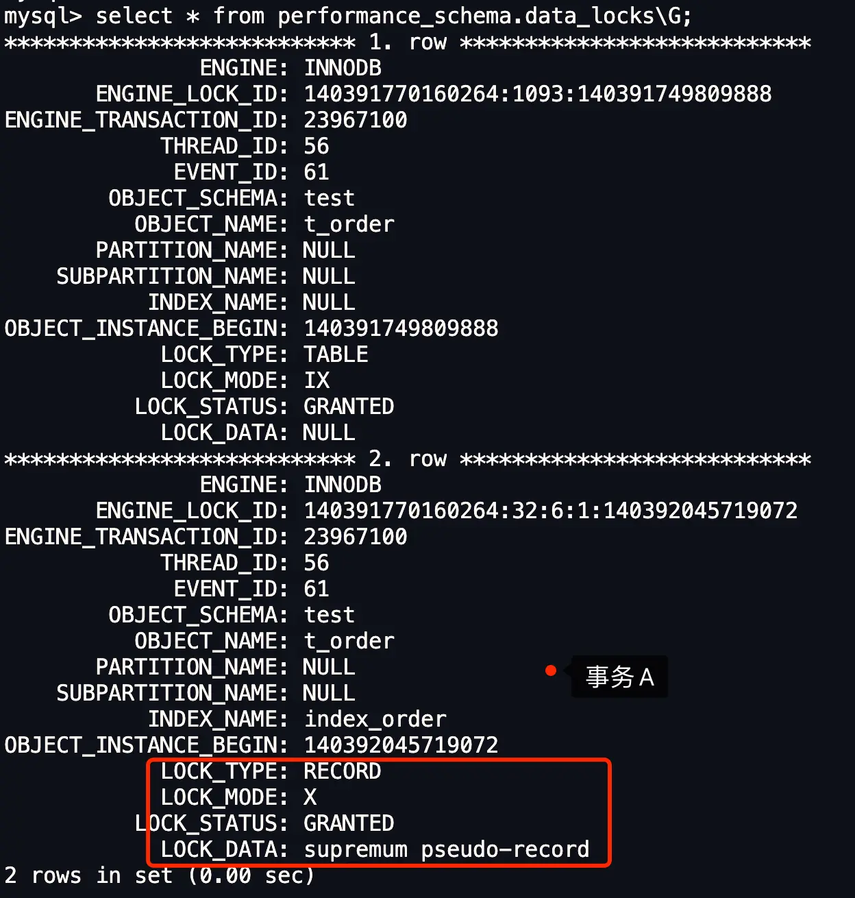

可以看到，事务A在`order_no`索引上加了一个next-key锁，锁定的范围是 `(1005, +∞]`（因为1005是小于1006的最大值）。

然后，事务B尝试在这个被锁定的间隙中插入一条记录（订单号1010）：

```sql
# 事务 B 插入一条记录
mysql> begin;
Query OK, 0 rows affected (0.01 sec)

mysql> insert into t_order(order_no, create_date) values(1010,now());
### 阻塞状态。。。。
```
事务B的`INSERT`语句被阻塞了。我们再查一下事务B的锁信息：

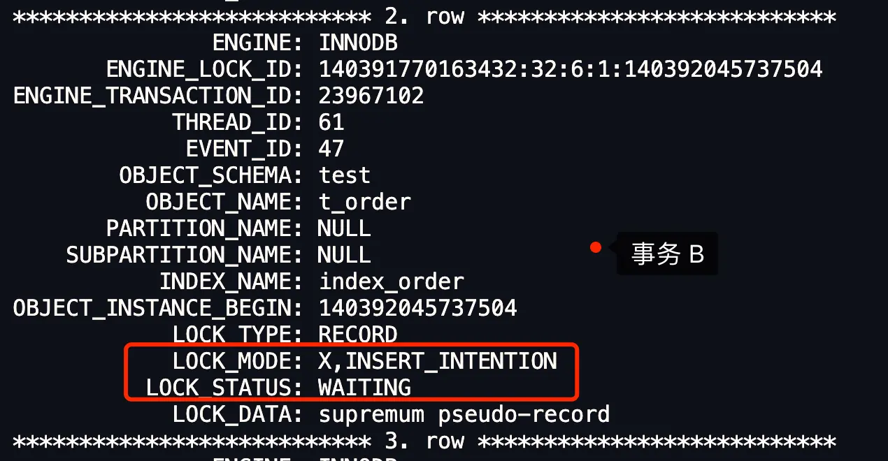

事务B的状态是 `WAITING`（等待）。它试图获取一个 `X,INSERT_INTENTION`（X型插入意向锁），但由于它想插入的位置（1010）落在了事务A持有的next-key锁范围 `(1005, +∞]` 内，所以它必须等待。

### 2、遇到唯一键冲突

如果在插入新记录时，发现新纪录的某个唯一键（主键或唯一二级索引）的值与已存在的记录重复了，插入操作会失败。并且，InnoDB还会对那条已经存在的、导致冲突的记录加上一个**S型（共享型）的锁**。

具体加的是S型记录锁还是S型next-key锁，会根据冲突的是主键还是唯一二级索引，以及当前的事务隔离级别有所不同：

-   **如果主键值重复**：
    -   在**读已提交（Read Committed, RC）**隔离级别下，插入事务会给已存在的主键重复的聚簇索引记录（即数据行本身）添加 **S型记录锁**。
    -   在**可重复读（Repeatable Read, RR）**隔离级别下（MySQL默认），同样是添加 **S型记录锁**。

-   **如果唯一二级索引列的值重复**：
    -   **无论是在RC还是RR隔离级别下**，插入事务都会给已存在的、二级索引值重复的二级索引记录添加 **S型next-key锁**。是的，你没看错，即使是读已提交隔离级别，这里也会加next-key锁（包含间隙锁成分）。这算是RC隔离级别下一个比较特殊的、会使用间隙锁的场景。至于为什么这么设计，我暂时还没找到官方的明确解释。

#### 主键索引冲突

我们来看个主键冲突的例子。MySQL 8.0版本，事务隔离级别为可重复读（RR）。
`t_order` 表的 `id` 字段是主键。假设表里已经有一条 `id` 为 5 的记录。现在一个事务尝试插入一条新的 `id` 为 5 的记录，这必然会失败，并报告主键冲突错误。

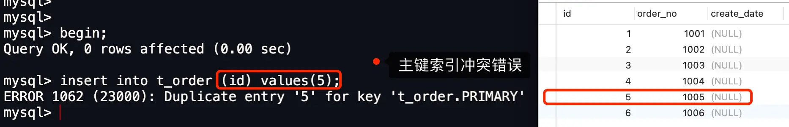

除了报错，数据库还做了一件重要的事情：它给原来那条 `id` 为 5 的记录加上了一个**S型的记录锁**。
我们可以通过 `select * from performance_schema.data_locks\G;` 确认这一点：

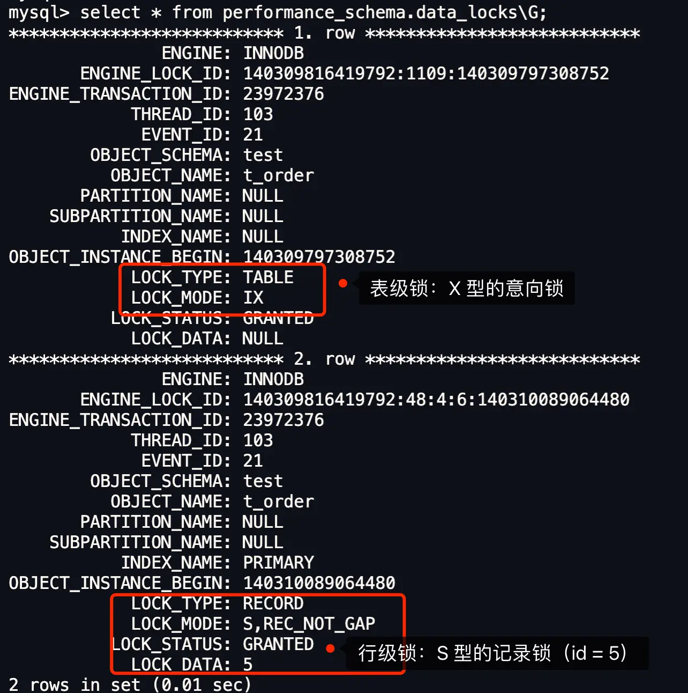

看到没？`LOCK_DATA` 是 5（表示主键值为5的记录），`LOCK_MODE` 是 `S, REC_NOT_GAP`（S型记录锁）。

所以，在RR隔离级别下，如果插入数据时发生主键冲突，插入事务会给那条已经存在的、主键值相同的记录上一个S型记录锁。

#### 唯一二级索引冲突

再来看唯一二级索引冲突的例子。同样是MySQL 8.0，RR隔离级别。
假设 `t_order` 表的 `order_no` 字段现在是一个唯一二级索引，并且表里已经有一条 `order_no` 为 1001 的记录。事务A尝试插入一条新的 `order_no` 也为 1001 的记录，同样会报错。

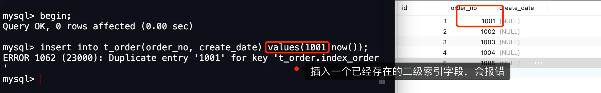

除了报错，数据库这时会对 `order_no` 值为 1001 的那条二级索引记录加上一个**S型的next-key锁**。
查看锁信息：

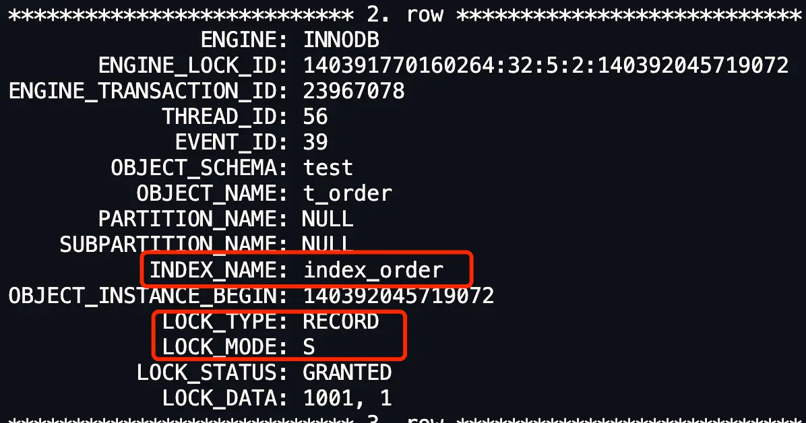

可以看到，在 `index_order` 这个二级索引上，`LOCK_MODE` 是 `S`（表示S型next-key锁），它锁定的范围大致是 `(-∞, 1001]` （具体范围取决于1001之前的值）。

如果这时，另一个事务B想对 `order_no = 1001` 的记录执行 `select ... for update`（即想给它加X型锁），事务B就会被阻塞，因为X型锁和S型锁是冲突的。

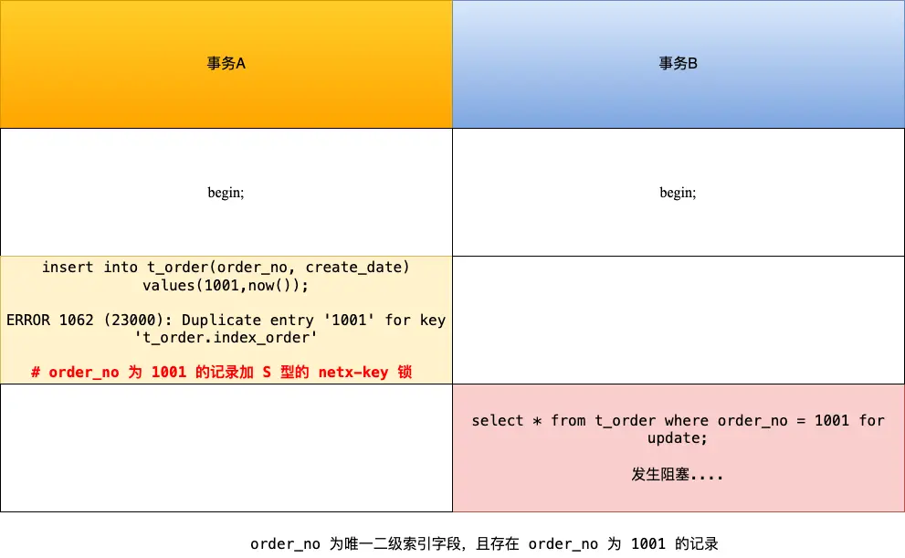

查看事务B的锁状态，会发现它在等待一个X型的记录锁 (`LOCK_MODE: X,REC_NOT_GAP`)，状态是 `WAITING`。

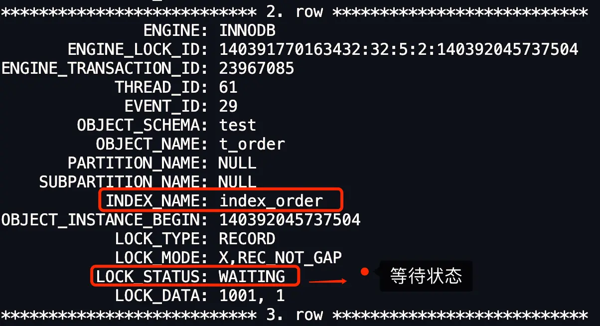

#### 两个事务插入相同的唯一二级索引记录

接下来，我们分析一个更有意思的场景：两个事务先后尝试插入具有相同唯一二级索引值的记录。
假设 `t_order` 表中目前的数据如下，并且 `order_no` 是唯一二级索引。

| id | order_no | create_date |
|----|----------|-------------|
| 1  | 1001     | (NULL)      |
| 2  | 1002     | (NULL)      |
| 3  | 1003     | (NULL)      |
| 4  | 1004     | (NULL)      |
| 5  | 1005     | (NULL)      | 

在RR隔离级别下，事务A先执行插入，然后事务B也执行相同的插入语句。这时，**事务B的INSERT语句会被阻塞**。

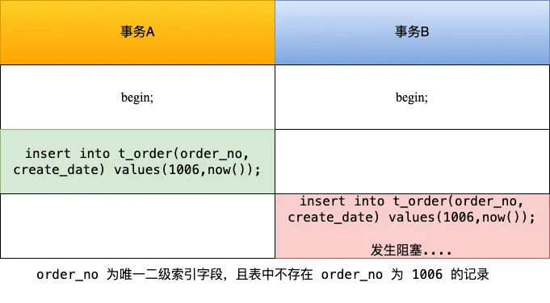

这两个事务的加锁过程是这样的：
1.  **事务A**插入 `order_no` 为 1006 的记录。由于这是个新记录，并且没有违反唯一性约束（假设此时还没有1006），插入成功。这条新插入的记录的唯一二级索引（`order_no = 1006`）此时受到"隐式锁"的保护。在这个阶段，如果去查 `performance_schema.data_locks`，通常看不到这条记录有显式的锁结构。
2.  **事务B**也尝试插入 `order_no` 为 1006 的记录。当它检查唯一二级索引时，发现事务A（虽然还未提交）已经"占用"了1006这个值。于是，事务B的插入操作因唯一键冲突而受阻。它会尝试为这个冲突的二级索引记录（即 `order_no = 1006`）获取一个S型的next-key锁。
3.  但与此同时，由于事务B的操作与事务A插入的记录发生了潜在冲突，事务A在这条 `order_no = 1006` 的记录上的"隐式锁"会**升级为显式的X型记录锁**。
4.  结果就是，事务B想获取S型next-key锁，但事务A已经持有了X型记录锁（在同一个索引记录上）。X型锁和S型锁是冲突的，所以事务B被迫进入等待状态，直到事务A提交或回滚。

我们可以通过 `performance_schema.data_locks` 来验证这个过程。
先看事务A在 `order_no = 1006` 的记录上最终持有什么锁（这是在事务B尝试插入后产生的）：

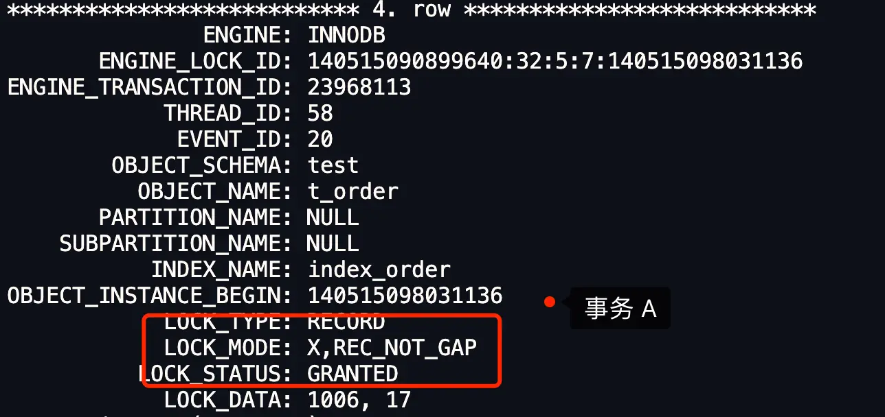
可以看到，事务A在 `index_order` 索引的 `order_no = 1006` 这条记录上，持有了一个X型的记录锁 (`LOCK_MODE: X,REC_NOT_GAP`)。

再看事务B想获取什么锁，以及它的状态：

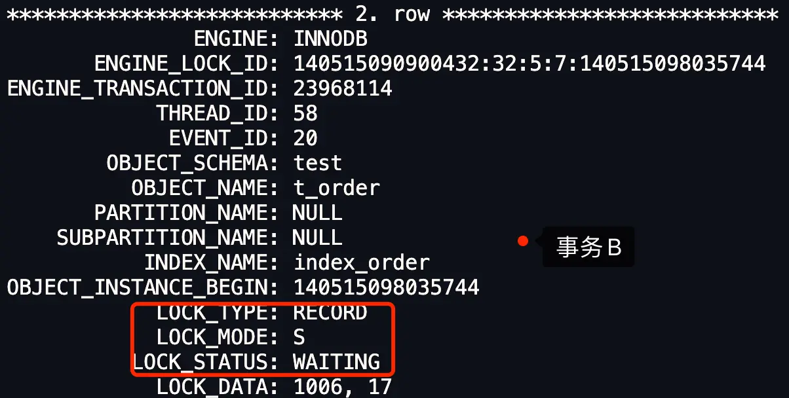
事务B想在 `index_order` 索引的 `order_no = 1006` 记录上获取一个S型的next-key锁 (`LOCK_MODE: S`)，但因为与事务A的X型记录锁冲突，所以它的状态是 `WAITING`。

这个实验告诉我们：当多个事务并发插入具有唯一二级索引的记录时，第一个成功插入的事务（即使未提交）的记录会受到隐式锁保护。当后续事务尝试插入相同唯一键的记录时，第一个事务的隐式锁会强化为显式的X型记录锁，而后续事务则因请求S型next-key锁与之冲突而被阻塞。

**形成对比的是**：如果 `order_no` 字段只是一个普通的非唯一索引，那么两个事务先后执行相同的INSERT语句，通常是不会互相阻塞的（除非有其他锁机制介入，比如间隙锁导致的阻塞，就像我们最初的死锁案例那样）。它们都能成功插入各自的记录，表里就会出现两条 `order_no` 相同的记录。


## 如何避免死锁？

死锁的发生需要满足四个必要条件：**互斥**（资源不能共享）、**占有且等待**（拿着自己的，还想要别人的）、**不可强占用**（不能抢别人的）、**循环等待**（形成一个等待链）。只要破坏其中任意一个条件，理论上就可以避免死锁。

在数据库层面，通常有两种策略来处理已经发生的死锁，它们主要是通过"打破循环等待条件"来实现的：

1.  **设置事务等待锁的超时时间**：可以给事务设置一个最长等待锁的时间。如果一个事务等待超过了这个设定的阈值，数据库就会自动回滚这个超时的事务，从而释放它占有的锁，让其他事务得以继续执行。在InnoDB中，这个参数是 `innodb_lock_wait_timeout`，默认值通常是50秒。
    当发生超时后，你可能会看到类似这样的错误提示：
    

2.  **开启主动死锁检测**：InnoDB引擎有一个内置的死锁检测机制。当它发现死锁时，会主动选择一个"牺牲者"（通常是回滚代价最小的那个事务），将它回滚掉，从而解开死锁链条，让其他事务继续。这个功能通过参数 `innodb_deadlock_detect` 控制，默认就是开启的。
    当检测到死锁并回滚了某个事务后，你可能会看到这样的提示：
    

上面这两种策略更像是"死锁发生后的应对措施"，而不是完全的"预防"。

那么，从业务逻辑的角度，我们能不能主动做些什么来预防类似我们案例中的死锁呢？
回顾一下，我们最初使用 `select ... for update` 做幂等性校验，是为了防止出现重复订单。其实，我们可以利用数据库本身的约束机制来达到这个目的：**直接将 `order_no` 字段设置为唯一索引列**。这样一来，当尝试插入一个已经存在的 `order_no` 时，数据库层面就会直接报错（唯一性冲突），从根本上阻止了重复订单的产生。这种方式简单直接，虽然在插入重复订单时会抛出异常（应用层面需要妥善处理这种异常），但它通常能有效避免因复杂的锁竞争而导致的死锁问题。

当然，具体的解决方案还需要根据业务场景和并发情况来综合评估。理解锁机制，合理设计表结构和事务逻辑，是减少死锁的关键。

参考资料：

- 《MySQL 是怎样运行的？》
- http://mysql.taobao.org/monthly/2020/09/06/
