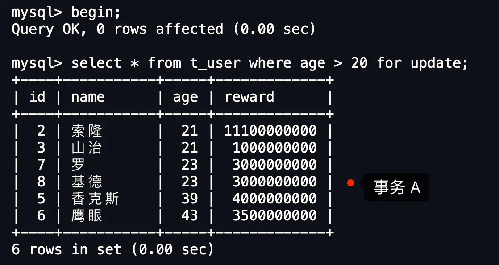
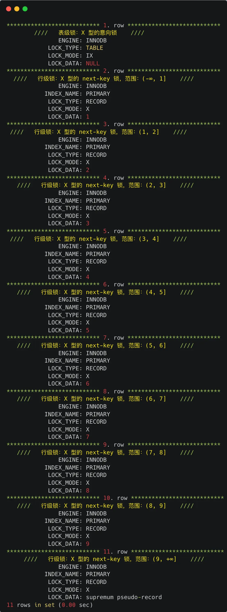
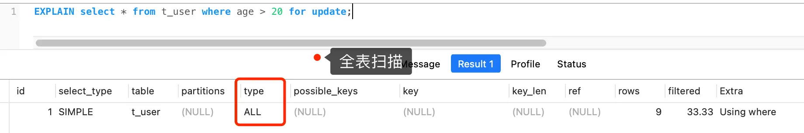
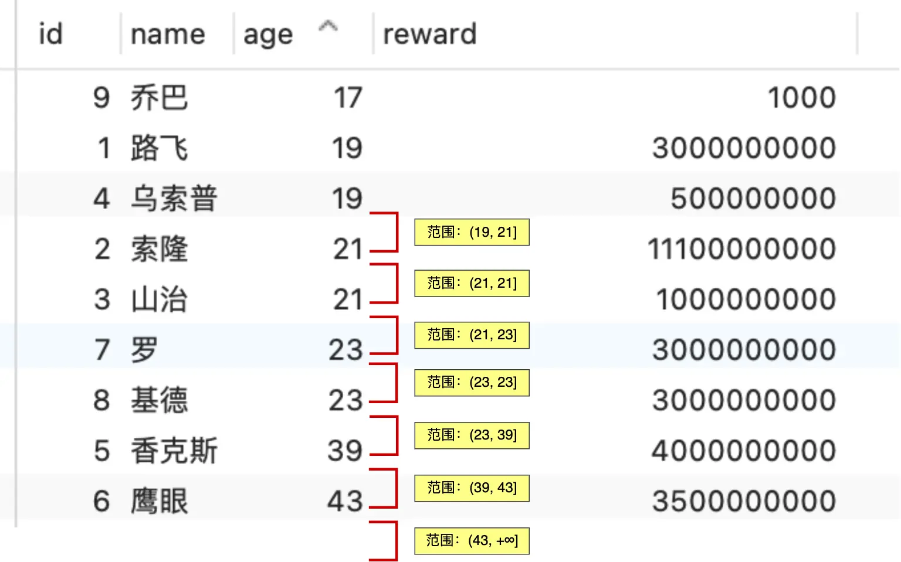
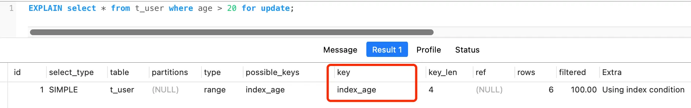
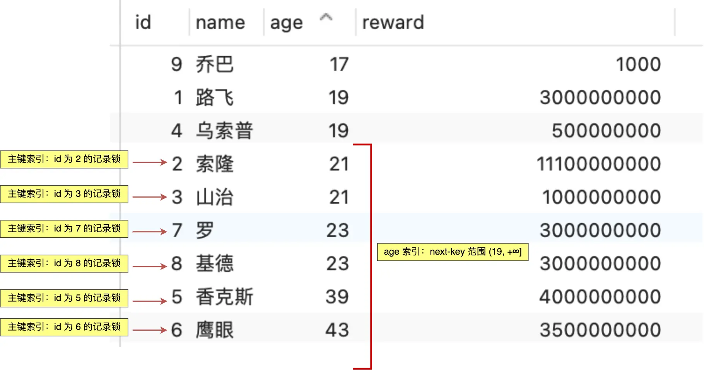

# MySQL 记录锁 + 间隙锁能挡住删除操作的幻读吗？

有位候选人分享了他在美团二面时遇到的一个关于 MySQL 幻读的场景。面试中，他提到在可重复读（REPEATABLE READ）隔离级别下，当前读通过记录锁和间隙锁来解决幻读，并说明间隙锁的目的是防止数据的插入。面试官随即反问：“如果此时执行删除（DELETE）指令，是否会导致幻读？” 这位候选人当时回答“会”，但事后对此答案感到不确定，因此希望能明确这个问题。

这个问题的核心可以归纳为：**MySQL 记录锁 + 间隙锁可以防止删除操作而导致的幻读吗？**

答案是：**能！**

别急，我们通过几个小实验来一步步揭开这个谜底，顺便也温习一下记录锁和间隙锁这两个重要的概念。

## 什么是幻读？

咱们先看看 MySQL 官方文档是怎么解释"幻读"（Phantom Read）的：

> **_The so-called phantom problem occurs within a transaction when the same query produces different sets of rows at different times. For example, if a SELECT is executed twice, but returns a row the second time that was not returned the first time, the row is a "phantom" row._**

简单来说，幻读就是**在一个事务（可以理解为一系列操作的集合）里，同样的查询命令，在不同时间执行后，得到的结果集不一样了。** 比如，你第一次查询，返回了5条数据；过了一会儿，在同一个事务里，你再次执行同样的查询，结果却返回了6条数据（多了一条"幽灵"般的数据），或者只返回了4条数据（少了一条数据）。这种情况，我们就说发生了幻读。

举个例子，假设一个事务在 T1 和 T2 两个时间点都执行了下面这条查询语句，并且中间没有做任何其他操作：

```sql
SELECT * FROM t_test WHERE id > 100;
```

如果 T1 时刻查询到 5 条记录，而 T2 时刻查询到了 6 条记录，这就是幻读。
反过来，如果 T1 时刻查询到 5 条记录，而 T2 时刻查询到了 4 条记录，这也算是幻读。

> MySQL 是怎么解决幻读的？

MySQL 的 InnoDB 存储引擎，在它默认的"可重复读"隔离级别下，很大程度上避免了幻读问题（虽然不是100%完美解决，有些极端情况还是可能发生，想深入了解可以看看这篇[文章](/2025/05/07/八股文/MYSQL/事务/2025-05-07-MySQL-可重复读隔离级别与幻读/)。它主要用了两种方法：

-   对于**快照读**（就是我们平时用的普通 `SELECT` 语句），MySQL 通过一种叫做 **MVCC（多版本并发控制）** 的机制来解决幻读。简单说，就是事务在执行过程中看到的数据，始终和它刚启动时看到的一样，就算其他事务在这期间插入了新数据，当前事务也"看不见"，自然就避免了幻读。
-   对于**当前读**（比如 `SELECT ... FOR UPDATE` 这种会加锁的查询），MySQL 则通过 **next-key lock（它其实是记录锁和间隙锁的组合）** 来解决幻读。当执行这类查询时，MySQL 会在相关的数据范围上加上 next-key lock。这时，如果其他事务想在这个锁定的范围内插入新数据，就会被阻塞，插不进去，也就避免了幻读。

## 实验验证

接下来，我们就来验证一下前面的结论："MySQL 的记录锁 + 间隙锁**确实可以防止**因删除数据而引发的幻读问题"。

实验环境：MySQL 8.0 版本，隔离级别为可重复读。

我们先准备一张用户表 `t_user`，这张表结构很简单，**只有一个主键索引 `id`**。表里已经有一些数据：

| id  | name   | age | reward      |
| --- | ------ | --- | ----------- |
| 1   | 路飞   | 19  | 3000000000  |
| 2   | 索隆   | 21  | 11100000000 |
| 3   | 山治   | 21  | 1000000000  |
| 4   | 乌索普 | 19  | 500000000   |
| 5   | 香克斯 | 39  | 4000000000  |
| 6   | 鹰眼   | 43  | 3500000000  |
| 7   | 罗     | 23  | 3000000000  |
| 8   | 基德   | 23  | 3000000000  |
| 9   | 乔巴   | 17  | 1000        |

现在，我们开启一个事务 A，执行一条查询语句，查找年龄大于 20 岁的用户，发现有 6 条记录。



紧接着，我们开启另一个事务 B，尝试删除 `id = 2` 的这条记录：


你会发现，事务 B 的删除操作会一直卡在那里，显示**等待状态**，根本删不掉。

这就证明了：MySQL 的记录锁 + 间隙锁**确实可以防止**因为删除数据而引发的幻读问题。

### 加锁分析

那么问题来了，事务 A 在执行 `SELECT ... FOR UPDATE` 语句时，到底给数据加了哪些锁呢？

我们可以通过执行 `select * from performance_schema.data_locks\G;` 这条命令来查看事务在执行 SQL 时都加了哪些锁。

这条命令输出的信息通常比较多，这里我们只看关键部分（总共有11行，我做了一些删减）：



从上面的输出可以看到，主要加了两种类型的锁：

-   **表锁** (`LOCK_TYPE: TABLE`)：这里是一个 X 类型的意向锁（简单理解为，我要对表里某些行加锁了，先在表级别打个招呼）。
-   **行锁** (`LOCK_TYPE: RECORD`)：这里是多个 X 类型的 next-key 锁。

我们重点关注的是"行锁"。注意，图中的 `LOCK_TYPE` 显示为 `RECORD`，但这指的是行级锁的总称，具体是哪种行锁，还需要看 `LOCK_MODE`：

-   如果 `LOCK_MODE` 是 `X`，那么它就是一个 next-key 锁（记录锁 + 间隙锁的组合）。
-   如果 `LOCK_MODE` 是 `X, REC_NOT_GAP`，那它就是一个记录锁（只锁住某条记录，不锁间隙）。
-   如果 `LOCK_MODE` 是 `X, GAP`，那它就是一个间隙锁（只锁住记录之间的间隙，不锁记录本身）。

接着，我们可以通过 `LOCK_DATA` 来确定 next-key 锁的具体范围。怎么看呢？

-   根据经验，如果 `LOCK_MODE` 是 next-key 锁或间隙锁，那么 **`LOCK_DATA` 通常表示这个锁管辖范围的"右边界"**。而这个锁的"左边界"，就是 `LOCK_DATA` 对应值的前一条记录的值。

所以，在这个例子中，事务 A 在主键索引（`INDEX_NAME : PRIMARY`）上加了 10 个 next-key 锁，它们的范围分别是：

- X 型的 next-key 锁，范围：(-∞, 1] (表示小于等于1的范围)
- X 型的 next-key 锁，范围：(1, 2]  (表示大于1且小于等于2的范围)
- X 型的 next-key 锁，范围：(2, 3]
- X 型的 next-key 锁，范围：(3, 4]
- X 型的 next-key 锁，范围：(4, 5]
- X 型的 next-key 锁，范围：(5, 6]
- X 型的 next-key 锁，范围：(6, 7]
- X 型的 next-key 锁，范围：(7, 8]
- X 型的 next-key 锁，范围：(8, 9]
- X 型的 next-key 锁，范围：(9, +∞] (表示大于9的范围)

**简单来说，这相当于把整张表从头到尾都给锁上了！** 任何其他事务想要在这张表上进行增加、删除、修改操作，都会被阻塞。

只有当事务 A 完成（提交或回滚）后，它加的这些锁才会被释放。

> 为什么只是查询年龄大于 20 岁的记录，却把整张表都锁了呢？

这是因为事务 A 的这条查询语句 (`SELECT * FROM t_user WHERE age > 20 FOR UPDATE;`) 实际上进行的是**全表扫描**。MySQL 在加锁时，并不是只针对最后查询出来的结果加锁，而是在遍历索引（这里因为没有 `age` 索引，所以是遍历主键索引，即全表扫描）的过程中，逐个给扫描到的索引项加上锁。



因此，**敲黑板划重点：在线上环境执行 `UPDATE`、`DELETE` 或者 `SELECT ... FOR UPDATE`这类会加锁的语句时，一定要确保查询条件能用上索引。如果走了全表扫描，MySQL 就会给扫描到的每一个索引项都加上 next-key 锁，结果就是整张表都被锁住，这可是个大麻烦，会严重影响并发性能！**

> 如果给 `age` 字段加上索引，事务 A 这条查询又会加哪些锁呢？

好问题！接下来，我们**给 `age` 字段创建一个索引**，然后再来执行同样的查询语句：


再次使用 `select * from performance_schema.data_locks\G;` 来查看加锁情况。

这次的输出我就不全贴出来了，直接说结论：

**因为现在表里有两个索引了：主键索引 `id` 和我们刚加的 `age` 索引。所以，MySQL 会分别在这两个索引上加锁。**

在**主键索引**上，会加以下锁：

- X 型的记录锁，锁住 `id = 2` 这条记录。
- X 型的记录锁，锁住 `id = 3` 这条记录。
- X 型的记录锁，锁住 `id = 5` 这条记录。
- X 型的记录锁，锁住 `id = 6` 这条记录。
- X 型的记录锁，锁住 `id = 7` 这条记录。
- X 型的记录锁，锁住 `id = 8` 这条记录。
(这些都是 `age > 20` 对应的主键id)

在分析 **`age` 索引**上的加锁情况时，我们要先在脑海里把 `age` 字段的值排个序（因为B+树索引本身就是有序的）。



`age` 索引上会加这些锁：

- X 型的 next-key lock，锁住 `age` 索引上 `(19, 21]` 这个范围。
- X 型的 next-key lock，锁住 `age` 索引上 `(21, 21]` 这个范围 (这里虽然左右边界相同，但因为是next-key，它会锁住值为21的记录以及其后的间隙)。
- X 型的 next-key lock，锁住 `age` 索引上 `(21, 23]` 这个范围。
- X 型的 next-key lock，锁住 `age` 索引上 `(23, 23]` 这个范围。
- X 型的 next-key lock，锁住 `age` 索引上 `(23, 39]` 这个范围。
- X 型的 next-key lock，锁住 `age` 索引上 `(39, 43]` 这个范围。
- X 型的 next-key lock，锁住 `age` 索引上 `(43, +∞]` 这个范围 (锁住大于等于43的记录以及之后无穷大的间隙)。

简单概括一下，**在 `age` 索引上，next-key 锁覆盖的范围是 `(19, +∞]`，也就是所有 `age > 19` 的记录以及它们之间的间隙，一直到正无穷。**

可以看到，给 `age` 字段加上索引后，查询语句就从全表扫描变成了索引查询，因此**不会再锁住整张表了**，锁的范围精准了很多。



总结一下，在给 `age` 字段创建索引后，当事务 A 执行 `SELECT * FROM t_user WHERE age > 20 FOR UPDATE;` 这条查询时，主键索引和 `age` 索引上会加上如下图所示的锁：



当事务 A 加上这些锁之后，其他的事务（比如 B、C、D、E）如果想执行以下操作，都会被阻塞：

- **事务 B (删除):** `DELETE FROM t_user WHERE id = 2;` (因为 `id=2` 的主键记录被锁了，且 `age=21` 也在 `age` 索引的锁定范围内)
- **事务 C (更新):** `UPDATE t_user SET name = '娜美' WHERE id = 3;` (因为 `id=3` 的主键记录被锁了)
- **事务 D (插入):** `INSERT INTO t_user (id, name, age, reward) VALUES (10, '罗宾', 30, 130000000);` (因为 `age=30` 落在了 `age` 索引的 `(23, 39]` 这个 next-key 锁的间隙内)
- **事务 E (更新):** `UPDATE t_user SET age = 22 WHERE id = 1;` (虽然 `id=1` 的主键记录没被锁，但是要更新的 `age=22` 落在了 `age` 索引的 `(21, 23]` 这个 next-key 锁的间隙内)


## 总结

在 MySQL 的"可重复读"隔离级别下，当我们执行会加锁的查询语句（比如 `SELECT ... FOR UPDATE`）时，MySQL 会在相关的**索引**上加上记录锁和间隙锁（也就是 next-key 锁）。这套组合拳非常有效，可以防止其他事务通过插入、删除或修改数据来捣乱，从而避免了幻读问题。

最重要的一点再次强调：在执行 `UPDATE`、`DELETE`、`SELECT ... FOR UPDATE` 这类语句时，**一定要检查它们是否能有效利用索引**。如果走了全表扫描，MySQL 会给扫描到的每一个索引项（通常是主键索引的每一条记录）都加上 next-key 锁，结果就是整张表都被锁得死死的，这对系统的并发处理能力是个巨大的打击。

搞定！希望这次的解释能让你彻底明白。
