# MySQL 是怎么加锁的？

## 什么 SQL 语句会加行级锁？

InnoDB 存储引擎支持行级锁，而 MyISAM 存储引擎则不支持。因此，后续内容均基于 InnoDB 引擎进行讨论。

所以，当我们探讨 MySQL 如何添加行级锁时，实际上是在讨论 InnoDB 引擎是如何实现行级锁的。

普通的 `select` 语句通常不会对记录加锁，因为它属于"快照读"（Snapshot Read），是通过 MVCC（多版本并发控制）机制实现的，目的是提供一致性的非阻塞读。

如果希望在查询时对记录施加行级锁，可以使用以下两种方式，这类会加锁的查询被称为"锁定读"（Locking Read）：

```sql
// 对读取的记录加共享锁 (S型锁)
select ... lock in share mode;

// 对读取的记录加独占锁 (X型锁)
select ... for update;
```

上述这两条语句必须在事务中执行，**因为锁的生命周期与事务绑定，事务一旦提交，所有锁便会释放**。因此，在使用这些语句时，务必先通过 `begin` 或 `start transaction` 开启一个事务。

**除了上述的锁定读语句会添加行级锁之外，`update` 和 `delete` 操作同样会添加行级锁，并且它们添加的都是独占锁 (X 型锁)**。

```sql
// 对操作的记录加独占锁 (X型锁)
update table .... where id = 1;

// 对操作的记录加独占锁 (X型锁)
delete from table where id = 1;
```

共享锁（S 锁）的特性是"读读共享，读写互斥"，即多个事务可以同时持有同一记录的 S 锁进行读取，但任何持有 S 锁的事务都不能写入，任何尝试写入的事务也不能获取 S 锁。

独占锁（X 锁）的特性是"写写互斥，读写互斥"，即一旦一个事务持有了记录的 X 锁，其他任何事务都不能再对该记录施加 S 锁或 X 锁。


## 行级锁有哪些种类？

在不同的事务隔离级别下，行级锁的种类也有所不同。

在"读已提交"（Read Committed）隔离级别下，行级锁主要表现为记录锁（Record Lock），即仅仅锁定某一条记录。

在"可重复读"（Repeatable Read）隔离级别下，为了避免"幻读"（Phantom Read）问题，除了记录锁之外，还引入了间隙锁（Gap Lock）。因此，在该隔离级别下，行级锁主要有以下三类：

- **Record Lock (记录锁)**：仅仅锁定一条记录。
- **Gap Lock (间隙锁)**：锁定一个范围，但不包括记录本身。
- **Next-Key Lock (临键锁)**：Record Lock + Gap Lock 的组合，锁定一个范围，并且锁定记录本身。

接下来，我们分别详细介绍这三种行级锁。

### Record Lock

Record Lock，即记录锁，用于锁定单条记录。记录锁分为 S 型记录锁和 X 型记录锁：

- 当一个事务为某条记录添加了 S 型记录锁后，其他事务仍然可以继续为该记录添加 S 型记录锁（S 锁之间兼容），但不能添加 X 型记录锁（S 锁与 X 锁互斥）。
- 当一个事务为某条记录添加了 X 型记录锁后，其他事务既不能为该记录添加 S 型记录锁（S 锁与 X 锁互斥），也不能添加 X 型记录锁（X 锁之间也互斥）。

例如，当一个事务执行以下语句：

```sql
mysql > begin;
mysql > select * from t_test where id = 1 for update;
```

该事务会为表中主键 `id = 1` 的记录添加一个 X 型的记录锁。此时，如果其他事务尝试对这条记录进行删除或更新操作，这些操作将会被阻塞。值得注意的是，如果其他事务尝试插入一条 `id = 1` 的新记录，该操作不会被这个记录锁阻塞，但会因为主键的唯一性约束而报错。


当事务执行 `commit` 后，其在事务过程中产生的所有锁都将被释放。

### Gap Lock

Gap Lock，即间隙锁，仅存在于可重复读隔离级别中，其主要目的是为了解决该隔离级别下的幻读问题。

例如，若表中存在一个覆盖 `id` 范围 `(3, 5)` 的间隙锁，那么其他事务将无法插入 `id = 4` 这条记录，从而有效地防止了幻读现象的发生。


间隙锁虽然也区分 X 型和 S 型，但实际上它们之间并没有功能上的差异。**间隙锁之间是相互兼容的，即两个事务可以同时持有包含共同间隙范围的间隙锁，它们之间不存在互斥关系。这是因为间隙锁的核心目标是阻止新的记录插入到间隙中，以防止幻读。**

### Next-Key Lock

Next-Key Lock，即临键锁，是 Record Lock 和 Gap Lock 的结合体。它锁定一个范围，并且同时锁定范围右边界上的那条记录本身。通常我们说的 Next-Key Lock 的区间是一个左开右闭的区间。

例如，若表中存在一个覆盖 `id` 范围 `(3, 5]` 的 next-key lock，那么其他事务既不能插入 `id = 4` 的记录（被 Gap 部分覆盖），也不能修改或删除 `id = 5` 这条记录（被 Record 部分覆盖）。


因此，next-key lock 既能保护目标记录不被修改或删除，又能阻止其他事务在被保护记录之前的间隙中插入新记录。

**由于 next-key lock 包含了记录锁和间隙锁，如果一个事务获取了 X 型的 next-key lock，那么其他事务试图获取相同范围的 X 型 next-key lock 时将会被阻塞。**

例如，一个事务持有了范围为 `(1, 10]` 的 X 型 next-key lock，那么其他事务在尝试获取相同范围的 X 型 next-key lock 时就会发生阻塞。

虽然覆盖相同范围的间隙锁是相互兼容的，但对于 next-key lock 中的记录锁部分，我们仍需考虑 X 型与 S 型锁之间的兼容关系：X 型的记录锁与 X 型的记录锁是冲突的，X 型记录锁与 S 型记录锁也是冲突的。

## MySQL 是怎么加行级锁的？

行级锁的加锁规则相当复杂，不同的查询场景下，其加锁形式也会有所不同。

**MySQL 加锁的对象是索引，而加锁的基本单位是 next-key lock**。next-key lock 由记录锁和间隙锁组合而成，其锁定范围通常是一个**前开后闭**的区间（例如 `(a, b]`）。相对地，单纯的间隙锁锁定的是一个**前开后开**的区间（例如 `(a, b)`）。

然而，在特定场景下，next-key lock 可能会"退化"为记录锁或间隙锁。总结其退化原则就是：**在仅通过记录锁或间隙锁就能有效避免幻读问题的场景下，next-key lock 就会进行相应的退化。**

接下来，我们将使用以下表结构进行实验说明：

```sql
CREATE TABLE `user` (
  `id` bigint NOT NULL AUTO_INCREMENT,
  `name` varchar(30) COLLATE utf8mb4_unicode_ci NOT NULL,
  `age` int NOT NULL,
  PRIMARY KEY (`id`),
  KEY `index_age` (`age`) USING BTREE
) ENGINE=InnoDB DEFAULT CHARSET=utf8mb4 COLLATE=utf8mb4_unicode_ci;
```

其中，`id` 是主键索引（唯一索引），`age` 是普通索引（非唯一索引），`name` 是一个没有索引的普通列。

表中的初始记录如下：

| id  | name   | age |
| --- | ------ | --- |
| 1   | 路飞   | 19  |
| 5   | 索隆   | 21  |
| 10  | 山治   | 22  |
| 15  | 乌索普 | 20  |
| 20  | 香克斯 | 39  |

本次实验环境的 **MySQL 版本为 8.0.26，事务隔离级别为「可重复读」**。

请注意，不同 MySQL 版本的加锁规则可能存在细微差异，但总体逻辑是相似的。

### 唯一索引等值查询

当使用唯一索引进行等值查询时，根据查询的记录是否存在，加锁规则有所不同：

- 当查询的记录 **「存在」** 时，在索引树上定位到该记录后，施加在该记录索引项上的 next-key lock 会**退化为「记录锁」**。
- 当查询的记录 **「不存在」** 时，在索引树上找到第一条大于该查询记录值的记录后，施加在该记录索引项上的 next-key lock 会**退化为「间隙锁」**，该间隙锁覆盖的范围是查不到的那条记录到这条大于它的记录之间的间隙。

接下来通过两个案例进行说明。

#### 1、记录存在的情况

假设事务 A 执行以下等值查询语句，且查询的记录 `id = 1` **存在**于表中：

```sql
mysql> begin;
Query OK, 0 rows affected (0.00 sec)

mysql> select * from user where id = 1 for update;
+----+--------+-----+
| id | name   | age |
+----+--------+-----+
|  1 | 路飞   |  19 |
+----+--------+-----+
1 row in set (0.02 sec)
```

此时，事务 A 会为 `id = 1` 的这条记录添加一个 **X 型的记录锁**。

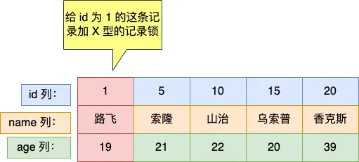

若此时有其他事务尝试对 `id = 1` 的记录进行更新或删除操作，这些操作都将被阻塞。这是因为更新或删除操作也会尝试对该记录添加 X 型的记录锁，而 X 锁与 X 锁之间是互斥的。

例如：

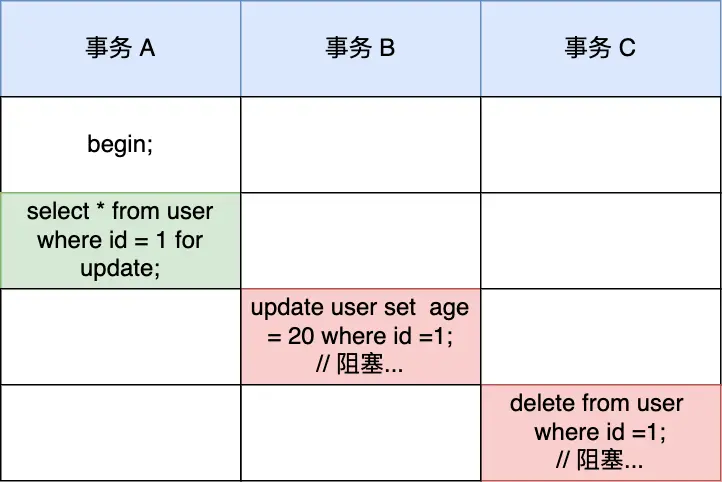

由于事务 A 对 `id = 1` 的记录持有了 X 型记录锁，事务 B 修改 `id=1` 记录的操作和事务 C 删除 `id=1` 记录的操作都会被阻塞。

> 有什么命令可以分析加了什么锁？

我们可以通过执行 `select * from performance_schema.data_locks\G;` 这条语句，来查看当前事务在执行 SQL 过程中具体添加了哪些锁。

以上述事务 A 为例，分析其加锁情况：

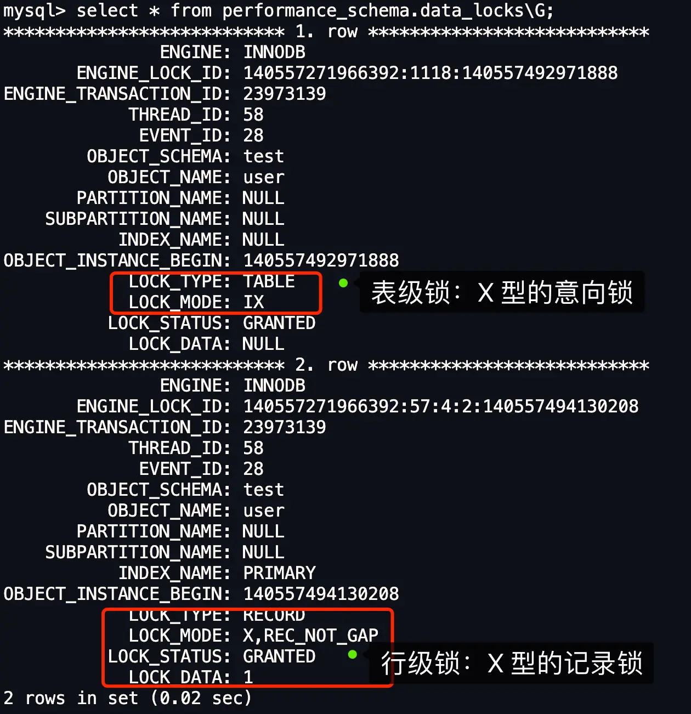

从上图的输出可以看到，事务 A 共添加了两种锁：

- **表锁 (Table Lock)**：类型为 `IX` (Intent Exclusive，意向排他锁)。这是 InnoDB 在对行加锁前，为了协调表级锁和行级锁的关系而自动加的表级锁。
- **行锁 (Row Lock)**：`LOCK_TYPE` 显示为 `RECORD`，表示这是一个行级锁。

我们重点关注行级锁。通过 `LOCK_MODE` 字段可以进一步区分是 next-key 锁、间隙锁还是记录锁：

- 如果 `LOCK_MODE` 为 `X`，通常表示 next-key 锁。
- 如果 `LOCK_MODE` 为 `X, REC_NOT_GAP`，明确表示是记录锁。
- 如果 `LOCK_MODE` 为 `X, GAP`，明确表示是间隙锁。

因此，在这个例子中，**事务 A 在 `id = 1` 这条记录的主键索引上添加的是 X 型记录锁**，锁定的就是 `id = 1` 这一行数据。这使得其他事务无法对该记录进行更新和删除。

从这里也可以看出，**加锁是针对索引进行的**。由于此查询语句通过聚簇索引（即主键索引）进行扫描，因此锁是施加在主键索引上的。对相应记录的主键索引项添加记录锁后，其他事务就不能更新或删除这条记录了。

> 为什么唯一索引等值查询且记录存在的场景下，next-key lock 会退化成记录锁？

核心原因在于，在这种特定场景下，**仅依靠记录锁就足以避免幻读问题**。

幻读的定义是：在一个事务内，前后两次执行相同的查询，结果集却不一致（例如，多出或少了一些行）。要避免幻读，就需要防止在两次查询之间，结果集中的某条记录被其他事务删除，或者有其他事务插入了新的符合查询条件的记录。

- **防止新记录插入**：由于主键具有唯一性约束，任何其他事务尝试插入一条 `id = 1` 的新记录时，都会因为主键冲突而失败。这就保证了事务 A 在多次查询 `id = 1` 的记录时，不会凭空多出一条 `id = 1` 的记录。
- **防止记录被删除/修改**：由于事务 A 对 `id = 1` 的记录添加了记录锁，其他事务无法删除或修改这条记录。这就保证了事务 A 在多次查询 `id = 1` 的记录时，该记录不会消失或被改变。

综上，一个记录锁已经能确保查询 `id=1` 的结果一致性，因此 next-key lock 退化为更轻量级的记录锁是合理的优化。

#### 2、记录不存在的情况

假设事务 A 执行以下等值查询语句，但查询的记录 `id = 2` **不存在**于表中：

```sql
mysql> begin;
Query OK, 0 rows affected (0.00 sec)

mysql> select * from user where id = 2 for update;
Empty set (0.03 sec)
```

接下来，通过 `select * from performance_schema.data_locks\G;` 查看加锁情况：

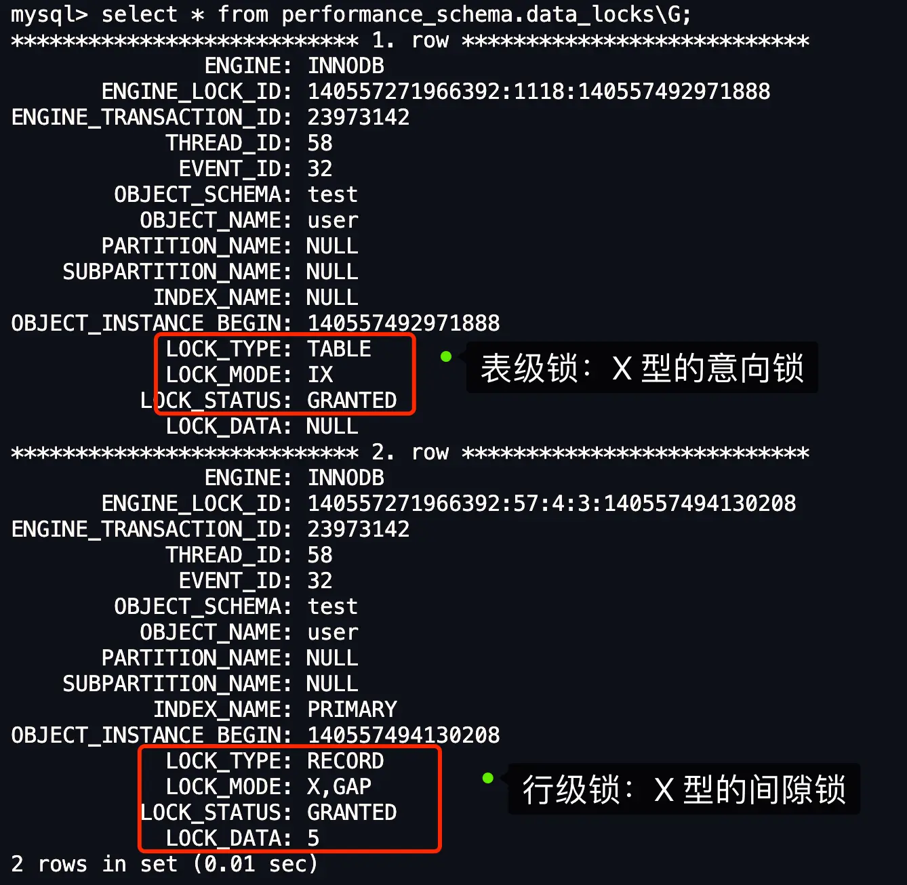

从上图可以看到，行锁的 `LOCK_MODE` 为 `X, GAP`，表示添加了 X 型的间隙锁。

具体分析：
MySQL 在主键索引上查找 `id = 2` 的记录。由于 `id = 2` 不存在，它会找到第一个大于 2 的记录，即 `id = 5`。然后，在 `id = 5` 这条记录对应的主键索引项上添加一个间隙锁。这个间隙锁覆盖的范围是表中 `id = 5` 之前的记录 `id = 1` 到 `id = 5` 之间的间隙，即 `(1, 5)`。

因此，**事务 A 在主键索引上添加了一个覆盖范围 `(1, 5)` 的 X 型间隙锁。**

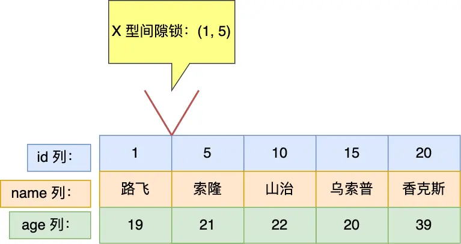

这个间隙锁意味着，其他事务将无法插入 `id` 值为 2、3、4 的新记录，因为这些值都落在了 `(1, 5)` 这个间隙内。

注意：如果其他事务尝试插入 `id = 1` 或 `id = 5` 的记录，它们不会被这个间隙锁阻塞，而是会因为主键冲突（表中已存在这些记录）而报错。

例如：

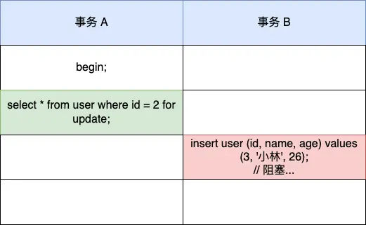

由于事务 A 持有范围为 `(1, 5)` 的 X 型间隙锁，事务 B 尝试插入 `id = 3` 的记录时，其操作会被阻塞。

> 这个间隙锁的范围 `(1, 5)` 是如何确定的？

根据 `performance_schema.data_locks` 的输出，如果 `LOCK_MODE` 是 next-key 锁或间隙锁，`LOCK_DATA` 字段通常表示锁范围的"右边界"。在此次事务 A 的例子中，`LOCK_DATA` 是 5。
然后，锁范围的"左边界"是表中 `id` 为 5 的记录的前一条记录的 `id` 值，即 1。
因此，间隙锁的范围确定为 `(1, 5)`。

> 为什么唯一索引等值查询且记录「不存在」的场景下，next-key lock 会退化成「间隙锁」？

原因同样是为了在避免幻读的前提下，使用尽可能小的锁范围。

- **为什么不是 next-key lock？** 如果对 `id = 5` 的索引项加 next-key lock `(1, 5]`，这意味着其他事务无法删除或修改 `id = 5` 这条记录。但我们查询的是 `id = 2`，只要保证前后两次查询 `id = 2` 的结果集相同（即没有新的 `id = 2` 插入），就能避免幻读。`id = 5` 是否被删除对查询 `id = 2` 的结果没有影响。因此，没有必要锁定 `id = 5` 本身，一个覆盖 `(1, 5)` 的间隙锁足以阻止 `id = 2, 3, 4` 的插入。
- **为什么不是记录锁？** 锁是施加在索引项上的。由于查询的记录 `id = 2` 本身并不存在于索引中，自然无法对一个不存在的记录施加记录锁。

因此，退化为间隙锁 `(1, 5)` 是最合适的选择。

### 唯一索引范围查询

唯一索引的范围查询与等值查询的加锁规则有所不同。

当使用唯一索引进行范围查询时，**MySQL 会对扫描到的每一个索引项（满足条件的记录以及扫描过程中遇到的用于界定范围的记录）尝试添加 next-key 锁。然后，根据具体情况，这些 next-key 锁可能会退化成记录锁或间隙锁**：

- 情况一：对于 **「大于等于 (>=)」** 的范围查询，由于其中包含了等值查询的条件，如果等值部分（例如 `id = X` in `id >= X`）的记录**存在**于表中，那么施加在该记录索引项上的 next-key 锁会**退化成记录锁**。对于范围覆盖的其他记录，则仍可能是 next-key 锁。
- 情况二：对于 **「小于 (<) 或小于等于 (<=)」** 的范围查询，处理方式取决于条件值的记录是否存在于表中：
  - 当条件值的记录**不存在**于表中时（例如 `id < 6` 或 `id <= 6`，而表中没有 `id = 6` 的记录），无论是「小于」还是「小于等于」的查询，当扫描到第一个不满足范围条件（即大于或等于条件值）的记录时（作为范围的终止点），施加在该终止记录索引项上的 next-key 锁会**退化成间隙锁**。其他被扫描到的满足条件的记录，其索引项上通常加的是 next-key 锁。
  - 当条件值的记录**存在**于表中时（例如 `id < 5` 或 `id <= 5`，且表中有 `id = 5` 的记录）：
    - 如果是「小于 (<)」条件的范围查询（如 `id < 5`），当扫描到条件值的记录（即 `id = 5`，它是第一个不满足 `id < 5` 的记录）时，施加在该记录索引项上的 next-key 锁会**退化成间隙锁**。其他被扫描到的满足条件的记录，其索引项上通常加的是 next-key 锁。
    - 如果是「小于等于 (<=)」条件的范围查询（如 `id <= 5`），当扫描到条件值的记录（即 `id = 5`，它是满足条件的最后一条记录）时，施加在该记录索引项上的 next-key 锁通常**不会退化**。其他被扫描到的满足条件的记录，其索引项上通常加的也是 next-key 锁。

接下来，通过几个实验来验证上述结论。

#### 1、针对「大于或者大于等于」的范围查询

> 实验一：针对「大于 (>)」的范围查询。

假设事务 A 执行以下范围查询语句：

```sql
mysql> begin;
Query OK, 0 rows affected (0.00 sec)

mysql> select * from user where id > 15 for update;
+----+-----------+-----+
| id | name      | age |
+----+-----------+-----+
| 20 | 香克斯    |  39 |
+----+-----------+-----+
1 row in set (0.01 sec)
```

事务 A 的加锁过程分析如下：

1.  扫描到的第一条满足 `id > 15` 的记录是 `id = 20`。由于这是一个严格大于的查询，不是等值查询，因此在 `id = 20` 这条记录的主键索引项上添加的是一个 next-key 锁，其覆盖范围是 `(15, 20]`（左边界是表中 `id=20` 之前的记录 `id=15`）。
2.  由于是范围查询，MySQL 会继续向后扫描，以确定范围的上限。即使 `id = 20` 是表中的最后一条用户记录，InnoDB 内部还有一个特殊的"supremum pseudo-record"来标识索引的末尾。当扫描到这个 supremum 记录时，会为它添加一个 next-key 锁，覆盖范围是 `(20, +∞]`。
3.  扫描结束。

因此，事务 A 在主键索引上添加了两个 X 型的 next-key 锁：

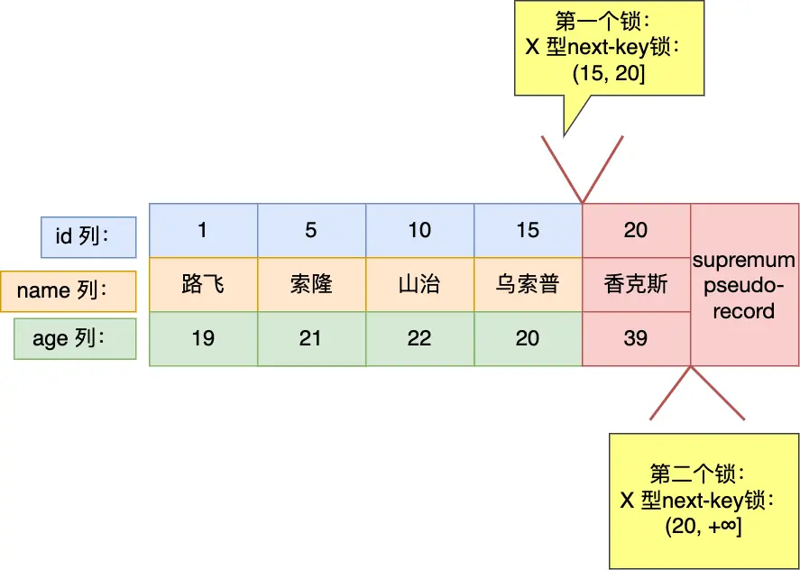

- 在 `id = 20` 记录的主键索引项上，施加了范围为 `(15, 20]` 的 next-key 锁。这意味着其他事务既无法更新或删除 `id = 20` 的记录，也无法插入 `id` 值为 16、17、18、19 的新记录。
- 在 supremum pseudo-record 的主键索引项上，施加了范围为 `(20, +∞]` 的 next-key 锁。这意味着其他事务无法插入 `id` 值大于 20 的新记录。

通过 `select * from performance_schema.data_locks\G;` 确认加锁情况（仅截取行级锁部分）：

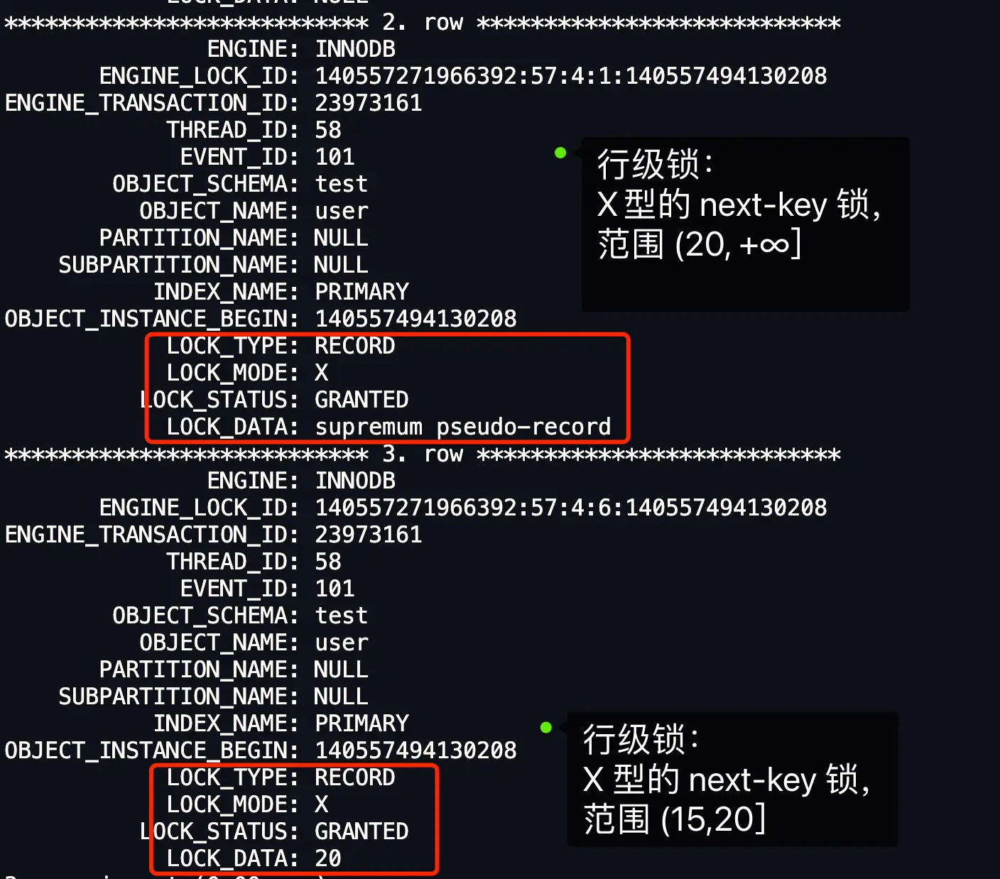

从上图分析，`LOCK_MODE` 均为 `X`，表示 next-key 锁。

- `LOCK_DATA: 20` 对应 `(15, 20]` 的 next-key 锁。
- `LOCK_DATA: supremum pseudo-record` 对应 `(20, +∞]` 的 next-key 锁。
  这与我们的分析一致。

> 实验二：针对「大于等于 (>=)」的范围查询。

假设事务 A 执行以下范围查询语句：

```sql
mysql> begin;
Query OK, 0 rows affected (0.00 sec)

mysql> select * from user where id >= 15 for update;
+----+-----------+-----+
| id | name      | age |
+----+-----------+-----+
| 15 | 乌索普    |  20 |
| 20 | 香克斯    |  39 |
+----+-----------+-----+
2 rows in set (0.00 sec)
```

事务 A 的加锁过程分析如下：

1.  首先处理 `id = 15` 的部分（等值条件）。由于记录 `id = 15` 存在，施加在该记录主键索引项上的 next-key 锁会**退化为记录锁**，仅锁定 `id = 15` 这一行。
2.  继续范围查找，扫描到下一条记录 `id = 20`。在 `id = 20` 的主键索引项上添加 next-key 锁，范围是 `(15, 20]`。
3.  继续向后扫描到 supremum pseudo-record，为其添加 next-key 锁，范围是 `(20, +∞]`。
4.  扫描结束。

事务 A 在主键索引上添加了三个 X 型的锁：

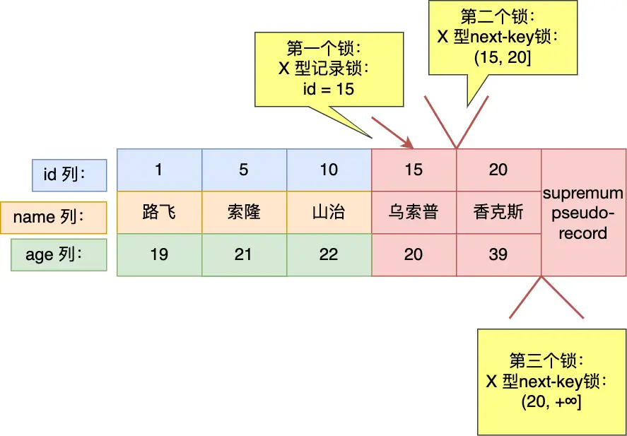

- 在 `id = 15` 记录的主键索引项上，施加了记录锁，锁定 `id = 15`。
- 在 `id = 20` 记录的主键索引项上，施加了范围为 `(15, 20]` 的 next-key 锁。
- 在 supremum pseudo-record 的主键索引项上，施加了范围为 `(20, +∞]` 的 next-key 锁。

通过 `select * from performance_schema.data_locks\G;` 确认加锁情况：

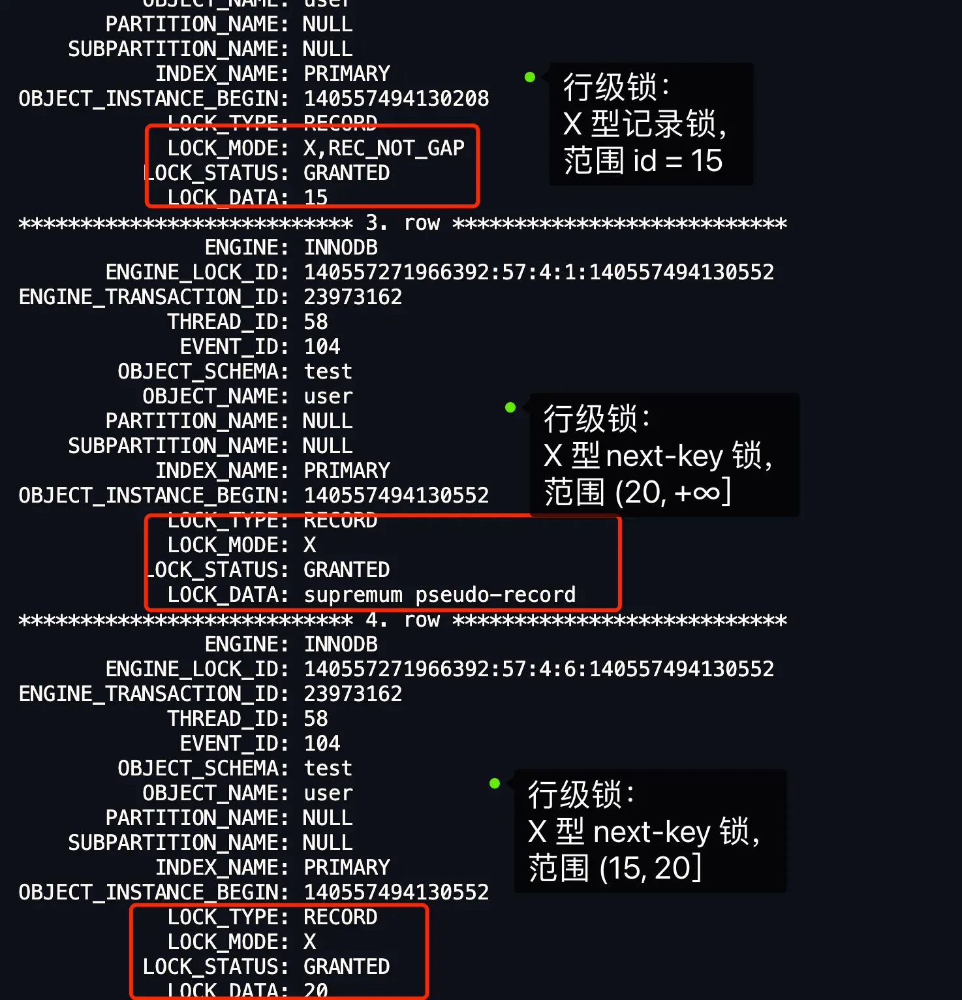

分析上图：

- `LOCK_DATA: 15`, `LOCK_MODE: X, REC_NOT_GAP` 表示对 `id = 15` 加了记录锁。
- `LOCK_DATA: 20`, `LOCK_MODE: X` 表示对 `id = 20` 加了 `(15, 20]` 的 next-key 锁。
- `LOCK_DATA: supremum pseudo-record`, `LOCK_MODE: X` 表示加了 `(20, +∞]` 的 next-key 锁。
  这与我们的分析一致，并验证了：在「大于等于」条件的唯一索引范围查询中，若条件值的记录存在，其索引项上的 next-key 锁会退化为记录锁。

#### 2、针对「小于或者小于等于」的范围查询

> 实验一：针对「小于 (<)」的范围查询，且查询条件值的记录「不存在」于表中。

假设事务 A 执行以下范围查询语句，注意条件值 `id = 6` 的记录并**不存在**于表中：

```sql
mysql> begin;
Query OK, 0 rows affected (0.00 sec)

mysql> select * from user where id < 6 for update;
+----+--------+-----+
| id | name   | age |
+----+--------+-----+
|  1 | 路飞   |  19 |
|  5 | 索隆   |  21 |
+----+--------+-----+
2 rows in set (0.00 sec)  -- 返回的记录是 id=1 和 id=5
```

事务 A 的加锁过程分析如下：

1.  扫描到的第一条满足 `id < 6` 的记录是 `id = 1`。在其主键索引项上添加 next-key 锁，范围是 `(-∞, 1]` (这里的 `-∞` 表示索引的起始)。
2.  继续范围查找，扫描到下一条满足 `id < 6` 的记录是 `id = 5`。在其主键索引项上添加 next-key 锁，范围是 `(1, 5]`。
3.  继续扫描，下一条记录是 `id = 10`。这条记录不满足 `id < 6` 的条件，它是第一个不满足条件的记录，因此作为扫描的终止点。施加在 `id = 10` 这条记录主键索引项上的 next-key 锁会**退化成间隙锁**，覆盖的范围是 `(5, 10)`。
4.  由于找到了不满足条件的记录，扫描停止。

事务 A 在主键索引上添加了三个 X 型的锁：

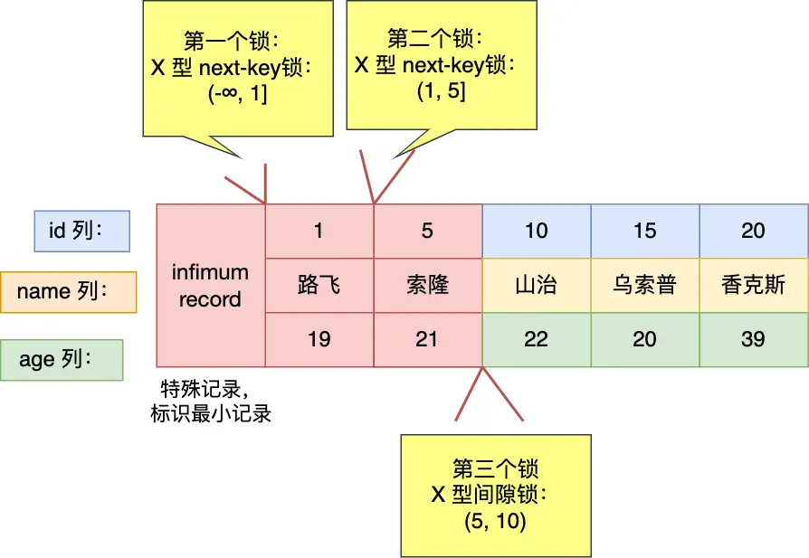

- 在 `id = 1` 记录的主键索引项上，施加了范围为 `(-∞, 1]` 的 next-key 锁。
- 在 `id = 5` 记录的主键索引项上，施加了范围为 `(1, 5]` 的 next-key 锁。
- 在 `id = 10` 记录的主键索引项上，施加了范围为 `(5, 10)` 的间隙锁。这个间隙锁会阻止插入 `id` 值为 6, 7, 8, 9 的新记录。

通过 `select * from performance_schema.data_locks\G;` 确认加锁情况：

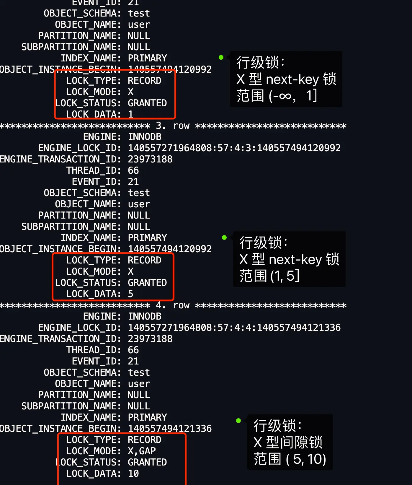

分析上图：

- `LOCK_DATA: 1`, `LOCK_MODE: X` 对应 `(-∞, 1]` 的 next-key 锁。
- `LOCK_DATA: 5`, `LOCK_MODE: X` 对应 `(1, 5]` 的 next-key 锁。
- `LOCK_DATA: 10`, `LOCK_MODE: X, GAP` 对应 `(5, 10)` 的间隙锁。
  这与我们的分析一致。

值得注意的是，如果此实验中的查询条件改为 `id <= 6`（而 `id=6` 仍然不存在），其加锁行为与 `id < 6` 的情况是相同的，因为扫描的终止点依然是 `id=10`，并且在其上加间隙锁 `(5,10)`。

因此，可以得出结论：**针对「小于或小于等于」的唯一索引范围查询，若条件值的记录不存在于表中，当扫描到终止范围查询的记录（即第一个不满足条件的记录）时，施加在该记录索引项上的 next-key 锁会退化成间隙锁。其他被扫描到的满足条件的记录，其索引项上加的是 next-key 锁。**

> 实验二：针对「小于等于 (<=)」的范围查询，且查询条件值的记录「存在」于表中。

假设事务 A 执行以下范围查询语句，注意条件值 `id = 5` 的记录**存在**于表中：

```sql
mysql> begin;
Query OK, 0 rows affected (0.00 sec)

mysql> select * from user where id <= 5 for update;
+----+--------+-----+
| id | name   | age |
+----+--------+-----+
|  1 | 路飞   |  19 |
|  5 | 索隆   |  21 |
+----+--------+-----+
2 rows in set (0.00 sec)
```

事务 A 的加锁过程分析如下：

1.  扫描到的第一条记录是 `id = 1`。在其主键索引项上添加 next-key 锁，范围为 `(-∞, 1]`。
2.  继续范围查找，扫描到下一条记录是 `id = 5`。这条记录满足 `id <= 5`，并且是条件值的记录。在其主键索引项上添加 next-key 锁，范围为 `(1, 5]`。由于这是满足条件的最后一条记录（根据主键唯一性），扫描在此基本结束。
3.  扫描停止。

事务 A 在主键索引上添加了两个 X 型的 next-key 锁：

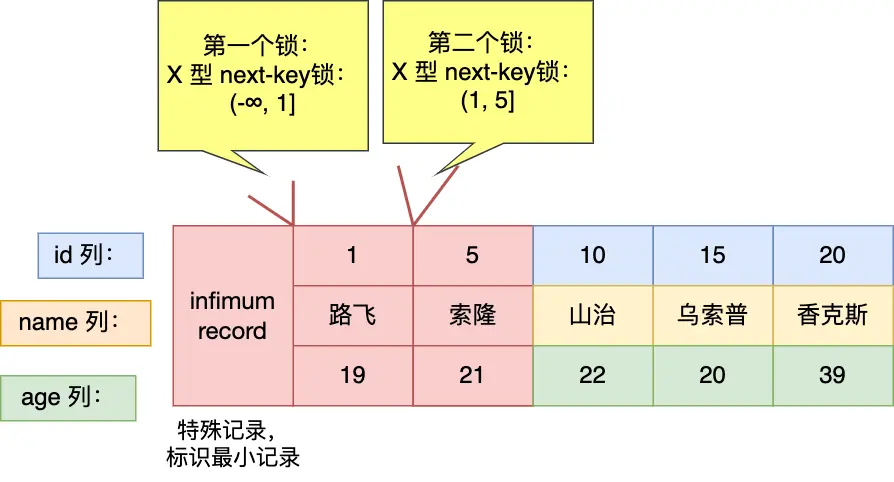

- 在 `id = 1` 记录的主键索引项上，施加了范围为 `(-∞, 1]` 的 next-key 锁。
- 在 `id = 5` 记录的主键索引项上，施加了范围为 `(1, 5]` 的 next-key 锁。

通过 `select * from performance_schema.data_locks\G;` 确认加锁情况：

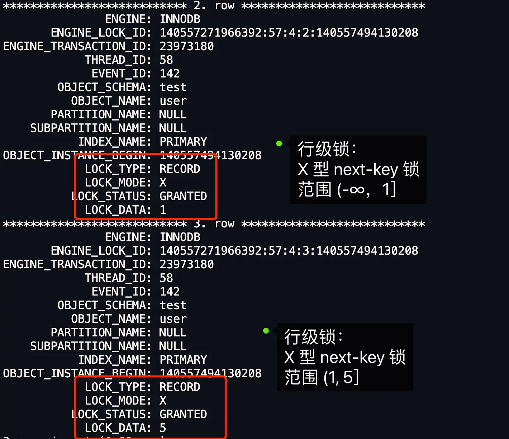

分析上图，两个锁的 `LOCK_MODE` 均为 `X`，与我们的分析一致。这里 `id = 5` 上的 next-key 锁没有退化。

> 实验三：针对「小于 (<)」的范围查询，且查询条件值的记录「存在」于表中。

假设事务 A 执行以下查询，条件值 `id = 5` 的记录**存在**于表中：

```sql
mysql> begin;
Query OK, 0 rows affected (0.00 sec)

mysql> select * from user where id < 5 for update;
+----+--------+-----+
| id | name   | age |
+----+--------+-----+
|  1 | 路飞   |  19 |
+----+--------+-----+
1 row in set (0.00 sec)
```

事务 A 的加锁过程分析如下：

1.  扫描到的第一条满足 `id < 5` 的记录是 `id = 1`。在其主键索引项上添加 next-key 锁，范围为 `(-∞, 1]`。
2.  继续范围查找，扫描到下一条记录是 `id = 5`。这条记录是第一个不满足 `id < 5` 条件的记录（即它等于条件值）。施加在该记录主键索引项上的 next-key 锁会**退化为间隙锁**，锁范围是 `(1, 5)`。
3.  由于找到了不满足条件的记录，扫描停止。

事务 A 在主键索引上添加了两种 X 型锁：

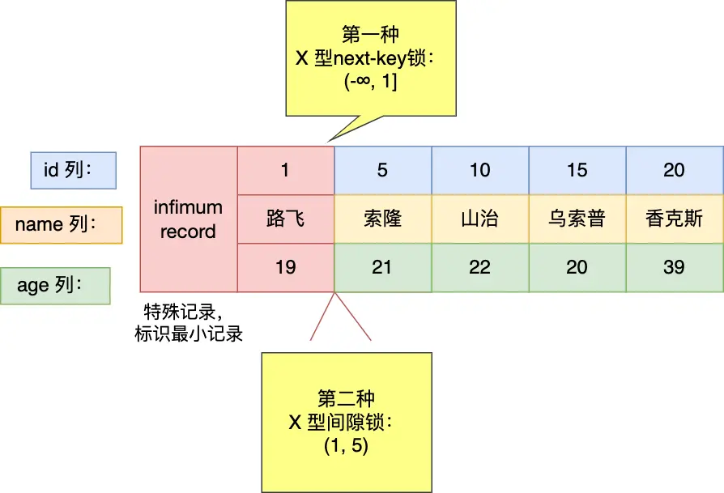

- 在 `id = 1` 记录的主键索引项上，施加了范围为 `(-∞, 1]` 的 next-key 锁。
- 在 `id = 5` 记录的主键索引项上，施加了范围为 `(1, 5)` 的间隙锁。这个间隙锁会阻止插入 `id` 值为 2, 3, 4 的新记录。

通过 `select * from performance_schema.data_locks\G;` 确认加锁情况：

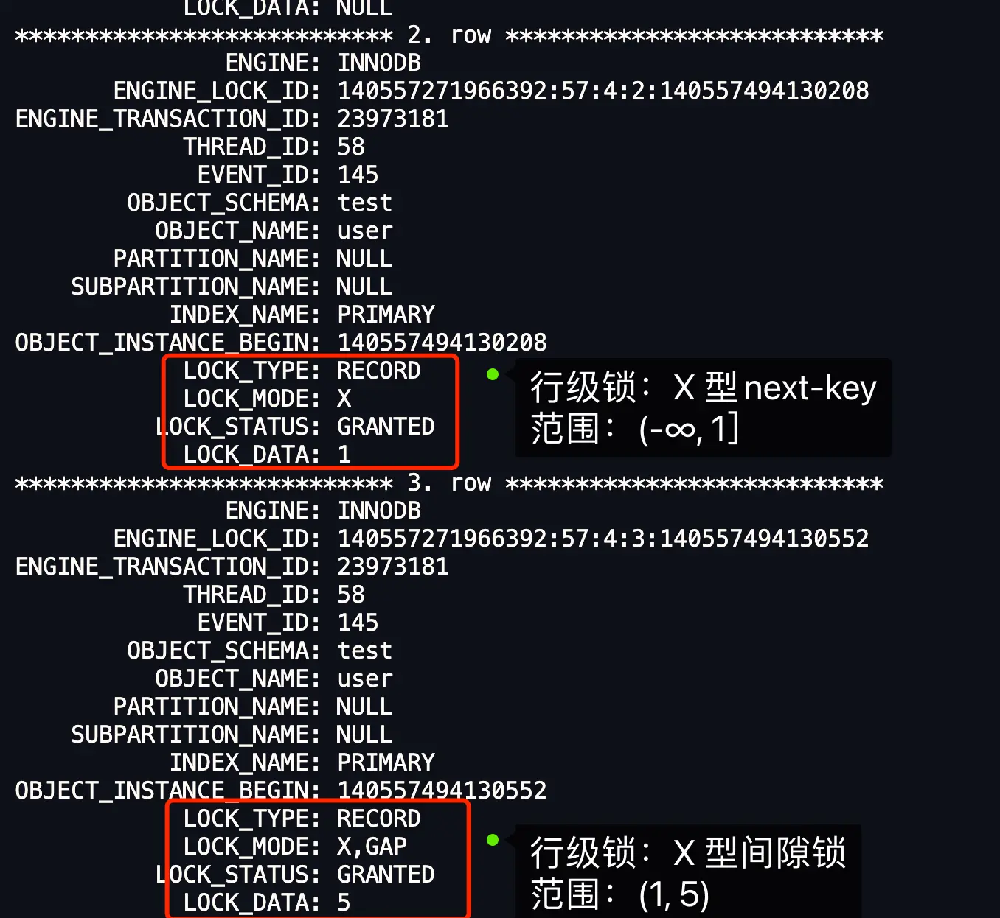

分析上图：

- `LOCK_DATA: 1`, `LOCK_MODE: X` 对应 `(-∞, 1]` 的 next-key 锁。
- `LOCK_DATA: 5`, `LOCK_MODE: X, GAP` 对应 `(1, 5)` 的间隙锁。
  这与我们的分析一致。

综合这三个实验，我们可以总结出「小于或小于等于」的唯一索引范围查询的退化规则：

- 当条件值的记录**不存在**于表中时：无论是「小于」还是「小于等于」查询，扫描到终止范围的记录（第一个不满足条件的记录）时，其索引项上的 next-key 锁会**退化成间隙锁**。
- 当条件值的记录**存在**于表中时：
  - 如果是「小于 (<)」查询，扫描到终止范围的记录（即条件值本身）时，其索引项上的 next-key 锁会**退化成间隙锁**。
  - 如果是「小于等于 (<=)」查询，扫描到终止范围的记录（即条件值本身，也是满足条件的最后一条记录）时，其索引项上的 next-key 锁**通常不会退化**。

其他被扫描到的、满足查询条件的记录，其索引项上通常施加的是 next-key 锁。

### 非唯一索引等值查询

当使用非唯一索引（二级索引）进行等值查询时，情况更为复杂，因为这通常涉及到对两个索引的加锁操作：**一个是二级索引本身，另一个是与满足条件的二级索引条目对应的主键索引**。对主键索引加锁时，通常只针对那些满足查询条件的记录的主键。

针对非唯一索引等值查询，根据查询的记录是否存在，加锁规则也有所不同：

- 当查询的记录**「存在」**时：由于是非唯一索引，可能存在多个索引值相同的记录。查询过程会扫描二级索引，直到找到第一个不符合条件的二级索引记录才停止。
  - **在二级索引上**：对于扫描到的、满足查询条件的二级索引记录，会添加 **next-key 锁**。对于扫描过程中遇到的第一个不符合查询条件的二级索引记录，其上的 next-key 锁会**退化成间隙锁**。
  - **在主键索引上**：对于那些通过二级索引找到的、符合查询条件的记录，会在它们对应的主键索引项上添加**记录锁**。
- 当查询的记录**「不存在」**时：
  - **在二级索引上**：扫描到第一个不符合条件的（即大于查询值的）二级索引记录，其上的 next-key 锁会**退化成间隙锁**。
  - **在主键索引上**：由于没有找到满足查询条件的记录，所以不会对主键索引加锁。

接下来通过两个实验进行说明。

#### 1、记录不存在的情况

> 实验一：针对非唯一索引等值查询，查询的值不存在的情况。

我们先分析非唯一索引等值查询时，记录不存在的情况，这相对简单一些。
假设事务 A 对非唯一索引 `age` 进行等值查询，且表中不存在 `age = 25` 的记录。

```sql
mysql> begin;
Query OK, 0 rows affected (0.00 sec)

mysql> select * from user where age = 25 for update;
Empty set (0.00 sec)
```

事务 A 的加锁过程分析如下：

- 在二级索引 `index_age` 上查找 `age = 25`。由于不存在，会定位到第一个大于 25 的 `age` 值，即 `age = 39`（对应记录 `id=20, name='香克斯', age=39`）。
- 施加在 `age = 39` 这条二级索引记录上的 next-key 锁会**退化成间隙锁**。这个间隙锁的范围是 `(22, 39)`，其中 22 是 `age=39` 之前的一个 `age` 值（来自 `id=10, name='山治', age=22`）。
- 查询结束。

因此，事务 A 在 `age = 39` (具体是 `id=20, age=39` 这条记录) 的二级索引项上，添加了一个 X 型的间隙锁，范围是 `(22, 39)`。这个锁意味着其他事务无法插入 `age` 值为 23、24、25、...、38 的新记录。
（关于插入 `age = 22` 或 `age = 39` 的情况，会更复杂，稍后讨论。）

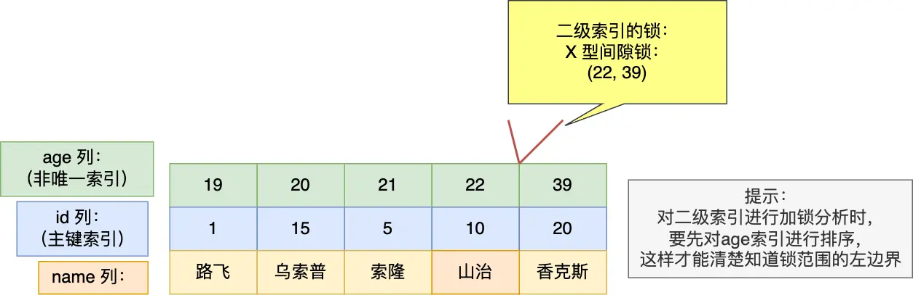

通过 `select * from performance_schema.data_locks\G;` 确认加锁情况（仅截取行级锁部分）：

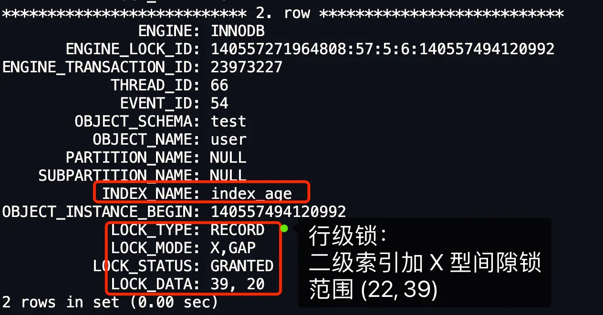

从上图分析，`INDEX_NAME: index_age`，`LOCK_MODE: X, GAP`，`LOCK_DATA` 显示 `39, 20`。
这表明在二级索引 `index_age` 上，针对 `age = 39` (其主键 `id = 20`) 的索引项，施加了一个间隙锁。其 `age` 值的范围是 `(22, 39)`。

此时，若其他事务尝试插入 `age` 值为 23 到 38 之间的新记录，这些插入操作都会被阻塞。
但对于插入 `age = 22` 或 `age = 39` 的记录，情况会更复杂，取决于插入记录的主键值。

> 当一个事务持有二级索引的间隙锁 `(22, 39)` (基于 age 值) 时，其他事务插入 `age = 22` 或 `age = 39` 的记录能否成功？

要理解这一点，首先要知道：**插入操作在尝试插入一条新记录前，会先在 B+树（此处指二级索引树）中定位其插入位置。如果该插入位置的"下一条"记录的索引项上存在间隙锁（或 next-key 锁的间隙部分）覆盖了这个插入点，则插入会被阻塞。**

二级索引树的记录是先按二级索引值（`age`）排序，如果二级索引值相同，则再按主键值（`id`）排序。

基于前面的实验，事务 A 在 `(id=20, age=39)` 这条记录的二级索引项上，施加了 `age` 范围为 `(22, 39)` 的间隙锁。

- **尝试插入 `age = 22` 的记录**：

  - 若其他事务插入 `(id=3, age=22)`：在二级索引树中，这条记录会排在 `(id=10, age=22)` 之前。其插入位置的下一条记录是 `(id=10, age=22)`。由于 `(id=10, age=22)` 的二级索引项上没有被事务 A 的间隙锁覆盖（事务 A 的间隙锁与 `age=22` 的记录不直接相关），**此插入通常可以成功**（假设没有其他锁）。
  - 若其他事务插入 `(id=12, age=22)`：在二级索引树中，这条记录会排在 `(id=10, age=22)` 之后，但在 `(id=20, age=39)` 之前。其插入位置的下一条记录是 `(id=20, age=39)`。由于 `(id=20, age=39)` 的二级索引项上正好有事务 A 施加的间隙锁 `(22, 39)`，**此插入会被阻塞**。

- **尝试插入 `age = 39` 的记录**：
  - 若其他事务插入 `(id=3, age=39)`：在二级索引树中，这条记录会排在 `(id=20, age=39)` 之前。其插入位置的下一条记录是 `(id=20, age=39)`。由于 `(id=20, age=39)` 的二级索引项上有间隙锁，**此插入会被阻塞**。
  - 若其他事务插入 `(id=21, age=39)`：在二级索引树中，这条记录会排在 `(id=20, age=39)` 之后。其插入位置的下一条记录可能是 supremum pseudo-record（如果 `id=21, age=39` 是最大的）。如果下一条记录没有被间隙锁覆盖，**此插入可以成功**。

所以，**当一个事务持有二级索引的间隙锁 (如 `age` 范围 `(22, 39)`) 时，能否成功插入边界值 (`age=22` 或 `age=39`) 的新记录，关键在于新记录的主键值如何决定其在二级索引中的精确位置，以及该精确位置的下一条记录是否被间隙锁覆盖。**

现在回头看 `performance_schema.data_locks` 的输出：`LOCK_DATA: 39, 20`
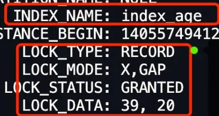

- `LOCK_DATA` 的第一个值 `39` 代表 `age` 值，它是间隙锁或 next-key 锁范围的右边界（对于二级索引）。
- `LOCK_DATA` 的第二个值 `20` 代表与 `age=39` 关联的记录的 `id` 值。

这个 `LOCK_DATA: 39, 20` 结合 `LOCK_MODE: X, GAP` 更准确地解释了：事务 A 在 `(id=20, age=39)` 这条记录的二级索引项上，施加了 `age` 值范围为 `(22, 39)` 的 X 型间隙锁。并且，**这个 `id=20` 暗示了：如果其他事务尝试插入 `age = 39` 的新记录，那么当新记录的 `id` 值小于 `20` 时，插入会被阻塞；如果新记录的 `id` 值大于或等于 `20`，则可能成功（取决于其精确的下一条记录是否有锁）。**

对于插入 `age = 22` 的情况，`performance_schema.data_locks` 的输出本身不能直接分析出哪些 `id` 值可以插入。这需要我们自己根据二级索引的 B+树结构，确定插入位置，然后判断其下一条记录是否有间隙锁。

#### 2、记录存在的情况

> 实验二：针对非唯一索引等值查询，查询的值存在的情况。

假设事务 A 对非唯一索引 `age` 进行等值查询，且表中存在 `age = 22` 的记录（即 `id=10, name='山治', age=22`）。

```sql
mysql> begin;
Query OK, 0 rows affected (0.00 sec)

mysql> select * from user where age = 22 for update;
+----+--------+-----+
| id | name   | age |
+----+--------+-----+
| 10 | 山治   |  22 |
+----+--------+-----+
1 row in set (0.00 sec)
```

事务 A 的加锁过程分析如下：

1.  **二级索引 `index_age` 上的操作**：
    - 由于是非唯一索引，即使找到 `age = 22` 的记录，仍需继续扫描以查找其他可能的 `age = 22` 的记录（按主键 `id` 排序）。
    - 扫描到 `(id=10, age=22)`。这是满足条件的记录。在其二级索引项上添加 **next-key 锁**。该锁的范围，根据前一个 `age` 值 21 (来自 `id=5, age=21`)，应该是 `(21, 22]` (基于 age 值，并包含 `id=10`)。
    - 继续扫描，下一条二级索引记录是 `(id=20, age=39)`。这条记录不符合 `age = 22` 的条件，是第一个不符合条件的记录。因此，施加在 `(id=20, age=39)` 这条二级索引记录上的 next-key 锁会**退化成间隙锁**，`age` 范围是 `(22, 39)`。
2.  **主键索引上的操作**：
    - 对于通过二级索引找到的、符合查询条件的记录 `(id=10, age=22)`，会在其对应的主键索引项（即 `id = 10`）上添加 **X 型记录锁**。
3.  扫描结束。

总结事务 A 添加的 X 型锁：

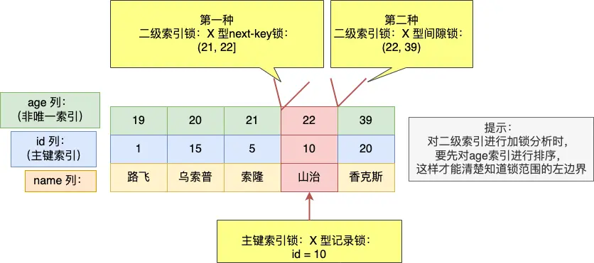

- **主键索引 (`PRIMARY`)**：
  - 在 `id = 10` 的记录上，添加了记录锁。
- **二级索引 (`index_age`)**：
  - 在 `(id=10, age=22)` 的二级索引项上，添加了 `age` 范围为 `(21, 22]` 的 next-key 锁。
  - 在 `(id=20, age=39)` 的二级索引项上，添加了 `age` 范围为 `(22, 39)` 的间隙锁。

通过 `select * from performance_schema.data_locks\G;` 确认加锁情况：

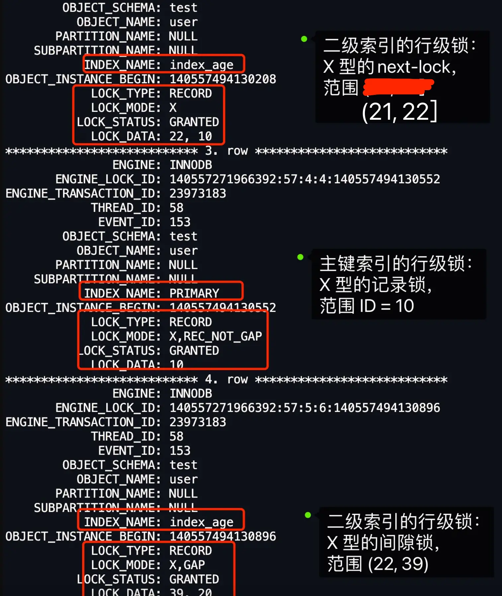

分析上图：

- **二级索引 (`INDEX_NAME: index_age`)**：

  - `LOCK_DATA: 22, 10`, `LOCK_MODE: X`：对应 `(id=10, age=22)` 上的 next-key 锁，`age` 范围 `(21, 22]`。
    - 这意味着其他事务不能轻易更新或删除 `age=22` 且 `id=10` 的记录。
    - 对于插入新的 `age=21` 或 `age=22` 的记录：
      - 插入 `age=21`：若新记录 `id < 5` (`(id=5,age=21)`是表中已存在的 age=21 的记录)，可能成功。若新记录 `id > 5`，其下一条可能是 `(id=10,age=22)` (被 next-key 锁覆盖) 或 `(id=20,age=39)` (被间隙锁覆盖)，导致阻塞。
      - 插入 `age=22`：从 `LOCK_DATA: 22, 10` 可知，若新记录 `id < 10`，会被此 next-key 锁阻塞。若新记录 `id > 10`，其下一条可能是 `(id=20,age=39)` (被间隙锁覆盖)，也会被阻塞。
  - `LOCK_DATA: 39, 20`, `LOCK_MODE: X, GAP`：对应 `(id=20, age=39)` 上的间隙锁，`age` 范围 `(22, 39)`。
    - 这意味着其他事务无法插入 `age` 值为 23 到 38 的记录。
    - 对于插入新的 `age=22` 或 `age=39` 的记录：
      - 插入 `age=22`：若新记录 `id < 10`，会被前一个 next-key 锁阻塞。若新记录 `id > 10`，其下一条可能是 `(id=20,age=39)` (被此间隙锁覆盖)，也会被阻塞。因此，实际上很难插入新的 `age=22` 记录。
      - 插入 `age=39`：从 `LOCK_DATA: 39, 20` 可知，若新记录 `id < 20`，会被此间隙锁阻塞。若 `id >= 20`，可能成功。

- **主键索引 (`INDEX_NAME: PRIMARY`)**：
  - `LOCK_DATA: 10`, `LOCK_MODE: X, REC_NOT_GAP`：对 `id = 10` 添加了记录锁。

> 为什么在这个实验案例中，需要在二级索引上添加 `age` 范围 `(22, 39)` 的间隙锁？

核心原因仍然是为了**避免幻读现象**。

考虑查询语句 `select * from user where age = 22 for update;`

如果事务 A 在二级索引上只对 `(id=10, age=22)` 添加 `age` 范围 `(21, 22]` 的 next-key 锁，而不添加后续的 `(22, 39)` 间隙锁，那么幻读是有可能发生的。

如前所述，`age` 范围 `(21, 22]` 的 next-key 锁（作用于 `(id=10, age=22)`）并不能完全阻止其他事务插入新的 `age = 22` 的记录。例如，其他事务理论上可以尝试插入 `(id=12, age=22)`。如果这个插入成功了，那么事务 A 再次执行 `select * from user where age = 22 for update;` 时，就会发现多了一条记录，产生了幻读。

**当在 `(id=20, age=39)` 的二级索引项上添加了 `age` 范围 `(22, 39)` 的间隙锁后，其他事务尝试插入 `(id=12, age=22)` 时，其在二级索引树上的插入位置的下一条记录将是 `(id=20, age=39)`。由于该记录的二级索引项上有这个间隙锁，插入操作就会被阻塞。这样就有效地避免了幻读。**

因此，这个额外的间隙锁是防止在 `age=22` 条件下出现幻读的关键。

### 非唯一索引范围查询

非唯一索引的范围查询与主键索引（唯一索引）的范围查询在加锁行为上有一个显著区别：**对于非唯一索引的范围查询，其在二级索引上添加的 next-key lock 通常不会发生退化为纯间隙锁或纯记录锁的情况。** 也就是说，扫描到的二级索引记录通常都会被施加 next-key 锁。

我们来分析一个例子，事务 A 执行以下范围查询语句：

```sql
mysql> begin;
Query OK, 0 rows affected (0.00 sec)

mysql> select * from user where age >= 22 for update;
+----+-----------+-----+
| id | name      | age |
+----+-----------+-----+
| 10 | 山治      |  22 |
| 20 | 香克斯    |  39 |
+----+-----------+-----+
2 rows in set (0.01 sec)
```

事务 A 的加锁过程分析如下：

1.  **二级索引 `index_age` 上的操作**：
    - 扫描到的第一条满足 `age >= 22` 的二级索引记录是 `(id=10, age=22)`。虽然范围查询包含了等值条件 (`age = 22`)，但因为这是非唯一索引，所以通常不会发生像唯一索引那样的锁退化。因此，在 `(id=10, age=22)` 的二级索引项上添加 **next-key 锁**，`age` 范围是 `(21, 22]`。
    - 继续范围扫描，下一条满足条件的二级索引记录是 `(id=20, age=39)`。在其二级索引项上添加 **next-key 锁**，`age` 范围是 `(22, 39]`。
    - 继续向后扫描到二级索引的 supremum pseudo-record，为其添加 **next-key 锁**，`age` 范围是 `(39, +∞]`。
2.  **主键索引上的操作**：
    - 对于通过二级索引找到的、符合查询条件的记录 `(id=10, age=22)`，在其主键索引项 (`id=10`) 上添加 **X 型记录锁**。
    - 对于记录 `(id=20, age=39)`，在其主键索引项 (`id=20`) 上添加 **X 型记录锁**。
3.  扫描结束。

总结事务 A 添加的 X 型锁：

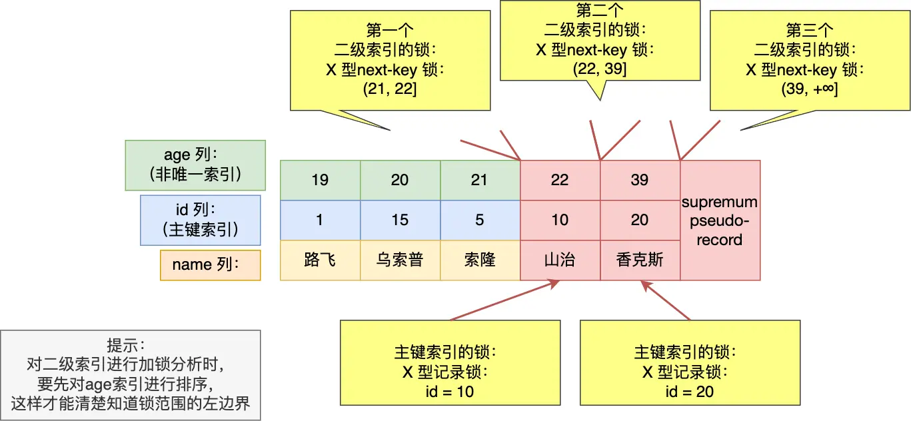

- **主键索引 (`id` 列)**：
  - 在 `id = 10` 的记录上，添加记录锁。
  - 在 `id = 20` 的记录上，添加记录锁。
- **二级索引 (`age` 列)**：
  - 在 `(id=10, age=22)` 的二级索引项上，添加了 `age` 范围 `(21, 22]` 的 next-key 锁。
  - 在 `(id=20, age=39)` 的二级索引项上，添加了 `age` 范围 `(22, 39]` 的 next-key 锁。
  - 在二级索引的 supremum pseudo-record 上，添加了 `age` 范围 `(39, +∞]` 的 next-key 锁。

这些锁共同确保了在 `age >= 22` 的范围内不会出现幻读，并且符合条件的记录不能被并发修改。

> 在 `age >= 22` 的范围查询中，`age = 22` 的记录存在且属于等值部分，为什么不像唯一索引那样，将在 `(id=10, age=22)` 的二级索引项上的 next-key 锁退化为记录锁？

这是因为 `age` 字段是非唯一索引，不具有唯一性。如果仅对 `(id=10, age=22)` 的二级索引项施加记录锁（记录锁主要防止删除/修改，对防止在"旁边"插入相同 `age` 值但不同 `id` 的记录效果有限），那么其他事务仍然可能插入一条新的 `age = 22` 的记录（例如 `(id=12, age=22)`）。如果这样的插入成功，事务 A 再次执行查询时就会看到不同的结果集，从而发生幻读。

因此，在非唯一索引的范围查询中，保持 next-key 锁（它包含了间隙锁的功能）对于防止幻读至关重要。

### 没有加索引的查询

前面的案例中，我们的查询语句都利用了索引进行扫描和定位记录，然后对扫描到的索引项进行加锁。

**如果锁定读查询语句（`SELECT ... FOR UPDATE` 或 `SELECT ... LOCK IN SHARE MODE`）的 `WHERE` 条件没有使用索引列，或者查询优化器未能选择使用索引，导致执行全表扫描，那么情况会变得非常严重：InnoDB 会对表中的每一条记录（准确地说是每一个聚簇索引记录）都施加 next-key 锁。这实际上相当于锁定了整张表。**

此时，任何其他事务尝试对该表进行增、删、改操作（即使是针对未被查询条件直接命中的行）都会被阻塞，直到持有全表锁的事务提交或回滚。

不仅是锁定读查询语句，`UPDATE` 和 `DELETE` 语句如果其 `WHERE` 条件没有有效利用索引，同样会导致全表扫描，并对每一条记录的聚簇索引项添加 next-key 锁，从而锁住全表。

因此，**在线上环境中执行 `UPDATE`、`DELETE`、`SELECT ... FOR UPDATE` 等具有加锁性质的语句时，务必检查这些语句是否能够有效利用索引。如果发生全表扫描，其对并发性能的影响将是灾难性的。**

## 总结

本次我们以 **MySQL 8.0.26** 版本，在**可重复读**隔离级别下，通过一系列实验，详细探讨了唯一索引和非唯一索引在不同查询场景下的行级锁加锁规则。

核心的加锁规则可以概括如下：

**唯一索引等值查询**：

- 当查询的记录**「存在」**时，施加在该记录索引项上的 next-key lock 会**退化为「记录锁」**。
- 当查询的记录**「不存在」**时，会找到索引中第一条大于查询值的记录，并施加在该记录索引项上的 next-key lock 会**退化为「间隙锁」**，覆盖查询值与该较大值之间的间隙。

**非唯一索引等值查询**：

- 当查询的记录**「存在」**时：
  - **二级索引**：对扫描到的满足条件的二级索引记录加 **next-key 锁**；对第一个不满足条件的二级索引记录，其 next-key 锁**退化为间隙锁**。
  - **主键索引**：对符合查询条件的记录的主键索引项加**记录锁**。
- 当查询的记录**「不存在」**时：
  - **二级索引**：扫描到第一条不符合条件（大于查询值）的二级索引记录，其 next-key 锁**退化为间隙锁**。
  - **主键索引**：不加锁。

**范围查询的差异**：

- **唯一索引**的范围查询，在特定条件下（如等值部分、扫描边界等），next-key lock 可能会退化为间隙锁或记录锁。
- **非唯一索引**的范围查询，其在二级索引上添加的 next-key lock 通常**不会退化**，以更全面地防止幻读。

理解 MySQL 为何如此设计加锁机制的关键在于从**避免幻读**的角度去分析。可重复读隔离级别要求防止幻读，而这些复杂的加锁规则（特别是 next-key 锁和间隙锁的运用）正是为了在保证并发性的同时实现这一目标。

最后，再次强调一件至关重要的事情：在线上执行 `UPDATE`、`DELETE`、`SELECT ... FOR UPDATE` 等具有加锁性质的语句时，**务必检查其执行计划，确保它们能够有效利用索引。如果发生全表扫描，将会对每一个索引记录施加 next-key 锁，相当于锁住整个表，这对系统的并发处理能力是极为不利的。**

最后附上「@一只小铭」同学总结的流程图，以供参考。

唯一索引加锁的流程图（**请注意：此流程图主要针对「主键索引」。如果是二级唯一索引，除了图中所示的对二级索引的加锁规则外，还会对查询到的记录的主键索引项额外添加「记录锁」。此流程图未明确提示这一点，特此文字补充说明**）：

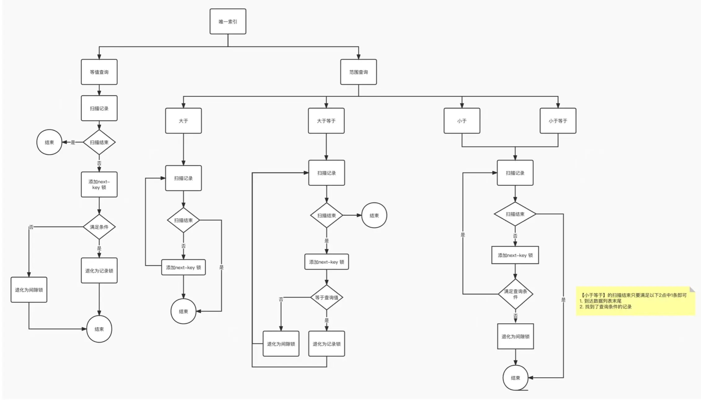

非唯一索引加锁的流程图：

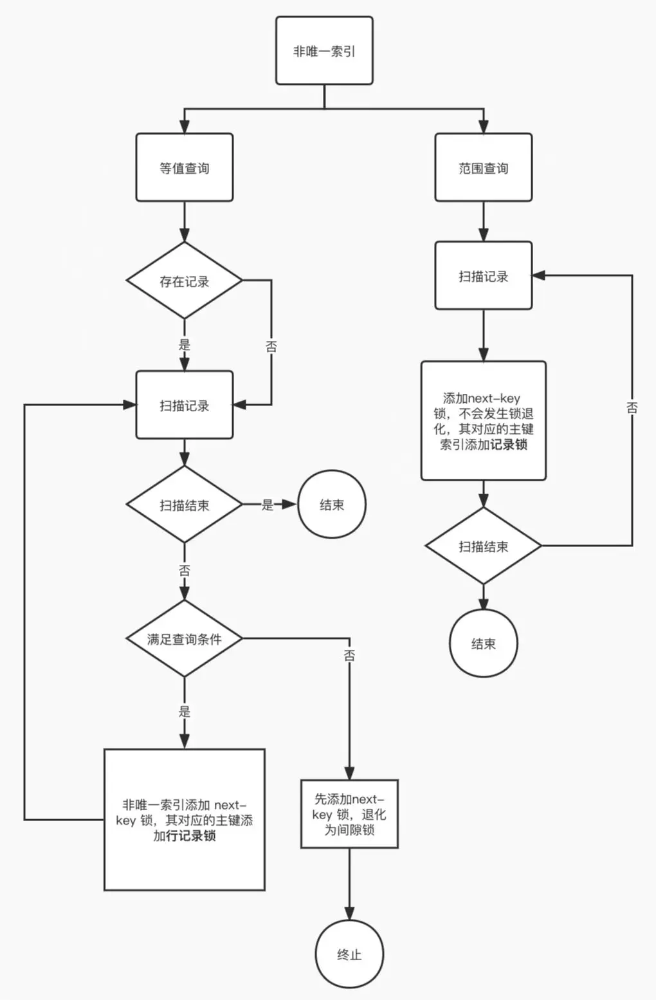
