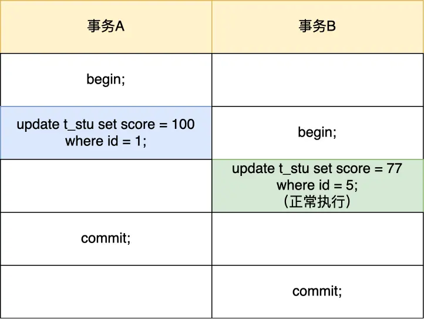
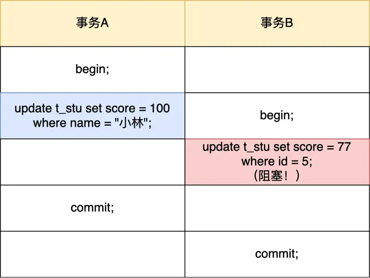
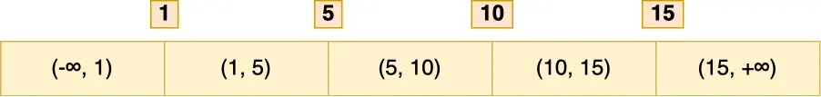

# update 没加索引会锁全表？ 别再让你的数据库"罢工"了！

想象一下这个场景：一个平平无奇的工作日，你熟练地在生产数据库上敲下了一行看似人畜无害的 `UPDATE` 语句。几分钟后，监控系统警报声此起彼伏，用户抱怨雪片般飞来，网站卡得像在播放慢动作，整个业务几乎陷入停顿。然后，你的老板“亲切”地请你去办公室“聊聊人生”……

这可不是危言耸听，而是不少开发者都曾踩过的“天坑”。而引发这场“灾难”的，往往就是一条再普通不过的 `UPDATE` 语句——仅仅因为它的 `WHERE` 条件里忘了带索引，或者索引没生效。

这篇文章会用大白话给你讲清楚：

- 为啥一条没用对索引的 `UPDATE` 语句能把整个系统搞垮？
- 作为“打工人”，我们该如何避免这种“飞来横祸”？

接下来的内容，咱们都以 MySQL 最常用的 InnoDB 存储引擎和它默认的“可重复读”（Repeatable Read）隔离级别为背景。一起来揭开这个数据库“定时炸弹”的神秘面纱吧！

## 为什么会发生这种“惨案”？

简单来说，InnoDB 为了解决在“可重复读”这个隔离级别下可能出现的“幻读”问题（就是同一个事务里，两次相同的查询看到了不一样的结果），引入了一种叫做 `next-key` 锁的机制。这个锁很霸道，它不仅会锁住你要操作的那行数据（这叫记录锁），还会把这行数据前后的“空隙”也给锁上（这叫间隙锁），防止其他事务在这些空隙里搞小动作（比如插入新数据）。

当我们执行 `UPDATE` 语句时，InnoDB 会给符合条件的记录加上独占锁（X 锁）。这个锁一旦加上，其他想修改这些记录的事务就得乖乖排队等着。而且，这个锁不是 `UPDATE` 语句执行完就立马释放的，它会一直等到整个事务结束（比如 `COMMIT` 或 `ROLLBACK`）才会被放开。

关键点来了：**InnoDB 加锁的基本单位是 `next-key` 锁，而且这个锁是加在索引上的，而不是直接加在数据行上的。**

- **如果你的 `UPDATE` 语句 `WHERE` 条件用的是唯一索引（比如主键），并且是等值查询**：那太棒了！`next-key` 锁会“降级”成记录锁，只锁住精准匹配的那一行数据。其他事务该干嘛干嘛，互不影响。

  举个栗子，假设我们有张 `users` 表，`id` 是主键：

  

  现在有两个事务，它们的执行顺序是这样的：

  

  事务 A 的 `UPDATE` 语句因为用了主键 `id` 进行等值查询，所以只锁住了 `id = 1` 这一行。事务 B 想更新 `id = 2` 的数据，完全没问题，不会被阻塞。

- **但是，如果你的 `UPDATE` 语句 `WHERE` 条件没有使用索引，或者索引失效了**：灾难就要降临了！InnoDB 找不到合适的索引，就只能进行全表扫描。在全表扫描的过程中，它会对表里的每一条记录（以及它们之间的间隙）都加上 `next-key` 锁。这就相当于把整张表都给锁死了！

  再来看一个例子：

  

  这次事务 B 的 `UPDATE` 语句就被卡住了，动弹不得。

  为啥呢？因为事务 A 的 `UPDATE` 语句 `WHERE` 条件 `name = 'xiaolin'` 中的 `name` 字段没有索引（或者索引没被优化器选中），导致了全表扫描。在扫描过程中，InnoDB 给表里的所有记录（比如 4 条记录）和它们之间的所有间隙（比如 5 个间隙）都加上了 `next-key` 锁。结果就是，整张表都被锁定了，其他事务想对这张表做任何写操作（`INSERT`、`UPDATE`、`DELETE`）都会被阻塞。

  

  可以想象，如果这张表的数据量巨大（比如几百万、几千万行），这个全表锁一旦加上，可能会持续很长时间，直到事务 A 结束。在这期间，除了只读的 `SELECT ... FROM ...` 查询，其他所有对这张表的操作都会被阻塞。业务自然也就跟着停摆，然后你就要准备好接受老板的“灵魂拷问”了。

那么，是不是只要 `UPDATE` 语句的 `WHERE` 条件带上索引，就一定能避免全表锁呢？

答案是：**不一定！**

**最关键的还是要看 MySQL 的优化器最终选择了什么执行计划。如果优化器觉得走索引的成本比全表扫描还高（比如表数据量很小，或者索引选择性不高），它还是可能会选择全表扫描。一旦走了全表扫描，那全表记录加锁的命运就难以避免了。**


很多网上的文章会说 `UPDATE` 没加索引会导致“表锁”。严格来说，这个说法不完全准确。

InnoDB 的源码里，加锁的基本单位是索引项（`index entry`）。当 `UPDATE` 因为没有有效索引而进行全表扫描时，它实际上是把表里所有记录对应的索引项都加上了锁。从效果上看，这确实和锁住了整张表差不多，所以大家习惯性地称之为“表锁”。但理解其本质是行锁（准确地说是 `next-key` 锁）的累加，有助于我们更深入地分析问题。



## 如何避免这种“飞来横祸”？

知道了原因，我们就可以对症下药了。以下是一些避免 `UPDATE` 没加索引导致全表锁的实用方法：

1.  **开启安全更新模式 (`sql_safe_updates`)**

    我们可以把 MySQL 的 `sql_safe_updates` 参数设置为 `1`。这样一来，MySQL 就会变得“敏感”起来。

    > 官方解释是这么说的：
    > If set to 1, MySQL aborts UPDATE or DELETE statements that do not use a key in the WHERE clause or a LIMIT clause. (Specifically, UPDATE statements must have a WHERE clause that uses a key or a LIMIT clause, or both. DELETE statements must have both.) This makes it possible to catch UPDATE or DELETE statements where keys are not used properly and that would probably change or delete a large number of rows. The default value is 0.

    简单翻译一下，当 `sql_safe_updates` 设置为 `1` 时：

    - `UPDATE` 语句必须满足以下任一条件才能成功执行：
      - `WHERE` 条件中必须包含索引列。
      - 使用了 `LIMIT` 子句。
      - 同时使用了 `WHERE` 和 `LIMIT`（此时 `WHERE` 条件中可以没有索引列，但不推荐）。
    - `DELETE` 语句则更严格，必须同时满足：
      - `WHERE` 条件中包含索引列。
      - 并且使用了 `LIMIT` 子句。

    开启这个参数，就像给你的数据库上了一道保险，能有效阻止那些可能因为忘加索引或索引使用不当而导致大范围数据修改或删除的危险操作。

2.  **强制使用索引 (`FORCE INDEX`)**

    即使你的 `WHERE` 条件里包含了索引列，但如果 MySQL 优化器“自作聪明”地选择了全表扫描，你还是有办法“纠正”它的。

    可以使用 `FORCE INDEX([index_name])` 语法来明确告诉优化器：“嘿，老兄，听我的，就用这个名叫 `[index_name]` 的索引！” 这样就能强制查询走指定的索引，从而避免因优化器选择失误导致的全表扫描和潜在的全表锁风险。

    例如：`UPDATE my_table FORCE INDEX(idx_name) SET column1 = 'new_value' WHERE name = 'some_value';`

3.  **上线前充分测试和 `EXPLAIN`**

    对于所有重要的 `UPDATE` 和 `DELETE` 语句，在上线前务必在测试环境进行充分测试。更重要的是，要使用 `EXPLAIN` 命令分析这些语句的执行计划，确保它们确实走了预期的索引，并且扫描的行数在合理范围内。

    如果 `EXPLAIN` 结果显示 `type` 是 `ALL`（全表扫描），或者 `rows` 数量异常大，那就要高度警惕了，赶紧检查索引和查询条件。

## 总结：小心驶得万年船

别小看一条小小的 `UPDATE` 语句，在生产环境，如果使用不当，它真有可能变成压垮骆驼的最后一根稻草，导致业务停滞甚至系统崩溃。

为了避免成为那个“背锅侠”，请牢记以下几点：

- 执行 `UPDATE` 或 `DELETE` 语句时，**务必确保 `WHERE` 条件中使用了合适的索引列**。
- 在测试环境，**使用 `EXPLAIN` 仔细检查语句的执行计划**，确认它真的走了索引，而不是全表扫描。
- 考虑**开启 MySQL 的 `sql_safe_updates` 参数**，作为一道额外的安全防线。
- 如果发现即使 `WHERE` 条件带了索引，优化器依然“固执”地选择全表扫描，别犹豫，果断使用 `FORCE INDEX([index_name])` 来“指引”它走上正途。

希望这篇文章能帮你避开这个常见的“坑”。下次操作数据库时，一定要多加小心，别再因为一条 `UPDATE` 语句而被老板请去“喝茶”啦！
