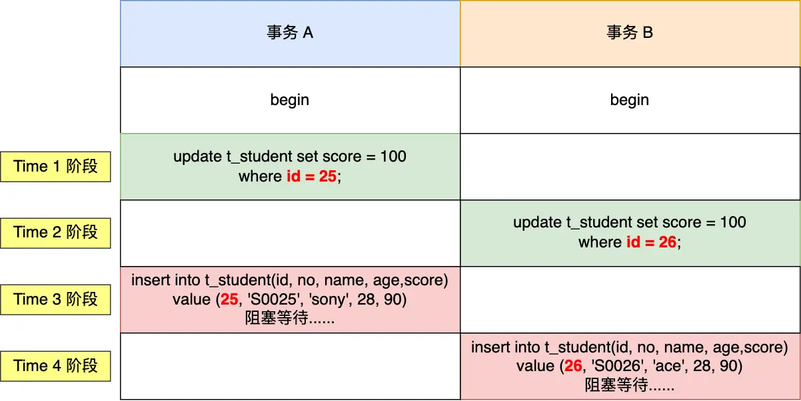
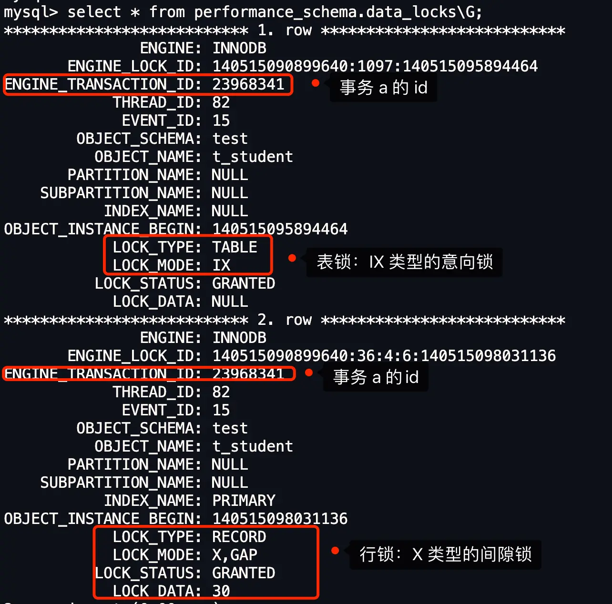
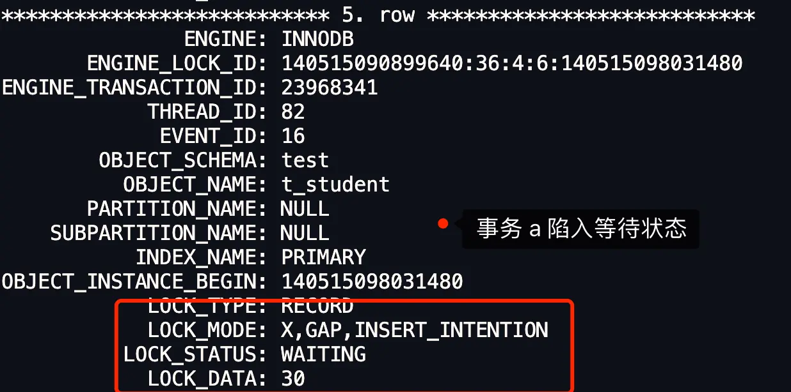

# 字节面试：加了什么锁，导致死锁的？

这是一个来自字节跳动面试的经典 MySQL 问题。面试官可能会这样提问：“在**可重复读（Repeatable Read）隔离级别**下，以下场景会发生什么情况？”

面试题中涉及一个名为 `students` 的表，其结构包含 `id` (主键), `no`, `name`, `age`, `score` 字段。为了便于实验和分析，我们接下来将使用一个结构相同但表名为 `t_student` 的表。
`students` (即我们实验中的 `t_student`) 表的初始数据大致如下：

| id  | no    | name  | age | score |
| --- | ----- | ----- | --- | ----- |
| 15  | S0001 | Bob   | 25  | 34    |
| 18  | S0002 | Alice | 24  | 77    |
| 20  | S0003 | Jim   | 24  | 5     |
| 30  | S0004 | Eric  | 23  | 91    |
| 37  | S0005 | Tom   | 22  | 22    |
| 49  | S0006 | Tom   | 25  | 83    |
| 50  | S0007 | Rose  | 23  | 89    |

在此场景中，有两个并发事务正在执行：

- **事务 A** 按顺序执行以下操作：
  1.  `time1`: `UPDATE students SET score=100 WHERE id=25;`
  2.  `time3`: `INSERT INTO students(id, no, name, age, score) VALUES (25, 's0025', 'sony', 28, 90);`
- **事务 B** 按顺序执行以下操作：
  1.  `time2`: `UPDATE students SET score=100 WHERE id=26;`
  2.  `time4`: `INSERT INTO students(id, no, name, age, score) VALUES (26, 's0026', 'ace', 28, 90);`

如果对 MySQL 加锁机制比较熟悉，可能一眼就能看出这个场景下**会发生死锁**。但更进一步的问题是：具体是加了什么锁？这些锁之间是如何相互作用最终导致死锁的？

接下来，本文将详细分析上述两个事务在执行 SQL 语句的过程中，分别获取了哪些锁，以及这些锁是如何一步步导致死锁的。

## 准备工作

先创建一张 t_student 表，假设除了 id 字段，其他字段都是普通字段。

```sql
CREATE TABLE `t_student` (
  `id` int NOT NULL,
  `no` varchar(255) DEFAULT NULL,
  `name` varchar(255) DEFAULT NULL,
  `age` int DEFAULT NULL,
  `score` int DEFAULT NULL,
  PRIMARY KEY (`id`)
) ENGINE=InnoDB DEFAULT CHARSET=utf8mb4;
```

然后，插入相关的数据后，t_student 表中的记录如下：

| id  | no    | name  | age | score |
| --- | ----- | ----- | --- | ----- |
| 15  | S0001 | Bob   | 25  | 34    |
| 18  | S0002 | Alice | 24  | 77    |
| 20  | S0003 | Jim   | 24  | 5     |
| 30  | S0004 | Eric  | 23  | 91    |
| 37  | S0005 | Tom   | 22  | 22    |
| 49  | S0006 | Tom   | 25  | 83    |
| 50  | S0007 | Rose  | 23  | 89    |

## 开始实验

在实验开始前，先说明下实验环境：

- MySQL 版本：8.0.26
- 隔离级别：可重复读（RR）

启动两个事务，按照题目的 SQL 执行顺序，过程如下表格：



可以看到，事务 A 和 事务 B 都在执行 insert 语句后，都陷入了等待状态（前提没有打开死锁检测），也就是发生了死锁，因为都在相互等待对方释放锁。（注意：在 MySQL 默认配置下，死锁检测是开启的。如果开启，其中一个事务（通常是持有锁较少或回滚代价较小的那个）会被选中作为牺牲者并回滚，同时向客户端返回死锁错误，例如 `ERROR 1213 (40001): Deadlock found when trying to get lock; try restarting transaction`。本文描述两个事务都陷入等待是为了清晰展示死锁形成的完整过程。）

## 为什么会发生死锁？

我们可以通过 `select * from performance_schema.data_locks\G;` 这条语句，查看事务执行 SQL 过程中加了什么锁。

接下来，针对每一条 SQL 语句分析具体加了什么锁。

### Time 1 阶段加锁分析

Time 1 阶段，事务 A 执行以下语句：

```sql
# 事务 A
mysql> begin;
Query OK, 0 rows affected (0.00 sec)

mysql> update t_student set score = 100 where id = 25;
Query OK, 0 rows affected (0.01 sec)
Rows matched: 0  Changed: 0  Warnings: 0
```

然后执行 `select * from performance_schema.data_locks\G;` 这条语句，查看事务 A 此时加了什么锁。



从上图可以看到，共加了两个锁，分别是：

- 表级锁：一个 X 类型的意向锁 (IX lock)。这是因为事务需要在表中的行上加 X 锁（无论是记录锁还是间隙锁），所以先在表上加 IX 锁。
- 行级锁：一个 X 类型的间隙锁 (Gap Lock)；

这里我们重点关注行锁，图中 LOCK_TYPE 中的 RECORD 表示行级锁，而不是记录锁的意思，通过 LOCK_MODE 可以确认是 next-key 锁，还是间隙锁，还是记录锁：

- 如果 LOCK_MODE 为 `X`，说明是 next-key 锁；
- 如果 LOCK_MODE 为 `X, REC_NOT_GAP`，说明是记录锁；
- 如果 LOCK_MODE 为 `X, GAP`，说明是间隙锁；

**因此，此时事务 A 在主键索引（INDEX_NAME : PRIMARY）上加的是 X 型间隙锁，锁范围是`(20, 30)`**。

> 间隙锁的范围`(20, 30)` ，是怎么确定的？

当 `UPDATE` 语句的 `WHERE` 条件（如 `id = 25`）没有命中任何现有记录时，在可重复读隔离级别下，InnoDB 会为了防止幻读而加上间隙锁。
该间隙锁的范围确定方式如下：

- `LOCK_DATA` (在此例中为 `30`) 通常表示该间隙锁范围的右边界（不包含）。这是因为 `id=30` 是主键索引中大于 `25` 的第一条记录。
- 间隙锁范围的左边界（不包含）则是主键索引中小于 `25` 的最大一条记录的 `id` 值，即 `20`。
  所以，形成的间隙为 `(20, 30)`。这个锁确保了在 `id` 值为 20 和 30 之间的这个区间，没有新的记录可以被插入，从而保证了事务 A 的可重复读。


因此，间隙锁的范围是 `(20, 30)`。

### Time 2 阶段加锁分析

Time 2 阶段，事务 B 执行以下语句：

```sql
# 事务 B
mysql> begin;
Query OK, 0 rows affected (0.00 sec)

mysql> update t_student set score = 100 where id = 26;
Query OK, 0 rows affected (0.01 sec)
Rows matched: 0  Changed: 0  Warnings: 0
```

然后执行 `select * from performance_schema.data_locks\G;` 这条语句，查看事务 B 此时加了什么锁。


从上图可以看到，行锁是 X 类型的间隙锁，间隙锁的范围是`(20, 30)`。

> 事务 A 和 事务 B 的间隙锁范围都是一样的，为什么不会冲突？

两个事务的间隙锁之间是相互兼容的，不会产生冲突。

在 MySQL 官网上还有一段非常关键的描述：

_Gap locks in InnoDB are “purely inhibitive”, which means that their only purpose is to prevent other transactions from Inserting to the gap. Gap locks can co-exist. A gap lock taken by one transaction does not prevent another transaction from taking a gap lock on the same gap. There is no difference between shared and exclusive gap locks. They do not conflict with each other, and they perform the same function._

**间隙锁的意义只在于阻止区间被插入**，因此是可以共存的。**一个事务获取的间隙锁不会阻止另一个事务获取同一个间隙范围的间隙锁**，共享（S 型）和排他（X 型）的间隙锁是没有区别的，他们相互不冲突，且功能相同。

### Time 3 阶段加锁分析

Time 3，事务 A 插入了一条记录：

```sql
# Time 3 阶段，事务 A 插入了一条记录
mysql> insert into t_student(id, no, name, age,score) value (25, 'S0025', 'sony', 28, 90);
    /// 阻塞等待......
```

此时，事务 A 就陷入了等待状态。

然后执行 `select * from performance_schema.data_locks\G;` 这条语句，查看事务 A 在获取什么锁而导致被阻塞。



可以看到，事务 A 的状态为等待状态（LOCK_STATUS: WAITING）。这是因为它试图在 `id=25` 的位置插入记录，该位置位于事务 B 持有的间隙锁 `(20, 30)` 范围内。为了执行插入，事务 A 需要获取一个插入意向锁。然而，**插入意向锁与另一个事务持有的间隙锁是冲突的**。因此，事务 A 的插入操作被阻塞，等待事务 B 释放其在 `(20, 30)` 上的间隙锁。此时，事务 A 自身也持有 `(20,30)` 的间隙锁。

> 插入意向锁是什么？

注意！插入意向锁名字里虽然有意向锁这三个字，但是它并不是意向锁，它属于行级锁，是一种特殊的间隙锁。

在 MySQL 的官方文档中有以下重要描述：

_An Insert intention lock is a type of gap lock set by Insert operations prior to row Insertion. This lock signals the intent to Insert in such a way that multiple transactions Inserting into the same index gap need not wait for each other if they are not Inserting at the same position within the gap. Suppose that there are index records with values of 4 and 7. Separate transactions that attempt to Insert values of 5 and 6, respectively, each lock the gap between 4 and 7 with Insert intention locks prior to obtaining the exclusive lock on the Inserted row, but do not block each other because the rows are nonconflicting._

这段话表明尽管**插入意向锁是一种特殊的间隙锁，但不同于间隙锁的是，该锁只用于并发插入操作**。

如果说间隙锁锁住的是一个区间，那么「插入意向锁」锁住的就是一个点。因而从这个角度来说，插入意向锁确实是一种特殊的间隙锁。

插入意向锁与间隙锁的另一个非常重要的差别是：**尽管「插入意向锁」也属于间隙锁，但两个事务却不能在同一时间内，一个拥有间隙锁，另一个拥有该间隙区间内的插入意向锁（当然，插入意向锁如果不在间隙锁区间内则是可以的）。所以，插入意向锁和间隙锁之间是冲突的**。

另外，我补充一点，插入意向锁的生成时机：

- 每插入一条新记录，都需要看一下待插入记录的下一条记录上是否已经被加了间隙锁，如果已加间隙锁，此时会生成一个插入意向锁，然后锁的状态设置为等待状态（_PS：MySQL 加锁时，是先生成锁结构，然后设置锁的状态，如果锁状态是等待状态，并不是意味着事务成功获取到了锁，只有当锁状态为正常状态时，才代表事务成功获取到了锁_），现象就是 Insert 语句会被阻塞。

### Time 4 阶段加锁分析

Time 4，事务 B 插入了一条记录：

```sql
# Time 4 阶段，事务 B 插入了一条记录
mysql> insert into t_student(id, no, name, age,score) value (26, 'S0026', 'ace', 28, 90);
    /// 阻塞等待......
```

此时，事务 B 就陷入了等待状态。

然后执行 `select * from performance_schema.data_locks\G;` 这条语句，查看事务 B 在获取什么锁而导致被阻塞。


可以看到，事务 B 也因尝试获取插入意向锁而被阻塞（LOCK_STATUS: WAITING）。事务 B 试图在 `id=26` 的位置插入记录，该位置同样位于事务 A 持有的间隙锁 `(20, 30)` 范围内。与事务 A 的情况类似，事务 B 的插入操作需要获取插入意向锁，而这个锁与事务 A 持有的间隙锁 `(20, 30)` 冲突。因此，事务 B 等待事务 A 释放其间隙锁。

> 最后回答，为什么会发生死锁？

死锁的发生是因为两个事务形成了循环等待资源。具体分析如下：

1.  **初始状态**：

    - 事务 A 执行 `UPDATE ... WHERE id = 25`，未找到记录，获得了间隙锁 G_A 对 `(20, 30)`。
    - 事务 B 执行 `UPDATE ... WHERE id = 26`，未找到记录，获得了间隙锁 G_B 对 `(20, 30)`。
    - 间隙锁之间是兼容的，所以事务 A 和 B 此时都成功持有各自的间隙锁。

2.  **事务 A 尝试插入**：

    - 事务 A 执行 `INSERT INTO t_student VALUES (25, ...)`。
    - 为了插入 `id=25`，事务 A 需要获取一个插入意向锁 (II_A) 作用于 `id=25` 所在的位置。
    - 这个位置 `id=25` 位于事务 B 持有的间隙锁 G_B `(20, 30)` 范围内。
    - 插入意向锁 II_A 与其他事务持有的间隙锁 G_B 冲突。
    - 因此，事务 A 等待事务 B 释放间隙锁 G_B。

3.  **事务 B 尝试插入**：

    - 事务 B 执行 `INSERT INTO t_student VALUES (26, ...)`。
    - 为了插入 `id=26`，事务 B 需要获取一个插入意向锁 (II_B) 作用于 `id=26` 所在的位置。
    - 这个位置 `id=26` 位于事务 A 持有的间隙锁 G_A `(20, 30)` 范围内。
    - 插入意向锁 II_B 与其他事务持有的间隙锁 G_A 冲突。
    - 因此，事务 B 等待事务 A 释放间隙锁 G_A。

4.  **循环等待**：
    - 事务 A 持有 G_A，等待 G_B。
    - 事务 B 持有 G_B，等待 G_A。
    - 这就构成了循环等待，满足了死锁的条件（互斥、占有并等待、不可抢占、循环等待），因此发生死锁。

简而言之，两个事务都先获取了相同范围的间隙锁（这是允许的），然后又都试图在这个被对方锁定的间隙内插入数据，从而需要获取插入意向锁。由于插入意向锁与对方的间隙锁冲突，导致了相互等待。

## 总结

两个事务即使生成的间隙锁的范围是一样的，也不会发生冲突，因为间隙锁目的是为了防止其他事务插入数据，因此间隙锁与间隙锁之间是相互兼容的。

在执行插入语句时，如果插入的记录在其他事务持有间隙锁范围内，插入语句就会被阻塞，因为插入语句在碰到间隙锁时，会生成一个插入意向锁，然后插入意向锁和间隙锁之间是互斥的关系。

如果两个事务分别向对方持有的间隙锁范围内插入一条记录，而插入操作为了获取到插入意向锁，都在等待对方事务的间隙锁释放，于是就造成了循环等待，满足了死锁的四个条件：**互斥、占有且等待、不可强占用、循环等待**，因此发生了死锁。

## 读者问答


