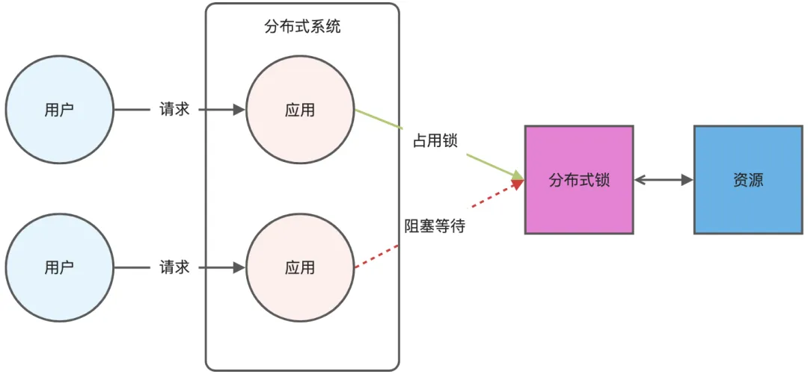

## 概述

分布式锁是分布式环境下并发控制的一种机制，用于控制某个共享资源在同一时刻只能被一个应用所使用。Redis 作为共享存储系统，凭借其高性能的读写能力，成为实现分布式锁的热门选择。



## 核心概念

### 分布式锁的基本要求

分布式锁必须满足以下几个核心特性：

1. **互斥性**：在任意时刻，只有一个客户端能够获得锁
2. **无死锁**：即使持有锁的客户端崩溃，锁也能够被释放
3. **容错性**：只要大部分 Redis 节点正常运行，客户端就能够获取和释放锁

### Redis 实现分布式锁的原理

Redis 本身可以被多个客户端共享访问，是理想的共享存储系统。Redis 的 SET 命令具有 NX 参数，可以实现"key 不存在才插入"的原子操作，这是实现分布式锁的基础。

## 单节点 Redis 分布式锁实现

### 加锁机制

基于单个 Redis 节点实现分布式锁需要满足三个关键条件：

1. **原子性操作**：加锁包括读取锁变量、检查锁变量值和设置锁变量值三个操作，必须以原子方式完成
2. **设置过期时间**：避免客户端异常导致锁无法释放
3. **唯一标识**：区分来自不同客户端的加锁操作，防止误释放

### 实现命令

```bash
SET lock_key unique_value NX PX 10000
```

**参数说明：**
- `lock_key`：锁的键名
- `unique_value`：客户端生成的唯一标识，用于区分不同客户端
- `NX`：只在 lock_key 不存在时才设置
- `PX 10000`：设置过期时间为 10 秒

### 解锁机制

解锁过程需要确保操作的客户端就是加锁的客户端，使用 Lua 脚本保证原子性：

```lua
-- 解锁 Lua 脚本
if redis.call("get",KEYS[1]) == ARGV[1] then
    return redis.call("del",KEYS[1])
else
    return 0
end
```

这个脚本先比较锁的 unique_value 是否匹配，匹配时才删除锁，避免误释放。

## 单节点方案的优缺点分析

### 优点

1. **高性能**：Redis 的高性能读写是选择它实现分布式锁的核心原因
2. **实现简便**：Redis 提供的 SET NX 命令使得实现分布式锁非常方便
3. **避免单点故障**：通过集群部署自然避免了单点故障

### 缺点

#### 1. 超时时间设置难题

超时时间的设置是一个棘手问题：
- **设置过长**：影响系统性能
- **设置过短**：可能无法保护共享资源

**问题场景**：线程 A 获取锁后，由于业务代码执行时间较长，锁超时自动失效，但 A 线程尚未执行完成，此时线程 B 可能意外获得锁，导致两个线程同时操作共享资源。

**解决方案 - 锁续约机制**：
1. 设置初始超时时间
2. 启动守护线程监控锁状态
3. 在锁即将失效时自动续期
4. 主线程执行完成后销毁续约锁

虽然这种方式能解决问题，但实现复杂度较高。

#### 2. 主从复制的异步问题

Redis 主从复制采用异步方式，可能导致分布式锁不可靠：

如果在 Redis 主节点获取锁后，还未同步到从节点时主节点宕机，新的主节点上没有锁数据，其他应用仍可获取锁，破坏了锁的互斥性。

## Redlock 算法 - 集群环境的解决方案

### 算法原理

Redis 官方为解决集群环境下分布式锁的可靠性问题，设计了 Redlock（红锁）算法。该算法基于多个独立的 Redis 节点，即使部分节点故障，锁变量仍然存在，客户端可以继续进行锁操作。

**核心思路**：客户端与多个独立的 Redis 节点依次请求加锁，如果能够与半数以上的节点成功完成加锁操作，则认为加锁成功。

### Redlock 加锁流程

#### 第一步：获取当前时间
客户端记录当前时间戳，用于后续计算总耗时。

#### 第二步：依次向所有节点加锁
- 使用相同的 SET 命令（带 NX、EX/PX 选项和唯一标识）
- 对每个节点的加锁操作设置超时时间（注意：这是对加锁操作的超时，不是对锁本身的超时）
- 如果某个节点故障，不影响 Redlock 算法继续运行

#### 第三步：计算加锁总耗时
客户端完成所有节点的加锁操作后，计算整个过程的总耗时（t1）。

### 加锁成功条件

加锁成功需要**同时**满足两个条件：

1. **节点数量条件**：客户端从超过半数（≥ N/2+1）的 Redis 节点成功获取到锁
2. **时间条件**：客户端获取锁的总耗时（t1）没有超过锁的有效时间

### 锁的有效时间重新计算

加锁成功后，需要重新计算锁的实际有效时间：

```
实际有效时间 = 锁的最初有效时间 - 客户端获取锁的总耗时（t1）
```

### 解锁流程

无论加锁成功还是失败，客户端都应向所有 Redis 节点发起释放锁的操作，使用与单节点相同的 Lua 脚本。

## 最佳实践

1. **合理设置超时时间**：根据业务场景评估，避免过长或过短
2. **实现锁续约机制**：对于执行时间不确定的业务
3. **选择合适的节点数量**：Redlock 推荐奇数个节点，如 3、5、7 个
4. **监控锁的使用情况**：及时发现锁竞争激烈的场景
5. **考虑使用专业的分布式锁服务**：如 Zookeeper、etcd 等

## 常见问题与解决方案

### Q: 如何处理网络分区？
A: Redlock 算法通过要求半数以上节点同意来处理网络分区问题，但在严重的网络分区情况下，可能出现脑裂问题。

### Q: 锁续约的最佳实践？
A: 设置续约间隔为锁超时时间的 1/3，避免频繁续约影响性能。

### Q: 如何选择 Redis 节点数量？
A: 推荐使用奇数个节点，3-5 个节点对大多数场景已足够，过多节点会影响性能。

## 参考资料

- [Redis 官方文档 - 分布式锁](https://redis.io/docs/reference/patterns/distributed-locks/)
- [Redlock 算法详解](https://redis.io/docs/reference/patterns/distributed-locks/#the-redlock-algorithm)