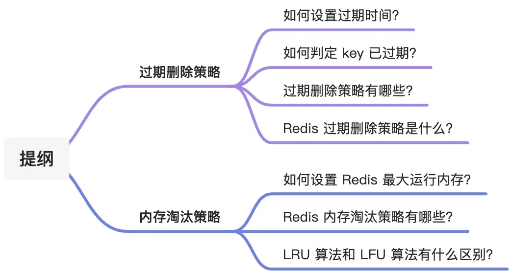
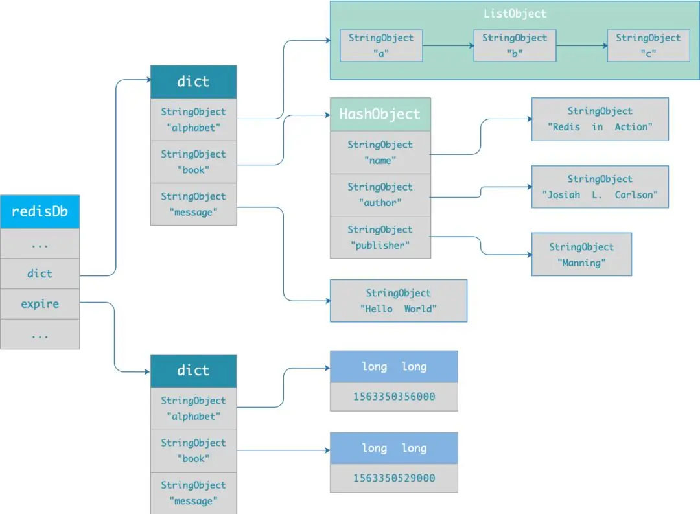
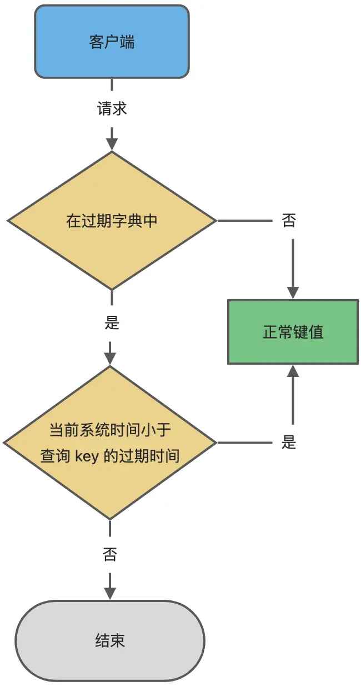
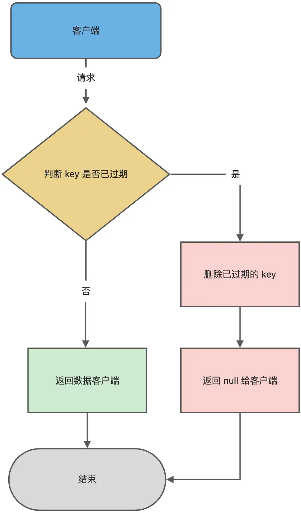
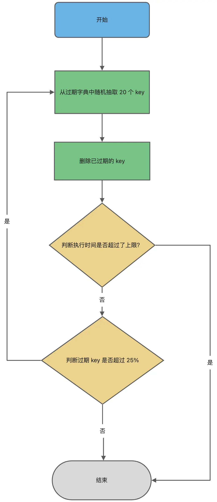
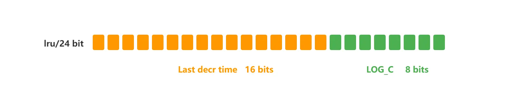
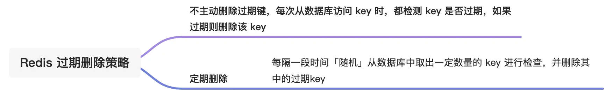
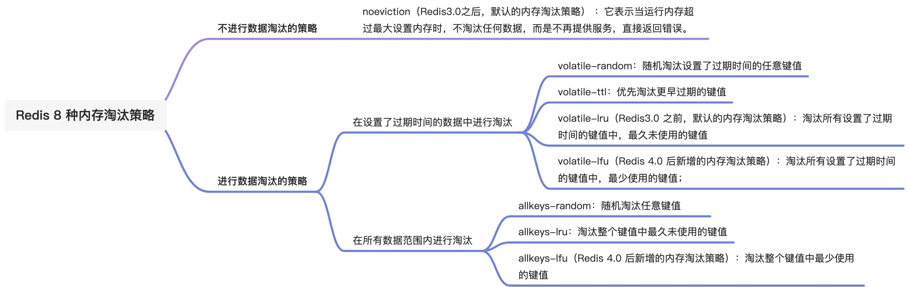

# Redis 过期删除策略和内存淘汰策略有什么区别？

Redis 的「内存淘汰策略」和「过期删除策略」，很多小伙伴容易混淆。就像家里的冰箱一样，这两个机制虽然都是在"清理东西"，但是触发的条件和清理的方式完全不同。

今天就跟大家理一理，「内存淘汰策略」和「过期删除策略」到底有什么区别。



## 过期删除策略

Redis 可以给数据设置"保质期"（过期时间），就像超市里的商品都有保质期一样。当数据过期后，Redis 需要有相应的机制来清理这些"过期商品"，这就是过期键值删除策略的作用。

### 如何给数据设置"保质期"？

Redis 提供了多种方式来给数据设置过期时间，就像给食物贴上不同格式的保质期标签一样。

**设置过期时间的命令：**

- `expire <key> <n>`：设置数据在 n 秒后过期
  - 例如：`expire milk 86400` 表示牛奶在 86400 秒（1天）后过期
- `pexpire <key> <n>`：设置数据在 n 毫秒后过期（更精确）
  - 例如：`pexpire bread 3600000` 表示面包在 3600000 毫秒（1小时）后过期
- `expireat <key> <n>`：设置数据在某个具体时间点过期
  - 例如：`expireat fruit 1655654400` 表示水果在时间戳 1655654400 后过期
- `pexpireat <key> <n>`：设置数据在某个具体时间点过期（精确到毫秒）

**在存储数据时同时设置过期时间：**

- `set <key> <value> ex <n>`：存数据的同时设置过期时间（秒）
- `set <key> <value> px <n>`：存数据的同时设置过期时间（毫秒）
- `setex <key> <n> <value>`：存数据的同时设置过期时间（秒）

**查看剩余"保质期"：**

使用 `TTL <key>` 命令可以查看数据还有多长时间过期，就像查看食物还能放多久一样。

```bash
# 存储牛奶，设置60秒后过期
> setex milk 60 "fresh_milk"
OK

# 查看牛奶还能放多久
> ttl milk
(integer) 56
> ttl milk
(integer) 52
```

**取消过期时间：**

如果突然不想让数据过期了，可以使用 `PERSIST <key>` 命令，就像把食物放进冷冻室永久保存一样。

```bash
# 取消牛奶的过期时间
> persist milk
(integer) 1

# 查看结果，-1 表示永不过期
> ttl milk 
(integer) -1
```

### Redis 怎么知道数据已经"过期"了？

每当我们给数据设置过期时间时，Redis 就会把这个信息记录在一个叫做**"过期字典"**的地方，就像超市的管理系统记录每个商品的保质期一样。

这个过期字典的结构很简单：
- **字典的 key**：指向具体的数据
- **字典的 value**：记录这个数据什么时候过期

过期字典的数据结构如下图所示：



**判断数据是否过期的流程：**

当我们要使用某个数据时，Redis 会先检查这个数据是否在"过期字典"中：
- 如果不在：说明这个数据没有设置过期时间，可以正常使用
- 如果在：就拿出过期时间和当前时间比较
  - 如果还没到过期时间：可以正常使用
  - 如果已经过期：这个数据就不能用了

这个判断流程如下图所示：



### 过期数据的清理方式有哪些？

就像处理过期食物一样，我们有不同的清理策略。让我们用生活中的例子来理解这三种策略：

> **定时删除策略**：设置闹钟提醒

**工作方式**：给每个数据设置一个"闹钟"，时间一到就立即删除。

**优点**：
- 过期数据能立即被清理，内存利用率最高
- 就像设置闹钟提醒扔垃圾，垃圾不会堆积

**缺点**：
- 如果过期数据很多，就需要很多"闹钟"，会消耗大量 CPU 资源
- 就像同时设置100个闹钟，会让你忙得团团转

> **惰性删除策略**：用时再检查

**工作方式**：不主动清理过期数据，只有在要使用某个数据时，才检查它是否过期。

**优点**：
- 很省 CPU 资源，因为只在需要时才检查
- 就像冰箱里的食物，只有在要吃的时候才检查是否过期

**缺点**：
- 如果某个过期数据一直没人用，它就会一直占用内存空间
- 就像冰箱里放了很久的过期食物，如果不去看就不会清理

> **定期删除策略**：定期大扫除

**工作方式**：每隔一段时间随机检查一批数据，删除其中过期的。

**优点**：
- 在 CPU 消耗和内存利用之间找到了平衡
- 就像定期整理冰箱，既不会太累，也不会让过期食物堆积太多

**缺点**：
- 清理效果不如定时删除彻底
- 资源消耗比惰性删除多一些
- 很难确定多久检查一次最合适

### Redis 选择了哪种策略？

Redis 很聪明，它没有只用一种策略，而是选择了**"惰性删除 + 定期删除"**的组合，就像我们既会在用食物前检查是否过期，也会定期整理冰箱一样。

> **Redis 的惰性删除实现**

Redis 在每次访问数据之前，都会先检查这个数据是否过期：
- 如果过期了：删除这个数据，返回空值给用户
- 如果没过期：正常返回数据

这个检查流程如下图：



> **Redis 的定期删除实现**

**检查频率**：Redis 默认每秒进行 10 次过期检查，这个频率可以通过配置文件调整（参数名：hz，默认值是 10）。

**检查流程**：
1. 随机选择 20 个设置了过期时间的数据
2. 检查这 20 个数据是否过期，删除已过期的
3. 如果过期数据超过 5 个（即超过 25%），继续重复步骤 1
4. 如果过期数据少于 25%，等待下次检查

**时间限制**：为了防止检查时间过长影响正常服务，每次检查最多不超过 25 毫秒。

用伪代码描述这个流程：

```c
do {
    //统计过期的数量
    expired = 0；
    //每次检查20个
    num = 20;
    
    while (num--) {
        //1. 随机选择1个有过期时间的数据
        //2. 检查是否过期，如果过期就删除，expired++
    }
    
    // 如果检查时间超过限制，立即退出
    if (时间超过25毫秒) return;

    /* 如果过期数据超过25%，继续检查，否则结束本轮 */
} while (expired > 20/4); 
```

定期删除的完整流程如下图：



## 内存淘汰策略

如果说过期删除策略是清理"过期食物"，那么内存淘汰策略就是当"冰箱满了"时决定扔掉什么东西。

当 Redis 使用的内存超过了我们设置的上限时，就会启动内存淘汰策略来删除一些数据，确保 Redis 能继续正常工作。

### 如何设置 Redis 的"冰箱大小"？

在 Redis 的配置文件中，可以通过 `maxmemory` 参数设置最大内存限制：

**不同系统的默认设置：**
- **64位系统**：默认没有限制（maxmemory = 0），可能导致内存用完系统崩溃
- **32位系统**：默认限制为 3GB，因为32位系统最多只能使用 4GB 内存

### Redis 的内存淘汰策略有哪些？

Redis 提供了 8 种内存淘汰策略，可以分为两大类：

**第一类：不淘汰数据**

**noeviction**（默认策略）：
- 当内存满了，不删除任何数据
- 新的写入操作会报错，但查询和删除操作正常
- 就像冰箱满了就不再放新东西，但可以继续使用已有的

**第二类：淘汰数据**

这类策略又分为两个子类：

**在有过期时间的数据中选择：**
- **volatile-random**：随机删除有过期时间的数据
- **volatile-ttl**：优先删除快要过期的数据
- **volatile-lru**：删除有过期时间的数据中，最久没用过的
- **volatile-lfu**：删除有过期时间的数据中，使用频率最低的

**在所有数据中选择：**
- **allkeys-random**：随机删除任意数据
- **allkeys-lru**：删除所有数据中最久没用过的
- **allkeys-lfu**：删除所有数据中使用频率最低的

> **查看当前策略**

```bash
127.0.0.1:6379> config get maxmemory-policy
1) "maxmemory-policy"
2) "noeviction"
```

> **修改策略**

有两种方法：
1. **临时修改**：`config set maxmemory-policy allkeys-lru`（重启后失效）
2. **永久修改**：在配置文件中设置 `maxmemory-policy allkeys-lru`（需要重启）

### LRU 和 LFU 算法有什么区别？

这两个算法是内存淘汰的核心，让我们用生活例子来理解：

> **LRU 算法：最近最少使用**

**核心思想**：最近用过的东西将来可能还会用，很久没用的东西可以扔掉。

**生活例子**：
- 就像整理衣柜，把最近穿过的衣服放在容易拿到的地方
- 把很久没穿的衣服放在最里面，衣柜满了就先扔掉最里面的

**Redis 的实现方式**：
- 不使用传统的链表（太耗资源）
- 而是记录每个数据的最后访问时间
- 内存不够时，随机取5个数据，删除其中最久没用过的

**LRU 的问题**：
假如你一次性看了很多电影，这些电影可能以后再也不会看，但它们会在"最近使用"列表的前面很久，这就是**缓存污染**。

> **LFU 算法：最少频率使用**

**核心思想**：经常用的东西将来还会经常用，很少用的东西可以扔掉。

**生活例子**：
- 就像整理厨房，经常用的锅碗瓢盆放在方便的地方
- 很少用的工具可以收起来或扔掉
- 不是看最近用没用，而是看用的频率高不高

**Redis 的实现方式**：
Redis 为每个数据记录两个信息：
- **访问时间**：最后一次使用的时间
- **访问频率**：使用的频繁程度（不是简单的次数）

**频率的计算很巧妙**：
1. **衰减**：时间越久，频率会自动降低
2. **增长**：每次访问会增加频率，但已经很高的频率增长会很慢

这样设计的好处：
- 解决了 LRU 的缓存污染问题
- 一次性访问大量数据不会影响真正常用的数据



**可以调整的参数**：
- `lfu-decay-time`：控制频率衰减速度（值越大衰减越慢）
- `lfu-log-factor`：控制频率增长速度（值越大增长越慢）

## 总结

让我们用一个完整的比喻来总结这两个机制：

**过期删除策略**就像管理冰箱里的食物：
- 给食物贴上保质期标签（设置过期时间）
- 用的时候检查是否过期（惰性删除）
- 定期整理冰箱清理过期食物（定期删除）



**内存淘汰策略**就像冰箱满了时的处理方式：
- 设置冰箱的容量上限
- 根据不同策略决定扔掉什么东西



**两者的区别**：
- **触发条件不同**：过期删除是因为数据过期了，内存淘汰是因为空间不够了
- **处理对象不同**：过期删除只处理过期数据，内存淘汰可能删除任何数据
- **目的不同**：过期删除是为了数据时效性，内存淘汰是为了空间管理

记住这个核心区别，就不会再搞混了！