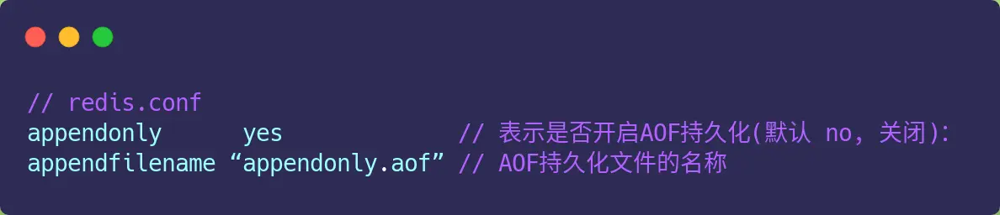
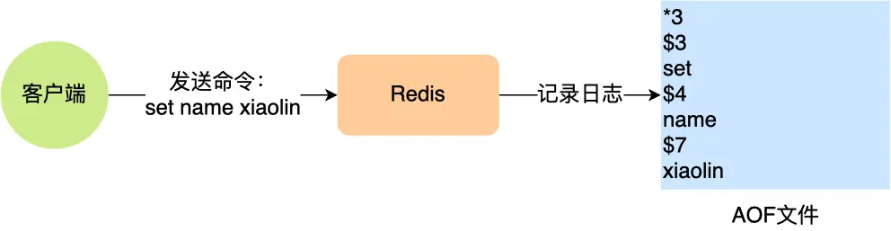
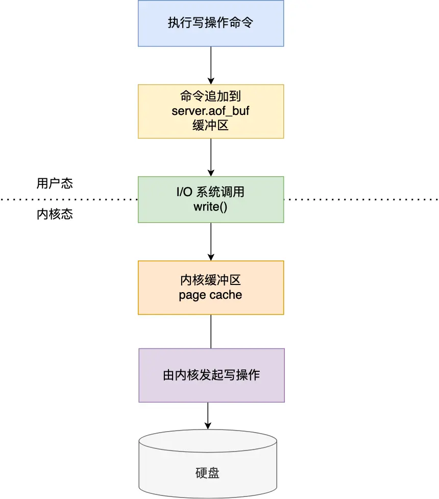
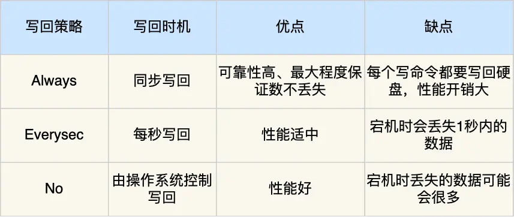
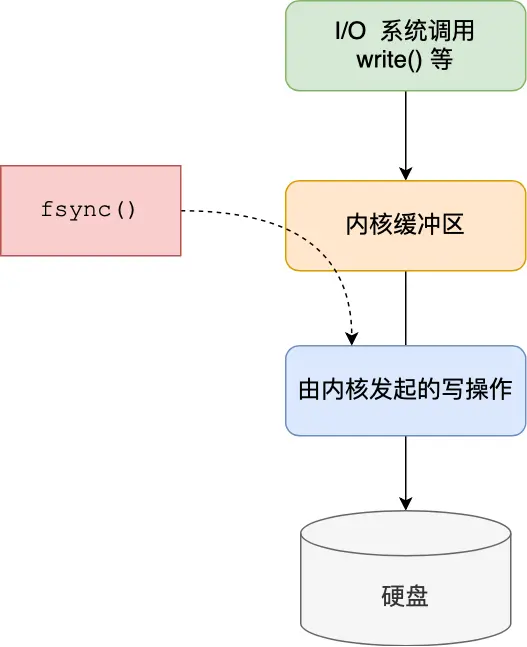
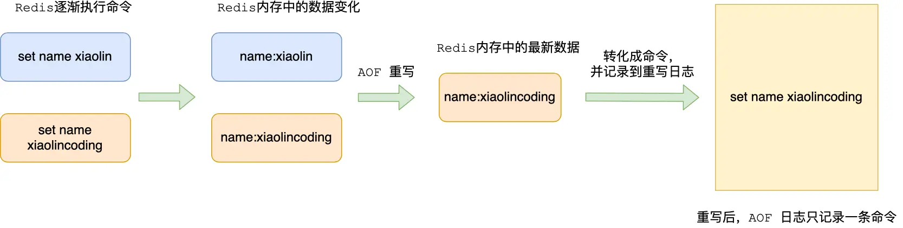
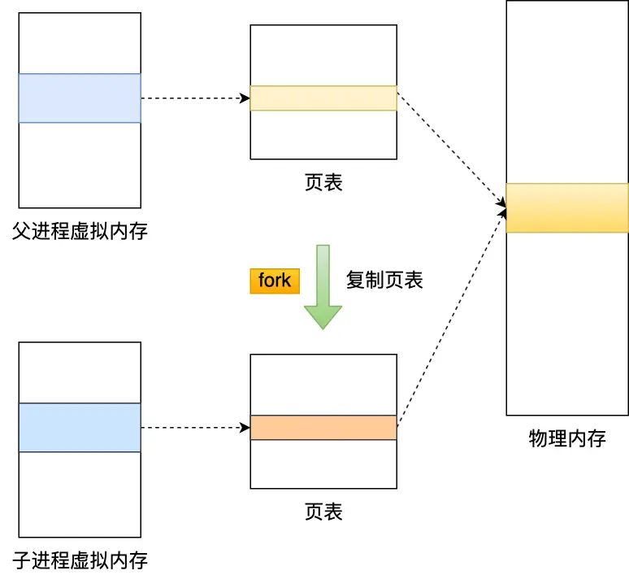
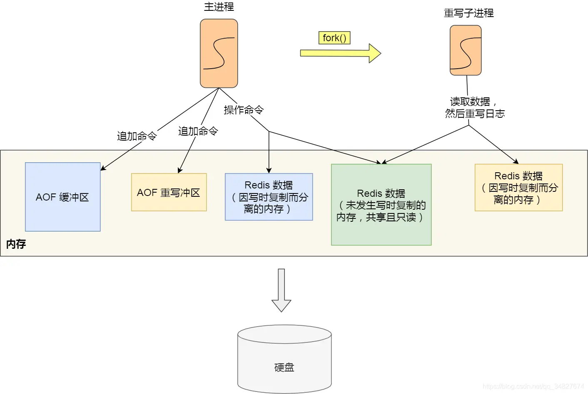

# Redis AOF 持久化：给数据库写"日记"

## 什么是AOF？一个简单的比喻

想象一下，你每天都在记日记，把今天做了什么事情都详细记录下来：
- "今天买了一个苹果"
- "把苹果吃掉了"
- "又买了一个橙子"

如果有一天你失忆了，只要翻看日记，按照上面记录的事情重新做一遍，就能恢复到失忆前的状态。

**Redis的AOF持久化就是这个道理！**


AOF (Append Only File) 就是Redis的"日记本"：
- 每当有人修改数据（写操作），Redis就把这个操作记录到AOF文件里
- 如果Redis重启了，它就读取AOF文件，把里面的操作重新执行一遍
- 这样数据就恢复了！

> **注意**：Redis只记录"写操作"（增删改），不记录"读操作"，因为读操作不会改变数据，记录了也没用。

## 开启AOF功能

AOF功能默认是关闭的，需要在配置文件里开启：

```bash
# 在 redis.conf 文件中设置
appendonly yes
```



## AOF文件长什么样？

AOF文件其实就是个普通的文本文件，我们来看个例子。

当你执行 `set name xiaolin` 这个命令时，AOF文件里会记录：



这看起来有点复杂，让我解释一下：
- `*3`：表示这个命令有3个部分
- `$3 set`：表示第一部分是"set"，长度是3个字符
- `$4 name`：表示第二部分是"name"，长度是4个字符  
- `$7 xiaolin`：表示第三部分是"xiaolin"，长度是7个字符

就像是把 `set name xiaolin` 这个命令拆解并详细记录下来。

## AOF的两个优点

Redis采用了"**先执行命令，再记录日志**"的方式，这样做有两个好处：

### 优点1：避免记录错误命令
就像写日记一样，你只会记录真正发生的事情。如果命令执行失败了，Redis就不会把它写进AOF文件，保证AOF里的命令都是正确的。

### 优点2：不影响当前操作的速度
因为是先执行再记录，所以当前的命令不会被记录操作拖慢。

## AOF的两个风险

当然，这种方式也有风险：

### 风险1：数据丢失
就像写日记一样，如果你刚做完一件事，还没来得及记到日记里，突然失忆了，这件事就丢了。

Redis也是一样，如果刚执行完命令，还没来得及写入硬盘，服务器就宕机了，这个数据就丢了。

### 风险2：可能影响下一个操作
虽然当前操作不受影响，但如果写日记的过程很慢（比如硬盘很忙），就会影响下一个操作。

## 三种写入策略：什么时候把日记写到硬盘？



Redis写入AOF的过程分三步：
1. **执行命令**：比如执行 `set name xiaolin`
2. **写入缓冲区**：先把命令写到内存的缓冲区里
3. **写入硬盘**：再从缓冲区写到硬盘上

第三步"什么时候写入硬盘"有三种策略：

### 策略1：Always（总是立即写入）
**特点**：每执行一个写命令，立即写入硬盘
- **优点**：数据最安全，几乎不会丢失
- **缺点**：速度最慢，因为每次都要等硬盘写入完成

**适用场景**：对数据安全要求极高的场景

### 策略2：Everysec（每秒写入一次）
**特点**：每秒钟把缓冲区的内容写入硬盘一次
- **优点**：平衡了安全性和性能
- **缺点**：最多可能丢失1秒的数据

**适用场景**：大多数应用的推荐选择

### 策略3：No（交给操作系统决定）
**特点**：Redis不管，由操作系统决定什么时候写入硬盘
- **优点**：性能最好
- **缺点**：可能丢失较多数据

**适用场景**：对性能要求高，能容忍数据丢失的场景



### 三种策略的技术原理

这三种策略其实是在控制`fsync()`函数的调用时机：



- **Always**：每次写入后立即调用fsync()
- **Everysec**：创建后台任务每秒调用fsync()
- **No**：从不调用fsync()，让操作系统自己决定

> **fsync()函数**：告诉操作系统"现在立即把数据写到硬盘上"，不要再等了。

## AOF重写：给日记本"瘦身"

### 为什么需要重写？

想象一下，你的日记本记录了：
- "买了一个苹果"
- "把苹果吃掉了"  
- "又买了一个苹果"
- "把苹果又吃掉了"
- "再买了一个苹果"

日记本越来越厚，但其实最后的状态就是"有一个苹果"。如果重写日记，只需要写"有一个苹果"就够了。



**AOF重写就是这个道理**：
- 不管一个数据被修改了多少次
- 重写时只看它现在的最终状态
- 用一条命令就能表示这个状态

### 重写的好处

1. **AOF文件变小**：减少了冗余命令
2. **恢复数据更快**：执行的命令更少了
3. **节省存储空间**：文件小了，占用磁盘空间少

### 为什么要创建新文件？

重写时不直接修改原AOF文件，而是创建一个新文件，原因很简单：
- 如果重写过程中出错了，原文件还在，数据不会丢失
- 就像重新写一本新日记，写坏了大不了扔掉，原来的日记还在

## AOF后台重写：不影响正常服务

### 为什么要后台重写？

重写AOF文件是个耗时的工作，就像整理一本很厚的日记本。如果Redis停下来专门做这件事，就没法处理用户的请求了。

所以Redis采用了**"分身术"**：



1. **主进程**：继续处理用户请求
2. **子进程**：专门负责重写AOF文件

### 写时复制技术：神奇的"分身术"

当Redis需要重写AOF时：

1. **创建子进程**：Redis创建一个"分身"（子进程）
2. **共享内存**：分身和本体共享同一份数据，节省内存
3. **写时复制**：如果本体修改了数据，操作系统会自动为分身复制一份独立的数据


这就像是：
- 你和你的分身共享一本笔记本
- 平时你们都只是看笔记本，没问题
- 如果你要修改笔记，系统会自动给分身复印一份独立的笔记本
- 这样你们各自修改各自的，互不影响

### 数据一致性问题：怎么保证分身的数据是最新的？

问题来了：分身在重写AOF期间，本体还在处理新的命令，这样分身的数据就不是最新的了。

Redis的解决方案是"**双写**"：



在重写期间，每个写命令都会被写入两个地方：
1. **AOF缓冲区**：正常的AOF文件
2. **AOF重写缓冲区**：专门给重写用的缓冲区

当分身完成重写后：
1. 分身告诉本体："我写完了！"
2. 本体把重写缓冲区里的新命令追加到新AOF文件后面
3. 用新AOF文件替换掉旧的AOF文件

这样就保证了数据的完整性和一致性。

### 哪些操作会阻塞主进程？

虽然重写是在后台进行的，但有两个时候会阻塞主进程：

1. **创建子进程时**：需要复制页表等数据结构，数据越大阻塞时间越长
2. **写时复制时**：如果修改的是大数据（bigkey），复制内存的时间会比较长

## 总结：AOF就像给数据库写日记

让我们用最简单的话总结一下AOF：

1. **基本原理**：像写日记一样，把每个写操作都记录下来
2. **恢复数据**：重启时按照日记重新执行一遍操作
3. **写入策略**：可以选择立即写入、每秒写入或让系统决定
4. **文件重写**：定期整理日记，去掉重复和过时的内容
5. **后台重写**：用"分身"来整理日记，不影响正常工作

**选择建议**：
- 要求数据绝对安全：选择Always策略
- 平衡安全和性能：选择Everysec策略（推荐）
- 追求最高性能：选择No策略

AOF持久化虽然恢复数据比较慢（因为要重新执行所有命令），但它的优点是数据丢失少，特别适合对数据安全要求高的场景。

---

**参考资料**
- 《Redis 设计与实现》
- 《Redis 核心技术与实战 - 极客时间》
- 《Redis 源码分析》
