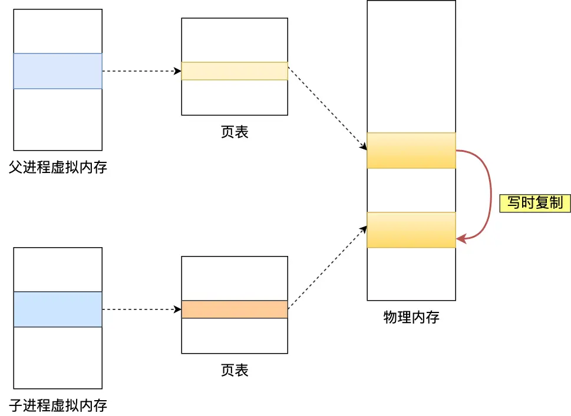

# Redis 大 Key 对持久化有什么影响？

有位读者在字节跳动一二面时，被问到：**Redis 的大 Key 对持久化有什么影响？**

这是一个很实际的问题，因为在实际工作中，我们经常会遇到一些特别大的数据，比如一个包含几万条记录的列表，或者一个几MB的字符串。这些"大家伙"会给Redis的数据持久化带来什么麻烦呢？

Redis 有两种把数据保存到硬盘的方式：**AOF 日志**和 **RDB 快照**。就像我们平时既会写日记记录每天做了什么（AOF），也会定期拍照留念（RDB）一样。

接下来，我们分别看看大Key是如何影响这两种持久化方式的。

## 大 Key 对 AOF 日志的影响

### AOF 的三种写入策略

首先要了解 Redis 提供的 3 种 AOF 日志写回硬盘的策略：

1. **Always（总是写入）**：每次执行写操作后，立即把数据同步到硬盘
   - 就像写日记时，每写一句话就保存一次文件

2. **Everysec（每秒写入）**：每次写操作后先放到内存缓冲区，每秒统一写入硬盘
   - 就像写日记时，先写在草稿纸上，每过一段时间再誊写到正式的日记本

3. **No（操作系统决定）**：写操作后放到内存缓冲区，让操作系统自己决定什么时候写入硬盘
   - 就像把日记放在那里，什么时候整理完全看心情

为了保证数据真正写到硬盘上，需要调用一个叫 `fsync()` 的函数。你可以把它想象成"强制保存"按钮。


### 不同策略下大Key的影响

**Always 策略的问题最严重**：
- 每次操作大Key时，主线程必须等待 `fsync()` 函数执行完成
- **就像你要把一本厚厚的书完整抄写一遍，在抄完之前什么也不能做**
- 如果大Key有几MB大小，这个等待时间可能会很长，Redis 就"卡"住了

**Everysec 策略相对较好**：
- 因为 `fsync()` 是异步执行的（在后台进行），主线程不会被阻塞
- 就像有个助手帮你抄写，你可以继续做其他事情

**No 策略不受影响**：
- 从不主动调用 `fsync()`，所以不会因为大Key而阻塞主线程

> **小结**：如果使用 Always 策略，大Key会让Redis主线程"卡"很久；其他两种策略影响较小。

## 大 Key 对 AOF 重写和 RDB 的影响

### 什么时候会触发问题？

当AOF日志文件因为记录了很多大Key而变得很大时，Redis会启动 **AOF 重写机制** 来压缩文件大小。

无论是AOF重写还是RDB快照，都需要通过 `fork()` 函数创建一个"子进程"来处理。你可以把这理解为：**Redis 主线程要"克隆"一个自己出来专门干活，自己继续接待客户**。

### fork 过程中的问题

#### 第一个问题：复制页表耗时

创建子进程时，操作系统需要复制父进程的"页表"（一个记录虚拟地址和物理地址对应关系的表格）。


**简单类比**：
- 想象Redis的内存就像一个大图书馆
- 页表就像图书馆的索引目录，记录着"第几本书在第几个书架"
- 创建子进程时，需要把这个目录完整复制一份给子进程
- **如果Redis存储了很多大Key，就像图书馆藏书特别多，索引目录就会很厚，复制起来就很慢**

**具体影响**：
- 页表越大，复制时间越长
- 复制期间，Redis 主线程会被阻塞，无法处理客户端请求
- 可以通过 `info` 命令查看 `latest_fork_usec` 指标来了解最近一次 fork 耗时

```sql
# 最近一次 fork 操作耗时（微秒）
latest_fork_usec:315
```

#### 第二个问题：写时复制机制

fork 完成后，父子进程共享同一份物理内存，但都标记为"只读"。当任何一方要修改数据时，就会触发"**写时复制**"机制。



**生活化类比**：
- 想象你和室友共用一本菜谱（共享内存）
- 一开始大家都只是看看（只读状态）
- 当你想在菜谱上做笔记时（写操作），就必须把这一页完整复印一份给自己用（写时复制）
- **如果要修改的是一道很复杂的菜谱（大Key），复印的时间就会很长**

**实际影响**：
- 如果父进程修改了大Key，需要复制对应的物理内存
- 大Key占用的内存越大，复制时间越长
- 复制期间，父进程（Redis主线程）会被阻塞

### 内存大页的额外影响

Linux系统有个"内存大页"功能，默认情况下内存按4KB为单位分配，开启大页后按2MB为单位分配。

**问题在哪里**？
- 正常情况：修改100B数据，只需复制4KB内存页
- 开启大页：修改100B数据，需要复制整个2MB大页
- **相当于本来只需要复印一小段文字，现在要复印整张A4纸，效率差了512倍！**

**解决方法**：关闭内存大页（默认已关闭）
```shell
echo never > /sys/kernel/mm/transparent_hugepage/enabled
```

### 优化建议

如果发现 fork 耗时很长（比如超过1秒），可以这样优化：

1. **控制实例大小**：单个Redis实例内存控制在10GB以下
2. **关闭不必要的持久化**：如果只当缓存用，可以关闭AOF和AOF重写
3. **调整主从配置**：适当调大 `repl-backlog-size`，避免频繁全量同步

> **小结**：大Key会在两个阶段影响Redis：fork时复制页表耗时，写时复制时复制内存耗时。内存越大，问题越严重。

## 大Key的其他影响

除了持久化问题，大Key还会带来以下麻烦：

### 1. 客户端超时
- Redis是单线程处理命令的
- **就像银行只有一个柜台，如果前面有人办理复杂业务（操作大Key），后面的人都要等**
- 客户端会觉得Redis"卡死"了

### 2. 网络阻塞
- 每次获取大Key会产生大量网络流量
- **例如**：1MB的大Key，每秒访问1000次，就会产生1000MB/秒的流量
- 对于普通千兆网卡来说是灾难性的

### 3. 阻塞工作线程
- 使用 `DEL` 删除大Key时会阻塞主线程
- **就像清理一个特别大的垃圾堆，清理期间什么都干不了**

### 4. 内存分布不均
- 在集群环境中，有大Key的节点内存占用更多
- **就像班级里有几个同学书包特别重，负担不均**

## 如何避免大Key问题？

### 设计阶段预防
- **最重要**：在设计时就把大Key拆分成多个小Key
- **例如**：把一个包含万条记录的列表，拆分成多个小列表

### 运维阶段处理
1. **定期检查**：使用工具定期扫描Redis中的大Key
2. **安全删除**：不要用 `DEL` 删除大Key，改用 `UNLINK`（Redis 4.0+）
   - `DEL`：同步删除，会阻塞主线程
   - `UNLINK`：异步删除，不会阻塞主线程

## 总结

**大Key对持久化的影响可以用一句话概括：越大的东西，处理起来越费时间。**

具体来说：

1. **AOF Always策略**：大Key写入时，fsync耗时长，主线程被阻塞
2. **AOF重写和RDB**：fork时复制页表耗时，写时复制时复制内存耗时
3. **优化原则**：控制Key大小，合理配置持久化策略，定期监控性能指标

记住：**预防胜于治疗，在设计阶段就避免大Key是最好的解决方案！**

完！
