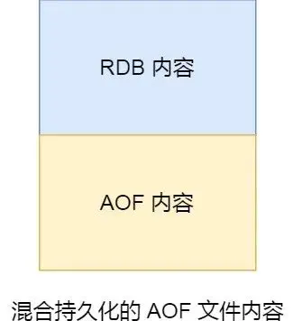

# Redis RDB 快照：给内存数据拍个"照片"

大家好，我是小林哥！

想象一下你在旅游时拍照片📷，每张照片都记录了那一瞬间的美好画面。Redis 的 RDB 快照就像给内存数据拍照片一样，把某个时刻内存中的所有数据完整地保存到磁盘上。

## 什么是RDB快照？

Redis 虽然是内存数据库，但为了防止数据丢失，它提供了两种数据持久化方案：
- **AOF 日志**：记录每个操作命令，就像记录日记📝
- **RDB 快照**：直接保存数据本身，就像拍照片📸

**简单对比：**
- RDB 保存的是数据的"照片"（二进制数据）
- AOF 保存的是操作的"日记"（命令日志）

**恢复速度对比：**
- RDB：直接把"照片"放回内存，速度快⚡
- AOF：要重新执行"日记"里的每个命令，速度慢🐌

## RDB快照怎么用？

Redis 提供了两个拍照命令：

### 1. save 命令 - 同步拍照
```bash
save
```
**特点：**
- 在主线程中执行
- 拍照期间Redis被"冻住"，无法处理其他请求❄️
- 适合：Redis即将关闭时使用

### 2. bgsave 命令 - 异步拍照（推荐）
```bash
bgsave
```
**特点：**
- 创建子进程去拍照
- 主线程继续工作，不影响用户请求✅
- 适合：日常使用

### 3. 自动拍照设置

在配置文件中设置自动拍照条件：

```bash
# 900秒内有1次修改就拍照
save 900 1
# 300秒内有10次修改就拍照
save 300 10  
# 60秒内有10000次修改就拍照
save 60 10000
```

**注意：** 虽然配置名叫`save`，实际执行的是`bgsave`

**拍照频率的权衡：**
- 🔄 **频率太高**：影响性能，占用资源多
- 🔄 **频率太低**：故障时丢失数据多
- 📋 **建议**：至少5分钟拍一次，最多可能丢失5分钟数据

## 拍照时数据还能修改吗？

**问题：** bgsave 拍照期间，用户还能修改数据吗？

**答案：** 能！这得益于一个巧妙的技术——**写时复制（COW）**

### 写时复制技术原理

用一个生活化的比喻来理解👨‍👩‍👧‍👦：

**场景：** 爸爸要给全家福拍照，但是拍照期间孩子们还要继续玩耍

**解决方案：**
1. **共享阶段**：拍照开始时，爸爸和孩子们在同一个房间
2. **不变的情况**：如果孩子们只是安静地看，大家继续在一个房间
3. **有变化的情况**：如果某个孩子要重新摆姿势，就把他/她带到另一个房间

**技术实现：**

#### 第1步：创建子进程（开始拍照）


- 父进程（主线程）和子进程最初共享同一块内存
- 就像爸爸和孩子们在同一个房间

#### 第2步：发生数据修改（写时复制）


当需要修改数据时：
- 系统会复制一份数据给父进程
- 父进程在新数据上修改
- 子进程继续使用原数据拍照

**核心优势：**
✅ 拍照不会阻塞正常业务
✅ 节省内存（只在修改时才复制）
✅ 保证拍照数据的一致性

### ⚠️ 注意事项

**内存占用风险：**
- 极端情况下，如果拍照期间所有数据都被修改
- 内存占用可能达到原来的2倍！
- **建议：** 写操作频繁时要监控内存使用情况

**数据时效性：**
- RDB保存的是拍照那一瞬间的数据
- 拍照期间的修改不会被保存
- 只能等下次拍照才能保存新的修改

## RDB + AOF 混合持久化：鱼和熊掌兼得

### 单独使用的问题

**RDB的问题：**
- ❌ 可能丢失较多数据（两次拍照间隔内的数据）
- ✅ 恢复速度快

**AOF的问题：**
- ✅ 丢失数据少（最多1秒）
- ❌ 恢复速度慢

### 混合持久化：完美结合

**开启方式：**
```bash
# 在redis.conf中设置
aof-use-rdb-preamble yes
```

**工作原理：**


混合持久化生成的AOF文件结构：
```
[RDB格式数据] + [AOF格式增量数据]
```

**具体流程：**
1. **AOF重写时**：先把当前内存数据用RDB格式写入
2. **重写期间**：新的操作命令用AOF格式追加
3. **最终结果**：一个文件包含RDB快照+AOF增量

**混合持久化的优势：**
- 🚀 **恢复快**：先快速加载RDB部分
- 🛡️ **丢失少**：再加载AOF增量部分
- 💾 **文件小**：RDB部分压缩率高

## 总结

| 特性 | RDB | AOF | 混合持久化 |
|------|-----|-----|-----------|
| 恢复速度 | 快⚡ | 慢🐌 | 快⚡ |
| 数据完整性 | 一般😐 | 好😊 | 好😊 |
| 文件大小 | 小📦 | 大📂 | 中等📋 |
| 性能影响 | 低💚 | 中等💛 | 低💚 |

**使用建议：**
- 🎯 **高性能场景**：单独使用RDB
- 🛡️ **高可靠性场景**：单独使用AOF  
- 🏆 **生产环境推荐**：开启混合持久化，兼顾性能和可靠性

记住：数据持久化就像备份重要文件，选择合适的策略才能在性能和安全之间找到最佳平衡点！📚✨
