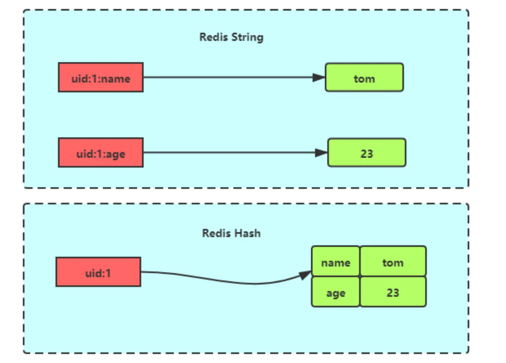
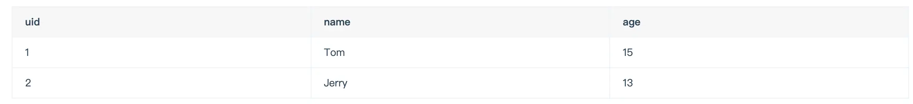
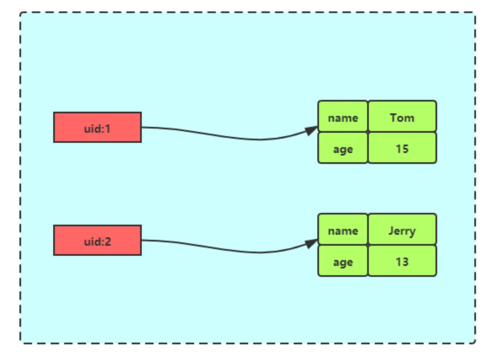
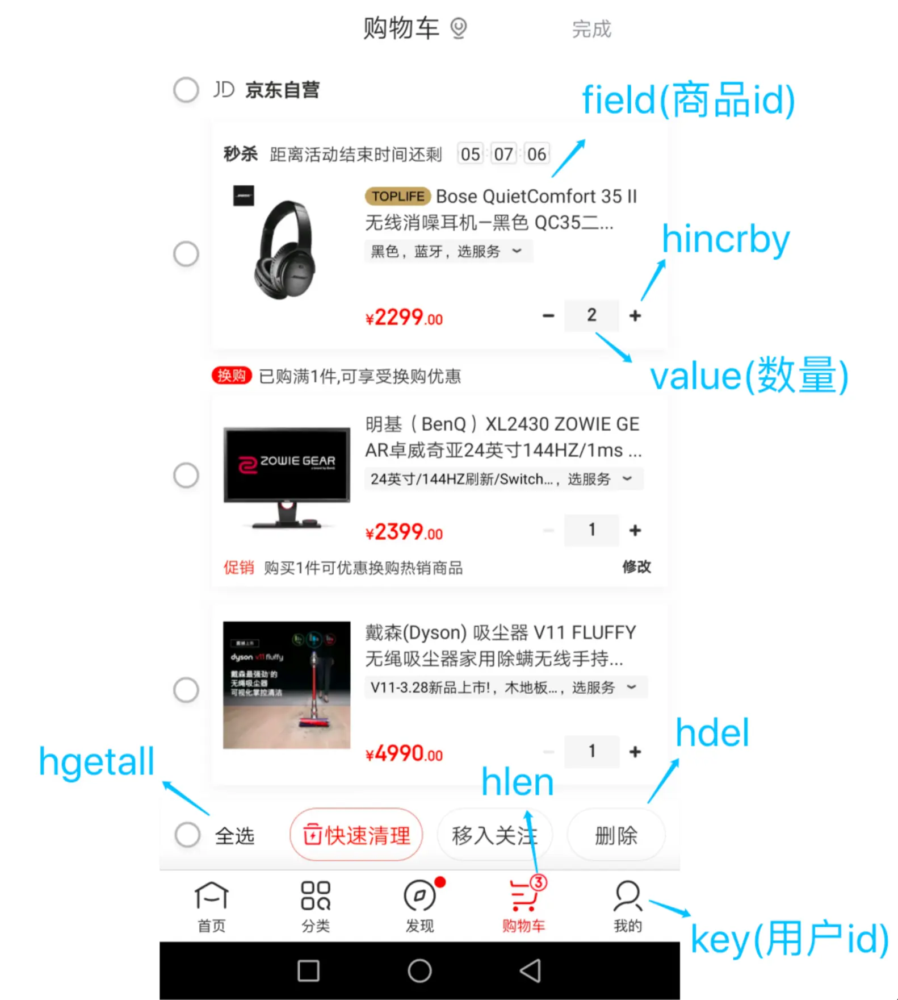

## 一、Hash 类型简介

Redis 中的 Hash 类型是一个键值对（key-value pair）集合，其特殊之处在于它的值（value）本身也是一个键值对的集合，形式如：`value=[{field1, value1}, {field2, value2}, ..., {fieldN, valueN}]`。这种结构使得 Hash 类型非常适合用来存储对象及其属性。

与直接将对象序列化为 JSON 字符串后存入 String 类型相比，Hash 类型允许对对象中的单个字段进行独立的读写操作，而无需读取和反序列化整个对象，这在某些场景下可以提供更高的效率和灵活性。

下图展示了 Hash 与 String 对象在存储对象时的概念性区别：


*图1: Redis Hash 与 String 存储对象对比*

## 二、内部实现

Hash 类型的底层数据结构主要依赖于两种实现方式：**压缩列表（ziplist）/ listpack** 和 **哈希表（hashtable）**。Redis 会根据存储的数据规模动态选择：

1. **压缩列表 (ziplist) / listpack**:

   * 当哈希对象中包含的键值对数量较少，并且所有键（field）和值（value）的字符串长度都较短时，Redis 会采用压缩列表（ziplist）来存储 Hash。
   * 具体阈值由以下两个配置参数决定：
     * `hash-max-ziplist-entries`：哈希对象包含的键值对数量上限（默认值为 `512`）。
     * `hash-max-ziplist-value`：哈希对象中每个值（value）的字节长度上限（默认值为 `64` 字节）。
   * **重要演进**：在 Redis 7.0 及更高版本中，`ziplist` 已被更优化的 `listpack` 数据结构所取代。`listpack` 解决了 `ziplist` 在更新操作时可能引发连锁更新（cascade update）的问题，提高了性能和空间效率。因此，在现代 Redis 版本中，当满足上述条件时，底层使用的是 `listpack`。
2. **哈希表 (hashtable)**:

   * 如果哈希对象中的键值对数量超过 `hash-max-ziplist-entries`，或者任一键或值的长度超过 `hash-max-ziplist-value`，Redis 则会自动将底层数据结构转换为哈希表（也称为字典，dict）。
   * 哈希表通过链式哈希解决冲突，并在负载因子达到一定阈值时进行动态扩容（rehash），以保证查询效率。

这种动态切换底层数据结构的设计，旨在平衡内存使用和操作效率。对于小型 Hash 对象，`listpack`（或早期的 `ziplist`）能有效节省内存；而对于大型 Hash 对象，哈希表则能提供更高效的查找、插入和删除操作。

## 三、常用命令

以下是 Redis Hash 类型的一些常用操作命令：

```shell
# 设置单个 field 的值
HSET key field value

# 获取单个 field 的值
HGET key field

# 一次性设置多个 field 的值
HMSET key field1 value1 [field2 value2 ...]

# 一次性获取多个 field 的值
HMGET key field1 [field2 value2 ...]

# 删除一个或多个 field
HDEL key field1 [field2 ...]

# 获取哈希表中 field 的数量
HLEN key

# 获取哈希表中所有的 field 和 value
HGETALL key

# 获取哈希表中所有的 field
HKEYS key

# 获取哈希表中所有的 value
HVALS key

# 判断哈希表中指定 field 是否存在
HEXISTS key field

# 为哈希表 key 中指定 field 的整数值加上增量 increment
HINCRBY key field increment

# 为哈希表 key 中指定 field 的浮点数值加上增量 increment
HINCRBYFLOAT key field increment

# 获取哈希表中指定 field 的字符串长度
HSTRLEN key field
```

**注意事项**:

- `HMSET` 在较新版本的 Redis 中已被 `HSET` 取代（`HSET` 现在可以一次设置多个字段）。但为了兼容性，`HMSET` 仍然可用。
- `HGETALL` 命令在哈希对象很大时可能会阻塞 Redis 服务器，因为它需要遍历整个哈希表。对于大型哈希，应谨慎使用，或考虑使用 `HSCAN` 命令进行分批迭代。

## 四、应用场景

Hash 类型因其结构特性，在多种场景下都有广泛应用。

### 1. 缓存对象信息

Hash 类型的 `(key, field, value)` 结构与程序中对象的 `(对象标识, 属性名, 属性值)` 结构天然对应，因此非常适合用来缓存对象信息。

例如，一个用户信息对象在关系型数据库中的结构可能如下：


*图2: 用户信息表结构示例*

我们可以使用 Hash 类型来存储这些用户信息：

```shell
# 存储用户ID为1的信息
> HSET user:1 name "Tom" age 25 email "tom@example.com"
(integer) 3

# 存储用户ID为2的信息
> HSET user:2 name "Jerry" age 22 city "New York"
(integer) 3

# 获取用户ID为1的所有信息
> HGETALL user:1
1) "name"
2) "Tom"
3) "age"
4) "25"
5) "email"
6) "tom@example.com"

# 获取用户ID为2的姓名和城市
> HMGET user:2 name city
1) "Jerry"
2) "New York"
```

Redis Hash 存储其结构如下图所示：


*图3: Redis Hash 存储对象结构示例*

**与 String + JSON 对比**:

虽然将对象序列化为 JSON 字符串后存储在 String 类型中也是一种常见的缓存对象的方式，但 Hash 类型在以下方面具有优势：

- **部分更新**: 如果只需要修改对象的某个属性，使用 Hash 可以直接通过 `HSET` 更新该字段，而无需读取、反序列化、修改再序列化、写回整个 JSON 对象。
- **字段级原子操作**: Hash 提供了如 `HINCRBY` 这样的原子操作，可以直接对对象属性进行原子增减。
- **可读性**: 直接存储字段名和值，在 Redis 客户端中查看数据时可能更直观。

**选择策略**:

- 对于需要频繁更新对象部分属性，或者需要对属性进行原子操作的场景，Hash 类型是更好的选择。
- 如果对象属性不常变动，或者总是需要整体读写对象，String + JSON 的方式可能更简单，序列化/反序列化的开销在某些情况下也可以接受。
- 一种混合策略是：将对象的主要、不常变动的属性用 String + JSON 存储，而将频繁变动或需要原子操作的属性（如计数器）单独用 Hash 存储，或者存储在同一个 Hash 的不同字段中。

### 2. 购物车实现

购物车功能是 Hash 类型的另一个经典应用场景。我们可以将用户 ID 作为 key，商品 ID 作为 field，商品数量作为 value。


*图4: 购物车使用 Hash 存储示例*

购物车相关操作命令示例：

- **添加商品到购物车/增加商品数量**:
  ```shell
  # 如果商品已存在，则数量加1；如果不存在，则添加商品，数量为1
  HINCRBY cart:user123 product:1001 1
  ```
- **减少商品数量**:
  ```shell
  # 数量减1。如果减到0或以下，可能需要后续逻辑HDEL删除该商品
  HINCRBY cart:user123 product:1001 -1
  ```
- **直接设置商品数量**:
  ```shell
  HSET cart:user123 product:1002 5
  ```
- **获取购物车中商品总数（种类数）**:
  ```shell
  HLEN cart:user123
  ```
- **删除购物车中指定商品**:
  ```shell
  HDEL cart:user123 product:1001
  ```
- **获取购物车中所有商品及其数量**:
  ```shell
  HGETALL cart:user123
  ```
- **清空购物车**:
  ```shell
  DEL cart:user123
  ```

**注意**:
这种方式只在 Redis 中存储了商品 ID 和数量。在向用户展示购物车时，通常还需要根据商品 ID 从数据库或其他服务查询商品的详细信息（如名称、价格、图片等）。

## 五、总结

Redis 的 Hash 类型提供了一种高效存储和操作结构化数据的方式，特别适合表示对象。其底层的 `listpack` (或 `ziplist`) 和哈希表动态转换机制，使其在不同数据规模下都能保持较好的性能和内存效率。理解其内部实现和常用命令，有助于在实际应用中更好地利用 Hash 类型解决问题，如对象缓存、购物车管理等。
