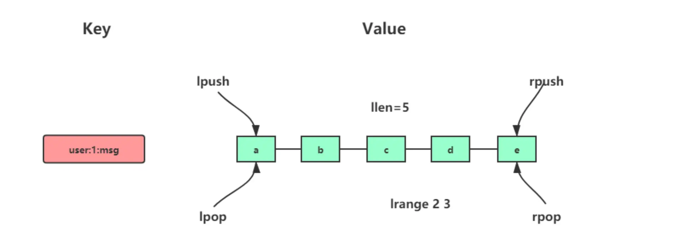
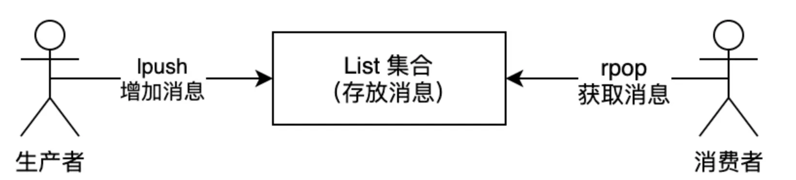
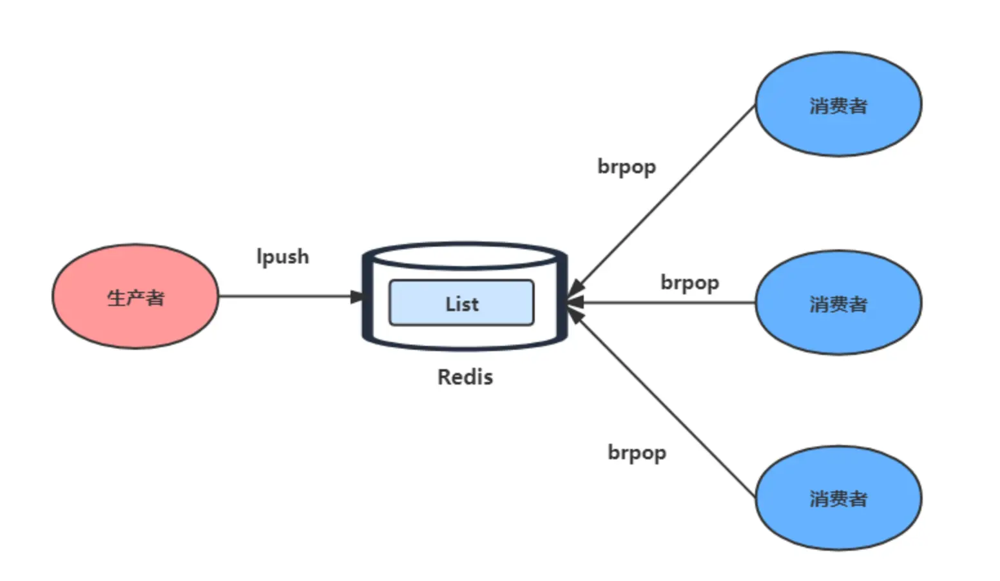

## List

### 介绍

List 列表是 Redis 中的基础数据类型之一，它是一个简单的字符串列表，**按照插入顺序排序**。List 的特点是支持双向操作，可以从头部（左侧）或尾部（右侧）向列表添加或移除元素。

列表的最大长度为 $2^{32} - 1$（即 4,294,967,295），也就是每个列表最多可以存储超过 **40 亿**个元素，足以满足绝大多数应用场景的需求。

List 类型具有以下主要特性：

- 有序性：元素按照插入顺序排列
- 可重复性：同一个元素可以多次出现在列表中
- 双向操作：支持从两端进行插入和弹出操作
- 阻塞操作：支持阻塞式的弹出操作，适合实现队列

### 内部实现

List 类型的底层数据结构经历了多次演进：

- 在 Redis 3.2 版本之前，List 由**双向链表或压缩列表**实现：

  - 如果列表的元素个数小于 `512` 个（默认值，可由 `list-max-ziplist-entries` 配置），列表每个元素的值都小于 `64` 字节（默认值，可由 `list-max-ziplist-value` 配置），Redis 会使用**压缩列表（ziplist）**作为 List 类型的底层数据结构；
  - 如果列表的元素不满足上面的条件，Redis 会使用**双向链表（linkedlist）**作为 List 类型的底层数据结构；
- **在 Redis 3.2 版本及之后，List 数据类型底层数据结构统一由 quicklist 实现**，替代了之前的双向链表和压缩列表。

**quicklist** 是一个双向链表，但它的每个节点都是一个压缩列表。这种设计结合了双向链表和压缩列表的优点：既保留了链表的灵活性（便于在两端进行操作），又利用了压缩列表的空间效率优势。通过将多个元素存储在一个压缩列表中，quicklist 减少了链表节点的数量和内存碎片。

### 常用命令



```shell
# 将一个或多个值value插入到key列表的表头(最左边)，最后的值在最前面
LPUSH key value [value ...] 

# 将一个或多个值value插入到key列表的表尾(最右边)
RPUSH key value [value ...]

# 移除并返回key列表的头元素
LPOP key   

# 移除并返回key列表的尾元素
RPOP key 

# 返回列表key中指定区间内的元素，区间以偏移量start和stop指定，从0开始
LRANGE key start stop

# 从key列表表头弹出一个元素，没有就阻塞timeout秒，如果timeout=0则一直阻塞
BLPOP key [key ...] timeout

# 从key列表表尾弹出一个元素，没有就阻塞timeout秒，如果timeout=0则一直阻塞
BRPOP key [key ...] timeout

# 返回列表的长度
LLEN key

# 通过索引获取列表中的元素
LINDEX key index

# 在列表的元素前或者后插入元素
LINSERT key BEFORE|AFTER pivot value

# 将列表 source 中的最后一个元素弹出并返回，然后将该元素插入到列表 destination 的头部
RPOPLPUSH source destination

# RPOPLPUSH的阻塞版本
BRPOPLPUSH source destination timeout
```

### 应用场景

#### 消息队列

消息队列在存取消息时，必须要满足三个需求，分别是**消息保序、处理重复的消息和保证消息可靠性**。

Redis 的 List 和 Stream 两种数据类型，都可以满足消息队列的这三个需求。我们先来了解下基于 List 的消息队列实现方法。

*1、如何满足消息保序需求？*

List 本身就是按先进先出的顺序对数据进行存取的，所以，如果使用 List 作为消息队列保存消息的话，就已经能满足消息保序的需求了。

List 可以使用 LPUSH + RPOP（或者反过来，RPUSH+LPOP）命令实现消息队列。



- 生产者使用 `LPUSH key value[value...]` 将消息插入到队列的头部，如果 key 不存在则会创建一个空的队列再插入消息。
- 消费者使用 `RPOP key` 依次读取队列的消息，先进先出。

不过，在消费者读取数据时，有一个潜在的性能风险点。

在生产者往 List 中写入数据时，List 并不会主动地通知消费者有新消息写入，如果消费者想要及时处理消息，就需要在程序中不停地调用 `RPOP` 命令（比如使用一个 while(1) 循环）。如果有新消息写入，RPOP 命令就会返回结果，否则，RPOP 命令返回空值，再继续循环。

所以，即使没有新消息写入 List，消费者也要不停地调用 RPOP 命令，这就会导致消费者程序的 CPU 一直消耗在执行 RPOP 命令上，带来不必要的性能损失。

为了解决这个问题，Redis 提供了 BRPOP 命令。**BRPOP 命令也称为阻塞式读取，客户端在没有读到队列数据时，自动阻塞，直到有新的数据写入队列，再开始读取新数据**。和消费者程序自己不停地调用 RPOP 命令相比，这种方式能节省 CPU 开销。



*2、如何处理重复的消息？*

消费者要实现重复消息的判断，需要 2 个方面的要求：

- 每个消息都有一个全局的 ID。
- 消费者要记录已经处理过的消息的 ID。当收到一条消息后，消费者程序就可以对比收到的消息 ID 和记录的已处理过的消息 ID，来判断当前收到的消息有没有经过处理。如果已经处理过，那么，消费者程序就不再进行处理了。

但是 **List 并不会为每个消息生成 ID 号，所以我们需要自行为每个消息生成一个全局唯一 ID**，生成之后，我们在用 LPUSH 命令把消息插入 List 时，需要在消息中包含这个全局唯一 ID。

例如，我们执行以下命令，就把一条全局 ID 为 111000102、库存量为 99 的消息插入了消息队列：

```shell
> LPUSH mq "111000102:stock:99"
(integer) 1
```

*3、如何保证消息可靠性？*

当消费者程序从 List 中读取一条消息后，List 就不会再留存这条消息了。所以，如果消费者程序在处理消息的过程出现了故障或宕机，就会导致消息没有处理完成，那么，消费者程序再次启动后，就没法再次从 List 中读取消息了。

为了留存消息，List 类型提供了 `BRPOPLPUSH` 命令，这个命令的**作用是让消费者程序从一个 List 中读取消息，同时，Redis 会把这个消息再插入到另一个 List（可以叫作备份 List）留存**。

这样一来，如果消费者程序读了消息但没能正常处理，等它重启后，就可以从备份 List 中重新读取消息并进行处理了。

好了，到这里可以知道基于 List 类型的消息队列，满足消息队列的三大需求（消息保序、处理重复的消息和保证消息可靠性）。

- 消息保序：使用 LPUSH + RPOP；
- 阻塞读取：使用 BRPOP；
- 重复消息处理：生产者自行实现全局唯一 ID；
- 消息的可靠性：使用 BRPOPLPUSH

> List 作为消息队列有什么缺陷？

**List 不支持多个消费者消费同一条消息**，因为一旦消费者拉取一条消息后，这条消息就从 List 中删除了，无法被其它消费者再次消费。

要实现一条消息可以被多个消费者消费，那么就要将多个消费者组成一个消费组，使得多个消费者可以消费同一条消息，但是 **List 类型并不支持消费组的实现**。

这就要说起 Redis 从 5.0 版本开始提供的 Stream 数据类型了，Stream 同样能够满足消息队列的三大需求，而且它还支持「消费组」形式的消息读取。

#### 任务队列

除了作为消息队列，List 还可以用作任务队列。任务队列与消息队列的主要区别在于，任务队列中的每个元素都代表一个需要处理的任务，而不仅仅是一条消息。

任务队列的基本实现方式：

```shell
# 生产者添加任务
LPUSH tasks "task_id:1001:param1:value1:param2:value2"

# 消费者获取任务
BRPOP tasks 0
```

#### 最近更新列表

List 的有序特性使其适合存储最近更新的内容列表，例如社交媒体中的最新动态、博客的最新文章等。

```shell
# 添加新文章到最新文章列表
LPUSH latest_articles "article:1001"
# 保持列表不超过指定长度
LTRIM latest_articles 0 99  # 只保留最新的100篇文章
```

#### 分页数据缓存

List 可以用于存储分页数据，利用 LRANGE 命令可以很方便地实现分页查询：

```shell
# 存储分页数据
RPUSH page_data:user:1001 "item1" "item2" "item3" ... "item100"

# 获取第一页数据（假设每页10条）
LRANGE page_data:user:1001 0 9

# 获取第二页数据
LRANGE page_data:user:1001 10 19
```

### 性能考量

List 数据类型的性能特点：

1. **时间复杂度**：

   - LPUSH/RPUSH：O(1)，在列表头部/尾部添加元素是常数时间复杂度
   - LPOP/RPOP：O(1)，从列表头部/尾部移除元素也是常数时间复杂度
   - LRANGE：O(N)，N是返回的元素数量
   - LINDEX：O(N)，N是索引的位置，较大的索引值可能导致性能下降
   - LINSERT：O(N)，N是查找插入位置前需要遍历的元素数量
2. **内存占用**：

   - quicklist 的设计平衡了内存效率和访问速度
   - 每个节点包含多个元素，减少了内存碎片
   - 可通过 `list-max-ziplist-size` 和 `list-compress-depth` 配置参数调整内存占用
3. **性能优化建议**：

   - 避免在大型列表中间插入或删除元素
   - 尽量在列表两端操作，利用O(1)的时间复杂度
   - 使用 LTRIM 命令定期清理列表，保持合理的长度
   - 对于阻塞操作，设置合理的超时时间，避免无限期阻塞

### 最佳实践

1. **大小控制**

   - 使用 LTRIM 命令限制列表大小，防止无限增长

   ```shell
   LPUSH latest_logs "new log entry"
   LTRIM latest_logs 0 999  # 只保留最新的1000条日志
   ```
2. **批量操作**

   - 使用多值参数形式的命令进行批量操作，减少网络往返

   ```shell
   # 优于多次调用LPUSH
   LPUSH mylist value1 value2 value3 value4 value5
   ```
3. **事务使用**

   - 当需要原子性地执行多个列表操作时，使用事务

   ```shell
   MULTI
   LPUSH source_list "item"
   LPOP dest_list
   EXEC
   ```
4. **超时处理**

   - 使用阻塞操作时，添加合理的超时时间，避免客户端永久阻塞

   ```shell
   # 最多阻塞5秒
   BRPOP task_queue 5
   ```
5. **监控指标**

   - 定期监控列表长度，避免过度增长

   ```shell
   LLEN mylist  # 监控列表长度
   ```

### 相关特性

1. **与其他数据类型的对比**

   | 特性       | List       | Stream       | Pub/Sub  |
   | ---------- | ---------- | ------------ | -------- |
   | 消息持久化 | 支持       | 支持         | 不支持   |
   | 消费组     | 不支持     | 支持         | 不支持   |
   | 消息ID     | 需自行实现 | 内置支持     | 不支持   |
   | 阻塞操作   | 支持       | 支持         | 天然广播 |
   | 适用场景   | 简单队列   | 复杂消息系统 | 实时通知 |
2. **与 Stream 的协作**

   - 对于简单应用可以使用 List
   - 需要消费组或消息持久化等高级特性时，推荐使用 Stream
   - 可以将 List 作为快速缓冲区，再定期批量写入 Stream
3. **替代方案**

   - 当需要更强大的消息队列功能时，可以考虑专业的消息队列系统如 RabbitMQ、Kafka 等
   - 对于简单的队列需求，List 提供了轻量级的解决方案

## 参考资料

- [Redis官方文档 - Lists](https://redis.io/docs/data-types/lists/)
- [Redis命令参考 - List命令](https://redis.io/commands/?group=list)
- [Redis内部数据结构详解之quicklist](http://zhangtielei.com/posts/blog-redis-quicklist.html)
- [Redis实战](https://redisbook.readthedocs.io/en/latest/index.html)
