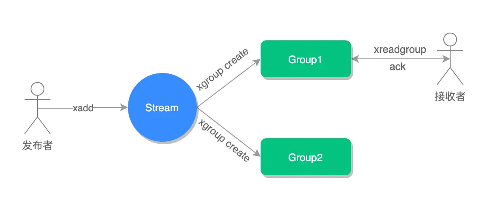
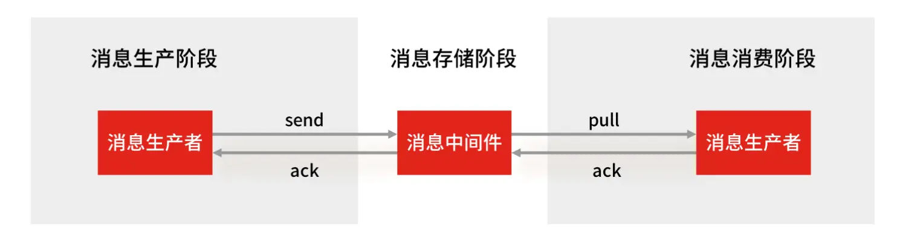
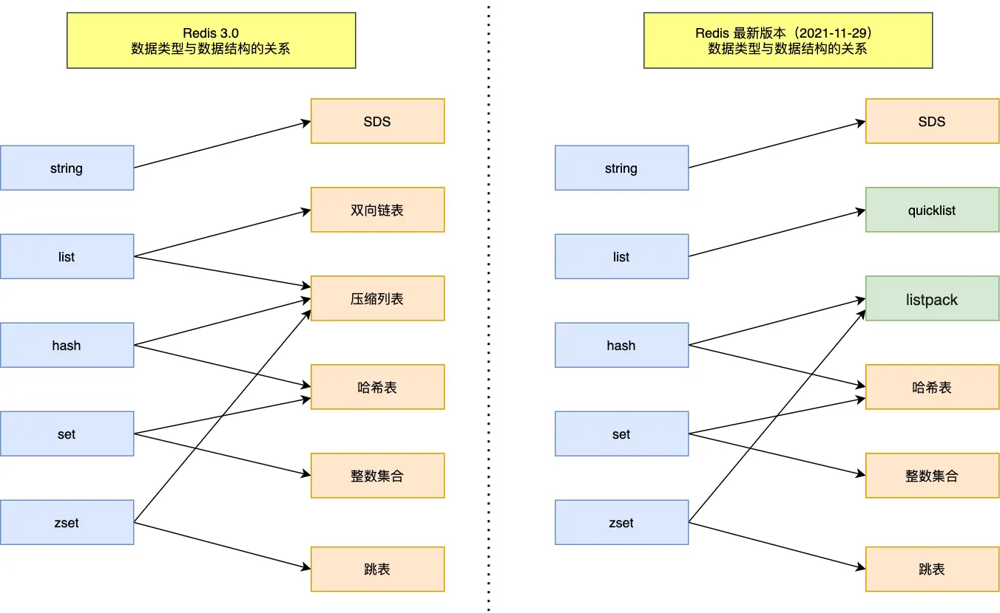

## BitMap

### 介绍

Bitmap，你可以把它想象成一个**超级迷你的小本本**，这个本本上只记录两种状态：要么是"√"（表示 1），要么是"×"（表示 0）。我们通过一个"页码"（也就是偏移量 offset）就能快速找到对应位置的状态是"√"还是"×"。

这种小本本最大的好处就是**超级节省空间**。因为计算机里最小的信息单位就是 bit（比特），一个 bit 就能表示一个"√"或一个"×"。所以，当我们有很多很多只需要记录两种状态的事情时（比如用户今天签到了没？某个功能打开了没？），用 Bitmap 就特别合适，能省下好多地方。我们把这种只需要记录两种状态的场景，叫做"**二值统计**"。


### 内部实现

你可能会好奇这个 Bitmap 小本本在 Redis 里是怎么存放的。其实，它巧妙地利用了 Redis 中我们已经认识的 `String` 类型。

我们知道 `String` 类型在 Redis 内部其实是以一串二进制数字（0和1）的形式存储的。Bitmap 就借用了这一点，把 `String` 里的每一个 bit 位都当成小本本上的一页，用来记录一个"√"或"×"。所以，你可以简单地理解为：**Bitmap 就是一个由 bit 组成的大数组，而这个大数组被藏在了 String 类型里面**。

### 常用命令

bitmap 基本操作：

```shell
# 设置值，其中value只能是 0 和 1
SETBIT key offset value

# 获取值
GETBIT key offset

# 获取指定范围内值为 1 的个数
# start 和 end 以字节为单位
BITCOUNT key start end
```

bitmap 运算操作：

```shell
# BitMap间的运算
# operations 位移操作符，枚举值
  AND 与运算 &
  OR 或运算 |
  XOR 异或 ^
  NOT 取反 ~
# result 计算的结果，会存储在该key中
# key1 … keyn 参与运算的key，可以有多个，空格分割，not运算只能一个key
# 当 BITOP 处理不同长度的字符串时，较短的那个字符串所缺少的部分会被看作 0。返回值是保存到 destkey 的字符串的长度（以字节byte为单位），和输入 key 中最长的字符串长度相等。
BITOP [operations] [result] [key1] [keyn…]

# 返回指定key中第一次出现指定value(0/1)的位置
BITPOS [key] [value]
```

### 应用场景

Bitmap 类型非常适合二值状态统计的场景，这里的二值状态就是指集合元素的取值就只有 0 和 1 两种，在记录海量数据时，Bitmap 能够有效地节省内存空间。

#### 签到统计

在签到打卡的场景中，我们只用记录签到（1）或未签到（0），所以它就是非常典型的二值状态。

签到统计时，每个用户一天的签到用 1 个 bit 位就能表示，一个月（假设是 31 天）的签到情况用 31 个 bit 位就可以，而一年的签到也只需要用 365 个 bit 位，根本不用太复杂的集合类型。

假设我们要统计 ID 100 的用户在 2022 年 6 月份的签到情况，就可以按照下面的步骤进行操作。

第一步，执行下面的命令，记录该用户 6 月 3 号已签到。

```shell
SETBIT uid:sign:100:202206 2 1
```

第二步，检查该用户 6 月 3 日是否签到。

```shell
GETBIT uid:sign:100:202206 2
```

第三步，统计该用户在 6 月份的签到次数。

```shell
BITCOUNT uid:sign:100:202206
```

这样，我们就知道该用户在 6 月份的签到情况了。

> 如何统计这个月首次打卡时间呢？

Redis 提供了 `BITPOS key bitValue [start] [end]`指令，返回数据表示 Bitmap 中第一个值为 `bitValue` 的 offset 位置。

在默认情况下，命令将检测整个位图，用户可以通过可选的 `start` 参数和 `end` 参数指定要检测的范围。所以我们可以通过执行这条命令来获取 userID = 100 在 2022 年 6 月份**首次打卡**日期：

```apache
BITPOS uid:sign:100:202206 1
```

需要注意的是，因为 offset 从 0 开始的，所以我们需要将返回的 value + 1。

#### 判断用户登录态

Bitmap 提供了 `GETBIT、SETBIT` 操作，通过一个偏移值 offset 对 bit 数组的 offset 位置的 bit 位进行读写操作，需要注意的是 offset 从 0 开始。

只需要一个 key = login_status 表示存储用户登录状态集合数据，将用户 ID 作为 offset，在线就设置为 1，下线设置 0。通过 `GETBIT`判断对应的用户是否在线。50000 万 用户只需要 6 MB 的空间。

假如我们要判断 ID = 10086 的用户的登录情况：

第一步，执行以下指令，表示用户已登录。

```shell
SETBIT login_status 10086 1
```

第二步，检查该用户是否登录，返回值 1 表示已登录。

```apache
GETBIT login_status 10086
```

第三步，登出，将 offset 对应的 value 设置成 0。

```shell
SETBIT login_status 10086 0
```

#### 连续签到用户总数

如何统计连续 7 天都签到的用户总数？这里我们可以巧妙地使用 Bitmap 和位运算来实现。

**基本思路**：

1. 为每天创建一个 Bitmap，其中：

   - Bitmap 的 key 是日期（例如：`sign:20250508`）
   - 用户 ID 作为 offset 位置
   - 用户签到则将对应位置设为 1，未签到则为 0

2. 当我们需要统计连续 7 天都签到的用户时：

   - 对这 7 天的 Bitmap 执行"按位与"（AND）操作
   - 结果中，只有 7 天都签到（即 7 个 Bitmap 对应位置都是 1）的用户，在最终结果中才会是 1

3. 统计结果 Bitmap 中值为 1 的位数，就得到了连续签到 7 天的用户总数

Redis 提供了 `BITOP`命令来实现这种位操作：

```
BITOP operation destkey key [key ...]
```

其中：

- `operation`可以是 `AND`（与）、`OR`（或）、`XOR`（异或）、`NOT`（非）
- `destkey`是存储结果的键名
- 后面跟着参与运算的键名列表

当使用 `AND`操作时，只有在所有输入 Bitmap 的相同位置都为 1 时，结果才为 1，这正好符合我们"连续签到"的逻辑。

**实例说明**：

假设要统计最近 3 天（5 月 12 日、13 日和 14 日）连续签到的用户数：

```shell
# 执行AND位操作，将结果存入destmap
BITOP AND destmap sign:20250512 sign:20250513 sign:20250514

# 统计结果中位值为1的数量（即连续签到用户数）
BITCOUNT destmap
```

执行上述命令后，`BITCOUNT destmap`返回的结果就是连续 3 天都签到的用户总数。

**内存占用分析**：

- 即使用户数量达到 1 亿，一个 Bitmap 的内存占用也只有约 12 MB
  (计算方式：10^8 位 ÷ 8 位/字节 ÷ 1024 字节/KB ÷ 1024KB/MB ≈ 12 MB)
- 存储 7 天的签到数据约需 84 MB 内存

**最佳实践**：

- 为 Bitmap 设置合理的过期时间，自动清理历史签到数据
- 对于大型应用，可以按月或按周设计键名，便于管理和清理
- 可结合 Redis 的计划任务，定期合并计算连续签到的统计结果

## HyperLogLog

### 介绍

想象一下，你想知道一个超级大的网站，比如微博或者知乎，一天有多少**不同的人**访问了它。直接去数的话，如果每个人都记录下来，那得用掉多少存储空间啊！

Redis 的 HyperLogLog 就是来解决这个问题的"神器"。它是一种专门用来做"**去重计数**"（专业点叫「统计基数」）的工具。简单来说，就是帮你估算出一大堆数据里，到底有多少个不重复的元素。

最厉害的是，HyperLogLog **超级节省内存**！不管你要统计的数据有多少（几百万、几亿甚至更多），它基本上都只用固定的、非常非常小的内存（在 Redis 里大约是 12KB）。就能给你一个八九不离十的估计值。当然，它也不是百分百精确的，会有一点点小误差（标准错误率大约是 0.81%），但对于很多场景来说，这点误差完全可以接受。

**举个例子让你感受下它有多省内存**：

如果我们不用 HyperLogLog，而是用传统方法（比如 Java 里的 `long` 类型数字）来记录每一个独立访客的 ID。假设有几百亿个访客，每个访客 ID 都需要占用一定的存储空间（比如 8 个字节）。那总共需要的内存就会是一个天文数字，可能比你电脑的硬盘还要大得多！而 HyperLogLog 只需要大约 12KB 就能搞定这个估算任务，是不是很神奇？

所以，简单来说，当你需要**大概知道有多少不重复的东西，而且这些东西数量巨大，又不想太占内存**时，HyperLogLog 就是你的好帮手。

### 内部实现

HyperLogLog 的实现涉及到很多数学问题，太费脑子了，我也没有搞懂，如果你想了解一下，课下可以看看这个：[HyperLogLog](https://en.wikipedia.org/wiki/HyperLogLog)。

### 常见命令

HyperLogLog 命令很少，就三个。

```shell
# 添加指定元素到 HyperLogLog 中
PFADD key element [element ...]

# 返回给定 HyperLogLog 的基数估算值。
PFCOUNT key [key ...]

# 将多个 HyperLogLog 合并为一个 HyperLogLog
PFMERGE destkey sourcekey [sourcekey ...]
```

### 应用场景

#### 百万级网页 UA (User Agent) 计数

Redis HyperLogLog 优势在于只需要花费 12 KB 内存，就可以计算接近 2^64 个元素的基数，和元素越多就越耗费内存的 Set 和 Hash 类型相比，HyperLogLog 就非常节省空间。

所以，非常适合统计百万级以上的网页 UA 的场景。

在统计 UA 时，你可以用 PFADD 命令（用于向 HyperLogLog 中添加新元素）把访问页面的每个用户都添加到 HyperLogLog 中。

```shell
PFADD page1:ua user1 user2 user3 user4 user5
```

接下来，就可以用 PFCOUNT 命令直接获得 page1 的 UA 值了，这个命令的作用就是返回 HyperLogLog 的统计结果。

```shell
PFCOUNT page1:ua
```

不过，有一点需要你注意一下，HyperLogLog 的统计规则是基于概率完成的，所以它给出的统计结果是有一定误差的，标准误算率是 0.81%。

这也就意味着，你使用 HyperLogLog 统计的 UA 是 100 万，但实际的 UA 可能是 101 万。虽然误差率不算大，但是，如果你需要精确统计结果的话，最好还是继续用 Set 或 Hash 类型。

## GEO

Redis GEO 是 Redis 3.2 版本引入的一个新功能，专门用来帮你**存储和查询地理位置信息**。

想象一下我们平时用的地图软件，比如你要找"我附近的餐馆"，或者打车软件帮你匹配最近的司机，这些都离不开地理位置服务（我们常说的 LBS - Location-Based Service）。GEO 类型就是为了方便实现这类功能而生的。它可以帮你存储很多地点（比如餐馆、车辆、用户）的经度和纬度，并且能快速找出某个地点附近的其他地点。

### 内部实现

你可能会想，Redis 是怎么做到这么神奇的地理位置存储和查询的呢？它是不是又发明了一种全新的、复杂的数据结构？

答案是：并没有！GEO 类型非常聪明，它**巧妙地借用了我们之前学过的 `Sorted Set`（有序集合）**.

它是这样工作的：

1.  **GeoHash 编码**：首先，对于每一个地理位置（经度和纬度），GEO 会用一种叫做 "GeoHash" 的方法，把这个二维的经纬度信息转换成一个**一维的数字**（你可以把它想象成给地图上的每个小区域编了一个号）。这个数字就代表了这个位置所在的区域。
2.  **存入 Sorted Set**：然后，GEO 把这个转换后的一维数字作为 `Sorted Set` 中每个元素的"分数"（score），而地点本身的名字（比如餐馆名、车辆ID）就是元素的值。

这样一来，所有的地理位置信息就被转换成了 `Sorted Set` 里带着分数的元素。因为 `Sorted Set` 本身就是有序的，而且支持按照分数范围来查找，所以我们就能很方便地利用这个特性来找到某个分数（也就是某个地理区域）附近的其他元素了，从而实现"搜索附近"的功能。

简单来说，**GEO 就是用 GeoHash 把地图上的点"拍扁"成一维的数字，然后用 Sorted Set 来管理这些数字，从而实现高效的地理位置查询**。

### 常用命令

```shell
# 存储指定的地理空间位置，可以将一个或多个经度(longitude)、纬度(latitude)、位置名称(member)添加到指定的 key 中。
GEOADD key longitude latitude member [longitude latitude member ...]

# 从给定的 key 里返回所有指定名称(member)的位置（经度和纬度），不存在的返回 nil。
GEOPOS key member [member ...]

# 返回两个给定位置之间的距离。
GEODIST key member1 member2 [m|km|ft|mi]

# 根据用户给定的经纬度坐标来获取指定范围内的地理位置集合。
GEORADIUS key longitude latitude radius m|km|ft|mi [WITHCOORD] [WITHDIST] [WITHHASH] [COUNT count] [ASC|DESC] [STORE key] [STOREDIST key]
```

### 应用场景

#### 滴滴叫车

这里以滴滴叫车的场景为例，介绍下具体如何使用 GEO 命令：GEOADD 和 GEORADIUS 这两个命令。

假设车辆 ID 是 33，经纬度位置是（116.034579，39.030452），我们可以用一个 GEO 集合保存所有车辆的经纬度，集合 key 是 cars:locations。

执行下面的这个命令，就可以把 ID 号为 33 的车辆的当前经纬度位置存入 GEO 集合中：

```shell
GEOADD cars:locations 116.034579 39.030452 33
```

当用户想要寻找自己附近的网约车时，LBS 应用就可以使用 GEORADIUS 命令。

例如，LBS 应用执行下面的命令时，Redis 会根据输入的用户的经纬度信息（116.054579，39.030452），查找以这个经纬度为中心的 5 公里内的车辆信息，并返回给 LBS 应用。

```shell
GEORADIUS cars:locations 116.054579 39.030452 5 km ASC COUNT 10
```

## Stream

### 介绍

Redis Stream 是 Redis 5.0 版本专门为"**消息队列**"量身打造的一种新数据类型。

**什么是消息队列呢？**

你可以把它想象成一个**智能的公告板或者任务清单**。有人（生产者）往上面贴条子（发布消息），另外一些人（消费者）则从公告板上取条子去处理（消费消息）。

**为什么需要 Stream？**

在 Stream 出现之前，大家也尝试用 Redis 的其他功能（比如 `List` 或者发布订阅模式）来模拟消息队列，但它们都有一些天生的"小毛病"：

*   **发布订阅模式**：这种模式像个"广播"，消息发出去了就没了，**不能保存**。如果某个消费者当时不在线，它就错过了这些消息，之后也找不回来。
*   **`List` 类型**：用 `List` 来做消息队列，消息倒是能存下来。但是，一条消息被一个消费者取走后，别的消费者就看不到了（**不能重复消费**）。而且，谁先发消息谁后发消息，这个顺序的管理也比较麻烦，生产者需要自己想办法给每条消息编个号。

为了解决这些问题，Stream 横空出世！它就像一个**超级增强版的消息队列**，拥有很多高级功能：

*   **消息持久化**：消息会被稳稳地存起来，不用担心丢了。
*   **自动生成唯一ID**：每条消息都会自动获得一个独一无二的编号，管理起来很方便。
*   **消息确认机制（ACK）**：消费者拿到消息处理完后，可以告诉 Stream "我搞定了！"，这样 Stream 才知道这条消息被成功处理了。
*   **消费组模式**：这是 Stream 的一大亮点！允许多个消费者组成一个"小组"，共同来处理消息。一个小组里的消息只会被其中一个成员领走，避免了重复劳动。而且，不同的小组可以独立消费同样的消息，互不影响。

有了这些特性，用 Stream 来做消息队列就变得非常**稳定和可靠**了。

### 常见命令

Stream 消息队列操作命令：

- XADD：插入消息，保证有序，可以自动生成全局唯一 ID；
- XLEN：查询消息长度；
- XREAD：用于读取消息，可以按 ID 读取数据；
- XDEL：根据消息 ID 删除消息；
- DEL：删除整个 Stream；
- XRANGE：读取区间消息
- XREADGROUP：按消费组形式读取消息；
- XPENDING 和 XACK：
  - XPENDING 命令可以用来查询每个消费组内所有消费者「已读取、但尚未确认」的消息；
  - XACK 命令用于向消息队列确认消息处理已完成；

### 应用场景

#### 消息队列

生产者（发消息的人）用 `XADD` 命令把一条消息放进队列：

```shell
# 这里的 * 号表示让 Redis 自动给这条消息生成一个全局唯一的 ID
# 意思是：往一个叫做 mymq 的消息队列里，放一条内容是 name=xiaolin 的消息
> XADD mymq * name xiaolin
"1654254953808-0" # 这是 Redis 返回的消息 ID
```

这个返回的 ID 很特别，它由两部分组成：

*   第一部分（例如 `1654254953808`）：是消息被存入时，服务器的时间戳（精确到毫秒）。
*   第二部分（例如 `0`）：表示在同一毫秒内，这条消息是第几条（从0开始数）。

消费者（处理消息的人）用 `XREAD` 命令来读消息。你可以告诉它从哪个 ID 开始读，它就会把那个 ID 之后的新消息都给你。这样设计的好处是，消费者只需要记住上次读到哪里，下次就能接着读，非常方便。

```shell
# 从 ID 号为 1654254953807-0 的消息之后开始读取，返回所有更新的消息
> XREAD STREAMS mymq 1654254953807-0
1) 1) "mymq"
   2) 1) 1) "1654254953808-0" # 消息ID
         2) 1) "name"      # 消息内容
            2) "xiaolin"
```

如果希望**没有新消息时，让 `XREAD` 命令先别急着返回，而是等一会儿**（比如等几秒钟），看看有没有新消息进来，可以加上 `BLOCK` 参数。这就像你去窗口办事，如果暂时没人，你会等一下而不是立刻离开。

```shell
# 命令最后的"$"符号表示我想读取最新的消息
# BLOCK 10000 表示如果没有新消息，就阻塞等待10000毫秒（10秒）
> XREAD BLOCK 10000 STREAMS mymq $
(nil) # 10秒内没有新消息，就返回空
(10.00s)
```

用 `XADD` 发消息，用 `XREAD` 收消息，这样最基本的消息队列就搭起来了。流程就像下面这张图：


> 前面这些基本操作，用 `List` 其实也能勉强做到。Stream 真正的厉害之处在于它的"消费组"功能。

Stream 可以用 **`XGROUP CREATE` 创建消费组**。创建了消费组之后，就可以用 `XREADGROUP` 命令让组里的消费者来读消息了。

比如，我们创建一个名叫 `group1` 的消费组，让它从消息队列 `mymq` 的第一条消息（用 `0-0` 表示）开始读：

```shell
# 创建一个名为 group1 的消费组，0-0 表示从第一条消息开始读取。
> XGROUP CREATE mymq group1 0-0
OK
# 同样，再创建一个 group2
> XGROUP CREATE mymq group2 0-0
OK
```

然后，`group1` 里的一个消费者 `consumer1` 可以这样来读消息：

```shell
# 命令最后的参数">"，表示我想从第一条"还没有被组里其他消费者拿走"的消息开始读。
> XREADGROUP GROUP group1 consumer1 STREAMS mymq >
1) 1) "mymq"
   2) 1) 1) "1654254953808-0"
         2) 1) "name"
            2) "xiaolin"
```

**重点来了：同一个消费组里的消息，一旦被一个消费者取走了，组里的其他消费者就拿不到了。** 这确保了同一条消息不会被同一个小组的人重复处理。

比如，`consumer1` 刚读了一条消息，如果它再用同样的命令去读，就会发现没新消息了（除非队列里又来了别的未被读取的消息）：

```shell
> XREADGROUP GROUP group1 consumer1 STREAMS mymq >
(nil)
```

但是，**不同消费组之间是独立的**。如果它们都设置了从同一个地方开始读消息，那么它们都可以读到相同的消息。

比如，刚才 `group1` 的 `consumer1` 读了 `1654254953808-0` 这条消息。现在我们让 `group2` 里的 `consumer1` (注意，这是另一个组的同名消费者，或者不同名的消费者都行) 去读，它也能读到这条消息：

```shell
> XREADGROUP GROUP group2 consumer1 STREAMS mymq >
1) 1) "mymq"
   2) 1) 1) "1654254953808-0"
         2) 1) "name"
            2) "xiaolin"
```

消费组的主要目的就是让组里的多个消费者**分工合作，共同处理消息**，提高效率。通常我们会让每个消费者领一部分消息。

比如，我们可以让 `group2` 里的三个消费者 `consumer1`、`consumer2`、`consumer3` 各自去领一条消息来处理：

```shell
#让 group2 的 consumer1 领一条消息
> XREADGROUP GROUP group2 consumer1 COUNT 1 STREAMS mymq >
# ... (consumer1 领到的消息)

#让 group2 的 consumer2 领一条消息
> XREADGROUP GROUP group2 consumer2 COUNT 1 STREAMS mymq >
# ... (consumer2 领到的消息)

#让 group2 的 consumer3 领一条消息
> XREADGROUP GROUP group2 consumer3 COUNT 1 STREAMS mymq >
# ... (consumer3 领到的消息)
```

> 那么问题来了：如果一个消费者领了条消息，但它自己处理的时候出错了（比如程序崩了），那这条消息不就丢了吗？Stream 是怎么保证消息被可靠处理的呢？

这就是 Stream 的**消息确认机制**和 **Pending List（待处理列表）** 的作用了。

当一个消费者通过 `XREADGROUP` 拿到消息后，Stream 会默默地把这些"已被认领但还没说处理完"的消息记录在一个内部的"**待处理列表**"（Pending List）里。只有当消费者处理完消息，并且明确地用 `XACK` 命令告诉 Stream "这条消息我处理好了！"之后，Stream 才会认为这条消息被成功消费了，然后从 Pending List 里移除它。

这个过程就像这样：



如果消费者拿了消息但一直没发 `XACK`（比如因为它自己出故障了），那么这条消息就会一直待在 Pending List 里。当这个消费者恢复后（或者其他备用消费者介入时），可以用 `XPENDING` 命令来查看哪些消息是"之前领了但还没确认处理完的"。

例如，查看 `group2` 里，所有消费者加起来总共有多少条"待处理"的消息，以及这些消息的 ID 范围：

```shell
127.0.0.1:6379> XPENDING mymq group2
1) (integer) 3 # 总共有3条待处理消息
2) "1654254953808-0"  # 这些待处理消息中，ID最小的那个
3) "1654256271337-0"  # 这些待处理消息中，ID最大的那个
4) 1) 1) "consumer1"   # consumer1 有几条待处理的
      1) "1"
   1) 1) "consumer2"   # consumer2 有几条待处理的
      1) "1"
   2) 1) "consumer3"   # consumer3 有几条待处理的
      1) "1"
```

如果想看某个消费者（比如 `consumer2`）具体有哪些待处理的消息，可以这样：

```shell
# 查看 group2 里的 consumer2 有哪些待处理的消息（最多看10条，从最早的开始）
> XPENDING mymq group2 - + 10 consumer2
1) 1) "1654256265584-0"   # 消息ID
   2) "consumer2"       # 哪个消费者领的
   3) (integer) 410700  # 这条消息被认领后，空闲了多久（毫秒）
   4) (integer) 1         # 这条消息被传递了几次（如果发生过重新认领）
```

一旦 `consumer2` 把消息 `1654256265584-0` 处理完了，它就应该用 `XACK` 命令告诉 Stream：

```shell
> XACK mymq group2 1654256265584-0
(integer) 1 # 表示成功确认了1条消息
```

之后再用 `XPENDING` 去查 `consumer2`，就会发现它没有待处理的消息了：

```shell
> XPENDING mymq group2 - + 10 consumer2
(empty array)
```

好了，关于 Stream 实现消息队列的关键点小结一下：

*   **保证消息顺序**：用 `XADD` 添加，ID 本身就带有时间戳和序号。
*   **可以阻塞等待新消息**：`XREAD` 或 `XREADGROUP` 加上 `BLOCK` 参数。
*   **避免重复消息**：`XADD` 自动生成全局唯一 ID。
*   **保证消息可靠性**：通过消费组、Pending List 和 `XACK` 确认机制，确保消息至少被成功处理一次。
*   **支持消费组协同工作**：多个消费者可以一起干活，提高效率。

> Redis Stream 这么厉害，那它和那些专业的"消息队列中间件"（比如 Kafka、RabbitMQ）比起来怎么样呢？

一个专业的消息队列，通常要重点解决两个问题：

1.  **消息不能丢**。
2.  **消息能大量堆积**（比如生产者发得很快，消费者处理得慢，消息不能因为堆太多而丢了）。

_1、Redis Stream 的消息会丢失吗？_

一个完整的消息传递过程包括三个环节：**生产者发消息 -> 消息队列中间件存消息 -> 消费者收消息**。



我们来看看 Redis Stream 在这三个环节的表现：

*   **生产者发消息会不会丢？** 这个主要看生产者程序写得好不好。如果生产者发完消息后，能正确检查 Stream 返回的确认（表示 Stream 已经收到），并且在出错时能重新发送，那么这个环节一般不会丢消息。
*   **消费者收消息会不会丢？** 一般也不会。因为 Stream 有 Pending List 和 `XACK` 确认机制。消费者处理完消息才发确认，如果中途挂了，消息还在 Pending List 里，重启后可以继续处理。
*   **消息在 Stream（也就是 Redis 自己作为中间件）里会不会丢？** **这个是有可能的！** 主要在两种情况下：
    *   如果 Redis 的持久化策略（比如 AOF）配置成每秒写一次硬盘，那么在两次写盘间隔内如果 Redis 突然挂了，这一秒内收到的消息就可能丢了。
    *   如果 Redis 做了主从复制，但复制是异步的，那么在主节点挂了、从节点还没同步完数据的时候切换，也可能丢一部分数据。

所以，**在"中间件"这个环节，Redis Stream 本身并不能像专业消息队列那样做到绝对不丢消息**。专业的消息队列（如 Kafka）通常会把消息写到集群里的多个节点（多个副本），一个节点挂了也不影响数据。

_2、Redis Stream 消息能大量堆积吗？_

Redis 的数据主要是存在内存里的。如果消息产生得非常快，消费却很慢，导致大量消息堆积在 Stream 里，就会不断消耗 Redis 的内存。如果内存耗尽，Redis 就可能崩溃（OOM）。

为了避免这种情况，Stream 允许你设置一个队列的最大长度。超过这个长度后，老的消息就会被自动删除，只保留最新的消息。这样虽然能防止内存爆炸，但也意味着**在消息严重堆积时，Stream 可能会主动丢弃老消息**。

而专业的 Kafka、RabbitMQ 通常把消息存在磁盘上，磁盘空间一般比内存大得多，所以它们更能抗住大量的消息堆积。

因此，总结一下，用 Redis Stream 做消息队列时要注意：

*   **Redis 自身的原因（持久化、主从切换）可能导致少量数据丢失。**
*   **消息大量堆积时，内存可能成为瓶颈，并可能导致老消息被丢弃。**

那么，到底能不能用 Redis Stream 做消息队列呢？关键看你的业务场景：

*   如果你的业务**对偶尔丢失几条消息不那么敏感**，并且**消息积压的风险不高**，那么用 Redis Stream 是个简单方便的选择。
*   但如果你的业务要求**消息绝对不能丢**，或者**可能产生海量消息并长时间堆积**，那还是选择 Kafka、RabbitMQ 这类更专业的消息队列中间件更稳妥。

> 补充：为什么不直接用 Redis 的"发布/订阅"机制做消息队列？

虽然发布/订阅听起来也像消息传递，但它有几个硬伤，不适合做正经的消息队列：

1.  **不存消息**：发布/订阅是纯粹的"阅后即焚"，消息发出去就没了，Redis 不会为它做持久化（写 RDB 或 AOF）。Redis 重启后，啥都没了。
2.  **离线消费者收不到**：如果一个订阅者当时不在线，它就永远错过了那些消息，之后也补不回来。
3.  **消费者慢了会被踢掉**：如果生产者发太快，某个消费者处理不过来，导致它那边的消息缓冲区满了（默认超过32MB，或者60秒内持续占着8MB以上），Redis 会把这个"拖后腿"的消费者直接踢下线。

所以，发布/订阅机制更适合做一些**即时性的通知**，比如 Redis 哨兵集群内部的通信，而不是需要可靠传递和存储的消息队列。

## 总结

Redis 常见的五种数据类型：**String（字符串），Hash（哈希），List（列表），Set（集合）及 Zset(sorted set：有序集合)**。

这五种数据类型都由多种数据结构实现的，主要是出于时间和空间的考虑，当数据量小的时候使用更简单的数据结构，有利于节省内存，提高性能。

这五种数据类型与底层数据结构对应关系图如下，左边是 Redis 3.0 版本的，也就是《Redis 设计与实现》这本书讲解的版本，现在看还是有点过时了，右边是现在 Github 最新的 Redis 代码的。



可以看到，Redis 数据类型的底层数据结构随着版本的更新也有所不同，比如：

- 在 Redis 3.0 版本中 List 对象的底层数据结构由「双向链表」或「压缩表列表」实现，但是在 3.2 版本之后，List 数据类型底层数据结构是由 quicklist 实现的；
- 在最新的 Redis 代码中，压缩列表数据结构已经废弃了，交由 listpack 数据结构来实现了。

Redis 五种数据类型的应用场景：

- String 类型的应用场景：缓存对象、常规计数、分布式锁、共享 session 信息等。
- List 类型的应用场景：消息队列（有两个问题：1. 生产者需要自行实现全局唯一 ID；2. 不能以消费组形式消费数据）等。
- Hash 类型：缓存对象、购物车等。
- Set 类型：聚合计算（并集、交集、差集）场景，比如点赞、共同关注、抽奖活动等。
- Zset 类型：排序场景，比如排行榜、电话和姓名排序等。

Redis 后续版本又支持四种数据类型，它们的应用场景如下：

- BitMap（2.2 版新增）：二值状态统计的场景，比如签到、判断用户登录状态、连续签到用户总数等；
- HyperLogLog（2.8 版新增）：海量数据基数统计的场景，比如百万级网页 UV 计数等；
- GEO（3.2 版新增）：存储地理位置信息的场景，比如滴滴叫车；
- Stream（5.0 版新增）：消息队列，相比于基于 List 类型实现的消息队列，有这两个特有的特性：自动生成全局唯一消息 ID，支持以消费组形式消费数据。

针对 Redis 是否适合做消息队列，关键看你的业务场景：

- 如果你的业务场景足够简单，对于数据丢失不敏感，而且消息积压概率比较小的情况下，把 Redis 当作队列是完全可以的。
- 如果你的业务有海量消息，消息积压的概率比较大，并且不能接受数据丢失，那么还是用专业的消息队列中间件吧。

---

参考资料：

- 《Redis 核心技术与实战》
- https://www.cnblogs.com/hunternet/p/12742390.html
- https://www.cnblogs.com/qdhxhz/p/15669348.html
- https://www.cnblogs.com/bbgs-xc/p/14376109.html
- http://kaito-kidd.com/2021/04/19/can-redis-be-used-as-a-queue/
