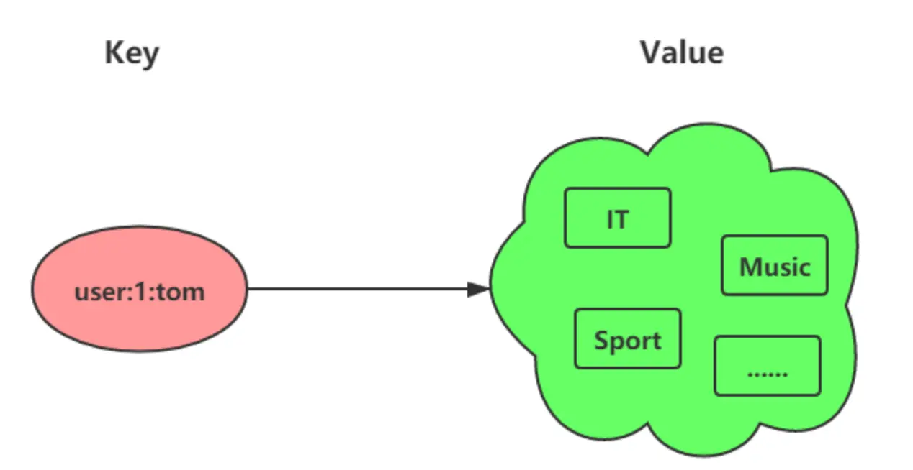

## Set

### 介绍

想象一下，你正在组织一场热门活动，需要统计所有报名用户的ID，并确保每个用户ID只记录一次，不能重复。或者，你想知道两个不同兴趣小组有哪些共同的成员。这时，Redis 的 Set 数据结构就能大显身身手了！Set 是一个无序且唯一的键值集合，就像数学中的集合概念一样，非常适合处理这类去重和关系运算的场景。

一个集合最多可以存储 `2^32-1` 个元素。概念和数学中个的集合基本类似，可以交集，并集，差集等等，所以 Set 类型除了支持集合内的增删改查，同时还支持多个集合取交集、并集、差集。



Set 类型和 List 类型的区别如下：

- List 可以存储重复元素，Set 只能存储非重复元素（核心特性！）。
- List 是按照元素的先后顺序存储元素的，而 Set 则是无序方式存储元素的（插入顺序不重要）。

### 内部实现

Set 看似简单，但 Redis 在背后为它做了精心设计。简单来说，如果你的 Set 里存放的都是整数，并且数量不多（默认512个以内，这个值可以通过 `set-maxintset-entries` 配置调整），Redis 会选择一种叫做**整数集合 (intset)** 的内存优化方式来存储它们，这样更节省空间。

如果 Set 里的元素不满足上述条件（比如包含字符串，或者数量超过了限制），Redis 就会使用更通用的**哈希表 (hashtable)** 来存储。你不需要关心具体用哪种，Redis 会自动帮你搞定，确保高效运行。

### 常用命令

掌握 Set 的常用命令，是发挥其威力的关键。下面是一些核心操作：

#### 基础操作

```shell
# SADD key member [member ...]
# 解释：向名为 key 的集合里添加一个或多个 member。
# 如果 member 已经存在，就忽略它，确保唯一性。
# 如果 key 这个集合不存在，会自动创建一个新的。
# 示例：SADD myset "hello" "world"
SADD key member [member ...]

# SREM key member [member ...]
# 解释：从名为 key 的集合中删除一个或多个指定的 member。
# 示例：SREM myset "world"
SREM key member [member ...] 
```

#### 查询与判断

```shell
# SMEMBERS key
# 解释：获取名为 key 的集合中所有元素。注意，因为 Set 是无序的，所以元素的顺序是随机的。
# 示例：SMEMBERS myset
SMEMBERS key

# SCARD key
# 解释：获取名为 key 的集合中的元素个数（Cardinality）。
# 示例：SCARD myset
SCARD key

# SISMEMBER key member
# 解释：判断 member 元素是否存在于名为 key 的集合中。
# 存在返回 1，不存在或者 key 本身不存在则返回 0。
# 示例：SISMEMBER myset "hello"
SISMEMBER key member
```

#### 随机操作

```shell
# SRANDMEMBER key [count]
# 解释：从名为 key 的集合中随机选出 count 个元素。
# 如果 count 是正数，返回的元素不会重复；如果 count 是负数，则可能返回重复元素。
# 重要：这个操作只是"查看"，并不会从集合中删除元素。
# 示例（不重复）：SRANDMEMBER myset 2
# 示例（可能重复）：SRANDMEMBER myset -3
SRANDMEMBER key [count]

# SPOP key [count]
# 解释：从名为 key 的集合中随机移除并返回 count 个元素。
# 这个操作是"取出并删除"，会修改集合内容。
# 示例：SPOP myset 1
SPOP key [count]
```

#### 集合运算 (并集、交集、差集)

```shell
# SINTER key [key ...]
# 解释：计算所有给定 key 集合的交集。
# 例如，找出同时存在于 set1 和 set2 中的元素。
# 示例：SINTER set1 set2
SINTER key [key ...]

# SINTERSTORE destination key [key ...]
# 解释：计算所有给定 key 集合的交集，并将结果存储到名为 destination 的新集合中。
# 示例：SINTERSTORE resultset set1 set2
SINTERSTORE destination key [key ...]

# SUNION key [key ...]
# 解释：计算所有给定 key 集合的并集。
# 例如，合并 set1 和 set2 中的所有元素（重复的只保留一个）。
# 示例：SUNION set1 set2
SUNION key [key ...]

# SUNIONSTORE destination key [key ...]
# 解释：计算所有给定 key 集合的并集，并将结果存储到名为 destination 的新集合中。
# 示例：SUNIONSTORE resultset set1 set2
SUNIONSTORE destination key [key ...]

# SDIFF key [key ...]
# 解释：计算第一个 key 集合与后续所有 key 集合的差集。
# 例如，找出存在于 set1 中，但不存在于 set2 和 set3 中的元素。
# 示例：SDIFF set1 set2 set3
SDIFF key [key ...]

# SDIFFSTORE destination key [key ...]
# 解释：计算第一个 key 集合与后续所有 key 集合的差集，并将结果存储到名为 destination 的新集合中。
# 示例：SDIFFSTORE resultset set1 set2
SDIFFSTORE destination key [key ...]
```

### 应用场景

集合的几大特性——无序、唯一、支持并交差运算——使得它在很多场景下都非常有用。

因此 Set 类型比较适合用来数据去重和保障数据的唯一性，还可以用来统计多个集合的交集、差集和并集等。当我们存储的数据是无序并且需要去重的情况下，比较适合使用集合类型进行存储。

不过，这里有个小提醒：当你的 Set 里有成千上万甚至数百万个元素时，直接计算它们的交集、并集或差集可能会比较耗时，甚至可能让 Redis 短暂"卡顿"一下。如果你的数据量非常大，可以考虑在从数据库（如果设置了主从复制）上进行这些运算，或者把数据取到你的应用程序里再计算，避免给主数据库带来压力。

#### 利用 Set 元素的唯一性，轻松实现"一人一赞"：

Set 类型可以保证一个用户只能点一个赞。假设我们用文章 ID 作为 key，点赞用户的 ID 作为 value。

`uid:1` 、`uid:2`、`uid:3` 三个用户分别对 `article:1` 这篇文章点赞了。

```shell
# uid:1 用户对文章 article:1 点赞
> SADD article:1 uid:1
(integer) 1
# uid:2 用户对文章 article:1 点赞
> SADD article:1 uid:2
(integer) 1
# uid:3 用户对文章 article:1 点赞
> SADD article:1 uid:3
(integer) 1
```

如果 `uid:1` 用户想取消点赞：

```shell
> SREM article:1 uid:1
(integer) 1
```

想看看 `article:1` 这篇文章都有谁点赞了：

```shell
> SMEMBERS article:1
1) "uid:3"
2) "uid:2"
```

想知道 `article:1` 这篇文章有多少个赞：

```shell
> SCARD article:1
(integer) 2
```

判断用户 `uid:1` 是否对文章 `article:1` 点过赞：

```shell
> SISMEMBER article:1 uid:1
(integer) 0  # 返回 0 说明没点赞，返回 1 则说明点赞了
```

#### 利用 Set 的交集运算，发现"我们共同的爱好"：

Set 类型支持交集运算，所以可以用来计算共同关注的好友、共同喜欢的商品、共同订阅的公众号等。

假设 key 是用户 ID，value 则是该用户关注的公众号 ID。

用户 `uid:1` 关注了公众号 `id:5, id:6, id:7, id:8, id:9`。
用户 `uid:2` 关注了公众号 `id:7, id:8, id:9, id:10, id:11`。

```shell
# uid:1 用户关注公众号
> SADD uid:1 5 6 7 8 9
(integer) 5
# uid:2  用户关注公众号
> SADD uid:2 7 8 9 10 11
(integer) 5
```

想知道 `uid:1` 和 `uid:2` 共同关注了哪些公众号：

```shell
# 获取共同关注
> SINTER uid:1 uid:2
1) "7"
2) "8"
3) "9"
```

想给 `uid:2` 推荐一些 `uid:1` 关注过但 `uid:2` 还没关注的公众号（差集运算）：

```shell
> SDIFF uid:1 uid:2
1) "5"
2) "6"
```

验证某个公众号（比如 `id:5`）是否同时被 `uid:1` 或 `uid:2` 关注：

```shell
> SISMEMBER uid:1 5
(integer) 1 # 返回1，说明 uid:1 关注了
> SISMEMBER uid:2 5
(integer) 0 # 返回0，说明 uid:2 没关注
```

#### 利用 Set 的去重和随机弹出特性，打造公平的"抽奖池"：

在抽奖活动中，我们需要存储所有参与抽奖的用户，并确保每个用户只被记录一次。Set 的去重功能完美契合这个需求。当开奖时，我们又需要从参与者中随机抽取幸运儿。

假设 key 为抽奖活动名 `lucky_draw_event`，value 为参与抽奖的员工姓名。先把所有员工都加入抽奖池：

```shell
> SADD lucky_draw_event Tom Jerry John Sean Marry Lindy Sary Mark
(integer) 8 # 假设有8名员工参与
```

**如果允许重复中奖（比如阳光普照奖，每个人都可以是候选人，抽多次）**：
可以使用 `SRANDMEMBER` 命令，它只是随机"看一看"有哪些人，并不会把人从抽奖池里拿走。

```shell
# 随机抽取 1 个一等奖候选人（不从池中移除）：
> SRANDMEMBER lucky_draw_event 1
1) "Tom"
# 随机抽取 2 个二等奖候选人（不从池中移除）：
> SRANDMEMBER lucky_draw_event 2
1) "Mark"
2) "Jerry"
# 随机抽取 3 个三等奖候选人（不从池中移除）：
> SRANDMEMBER lucky_draw_event 3
1) "Sary"
2) "Tom"
3) "Jerry"
```

**如果不允许重复中奖（比如一、二、三等奖，中过就不能再中了）**：
可以使用 `SPOP` 命令，它会随机"拿走"一个或多个中奖者，确保他们不会再次中奖。

```shell
# 抽取一等奖1名（从池中移除）：
> SPOP lucky_draw_event 1
1) "Sary"
# 此时 Sary 已经不在抽奖池里了

# 抽取二等奖2名（从池中移除）：
> SPOP lucky_draw_event 2
1) "Jerry"
2) "Mark"
# Jerry 和 Mark 也被移除了

# 抽取三等奖3名（从池中移除）：
> SPOP lucky_draw_event 3
1) "John"
2) "Sean"
3) "Lindy"
# 奖项抽取完毕！
```

### 总结

总而言之，Redis 的 Set 类型凭借其无序、唯一以及丰富的集合运算能力，在需要数据去重、关系查找、以及一些特定业务场景（如点赞、共同关注、抽奖）下，都是一个简洁高效的选择。理解了它的特性和适用场景，你就能在开发中更好地利用它来解决实际问题。
