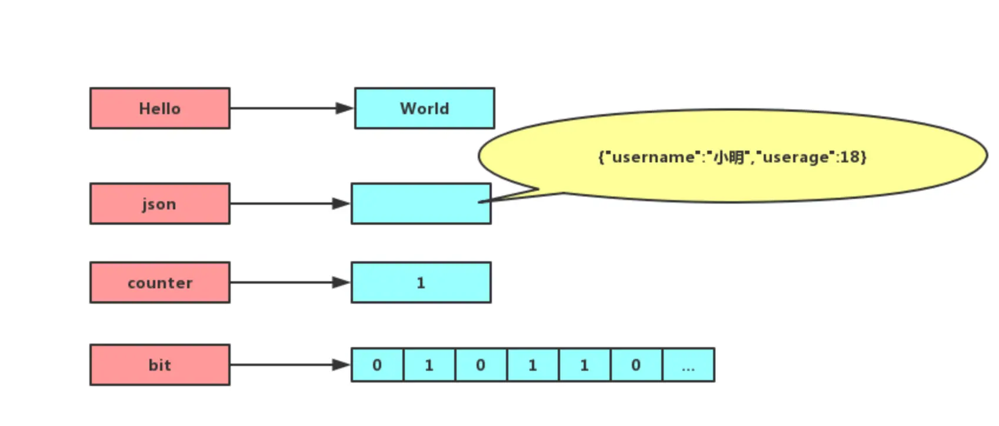
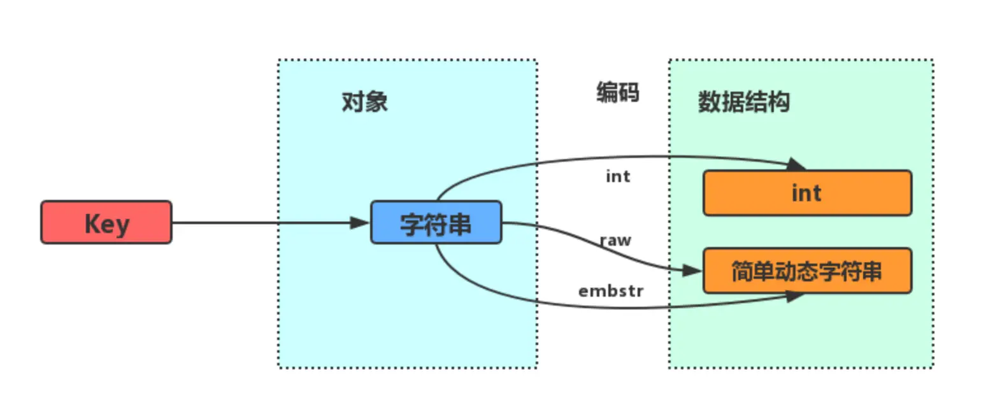
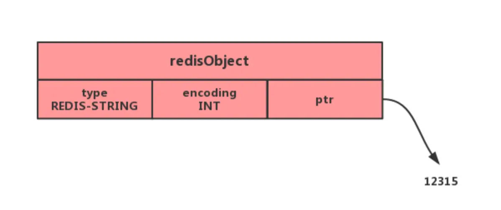
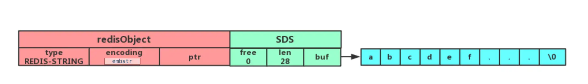
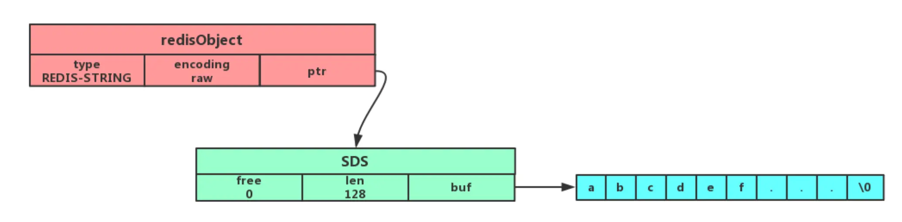

## 概述

String（字符串）是 Redis 中最基本也是最常用的数据类型，也是唯一一个在 Redis 中默认提供的且不需要特殊编码的数据结构。String 类型在 Redis 中不仅可以存储普通文本，还可以存储序列化后的对象、二进制数据、JSON 甚至是简单的整数计数器。其在缓存、分布式锁、计数器等场景中有广泛应用。

## String 基本特性

String 是最基本的 key-value 结构，key 是唯一标识，value 是具体的值，value 其实不仅是字符串，也可以是数字（整数或浮点数），value 最多可以容纳的数据长度是 `512M`。



## 内部实现

String 类型的底层的数据结构实现主要是 int 和 SDS（简单动态字符串）。

### SDS（Simple Dynamic String）

SDS 和我们认识的 C 字符串不太一样，之所以没有使用 C 语言的字符串表示，因为 SDS 相比于 C 的原生字符串有以下优势：

- **SDS 不仅可以保存文本数据，还可以保存二进制数据**。因为 `SDS` 使用 `len` 属性的值而不是空字符来判断字符串是否结束，并且 SDS 的所有 API 都会以处理二进制的方式来处理 SDS 存放在 `buf[]` 数组里的数据。所以 SDS 不光能存放文本数据，而且能保存图片、音频、视频、压缩文件这样的二进制数据。
- **SDS 获取字符串长度的时间复杂度是 O(1)**。因为 C 语言的字符串并不记录自身长度，所以获取长度的复杂度为 O(n)；而 SDS 结构里用 `len` 属性记录了字符串长度，所以复杂度为 `O(1)`。
- **Redis 的 SDS API 是安全的，拼接字符串不会造成缓冲区溢出**。因为 SDS 在拼接字符串之前会检查 SDS 空间是否满足要求，如果空间不够会自动扩容，所以不会导致缓冲区溢出的问题。
- **SDS 使用预分配空间和惰性空间释放策略，减少内存重分配次数**。当 SDS 需要增长时，会分配额外的空间；当 SDS 缩短时，并不立即释放多余空间，而是记录起来以备后用。

SDS 的基本结构如下：

```c
struct sdshdr {
    // 记录buf数组中已使用字节的数量
    int len;
    // 记录buf数组中未使用字节的数量
    int free;
    // 字节数组，用于保存字符串
    char buf[];
};
```

### 编码方式

字符串对象的内部编码（encoding）有 3 种：**int、raw 和 embstr**。



如果一个字符串对象保存的是整数值，并且这个整数值可以用 `long`类型来表示，那么字符串对象会将整数值保存在字符串对象结构的 `ptr`属性里面（将 `void*`转换成 long），并将字符串对象的编码设置为 `int`。



如果字符串对象保存的是一个字符串，并且这个字符串的长度小于等于 32 字节（redis 2.+版本），那么字符串对象将使用一个简单动态字符串（SDS）来保存这个字符串，并将对象的编码设置为 `embstr`， `embstr`编码是专门用于保存短字符串的一种优化编码方式：



如果字符串对象保存的是一个字符串，并且这个字符串的长度大于 32 字节（redis 2.+版本），那么字符串对象将使用一个简单动态字符串（SDS）来保存这个字符串，并将对象的编码设置为 `raw`：



注意，embstr 编码和 raw 编码的边界在 redis 不同版本中是不一样的：

- redis 2.+ 是 32 字节
- redis 3.0-4.0 是 39 字节
- redis 5.0 是 44 字节
- redis 6.0+ 保持 44 字节

可以看到 `embstr`和 `raw`编码都会使用 `SDS`来保存值，但不同之处在于 `embstr`会通过一次内存分配函数来分配一块连续的内存空间来保存 `redisObject`和 `SDS`，而 `raw`编码会通过调用两次内存分配函数来分别分配两块空间来保存 `redisObject`和 `SDS`。Redis 这样做会有很多好处：

- `embstr`编码将创建字符串对象所需的内存分配次数从 `raw` 编码的两次降低为一次；
- 释放 `embstr`编码的字符串对象同样只需要调用一次内存释放函数；
- 因为 `embstr`编码的字符串对象的所有数据都保存在一块连续的内存里面可以更好的利用 CPU 缓存提升性能。

但是 embstr 也有缺点的：

- 如果字符串的长度增加需要重新分配内存时，整个 redisObject 和 sds 都需要重新分配空间，所以**embstr 编码的字符串对象实际上是只读的**，redis 没有为 embstr 编码的字符串对象编写任何相应的修改程序。当我们对 embstr 编码的字符串对象执行任何修改命令（例如 append）时，程序会先将对象的编码从 embstr 转换成 raw，然后再执行修改命令。

## 常用指令

### 基本操作指令

普通字符串的基本操作：

```shell
# 设置 key-value 类型的值
> SET name lin
OK
# 根据 key 获得对应的 value
> GET name
"lin"
# 判断某个 key 是否存在
> EXISTS name
(integer) 1
# 返回 key 所储存的字符串值的长度
> STRLEN name
(integer) 3
# 删除某个 key 对应的值
> DEL name
(integer) 1
```

### 批量操作指令

批量设置和获取：

```shell
# 批量设置 key-value 类型的值
> MSET key1 value1 key2 value2 
OK
# 批量获取多个 key 对应的 value
> MGET key1 key2 
1) "value1"
2) "value2"
```

### 计数器指令

计数器（字符串的内容为整数的时候可以使用）：

```shell
# 设置 key-value 类型的值
> SET number 0
OK
# 将 key 中储存的数字值增一
> INCR number
(integer) 1
# 将key中存储的数字值加 10
> INCRBY number 10
(integer) 11
# 将 key 中储存的数字值减一
> DECR number
(integer) 10
# 将key中存储的数字值键 10
> DECRBY number 10
(integer) 0
```

### 过期设置指令

过期（默认为永不过期）：

```bash
# 设置 key 在 60 秒后过期（该方法是针对已经存在的key设置过期时间）
> EXPIRE name  60 
(integer) 1
# 查看数据还有多久过期
> TTL name 
(integer) 51

#设置 key-value 类型的值，并设置该key的过期时间为 60 秒
> SET key value EX 60
OK
> SETEX key 60 value
OK
```

### 条件操作指令

不存在就插入：

```shell
# 不存在就插入（not exists）
> SETNX key value
(integer) 1
```

## 应用场景

### 缓存对象

使用 String 来缓存对象有两种方式：

- **JSON序列化方式**：直接缓存整个对象的 JSON，命令例子： `SET user:1 '{"name":"xiaolin", "age":18}'`。

  - 优点：简单直观，适合处理复杂对象
  - 缺点：每次修改都需要取出整个对象，修改后再重新存入
- **字段拆分方式**：采用将 key 进行分离为 user:ID:属性，采用 MSET 存储，用 MGET 获取各属性值，命令例子： `MSET user:1:name xiaolin user:1:age 18 user:2:name xiaomei user:2:age 20`。

  - 优点：可以单独修改某个属性，不需要获取整个对象
  - 缺点：操作相对繁琐，适合简单对象

### 常规计数

因为 Redis 处理命令是单线程，所以执行命令的过程是原子的。因此 String 数据类型适合计数场景，比如计算访问次数、点赞、转发、库存数量等等。

比如计算文章的阅读量：

```shell
# 初始化文章的阅读量
> SET article:readcount:1001 0
OK
#阅读量+1
> INCR article:readcount:1001
(integer) 1
#阅读量+1
> INCR article:readcount:1001
(integer) 2
#阅读量+1
> INCR article:readcount:1001
(integer) 3
# 获取对应文章的阅读量
> GET article:readcount:1001
"3"
```

实际应用中，还可以使用 Redis 的 String 类型实现限流、点赞统计、UV/PV统计等功能。

### 分布式锁

SET 命令有个 NX 参数可以实现「key 不存在才插入」，可以用它来实现分布式锁：

- 如果 key 不存在，则显示插入成功，可以用来表示加锁成功；
- 如果 key 存在，则会显示插入失败，可以用来表示加锁失败。

一般而言，还会对分布式锁加上过期时间，分布式锁的命令如下：

```shell
SET lock_key unique_value NX PX 10000
```

- lock_key 就是 key 键；
- unique_value 是客户端生成的唯一的标识；
- NX 代表只在 lock_key 不存在时，才对 lock_key 进行设置操作；
- PX 10000 表示设置 lock_key 的过期时间为 10s，这是为了避免客户端发生异常而无法释放锁。

而解锁的过程就是将 lock_key 键删除，但不能乱删，要保证执行操作的客户端就是加锁的客户端。所以，解锁的时候，我们要先判断锁的 unique_value 是否为加锁客户端，是的话，才将 lock_key 键删除。

可以看到，解锁是有两个操作，这时就需要 Lua 脚本来保证解锁的原子性，因为 Redis 在执行 Lua 脚本时，可以以原子性的方式执行，保证了锁释放操作的原子性。

```Lua
// 释放锁时，先比较 unique_value 是否相等，避免锁的误释放
if redis.call("get",KEYS[1]) == ARGV[1] then
    return redis.call("del",KEYS[1])
else
    return 0
end
```

这样一来，就通过使用 SET 命令和 Lua 脚本在 Redis 单节点上完成了分布式锁的加锁和解锁。

需要注意的是，上述的简单实现在Redis集群环境下可能存在问题，Redis官方推荐使用Redlock算法来实现更可靠的分布式锁。

### 共享 Session 信息

通常我们在开发后台管理系统时，会使用 Session 来保存用户的会话 (登录) 状态，这些 Session 信息会被保存在服务器端，但这只适用于单系统应用，如果是分布式系统此模式将不再适用。

例如用户一的 Session 信息被存储在服务器一，但第二次访问时用户一被分配到服务器二，这个时候服务器并没有用户一的 Session 信息，就会出现需要重复登录的问题，问题在于分布式系统每次会把请求随机分配到不同的服务器。

分布式系统单独存储 Session 流程图：


因此，我们需要借助 Redis 对这些 Session 信息进行统一的存储和管理，这样无论请求发送到那台服务器，服务器都会去同一个 Redis 获取相关的 Session 信息，这样就解决了分布式系统下 Session 存储的问题。

分布式系统使用同一个 Redis 存储 Session 流程图：


### 限流器实现

使用Redis String类型可以实现简单的限流功能，比如限制API在一定时间内的调用次数：

```shell
# 获取当前计数并递增
> INCR req:limit:api1
(integer) 1

# 设置过期时间（如果是第一次）
> TTL req:limit:api1
(integer) -1
> EXPIRE req:limit:api1 60
(integer) 1

# 检查是否超过限制
> GET req:limit:api1
"1"
```

在实际应用中，可以结合 INCR 和 EXPIRE 命令来实现更复杂的滑动窗口限流算法。

## 性能考量

Redis String类型在不同场景下有不同的性能表现：

1. **数据大小**：

   - 对于小于44字节(Redis 6.0+)的字符串，使用embstr编码，内存分配只需一次，效率更高
   - 对于大字符串，使用raw编码，需要两次内存分配
   - 超大字符串（接近512MB）可能导致内存碎片和性能下降
2. **操作类型**：

   - 读操作（GET）性能极高，时间复杂度为O(1)
   - 写操作（SET）对于embstr编码的字符串，如需修改会先转换为raw编码，增加了开销
   - 批量操作（MGET/MSET）比多次单独操作更高效，减少了网络往返时间
3. **内存使用**：

   - String类型相比其他复杂数据结构更节省内存
   - 整数值使用int编码时内存占用最小
   - 预分配策略可能导致一定的内存浪费

## 常见问题与解决方案

1. **大key问题**：

   - 问题：存储过大的字符串会导致Redis性能下降，尤其在删除大key时
   - 解决：将大对象分片存储，或使用Hash类型替代
2. **内存占用过大**：

   - 问题：String预分配策略可能导致内存浪费
   - 解决：适当设置maxmemory和合理的过期策略
3. **并发修改问题**：

   - 问题：多客户端同时修改同一个key可能导致数据不一致
   - 解决：使用WATCH/MULTI/EXEC事务或Lua脚本确保原子性操作
4. **过期时间设置**：

   - 问题：忘记设置过期时间导致内存持续增长
   - 解决：为所有缓存key设置合理的过期时间，或使用LRU策略

## 与其他数据类型的对比

与Redis的其他数据类型相比，String类型有以下特点：

1. **vs Hash**：

   - String：适合存储单个值或序列化对象，操作简单
   - Hash：适合存储有多个字段的对象，可单独操作某个字段，节省内存
2. **vs List**：

   - String：不支持复杂的队列操作
   - List：适合实现队列、栈等数据结构
3. **vs Set/Sorted Set**：

   - String：不支持集合操作
   - Set/Sorted Set：适合需要去重、排序、交集等集合操作的场景

选择使用String还是其他数据类型，应根据实际业务需求和性能要求来决定。
