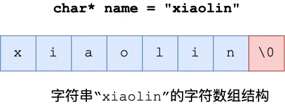
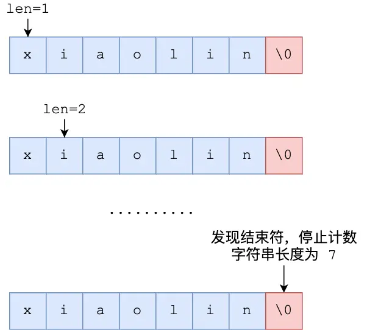
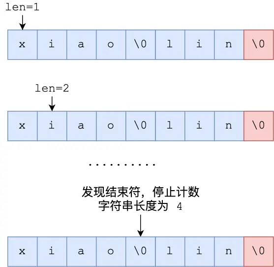
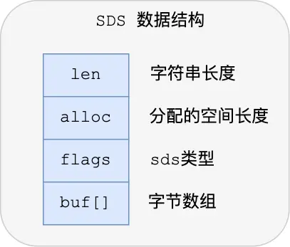
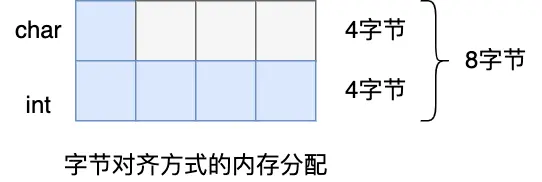
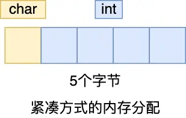

## 前言：为什么 Redis 不直接用 C 字符串？

字符串在 Redis 中无处不在，无论是键（Key）还是值（Value），字符串都是核心数据类型之一。

Redis 是用 C 语言编写的，但它并没有直接采用 C 语言传统的 `char*` 字符数组来表示字符串。相反，Redis 设计并实现了一种名为**简单动态字符串**（Simple Dynamic String，简称 SDS）的数据结构。

你可能会问，既然 C 语言已经有了字符串类型，为什么 Redis 还要“重复造轮子”呢？答案很简单：C 语言的原生字符串在某些方面存在不足，无法完全满足 Redis 对高性能和安全性的要求。

接下来，我们先了解一下 C 语言字符串有哪些“痛点”，然后看看 Redis 的 SDS 是如何巧妙解决这些问题的。

## C 语言字符串的“痛点”

C 语言中的字符串本质上是一个以空字符 `\0` 结尾的字符数组。例如，字符串 "xiaolin" 在内存中的表示如下：



这种设计虽然简单，但也带来了一些问题：

### 1. 获取长度效率低：O(N) 复杂度

C 语言标准库函数（如 `strlen`）在计算字符串长度时，需要从头开始遍历字符数组，直到遇到 `\0` 结束符。这意味着获取字符串长度的时间复杂度是 O(N)，其中 N 是字符串的实际长度。对于长字符串，这个操作会比较耗时。



### 2. 二进制不安全：无法存储任意数据

由于 `\0` 被用作字符串的结束标志，C 字符串本身不能包含 `\0` 字符。如果字符串中间出现了 `\0`，那么字符串操作（如长度计算、拷贝等）会提前终止。

例如，对于字符串 "xiao\\0lin"，使用 `strlen` 计算其长度会得到 4，而不是实际的 7。



这个限制使得 C 字符串只能存储纯文本数据，无法安全地存储像图片、音频、视频等可能包含 `\0` 字符的二进制数据。

### 3. 缓冲区溢出风险：操作不安全

C 语言的字符串操作函数（如 `strcat` 用于拼接字符串）通常不检查目标缓冲区的剩余空间。它们假定开发者已经分配了足够的内存。如果这个假定不成立，就会发生**缓冲区溢出**，数据会写入到未授权的内存区域，轻则程序崩溃，重则可能导致安全漏洞。

```c
// 将 src 字符串拼接到 dest 字符串后面
char *strcat(char *dest, const char* src);
```

例如，`strcat` 函数在拼接时，不会检查 `dest` 是否有足够空间容纳 `src`。

### 4. 修改效率低：频繁的内存重分配

C 字符串本身不记录已分配的内存大小。当需要增长或缩短字符串时（例如，追加内容），程序通常需要：

1.  分配一个新的、更大（或更小）的内存块。
2.  将原来的字符串内容拷贝到新内存块。
3.  释放原来的内存块。
    这种操作涉及多次内存分配和数据拷贝，效率较低。

总结一下 C 语言字符串的主要缺陷：

- 获取字符串长度的时间复杂度为 O(N)。
- 以 `\0` 作为结尾，导致二进制不安全，不能存储任意数据。
- 字符串操作函数（如拼接）容易引发缓冲区溢出。
- 修改字符串（增长或缩短）时，内存管理复杂且效率不高。

为了克服这些限制，Redis 设计了 SDS。

## SDS：Redis 的解决方案

SDS (Simple Dynamic String) 是 Redis 自己实现的一种字符串数据结构。它通过在传统字符数组的基础上增加一些元数据，巧妙地解决了 C 字符串的诸多痛点。

### SDS 的结构设计

下图展示了 Redis 5.0 中 SDS 的基本结构：



一个 SDS 结构通常包含以下几个部分：

- **`len`**：一个整数，记录了 `buf` 数组中已存储字符串的实际长度（不包括末尾的 `\0`）。
- **`alloc`**：一个整数，记录了 `buf` 数组总共分配的内存空间大小（不包括末尾的 `\0`）。
- **`flags`**：一个字节，用于表示 SDS 的类型。Redis 设计了多种 SDS 类型以优化不同长度字符串的存储。
- **`buf[]`**：一个字符数组，实际存储字符串内容。与 C 字符串类似，SDS 也会在字符串末尾添加一个 `\0` 字符，这样做是为了能够兼容部分 C 语言标准库函数。但这并不会影响 SDS 存储包含 `\0` 的二进制数据，因为 SDS 依赖 `len` 属性来判断字符串的实际长度。

通过这几个元数据，SDS 带来了诸多优势。

### SDS 的核心优势

#### 1. O(1) 复杂度获取字符串长度

由于 SDS 结构中直接存储了字符串的长度（`len` 属性），获取字符串长度的操作只需要读取这个属性值即可，时间复杂度为 O(1)。这比 C 字符串的 O(N) 遍历高效得多。

#### 2. 二进制安全：可以存储任意数据

SDS 通过 `len` 属性来判断字符串的结束，而不是依赖 `\0` 字符。这意味着 `buf` 数组中可以包含任意二进制数据，包括 `\0` 字符本身。

虽然 SDS 也会在 `buf` 的末尾追加一个 `\0`（为了兼容 C 库函数），但这部分并不计入 `len` 中，也不会影响 SDS 对二进制数据的处理。因此，SDS 可以安全地存储文本、图片、音频等各种类型的数据。

#### 3. 杜绝缓冲区溢出：安全的字符串操作

SDS 在进行字符串修改操作（如拼接、拷贝）时，会首先检查 `alloc` 记录的已分配空间是否足够。

- 如果空间足够，直接进行修改。
- 如果空间不足，SDS 会自动进行扩容，分配足够大的新内存空间，然后再执行修改操作。

这种机制确保了 SDS 在操作过程中不会发生缓冲区溢出，提高了代码的安全性。

**智能的内存预分配与惰性空间释放策略：**

为了进一步提高效率，SDS 在扩容时采用了“空间预分配”策略：

- 当修改后 SDS 的长度 `len` 小于 1MB 时，程序分配新空间时，`alloc` 的大小会是 `len` 的两倍。也就是说，如果修改后字符串长度是 10 字节，SDS 会分配 20 字节的空间（`len=10`, `alloc=20`），其中有 10 字节的未使用空间。
- 当修改后 SDS 的长度 `len` 大于等于 1MB 时，程序会额外多分配 1MB 的未使用空间。即 `alloc` 的大小会是 `len + 1MB`。

```c
// SDS 扩容规则的简化逻辑
hisds hi_sdsMakeRoomFor(hisds s, size_t addlen) // addlen 是需要增加的长度
{
    // ... 省略部分代码 ...
    size_t avail = sdsavail(s); // 获取当前可用空间
    // 如果可用空间足够，则无需扩展
    if (avail >= addlen) return s;

    size_t len = sdslen(s); // 获取当前字符串长度
    size_t newlen = (len + addlen); // 修改后至少需要的总长度

    // 根据新长度决定如何分配空间
    if (newlen < HI_SDS_MAX_PREALLOC) // HI_SDS_MAX_PREALLOC 通常是 1MB
        // 如果新长度小于 1MB，则分配所需空间的两倍
        newlen *= 2;
    else
        // 如果新长度大于等于 1MB，则额外分配 1MB
        newlen += HI_SDS_MAX_PREALLOC;

    // ... 执行实际的内存重分配 ...
}
```

这种**空间预分配**策略的好处是，当下次再对 SDS 进行增长操作时，如果预分配的空间足够，就不需要再次进行内存重分配，从而减少了内存分配的次数，提高了性能。

相应地，当 SDS 字符串缩短时，SDS 并不会立即回收多出来的空间，而是通过 `len` 属性更新实际长度，多余的空间就成了未使用的空间，可以供后续的增长操作使用。这被称为**惰性空间释放**。

#### 4. 节省内存空间：多种 SDS 类型与紧凑结构

为了更有效地利用内存，Redis 为 SDS 设计了多种头部结构（通过 `flags` 字段区分），以适应不同长度的字符串：

- `sdshdr5` (Redis 3.2 之后不再使用，被 `sdshdr8` 的 `flags` 低 3 位表示类型，高 5 位表示长度所取代)
- `sdshdr8`
- `sdshdr16`
- `sdshdr32`
- `sdshdr64`

这些类型的区别主要在于 `len` 和 `alloc` 成员变量的数据类型大小不同，从而使得存储短字符串时，头部结构本身占用的内存也更少。

例如：

- `sdshdr8`: `len` 和 `alloc` 通常是 `uint8_t` 类型，最大长度约 2^8 - 1。
- `sdshdr16`: `len` 和 `alloc` 是 `uint16_t` 类型，最大长度约 2^16 - 1。
- `sdshdr32`: `len` 和 `alloc` 是 `uint32_t` 类型，最大长度约 2^32 - 1。
- `sdshdr64`: `len` 和 `alloc` 是 `uint64_t` 类型，用于超大字符串。

```c
// 示例：sdshdr16 和 sdshdr32 的结构 (注意：实际 Redis 源码中 flags 的位置和作用更复杂)
struct __attribute__ ((__packed__)) sdshdr16 {
    uint16_t len;          // 16位无符号整数存储长度
    uint16_t alloc;        // 16位无符号整数存储已分配空间
    unsigned char flags;   // 标志位，表示类型等信息
    char buf[];            // 实际字符数组
};

struct __attribute__ ((__packed__)) sdshdr32 {
    uint32_t len;          // 32位无符号整数存储长度
    uint32_t alloc;        // 32位无符号整数存储已分配空间
    unsigned char flags;   // 标志位
    char buf[];            // 实际字符数组
};
```

通过这种方式，Redis 可以根据字符串的实际大小选择最合适的 SDS 头部结构，避免了不必要的内存浪费。

此外，Redis 在定义这些结构体时，使用了 `__attribute__ ((__packed__))` 编译指令（GCC 特性）。这个指令告诉编译器取消结构体成员变量之间的对齐填充字节，使得结构体按照实际占用的字节数进行内存分配，从而进一步节省内存。

**`__attribute__ ((__packed__))` 的作用示例：**

考虑一个普通的 C 结构体：

```c
#include <stdio.h>

struct test1 {
    char a; // 1字节
    int b;  // 4字节
 } test1_instance; // 变量名修正为 instance

int main() {
     printf("sizeof(test1_instance) = %lu\n", sizeof(test1_instance)); // 打印结构体大小
     return 0;
}
```

在大多数编译器和体系结构下，`sizeof(test1_instance)` 的结果通常是 8 字节。这是因为编译器为了提高内存访问效率，会对结构体成员进行**字节对齐**。`char a` 占 1 字节，但为了让接下来的 `int b` (通常是 4 字节对齐) 从一个合适的地址开始，编译器会在 `a` 和 `b` 之间填充 3 个字节。



而如果使用了 `__attribute__ ((__packed__))`：

```c
#include <stdio.h>

struct __attribute__((packed)) test2  {
    char a; // 1字节
    int b;  // 4字节
 } test2_instance; // 变量名修正为 instance

int main() {
     printf("sizeof(test2_instance) = %lu\n", sizeof(test2_instance)); // 打印结构体大小
     return 0;
}
```

此时，`sizeof(test2_instance)` 的结果会是 5 字节 (1 字节 for `char a` + 4 字节 for `int b`)。编译器取消了对齐填充，使得结构体更加紧凑。



通过这些精心设计，SDS 在保证功能强大和安全的同时，也兼顾了内存使用效率。

## 总结

Redis 的 SDS 通过引入 `len`、`alloc` 和 `flags` 等元数据，并结合巧妙的内存管理策略（如空间预分配、惰性释放、多种头部类型和紧凑结构），成功地克服了传统 C 语言字符串在效率、安全性和功能上的诸多限制。这使得 SDS 成为 Redis 高性能和可靠性的重要基石之一。
